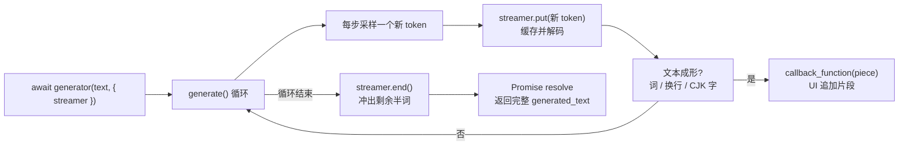

import { Canvas, Controls, Meta } from '@storybook/addon-docs/blocks';
import * as Streaming from './streaming.stories';

<Meta of={Streaming} name="Docs" />

# 流式输出

文本生成是一条 token 接一条 token 的循环：模型每步采样一个新 token，直到 EOS 或长度上限。普通调用把这整个循环藏起来——`await` 期间界面一片空白，Promise resolve 后才一次性拿到全文。流式输出在这个循环上开了一个观察口：`TextStreamer` 挂在生成调用上，每当一段文本「成形」就回调一次，把片段逐个追加到界面，用户在生成进行中就能开始阅读。

本课覆盖 `TextStreamer` 的两个回调与跳过选项、pipeline 的 `streamer` 传法、流式与一次性的取舍，以及高频回调下的节流渲染写法。读完本页你应该能预测实例的行为：调整「提示词」或「max_new_tokens」后重新生成，画布上的文本逐段出现（英文按词、中文几乎逐字），读数里「片段数」通常小于「token 数」；关闭「skip_prompt」，生成开始前整段提示会先被回显。



| `TextStreamer` 构造选项 | 默认值 | 回查要点 |
| --- | --- | --- |
| `callback_function` | `null` | 每当一段文本成形（词 / 行 / CJK 字）时调用，参数是字符串片段；不传时逐段 `console.log` |
| `token_callback_function` | `null` | 每个生成步调用一次，参数是本步新 token 的 id（`bigint[]`）；计数、计时放这里 |
| `skip_prompt` | `false` | 跳过生成开始前整段推入的提示 token；只对 decoder-only 模型有感 |
| `skip_special_tokens` | `true` | 解码时跳过特殊 token；与 `decode()` 的同名选项一致 |
| `decode_kwargs` | `{}` | 额外传给 `tokenizer.decode` 的选项；构造时多写的选项也会并入这里 |

## 快速上手

最小闭环三步：创建 pipeline（实例只创建一次）→ 构造 `TextStreamer` 并接好回调 → 把它作为 generate 选项传进调用。

```js
import { pipeline, TextStreamer } from '@huggingface/transformers';

// 1. 创建文本生成 pipeline：实例只创建一次，可反复生成
const generator = await pipeline(
  'text-generation',
  'onnx-community/SmolLM2-135M-Instruct-ONNX',
);

// 2. 构造 streamer：每有一段文本成形，就追加一次
let streamed = '';
const streamer = new TextStreamer(generator.tokenizer, {
  skip_prompt: true, // 不回显提示，只要新增内容
  callback_function: (piece) => {
    streamed += piece;
  },
});

// 3. 生成：streamer 与 max_new_tokens 一样，是 generate 选项之一
const messages = [{ role: 'user', content: 'Tell me a joke about JavaScript.' }];
const output = await generator(messages, {
  max_new_tokens: 48,
  do_sample: false,
  streamer,
});
// await 期间 streamed 已被多次追加；resolve 后 output[0].generated_text
// 是完整对话（末位是 assistant 消息），与 streamed 累积的内容一致
```

下面的内嵌实例执行的就是这段逻辑，并把每次回调的片段实时画上画布。**首次打开会下载约 129 MB 的 q8 模型文件，需要数秒到数十秒**（取决于带宽），完成后进入浏览器缓存。实例为免安装依赖改用官方 CDN 版本加载库（模式与 [1.2 第一个 pipeline](?path=/docs/first-pipeline--docs) 相同），流式代码与本节一致。

<Canvas of={Streaming.Interactive} />
<Controls of={Streaming.Interactive} />

| 读者操作 | 可观察证据 |
| --- | --- |
| 等待首次加载 | 「状态」从 加载中 变为 就绪，画布显示下载百分比与加载用时 |
| 切换「提示词」或拖动「max_new_tokens」 | 重新生成；文本逐段出现，「token 数」「片段数」「速度」读数实时变化 |
| 选择中文提示词 | 文本几乎逐字出现——解码结果每落下一个 CJK 字符就冲出一次缓存 |
| 关闭「skip_prompt」 | 生成前先把渲染后的提示整段回显（system / user / assistant 各段都在），再继续生成回答 |
| 打开 Show code | 查看实例实际执行的 `text-streamer.ts`，rAF 合帧在 `scheduleDraw` |

## TextStreamer：generate 循环上的观察口

`TextStreamer` 围绕 tokenizer 构造（解码靠它），通过 generate 选项进入循环。生成循环对它只做三件事——这是所有回调时机的总纲（v4.3.0 源码 `modeling_utils.js` 的 `generate()`，节选简化）：

```js
// generate() 内部（简化）
streamer.put(all_input_ids);         // ① 循环开始前：整段提示 token 一次性推入
while (true) {
  // …前向、采样出一个新 token…
  streamer.put(generated_input_ids); // ② 每个生成步：新 token 推入
  if (stop) break;
}
streamer.end();                      // ③ 循环结束：冲出缓存中剩余文本
```

推进来的 token 先进内部缓存，`TextStreamer` 每步重新解码整个缓存、把「成形的部分」切出来交给回调；生成结束时 `end()` 负责冲出最后一段。两个硬边界：流式只支持单条输入（`put` 收到多行批次直接抛错）；回调被同步调用，生成循环不会 `await` 回调返回的 Promise。

### callback_function：文本成形才回调

参数是字符串片段，追加显示用它。什么算「成形」由源码里的词边界启发式决定（v4.3.0 `streamers.js`）：

| 时机 | 回调内容 |
| --- | --- |
| `skip_prompt: false` 时的第一次 `put` | 整段提示文本一次性回调 |
| 解码结果以换行结尾 | 冲出缓存，整行一起回调 |
| 解码结果末尾是 CJK 字符 | 立即冲出——中文等 CJK 文本几乎逐字回调 |
| 其余情况 | 冲到最后一个空格为止——英文按词回调，半个词留在缓存 |
| `end()`（生成结束） | 冲出缓存里最后的半词 |

所以 `callback_function` 不等于每个 token 一次：英文一段约等于一个词，中文约等于一个字；最后一段文本通常在 Promise resolve 前夕才到。实例读数里「片段数」通常小于「token 数」，就是这条启发式的直接证据。不传 `callback_function` 时它默认逐段 `console.log`，打开控制台就能看到流的节奏。

### token_callback_function：每个生成步一次

参数是本步新 token 的 id（`bigint[]`，单条输入每步一个元素）。它在解码之前调用，不受词边界启发式影响——精确的计数、计时、逐 token 动画等「节拍」逻辑放这里：

```js
const streamer = new TextStreamer(generator.tokenizer, {
  callback_function: (piece) => appendText(piece),
  token_callback_function: (ids) => {
    generated += ids.length; // 每步必到一次的精确计数
  },
});
```

最后采到的那枚 EOS 也会先推给 streamer、随后生成才停止（停止判断在 `put` 之后），所以用它统计的 token 数可能比可见文本多 1；而默认 `skip_special_tokens: true` 时，这枚 EOS 不会产生任何文字。`skip_prompt: true` 时提示部分连 `token_callback_function` 也不会触发——计数天然只统计生成的 token。

### skip_prompt：跳过进流的提示

`skip_prompt` 只控制上面①的那次推入：设为 `true`，整段提示 token 直接跳过，不回调、不显示。聊天模型经 chat 模板渲染后的提示相当长（含 system 段与各角色内容），不跳过就会先被整段回显——在实例中关闭「skip_prompt」即可看到：回显文本里 system / user / assistant 各段与换行结构都在，只是 `<|im_start|>` 这类特殊标记因 `skip_special_tokens: true` 被剥掉了。

这个选项只对 decoder-only 模型有感。encoder-decoder 模型（T5、Whisper 等）的提示走 encoder，streamer 只见到 decoder 的起始 token，提示文本从不进流——此时 `skip_prompt` 开或关都看不到差别，也没有提示可跳。

### skip_special_tokens 与 decode_kwargs

`skip_special_tokens` 默认 `true`：特殊 token（EOS、`<|im_end|>` 等）到达时先冲出缓存、再被跳过，不产生文字；设为 `false` 可以看到它们随流输出。构造时多写的选项会并入 `decode_kwargs`，原样传给 `tokenizer.decode`（decode 的完整选项见 [2.1.1 tokenizer](?path=/docs/tokenizer--docs)）：

```js
const streamer = new TextStreamer(generator.tokenizer, {
  skip_special_tokens: true,
  clean_up_tokenization_spaces: false, // 多写的选项并入 decode_kwargs
});
```

## 接到 pipeline 与 generate 上

pipeline 的 `streamer` 是 generate 选项之一，和 `max_new_tokens` 并排写进调用参数；chat 输入与字符串输入都支持：

```js
// chat 输入：输出是消息数组，末位是新增的 assistant 消息（return_full_text 对 chat 恒为 false）
await generator(messages, { max_new_tokens: 48, streamer });

// 字符串输入：return_full_text 默认 true，输出含提示本身
await generator('Once upon a time,', { max_new_tokens: 32, streamer });
```

绕过 pipeline 的手工链路（[2.1.2 model 前向推理](?path=/docs/model-inference--docs) 的 AutoModel）同理：`await model.generate({ inputs, max_new_tokens, streamer })`，tokenizer 用 `AutoTokenizer.from_pretrained` 拿，streamer 的构造完全一样。

### 流式与一次性：结果相同，首字时间不同

流式不改变生成过程本身——同样的采样流程、同样的停止判断。差别只在「多早能看见」，以及每步多一次增量解码（解码整个缓存，长输出时开销随长度增长）：

| | 一次性 `await generator(text)` | 流式（加 `streamer`） |
| --- | --- | --- |
| 最终返回值 | `[{ generated_text }]` | 相同 |
| 结果内容 | 同一采样配置下相同（如 `do_sample: false`） | 相同 |
| 首段文本可见 | 生成全部结束后 | 头几个 token 内（第一段成形即见） |
| 额外成本 | — | 每步一次增量解码 + 你的渲染 |

选型一句话：给程序吃的（分类、抽取、批处理后处理）用一次性，拿 Promise 返回值就够；给人看的（聊天界面、长文续写）用流式，等待感从「全文生成完」提前到「第一个词」。参数如何影响生成内容本身（温度、采样、惩罚项），见 [2.2.1 生成参数](?path=/docs/generation-options--docs)——两个话题互相独立：流式换呈现时机，不换生成行为。

## 节流与批量渲染

回调至多每个生成步一次，频率的上限就是生成速度：WASM 上小模型每秒几个到几十个 token，WebGPU 往往更快。每个片段都改一次 DOM 或重绘一次画布，渲染开销可能反超推理本身。渲染侧的标准做法是合帧：回调只把片段攒进缓冲区、置一个脏标记，`requestAnimationFrame` 里每帧最多重绘一次。

```js
let buffer = '';
let framePending = false;

const streamer = new TextStreamer(generator.tokenizer, {
  callback_function: (piece) => {
    buffer += piece; // ① 回调只攒数据
    if (!framePending) {
      framePending = true;
      requestAnimationFrame(() => {
        framePending = false; // ② 每帧最多渲染一次
        render(buffer);
      });
    }
  },
});
```

本页实例就是这一模式：画布重绘由 rAF 合帧，readout 读数在共享支架里另有 100ms 节流。两层合帧之后，无论生成多快，渲染节奏都锁定在屏幕刷新率。职责划分也顺着回调粒度来：精确计数与计时用 `token_callback_function`（每步必到），文字呈现才用 `callback_function`；回调内不做异步等待——生成循环是同步调用回调的，异步工作排进队列交给 rAF 或后续任务消化。

## 最佳实践

- **给程序一次性，给人看流式。** 后处理管线（分类、抽取、批量任务）直接用 Promise 返回值；面向用户的生成加 `streamer`，把等待感从「全文完成」提前到「第一个词」。
- **渲染合帧，全文以返回值为准。** 回调攒片段 + rAF 合帧；流式累积文本只用于过程展示，最终展示与落库用 resolve 后的 `generated_text`——两边出自同一 decode 路径，内容一致，用它做一次校准最稳妥。
- **需要 id 级控制时继承 `BaseStreamer`。** 想自定义解码节奏、接自己的渲染器或做逐 token 动画，继承 `BaseStreamer` 实现 `put(value)` 与 `end()` 两个方法即可——提示推入、每步推入、结束冲刷这些调用时机由 generate 循环安排好；语音转写直接用现成的 `WhisperTextStreamer`（时间戳分块回调，见 [3.3.1 语音识别](?path=/docs/speech-recognition--docs)）。

## 常见问题

- `callback_function` 迟迟不触发，或一次蹦出一大段
  词边界启发式的正常行为：半个词留在缓存，等空格、换行、CJK 字符或 `end()` 才冲出。想要每 token 即时上屏，改用 `token_callback_function` 拿 id 自己 decode，代价是可能显示词中碎片。
- 换成 T5 / Whisper 类模型后，`skip_prompt` 完全没有效果
  encoder-decoder 模型的提示走 encoder、从不经过 streamer，`skip_prompt` 只对 decoder-only 模型有感——不回显不是 bug，本来就无提示可跳。
- 流式时报错 `TextStreamer only supports batch size of 1`
  streamer 只支持单条输入，`put` 收到多行批次直接抛错。批量推理去掉 `streamer`，或改为逐条调用、各自挂 streamer。
- 在别的文档里见到 `text_generation_stream` 或 `TextGenerationStreamOutputStream`
  那是 `@huggingface/inference`（调用 Hugging Face 服务端推理端点）的 API；transformers.js v2 / v3 / v4 都没有这个导出，浏览器与本地流式一律用 `TextStreamer`。

## 总结回顾

摘要：

生成是一条 token 接一条 token 的循环，`TextStreamer` 把这个循环暴露给界面：generate 循环开始前整段推入提示、每步推入新 token、结束时冲出剩余缓存。`callback_function` 在文本「成形」时回调——英文按词、CJK 逐字、换行整行、最后半词在 `end()` 才到，所以片段数通常小于 token 数；`token_callback_function` 每个生成步必到一次（含最后采到的 EOS），计数计时放这里。`skip_prompt` 跳过那次提示推入，但只对 decoder-only 模型有感；`skip_special_tokens` 与并入 `decode_kwargs` 的额外选项决定解码细节。`streamer` 与 `max_new_tokens` 并排写进 pipeline 调用参数，`model.generate` 同样可接；流式不改变生成结果与最终返回值，只把首字可见时间提前到头几个 token。高频回调交给「攒缓冲 + rAF 合帧」消化，最终全文以 resolve 后的 `generated_text` 为准。

一句话：

> 流式不改变生成结果，只改变你多早看见它——`callback_function` 出文字（按词成形），`token_callback_function` 出节拍（每步一次），渲染侧合帧消化高频回调。

知识要点：

- `TextStreamer` 的构造选项有哪些？默认值各是什么？
- `callback_function` 在哪些时机被触发？为什么英文按词、中文几乎逐字？
- `token_callback_function` 与 `callback_function` 的分工是什么？EOS 会不会到达回调？
- `skip_prompt` 跳过的是哪一次推入？为什么对 encoder-decoder 模型无效？
- pipeline 与 `model.generate` 分别怎么接 streamer？流式与一次性的返回值关系是什么？
- 回调频率高时，渲染侧的标准做法是什么？为什么回调里不能做异步等待？
- 什么时候需要继承 `BaseStreamer` 自己实现 streamer？

## 参考资料

- [generation/streamers API](https://huggingface.co/docs/transformers.js/en/api/generation/streamers)
  `TextStreamer` / `WhisperTextStreamer` / `BaseStreamer` 的构造选项、默认值与方法签名。
- [pipelines API](https://huggingface.co/docs/transformers.js/en/api/pipelines)
  `TextGenerationPipeline` 的调用方式：chat 输入、generate 选项透传（含 `streamer`）。
- [tokenizers API](https://huggingface.co/docs/transformers.js/en/api/tokenizers)
  `decode` 的选项（`skip_special_tokens`、`clean_up_tokenization_spaces`），streamer 解码行为的来源。
- [v4.3.0 源码：generation/streamers.js](https://github.com/huggingface/transformers.js/blob/4.3.0/packages/transformers/src/generation/streamers.js)
  词边界启发式、`skip_prompt` 分支与 `end()` 冲刷的一手依据。
- [v4.3.0 源码：models/modeling_utils.js](https://github.com/huggingface/transformers.js/blob/4.3.0/packages/transformers/src/models/modeling_utils.js)
  `generate()` 循环中 `streamer.put` / `end` 的调用时机与同步调用方式。
- [onnx-community/SmolLM2-135M-Instruct-ONNX](https://huggingface.co/onnx-community/SmolLM2-135M-Instruct-ONNX)
  本课示例模型；q8 权重约 129 MB，ChatML 对话模板，eos 为 `<|im_end|>`。
- [@huggingface/transformers（npm）](https://www.npmjs.com/package/@huggingface/transformers)
  CDN 引入的官方写法与版本发布记录。
