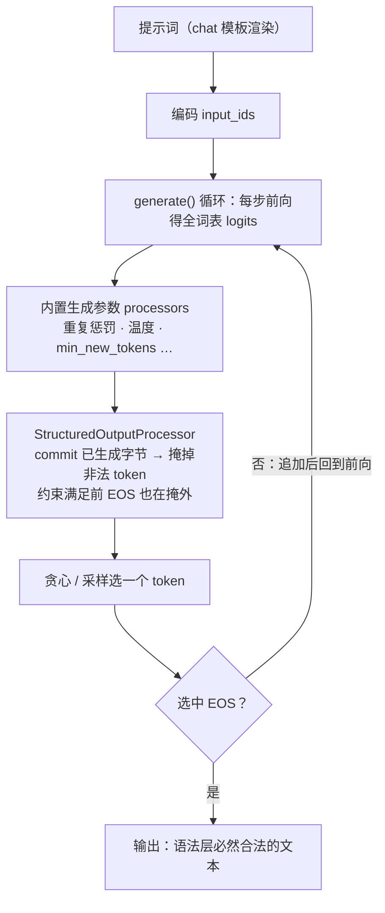

import { Canvas, Controls, Meta } from '@storybook/addon-docs/blocks';
import * as StructuredOutput from './structured-output.stories';

<Meta of={StructuredOutput} name="Docs" />

# 结构化输出与工具调用

`generate()` 默认返回自由文本——同一句提示，今天输出 JSON、明天输出散文，下游代码没法稳定消费。本课讲文本生成的两条「可编程出口」，互补而非竞争：

- **结构化输出**（v4.3.0，独立包 `@huggingface/transformers-structured-output`）：把约束下沉到每一步的 token 选择。`StructuredOutputProcessor` 在生成循环里按约束状态机掩掉非法 token，模型从第一个 token 起就只能输出能拼成目标格式的字节——JSON schema、JSON object 或正则表达式在**语法层被硬保证**。
- **工具调用**（v4.2.0，pipeline 参数 `tools`）：库只把工具定义渲染进提示词，模型按训练时的格式发起「调用请求」；解析、执行、回填结果、再生成，整个循环由应用完成。库负责**告知**，不负责**代跑**。

读完本页你应该能预测实例的行为：无论「提示词」怎么改、语义跑多偏，「JSON 可解析」读数恒为 是；「Schema 校验」只看结构是否符合预设，与内容是否切题无关。

| | 结构化输出 | 工具调用 |
| --- | --- | --- |
| 引入版本 | v4.3.0，独立包 `@huggingface/transformers-structured-output` | v4.2.0，`TextGenerationPipeline` 参数 `tools` |
| 机制层级 | logits 掩码——选词前拦截 | chat 模板——提示词内注入 |
| 库保证 | 语法层硬保证（格式必然合法） | 无保证，取决于模板与模型 |
| 库职责 | 掩掉非法 token、放开 EOS | 把 `tools` 渲染进提示词 |
| 应用职责 | 提供约束、解析结果 | 定义工具、解析调用、执行、回填 |
| 成熟度 | 官方标注 experimental，一次约束一条序列 | 官方测试覆盖「转发」行为，其余在应用侧 |

`StructuredOutputProcessor` 构造时从三种 `ResponseFormat` 里选一种（约束类型的完整回查）：

| `type` | 附加键 | 约束到 | 典型用途 | 关键边界 |
| --- | --- | --- | --- | --- |
| `json_schema` | `json_schema` | JSON Schema 2020-12 实用子集 | 固定字段抽取、分类标签 | `pattern` / 可识别 `format` 构造时直接报错 |
| `json_object` | —— | 任意合法 JSON 对象 | 先保证可解析，字段后校验 | 不查字段、不查类型 |
| `regex` | `regex` | 正则全串匹配 | 日期、ID 等紧凑格式 | 不支持环视、反向引用、懒惰量词 |



## 快速上手

最小闭环是「加载 → 构造处理器 → 注入生成调用 → JSON.parse」四步：

```js
import { pipeline } from '@huggingface/transformers';
import { StructuredOutputProcessor } from '@huggingface/transformers-structured-output';

const generator = await pipeline(
  'text-generation',
  'onnx-community/SmolLM2-135M-Instruct-ONNX',
);

// 可选预热：把词表结构（几百毫秒级）从首次生成挪到加载期
StructuredOutputProcessor.warmup(generator.tokenizer);

// 每种约束一个 processor；它继承 LogitsProcessorList，随调用进入 logits 处理链
const processor = new StructuredOutputProcessor(generator.tokenizer, {
  type: 'json_schema',
  json_schema: {
    type: 'object',
    properties: {
      sentiment: { enum: ['positive', 'negative', 'neutral'] },
      topic: { enum: ['price', 'quality', 'delivery', 'other'] },
    },
    required: ['sentiment', 'topic'],
    additionalProperties: false,
  },
});

const messages = [
  { role: 'user', content: 'Classify this feedback: The product is way too expensive.' },
];
const output = await generator(messages, {
  max_new_tokens: 128,
  do_sample: false,
  logits_processor: [processor], // 数组形式，随调用透传给 model.generate()
});
console.log(output[0].generated_text.at(-1).content);
// {"sentiment": "negative", "topic": "price"}
```

`logits_processor` 与 `do_sample`、`max_new_tokens` 并列，是 generate 选项之一（参数从哪里传入、优先级如何，见 [2.2.1 生成参数](?path=/docs/generation-options--docs)）。主库自己的处理器（重复惩罚、温度等）先执行，约束掩码**最后**执行——不管前面怎么调参，被掩掉的 token 都不可能被选中（v4.3.0 源码 `modeling_utils.js`：`processors.extend(logits_processor)` 追加在处理链末尾）。

下面的内嵌实例执行的就是这段逻辑。**首次打开会下载约 129 MB 的 q8 模型文件，需要数秒到数十秒**；与 2.2.1 / 2.2.2 的实例共享浏览器缓存，再次加载显著变快。实例免安装依赖：主库沿用官方 CDN（jsdelivr，与 [1.2 第一个 pipeline](?path=/docs/first-pipeline--docs) 相同）；约束包是独立发布物，其 ESM 产物里有一行对主库的裸模块引用，浏览器无法解析裸模块名，实例把这一行改写到与 pipeline **同一份**主库实例上再导入（见 Show code 的 `load` 部分）——npm 项目按本节开头的 import 写法即可，不需要任何改写。

<Canvas of={StructuredOutput.Interactive} />
<Controls of={StructuredOutput.Interactive} />

| 读者操作 | 可观察证据 |
| --- | --- |
| 等待首次加载 | 「状态」从 加载中 变为 就绪，画布显示下载百分比与加载用时 |
| 保持默认提示词生成 | 输出为紧凑 JSON；「JSON 可解析」恒为 是，「Schema 校验」为 是 |
| 把「提示词」换成与分类无关的句子 | 输出仍是合法 JSON——约束不保证内容切题，枚举值可能填得不合语义 |
| 切换「约束预设」到 城市信息卡 | 输出字段变为 city / country / population；「Schema 校验」仍为 是 |
| 切换到 仅合法 JSON（json_object） | 字段不再受限；「Schema 校验」显示 —（无 schema 可校验） |
| 打开 Show code | 查看实例实际执行的 `json-constraint.ts`：CDN 双加载、`warmup` 与 `logits_processor` 注入 |

## 结构化输出：每一步的 token 掩码

`StructuredOutputProcessor` 是 `LogitsProcessorList` 的子类（v4.3.0 源码），构造时做两件事：把 tokenizer 词表编成 **trie**（每个 token 是一段 UTF-8 字节），再把约束编译成**字节级状态机**。生成期间每个 transform 步骤它会：

1. **commit** 新生成的 token——按词表把 token 映射回字节，推进状态机；
2. **fillMask**——从当前状态沿 trie 走一遍，凡是「推进后仍可能到达接受态」的 token 保留，其余 token 的 logits 一律置 `-Infinity`；
3. **放开 EOS**——仅当已生成的字节已经满足约束时，tokenizer 的 EOS token 才被保留进候选，生成由此经内置停止准则自然结束。

这就是「硬约束」的含义：非法 token 的分数是 `-Infinity`，贪心取不到、采样抽不中，没有「重试」环节。三个直接推论，都是使用边界：

- **eos 一致性**：处理器放开的是 tokenizer 的 EOS，停止判断用的是 generation config 的 `eos_token_id`，两者必须一致——不一致时生成会在约束外撞见 EOS 并抛错。本课模型 SmolLM2 两处都是 id 2（`<|im_end|>`），满足前提。
- **batch 只能为 1**：约束状态是单条序列的可变状态，逻辑 batch size 不为 1 时直接抛错，而不是共享出错的状态。
- **token 预算要给足**：约束未满足前 EOS 一直被掩住——模型想停也停不了；`max_new_tokens` 用尽就直接截断，得到不完整的 JSON。给预算的原则：按 schema 最长合法输出估算再留余量（官方说明同样是「set a sufficient token budget」）。

一个输出观感细节：JSON 模式下连续空白 token 会被软惩罚（惩罚随连续次数放大，连续 4 个直接禁止，源码核实），所以默认输出是紧凑的 `{"a":1,"b":2}` 风格，而不是带缩进的多行 JSON。

### json_schema

约束到给定的 JSON Schema。引擎实现的是 2020-12 的**实用子集**（包 README 核实），不是完整规范：

| 支持面 | 关键字与能力 |
| --- | --- |
| 支持 | 深层 `const` / `enum`、精确数值边界与 `multipleOf`、tuple 数组与同构数组、`contains`、深层 `uniqueItems`、对象属性与依赖断言、`allOf` / `anyOf` / `oneOf` / `not`、条件式、本地 `$ref` 与递归 `$defs`、draft-07 兼容、根级 `x-guidance` 分隔符 |
| 构造时报错 | 字符串 `pattern`；`date`、`email`、`uuid` 等可识别的 `format`——它们无法被增量保证 |
| 不支持 | 外部与动态 `$ref`、`unevaluatedProperties` / `unevaluatedItems`；未知的 `format` 名保留为注解 |

报错发生在**构造 processor 时**（schema 编译阶段），不是生成中——把 `pattern` 改成 `enum` 收紧取值，或把格式校验挪到应用层（`JSON.parse` 之后查），是标准处理路径。实例的「反馈分类」「城市信息卡」两个预设就是 json_schema 约束：切换预设后输出字段随 schema 变化，「Schema 校验」读数给出结构匹配证据。

### json_object

`{ type: 'json_object' }` 等价于只声明 `{ type: 'object' }` 的 schema：任何**合法 JSON 对象**都被接受，字段名、字段数、类型都不查。适合两类场景：字段集合事先定不下来（先保证可解析，应用层再校验）；或者作为排查基线——「json_object 可解析但 json_schema 不产出」说明问题出在 schema 本身（过严或含不支持的关键字）。实例第三个预设展示的就是它：「Schema 校验」读数显示 —（无 schema 可校验），与两个 json_schema 预设形成对照。

### regex

`{ type: 'regex', regex: '...' }` 把输出约束到正则的**全串匹配**：从输出的第一个字节到 EOS 前的最后一个字节必须整体匹配。例如只允许 ISO 形式的日期：

```js
const processor = new StructuredOutputProcessor(generator.tokenizer, {
  type: 'regex',
  regex: '\\d{4}-\\d{2}-\\d{2}',
});
```

引擎支持的语法是 JavaScript 正则的子集（包 README 核实）：

| 支持面 | 语法 |
| --- | --- |
| 支持 | 字面量与 UTF-8 字面量、`\|` 交替、分组、字符类、`.`、`\d` `\s` `\w`、锚点、贪婪量词 `*` `+` `?` `{m,n}` |
| 不支持 | 环视、反向引用、懒惰量词、Unicode 字符类（`\p{…}`）——构造或匹配时会得到不支持的行为，先实测 |

正则适合**紧凑的字符级格式**（日期、编号、单字段值）；一旦结构开始嵌套，改用 json_schema 更可维护。与 JSON 模式一样：输出满足正则的「接受态」后 EOS 才被放开。

## 工具调用：tools 只进提示词，执行在你

v4.2.0 起，`TextGenerationPipeline` 的调用参数新增 `tools`（还有同批的 `documents` 与 `chat_template`）。它做的事只有一件：chat 输入时随消息一起交给 `tokenizer.apply_chat_template`，由模型的 Jinja 模板渲染进提示词；tokenizer 的模板是字典且含 `tool_use` 键时，传了 `tools` 会优先用该模板（v4.3.0 源码 `pipelines/text-generation.js`、`tokenization_utils.js` 核实）。

**库不做的三件事**：不解析模型输出中的调用请求、不执行函数、不把结果回填再生成。这三步加上「追加消息」，就是应用侧的完整闭环：

```js
// tools 形态以模型模板为准：Qwen3 等模板把每个 tool 原样 tojson 渲染，
// 常见约定是 OpenAI function 形态
const tools = [
  {
    type: 'function',
    function: {
      name: 'get_weather',
      description: 'Get the current weather in a city',
      parameters: {
        type: 'object',
        properties: { location: { type: 'string' } },
        required: ['location'],
      },
    },
  },
];

const messages = [{ role: 'user', content: 'What is the weather like in Paris?' }];
const reply = await generator(messages, { tools, max_new_tokens: 128, do_sample: false });
const text = reply[0].generated_text.at(-1).content;
// 训练过工具调用的模型此时可能输出调用请求，如：
// <tool_call>{"name": "get_weather", "arguments": {"location": "Paris"}}</tool_call>

const call = parseToolCall(text); // ① 应用解析（正则 / JSON，格式随模型）
if (call) {
  const result = await runTool(call); // ② 应用执行（本地计算或 fetch）
  messages.push({ role: 'assistant', content: text });
  messages.push({ role: 'tool', content: JSON.stringify(result) }); // ③ 回填
  const final = await generator(messages, { tools, max_new_tokens: 128 }); // ④ 再生成
  // final[0].generated_text.at(-1).content 是综合工具结果的回答
}
```

能否走通这条路，前提有两个，都**不在库的控制范围内**：

- **模板支持**：模型的 `chat_template` 得有渲染 `tools` 的逻辑。本课实例用的 SmolLM2 是纯 ChatML 模板，不含任何 tools 处理——传了 `tools` 完全无感，提示词里不会出现工具痕迹；Qwen3 的模板则有 `# Tools` 段（源码核对过两者的 `tokenizer_config.json`）。
- **模型训练过**：模板会渲染工具，不代表模型会发起调用。135M 级别别指望可靠的工具调用行为；要演示或原型，选 Qwen3-0.6B 这类带 tool_use 模板且训练过的模型。

适用边界一句话：浏览器端本地模型的工具调用是「模板渲染 + 应用手搓循环」的组合，适合演示与原型；需要可靠的多轮编排时，把循环状态管理放在应用框架里，或改用服务端推理。工具的**参数结构**同样是结构化输出的用武之地——给模型输出套上 JSON 约束，解析侧就不用再猜格式（两条路线在这里汇合）。

## 最佳实践

- **语法靠约束，语义靠 schema 设计。** 掩码保证「格式对」，不保证「值对」：小模型会把枚举值填得不合提示词语义。收紧手段都在 schema 侧——字段用 `enum` 闭集、`required` 补全、`additionalProperties: false` 禁多余字段；实例里换提示词后「Schema 校验」仍为 是，就是这条边界的直接证据。
- **预算先行。** 约束未满足时 EOS 被禁，`max_new_tokens` 用尽截断出不完整 JSON（不可解析）。schema 越复杂合法输出越长：两个示例 schema 完整输出约 15~35 token，实例给 128；新 schema 先粗估再留余量。
- **warmup 一次，processor 按约束复用。** `StructuredOutputProcessor.warmup(tokenizer)` 在模型加载后调用一次，把词表 trie 的构建成本付清；此后每种约束 new 一个 processor 即可（构造只做 schema 编译），同约束反复生成直接复用实例。
- **工具调用先查模板再选模型。** 拿不准模型行不行时，先看 `tokenizer_config.json` 的 chat 模板里有没有 tools 逻辑，再确认模型是工具调用训练对齐过的版本——两步都能省掉「传了 tools 没反应」的排查。

## 常见问题

- 构造 processor 时抛 `TypeError: ...pattern cannot be enforced incrementally and is unsupported.`
  schema 里用了 `pattern` 或可识别的 `format`（`date`、`email`、`uuid` 等）——token 级增量引擎无法保证正则匹配，构造阶段直接拒绝。改用 `enum` 收紧取值，或把校验移到应用层；真正的字符格式匹配用 `regex` 约束单独表达。
- 生成结束但 `JSON.parse` 失败，输出是不完整的 JSON
  `max_new_tokens` 太小：约束满足前 EOS 被掩住，模型停不下来，预算用尽被硬截断。调大预算；若调大仍截断，检查 schema 是否过严导致引擎「无路可走」（掩码全空会抛 dead end 错误）。
- 报错 `StructuredOutputProcessor currently supports batch size 1; received N`
  约束处理器一次只支持一条序列。批量输入（消息数组套数组）改为逐条调用、各自构造或复用同一 processor。
- 报错 `StructuredOutputProcessor observed the tokenizer EOS token after generation continued.`
  tokenizer 的 EOS 与 generation config 的 `eos_token_id` 不一致（模型仓库配置问题）——约束侧放开了 EOS，停止侧却不认识它。核对模型仓库两处配置一致后使用；SmolLM2 均为 id 2。
- 传了 `tools` 但提示词里没有工具、模型也从不发起调用
  按顺序查两层：模型 chat 模板不含 tools 逻辑时该参数完全无感（SmolLM2 即是）；模板支持但模型没训练过工具调用时，渲染了也不会发起。换 Qwen3 这类模型再试。

## 总结回顾

摘要：

文本生成的两条可编程出口解决了同一个问题——让输出能被程序消费。结构化输出（v4.3.0 的 `@huggingface/transformers-structured-output` 包）把 `StructuredOutputProcessor` 以 `logits_processor: [processor]` 注入生成调用：每步 commit 已生成字节、沿词表 trie 计算合法 token 集、把其余 logits 置 `-Infinity`，约束满足时才放开 EOS——语法层硬保证，没有重试。三种约束中，`json_schema` 支持 2020-12 实用子集（`pattern` 与可识别 `format` 构造时报错），`json_object` 只保证合法 JSON 对象，`regex` 做全串匹配；一次一条序列、eos 两处配置必须一致、token 预算要给足。工具调用（v4.2.0 起的 pipeline `tools` 参数）方向相反：库只把工具定义渲染进提示词，解析、执行、回填、再生成整个循环在应用侧完成；能否走通取决于模型模板支持与模型训练，SmolLM2 这类纯 ChatML 模板传了也无感。

一句话：

> 结构化输出把「输出合法性」从应用侧的事后校验挪到生成侧的每一步掩码；工具调用则相反——库只把工具写进提示词，解析与执行始终是应用的事。

知识要点：

- `StructuredOutputProcessor` 的三种 `ResponseFormat` 分别约束什么？`logits_processor` 怎么传进生成调用？
- 掩码在 logits 处理链的哪一步执行？EOS 何时被放开？为什么 tokenizer 与 generation config 的 eos 必须一致？
- json_schema 支持哪些关键字？哪些会构造时报错？`json_object` 与 `regex` 各适合什么场景？
- 为什么约束未完成时 `max_new_tokens` 用尽会截断出不完整 JSON？
- `tools` 参数在库内的实际处理路径是什么？库明确不做哪三件事？
- 一次完整工具调用循环需要应用做哪四步？两个前提是什么？
- `warmup` 与 processor 复用各自解决什么成本问题？

## 参考资料

- [@huggingface/transformers-structured-output（npm）](https://www.npmjs.com/package/@huggingface/transformers-structured-output)
  约束包的 README 与用法：三种 `ResponseFormat`、JSON Schema 支持范围、regex 语法表、batch 1 与 eos 一致性边界。
- [Transformers.js v4.3.0 Release Notes](https://github.com/huggingface/transformers.js/releases/tag/v4.3.0)
  structured output 的发布公告与官方示例（json_schema + pipeline + `logits_processor` + streamer）；token 预算提示。
- [Transformers.js v4.2.0 Release Notes](https://github.com/huggingface/transformers.js/releases/tag/v4.2.0)
  `tools` 加入 `TextGenerationPipeline` 的版本依据（PR #1655）。
- [PR #1758：structured output 包](https://github.com/huggingface/transformers.js/pull/1758)
  约束包的实现与合并记录。
- [PR #1655：tools 转发](https://github.com/huggingface/transformers.js/pull/1655)
  `tools` 的官方测试——仅断言转发给 `apply_chat_template`，「库不做解析执行」的依据。
- [structured-output 源码：StructuredOutputProcessor.ts（v4.3.0）](https://github.com/huggingface/transformers.js/blob/4.3.0/packages/transformers-structured-output/src/StructuredOutputProcessor.ts)
  掩码、EOS 放开、batch 1 校验与连续空白惩罚的一手实现。
- [modeling_utils.js（v4.3.0 源码）](https://github.com/huggingface/transformers.js/blob/4.3.0/packages/transformers/src/models/modeling_utils.js)
  `logits_processor` 的接入点（`processors.extend` 追加在内置处理器之后）。
- [pipelines/text-generation.js（v4.3.0 源码）](https://github.com/huggingface/transformers.js/blob/4.3.0/packages/transformers/src/pipelines/text-generation.js)
  `tools` / `documents` / `chat_template` 的转发实现与 `TextGenerationSpecificParams` 定义。
- [tokenization_utils.js（v4.3.0 源码）](https://github.com/huggingface/transformers.js/blob/4.3.0/packages/transformers/src/tokenization_utils.js)
  `apply_chat_template` 与 `tool_use` 模板的选择逻辑；`tools` 形态指向 chat templating 指南。
- [onnx-community/SmolLM2-135M-Instruct-ONNX](https://huggingface.co/onnx-community/SmolLM2-135M-Instruct-ONNX)
  本课示例模型：q8 权重约 129.4 MB；ChatML 模板（无 tools 逻辑）；eos `<|im_end|>`（id 2）与 generation_config 一致。
- [onnx-community/Qwen3-0.6B-ONNX](https://huggingface.co/onnx-community/Qwen3-0.6B-ONNX)
  工具调用的模型参考：chat 模板含 `# Tools` 段（`tool | tojson` 渲染）。
- [Chat templating 指南（Automated function conversion）](https://huggingface.co/docs/transformers/main/en/chat_templating#automated-function-conversion-for-tool-use)
  tools 对象形态的权威说明（transformers.js 的 tokenizer JSDoc 引用）。
