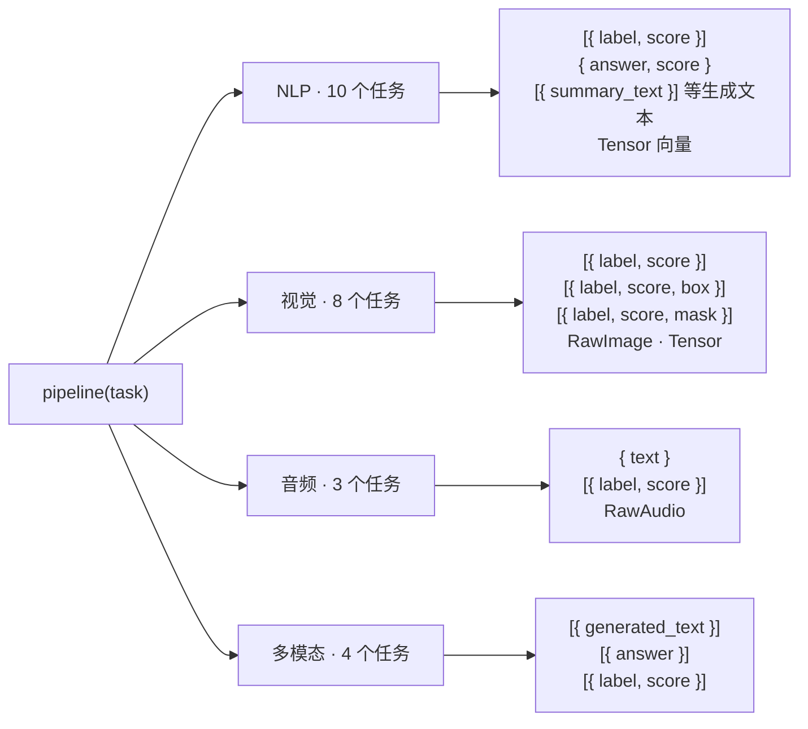

import { Meta } from '@storybook/addon-docs/blocks';

<Meta id="task-overview" title="上手/任务全景" name="Docs" />

# 任务全景

`pipeline()` 的第一个参数 `task` 是这张地图的坐标：一个任务 ID 对应一种输入约定、一套输出形态——选任务就是选输出契约，模型只负责往契约里填内容。本课按 NLP、视觉、音频、多模态四张表过一遍 v4.3.0 全部 25 个 pipeline 任务（任务 ID、做什么、输出形态、默认模型），任务清单同时用官方任务支持表与 4.3.0 源码注册表核实；官方表上标记了但库内不支持的条目（text-to-image、visual QA 等）单独列成边界表。

本课是横向入口：只回答「选哪个任务、拿到什么形状」；每个任务的参数细节与实战代码由第 3 章各任务课程承载，表格最后一列给出入口。输出形态均按**单条输入**标注，批量输入（传数组）时返回嵌套数组的判断见文末「常见问题」。



任务别名速查表（`TASK_ALIASES`，4.3.0 源码核实）——短名写法都能用，但注册表里只有右列任务：

| 你写的 task | 实际任务 | 备注 |
| --- | --- | --- |
| `sentiment-analysis` | `text-classification` | [1.2 第一个 pipeline](?path=/docs/first-pipeline--docs) 的示例别名 |
| `ner` | `token-classification` | 命名实体识别 |
| `asr` | `automatic-speech-recognition` | |
| `text-to-speech` | `text-to-audio` | |
| `embeddings` | `feature-extraction` | 向后兼容别名 |
| `translation_xx_to_yy` | `translation` | 如 `translation_en_to_zh` |

## 快速上手

调用模板只有两行，换任务 = 换一个任务字符串。下面用 `fill-mask` 演示（预测句中 `[MASK]` 位置的词），输入输出都是官方示例：

```js
import { pipeline } from '@huggingface/transformers';

// 不指定模型时自动使用任务默认模型（fill-mask 默认 onnx-community/ettin-encoder-32m-ONNX）
const unmasker = await pipeline('fill-mask');

// 默认返回 5 个候选（top_k 默认 5）
const output = await unmasker('The capital of France is [MASK].');
// [
//   { score: 0.5151872038841248, token: 7785,  token_str: ' Paris',  sequence: 'The capital of France is Paris.'  },
//   { score: 0.033725105226039886, token: 42268, token_str: ' Lyon',   sequence: 'The capital of France is Lyon.'   },
//   ... 共 5 条，按 score 从高到低排序（输出值取自官方文档示例）
// ]
```

可观察结果：`sequence` 是把 `[MASK]` 替换后的完整句子，`token_str` 是预测词本身，`score` 是置信度——和 1.2 课的 `[{ label, score }]` 相比，输出契约完全不同，这正是本课四张表要提前告诉你的事。

边界：首次运行会下载所选任务的默认模型，体积因任务而异，下载与缓存行为见[第一个 pipeline](?path=/docs/first-pipeline--docs)；部分任务的默认模型在注册表里自带固定 `dtype`（`text-generation` 默认 q4，`fill-mask`、`feature-extraction`、`image-feature-extraction`、`text-to-audio` 默认 fp32），档位取舍见 [2.3.1 device 与 dtype](?path=/docs/device-dtype--docs)。

## NLP 任务

共 10 个，输入都是文本（字符串或字符串数组）。可以分两族记忆：**理解类**打标签、抽答案、填空、转向量，输出结构固定、字段可直接读；**生成类**续写、翻译、摘要，输出是文本，但字段名随任务不同——`summary_text`、`translation_text`、`generated_text` 各归各的任务。

| 任务 ID | 做什么 | 输出形态（单条输入） | 默认模型（4.3.0） | 手册课程 |
| --- | --- | --- | --- | --- |
| `text-classification`（别名 `sentiment-analysis`） | 给整段文本打类别标签（情感、主题等） | `[{ label, score }]` | `Xenova/distilbert-base-uncased-finetuned-sst-2-english` | [3.1.1 文本分类与零样本](?path=/docs/text-classification--docs) |
| `token-classification`（别名 `ner`） | 给每个 token 打标签（命名实体识别等） | `[{ word, score, entity, index }]`；`aggregation_strategy: 'simple'` 聚合为 `entity_group` | `Xenova/bert-base-multilingual-cased-ner-hrl` | [3.1.2 token 分类](?path=/docs/token-classification--docs) |
| `question-answering` | 在给定上下文中抽取答案片段 | `{ answer, score }`（v4 暂无 start/end）| `Xenova/distilbert-base-cased-distilled-squad` | [3.1.3 问答与摘要](?path=/docs/qa-summarization--docs) |
| `fill-mask` | 预测句中 `[MASK]` 处的词 | `[{ sequence, score, token, token_str }]`（默认 5 条） | `onnx-community/ettin-encoder-32m-ONNX` | — |
| `summarization` | 把长文压缩成摘要 | `[{ summary_text }]` | `Xenova/distilbart-cnn-6-6` | [3.1.3 问答与摘要](?path=/docs/qa-summarization--docs) |
| `translation`（可写 `translation_xx_to_yy`） | 翻译 | `[{ translation_text }]` | `Xenova/t5-small` | [3.1.3 问答与摘要](?path=/docs/qa-summarization--docs) |
| `text2text-generation` | 指令式文本到文本生成（Seq2Seq） | `[{ generated_text }]` | `Xenova/flan-t5-small` | [2.2.1 生成参数](?path=/docs/generation-options--docs) |
| `text-generation` | 自回归续写与对话（CausalLM） | `[{ generated_text }]`；聊天消息输入时返回消息数组 | `onnx-community/Qwen3-0.6B-ONNX` | [2.2.1 生成参数](?path=/docs/generation-options--docs) |
| `zero-shot-classification` | 把文本排进候选标签，无需训练 | `[{ sequence, labels, scores }]`（第二参传候选标签） | `Xenova/distilbert-base-uncased-mnli` | [3.1.1 文本分类与零样本](?path=/docs/text-classification--docs) |
| `feature-extraction`（别名 `embeddings`） | 文本转向量 | `Tensor`，默认不池化（`[batch, seq, dim]`） | `onnx-community/all-MiniLM-L6-v2-ONNX` | [3.1.4 embedding](?path=/docs/embeddings--docs) |

边界：`feature-extraction` 的 `pooling` / `normalize` 选项能直接产出句子级向量；官方任务表上的 `sentence-similarity` 在 v4 中没有对应 pipeline，向量相似度自己算，见下文「不支持的任务」。

## 视觉任务

共 8 个，输入是图像——URL 字符串、`URL`、`Blob`、`RawImage`、`HTMLCanvasElement` 都可以（4.3.0 `ImageInput` 类型定义核实），预处理由库自动完成，`RawImage` 的细节见 [2.1.3 processor 与多模态输入](?path=/docs/processor--docs)。输出分四族：分数数组（分类）、带边界框的数组（检测）、直接返回图像（分割、深度、抠图、图到图）、向量 `Tensor`（图像特征提取）。

| 任务 ID | 做什么 | 输出形态（单条输入） | 默认模型（4.3.0） | 手册课程 |
| --- | --- | --- | --- | --- |
| `image-classification` | 整图分类 | `[{ label, score }]` | `Xenova/vit-base-patch16-224` | [3.2.1 图像分类与目标检测](?path=/docs/image-classification-detection--docs) |
| `object-detection` | 找出目标并框出位置 | `[{ label, score, box }]`，`box = { xmin, ymin, xmax, ymax }` | `Xenova/detr-resnet-50` | [3.2.1 图像分类与目标检测](?path=/docs/image-classification-detection--docs) |
| `zero-shot-object-detection` | 按候选文本标签检测目标 | 同上（第二参传 `candidate_labels`） | `Xenova/owlvit-base-patch32` | [3.2.1 图像分类与目标检测](?path=/docs/image-classification-detection--docs) |
| `image-segmentation` | 像素级分割出各区域 | `[{ label, score, mask }]`，`mask` 是 `RawImage` | `Xenova/detr-resnet-50-panoptic` | [3.2.2 分割与深度估计](?path=/docs/segmentation-depth--docs) |
| `depth-estimation` | 单目深度估计 | `{ predicted_depth, depth }`，`depth` 是 `RawImage` 深度图 | `onnx-community/depth-anything-v2-small` | [3.2.2 分割与深度估计](?path=/docs/segmentation-depth--docs) |
| `background-removal` | 抠图去背景 | `RawImage`（透明背景图） | `Xenova/modnet` | [3.2.3 背景移除](?path=/docs/background-removal--docs) |
| `image-to-image` | 图到图变换（超分辨率、修复） | `RawImage` | `Xenova/swin2SR-classical-sr-x2-64` | — |
| `image-feature-extraction` | 图像转向量 | `Tensor` | `onnx-community/dinov3-vits16-pretrain-lvd1689m-ONNX` | — |

边界：分割的 `mask` 与抠图返回的 `RawImage` 都能直接画到 canvas 或转 `blob` 使用，合成手法见 [3.2.3 背景移除](?path=/docs/background-removal--docs)；SAM 提示分割没有 pipeline 入口，见下文「不支持的任务」。

## 音频任务

共 3 个，输入是音频——URL 字符串、`URL`、`Float32Array`、`Float64Array` 都可以（4.3.0 `AudioInput` 类型定义核实）。

| 任务 ID | 做什么 | 输出形态（单条输入） | 默认模型（4.3.0） | 手册课程 |
| --- | --- | --- | --- | --- |
| `automatic-speech-recognition`（别名 `asr`） | 语音转文字 | `{ text }`；开 `return_timestamps` 后多出 `chunks: [{ timestamp: [起, 止], text }]` | `Xenova/whisper-tiny.en` | [3.3.1 语音识别](?path=/docs/speech-recognition--docs) |
| `audio-classification` | 给音频打标签（关键词、声学事件） | `[{ label, score }]` | `Xenova/wav2vec2-base-superb-ks` | — |
| `text-to-audio`（别名 `text-to-speech`） | 文字转语音 | `RawAudio`（`{ audio, sampling_rate }`，`audio` 是 `Float32Array` 波形） | `onnx-community/Supertonic-TTS-ONNX` | [3.3.2 语音合成](?path=/docs/text-to-speech--docs) |

边界：识别与合成的音频输入输出都不是 HTMLAudioElement——`RawAudio.audio` 要自己喂给 Web Audio API 或编码成 WAV 播放，见 [3.3.2 语音合成](?path=/docs/text-to-speech--docs)。

## 多模态任务

共 4 个，共同点是输入跨两种模态（图文、音文）。两个 zero-shot 任务的调用形态与 supervised 任务不同：第二参传 `candidate_labels` 数组，模型不需要为固定类别训练过。

| 任务 ID | 做什么 | 输出形态（单条输入） | 默认模型（4.3.0） | 手册课程 |
| --- | --- | --- | --- | --- |
| `image-to-text` | 图生文：给图像写描述 | `[{ generated_text }]` | `Xenova/vit-gpt2-image-captioning` | [3.4.2 图生文与文档问答](?path=/docs/vlm-captioning--docs) |
| `document-question-answering` | 对文档图片提问 | `[{ answer }]` | `Xenova/donut-base-finetuned-docvqa` | [3.4.2 图生文与文档问答](?path=/docs/vlm-captioning--docs) |
| `zero-shot-image-classification` | 按候选文本标签给图像分类 | `[{ label, score }]`（第二参传 `candidate_labels`） | `Xenova/clip-vit-base-patch32` | [3.4.1 CLIP 图文匹配](?path=/docs/clip-image-matching--docs) |
| `zero-shot-audio-classification` | 按候选文本标签给音频分类 | `[{ label, score }]`（第二参传 `candidate_labels`） | `Xenova/clap-htsat-unfused` | — |

边界：现代 VLM（Florence-2、SmolVLM 等）同样走 `image-to-text` 任务 ID，能力远超默认的 vit-gpt2，选型见 [3.4.2 图生文与文档问答](?path=/docs/vlm-captioning--docs)。

## 不支持的任务

官方任务支持表（index 页）上有若干标记为不支持（n/a）或与库内实现不符的条目——选任务前先过这张边界表，别把表格当能力清单照抄：

| 任务 | 状态 | 出路与替代 |
| --- | --- | --- |
| `text-to-image` | 官方表标 n/a，不支持 | 本库定位是设备端「理解」类推理，不含扩散模型生成；文生图需其他方案，不在本手册范围 |
| `visual-question-answering` | 官方表标 n/a，不支持 | 用 `image-to-text` 的 VLM 换成提问式提示词近似（[3.4.2](?path=/docs/vlm-captioning--docs)）；`vqa` 别名在 4.3.0 源码中仍是 TODO 注释，未实现 |
| `mask-generation` | 官方表标 n/a，无 pipeline 入口 | SAM 类模型可组件化运行：`AutoProcessor` + `AutoModelForMaskGeneration`（官方示例 `Xenova/slimsam-77-uniform`），实战见 [3.2.2](?path=/docs/segmentation-depth--docs) |
| `table-question-answering`、`video-classification`、`unconditional-image-generation`、`audio-to-audio`、`tabular-classification`、`tabular-regression` | 官方表标 n/a，不支持 | 库内无对应实现 |
| `sentence-similarity` | 官方表标 ✅，但 4.3.0 无此 pipeline | 用 `feature-extraction` 取向量后自算余弦相似度（[3.1.4](?path=/docs/embeddings--docs)）；这是官方任务表的遗留标注——4.3.0 与 v3 源码注册表都没有这个任务 ID（本课已核实），直接调用会抛 `Unsupported pipeline` |
| `reinforcement-learning` | 官方表标 ✅，无文档无 pipeline | 库内没有对应任务 ID 与文档页，不要据此选任务 |

## 最佳实践

- **同一能力有 supervised 与 zero-shot 两个入口时，用「标签是否固定」来选。** 标签固定且模型有对应类别（如情感二分类、ImageNet 千类）选 supervised 任务，精度高、输出稳定；类别开放或临时变化（自定义候选词）选 zero-shot 任务，代价是输出受候选标签措辞影响。两者的输出形态刻意保持一致（分类都是 `[{ label, score }]`），后续代码切换成本低。
- **生成类任务先看字段名再写代码。** `summary_text`、`translation_text`、`generated_text` 各归各的任务，`text-generation` 还会因输入是字符串还是聊天消息数组而返回不同形态——把字段读取写成跟随任务切换的一层薄适配，比到处硬编码字段名省事。
- **边界表之外的能力，绕过 pipeline 走组件化。** pipeline 只是「tokenizer/processor + model + 后处理」的封装（1.2、2.1.2 课），任何导出为 ONNX 的架构都能用 `Auto*` 类直接跑——SAM（`mask-generation`）就是没有 pipeline 入口但能组件化运行的典型，见 [2.1.2 model 前向推理](?path=/docs/model-inference--docs)。

## 常见问题

- 调用 `pipeline('sentence-similarity')` 报 `Unsupported pipeline: sentence-similarity`
  官方任务表标了 ✅ 但 v4 并未实现（4.3.0 源码 `SUPPORTED_TASKS` 无此任务，本课已核实）。改用 `feature-extraction` 拿向量，再自己算余弦相似度（[3.1.4 embedding](?path=/docs/embeddings--docs)）。
- 任务 ID 拼错或写了一个不支持的任务，报 `Unsupported pipeline: xxx. Must be one of [...]`
  这条报错本身会列出全部合法任务 ID，直接照抄即可。注意 `vqa` 别名尚未实现，别从旧教程里照搬。
- 同一任务有时返回单层数组，有时返回数组的数组
  输出形态按输入条数嵌套：单条输入返回 `[{...}]`（或对象），传数组批量推理返回 `[[...], [...]]`。处理前用 `Array.isArray(output[0])` 判断是否批量结果，再决定展平还是逐条消费。

## 总结回顾

摘要：

`pipeline(task)` 的任务 ID 决定输入约定与输出形态：NLP 十个任务覆盖打标签（`text-classification`、`token-classification`、`zero-shot-classification`）、抽取与填空（`question-answering`、`fill-mask`）、生成与转换（`text-generation`、`text2text-generation`、`summarization`、`translation`）和向量化（`feature-extraction`）；视觉八个任务给出分数数组、边界框、分割掩码与变换后图像四族形态；音频三个任务在 `{ text }` 与 `RawAudio` 之间往返；多模态四个任务用图文、音文组合与 `candidate_labels` 完成零样本匹配。五个别名与 `translation_xx_to_yy` 规则让你用短名调用，注册表只认 `text-classification` 等全名。官方任务表上的 `text-to-image`、`visual-question-answering` 等条目库内不支持，`sentence-similarity` 是遗留标注——这些边界之外的能力走组件化推理。

一句话：

> 选任务就是选输出契约：任务 ID 定死输入怎么给、输出长什么样，四张任务表在手，换模型不换代码。

知识要点：

- 25 个 pipeline 任务按四模态怎么分组？每个任务的单条输出形态是什么？
- 五个别名与 `translation_xx_to_yy` 规则分别映射到哪个任务 ID？
- 哪些任务在官方任务表上标记了但 v4 不支持？各自的替代路径是什么？
- 同一能力的 supervised 与 zero-shot 入口怎样选择？两者输出形态有何关系？
- 批量输入时输出形态怎样变化？用什么判断处理？

## 参考资料

- [Transformers.js 官方文档 · 首页任务支持表](https://huggingface.co/docs/transformers.js/index)
  四模态任务分组与支持标记（含不支持条目）的官方清单。
- [pipelines API](https://huggingface.co/docs/transformers.js/en/api/pipelines)
  各 pipeline 类的调用示例与选项说明。
- [任务注册表源码 · SUPPORTED_TASKS / TASK_ALIASES（v4）](https://github.com/huggingface/transformers.js/blob/main/packages/transformers/src/pipelines/index.js)
  全部任务 ID、别名与默认模型的一手出处。
- [@huggingface/transformers 4.3.0 · types/pipelines](https://unpkg.com/browse/@huggingface/transformers@4.3.0/types/pipelines/)
  各任务输出类型的类型定义（`TextClassificationOutput`、`BoundingBox`、`RawImage` 等），本课输出形态的核对依据。
- [fill-mask pipeline 源码（v4）](https://github.com/huggingface/transformers.js/blob/main/packages/transformers/src/pipelines/fill-mask.js)
  快速上手示例（含官方输出值）与 `top_k` 默认值 5 的出处。
- [兼容模型目录 · library=transformers.js](https://huggingface.co/models?library=transformers.js)
  按任务挑选模型时在 Hub 上过滤兼容模型的入口。
