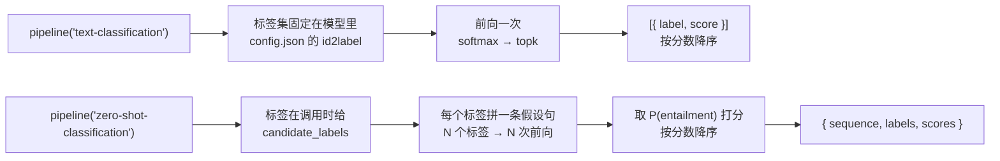
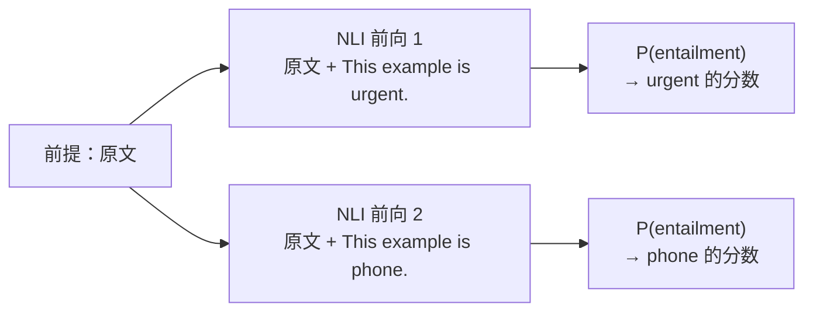

import { Canvas, Controls, Meta } from '@storybook/addon-docs/blocks';
import * as TextClassification from './text-classification.stories';

<Meta of={TextClassification} name="Docs" />

# 文本分类与零样本

给一段文本打标签有两个任务入口：`text-classification` 的标签集固定在模型里，训练时决定；`zero-shot-classification` 的标签集在调用时给出，写进假设句、用 NLI（自然语言推理）打分。[1.2 第一个 pipeline](?path=/docs/first-pipeline--docs) 已经用情感分类跑通了「加载 → 推理 → 输出」的最小闭环；本课在那条闭环之上深入监督管线的输出解读——`top_k`、二分类与多分类的差异、`score` 的含义——再引入零样本管线，回答标签开放时的问题：候选标签的粒度、假设句模板与 `multi_label` 开关各怎样改变结果。

读完本页你应该能预测两个实例的行为：在 `top_k` 的 1 与全部之间切换，画布在单条分数条与按分数降序的全部标签条之间变化，取全部时「分数合计」为 1.0000；把「分类模型」切到三分类，同一句中性文本不再被迫二选一；在零样本实例里改一个标签的措辞或打开 `multi_label`，分数条与合计读数随之改变。



| 参数 / 输入 | 所属任务 | 默认值 | 回查要点 |
| --- | --- | --- | --- |
| `task` | 两者 | — | `'text-classification'`（别名 `'sentiment-analysis'`）与 `'zero-shot-classification'` |
| 模型 ID（第二参） | 两者 | `null`：用任务默认模型 | text-classification 默认 `Xenova/distilbert-base-uncased-finetuned-sst-2-english`；zero-shot 默认 `Xenova/distilbert-base-uncased-mnli` |
| `top_k` | text-classification | `1` | `null` 返回全部；超过类别数被截断；只裁剪条数，不改变分数 |
| 推理输入 | 两者 | — | 字符串或字符串数组（数组即批量） |
| `candidate_labels` | zero-shot | 必填 | 字符串或数组；每个标签触发一次句对前向 |
| `hypothesis_template` | zero-shot | `'This example is {}.'` | `{}` 被候选标签替换 |
| `multi_label` | zero-shot | `false` | `true` 改为逐标签独立打分，分数合计不再为 1 |
| 输出形态（单条输入） | 两者 | — | `[{ label, score }]` / `{ sequence, labels, scores }` |

## 快速上手

两个任务各一段最小代码，注意调用形态的差异：

```js
import { pipeline } from '@huggingface/transformers';

// 监督分类：标签集固定在模型 config 里，调用只给文本
const classifier = await pipeline('text-classification');

// top_k: null 返回全部类别，按分数降序（top_k 默认 1 时只有第一条）
const ranked = await classifier('I love transformers!', { top_k: null });
// [{ label: 'POSITIVE', score: 0.999817686 }, { label: 'NEGATIVE', score: 0.000182314 }]
```

```js
// 零样本分类：第二参携带 candidate_labels；每个标签与原文拼成句对，各做一次前向
const zeroShot = await pipeline(
  'zero-shot-classification',
  'Xenova/mobilebert-uncased-mnli', // 比任务默认模型小得多（q8 约 27 MB 对 67.6 MB）
);
const result = await zeroShot(
  'I have a problem with my iPhone that needs to be resolved asap.',
  { candidate_labels: ['urgent', 'not urgent', 'phone', 'tablet', 'computer'] },
);
// { sequence: '…原文…', labels: […按分数降序…], scores: […] }
// labels 与 scores 一一对应、按分数降序排列
```

监督管线的第二参是推理选项；零样本管线的第二参里必填 `candidate_labels`——标签从模型属性变成了调用参数，输出形态也随之从 `[{ label, score }]` 变成 `{ sequence, labels, scores }`。首次运行会下载所选模型的 q8 权重（三个示例模型约 67.6 MB / 136 MB / 27 MB），下载与缓存行为见 [1.2 第一个 pipeline](?path=/docs/first-pipeline--docs)。

## text-classification：标签集固定在模型里

这条管线的输出契约 `[{ label, score }]` 里，一切都由模型决定，pipeline 不增删任何东西：

- **标签集**来自模型 `config.json` 的 `id2label`：二分类模型 2 条（如 SST-2 的 `NEGATIVE` / `POSITIVE`），多分类模型 N 条（如三分类情感模型的 `positive` / `neutral` / `negative`）。
- **分数的归一方式**由同一份 config 的 `problem_type` 决定：默认 `single_label_classification` 走 softmax，全部类别概率和为 1；`multi_label_classification` 走 sigmoid，各标签独立打分（v4 源码核实，见下文边界）。
- **排序**由 `topk` 完成，结果恒按 `score` 降序。

### top_k 与多结果输出

```js
const classifier = await pipeline('text-classification');

// top_k 默认 1：只返回分数最高的一个类别
const best = await classifier('I love transformers!');
// [{ label: 'POSITIVE', score: 0.999817686 }]

// top_k: null 返回全部类别；数值 k 返回前 k 个
const all = await classifier('I love transformers!', { top_k: null });
// [{ label: 'POSITIVE', score: 0.999817686 }, { label: 'NEGATIVE', score: 0.000182314 }]
```

三条规则（输出值取自 1.2 课示例；截断与返回结构经 v4 源码核实）：

- `top_k` 默认 `1`；设 `null` 返回全部类别；数值 `k` 返回前 `k` 个，且 `k` 先与类别数取小——在二分类模型上写 `top_k: 3` 仍只返回 2 条。
- 截断发生在归一化（softmax / sigmoid）**之后**：分数本身不随 `top_k` 改变，`top_k: 1` 只是看不见第二名而已。
- 返回结构：单条字符串输入恒为扁平数组（按 `score` 降序）；字符串数组批量输入返回按输入条数嵌套的数组。

下面的内嵌实例执行的就是这套逻辑。**首次打开会下载二分类模型（q8 约 67.6 MB），它与 1.2 / 2.1.2 课共用同一份文件，缓存通常直接命中**；切到三分类模型需另下载约 136 MB。实例为了免安装依赖，改用官方 CDN 版本加载库，推理代码与本节完全一致。

<Canvas of={TextClassification.Interactive} />
<Controls of={TextClassification.Interactive} />

| 读者操作 | 可观察证据 |
| --- | --- |
| 等待首次加载 | 「状态」从 加载中 变为 就绪，画布显示下载进度 |
| 把「top_k」切到 `null（全部标签）` | 画布画出全部标签条，「分数合计」读数为 1.0000 左右 |
| 把「top_k」切到 `3`（二分类模型下） | 「结果条数」仍为 2——超出类别数被截断 |
| 切换「示例文本」 | 各标签的分数条与读数同步变化，恒按分数降序 |
| 打开 Show code | 查看实例实际执行的 `supervised-classification.ts` |

### 二分类与多分类：输出长度由模型决定

类别数 = `id2label` 的条目数 = logits 的最后一维（2.1.2 课手工前向看到的 `[1, 2]` 形状，对应二分类；三分类模型是 `[1, 3]`）。二分类与多分类对同一份代码只改变一件事：**softmax 分母里类别的个数**，因此：

- 二分类：返回 2 条，第二条的概率 = 1 − 第一条（softmax 只在两类上归一）。
- 多分类：返回 N 条，全部加起来等于 1，中间类别（如 `neutral`）有了自己的位置。

用实例做一次对照：保持「示例文本」为「英文中性」（*The movie was okay, I guess.*），把「分类模型」从二分类切到三分类——二分类模型没有中性档，中性句被迫二选一，`POSITIVE` 分数虚高；三分类模型给出 `neutral` 胜出。**监督模型的输出差异全部来自标签集的设计**，这正是零样本分类要接管的问题。

两个贴着本点的边界：

- **语言覆盖由训练数据决定。** SST-2 只在英文上训练，中文输入能出结果但不可信；需要中文请用多语模型（实例中的三分类模型支持中文）或中文专用模型。
- **`problem_type: 'multi_label_classification'` 的模型走 sigmoid。** 例如 `Xenova/toxic-bert`（6 个毒性标签）：各标签独立打分、互不竞争，分数合计不再是 1——用这类模型时「全部标签」读数的含义随之改变，判断「文本符合哪些标签」而非「哪个标签最贴切」。

### score 怎么读

- `score` 是 softmax（或 sigmoid）之后的概率，范围 0 到 1；默认排序恒为降序，`[{ label, score }]` 第一条就是预测结果。
- 全部类别时分数合计为 1（实例的「分数合计」读数即此证据）；二分类下第二条 = 1 − 第一条。
- `score` 不是准确率：它是模型内部的相对读数，跨模型、跨标签集比较分数没有意义；同一模型、同一标签集之内的**排序**才有意义。量化档位（q8 与 fp32）之间会有小数点后几位的出入，见 [1.2 第一个 pipeline](?path=/docs/first-pipeline--docs) 的说明。

### 与手工链路的对应

`text-classification` pipeline 内部执行的就是 [2.1.2 model 前向推理](?path=/docs/model-inference--docs) 的手工链路，外加两步后处理（v4 源码顺序）：

| pipeline 内部 | 2.1.2 课对应 | 本课补充 |
| --- | --- | --- |
| `tokenizer(texts, { padding: true, truncation: true })` | ① 编码 | padding 与截断固定开启 |
| `model(model_inputs)` → `logits` | ② 前向 | logits 最后一维 = 类别数 |
| softmax（默认）或 sigmoid（`problem_type` 决定） | ③ 手工 softmax | 二分类、多分类、多标签的差异都发生在这一步 |
| `topk(logits, top_k)` + `id2label` 映射 | ③ argmax + id2label | `top_k` 默认 `1`，`null` 取全部，超出截断 |

所以 1.2 课看到的 `score` 就是手工 softmax 后的最大概率，两条链数值一致。需要 logits 本身、自定义温度或自定义标签映射时绕过 pipeline 手工解读，做法与判断标准见 [2.1.2 model 前向推理](?path=/docs/model-inference--docs)。

## zero-shot-classification：标签在调用时给

零样本分类的底层是一个 **NLI（自然语言推理）模型**：三分类器，判断「前提句」与「假设句」的关系是 entailment（蕴含）、neutral（中立）还是 contradiction（矛盾）。管线把原文当前提，把每个候选标签填进模板构成假设，逐对推理，取 P(entailment) 作为该标签的分数，最后按分数降序返回：



三个直接推论：

- **前向次数 = 标签数。** 每个标签一次句对前向，标签列表长度直接决定耗时，标签不要贪多。
- **分数来自假设句措辞。** 模型读到的是 *This example is urgent.* 这样的完整句子，改措辞就是改输入。
- **entailment 的位置由模型 config 的 `label2id` 标明**（本课模型为 0；缺失时回退 2 并打警告，v4 源码核实）。

单条输入的返回值是一个对象：`{ sequence, labels, scores }`，`labels` 与 `scores` 一一对应、按分数降序。

### candidate_labels：标签粒度决定结果

`candidate_labels` 必填，接受字符串或数组（字符串会自动包成数组）。它是零样本分类里唯一替代「训练」的东西，设计时做三个判断：

- **标签要能读通成假设句。** 标签会被填进 `This example is {}.`——`urgent` 读作 *This example is urgent.*，通顺；写成中文短语在英文 NLI 模型上就是一句模型没见过的话。
- **粒度与业务对齐。** 标签太粗（`good` / `bad`）退化成低配版情感模型；标签太细或写一堆同义词，互斥模式下 softmax 要把概率分摊给每个标签，分数互相稀释。
- **互斥模式下让候选集覆盖住噪声。** 给候选集加一个 `other` 类，语义不明的文本会把概率让给 `other`，而不是虚增到最不贴切的那个标签上。

下面的内嵌实例可以直接编辑标签集合验证这些判断。**首次打开需下载 NLI 模型（q8 约 27 MB）**；画布滚入视口后才开始加载，避免与本页上方实例同时下载。

<Canvas of={TextClassification.ZeroShot} />
<Controls of={TextClassification.ZeroShot} />

| 读者操作 | 可观察证据 |
| --- | --- |
| 等待首次加载（滚入视口后开始） | 「状态」从 加载中 变为 就绪，画布显示下载进度 |
| 编辑「candidate_labels」（逗号分隔） | 分数条即时重排——改标签即改结果 |
| 删除或增减标签 | 「标签数」读数同步变化，标签数 = 前向次数 |
| 打开 Show code | 查看实例实际执行的 `zero-shot-classification.ts` |

边界：本课示例 NLI 模型只支持英文。中文候选标签需要多语 NLI 模型（在 [兼容模型目录](https://huggingface.co/models?library=transformers.js) 过滤），它们的体积显著更大，按下载成本取舍。

### hypothesis_template：把标签写进假设句

`hypothesis_template` 默认 `'This example is {}.'`，`{}` 被每个候选标签替换。模板是提问的方式，换模板即换行为：

```js
// 默认模板：判断"这个例子是什么"
await zeroShot(text, { candidate_labels: ['urgent', 'phone'] });

// 换模板：把标签限定为情感解读，标签本身的含义随之收窄
await zeroShot(review, {
  candidate_labels: ['positive', 'negative'],
  hypothesis_template: 'This review expresses a {} sentiment.',
});
```

模板与标签是一体设计：改了模板就要重新核对一批样例，两边一起固定下来，不要只调一边。

### multi_label：互斥归一还是独立打分

`multi_label` 决定分数怎么归一（v4 源码核实）：

| `multi_label` | 打分方式 | 分数合计 | 适合的问题 |
| --- | --- | --- | --- |
| `false`（默认） | 全部标签的 entailment 分数一起 softmax | 恒为 1 | 这些候选里哪个最贴切？（互斥单选） |
| `true` | 每个标签独立 softmax（entailment 对 contradiction） | 各自独立，可全高 | 文本符合哪些标签？（多选，如既是 `urgent` 又是 `phone`） |

一个例外：候选只有一个标签时恒按独立方式打分（此时互斥 softmax 没有对象）——实例里把标签删到只剩一个，「分数合计」就等于该标签自己的分数。

在实例里切换 `multi_label` 开关：关（默认）时「分数合计」恒为 1.0000；打开后合计随文本内容浮动，多个标签可以同时高分。

## 最佳实践

- **按「标签是否固定」选任务。** 标签集固定且存在带对应训练类别的模型（情感、主题等）选 `text-classification`：一次前向、精度高、分数语义稳定；标签开放、多变或长尾（工单分类、内容标记的探索期）选 `zero-shot-classification`：不训练即可换标签，代价是每个标签一次前向、分数受措辞影响。两者输出都按分数降序，下游代码切换成本低。
- **把标签集合与模板当配置资产。** 零样本的输出完全由「标签措辞 × 假设句模板」决定；把标签数组与模板写进代码或配置，测过一批样例后固定，改动走代码评审——它们等同于模型的类别定义。
- **精度不够再训练专用模型。** 标签集长期固定、零样本精度与速度都不满足时，正确路径是标注数据训练或微调一个专用分类器——训练本身超出本手册边界，训练产物经 [5.2 自定义模型转换](?path=/docs/model-conversion--docs) 导出 ONNX 后进入本库，调用方式与本课完全一致。

## 常见问题

- 零样本最高分只有 0.4 左右，不知道能不能采信
  `multi_label` 关时分数是候选之间的相对占比，不是绝对置信度：top1 偏低说明没有标签贴切，先改标签集（措辞、粒度、加 `other` 类），而不是调阈值。
- 只改了候选标签里的一个词，整个排序就变了
  NLI 打分的对象是「标签填进模板后的假设句」，措辞就是输入。这是正常行为；把标签与模板固定成一份配置（见最佳实践），改动后重新核对一批样例。
- 中文文本在本课示例模型上结果乱跳
  本课三个示例模型里只有三分类多语模型训练过中文，SST-2 与 mobilebert-mnli 都只支持英文。监督任务找对应语言或多语版本，零样本找多语 NLI 模型（在 Hub 上用 `library=transformers.js` 过滤），注意它们体积明显更大。
- `top_k` 设了 3 却只返回 2 条
  `k` 会先与类别数取小再截取（v4 `topk` 源码），二分类模型最多 2 条，不是错误；想拿全部类别直接用 `top_k: null`。
- 批量推理加 `top_k: null` 时拿到了数组的数组
  输出按输入条数嵌套：单条字符串返回扁平数组，字符串数组返回嵌套数组。用 `Array.isArray(output[0])` 判断后再消费，任务全景课的批量判断同样适用（[1.3 任务全景](?path=/docs/task-overview--docs)）。

## 总结回顾

摘要：

本课在 1.2 课的最小闭环之上拆开了两种文本打标签的管线。`text-classification` 的输出契约由模型 config 决定：`id2label` 给出标签集（二分类 2 条、多分类 N 条），`problem_type` 决定 softmax 还是 sigmoid；`top_k` 只在归一化之后裁剪返回条数（默认 1，`null` 取全部，超出类别数截断），不改变分数本身；`score` 是归一化概率、恒按降序、全部类别时合计为 1，只在该模型的标签集内有相对意义；pipeline 内部就是 2.1.2 课手工链路加 `topk` 与 `id2label` 两步后处理。`zero-shot-classification` 用 NLI 模型给「原文 + 标签假设句」对打蕴含分：每个标签一次前向，`candidate_labels` 的措辞与粒度、`hypothesis_template` 的提问方式共同决定结果，`multi_label` 决定候选间互斥归一（合计 1）还是逐标签独立打分；标签固定选监督、标签开放选零样本、精度不够再训练专用模型。

一句话：

> 监督分类的标签集是模型的属性，零样本分类的标签集是你的输入——前者换来一次前向的精度，后者换来调用时的自由。

知识要点：

- `top_k` 的默认值、`null` 行为与截断规则是什么？它会改变分数本身吗？
- 二分类与多分类的输出差异来自哪里？`problem_type` 为 `multi_label_classification` 时输出有何不同？
- `score` 怎么读？为什么跨模型比较分数没有意义？
- `text-classification` pipeline 的内部步骤与 2.1.2 课的手工链路如何对应？
- 零样本分类里每个标签花几次前向？分数从哪里来？
- `candidate_labels` 的粒度、`hypothesis_template`、`multi_label` 分别怎样改变结果？

## 参考资料

- [pipelines API](https://huggingface.co/docs/transformers.js/en/api/pipelines)
  `text-classification` 的 `top_k` 选项与输出结构、`zero-shot-classification` 的 `candidate_labels` / `hypothesis_template` / `multi_label` 选项。
- [text-classification pipeline 源码（v4）](https://github.com/huggingface/transformers.js/blob/main/packages/transformers/src/pipelines/text-classification.js)
  `problem_type` 决定 softmax / sigmoid、`topk` + `id2label` 后处理与返回结构规则的出处。
- [zero-shot-classification pipeline 源码（v4）](https://github.com/huggingface/transformers.js/blob/main/packages/transformers/src/pipelines/zero-shot-classification.js)
  模板替换、句对编码、`multi_label` 两种 softmax 对象与 `label2id` 回退逻辑的出处。
- [utils/tensor.js · topk（v4）](https://github.com/huggingface/transformers.js/blob/main/packages/transformers/src/utils/tensor.js)
  `top_k` 为 `null` 取全部类别、数值超出类别数被截断的实现。
- [HF 任务页 · Zero-Shot Classification](https://huggingface.co/tasks/zero-shot-classification)
  NLI 蕴含打分原理的官方说明。
- [Xenova/distilbert-base-uncased-finetuned-sst-2-english](https://huggingface.co/Xenova/distilbert-base-uncased-finetuned-sst-2-english)
  实例二分类模型（`NEGATIVE` / `POSITIVE`，q8 约 67.6 MB），与 1.2 / 2.1.2 课共享缓存。
- [Xenova/distilbert-base-multilingual-cased-sentiments-student](https://huggingface.co/Xenova/distilbert-base-multilingual-cased-sentiments-student)
  实例三分类模型（`positive` / `neutral` / `negative`，多语，q8 约 136 MB）。
- [Xenova/mobilebert-uncased-mnli](https://huggingface.co/Xenova/mobilebert-uncased-mnli)
  实例零样本 NLI 模型（`ENTAILMENT` / `NEUTRAL` / `CONTRADICTION`，q8 约 27 MB）。
- [兼容模型目录 · library=transformers.js](https://huggingface.co/models?library=transformers.js)
  按语言与任务挑选替代模型（多语监督模型、多语 NLI 模型）的入口。
