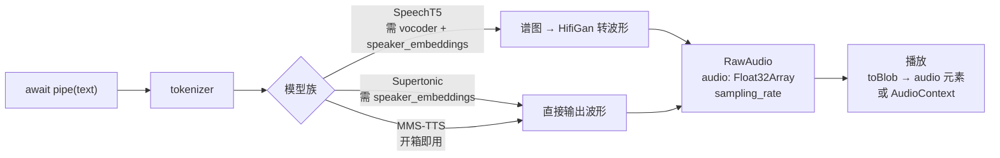

import { Canvas, Controls, Meta } from '@storybook/addon-docs/blocks';
import * as TextToSpeech from './text-to-speech.stories';

<Meta of={TextToSpeech} name="Docs" />

# 语音合成

`pipeline('text-to-speech')`（注册名 `text-to-audio` 的别名）把一段文本变成可直接播放的音频：输入字符串，输出 `RawAudio { audio: Float32Array, sampling_rate }`——单声道波形样本加采样率，交给 `<audio>` 或 Web Audio 就能发声。本课覆盖音频任务的输出侧；读取音频、预处理与转写的输入侧见 [3.3.1 语音识别](?path=/docs/speech-recognition--docs)。真正要做的选择是模型族：v4.3.0 注册表内有 SpeechT5（需 speaker_embeddings + vocoder）、Supertonic（默认模型）、MMS-TTS/VITS（体积最小、多语言）三族，它们决定了语言、音色和下载体积。

读完本页你应该能预测实例的行为：切换预置英文文本后，画布重绘合成波形，「时长」与「推理用时」读数变化，右下角音频控件可以直接点播。



| 关键输入 / 输出 | 必填 | 默认值 | 回查要点 |
| --- | --- | --- | --- |
| `task` | 是 | — | 注册名 `'text-to-audio'`；`'text-to-speech'` 是别名，二者等价 |
| `model` | 否 | `onnx-community/Supertonic-TTS-ONNX` | v4.3.0 注册表默认；fp32 约 251 MB，英文 |
| `options.dtype` | 否 | 随环境：浏览器 WASM 下 `'q8'` | 模型 config 里的 `transformers.js_config.dtype` 会覆盖它（如 speecht5 固定 `'fp32'`） |
| `options.device` | 否 | 浏览器固定 `'wasm'` | 不会自动切换 WebGPU；显式选择见 [2.3.1 device 与 dtype](?path=/docs/device-dtype--docs) |
| `speaker_embeddings`（推理选项） | SpeechT5 / Supertonic 必填 | `null` | 接受 URL 字符串 / `Float32Array` / `Tensor`；SpeechT5 用 512 维 x-vector |
| `num_inference_steps` / `speed`（推理选项） | 否 | `5` / `1.05` | 仅 Supertonic 读取 |
| 推理输出 | — | — | `RawAudio { audio: Float32Array, sampling_rate }`；输入字符串数组则返回 `RawAudio[]` |
| `vocoder`（SpeechT5 专用） | 否 | 自动加载 `Xenova/speecht5_hifigan` | 经 pipeline 固定以 fp32 加载；手动组合时传给 `generate_speech` |

## 快速上手

最小闭环三步：创建实例（一次）、合成、播放。

```js
import { pipeline } from '@huggingface/transformers';

// 创建 TTS 管线：实例只创建一次；示例模型 q8 约 36.6 MB，仅首次下载
const synthesizer = await pipeline('text-to-speech', 'Xenova/mms-tts-eng');

// 合成：一段文本 → RawAudio { audio: Float32Array, sampling_rate }
const out = await synthesizer('Hello, my dog is cute.');
// audio: Float32Array(32000)，sampling_rate: 16000

// 播放：toBlob() 直接给出 WAV Blob（32 位浮点 PCM），交给 audio 元素即可
const audio = new Audio(URL.createObjectURL(out.toBlob()));
audio.play(); // 需在用户手势触发的代码路径里调用，否则会被自动播放策略拦截
```

下面的内嵌实例执行的就是这段逻辑。**首次打开会下载约 36.6 MB 模型文件，需要数秒到数十秒**（取决于带宽），期间画布显示下载进度；完成后模型进入浏览器缓存，刷新或重开本页时加载显著变快。实例为了免安装依赖，改用官方 CDN 版本加载库，推理代码与本节完全一致。

<Canvas of={TextToSpeech.Interactive} />
<Controls of={TextToSpeech.Interactive} />

| 读者操作 | 可观察证据 |
| --- | --- |
| 等待首次加载 | 「状态」从 加载中 变为 就绪，画布显示下载百分比与加载用时 |
| 切换「示例文本」 | 波形重绘，「时长」与「推理用时」读数变化 |
| 点击右下角音频控件 | 直接播放合成结果（`toBlob()` 产出的 WAV） |
| 打开 Show code | 查看实例实际执行的 `tts-pipeline.ts` |

## 模型族与选型

`SUPPORTED_TASKS['text-to-audio']` 接受两组模型类：`AutoModelForTextToSpectrogram`（只有 SpeechT5）输出谱图，需要再加载一个 vocoder 才能变成波形；`AutoModelForTextToWaveform`（VITS、Supertonic、Musicgen）直接输出波形样本。Musicgen 是文生音乐，不在本课语音范围内。选型按「语言 → 体积 → 音色」三步：

| 模型族 | 代表模型 | 说话人 | 语言 | 下载体积（实测） | 特点 |
| --- | --- | --- | --- | --- | --- |
| SpeechT5 | `Xenova/speecht5_tts` | 多说话人（换 speaker_embeddings 换音色） | 英文 | fp32 约 613 MB（含 vocoder） | 音质好；v4.3.0 经 pipeline 报错，见常见问题 |
| Supertonic | `onnx-community/Supertonic-TTS-ONNX` | 10 个预置音色 | 英文 | fp32 约 251 MB（无量化档） | v4.3.0 默认模型；推理最快；44.1 kHz |
| MMS-TTS（VITS） | `Xenova/mms-tts-eng` | 单说话人 | 1100+ 语言（无普通话） | q8 约 36.6 MB | 体积最小；16 kHz；机器感明显 |

### SpeechT5：谱图 + vocoder，需要 speaker_embeddings

SpeechT5 先由编码器和解码器生成 mel 谱图，再由 vocoder 转成波形。在 transformers.js 里 vocoder 是独立模型 `Xenova/speecht5_hifigan`：经 pipeline 时会自动以 fp32 加载（约 52.9 MB），手动组合时自己传给 `generate_speech`。

speaker_embeddings 是说话人的 512 维 x-vector 向量，决定音色。官方文档用法是直接给预生成文件的 URL（`datasets/Xenova/transformers.js-docs/resolve/main/speaker_embeddings.bin`，约 2 KB），管线会自动 fetch 并包装成 Tensor；也可以传自己的 `Float32Array` / `Tensor`（手动组合时必须包成 `[1, length]` 形状的 Tensor）。想合成特定说话人的声音，就需要那个人的 x-vector——从参考音频提取 x-vector 的模型没有被转换到 transformers.js，这一步只能在库外完成。

```js
import {
  AutoTokenizer,
  SpeechT5ForTextToSpeech,
  SpeechT5HifiGan,
  Tensor,
} from '@huggingface/transformers';

const tokenizer = await AutoTokenizer.from_pretrained('Xenova/speecht5_tts');
// 模型 config 固定 fp32；官方注释明确建议全精度（量化后音质明显下降）
const model = await SpeechT5ForTextToSpeech.from_pretrained(
  'Xenova/speecht5_tts',
  { dtype: 'fp32' },
);
const vocoder = await SpeechT5HifiGan.from_pretrained('Xenova/speecht5_hifigan', {
  dtype: 'fp32',
});

// speaker_embeddings：512 维 x-vector，手动组合时包成 [1, length] 形状的 Tensor
const emb = new Float32Array(
  await (
    await fetch(
      'https://huggingface.co/datasets/Xenova/transformers.js-docs/resolve/main/speaker_embeddings.bin',
    )
  ).arrayBuffer(),
);
const speaker_embeddings = new Tensor('float32', emb, [1, emb.length]);

const { input_ids } = tokenizer('Hello, my dog is cute.');
const { waveform } = await model.generate_speech(input_ids, speaker_embeddings, {
  vocoder,
});
// waveform: Tensor，16000 Hz；停止阈值 threshold 默认 0.5，长度上限 maxlenratio 默认 20
```

注意体积：该模型 config 声明了 `transformers.js_config.dtype: 'fp32'`，所以经 pipeline 也会加载 fp32（encoder 约 326.9 MB + decoder 约 233.2 MB），加上 vocoder 合计约 613 MB——远超页面演示的合理预算。`dtype: 'q8'` 手动组合可降到约 170 MB（152 MB 模型 + 17.4 MB 量化 vocoder），实测可用但音质明显下降。

### Supertonic：v4.3.0 的默认模型

Supertonic TTS（v3.8.0 引入，2025 年 11 月）主打推理速度，采样率 44.1 kHz，自带 10 个预置音色（模型仓库 `voices/F1`–`F5`、`M1`–`M5`，每个约 50 KB）。它同样需要 speaker_embeddings，直接用模型仓库里的音色文件 URL；不传会直接报错：

```js
const synthesizer = await pipeline('text-to-speech', 'onnx-community/Supertonic-TTS-ONNX');

const out = await synthesizer('Hello there, how are you doing?', {
  speaker_embeddings:
    'https://huggingface.co/onnx-community/Supertonic-TTS-ONNX/resolve/main/voices/F1.bin',
  num_inference_steps: 5, // 去噪步数：越高音质越好（1–50），默认 5
  speed: 1.05,            // 语速：越大越快（0.8–1.2），默认 1.05
});
await out.save('output.wav'); // 浏览器里触发下载；Node 里写文件；也可以用 toBlob()
```

仓库只提供 fp32 权重，三个会话（text_encoder、latent_denoiser、voice_decoder，含外置权重文件）合计约 251 MB。默认模型就是它，所以 `pipeline('text-to-speech')` 不带模型 ID 时首次下载不小——页面演示请显式换小模型。

### MMS-TTS（VITS）：小体积多语言

Facebook 的 MMS 项目为 1100+ 语言各训练了一个单说话人 VITS 模型，transformers.js 转换在 `Xenova/mms-tts-*` 命名空间下（如 `eng`、`fra`、`vie`）。单文件、无 speaker_embeddings、无 vocoder，`eng` 的 q8 档实测约 36.6 MB、16 kHz，是注册表内体积最小的语音模型——本课示例用的就是它（用法即快速上手的代码）。质量定位：能听懂，机器感明显，适合演示与原型。语言清单在 Hub 搜 `mms-tts` 或从 [facebook/mms-tts-eng](https://huggingface.co/facebook/mms-tts-eng) 的模型集进入。

## 输出结构与播放

v4 起推理返回 `RawAudio` 实例：`.audio` 是取值约 -1 到 1 的单声道 `Float32Array`，`.sampling_rate` 是采样率；`.toBlob()` 返回 **32 位浮点 PCM** 的 WAV Blob（实测 `audio/wav`），`.save(path)` 在浏览器里触发文件下载、在 Node 里写文件。输入字符串数组做批量合成时，返回 `RawAudio[]`。

播放有两种等价方案。方案 A 是实例用的 `toBlob()` → `<audio>`，两行搞定，适合"合成完给个播放器"：

```js
const url = URL.createObjectURL(out.toBlob());
audioElement.src = url;
// 换下一段音频前记得 URL.revokeObjectURL(旧url)，否则内存泄漏
```

方案 B 是 `AudioContext` + `createBuffer`，拿到 AudioBuffer 后可以做波形联动、变速、混音等进一步处理：

```js
const ctx = new AudioContext();
const buffer = ctx.createBuffer(1, out.audio.length, out.sampling_rate);
buffer.copyToChannel(out.audio, 0);

const source = ctx.createBufferSource();
source.buffer = buffer;
source.connect(ctx.destination);
source.start();
```

采样率是唯一的坑：`createBuffer` 的第三个参数和 WAV 头里的采样率都必须用输出的 `sampling_rate`（MMS-TTS 与 SpeechT5 是 16000，Supertonic 是 44100）。写死 44100 播放 16 kHz 音频会变慢变低沉，反过来则变快变尖细。

## 语言与中文现状

截至 v4.3.0，浏览器端中文 TTS 在库内没有现成方案，以下逐条核实：

- SpeechT5 只支持英文；Supertonic 也只有英文音色。
- MMS-TTS 覆盖 1100+ 语言，但没有普通话（`cmn` 模型不存在；客家话 `hak`、闽南语 `nan` 有原版模型，也没有 ONNX 转换）。
- 社区里最接近的是 Kokoro-82M（v1.0 含中文 voice）：Hub 上有 `onnx-community/Kokoro-82M-v1.0-ONNX` 转换并带 transformers.js 标签，但 v4.3.0 的模型注册表没有 Kokoro 对应的模型类，`pipeline()` 无法直接加载，需要自行封装会话。

需要中文合成的现实做法：接云端 TTS API，或关注后续版本对 Kokoro 类模型的注册表支持。库内主线（英文）里，页面演示选 MMS-TTS，追求音质选 SpeechT5 或 Supertonic。

## 最佳实践

- **显式指定模型 ID 与 dtype，把下载体积纳入设计。** 默认模型是 fp32 约 251 MB 的 Supertonic；页面演示与原型用 `Xenova/mms-tts-eng`（q8 约 36.6 MB）。注意模型 config 的 `transformers.js_config.dtype` 优先于环境默认（speecht5 因此固定 fp32），显式传 `options.dtype` 可以覆盖它。
- **长文本分段合成。** 合成时间随文本长度明显增长，长句还会放大模型的重复与劣化。按句子切分、逐段合成再顺序播放，首音出现得更早，失败重试的代价也小。
- **实例只创建一次，下载提前预热。** 与 [1.2 第一个 pipeline](?path=/docs/first-pipeline--docs) 同一原则：`await pipeline(...)` 的成本是模型下载（TTS 侧尤大），放在页面空闲时执行；切换文本只触发推理。

## 常见问题

- SpeechT5 经 pipeline 报错 `Missing the following inputs: speaker_embeddings, encoder_hidden_states, output_sequence.`
  v4.3.0 的实测缺陷：text-to-audio 管线按纯文本任务解析，不加载 SpeechT5 的 processor，推理走不到谱图分支（传不传 speaker_embeddings 都一样报错）。改用 AutoTokenizer + `SpeechT5ForTextToSpeech` + `SpeechT5HifiGan` 的手动组合（见 SpeechT5 小节），speaker_embeddings 记得包成 `[1, length]` 形状的 Tensor。
- 报错 `Speaker embeddings must be a \`Tensor\`, \`Float32Array\`, \`string\`, or \`URL\`.`
  Supertonic（或手动组合的 SpeechT5）没传 speaker_embeddings，或传了不支持的类型。最省事的是给 URL 字符串：Supertonic 用模型仓库的 `voices/*.bin`，SpeechT5 用官方预生成的 `speaker_embeddings.bin`。
- 播放出来的声音变调、语速不对
  播放用了错误的采样率。`AudioContext.createBuffer` 的采样率参数和 `<audio>` 播放的 WAV 头都必须来自输出的 `sampling_rate`（16 kHz 或 44.1 kHz），不要写死 44100。
- 首次运行长时间无响应，像卡死了
  默认模型是 fp32 约 251 MB 的 Supertonic，下载静默进行（日志默认只打印 WARNING）。打开 DevTools 的 Network 面板确认进度，或加 `progress_callback` 观察（事件流见 [1.2 第一个 pipeline](?path=/docs/first-pipeline--docs)）；页面演示换显式小模型。

## 总结回顾

摘要：

`pipeline('text-to-speech')` 是 `text-to-audio` 的别名入口：一段文本进，`RawAudio { audio: Float32Array, sampling_rate }` 出，`toBlob()` 一行转成可播放的 WAV。选型决定一切——默认模型 Supertonic（fp32 约 251 MB、英文、10 个音色、最快）；SpeechT5 音质好但要 speaker_embeddings（512 维 x-vector）加 vocoder，且模型固定 fp32 约 613 MB，v4.3.0 经 pipeline 有实测缺陷、需手动组合；MMS-TTS 单文件 q8 约 36.6 MB、覆盖 1100+ 语言（无普通话）、开箱即用。播放时采样率必须用输出值，否则变调。中文合成在 v4.3.0 的注册表内没有可用模型，是当前明确的边界。

一句话：

> 语音合成的输出永远是「波形 + 采样率」，播放只是把它交给 `<audio>` 或 AudioContext；真正要选的是模型族——体积、语言和 speaker_embeddings 都由它决定。

知识要点：

- `text-to-speech` 和 `text-to-audio` 什么关系？v4.3.0 不传模型时默认加载什么、多大？
- 推理输出的结构是什么？`toBlob()` 产出什么格式？`save()` 在浏览器和 Node 里各做什么？
- 哪些模型族需要 speaker_embeddings？官方预生成文件从哪来、怎么传？
- SpeechT5 为什么还要一个 vocoder？经 pipeline 和手动组合时分别由谁加载？
- 两套播放代码怎么写？采样率写错会发生什么？
- v4.3.0 里中文 TTS 的现状如何？

## 参考资料

- [pipeline API · TextToAudioPipeline](https://huggingface.co/docs/transformers.js/en/api/pipelines)
  text-to-audio 任务与别名、Supertonic / MMS-TTS 官方示例、RawAudio 输出说明。
- [utils/audio API · RawAudio](https://huggingface.co/docs/transformers.js/en/api/utils/audio)
  `RawAudio` 的 `audio` / `sampling_rate` 字段与 `toBlob()` / `save()` 行为。
- [Xenova/mms-tts-eng](https://huggingface.co/Xenova/mms-tts-eng)
  本课示例模型：VITS 单说话人英语，q8 权重约 36.6 MB，16 kHz。
- [Xenova/speecht5_tts](https://huggingface.co/Xenova/speecht5_tts)
  SpeechT5 TTS 模型；`onnx/` 目录可核对 fp32 体积，config 声明 `transformers.js_config.dtype: 'fp32'`。
- [Xenova/speecht5_hifigan](https://huggingface.co/Xenova/speecht5_hifigan)
  SpeechT5 的 vocoder：经 pipeline 时自动以 fp32 加载（约 52.9 MB）。
- [onnx-community/Supertonic-TTS-ONNX](https://huggingface.co/onnx-community/Supertonic-TTS-ONNX)
  v4.3.0 默认 TTS 模型：fp32 无量化档、`voices/F1`–`M5` 音色文件、44.1 kHz。
- [Xenova/transformers.js-docs 数据集](https://huggingface.co/datasets/Xenova/transformers.js-docs)
  官方示例用的预生成 speaker embeddings（`speaker_embeddings.bin`，512 维 x-vector，约 2 KB）。
- [transformers.js v3.8.0 Release Notes](https://github.com/huggingface/transformers.js/releases/tag/3.8.0)
  Supertonic TTS 支持的引入版本（2025 年 11 月）。
- [facebook/mms-tts-eng](https://huggingface.co/facebook/mms-tts-eng)
  MMS-TTS 模型集入口，查看 1100+ 语言清单与各语言模型。
