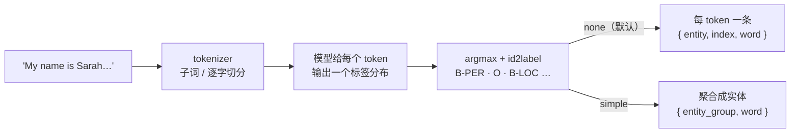

import { Canvas, Controls, Meta } from '@storybook/addon-docs/blocks';
import * as TokenClassification from './token-classification.stories';

<Meta of={TokenClassification} name="Docs" />

# token 分类

token 分类把「每个 token 判一个标签」的模型输出变成可用的实体结果：模型对句子里每个 token 给出标签（人名、地名、机构名……），`pipeline('token-classification')` 负责打标签、过滤背景标签、再把相邻的标签聚合成完整实体——这一步由 `aggregation_strategy` 参数控制，输出粒度随它变化。最常见的应用就是命名实体识别（NER）：从一句话里找出「张伟住在北京」中的人名与地名。与 [3.1.1 文本分类](?path=/docs/text-classification--docs) 的整句一个 `label` 不同，这里的输出条数随实体个数变化。

本课的默认模型恰好是多语言 NER（含中文），中英文示例句都能直接跑。读完本页你应该能预测实例的行为：切换「示例文本」与「aggregation_strategy」，画布在句子原文上的着色高亮和实体清单读数随之变化——`simple` 给出聚好的实体块，`none` 摊开每个 token 的 BIO 标签与 `##` 子词碎片；首次打开等待的是一次约 170 MB 的 q8 下载，之后命中浏览器缓存。



| 关键输入 / 输出 | 默认值 | 回查要点 |
| --- | --- | --- |
| `task` | — | `'token-classification'`，别名 `'ner'` |
| `model` | `null`：用任务的默认模型 | v4.3.0 默认 `Xenova/bert-base-multilingual-cased-ner-hrl`（多语言，含中文） |
| `options.dtype` / `options.device` | `null`：随环境选择 | 浏览器 WASM 默认 q8；本课默认模型 q8 约 170 MB（档位取舍见 [2.3.1 device 与 dtype](?path=/docs/device-dtype--docs)） |
| 推理选项 `aggregation_strategy` | `'none'` | v4.3.0 只支持 `'none'` / `'simple'`，其余取值直接抛错 |
| 推理选项 `ignore_labels` | `['O']` | 过滤背景标签 `O`；传 `[]` 可看到每个 token 的标签 |
| `'none'` 输出 | — | `{ entity, score, index, word }`；`word` 是单 token 解码，可能是 `##` 子词碎片 |
| `'simple'` 输出 | — | `{ entity_group, score, word }`；`score` 是组内平均置信度 |
| `start` / `end` 字符偏移 | — | v4.3.0 不返回（源码标注 TODO）；在原文上高亮标注需自行定位 |
| 输入长度 | — | 管线内部分词固定带 `padding: true, truncation: true`，超过模型上限（本模型 512）自动截断 |

## 快速上手

最小闭环是两次 `await`：创建实例（整个页面只做一次），然后传入一句话和聚合策略推理。

```js
import { pipeline } from '@huggingface/transformers';

// 不传模型时使用任务默认模型（多语言 NER，含中文）；首次运行下载 q8 权重约 170 MB
const ner = await pipeline('token-classification');

// aggregation_strategy: 'simple' 把相邻同组 token 聚成完整实体
const output = await ner('My name is Sarah and I live in London', {
  aggregation_strategy: 'simple',
});
// [
//   { entity_group: 'PER', score: 0.9985477924346924, word: 'Sarah' },
//   { entity_group: 'LOC', score: 0.999621570110321,  word: 'London' }
// ]
```

下面的内嵌实例执行的就是这段逻辑，并多画了一层：把输出按 `word` 在原文中定位后着色高亮。**首次打开会下载约 170 MB 模型文件，需要数秒到数十秒**（取决于带宽），期间画布显示下载进度；完成后进入浏览器缓存，刷新或重开本页时加载显著变快。实例为免安装依赖改用官方 CDN 版本加载库，推理代码与本节一致。

<Canvas of={TokenClassification.Interactive} />
<Controls of={TokenClassification.Interactive} />

| 读者操作 | 可观察证据 |
| --- | --- |
| 等待首次加载 | 「状态」从 加载中 变为 就绪，画布显示下载百分比与加载用时 |
| 切换「示例文本」 | 句子上的高亮与「#n · 组名」清单读数同步更新；中文句的人名、地名同样被标出 |
| 把「aggregation_strategy」切到 none | 清单从实体块摊开成 token 级：`entity` 变成带 `B-` / `I-` 前缀的标签，`word` 出现 `##` 子词与逐字碎片 |
| 打开 Show code | 查看实例实际执行的 `ner-pipeline.ts` |

## NER 与 BIO 标签

token 分类任务是「序列标注」：模型读入整句，为每个 token 输出一个标签分布，取最大值作为该 token 的标签。NER 是它最常见的形式——标签集就是实体类型。标签集合由**模型的 `id2label` 配置**决定，pipeline 只负责查表映射，不是库的固定值：conll2003 系模型是 `PER` / `LOC` / `ORG` / `MISC` 四族；本课默认模型是 `PER` / `LOC` / `ORG` / `DATE`。

标签本身带 BIO 编码前缀：`B-`（Begin）开启一个新实体，`I-`（Inside）延续上一个实体的同组标签，`O`（Outside）表示背景 token。部分模型还有 `E-` / `S-`（BIOES），`simple` 聚合同样兼容。默认的 `aggregation_strategy: 'none'` 输出的就是这一层原始形态：

```js
const ner = await pipeline('token-classification', 'Xenova/bert-base-NER');
const output = await ner('My name is Sarah and I live in London');
// [
//   { entity: 'B-PER', score: 0.9980202913284302, index: 4, word: 'Sarah' },
//   { entity: 'B-LOC', score: 0.9994474053382874, index: 9, word: 'London' }
// ]
```

`ignore_labels` 默认过滤掉所有 `O` 标签，所以正常输出里只有实体 token；排查「模型到底给每个词打了什么标签」时传 `ignore_labels: []`，连背景 token 一起返回。别名 `'ner'` 与 `'token-classification'` 等价：`pipeline('ner', ...)`。

在实例中核对：把「aggregation_strategy」切到 none，「输出条数」变多——中文句的人名、地名被摊成逐字标签（张→`B-PER`，伟→`I-PER`），这正是 BIO 在逐字切分下的形态。

## aggregation_strategy：none 与 simple

两档策略回答同一个问题的两种粒度——「模型看了什么」（none）与「实体是什么」（simple）：

- **`'none'`（默认）**：每个 token 一条输出。`entity` 是 BIO 标签，`word` 是该 token 单独解码的词形（子词带 `##` 前缀），`index` 是它在 `input_ids` 中的位置。
- **`'simple'`**：按 BIO / BIOES 规则把相邻同组 token 聚成一个实体：`entity_group` 是去掉 `B-` / `I-` 前缀的组名，`score` 是组内各 token 置信度的算术平均，`word` 是把组内所有 token 的 id 重新 decode 拼回的完整词形。

多词实体最能看出差别。`Sarah lives in the United States of America` 的原始输出是四条标签（`United`→`B-LOC`，`States` / `of` / `America`→`I-LOC`），`simple` 聚合后变成一个实体块：

```js
const output = await ner('Sarah lives in the United States of America', {
  aggregation_strategy: 'simple',
});
// [{ entity_group: 'LOC', score: 0.998, word: 'United States of America' }]
```

与 Python transformers 对照：那边还有 `'first'` / `'average'` / `'max'` 三档（按子词分数的不同方式合并），transformers.js v4.3.0 **没有移植**——源码里 `aggregation_strategy` 只接受 `'none'` 与 `'simple'`，传入其他值直接抛 `Invalid aggregation_strategy` 错误。从 Python 文档抄参数时会踩这个坑。

在实例中核对：切换「aggregation_strategy」时右上角的模式标注、句子高亮的颗粒度与清单读数同步变化——同一句话，none 是逐 token 的碎片清单，simple 是寥寥几条实体块。

### 子词如何聚回词

BERT 系 tokenizer 用 WordPiece：高频词整存，生僻词拆成带 `##` 前缀的子词（[2.1.1 tokenizer](?path=/docs/tokenizer--docs) 见过 `'j'` + `'##s'` 这样的碎片）。对齐因此分两层：

- **none 的 `word` 暴露切分形态。** 它是单 token 解码，所以 `United` 拆出的每个子词都以独立条目出现，`##` 前缀可见；特殊 token 解码为空字符串，被 pipeline 自动跳过。
- **simple 聚合时重新解码。** 分组完成后，pipeline 把组内全部 token 的 id 一起传给 `tokenizer.decode`，`##` 子词自动拼回完整词——这就是 `word: 'United States of America'` 的来源，也是「token 级标签 → 词级实体」的核心一步。

中文走的是另一条路：`BertPreTokenizer` 对 CJK 字符**逐字切分**，每个汉字独立成 token，不依赖空格。于是中文实体在 none 模式下按字输出（`张伟` = `张`→`B-PER` + `伟`→`I-PER`），simple 再把相邻同组字符聚回完整词。

`index` 的计数包含特殊 token：示例句里 `Sarah` 的 `index` 是 4——`[CLS]`=0，`My`=1，`name`=2，`is`=3，`Sarah`=4。它是 token 位置而非字符偏移，与正文「输出字段与高亮定位」中的 `start` / `end` 不是一回事。

## 输出字段与高亮定位

两种模式的字段对照：

| 字段 | none | simple | 含义 |
| --- | --- | --- | --- |
| `entity` | 有 | — | 该 token 的 BIO 标签，如 `'B-PER'` |
| `entity_group` | — | 有 | 去掉 BIO 前缀的实体组名，如 `'PER'` |
| `score` | 有 | 有 | token 置信度 / 组内平均置信度，0~1 |
| `word` | 有 | 有 | 单 token 词形（含 `##` 碎片）/ 组内重新解码的完整词形 |
| `index` | 有 | — | token 在 `input_ids` 中的位置，含 `[CLS]` 等特殊 token 偏移 |
| `start` / `end` | 无 | 无 | 字符偏移；v4.3.0 未实现，Python transformers 有 |

`start` / `end` 是「把实体画回原文」的关键：有了字符偏移，前端才能在句子的正确区间画高亮、做标注交互。Python transformers 的同名管线会返回这两个字段；**transformers.js v4.3.0 的类型定义里标注了可选的 `start` / `end`，但源码实现处写着 `TODO: Add support for start and end`，实际输出没有这两个字段**，tokenizer 也没有提供 offset mapping。依赖偏移的标注功能不能直接照搬 Python 写法。

本课实例的补救方式：输出按 token 顺序天然沿原文排列，于是按 `word` 逐条在原文中向后游标查找来定位——`##` 子词去掉前缀后接在上一个命中位置之后。局限同样明确：重复词靠顺序消歧、`[UNK]` 等与原文对不上的 `word` 放弃高亮（清单里仍列出）。这是演示侧的做法，不是库的能力；需要字符级精确偏移时，得自建对齐或用 Python 侧预处理。

在实例中核对：画布上的彩色高亮块就是用上述方法定位的；每个实体标签一种颜色，图例行给出颜色与标签的对应关系。

## 中文文本的特殊性

- **无空格不影响分词。** BERT 系 tokenizer 对中文逐字切分，不需要前置分词器，「张伟住在北京」直接进模型。逐字对齐意味着 none 模式下中文实体的输出条数等于实体字数，属于预期形态。
- **词表覆盖才是决定因素。** 中文能不能被正常表示，取决于 tokenizer 词表里有多少汉字：本课的英文对照模型 `Xenova/bert-base-NER` 基于 bert-base-cased，词表只有 246 个汉字，中文进去大量落入 `[UNK]`；默认模型基于 mBERT，词表含 13609 个汉字。这与 [2.1.1 tokenizer](?path=/docs/tokenizer--docs) 的 `[UNK]` 结论是同一件事在 NER 场景的落点：判断办法不变——`tokenizer.tokenize('中文句子')` 看 `[UNK]` 占比。
- **默认模型能跑中文，但中文专用模型更强。** v4.3.0 默认模型的中文能力来自 MSRA 中文 NER 数据的训练，示例中的中国人名地名可以正常识别；追求更好的中文效果时，在 Hub 上选中文语料训练、含完整中文词表的 NER 模型（筛选方法见下节）。

## 模型选择

按「语言覆盖 → 标签族 → 体积」的顺序筛。两个可核实的候选：

| 模型 | 语言 | 标签族 | q8 体积 | 说明 |
| --- | --- | --- | --- | --- |
| `Xenova/bert-base-multilingual-cased-ner-hrl`（默认） | 10 种，含中文 | `PER` / `LOC` / `ORG` / `DATE` | 约 170 MB | mBERT 底座；中文在 MSRA 数据上训练 |
| `Xenova/bert-base-NER` | 英语 | `PER` / `LOC` / `ORG` / `MISC` | 约 104 MB | conll2003 英语 NER；bert-base-cased 词表几乎没有汉字 |

两点边界：

- **q8 是浏览器端的现实档位。** 同一模型的 fp16 约 338 MB（英文模型 206 MB）、fp32 达 676 MB / 411 MB，都超出浏览器示例的合理下载量；换设备与档位的完整取舍见 [2.3.1 device 与 dtype](?path=/docs/device-dtype--docs)。本课示例为同时覆盖中英文选用默认模型，170 MB 明显重于 [1.2 第一个 pipeline](?path=/docs/first-pipeline--docs) 的 68 MB——纯英文场景换 104 MB 的英文模型更轻。
- **生产代码显式写模型 ID。** 默认模型可能随库版本调整，用 `pipeline('token-classification', '<模型 ID>')` 写全，需要时加 `revision` 固定版本（与 [1.2 第一个 pipeline](?path=/docs/first-pipeline--docs) 的建议一致）。

找更多候选：在 [兼容模型目录](https://huggingface.co/models?library=transformers.js) 用 `library=transformers.js` 过滤，再按 `token-classification` 任务与语言标签缩小范围；中文场景优先确认 tokenizer 词表含汉字（模型页的 `tokenizer_config.json` 或直接 `tokenize` 试一句）。

## 最佳实践

- **业务用 `simple`，调试切 `none`。** 交给界面的输出用 `aggregation_strategy: 'simple'`，拿到的是词级实体块；怀疑模型标错、想看实体为什么被切碎或粘连时切回 `'none'`，BIO 标签与 `##` 碎片会暴露切分与标注的原始形态。两档切换是同一个实例上的推理参数变化，不需要重新加载模型。
- **做高亮标注不要假设有偏移。** v4.3.0 的输出没有 `start` / `end`，按 `word` 在原文中定位是可行的最小实现，但要处理定位失败（`[UNK]`、子词碎片）与重复词；实体量大、要求字符级精确时，评估自建对齐或改用返回偏移的 Python 管线预处理。
- **先核对语言与标签族，再看体积。** 语言不匹配时再高的置信度也只是 `[UNK]`；标签族以模型 `id2label` 为准，别在代码里硬编码 `MISC` 却选了没有 `MISC` 的模型。体积决定首次加载体验，q8 档位是浏览器端的默认选择。

## 常见问题

- 报错 `Invalid aggregation_strategy: "max"`（或 `"average"` / `"first"`）
  transformers.js v4.3.0 只实现了 `'none'` 与 `'simple'` 两档，Python transformers 的另外三档没有移植。改用 `'simple'`；若业务必须按子词分数的 max/average 合并，需要绕过 pipeline 自行处理 logits。
- 输出里找不到 `start` / `end` 字段，没法把实体画回原文
  v4.3.0 确实不返回（官方类型定义标注了可选字段，但源码实现处是 TODO）。按本课实例的方式用 `word` 在原文中游标定位，或自建对齐；Python transformers 的同名管线才返回偏移。
- `none` 模式的 `word` 里出现 `##ers` 这样的碎片，是 bug 吗
  正常行为：`word` 是单 token 解码，`##` 是 WordPiece 子词的延续标记。要完整词形用 `aggregation_strategy: 'simple'`，它会重新解码把子词拼回；调试单个 token 时也可自行 `tokenizer.decode([id], { skip_special_tokens: true })`。
- 中文句子的实体识别结果很差，或 token 大量变成 `[UNK]`
  模型词表不含中文：bert-base-cased 系模型词表只有 246 个汉字。先用 `tokenizer.tokenize('中文句子')` 看 `[UNK]` 占比（判断方法见 [2.1.1 tokenizer](?path=/docs/tokenizer--docs)），确认后换含中文词表的多语言或中文 NER 模型，如本课默认模型。

## 总结回顾

摘要：

`pipeline('token-classification')`（别名 `'ner'`）把序列标注模型包装成一行调用：模型给每个 token 输出标签分布，pipeline 取 argmax 并按模型 `id2label` 映射成 `PER` / `LOC` / `ORG` 这样的实体标签，默认过滤背景标签 `O`。`aggregation_strategy` 决定输出粒度——默认 `'none'` 逐 token 返回 `{ entity, score, index, word }`（`word` 是含 `##` 碎片的单 token 词形），`'simple'` 按 BIO/BIOES 把相邻同组 token 聚成实体，返回 `{ entity_group, score, word }`，`word` 由组内 id 重新解码拼回完整词、`score` 取组内平均；v4.3.0 只有这两档，Python transformers 的 `first` / `average` / `max` 传入会直接抛错。输出不携带 `start` / `end` 字符偏移（源码 TODO），在原文上高亮需按 `word` 自行定位。中文的可用性取决于 tokenizer 词表覆盖：mBERT 底座的默认模型含 13609 个汉字并在 MSRA 中文 NER 数据上训练过，而 bert-base-cased 系英文模型词表只有 246 个汉字。默认模型 q8 权重约 170 MB，纯英文场景可换约 104 MB 的 `Xenova/bert-base-NER`。

一句话：

> token 分类的模型输出是 token 级 BIO 标签，`aggregation_strategy` 决定把它交给业务的是逐 token 碎片还是聚合后的实体块。

知识要点：

- token 分类与文本分类的输出粒度差在哪？BIO 的 `B-` / `I-` / `O` 各表示什么？
- v4.3.0 的 `aggregation_strategy` 有哪几档？`'simple'` 怎样把子词聚回完整词、`score` 如何计算？
- `none` 与 `simple` 各返回哪些字段？`index` 为什么不等于字符偏移？
- 为什么 v4.3.0 做不了基于 `start` / `end` 的高亮？实例用什么方式替代？
- 中文 NER 选模型时先看什么？两个示例模型的词表覆盖差多少？
- 默认模型是什么、多大？什么场景换英文专用模型？

## 参考资料

- [Transformers.js 官方文档 · pipelines API（TokenClassificationPipeline）](https://huggingface.co/docs/transformers.js/en/api/pipelines)
  `aggregation_strategy`（`none` / `simple`）与 `ignore_labels` 的官方说明、三种模式的输出示例（本课英文示例句的输出值出自这里）。
- [v4.3.0 源码 · src/pipelines/token-classification.js](https://cdn.jsdelivr.net/npm/@huggingface/transformers@4.3.0/src/pipelines/token-classification.js)
  本课关键结论的第一手依据：两档之外的取值抛错、默认 `'none'`、`groupEntities` 的分组与平均分逻辑、`start` / `end` 的 TODO 标注。
- [v4.3.0 源码 · src/pipelines/index.js](https://cdn.jsdelivr.net/npm/@huggingface/transformers@4.3.0/src/pipelines/index.js)
  `SUPPORTED_TASKS` 映射：`'token-classification'` 的默认模型与 `'ner'` 别名。
- [Xenova/bert-base-multilingual-cased-ner-hrl](https://huggingface.co/Xenova/bert-base-multilingual-cased-ner-hrl)
  本课示例模型；`onnx/` 目录可核对量化档位体积（q8 约 170 MB），`config.json` 含 `id2label` 标签集。
- [Davlan/bert-base-multilingual-cased-ner-hrl（原模型卡）](https://huggingface.co/davlan/bert-base-multilingual-cased-ner-hrl)
  覆盖的 10 种语言、各语言训练集（中文为 MSRA）与标签集说明。
- [Xenova/bert-base-NER](https://huggingface.co/Xenova/bert-base-NER)
  英文 conll2003 对照模型；q8 约 104 MB，词表为 bert-base-cased（仅 246 个汉字）。
- [Python transformers · TokenClassificationPipeline](https://huggingface.co/docs/transformers/en/main_classes/pipelines)
  对照参考：`first` / `average` / `max` 聚合策略与 `start` / `end` 偏移输出（transformers.js v4.3.0 未实现的部分）。
- [兼容模型目录](https://huggingface.co/models?library=transformers.js)
  挑选其他 NER 模型的入口：`library=transformers.js` 过滤后按任务与语言缩小范围。
