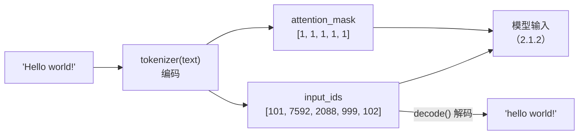

import { Canvas, Controls, Meta } from '@storybook/addon-docs/blocks';
import * as Tokenizer from './tokenizer.stories';

<Meta of={Tokenizer} name="Docs" />

# tokenizer

tokenizer 是文本与张量之间的翻译层：把字符串切成词表里的 token 并查表得到整数 id（编码），也能把模型输出的 id 序列还原回文本（解码）。上一课的 `pipeline()` 内部，推理前的第一件事和输出前的最后一件善后都是它；本课把这一层单独拆开讲透，为 [2.1.2 model 前向推理](?path=/docs/model-inference--docs) 手工喂数据做准备。

本课实例只加载分词器、不加载模型权重（`tokenizer.json` 约 695 KB + `tokenizer_config.json`，库本体约 1.1 MB 与 1.2 课相同），首次打开几秒内就绪。读完本页你应该能预测实例的行为：切换示例文本，tokens、input_ids、attention_mask 读数随之变化；打开「截断」开关，序列被砍到 max_length 个 token，结尾的 `[SEP]` 一起消失。



| 关键选项 | 默认值 | 回查要点 |
| --- | --- | --- |
| `tokenizer(text)` 的 `add_special_tokens` | `true` | 自动追加 `[CLS]` / `[SEP]` 等该模型要求的特殊 token |
| `tokenizer(text)` 的 `padding` | `false` | `true` 补到批内最长；`'max_length'` 补到 `max_length` |
| `tokenizer(text)` 的 `truncation` | `null` | 不截断；`true` 时截到 `max_length`，缺省回退 `model_max_length` |
| `tokenizer(text)` 的 `max_length` | `null` | 截断/补齐的目标长度；缺省取 `model_max_length`（本模型 512） |
| `tokenizer(text)` 的 `return_tensor` | `true` | `false` 时返回普通数组而非 Tensor |
| `tokenize(text)` 的 `add_special_tokens` | `false` | 与调用输出相反：默认不含特殊 token |
| `encode(text)` 的 `add_special_tokens` | `true` | 返回 `number[]`，不是 Tensor |
| `decode(ids)` 的 `skip_special_tokens` | `false` | 与 Python transformers 相反：默认带出 `[CLS]` / `[SEP]` |
| `decode(ids)` 的 `clean_up_tokenization_spaces` | `true` | 收拾词块间多余空格（如 `don ' t` → `don't`） |
| `tokenizer.model_max_length` | `512` | 本模型上限；`padding_side` 默认 `'right'`（补在尾部） |

## 快速上手

最小闭环是一句编码加一句解码：`from_pretrained` 只取分词器文件（秒级），调用输出直接是喂给模型的张量。

```js
import { AutoTokenizer } from '@huggingface/transformers';

// 只加载分词器：约 0.7 MB，秒级完成；不下载模型权重
const tokenizer = await AutoTokenizer.from_pretrained(
  'Xenova/distilbert-base-uncased-finetuned-sst-2-english',
);

// 编码：一句话 → 张量。input_ids 喂给模型，attention_mask 标记哪些位置是真实 token
const { input_ids, attention_mask } = tokenizer('I love transformers!');
// input_ids.dims     → [1, 6]
// input_ids.tolist() → [[101n, 1045n, 2293n, 19081n, 999n, 102n]]（首尾是 [CLS] / [SEP]）
// attention_mask.tolist() → [[1n, 1n, 1n, 1n, 1n, 1n]]

// 解码：id 序列 → 文本，round-trip 回查
const text = tokenizer.decode(input_ids, { skip_special_tokens: true });
// 'hello world!' —— uncased 词表做了大小写归一
```

下面的内嵌实例执行的就是这段逻辑。实例为免安装依赖改用官方 CDN 版本加载库（模式与 [1.2 第一个 pipeline](?path=/docs/first-pipeline--docs) 相同），分词代码与本节一致。

<Canvas of={Tokenizer.Interactive} />
<Controls of={Tokenizer.Interactive} />

| 读者操作 | 可观察证据 |
| --- | --- |
| 等待首次加载 | 「状态」从 加载中 变为 就绪，读数给出加载用时 |
| 切换「示例文本」 | 「tokens」「input_ids」「attention_mask」读数同步变化；中文句大量变成红色 `[UNK]` 块 |
| 关闭「特殊 token」 | 首尾的 `[CLS]` / `[SEP]` 块消失，token 数减 2 |
| 打开「截断」并拖动「max_length」 | 序列砍到 max_length 个 token，结尾 `[SEP]` 消失，「解码文本」相应变短 |
| 打开 Show code | 查看实例实际执行的 `tokenizer-encoding.ts` |

## input_ids 与 attention_mask

`tokenizer(text)` 返回一个对象（BatchEncoding）：`input_ids` 是查词表得到的 id 序列，`attention_mask` 与它逐位等长，`1` 表示真实 token、`0` 表示补齐的 pad。这两个字段就是模型 forward 的最小输入。单句输入的形状也是二维的 `[1, seq_len]`——第一维永远是 batch 维，模型按批处理。

张量的底层数据是 `BigInt64Array`，直接打印看到的是 `101n` 这种 BigInt；`tolist()` 拿到的仍是 BigInt。要普通 `number[]`，传 `return_tensor: false`：

```js
const { input_ids } = tokenizer('I love transformers!');
input_ids.dims;        // [1, 6] —— 单句也带 batch 维
input_ids.tolist();    // [[101n, 1045n, 2293n, 19081n, 999n, 102n]] —— BigInt
input_ids.data;        // BigInt64Array(6) [101n, 1045n, 2293n, 19081n, 999n, 102n]

const plain = tokenizer('I love transformers!', { return_tensor: false });
plain.input_ids;       // [101, 1045, 2293, 19081, 999, 102] —— 普通 number[]
plain.attention_mask;  // [1, 1, 1, 1, 1, 1]
```

在实例中核对：readout 的「input_ids」行首尾分别是 101 和 102（`[CLS]` / `[SEP]` 的 id），「attention_mask」全是 1——单句没有 pad，mask 全 1；什么时候出现 0 见下文「padding 与截断」。

### token_type_ids 何时出现

`token_type_ids`（段 id）标记每个 token 属于句 A（0）还是句 B（1），只有需要区分句对的 tokenizer 才会输出。是否输出由分词器类决定，写在它的实现里：`BertTokenizer` 默认输出三件套；本课的 `DistilBertTokenizer` 单段输入，默认只有两个字段。句对通过 `text_pair` 选项传入（它是选项，不是第二个位置参数）：

```js
// BertTokenizer（如 Xenova/bert-base-uncased）默认输出三件套
const bert = await AutoTokenizer.from_pretrained('Xenova/bert-base-uncased');
const out = bert('Hello world!');
Object.keys(out); // ['input_ids', 'attention_mask', 'token_type_ids']

// 句对：句 A 的 token_type_ids 全 0，句 B 全 1
const pair = bert('Hello world!', { text_pair: 'How are you?' });
pair.input_ids.tolist();
// [[101n, 7592n, 2088n, 999n, 102n, 2129n, 2024n, 2017n, 1029n, 102n]]
pair.token_type_ids.tolist();
// [[0n, 0n, 0n, 0n, 0n, 1n, 1n, 1n, 1n, 1n]]
```

对不输出 `token_type_ids` 的 tokenizer（如本课模型）传 `return_token_type_ids: true` 只会得到全 0 序列——模型结构不支持句段区分时，这个字段没有意义。

## tokenize 与 decode

`tokenize(text)` 只拆词、默认不查表之外的包装：返回 token 字符串数组，默认**不含**特殊 token（`add_special_tokens` 默认 `false`，与调用输出相反）。词块形态直接暴露了分词器的三件常规操作——大小写归一、子词切分、词表外标记：

```js
tokenizer.tokenize('Transformers.js runs pre-trained models!');
// ['transformers', '.', 'j', '##s', 'runs', 'pre', '-', 'trained', 'models', '!']
//  全小写          生词拆成 ## 子词        复合词同样拆分

tokenizer.tokenize('I love transformers!', { add_special_tokens: true });
// ['[CLS]', 'i', 'love', 'transformers', '!', '[SEP]']
```

`decode(ids)` 是反方向：把 id 序列还原成文本，`##` 子词自动拼回、大小写不再恢复。它默认**保留**特殊 token（`skip_special_tokens` 默认 `false`，与 Python transformers 相反），`clean_up_tokenization_spaces` 负责收拾词块之间的空格：

```js
const ids = tokenizer.encode("don't stop, it's fine");
tokenizer.decode(ids);
// "[CLS] don't stop, it's fine [SEP]" —— 默认带出特殊 token
tokenizer.decode(ids, { skip_special_tokens: true });
// "don't stop, it's fine" —— cleanup 把 "don ' t" 收拾成 "don't"
```

round-trip（encode → decode）是最常用的调试手段：读到可疑的 id 序列时 decode 回来看看模型"眼里"的文本。批量解码用 `tokenizer.batch_decode(batch, decode_args)`，接受 `number[][]` 或张量。

## 特殊 token

特殊 token 是模型训练时约定的控制符：`[CLS]` 固定在序列开头（句级语义的聚合位）、`[SEP]` 收尾并分隔句对、`[PAD]` 占据补齐位、`[UNK]` 表示词表外的字符、`[MASK]` 是预训练掩码任务的占位。它们由 `add_special_tokens` 控制是否自动追加：`tokenizer(text)` 和 `encode(text)` 默认追加，`tokenize` 默认不追加。

需要自己拼序列时（多段文本拼接、滑窗分段），关掉自动追加、手动控制特殊 token 的位置：

```js
tokenizer.encode('hello world', { add_special_tokens: false });
// [7592, 2088] —— 纯净序列，特殊 token 位置自己决定
```

本模型的特殊 token 与 id（实例画布中琥珀色块就是它们）：

| 特殊 token | id | 用途 |
| --- | --- | --- |
| `[PAD]` | 0 | padding 占位 |
| `[UNK]` | 100 | 词表外字符 |
| `[CLS]` | 101 | 序列开头，句级语义聚合位 |
| `[SEP]` | 102 | 序列结尾；句对时分隔两句 |
| `[MASK]` | 103 | 预训练掩码占位 |

这些 id 可以直接从实例属性读取，批量判断特殊 token 用 `all_special_tokens` / `all_special_ids`：

```js
tokenizer.all_special_tokens; // ['[PAD]', '[UNK]', '[CLS]', '[SEP]', '[MASK]']
tokenizer.all_special_ids;    // [0, 100, 101, 102, 103]
tokenizer.sep_token_id;       // 102
tokenizer.pad_token_id;       // 0

// v4.3.0 未暴露 cls_token / cls_token_id 实例属性，
// 需要 [CLS] 的 id 时用 convert_tokens_to_ids 查词表：
tokenizer.convert_tokens_to_ids('[CLS]'); // 101
```

tokenizer 还有一个面向对话模型的方法 `apply_chat_template`：把消息列表渲染成模型原生的提示格式再编码。它服务生成类任务的输入构造，不属于本课「文本与张量」的编码主线，用法见上方 tokenizers API 文档。

## padding 与截断

两个机制共享同一个"目标长度"概念：截断把超长序列砍到目标长度，padding 把不足的序列补到目标长度。目标长度的解析规则是：显式 `max_length` 优先；未给时回退 `model_max_length`（本模型 512）；`padding: true` 时目标长度取批内最长序列（再与上述上限取小）。

| 取值 | 行为 | 典型用途 |
| --- | --- | --- |
| `padding: true` | 补齐到批内最长序列 | 批量推理的最短路径 |
| `padding: 'max_length'` | 补齐到 `max_length`（缺省 512） | 固定长度输入、数据集预处理 |
| `truncation: true` | 超过 `max_length` 时砍掉尾部 | 长文本压进模型上限 |
| 组合 | 先截断后补齐 | `'max_length'` + `true` 定长输出 |

`padding` 只在批量下可见：单句传 `padding: true` 没有效果（没有"最长"可对齐），`padding: 'max_length'` 才会把单句也补齐。补齐位置 `input_ids` 填 `pad_token_id`（本模型是 0），`attention_mask` 填 0——这就是 mask 出现 0 的唯一场景：

```js
const batch = tokenizer(['short one', 'this is a somewhat longer sentence'], {
  padding: true,
});
batch.input_ids.tolist();
// [[101, 2460, 2028, 102,    0,    0,    0,    0],  ← 尾部补 pad_token_id = 0
//  [101, 2023, 2003, 1037, 5399, 2936, 6251,  102]]
batch.attention_mask.tolist();
// [[1, 1, 1, 1,    0,    0,    0,    0],             ← 补齐位标 0，模型不关注
//  [1, 1, 1, 1,    1,    1,    1,    1]]
```

`truncation` 是硬截断：直接砍掉数组尾部，不是智能摘要——结尾的 `[SEP]` 会一起被砍掉，尾部语义全部丢失：

```js
const out = tokenizer(
  'this is a fairly long sentence that will exceed the small max length we choose for the demonstration',
  { truncation: true, max_length: 8 },
);
out.input_ids.tolist();
// [[101, 2023, 2003, 1037, 7199, 2146, 6251, 2008]]
//  ↑ [CLS] 保留，结尾的 [SEP]（102）已被砍掉
tokenizer.decode(out.input_ids, { skip_special_tokens: true });
// 'this is a fairly long sentence that'
```

两个默认值陷阱（都会在控制台留下警告）：只传 `max_length` 不传 `truncation`，库会打警告并自动按截断处理，显式写 `truncation: true` 才是正路；`padding: true` 配 `max_length` 但不配 `truncation`，`max_length` 会被忽略（补齐仍到批内最长），固定长度请用 `padding: 'max_length'`。

在实例中核对：打开「截断」开关并把「max_length」拖到 8，默认的英文长句（24 个 token）变成 8 个，`[SEP]` 消失，「解码文本」只剩前半句；换回英文短句再开截断则毫无变化——6 个 token 没有超过 max_length，截断只砍不补。

## 最佳实践

- **按用途选 API。** 喂模型：`tokenizer(text)` 默认参数（自动加特殊 token、直接得到张量）；批量推理：加 `padding: true`，长度不齐会直接报错；固定长度预处理：`padding: 'max_length'` + `truncation: true` + 显式 `max_length`；给人看或调试：`tokenize` 与 `decode(ids, { skip_special_tokens: true })`。
- **尊重 512 上限，超长先分段。** `model_max_length` 是模型训练时的硬约束，截断是"砍尾"而不是摘要，答案或关键信息落在尾部就没了。处理长文档时先按句或段落自行滑窗切段，每段再编码，不要指望 `truncation` 替你保留全文。

## 常见问题

- 批量推理报 `Unable to create tensor, you should probably activate truncation and/or padding...`
  各序列 token 数不一致，拼不成规则矩阵（单条推理不受影响）。给调用加 `padding: true`（通常再配 `truncation: true`），或用 `padding: 'max_length'` 输出定长序列。
- `decode` 的结果带 `[CLS]` / `[SEP]`，和 Python transformers 的行为不一样
  transformers.js 的 `decode` 默认 `skip_special_tokens: false`（Python 侧默认 `true`）。加 `{ skip_special_tokens: true }` 即可去掉。
- 中文几乎全变成 `[UNK]`
  本模型词表（bert-base-uncased）基本不含 CJK 字符，汉字查表失败后落入 `[UNK]`，语义大量丢失——判断办法是 `tokenizer.tokenize('中文句子')` 看结果里 `[UNK]` 的占比。要处理中文，换用含中文词表的模型（在[兼容模型目录](https://huggingface.co/models?library=transformers.js)按任务筛选）。

## 总结回顾

摘要：

`AutoTokenizer.from_pretrained` 秒级加载分词器；`tokenizer(text)` 默认输出 `{ input_ids, attention_mask }`——形状恒为 `[batch, seq_len]`、底层数据是 BigInt 的 int64 张量，`token_type_ids` 只在支持句段区分的 tokenizer（如 `BertTokenizer`）上出现，句 A 为 0、句 B 为 1。`tokenize` 与 `decode` 分别暴露词块形态与还原路径：默认一个不含、一个含特殊 token，round-trip 是日常调试手段。特殊 token（`[CLS]` 101、`[SEP]` 102、`[PAD]` 0、`[UNK]` 100）由 `add_special_tokens` 控制自动追加。padding 把批内不足的序列补到目标长度（mask 补 0），truncation 把超长序列砍到目标长度（`[SEP]` 一起被砍）；两者的目标长度都回退到 `model_max_length` 512，只有批量不齐和超长文本才需要显式动这两个参数。

一句话：

> 调用 `tokenizer(text)` 的默认输出就是模型的输入格式；padding 与截断只在批量不齐和超过 512 时才需要出场。

知识要点：

- `tokenizer(text)` 返回什么？形状、数据类型（BigInt）各是什么？怎样拿到普通数组？
- `token_type_ids` 何时出现在输出里？句对时它的值是什么？`text_pair` 怎么传？
- `tokenize` 与 `encode` 的 `add_special_tokens` 默认值为何不同？`decode` 怎样去掉 `[CLS]` / `[SEP]`？
- 本模型各特殊 token 的 id 是多少？`cls_token_id` 拿不到时怎么查 `[CLS]`？
- `padding: true` 与 `padding: 'max_length'` 分别补到多长？mask 的 0 出现在哪里？
- `truncation: true` 砍到哪里？为什么 `[SEP]` 会消失？只传 `max_length` 会发生什么？

## 参考资料

- [Transformers.js 官方文档 · tokenizers API](https://huggingface.co/docs/transformers.js/en/api/tokenizers)
  `AutoTokenizer.from_pretrained`、调用选项（`padding` / `truncation` / `max_length` 等）默认值、`decode` 选项与 BatchEncoding 结构。
- [Transformers.js 官方文档 · utils/hub API](https://huggingface.co/docs/transformers.js/en/api/utils/hub)
  `from_pretrained` 的加载选项（`progress_callback`、`revision`、`local_files_only` 等）。
- [Xenova/distilbert-base-uncased-finetuned-sst-2-english](https://huggingface.co/Xenova/distilbert-base-uncased-finetuned-sst-2-english)
  本课示例模型；`tokenizer.json` 约 695 KB，`tokenizer_config.json` 含 `model_max_length: 512` 等配置。
- [兼容模型目录](https://huggingface.co/models?library=transformers.js)
  需要含中文词表或其他语言的 tokenizer 时，按任务与框架标签筛选模型。
- [@huggingface/transformers（npm）](https://www.npmjs.com/package/@huggingface/transformers)
  CDN 引入的官方写法与版本发布记录。
