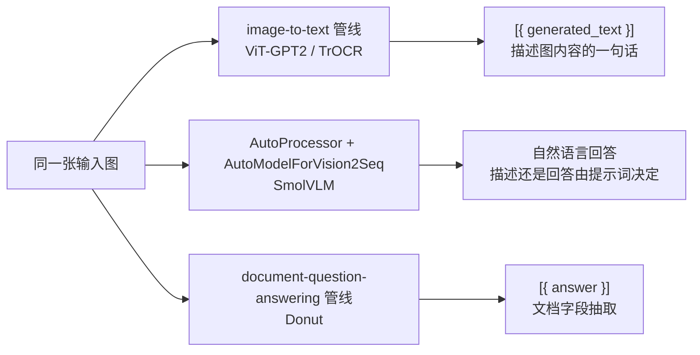

import { Meta } from '@storybook/addon-docs/blocks';

<Meta id="vlm-captioning" title="任务实战/多模态/图生文与文档问答" name="Docs" />

# 图生文与文档问答

[3.4.1 CLIP 图文匹配](?path=/docs/clip-image-matching--docs) 的输出停在「分数」上：图和候选句进同一个向量空间比远近，模型自始至终没有说出一句话。本课跨进**生成式**多模态：模型看着图片，一个 token 一个 token 地写出文本。生成式的入口有三条，能力边界各不相同——**image-to-text 管线**（captioning 家族）只会「看图说话」；**SmolVLM 组件化**（VLM）把提示词编进输入，既能描述也能回答问题；**document-question-answering 管线**（Donut 族）专攻文档版面上的字段抽取。选入口就是选能力边界，这是本课主线。

体积结论先行：三条入口的默认 / 推荐模型量化后都落在 200 MB 上下或以上（约 246 / 207 / 218.7 MB，Hub 文件逐一核实），超出本手册给内嵌实例留的体积预算，因此**本课不内嵌浏览器实例，改为可复制的代码讲解，体积如实标注、由读者按预算自选**；家族中唯一达标的 `Xenova/trocr-small-handwritten`（q8 约 63.6 MB）用途是识别图里的文字，不是描述图的内容，见「模型族」一节。



| 入口 | 调用形态 | 输出形态（单条输入） | 默认 / 示例模型 | 下载体积（Hub 核实） | 本课处理 |
| --- | --- | --- | --- | --- | --- |
| `pipeline('image-to-text')` | `(image, generate_kwargs?)` | `[{ generated_text }]` | `Xenova/vit-gpt2-image-captioning` | q8 约 246 MB | 代码讲解 |
| 组件化 VLM | `AutoProcessor` + `AutoModelForVision2Seq` + 聊天模板 | 截断解码后的文本 | `HuggingFaceTB/SmolVLM-256M-Instruct` | fp16/q4 组合约 207 MB | 代码讲解 |
| `pipeline('document-question-answering')` | `(image, question)` | `[{ answer }]` | `Xenova/donut-base-finetuned-docvqa` | q8 约 218.7 MB | 代码讲解 |

## image-to-text：图生文管线

image-to-text 是最小的一条生成管线：图片进、文本出。任务注册表（4.3.0 源码核实）把它的模型类定为 `AutoModelForVision2Seq`，默认模型 `Xenova/vit-gpt2-image-captioning`——ViT 编码器把图压成一组视觉表示，GPT-2 解码器从 BOS 开始逐 token 写出描述（vision-encoder-decoder 架构），图像按 ViT 的惯例进 224×224 输入（仓库 `preprocessor_config.json` 核实）。

```js
import { pipeline } from '@huggingface/transformers';

// 显式写全模型 ID 与 dtype: 'q8'（encoder + decoder 两个会话文件合计约 246 MB），
// 体积与行为可复现；不指定模型时注册表默认也是它
const captioner = await pipeline(
  'image-to-text',
  'Xenova/vit-gpt2-image-captioning',
  { dtype: 'q8' },
);

const url = 'https://huggingface.co/datasets/Xenova/transformers.js-docs/resolve/main/cats.jpg';
const output = await captioner(url);
// [{ generated_text: 'a cat laying on a couch with another cat' }]（官方文档示例输出）
```

调用规则三条（管线源码核实）：

- **输出永远包一层 `[{ generated_text }]`**：单图输入返回这个数组，传图片数组才返回「每图一个数组」的嵌套结构（与 [1.3 任务全景](?path=/docs/task-overview--docs) 的批量判断规则一致）。
- **第二参透传生成参数**：`max_new_tokens`、`num_beams`、`repetition_penalty` 等原样传给 `model.generate`，语义见 [2.2.1 生成参数](?path=/docs/generation-options--docs)。captioning 是自由生成，不加控制时写多长、会不会重复，都由模型的默认生成配置决定。
- **文本已 trim、特殊 token 已去除**：管线内部用 `batch_decode(..., { skip_special_tokens: true })` 解码后 trim，拿到即是用。

### 模型族：ViT-GPT2 与 TrOCR

这条管线的模型族都是「视觉编码器 + 文本解码器」，差异在用途：

| 模型 | 用途 | q8 体积 | 说明 |
| --- | --- | --- | --- |
| `Xenova/vit-gpt2-image-captioning` | 看图写描述（captioning） | 约 246 MB | 任务默认，本节示例 |
| `Xenova/trocr-small-handwritten` | 手写文字识别（OCR） | 约 63.6 MB | 管线源码的第二个官方示例：handwriting.jpg → `'Mr. Brown commented icily.'` |

TrOCR 换的是用途，不是调用：同一行 `pipeline('image-to-text', ...)`，输出变成图里写着的文字。家族按手写（handwritten）/ 印刷体（printed）× 模型档位在 Hub 分成多个仓库（如 `Xenova/trocr-base-printed`，按 `library=transformers.js` 过滤挑选）。small 档 q8 约 63.6 MB 是本课唯一在实例预算内的成员——想要一条能真正跑起来的 image-to-text 演示就选它；但它回答「图里写了什么字」，不回答「图里有什么」。

### 边界：现代 VLM 不走这条管线

注册表把 image-to-text 指向 `AutoModelForVision2Seq`，这个加载入口同时覆盖 SmolVLM、Florence-2 等现代 VLM——但管线调用只把 `pixel_values` 喂给模型，**不会替你拼聊天模板**；而 VLM 的描述、提问、指令全靠提示词进入模型（下一节的主角）。官方对 VLM 的示例（smolvlm-webgpu、dtype 指南的 Florence-2 示例）一律是组件化用法；把 VLM 塞进这条管线，提示词进不去，拿不到聊天式行为。

## SmolVLM：组件化 VLM 与提问式理解

SmolVLM（HuggingFaceTB 系列）是面向端侧的视觉语言模型：图和文字一起进一个 LLM 主干，按提示词生成回答。对它的支持在 v4.1.0 恢复（release notes「Re-enable SmolVLM」），4.3.0 中可用的 ONNX 仓库有三档：256M / 500M / 2.2B。架构类型是 `idefics3`，源码中 `Idefics3ForConditionalGeneration` 继承自 LLaVA 实现——所以官方用法是组件化三步，正是 [2.1.3 processor](?path=/docs/processor--docs) 与 [2.1.2 model 前向](?path=/docs/model-inference--docs) 的直接应用。

```js
import { AutoProcessor, AutoModelForVision2Seq, RawImage } from '@huggingface/transformers';

const MODEL_ID = 'HuggingFaceTB/SmolVLM-256M-Instruct';

const processor = await AutoProcessor.from_pretrained(MODEL_ID);
const model = await AutoModelForVision2Seq.from_pretrained(MODEL_ID, {
  // per-module dtype 组合（Hub 文件核实）：56.8 + 63.8 + 86.6 ≈ 207 MB，
  // 把 fp32 全量（约 1.03 GB）压到预算边缘；dtype 档位取舍见 2.3.1
  dtype: {
    embed_tokens: 'fp16',
    vision_encoder: 'q4',
    decoder_model_merged: 'q4',
  },
});

// ① 提示词：content 数组 = 图片占位 + 文本指令；描述还是提问，写在这里
const messages = [
  {
    role: 'user',
    content: [{ type: 'image' }, { type: 'text', text: 'Describe this image.' }],
  },
];
const text = processor.apply_chat_template(messages, { add_generation_prompt: true });

// ② 预处理：文本与图一起进 processor，图被展开成一组图像 token 排进序列
const image = await RawImage.fromURL(
  'https://huggingface.co/datasets/Xenova/transformers.js-docs/resolve/main/cats.jpg',
);
const inputs = await processor(text, [image]);

// ③ 生成 + 截断解码：output 含「提示 + 新 token」，slice 从提示长度处切到末尾，
//    只解码新生成的部分（Tensor.slice 语义：null 整维、[起, 止] 区间）
const output = await model.generate({ ...inputs, max_new_tokens: 100, do_sample: false });
const decoded = processor.batch_decode(
  output.slice(null, [inputs.input_ids.dims.at(-1), null]),
  { skip_special_tokens: true },
);
console.log(decoded[0]); // 对这张图的英文回答
```

加载与调用的组件全部取自官方 smolvlm-webgpu 示例（`AutoProcessor` + `AutoModelForVision2Seq` + `apply_chat_template` + `processor(text, images)` + `generate` + `batch_decode`），仅把它的 fp32/WebGPU 加载选项换成省体积组合。两个委托关系都在 [2.1.3 课](?path=/docs/processor--docs) 核实过：`processor.apply_chat_template` 转发给打包的 tokenizer，`processor.batch_decode` 同理；`output.slice(null, [提示长度, null])` 是 VLM 生成后去掉提示部分的标准写法（`Tensor.slice` 源码语义核实）。需要边生成边渲染时，给 `generate` 加 `TextStreamer`（`skip_prompt: true`），机制见 [2.2.2 流式输出](?path=/docs/streaming--docs)。

### 提示词形式：描述式与提问式

VLM 的能力边界由提示词划定：同一次调用、同一个模型，只换 `content` 里的文本。

| 提示词形式 | content 里的 text | 得到什么 | 对应能力 |
| --- | --- | --- | --- |
| 描述式 | `'Describe this image.'` | 可控的图述：语言、长度、侧重都能在提示词里约定 | image-to-text 的增强替代 |
| 提问式 | `'How many cats are in the picture?'` | 对图内容的开放式问答 | `visual-question-answering` 的组件化替代（本库无此管线，见 [1.3 边界表](?path=/docs/task-overview--docs)） |

两个边界：提问式的「开放」指问题开放，答案仍受 256M 级模型的能力与输入分辨率限制，数数、细小文字这类问题不可靠；仓库语言标注为英文（en），提示词用英文最稳，界面语言在外层自己做映射（与 CLIP 课的标签同理）。

### 型号与体积

| 模型 | fp16/q4/q4 组合体积（Hub 核实） | 说明 |
| --- | --- | --- |
| `HuggingFaceTB/SmolVLM-256M-Instruct` | 约 207 MB | 本课示例；fp32 全量约 1.03 GB，全 q8 约 260 MB |
| `HuggingFaceTB/SmolVLM-500M-Instruct` | 约 390 MB | 问答质量更高，体积接近翻倍 |
| `HuggingFaceTB/SmolVLM-Instruct`（2.2B） | 约 1.55 GB | 浏览器场景不现实 |

体积判断：256M 的省体积组合约 207 MB，略超 200 MB 预算线（差约 3%）；500M 起就没有浏览器友好的档位。WebGPU 环境还能再压：q4f16 组合约 189 MB（q4f16 依赖 WebGPU 的 fp16 特性，取舍见 [2.3.1 device 与 dtype](?path=/docs/device-dtype--docs)）。拿不准某个档位是否齐全时，用 `ModelRegistry.get_available_dtypes(MODEL_ID)` 探测——多会话模型只有全部会话文件都存在才会列出该档（官方 dtype 指南）。

## document-question-answering：文档问答

Donut（Document Understanding Transformer）是「OCR-free」的文档理解模型：Swin 编码器直接吃整页文档图，BART 解码器写出答案，中间没有 OCR 步骤。任务注册表把它的模型类定为 `AutoModelForDocumentQuestionAnswering`，4.3.0 中只映射 vision-encoder-decoder 架构（源码核实）；默认模型 `Xenova/donut-base-finetuned-docvqa`——名字里的 docvqa 就是在 DocVQA（英文文档问答数据集）上的微调。

```js
import { pipeline } from '@huggingface/transformers';

// 任务默认模型；q8 两个会话合计约 218.7 MB
const dqa = await pipeline(
  'document-question-answering',
  'Xenova/donut-base-finetuned-docvqa',
  { dtype: 'q8' },
);

const image = 'https://huggingface.co/datasets/Xenova/transformers.js-docs/resolve/main/invoice.png';
const question = 'What is the invoice number?';
const output = await dqa(image, question);
// [{ answer: 'us-001' }]（官方文档示例输出）
```

调用与输出三条（管线源码核实）：

- 第二参是问题字符串，第三参透传生成参数；一次调用问一个问题，想问多个问题就调用多次。
- 输出固定 `[{ answer }]`：答案从解码文本的 `<s_answer>` 标签之间正则提取，**匹配不到就是 `null`**——先检查输入质量，而不是怀疑模型坏了。
- 图片批量只支持 1 张，传数组多张直接报错。

### Donut 的输入：1920×2560 与 thumbnail

文档图进模型前，`preprocessor_config.json`（仓库核实）把它处理到 **1920×2560**——比 ViT 家族的 224×224 大一个数量级，为的是保住小号文字的像素；处理链启用 `do_thumbnail`（等比缩进目标框）与 `do_pad`（补齐到目标尺寸），归一化均值方差取 0.5。这两个开关正是 [2.1.3 processor](?path=/docs/processor--docs) 讲的「preprocess 固定顺序」中 thumbnail 与 pad 两步的落点，也是「预处理参数逐模型不同、必须用配套 processor」的极端例子：文档图先喂给 224×224 的通用视觉模型，文字在输入端就糊掉了。

### Donut 族与能力边界

| 模型 | q8 体积 | 用途 |
| --- | --- | --- |
| `Xenova/donut-base-finetuned-docvqa`（任务默认） | 约 218.7 MB | 文档图片 + 问题 → 答案 |
| `Xenova/donut-base-finetuned-cord-v2` | 约 219.4 MB | 小票解析：按 CORD 数据集的固定字段输出收据内容 |

本课主线的最后一块拼图——**captioning 只描述、VLM 可问答、Donut 专攻文档**——差别的根源是「答案从哪来」：captioning 按训练分布写出一段自然语言描述，给不出字段级的值；VLM 按提示词推理，能回答开放问题，但数字与细小文字不可靠；Donut 只在文档版面上抽取字段值，出了文档域（照片、风景、对话界面）就不是它的战场。一张发票图放进来：要「这是一张什么图」用 captioning，要「开票方是谁」用 VLM，要「invoice number 的值」用 Donut。

## 最佳实践

- **按「答案从哪来」选入口。** 要一段图述（alt text、缩略图说明）→ image-to-text 的 captioning；要回答开放问题或按指令描述 → SmolVLM 组件化；要从文档版面抽字段值 → document-question-answering。判断口诀：答案在图里「写着」的（字段值）走 Donut，在「内容里」的（问答、描述）走 VLM 或 captioning。
- **超预算模型先压 dtype，再谈上页面。** 三个入口都有组合空间：SmolVLM-256M 的 fp16/q4/q4 组合约 207 MB，是 fp32 全量（约 1.03 GB）的五分之一；选档前用 `ModelRegistry.get_available_dtypes` 探测；首次下载后进浏览器缓存（[2.3.2 缓存与离线](?path=/docs/cache-offline--docs)）。把模型体积当页面性能预算的一部分，在选型时核对，而不是上线后才发现。
- **需要提示词工程时直接组件化。** 控制输出语言、长度、格式都靠提示词，而 image-to-text 与 document-question-answering 两条管线都不提供聊天模板入口；对 VLM 有这类要求就用本课组件化三步，并把 [2.2.1 生成参数](?path=/docs/generation-options--docs) 的控制项一起带上。

## 常见问题

- captioning 输出同一短语翻来覆去地重复
  生成参数从第二参透传给 `generate`：加 `repetition_penalty`（如 1.2）、收紧 `max_new_tokens`，要更稳的措辞用 `num_beams`（参数语义见 [2.2.1](?path=/docs/generation-options--docs)）。vit-gpt2 是小模型组合，输出质量上限有限；反复调参不如换 SmolVLM 用描述式提示词。
- SmolVLM 的回答里混着问题本身或成串特殊 token
  解码前忘了截断提示部分。保持正文第 ③ 步的两个动作：`output.slice(null, [inputs.input_ids.dims.at(-1), null])` 从提示长度切到末尾、`skip_special_tokens: true`；流式渲染用 `TextStreamer` 时配 `skip_prompt: true`（[2.2.2 流式输出](?path=/docs/streaming--docs)）。
- `document-question-answering` 返回 `{ answer: null }`
  解码文本里没找到 `<s_answer>` 标签，正则提取落空。依次检查：问题是否用英文（训练集 DocVQA 是英文问答）、图片是否清晰的文档版式（倾斜照片、模糊截图会破坏版面）、问题是否能从这张文档上读到。Donut 是生成式抽取不是检索，答案必须它在版面上「看得到」。

## 总结回顾

摘要：

多模态的生成式一半由三条入口承载。image-to-text 管线把图交给「视觉编码器 + 文本解码器」家族：默认模型 vit-gpt2 看图写一句描述（`[{ generated_text }]`，批量输入嵌套，生成参数经第二参透传），TrOCR 换成文字识别用途且 small 档仅约 63.6 MB——是本课唯一达标的成员，但用途不是描述。现代 VLM 的正确用法是组件化三步：`AutoProcessor` + `AutoModelForVision2Seq` 加载 SmolVLM（v4.1.0 重新支持，idefics3 架构继承 LLaVA），`apply_chat_template` 把图片占位与提示词编进输入，生成后用 `slice` 截掉提示再解码；提示词换成提问式就是开放问答，补上了本库缺失的 `visual-question-answering`。document-question-answering 管线用 Donut 专攻文档版面：1920×2560 的大尺寸输入保住文字像素，`(image, question)` 一次一问，答案从 `<s_answer>` 标签间提取成 `[{ answer }]`，匹配不到即 `null`。三条入口的推荐模型量化后都在 207–246 MB，全部超出实例预算，本课以代码讲解并如实标注体积。

一句话：

> 选生成式多模态的入口，先选「答案从哪来」：描述看 image-to-text，开放问答看 VLM 的提示词，文档字段看 Donut——能力边界是选型主线，模型体积是它的前置门槛。

知识要点：

- image-to-text 管线的调用形态与输出结构是什么？单图与批量输入的差异？生成参数从哪里进？
- 这条管线的两个模型家族分别做什么？哪个成员体积达标、它的用途是什么？
- 为什么现代 VLM 不能靠这条管线使用？SmolVLM 组件化三步各做什么？
- 描述式与提问式提示词各对应什么能力？`visual-question-answering` 在本库的替代路径是什么？
- SmolVLM 三档型号的体积是多少？per-module dtype 组合怎么把 fp32 全量压下来？怎么探测可用档位？
- document-question-answering 的输入输出是什么？`answer` 什么时候是 `null`？Donut 的输入尺寸为什么这么大？
- captioning、VLM、Donut 三类能力边界怎么区分、怎么选？

## 参考资料

- [image-to-text pipeline 源码（v4.3.0）](https://github.com/huggingface/transformers.js/blob/main/packages/transformers/src/pipelines/image-to-text.js)
  `_call` 的输出结构（单图 / 批量、trim 与 skip_special_tokens）与两个官方示例输出值（cats.jpg 的 caption、handwriting.jpg 的 OCR）的一手出处。
- [document-question-answering pipeline 源码（v4.3.0）](https://github.com/huggingface/transformers.js/blob/main/packages/transformers/src/pipelines/document-question-answering.js)
  `_call(image, question)` 签名、`[{ answer }]` 输出、`<s_answer>` 正则提取、批量 1 张限制与官方示例（invoice.png → `us-001`）。
- [任务注册表源码 · SUPPORTED_TASKS（v4.3.0）](https://github.com/huggingface/transformers.js/blob/main/packages/transformers/src/pipelines/index.js)
  `image-to-text` 默认模型 `Xenova/vit-gpt2-image-captioning`、`document-question-answering` 默认 `Xenova/donut-base-finetuned-docvqa` 的出处。
- [models/registry.js 源码（v4.3.0）](https://github.com/huggingface/transformers.js/blob/main/packages/transformers/src/models/registry.js)
  `AutoModelForVision2Seq` 含 idefics3 / smolvlm 条目、`AutoModelForDocumentQuestionAnswering` 仅映射 vision-encoder-decoder 的出处。
- [官方示例 · smolvlm-webgpu](https://github.com/huggingface/transformers.js-examples/tree/main/smolvlm-webgpu)
  SmolVLM 组件化用法的一手来源：AutoProcessor + AutoModelForVision2Seq、apply_chat_template、processor(text, images)、generate 与 batch_decode。
- [官方指南 · Using quantized models (dtypes)](https://huggingface.co/docs/transformers.js/en/guides/dtypes)
  per-module dtype 映射写法与 `ModelRegistry.get_available_dtypes`「全部会话文件齐全才列出」的规则。
- [transformers.js v4.1.0 Release](https://github.com/huggingface/transformers.js/releases/tag/4.1.0)
  「Re-enable SmolVLM (#1648)」——SmolVLM 支持恢复的版本出处。
- [Idefics3 模型源码（v4.3.0）](https://github.com/huggingface/transformers.js/blob/main/packages/transformers/src/models/idefics3/modeling_idefics3.js)
  `Idefics3ForConditionalGeneration` 继承 LLaVA 实现——SmolVLM 调用形态与 LLaVA 系一致的出处。
- [Tensor.slice 源码（v4.3.0）](https://github.com/huggingface/transformers.js/blob/main/packages/transformers/src/utils/tensor.js)
  `slice(null, [起, 止])` 的维度语义（null 整维、区间截取），截断解码写法的依据。
- [Xenova/vit-gpt2-image-captioning（Hub）](https://huggingface.co/Xenova/vit-gpt2-image-captioning)
  任务默认 captioning 模型：q8 两会话约 246 MB、224×224 输入、归一化 0.5。
- [Xenova/trocr-small-handwritten（Hub）](https://huggingface.co/Xenova/trocr-small-handwritten)
  q8 两会话约 63.6 MB——本课家族中唯一达标的成员，用途为手写文字识别。
- [HuggingFaceTB/SmolVLM-256M-Instruct（Hub）](https://huggingface.co/HuggingFaceTB/SmolVLM-256M-Instruct)
  本课示例 VLM：idefics3 架构、fp16/q4/q4 组合约 207 MB、fp32 全量约 1.03 GB、语言标注 en。
- [HuggingFaceTB/SmolVLM-500M-Instruct（Hub）](https://huggingface.co/HuggingFaceTB/SmolVLM-500M-Instruct)
  500M 档：fp16/q4/q4 组合约 390 MB。
- [HuggingFaceTB/SmolVLM-Instruct（Hub）](https://huggingface.co/HuggingFaceTB/SmolVLM-Instruct)
  2.2B 档：fp16/q4/q4 组合约 1.55 GB。
- [Xenova/donut-base-finetuned-docvqa（Hub）](https://huggingface.co/Xenova/donut-base-finetuned-docvqa)
  任务默认文档问答模型：q8 约 218.7 MB、1920×2560 输入、`do_thumbnail` + `do_pad`。
- [Xenova/donut-base-finetuned-cord-v2（Hub）](https://huggingface.co/Xenova/donut-base-finetuned-cord-v2)
  Donut 族的小票解析成员：q8 约 219.4 MB。
- [Xenova/transformers.js-docs 数据集](https://huggingface.co/datasets/Xenova/transformers.js-docs)
  官方示例图片（cats.jpg、invoice.png、handwriting.jpg）的来源，允许跨域访问。
