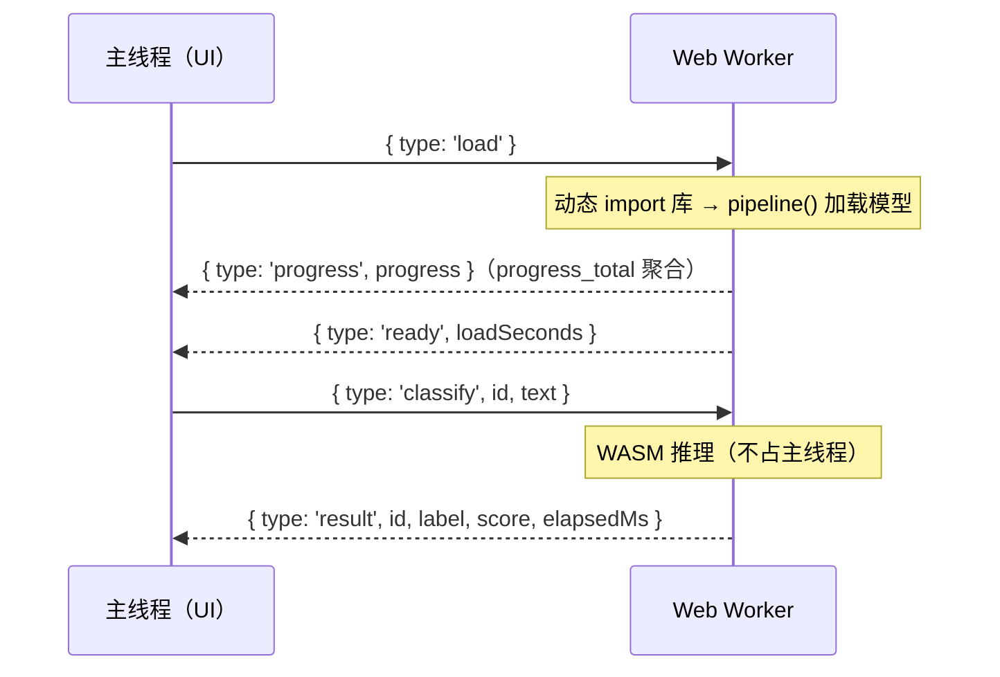

import { Canvas, Controls, Meta } from '@storybook/addon-docs/blocks';
import * as WebWorkerStories from './web-worker.stories';

<Meta of={WebWorkerStories} name="Docs" />

# Web Worker 加载

`pipeline()` 的加载与推理默认发生在主线程——与页面渲染、点击处理共用同一条线程。onnxruntime-web 的 WASM 后端在调用线程上同步执行模型初始化与每次前向（`env.backends.onnx.wasm.proxy` 默认 `false`），所以主线程直跑时：下载可以靠缓存与进度提示缓解，但**每一次推理都是一次全页冻结**——动画停摆、输入无响应。本课把「加载库 → 加载模型 → 推理」整体搬进 Web Worker：worker 内执行加载与推理，`progress_callback` 的进度事件以消息转发回主线程；主线程只负责 UI 与消息收发。

读完本页你应该能预测实例的行为：同一句话分别在「Web Worker」与「主线程」两个位置推理——主线程推理期间画布的帧时间线出现空洞，「最大帧间隔」飙到数百毫秒；worker 推理期间主线程稳定在约 60 fps，最大帧间隔约一帧（17 ms 左右）。



| 对象 / 消息 | 方向 | 作用 | 回查要点 |
| --- | --- | --- | --- |
| `new Worker(new URL('./x.ts', import.meta.url), { type: 'module' })` | 主线程 | 创建模块 worker | Vite 静态检测该模式自动接管打包；`new URL` 必须直接写在括号内，参数必须是字面量 |
| `{ type: 'load' }` | 主 → worker | 让 worker 开始加载库与模型 | 库与模型必须在 worker 内各自加载，不与主线程共享 |
| `progress_callback` | worker 内 | 接收加载事件流 | 事件在 worker 线程触发，需 `postMessage` 转发 |
| `{ type: 'progress', progress }` | worker → 主 | 聚合下载进度（0~100） | 来自 v4 的 `progress_total` 聚合事件，一条消息即可驱动进度条 |
| `{ type: 'ready', loadSeconds }` | worker → 主 | pipeline 就绪 | worker 常驻，pipeline 只建一次 |
| `{ type: 'classify', id, text }` | 主 → worker | 请求推理 | `id` 用于配对请求与结果 |
| `{ type: 'result', id, label, score, elapsedMs }` | worker → 主 | 回传推理结果 | 消息经结构化克隆，只传普通对象；`elapsedMs` 在 worker 内计时 |
| `{ type: 'error', stage, message }` | worker → 主 | 加载或推理失败 | `stage` 区分失败发生在哪一步 |
| `worker.terminate()` | 主线程 | 硬停 worker | 库、模型、进行中的推理一并丢弃 |

## 为什么推理要搬进 Worker

关键机制只有一条：**WASM 推理占用执行它的那条线程**。onnxruntime-web 的 WASM 后端默认不开 `proxy`，模型会话的初始化（解析与优化计算图）和每次前向都是同步的 CPU 工作，谁调用就冻结谁——主线程调用，页面的渲染帧、点击、输入全部排队等待。这解释了两个容易混为一谈的现象：

- **下载不冻结线程。** 模型文件下载是网络 IO，等待期间主线程空闲，所以 [1.2 课](?path=/docs/first-pipeline--docs) 的进度条能正常绘制；
- **冻结发生在下载之后。** 建会话与推理是同步 CPU 工作——进度条走完的那一刻到结果出现之间的停顿，就是主线程被占用的时长。

判断入口：页面有持续交互（动画、滚动、输入）且推理频繁，搬进 worker；一次性后台计算、无交互页面或 Node 脚本，主线程即可。WebGPU 推理同样适用本课模式——GPU 会话在 worker 中可用，官方示例仓库的 WebGPU 应用正是在 worker 里 `requestAdapter` 并跑推理。

下面的内嵌实例创建的就是**真实 worker**（本工作区的 Storybook 由 Vite 驱动，`new URL` 模式在开发服务器中直接生效）。实例为了免安装依赖，库本体由官方 CDN 动态 import；模型与 1.2 / 2.1.2 课是同一份 q8 文件（约 68 MB），若你在本浏览器打开过那些课，worker 直接命中同源缓存。切换「推理位置」到「主线程（对照）」，同一状态机会在主线程再加载一份管线用于对比。

<Canvas of={WebWorkerStories.Interactive} />
<Controls of={WebWorkerStories.Interactive} />

| 读者操作 | 可观察证据 |
| --- | --- |
| 等待首次加载 | 「状态」从 加载中 变为 就绪；进度来自 worker 转发的 `progress` 消息 |
| 切换「推理位置」到 主线程（对照） | 另一侧开始加载（命中缓存则秒级就绪）并自动推理一次 |
| 在两个位置分别推理同一句 | 主线程推理期间帧时间线出现空洞或红线，「最大帧间隔」数百毫秒；worker 模式保持约 60 fps、最大帧间隔约 17 ms |
| 打开 Show code | 按线程顺序看到 `sentiment-worker-client.ts`（主线程）与 `sentiment-worker.ts`（worker）两个文件 |

## Worker 内加载库与模型

worker 是一条独立的 JS 线程、一个独立的环境：主线程 import 过的模块实例——库、`env`、pipeline——**都不会跨线程共享**。想让什么在 worker 里跑，就要在 worker 里 import 什么、加载什么。两种写法按项目形态选：

- **npm + 打包项目（Vite 等）：** worker 文件顶部静态 import，打包器会把 worker 文件连同依赖打成独立 chunk，不污染主线程 bundle。官方示例仓库的 react-translator 正是这种写法：`worker.js` 内 `import { pipeline } from '@huggingface/transformers'`。

```js
// worker.js（官方 react-translator 示例的模式）
import { pipeline } from '@huggingface/transformers';
```

- **免构建 / CDN 场景：** worker 内动态 import CDN URL，与兄弟课主线程的写法相同——`import()` 返回 Promise，在 worker 的异步消息处理里 `await` 即可。本课实例的 worker 用的就是这种：

```js
// sentiment-worker.ts（worker 线程）——免构建场景
const { pipeline } = await import(
  /* @vite-ignore */ 'https://cdn.jsdelivr.net/npm/@huggingface/transformers@4.3.0'
);
```

加载逻辑本身不需要为新环境改写：`pipeline()`、`from_pretrained`、`progress_callback` 在 worker 内的行为与主线程一致，[2.1.2 课](?path=/docs/model-inference--docs) 的手工链路同样成立。两点新边界：加载完成的标志不是「worker 启动」而是收到 `ready` 消息（见下一节）；加载中的重复 `load` 消息应复用同一次加载（幂等），本课 worker 用一个 `loading` Promise 实现。

### worker 内的 env 默认值与缓存

v4 的运行环境检测显式覆盖 worker（`env.js` 源码核实）：`self.constructor.name` 为 `DedicatedWorkerGlobalScope` 时 `IS_WEBWORKER_ENV = true`，并计入 `IS_WEB_ENV`。因此：

- **`env.allowLocalModels` 在 worker 内默认 `false`，与浏览器主线程一致**，不需要重设。[2.3.2 env 配置](?path=/docs/env-config--docs) 课讲过：这是 env 里唯一浏览器 / Node 默认相反的字段，worker 被明确划入「浏览器」一侧。
- **`useBrowserCache` 默认 `true` 且同源共享。** Cache API 在 worker 中可用；缓存按源存储，worker 与页面同源，共用同一个 `transformers-cache` 缓存桶——在兄弟课下载过的模型，worker 里直接命中，不再走网络。
- **env 每个线程一份。** `env` 是各 JS 环境自己的全局单例，主线程改 `env` 不会影响 worker 里那份；需要定制时（`remoteHost`、自定义 `fetch` 等）在 worker 内、第一次加载之前设置。

结论：v4 中把加载代码搬进 worker 不需要任何 env 补偿；缓存的完整策略（离线、自托管、清理）仍由 [4.2 缓存与离线](?path=/docs/cache-offline--docs) 承载。

## 主线程与 Worker 的消息协议

线程边界上只能传消息，协议就是这条边界上的全部 API。设计要点四条：

1. **加载是一条消息，不是副作用。** worker 启动不等于模型就绪。主线程发 `{ type: 'load' }` 掌握预热时机——官方示例两种时机都有：收到首条请求才懒加载（react-translator），或 worker 启动即加载（text-to-speech-webgpu）；显式 `load` 消息让主线程能选「页面空闲时预热」。
2. **进度转发只用一条消息。** `progress_callback` 的事件在 worker 线程触发，主线程的进度条只能靠转发。v4 的 `progress_total` 聚合事件把所有文件的字节进度折成一个 0~100 的数（事件流回顾见 [1.2 课](?path=/docs/first-pipeline--docs)），转发它一个就够；整数百分比没变化就不发，避免消息风暴。
3. **用 `id` 配对请求与结果。** 推理请求可能连续发出（用户连点、切文本），结果到达顺序与发出顺序一致，但旧结果可能晚于新请求——主线程比对 `id`，只接受当前请求的结果，其余丢弃。
4. **消息体保持可克隆。** `postMessage` 经结构化克隆：普通对象、字符串、数字直接传；Tensor、pipeline 实例传不过去，也不应该传——线程边界交换数据，不交换能力。

协议的最小骨架（本课实例的完整实现见 Show code 的两个文件）：

```ts
// 主线程：创建 worker、收发消息
const worker = new Worker(new URL('./sentiment-worker.ts', import.meta.url), {
  type: 'module',
});

worker.postMessage({ type: 'load' });
worker.addEventListener('message', (event) => {
  const data = event.data;
  if (data.type === 'progress') renderProgress(data.progress);
  if (data.type === 'ready') enableInput();
  if (data.type === 'result' && data.id === currentId) showResult(data);
});
```

```ts
// worker 线程：协议入口只有两类请求，处理完 postMessage 回报
scope.addEventListener('message', (event) => {
  if (event.data.type === 'load') void ensureLoaded();
  if (event.data.type === 'classify') {
    void classify(event.data.id, event.data.text);
  }
});
```

## 打包器集成：new URL 模式

`new Worker(new URL('./sentiment-worker.ts', import.meta.url), { type: 'module' })` 是 Vite 的官方 worker 用法，也是官方示例仓库的通用模式。Vite 静态分析这一调用：

- **开发服务器：** worker 文件以 ESM 直接供给浏览器（`type: 'module'` 依赖浏览器原生支持，Chrome 80+ / Firefox 114+ / Safari 15+）；
- **生产构建：** worker 连同其 import 的依赖打成独立 chunk，对 module 支持的依赖在构建时消失（产物格式由 `worker.format` 决定）；
- **两条识别规则：** `new URL(...)` 必须直接写在 `new Worker(...)` 括号内（拆到变量里会被当成静态资源 URL）；构造参数必须是字面量。

单文件分发场景可用 `?worker&inline` 把 worker 编译成 base64 内联进主 bundle。本页实例在 Storybook（Vite 开发服务器）中创建的就是这个模式的真实 worker——Canvas 里的加载与推理确实发生在另一条线程。

## 生命周期：terminate 与重建

- **worker 常驻，pipeline 单例。** 与主线程「实例只创建一次」同理（[1.2 课](?path=/docs/first-pipeline--docs)）：worker 启动后持续存在，消息随到随处理；换文本、换参数都只是新消息。
- **`terminate()` 是硬停。** 立即终止线程：已加载的库与模型、进行中的推理、尚未处理的消息全部丢弃；Cache API 里的磁盘缓存不受影响。重建 = `new Worker` + 重发 `load`，命中缓存时数秒内就绪。
- **卸载时 terminate。** 组件卸载或确认不再使用时显式 terminate，否则 worker 连同其中的模型内存常驻页面——本课示例在 `dispose()` 中 terminate，离开本页即释放。
- **没有优雅关闭，也没有中断。** worker 没有「请求退出」API；推理一旦开始也无法中断（库不透传 AbortSignal，见 [2.3.2 课](?path=/docs/env-config--docs)）。要在中途「取消」，只能主线程丢弃过期 `id` 的结果（省的是渲染，不是算力），或 terminate 换取立即释放。

## 最佳实践

- **自管 worker 与 ORT `proxy: true` 的取舍。** 只想「推理不卡 UI」、不需要进度与自定义协议时，`env.backends.onnx.wasm.proxy = true` 一行即可（ORT 在内部 worker 里执行 WASM 推理，WebGPU 会话不需要它）；需要进度转发、请求排队、结果配对、流式输出时，用本课的自管 worker——官方示例仓库全部采用后者。
- **预热在 worker 里做。** 页面空闲时发 `{ type: 'load' }`（首屏渲染后或 `requestIdleCallback`），用户点击时 worker 已就绪。主线程模式的预热只能掩盖下载等待，worker 模式连推理阻塞一起消除——预热的价值在 worker 里被放大。
- **worker 文件保持纯计算。** worker 没有 `window` / `document`：DOM 更新全部留在主线程，跨线程只传数据。库本身不碰 DOM（v4 显式支持 worker 环境），会碰到 DOM 的通常是你自己的 `progress_callback` 或回调代码。
- **两个位置不要同时常驻。** 对照调试时难免主线程、worker 各加载一份管线（内存约两倍）；生产代码只保留一个推理位置。

## 常见问题

- 控制台报 `Failed to construct 'Worker'`，或 Network 面板里 worker 文件 404
  多为打包器没识别 worker 引用：`new URL(...)` 必须直接写在 `new Worker(...)` 内，路径与 `{ type: 'module' }` 必须是字面量；老 webpack 项目需要 `worker-loader` 一类的处理。先确认 worker 文件真的以模块身份被加载，再看构造调用写法。
- worker 里报 `window is not defined`，或主线程改了 env 却「没生效」
  worker 没有 `window` / `document`：报错说明库外代码碰了 DOM——DOM 操作回传主线程做。「env 没生效」是因为 env 每个线程一份，worker 用的那份要在 worker 内改。
- 个别浏览器报 module worker 相关错误，或 `type: 'module'` 不被支持
  开发模式下模块 worker 依赖浏览器原生支持（Firefox 114+ 等）；Vite 的生产构建会编译掉这一依赖（按 `worker.format` 输出），所以症状通常是「开发挂、生产正常」。升级浏览器即可。
- `terminate()` 之后 `postMessage` 毫无反应
  worker 已被硬停，消息被静默丢弃：重建 worker、重发 `load`、等 `ready` 后再发请求；terminate 时进行中的推理不会回来任何 `result` 消息。
- worker 里首次加载很慢，页面进度条却一动不动
  进度条不动是因为 `progress_callback` 事件发生在 worker 线程、没有转发——本课协议里的 `progress` 消息就是干这个的。加载慢本身与主线程模式相同：首次约 68 MB，之后命中同源缓存（worker 与页面共用 `transformers-cache`）。

## 总结回顾

摘要：

WASM 后端的模型初始化与每次前向是同步 CPU 工作，占用执行它们的线程：主线程直跑时，进度条走完后的停顿与推理期间的全页冻结都是这条机制的表现。把「加载库 → 加载模型 → 推理」整体搬进 Web Worker 后，主线程只剩 UI 与消息收发：worker 内按需加载库（打包项目静态 import、免构建动态 import CDN），`progress_callback` 的 `progress_total` 聚合事件转发为一条 `progress` 消息，推理结果带上请求 `id` 回传配对。v4 中 worker 被显式划入 web 环境——`allowLocalModels` 默认 `false`、浏览器缓存可用且与页面同源共享，搬代码不需要 env 补偿。打包器用 `new Worker(new URL(...), { type: 'module' })` 模式接管 worker 的开发供给与生产打包；`terminate()` 硬停 worker、丢弃其中一切，重建只需重发 `load`。

一句话：

> 推理代码在哪条线程，哪条线程就要承受它的阻塞——把加载与推理整体搬进 worker，主线程只留 UI 与消息。

知识要点：

- 为什么 WASM 推理会冻结页面？下载与推理哪个阻塞线程？
- worker 内加载库的两种写法分别适用什么项目形态？
- 消息协议里 load / classify / progress / ready / result / error 各承担什么？`id` 与 `progress_total` 分别解决什么问题？
- Vite 识别 `new URL` worker 模式的两条规则是什么？开发与生产行为有何差异？
- worker 内的 env 默认值与主线程有何异同？缓存是否共享？
- `terminate()` 丢弃什么、保留什么？「取消」一次推理有哪些手段、各放弃什么？

## 参考资料

- [utils/core.js（v4.3.0 源码）](https://github.com/huggingface/transformers.js/blob/4.3.0/packages/transformers/src/utils/core.js)
  `progress_total` 聚合事件的字段定义与 `DefaultProgressCallback` 的自动包装逻辑。
- [env.js（v4.3.0 源码）](https://github.com/huggingface/transformers.js/blob/4.3.0/packages/transformers/src/env.js)
  `IS_WEBWORKER_ENV` 检测（`self.constructor.name`）与 worker 下的默认值：`allowLocalModels: false`、`useBrowserCache: true`。
- [Vite · Web Workers](https://vite.dev/guide/features.html#web-workers)
  `new Worker(new URL(...), { type: 'module' })` 的识别规则、开发与构建行为、`?worker&inline` 与 `worker.format`。
- [transformers.js-examples · react-translator](https://github.com/huggingface/transformers.js-examples/tree/main/react-translator)
  官方 worker 模式参照：主线程 `new Worker(new URL('./worker.js', import.meta.url), { type: 'module' })`，worker 内静态 import 库并 postMessage 进度（懒加载时机）。
- [transformers.js-examples · text-to-speech-webgpu](https://github.com/huggingface/transformers.js-examples/tree/main/text-to-speech-webgpu)
  worker 内使用 WebGPU（`navigator.gpu.requestAdapter`）与「worker 启动即加载」时机的官方示例。
- [MDN · Worker](https://developer.mozilla.org/en-US/docs/Web/API/Worker/Worker)
  Worker 构造器的 `type: 'module'` 选项与 terminate 语义。
- [1.2 第一个 pipeline](?path=/docs/first-pipeline--docs)
  `progress_callback` 事件流、pipeline 单例与浏览器缓存行为的来源课。
- [2.3.2 env 配置](?path=/docs/env-config--docs)
  env 默认值全表、`env.backends.onnx.wasm.proxy` 与「库不透传 AbortSignal」的依据课。
- [2.1.2 model 前向推理](?path=/docs/model-inference--docs)
  本课示例同一模型的另一条用法（手工链路），缓存互相命中。
