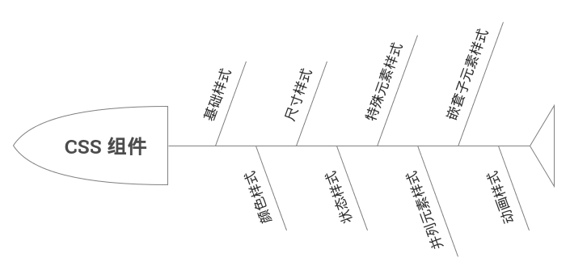

- 基础样式

    - 说明：任何一个 CSS 组件在刚开始都要先定义基本样式，就像一个新的 HTML 页面制作之前都要先定义统一的字号、背景色一样；
    - 属性：位置，布局，显示方式，对齐方式，字体族，字体粗细等；
    
- 颜色样式

    - 说明：Bootstrap 默认为很多组件都提供了 5 种颜色的样式，定义规则是：`组件名称-颜色类型`，例如如：`btn-primary`；
    - 颜色：primary、success、info、warning、danger
    - 属性：文本颜色，边框颜色，背景颜色；
    - 备注：
    
        - 具体定义什么颜色和该组件的特性有关，例如：面板只需要定义边框的颜色就可以了，而按钮不仅需要定义边框颜色，还需要定义背景色以及文本颜色；
        - 需要定义其内部子样式的颜色以便形成统一风格，比如 `.panel-success` 内部的 `.panel-heading` 顶部元素也要定义一个相同风格的颜色；

- 尺寸样式

    - 说明：Bootstrap 为大部分组件都提供了尺寸的快捷设置；
    - 大小：xs、sm、default、lg；
    - 属性：边框圆角，内边距，行高，字体大小；
    - 备注：默认尺寸没有单独的样式类，在定义基础样式类已经包含了默认尺寸样式（避免重复编写默认大小类名）；

- 状态样式

    - 说明：有一些可单击元素，经常需要根据状态来显示其效果，比如：高亮可用的时候用 active 样式，禁用的时候用 disabled 样式或 disabled 属性；
    - 状态：default，active（悬浮，获取焦点），disabled；
    - 属性：阴影，虚框，透明度，鼠标形状，颜色加深；
    - 备注：
    
        - 状态样式通常在基础样式和颜色样式基础上进行特殊处理；
        - 不仅要注意当前元素的状态样式，还要注意嵌套元素的相关样式；

- 特殊元素样式

    特定类型的组件一般只由某一种或者几种固定的元素组成，例如：警告框内一般只用警告标题、内容和关闭链接元素。在定义这些组件的时候，也要为这些常用的元素定义其相关的默认样式。

- 并列元素样式

    - 说明：在很多情况下，一个组件内部需要重复放置多个特定元素，比如导航组件里可以放置多个列表元素；
    - 属性：水平排列的左右内外边距，垂直排列的上下内外边距；
    - 备注：区分特殊元素样式，并列元素通常指的是特殊元素重复出现的情况

- 嵌套子元素样式

    - 说明：有的时候，我们也需要将两个相同或不同的组件嵌套在一起使用，这时经常会出现一些特殊情况，例如，多个按钮组在一起使用，或者按钮和下拉菜单一起使用。
    - 属性：组件外边距，首尾组件边框

- 动画样式

    在 Bootstrap 里，动画样式应用得不是很多，目前只在进度条组件里会使用到（只需要在 progress 样式上应用一个 active 样式，即可开启动画过渡效果）。

注意要点

- 设置状态的时候要兼顾基础样式和颜色样式；
- 设置尺寸样式的时候，又要考虑并列元素的情况；
- 根据不同的组件，还要考虑是垂直并列元素还是水平并列元素；
- 由于这些样式是利用了 CSS 重载覆盖的概念，所以一定要注意其定义的顺序，以免出现重载顺序错误的问题。
