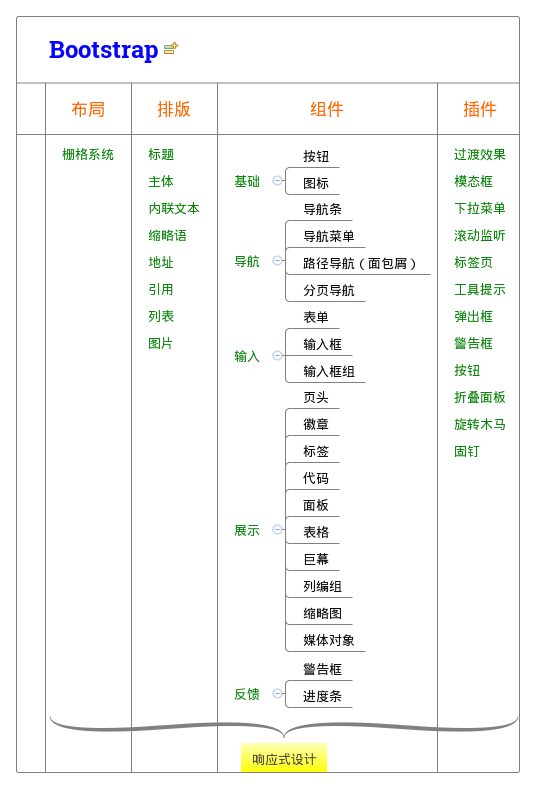

1. 响应式设计：页面设计根据系统，屏幕尺寸，屏幕方向等进行相应的响应和调整；
2. 栅格系统：通过一系列的行与列的组合来创建页面布局；
3. 排版：优化标题，主体，文本，地址，列表，引用等；
4. 组件：无数可复用的组件，包括字体图标、下拉菜单、导航、警告框、弹出框等更多功能；
5. 插件：为 Bootstrap 的组件赋予了“生命”；

# 参考文献

- [有关Bootstrap你想要知道的都在这里](https://zhuanlan.zhihu.com/p/21472801)
- [bootstrap源码分析之整体架构](http://hzhuang.com.cn/2015/12/17/bootstrap/bootstrapOverallArchitecture/)
- [bootstrap-modal 学习笔记 源码分析](http://www.cnblogs.com/aaronjs/p/3160863.html)
- [bootstrap源码解析之Carousel插件](http://www.xiaoluo.win/2016/05/11/bscarousel/)

## 扩展

- [bootstrap-material-design](https://github.com/mdbootstrap/bootstrap-material-design)
