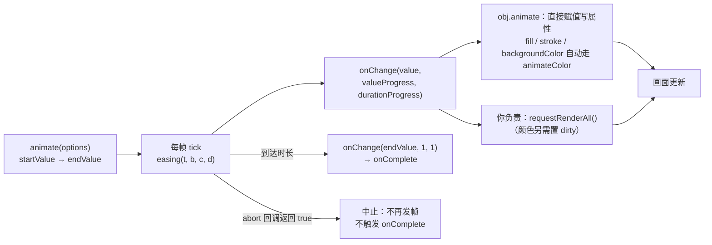

import { Canvas, Controls, Meta } from '@storybook/addon-docs/blocks';
import * as Animation from './animation.stories';

<Meta of={Animation} name="Docs" />

# 动画

Fabric 的动画是一台**补间引擎**：`util.animate` / `obj.animate` 按缓动曲线在起止值之间逐帧算出一个数（或一种颜色），通过 `onChange` 回调交给你——写属性、让画面跟上、结束后续接，全是回调里的事。它不依赖 FabricObject（`obj.animate` 只是一层薄封装），也**不会自动重绘**；颜色补间由 `animateColor` 单独做 rgba 插值。本课讲清三个入口、回调时序、缓动清单、颜色插值、与渲染 / 缓存的配合、并行 / 链式 / 覆盖重启、取消时机，以及它和 requestAnimationFrame 帧循环的分工。



| API / 概念 | 默认值 | 回查要点 |
| --- | --- | --- |
| `util.animate({...})` | duration `500`、delay `0`、startValue `0`、endValue `100` | 数值 / 数组补间；返回动画实例（`state` / `abort()` / `isDone()`） |
| `util.animateColor({...})` | easing 为正弦缓入（公式同 defaultEasing） | 颜色插值；onChange 收 `rgba(...)` 字符串 |
| `obj.animate({ left: 400 }, opts)` | startValue 取对象当前值 | fill / stroke / backgroundColor 自动走 animateColor；onComplete 封装先 `setCoords()` 再进回调 |
| `onChange` / `onComplete` / `abort` | `noop` / `noop` / `() => false` | 参数都是 `(value, valueProgress, durationProgress)` |
| 状态机 | `pending` → `running` → `completed` / `aborted` | delay 期间是 pending，但已注册进 runningAnimations |
| `util.ease.*` | `defaultEasing`（公式同 easeInSine） | 10 族 × in / out / inOut 共 30 个；Penner 形态 |
| `runningAnimations` | 全局数组 | `cancelAll` / `cancelByCanvas` / `cancelByTarget`；`dispose()` 会自动取消 |

## 快速上手

```ts
import { Canvas, Rect, util } from 'fabric';

const canvas = new Canvas(el, { width: 640, height: 360 });
const rect = new Rect({
  left: 80,
  top: 180,
  width: 120,
  height: 90,
  originX: 'center',
  originY: 'center',
});
canvas.add(rect);

rect.animate(
  { left: 480 },
  {
    duration: 1000,
    easing: util.ease.easeOutBounce,
    onChange: () => canvas.requestRenderAll(), // 补间只改值不重绘，刷新是回调里的职责
  },
);
```

## 入口与版本

v7 的真实入口（以 7.4.0 的 `.d.ts` 为准）：

```ts
import { util, runningAnimations } from 'fabric';

util.animate({ startValue: 0, endValue: 100, onChange: (v) => {} }); // 数值 / 数组补间
util.animateColor({
  startValue: '#f00',
  endValue: '#00f',
  onChange: (rgba) => {},
});
util.ease.easeOutBounce; // 缓动函数命名空间
util.requestAnimFrame;   // rAF 薄封装（走 fabric 的 window）
runningAnimations;       // 进行中动画的注册表（数组）
```

注意 `animate` / `animateColor` **不是** `fabric` 的具名导出——`import { animate } from 'fabric'` 不存在；v6 起主入口只以 `util` 命名空间导出它们，外加顶层 `runningAnimations`。

对象方法 `obj.animate` 在 v7 仍然存在，但签名换成了「目标值映射」形态。从 v5 资料迁移时按下表对照（v5 印象里的写法大多要改）：

| v5（全局命名空间时代） | v6 / v7 |
| --- | --- |
| `fabric.util.animate({...})` | `util.animate({...})`（`import { util } from 'fabric'`） |
| `obj.animate('left', 500, options)` | `obj.animate({ left: 500 }, options)`，返回 `{ left: 动画实例 }` 映射 |
| `obj.animate('left', '+=100', ...)` 相对目标 | 已移除：字符串终值算出 NaN，相对量自己算 `obj.left + 100` |
| `fabric.util.animateColor(from, to, duration, { colorEasing })` | `util.animateColor({ startValue, endValue, duration, easing, ... })`，缓动换成 Penner 形态 |
| `fabric.util.ease.easeOutBounce` | `util.ease.easeOutBounce`（函数族没变，只换入口） |
| `fabric.runningAnimations.findAnimation(ctx)` | 注册表就是数组：`find` / `filter` / `some` 直接用 |

两版一致的部分：默认时长 500ms、默认缓动公式（正弦缓入）、abort / onChange / onComplete 回调族、按 target 注册取消。

## 补间选项与回调

`util.animate` 的完整形态：

```ts
const anim = util.animate({
  startValue: 0, // 默认 0；数组补间默认 [0]
  endValue: 100, // 默认 100；数组补间默认 [100]
  duration: 500, // ms
  delay: 0,      // ms；到点后才置 running 并触发 onStart
  easing: util.ease.easeInOutQuad, // 默认 defaultEasing
  target: obj,    // 只用于注册表按目标取消，不绑定任何行为
  onStart: () => {},
  onChange: (value, valueProgress, durationProgress) => {
    // value：当前值；valueProgress：值进度 [0,1]；durationProgress：时间进度 [0,1]
  },
  onComplete: (value) => {},
  abort: (value) => false, // 每帧调用；返回 true 即中止
});
anim.state; // 'pending' | 'running' | 'completed' | 'aborted'
anim.abort(); // 立即取消（连 delay 的 setTimeout 一起清掉）
anim.isDone(); // completed 或 aborted
```

回调时序（对 7.4.0 实测）：`start()` 立即注册进 runningAnimations；delay > 0 先等 setTimeout，到点后在第一个 rAF 里置 running、触发 onStart、以 0 进度回调一次 onChange；之后每帧回调 onChange；到达时长后**先以终值回调 `onChange(endValue, 1, 1)`，再回调 `onComplete(endValue, 1, 1)`**。abort 回调在每帧先于完成判定执行，返回 true 的那一帧补间转入 aborted——不再发帧、不触发 onComplete。

startValue / endValue 传数组就是数组补间，一条补间驱动多个关联数值（官方示例用于视口缩放）：

```ts
util.animate({
  startValue: [cx, cy, 1],
  endValue: [x, y, 2],
  onChange: ([px, py, zoom]) => {
    canvas.zoomToPoint(new Point(px, py), zoom);
    canvas.renderAll();
  },
});
```

`obj.animate` 是这层能力的对象封装：目标值映射的每个键各起一条补间、共享同一份 options；startValue 默认取对象当前属性值；键名支持 `.` 嵌套路径；`abort` 选项会被 bind 到对象；onComplete 封装先调 `setCoords()` 更新命中区再进你的回调。

<Canvas of={Animation.Interactive} />
<Controls of={Animation.Interactive} />

按下表逐项核对：

| 读者操作 | 可核对结果 |
| --- | --- |
| 观察默认补间（位置 left、defaultEasing、1000ms） | 矩形从左虚线框滑向右虚线框，起步慢、收尾快——正弦缓入；「已运行时长」到 1000ms 停住，「状态」变为 已完成 |
| 「缓动曲线」切到 easeOutBounce | 矩形落到终点后弹跳数次；切到 easeInOutBack 则起步先向反方向退一小段——过冲 / 回退是缓动的正常行为 |
| 「缓动曲线」切到 easeOutElastic | 「值进度」会短暂超过 100%——它按 (当前值 − 起点值) 的绝对值计算，缓动过冲（超出终点）或回退（低于起点）都会被算成正向进度 |
| 把「时长」调到 200ms 再切换目标属性 | 帧数变少、读数刷新变粗（readout 约按 100ms 节流）——短时长下肉眼与读数都难分辨 |
| 补间进行中改「缓动曲线」或「时长」 | 旧补间停止写入，「覆盖重启次数」加 1，新补间从起点重新开始——abort 回调的覆盖式重启 |
| 「目标属性」切到 缩放 | 虚线框标出 ×1 与 ×1.8 两档；一次 `obj.animate` 同时驱动 scaleX / scaleY 两条补间，「属性当前值」显示 × 倍数 |
| 「目标属性」切到 旋转 | 矩形绕中心转满 360°；onComplete 前框架已自动 `setCoords()`，结束后的命中区与视觉一致 |
| 「目标属性」切到 填充色 | 「属性当前值」变为 rgba 字符串，从起点色渐变到终点色；终点 alpha 可能出现 `1.11e-16` 之类的浮点残差——alpha 只夹取不取整 |
| 填充色目标下关闭「补间时标记缓存失效」 | 读数照常渐变，画面颜色停在起点——直接赋值不置 dirty、缓存位图不重建（见「渲染与缓存」） |
| 打开 Show code | 看到该 Canvas 实际执行的 example.ts |

## 缓动函数

`util.ease` 是 31 个缓动函数的命名空间：10 个族各配 easeIn（缓入）/ easeOut（缓出）/ easeInOut（缓入缓出）三种，加上 `defaultEasing`。

| 族 | 函数名后缀 | 手感 |
| --- | --- | --- |
| Sine 正弦 | `easeInSine` / `easeOutSine` / `easeInOutSine` | 最平缓的加减速 |
| Quad 二次 / Cubic 三次 / Quart 四次 / Quint 五次 | 同规则替换族名 | 幂次越高，起步收尾对比越强 |
| Expo 指数 | `easeInExpo` / `easeOutExpo` / `easeInOutExpo` | 起步近乎停顿后猛冲（或反之） |
| Circ 圆弧 | `easeInCirc` / `easeOutCirc` / `easeInOutCirc` | 类幂次但曲线更“圆” |
| Elastic 弹性 | `easeInElastic` / `easeOutElastic` / `easeInOutElastic` | 弹簧式振荡，会冲过终点再回稳 |
| Back 回退 | `easeInBack` / `easeOutBack` / `easeInOutBack` | 先向反方向退一点再奔目标 |
| Bounce 反弹 | `easeInBounce` / `easeOutBounce` / `easeInOutBounce` | 落地弹跳式的分段衰减 |

- `defaultEasing`（不传 easing 时的默认）公式与 `easeInSine` 完全一致（对 7.4.0 实测相等）——所以默认动画总是“起步慢、收尾快”。
- 函数形态是 Penner 四参：`(timeElapsed, startValue, byValue, duration) => number`。注意第二个参数是**起点值**、第三个是**增量**（endValue − startValue），不是终点值。自定义缓动按这个签名写即可：

```ts
util.animate({
  startValue: 0,
  endValue: 400,
  easing: (t, b, c, d) => b + c * (t / d), // 自己写一条线性缓动
  onChange: (v) => {
    rect.left = v;
    canvas.requestRenderAll();
  },
});
```

- 数组补间与颜色补间调用同一个缓动时会多传第 5 参 `index`（当前通道下标），做逐通道差异化时可用。
- 选型不必背名字：官方 [animation-easing demo](http://fabricjs.com/demos/animation-easing/) 可以逐条跑全部曲线。

## 颜色补间

`util.animateColor` 把两端颜色解析成 rgba 数组（r / g / b 为 0-255 整数，a 为 0-1），逐通道插值；r / g / b 每帧四舍五入，alpha 用 `capValue(0, a, 1)` 夹取**但不取整**——终点 alpha 可能带 `1.11e-16` 这类浮点残差。回调收到的是拼好的 `rgba(...)` 字符串：

```ts
util.animateColor({
  startValue: '#ff0000', // Color 能解析的形态都行：hex / rgb / 命名色……
  endValue: 'rgba(0,0,255,0)',
  duration: 1000,
  easing: util.ease.easeInOutQuad, // 不传则用颜色默认缓动（正弦缓入）
  onChange: (rgba) => {
    rect.fill = rgba; // 回调值是 'rgba(r,g,b,a)' 字符串
    rect.set('dirty', true); // 颜色属于 cacheProperties，直接赋值不置 dirty
    canvas.requestRenderAll();
  },
});
```

`obj.animate` 会自动分发：`FabricObject.colorProperties` 是 `fill` / `stroke` / `backgroundColor`，目标值映射命中这三者时内部改走 `animateColor`，其余走数值补间；startValue 默认取对象当前值，用户回调照常收 rgba 字符串。实验台把「目标属性」切到 填充色 走的就是这条路径。

## 渲染与缓存

onChange 里有两件容易被漏掉的职责，都源自「补间引擎不认识画布」：

- **刷新画面。** 补间回调里 Fabric 不会自动重绘（改属性不触发渲染的机制见 [1.3 渲染模型](?path=/docs/rendering-model--docs)）。标准句式是 onChange 里 `canvas.requestRenderAll()`——同一帧里多条补间各调一次也只整帧渲染一次。fabric 源码注释另有一说：回调本身已运行在 rAF 内，用 `renderAll()` 立即渲染也成立、还能少排一帧队；但多条补间并行时会重复整帧渲染，默认仍推荐 requestRenderAll。
- **标记缓存。** `obj.animate` 写属性走**直接赋值**而非 `set()`。left / angle / scale / opacity 这些在合成期实时应用的属性无所谓；fill / stroke / backgroundColor 属于 cacheProperties，不置 dirty 缓存位图就不重建——症状是「读数在变、画面颜色不动」。补救：onChange 里 `rect.set('dirty', true)`，或对该对象关掉 objectCaching。dirty / 位图机制见 1.3 渲染模型。

变换属性是补间的典型配方：left / top（位移）、angle（旋转）、scaleX / scaleY（缩放）、skewX / skewY（倾斜）、opacity（淡入淡出）——它们不需要重建缓存位图，代价最小；旋转缩放围绕哪个点由 originX / originY 决定，见 [3.1 变换](?path=/docs/transform--docs)。

## 并行、链式与重启

- **多属性并行：** 一条 `obj.animate` 传多个键，就是共享同一 options 的多条并行补间（实验台的缩放模式同时驱动 scaleX / scaleY）；各条独立走帧、各自触发 onComplete。
- **多对象并行：** 各自调 animate，onChange 里统一 `requestRenderAll()` 即可合并成每帧一次渲染。
- **链式：** 在 onComplete 里发起下一段，可以拼序列或往复：

```ts
function swingForward() {
  rect.animate(
    { angle: 25 },
    {
      duration: 600,
      easing: util.ease.easeInOutQuad,
      onChange: () => canvas.requestRenderAll(),
      onComplete: swingBack, // 到点续接下一段
    },
  );
}
function swingBack() {
  rect.animate(
    { angle: -25 },
    {
      duration: 600,
      easing: util.ease.easeInOutQuad,
      onChange: () => canvas.requestRenderAll(),
      onComplete: swingForward,
    },
  );
}
```

- **覆盖式重启：** 用户连点“开始”时，旧补间不取消就会和新补间同时写同一属性，值来回跳。标准做法是 token + abort 回调——每帧检查令牌是否仍然有效：

```ts
let token = 0;
function restart() {
  token += 1;
  const current = token;
  rect.animate(
    { left: target },
    {
      abort: () => current !== token, // 旧补间下一帧发现令牌换人，自行中止
      onChange: () => canvas.requestRenderAll(),
    },
  );
}
```

实验台改任一控件就是这条路径：「覆盖重启次数」统计的正是未完成即被顶掉的补间。

## 取消与生命周期

- `anim.abort()`：立即中止——状态置 aborted、从注册表移除、清掉 delay 的 setTimeout；不触发 onComplete。
- `runningAnimations`（从 `fabric` 具名导入）本身是数组：`runningAnimations.find((a) => a.target === rect)`、`.some((a) => !a.isDone())` 直接查；批量取消有 `cancelAll()`、`cancelByCanvas(canvas)`、`cancelByTarget(target)`。手动从数组里 splice 只会让查询看不见它，动画本身照跑——取消要走 `abort()`。
- 自动取消已经接好：`obj.dispose()` 内部 `cancelByTarget(this)`；`canvas.dispose()` 内部 `cancelByCanvas`（覆盖 target 为该画布、或 target.canvas 指向该画布的补间）。delay 中等待的补间也已注册，同样能被取消。
- 本课范例的 dispose 就是这个收尾：断开 ResizeObserver → `runningAnimations.cancelByTarget(rect)` → `canvas.dispose()`，离开当前 Docs 页时不留发帧的补间。

## 帧循环与补间

补间适合“从状态 A 到状态 B”的一次性变化，结束即停、不占帧。没有终态的持续动画（呼吸、跟随、粒子、物理模拟）用 requestAnimationFrame 帧循环自己推进——官方 [animating-crosses demo](http://fabricjs.com/demos/animating-crosses/) 就是这个模式：自定义 Cross 对象持有方向状态，每帧推进尺寸并整帧重绘：

```ts
util.requestAnimFrame(function loop() {
  crosses.forEach((cross) => cross.step()); // 每帧推进各自状态
  canvas.renderAll();
  util.requestAnimFrame(loop);
});
```

`util.requestAnimFrame` / `util.cancelAnimFrame` 是 `window.requestAnimationFrame` 的薄封装（走 fabric 的 window，测试环境可替换），与浏览器原生等价。视频贴图这类“每帧换内容”的循环在 [2.3.3 图片](?path=/docs/image--docs)已经见过。

选择依据：有终态、时长已知 → 补间；无终态、状态互相影响 → 帧循环，并注意离屏暂停与页面隐藏时停帧（策略见 [7.2 性能优化](?path=/docs/performance--docs)）。

## 最佳实践

- onChange 的标准三件套：写值交给 `obj.animate`（或在 `util.animate` 的回调里自己赋值）、每帧 `requestRenderAll()`；颜色补间再加 `set('dirty', true)`。
- 会重复触发的动画（连点、重放）一律带 token + abort 回调；不要指望“再 animate 一次”能覆盖旧补间。
- 相对目标自己算终值：v5 的 `'+=100'` 语法已移除，写 `endValue: rect.left + 100`。
- 持续动画优先“需要时才循环”：补间结束自动停；rAF 循环要在不可见时暂停（IntersectionObserver / visibilitychange）。

## 常见问题

- 补间跑完了，画面从头到尾没动
  onChange 里没刷新画面——补间只负责算值和回调。补上 `canvas.requestRenderAll()`。典型旁证：鼠标在画布上交互一下，画面突然跳到终值（交互自动触发渲染，见 1.3 渲染模型）。
- 颜色补间读数在变，画面颜色不动
  `obj.animate` 写 fill 走直接赋值，不经过 `set()`，dirty 没置、缓存位图没有重建。onChange 里 `rect.set('dirty', true)`，或对该对象 `objectCaching: false`。实验台关闭「补间时标记缓存失效」可复现此症状。
- 升级 v6 / v7 后 obj.animate 报错或不生效
  签名换了：`rect.animate('left', 500, opts)` 要改成 `rect.animate({ left: 500 }, opts)`；相对值 `'+=100'` 会算出 NaN（属性变成 NaN），改成 `rect.left + 100`；`animateColor(from, to, duration, opts)` 改成单 options 对象形态。
- 重放动画时数值来回抖、结束值不对
  旧补间还活着，和新补间同时写一个属性。用 token + abort 回调让旧补间自行中止，或保存返回的动画实例调 `anim.abort()`。
- 在 delay 阶段取消补间没反应
  delay 中的补间已注册进 runningAnimations，但只有 `anim.abort()` 会连 setTimeout 一起清；仅把它从数组里移除，定时器到点后照样开跑。

## 总结回顾

摘要：

Fabric 的动画是补间引擎：`util.animate` / `animateColor` 按 Penner 形态的缓动函数逐帧算值，经 `onChange(value, valueProgress, durationProgress)` 交还给你，到时序终点先以终值回调 onChange 再回调 onComplete；abort 回调每帧先于完成判定执行，返回 true 即中止。`obj.animate({ 目标值映射 })` 是对象封装：startValue 默认取当前值，fill / stroke / backgroundColor 自动分发到 animateColor，onComplete 前自动 setCoords。渲染与缓存不在引擎职责内：onChange 里要 requestRenderAll，颜色补间还要手动置 dirty。组合上，多键 / 多对象天然并行，链式靠 onComplete 续接，重放靠 token + abort 覆盖重启；取消用 anim.abort() 或 runningAnimations 的 cancelByTarget / cancelByCanvas，dispose 时自动执行。无终态的持续动画交给 rAF 帧循环。

一句话：

> 补间引擎只负责“按缓动曲线算值并逐帧回调”：写属性、requestRenderAll、颜色时的 dirty，都是 onChange 里你的职责。

知识要点：

- v7 的动画入口有哪些？`obj.animate` 的新签名与 v5 差在哪？
- onChange / onComplete / abort 的参数与时序是什么？终值那一帧的回调顺序？
- util.ease 有哪些族、默认缓动等价于哪条？自定义缓动的函数签名？
- 颜色补间如何自动分发、回调收到什么、alpha 通道如何处理？
- 颜色补间画面不动的原因与修法是什么？
- 覆盖式重启怎么做？`anim.abort()` 方法与 abort 回调的差别？
- runningAnimations 能做什么？dispose 时机与自动取消范围？
- 补间与 rAF 帧循环各适合什么场景？

## 参考资料

- [util 命名空间 API（animate / animateColor / ease）](https://fabricjs.com/api/fabric/namespaces/util/)
- [util.animate 函数页](https://fabricjs.com/api/fabric/namespaces/util/functions/animate/)
- [util.animateColor 函数页](https://fabricjs.com/api/fabric/namespaces/util/functions/animatecolor/)
- [util.ease 缓动命名空间](https://fabricjs.com/api/fabric/namespaces/util/namespaces/ease/)
- [runningAnimations 注册表](https://fabricjs.com/api/variables/runninganimations/)
- [FabricObject 类（animate / colorProperties）](https://fabricjs.com/api/classes/fabricobject/)
- [官方 demo：animation-easing（缓动曲线对比）](http://fabricjs.com/demos/animation-easing/)
- [官方 demo：animating-crosses（rAF 帧循环模式）](http://fabricjs.com/demos/animating-crosses/)
- [旧版入门教程 Part 2（v5 动画写法对照）](https://fabricjs.com/docs/old-docs/fabric-intro-part-2/)
- [Object caching（dirty 与缓存位图机制）](https://fabricjs.com/docs/fabric-object-caching/)
