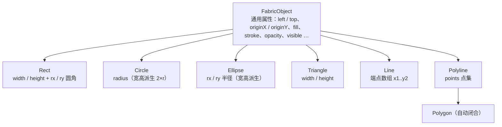

import { Canvas, Controls, Meta } from '@storybook/addon-docs/blocks';
import * as BasicShapes from './basic-shapes.stories';

<Meta of={BasicShapes} name="Docs" />

# 基础图形

Fabric 内置 7 个图形类：Rect、Circle、Ellipse、Triangle、Line、Polyline、Polygon。它们都是同一个 FabricObject 的薄子类——构造时传入一个 options 对象，类特有的字段只决定初始轮廓，位置、外观、可见性全部共用同一套通用属性。本课讲清每个类的构造参数与默认值、尺寸从哪里派生、left/top 到底定位到哪里，以及 Canvas.add 的基本用法；学完后，任选一个类都能预测“传什么参数、得到什么形状、出现在哪里”。任意轮廓（Path）见[路径](?path=/docs/path--docs)，文本与图片分别是[文本](?path=/docs/text--docs)与[图片](?path=/docs/image--docs)两课。



| 图形类 | 特有参数（默认值） | 尺寸来源 | 回查要点 |
| --- | --- | --- | --- |
| Rect | rx（0）、ry（0） | width / height 直接给定 | 构造只给其一时另一个取同值；渲染钳制在 min(rx, width/2) |
| Circle | radius（0）、startAngle（0）、endAngle（360）、counterClockwise（false） | width = height = 2 × radius | 改 radius 自动同步宽高；起止角切段 |
| Ellipse | rx（0）、ry（0） | width = 2×rx、height = 2×ry | rx/ry 是半径，与 Rect 的圆角不同义 |
| Triangle | 无特有参数 | width / height 直接给定 | 底边 = width，顶点在上方中点 |
| Line | 端点数组 [x1, y1, x2, y2]（默认 [0, 0, 0, 0]） | width = \|x2 − x1\|、height = \|y2 − y1\| | 只渲染 stroke；类已标记 @deprecated |
| Polyline | points（[]）、exactBoundingBox（false，已弃用） | 点集包围盒 | 改 points 后需 setDimensions() |
| Polygon | points（[]） | 同 Polyline | Polyline 子类，轮廓自动闭合 |

width / height 本身的默认值都是 0——这就是“对象 add 了却看不见”的第一嫌疑：Rect / Triangle 没给 width / height、Circle 没给 radius 时对象是零尺寸的。

## 创建图形与加入画布

创建分两步：构造时传一个 options 对象，再用 `canvas.add()` 挂到画布。v6 起全部改为命名导入：

```ts
import { Canvas, Rect } from 'fabric';

const canvas = new Canvas(el, { width: 640, height: 360 });

const rect = new Rect({
  left: 320, top: 180, // originX/originY 默认 'center'：这是矩形的中心点
  width: 160, height: 120,
  fill: '#4f7cff',
});
canvas.add(rect); // 返回画布当前对象数；renderOnAddRemove 默认 true，自动请求重绘
```

三个要点：

- **options 单对象是唯一入口。** 形状参数（如 rx、radius、points）和通用属性（left、fill 等）写在同一个对象里，没有位置参数（Line 的端点数组除外）。
- **构造时配置与事后 `set()` 等价。** `rect.set({ fill: '#e11d48', opacity: 0.6 })` 和写在构造 options 里功能相同；注意 `set()` 只改值，画面更新仍要 `canvas.requestRenderAll()`（见[渲染模型](?path=/docs/rendering-model--docs)）。
- **`add()` 是变参的。** `canvas.add(circle, triangle)` 一次挂多个；增删、插入与层级调整的完整 API 见[对象管理](?path=/docs/stacking--docs)。

<Canvas of={BasicShapes.CreateShape} />
<Controls of={BasicShapes.CreateShape} />

| 读者操作 | 可核对结果 |
| --- | --- |
| 切换「图形类型」 | 轮廓换成对应类；「尺寸 width×height」随各尺寸来源变化（Circle 124×124、Polyline 255×70） |
| 拖动「left」「top」 | 对象整体移动，读数同步——所有类共用同一套定位属性 |
| 改「fill 填充色」 | 各类型都变色；Line 的「fill」读数是 null，颜色其实落在 stroke 上 |
| 调低「opacity」、关闭「visible」 | 半透明、消失——通用属性对 7 个类行为一致 |

## 通用属性

所有图形类继承 FabricObject，共用下面这套高频属性（默认值与 fabric 7.4 源码核对）：

| 属性 | 默认值 | 说明 |
| --- | --- | --- |
| left / top | 0 / 0 | 位置；具体定位到哪里由 originX / originY 解释 |
| originX / originY | 'center' / 'center' | 定位基准；v7.0 起默认 center，v5 / v6 为 'left' / 'top' |
| width / height | 0 / 0 | 尺寸；多数类由形状参数派生，见下文各成员 |
| fill | 'rgb(0,0,0)' | 填充色；null 则不填充 |
| stroke | null | 描边色；不设置就没有描边（Line 因此不可见） |
| strokeWidth | 1 | 描边宽度，参与包围盒大小 |
| opacity | 1 | 不透明度，0 到 1 |
| visible | true | false 时对象不参与渲染，但仍留在对象列表里 |
| angle / scaleX / scaleY / flipX / flipY / skewX / skewY | 0 / 1 / 1 / false / false / 0 / 0 | 变换类属性，用法见[变换](?path=/docs/transform--docs) |

**定位语义是本课最重要的判断。** left / top 不是天然的“左上角坐标”——它是“锚点坐标”，锚点位置由 originX / originY 决定。v7.0 起（CHANGELOG PR #10715）两者默认 `'center'`：`left: 320` 把对象**中心**放到 x=320。v5 / v6 默认是 `'left' / 'top'`，大量社区教程按左上角写的代码直接照抄会整体偏移半个对象。类型层面官方已把 originX / originY 标注为 deprecated，注明“新项目请使用 'center'”——非 center 值仍完整可用，但新代码建议以中心语义思考。

其余两组属性只建立入口：

- **外观：** fill、stroke、strokeWidth 决定“画什么颜色、描多粗”。虚线、阴影、混合模式等细节见[填充、描边与阴影](?path=/docs/fill-stroke-shadow--docs)。
- **状态：** opacity 与 visible 的区别在于可见性之外的对象存在感——visible: false 的对象不渲染但仍被 getObjects() 列出、参与 toObject 序列化（除非 excludeFromExport）。

<Canvas of={BasicShapes.OriginAnchor} />
<Controls of={BasicShapes.OriginAnchor} />

| 读者操作 | 可核对结果 |
| --- | --- |
| 「originX」从 'center' 切到 'left' | 矩形绕红点重摆，红点贴到左边缘中点；「left / top」读数不变，「中心点」读数变了 |
| 再把「originY」切到 'top' | 红点贴到矩形左上角 |
| 拖动「left」 | 红点（锚点）与矩形一起移动——锚点是 left / top 的落点，不是矩形身上的固定点 |

## 形状参数

7 个类的差异只在“初始轮廓怎么给”。按尺寸来源分三组：

- **直接给定：** Rect、Triangle 用 width / height；
- **半径派生：** Circle 的 width = height = 2×radius，Ellipse 的 width = 2×rx、height = 2×ry；
- **点集派生：** Line 由两端点差值、Polyline / Polygon 由点集包围盒计算 width / height。

共同规则：派生字段别手改。`circle.set('width', 200)` 只改包围盒读数、图形大小不变；要变大小改源头字段（radius、rx、ry、points），Fabric 会同步派生值。Triangle 没有任何特有参数，行为与 Rect 一致（只是画成三角形），回查开场表即可。

### Rect 矩形

Rect 用 width / height 定尺寸，特有参数只有圆角 rx / ry（默认都为 0）：

```ts
new Rect({ width: 210, height: 140, rx: 30 }); // ry 未传 → 构造时取 rx 的值
```

- **互补只发生在构造时：** 只传 rx 不传 ry，`_initRxRy` 让 ry = rx（反之亦然）；构造后再 `set('ry', ...)` 则完全独立。
- **渲染时钳制：** 圆角实际生效值是 min(rx, width / 2)——rx 拖过 width/2 后属性读数继续涨，画面停在胶囊形。

<Canvas of={BasicShapes.RectCorners} />
<Controls of={BasicShapes.RectCorners} />

| 读者操作 | 可核对结果 |
| --- | --- |
| 初始状态 | 「ry」读数 30，而构造只传了 rx: 30——互补的直接证据 |
| 只拖「ry 垂直圆角」 | 垂直方向变圆，水平圆角不动 |
| 「rx」拖过 105（width/2） | 读数继续增大，画面圆角不再变化——渲染钳制 |

### Circle 圆

Circle 没有 width / height 输入，唯一尺寸参数是 radius（默认 0）：

```ts
new Circle({ radius: 62 }); // width = height = 124 自动派生
```

- `set('radius', v)` 内部同步 width = height = 2v；反向不成立（改 width 不改 radius）。
- startAngle / endAngle（默认 0 / 360，单位度）把整圆切成弧：填充沿起止两端的弦闭合，视觉上是缺了一块的圆。counterClockwise（默认 false）反转绘制方向，只影响绘制不影响旋转变换。

<Canvas of={BasicShapes.CircleRadius} />
<Controls of={BasicShapes.CircleRadius} />

| 读者操作 | 可核对结果 |
| --- | --- |
| 拖「radius 半径」 | 「width = 2×radius」「height = 2×radius」两组读数恒等于 2×radius |
| 「endAngle」降到 270 | 圆缺了 90°，缺口沿弦闭合 |
| 「startAngle」升到 90 | 缺口换到另一侧 |

### Ellipse 椭圆

Ellipse 的 rx / ry（默认 0）是**两个半径**，分别派生 width = 2×rx、height = 2×ry：

```ts
new Ellipse({ rx: 80, ry: 50 }); // width = 160、height = 100 自动派生
```

rx / ry 在 Rect 里是圆角、在 Ellipse 里是半径——同名不同义，是两个类最容易混的点。读取实际半径可用 getRx() / getRy()（返回值含 scaleX / scaleY 缩放）。

<Canvas of={BasicShapes.EllipseRadii} />
<Controls of={BasicShapes.EllipseRadii} />

| 读者操作 | 可核对结果 |
| --- | --- |
| 只拖「rx 水平半径」 | 只有「width = 2×rx」跟随，height 不动 |
| 只拖「ry 垂直半径」 | 只有「height = 2×ry」跟随 |

### Line 线段

Line 是唯一“位置参数在前”的类：第一个参数是端点数组，options 排第二：

```ts
new Line([90, 100, 320, 220], { stroke: '#4f7cff', strokeWidth: 4 });
```

- **宽高与位置都是派生的：** width = |x2 − x1|、height = |y2 − y1|；不传 left / top 时，位置默认取两端点包围盒的中心。`set('x2', ...)` 会触发内部重算宽高和位置。
- **只有 stroke 决定可见性：** `_render` 只画描边，stroke 默认 null——不设置 stroke 的 Line 完全不可见，fill 对它无效。
- **已标记 @deprecated：** 类型与 API 文档均标注“no longer supported and may be removed in a future release”。官方源码自述此类行为特殊（斜线场景难对齐）。新代码可用两点 Polyline 表达线段：`new Polyline([{ x: 90, y: 100 }, { x: 320, y: 220 }], { stroke: '#4f7cff', strokeWidth: 4 })`。

<Canvas of={BasicShapes.LineStroke} />
<Controls of={BasicShapes.LineStroke} />

| 读者操作 | 可核对结果 |
| --- | --- |
| 关闭「stroke 描边」 | 线段消失，「stroke」读数变 null（不渲染）；fill 无法救回 |
| 拖「x2 终点 x」 | 线变长，「width×height」中 width = \|x2 − 90\| 同步，「中心」读数随中点移动 |

### Polyline 与 Polygon 折线与多边形

两个类共用一套 points 驱动的模型，构造签名相同：

```ts
new Polyline([{ x: 10, y: 10 }, { x: 50, y: 30 }, { x: 40, y: 70 }], {
  stroke: 'red',
});
new Polygon(/* 同样的 points 与 options */);
```

- **Polygon 是 Polyline 的子类**，全部行为继承，唯一差异是 `isOpen()` 返回 false：渲染时轮廓自动闭合（末点连回首点），填充完整；开放的 Polyline 填充按弦闭合，缺口处可见。
- **尺寸由点集包围盒派生：** 构造时自动计算 width / height（min / max），并把对象中心摆到包围盒中心；options 里的 left / top 在此之后应用，可覆盖派生位置。
- **改 points 不会自动重算：** set('points', newPoints) 之后 width / height / pathOffset 保持旧值，必须再调 `setDimensions()`（只重算尺寸）或 `setBoundingBox(true)`（连位置一起重排）。
- exactBoundingBox（默认 false）是已弃用的过渡选项，用于按描边精确计算包围盒，新代码不要依赖。

<Canvas of={BasicShapes.PolyFamily} />
<Controls of={BasicShapes.PolyFamily} />

| 读者操作 | 可核对结果 |
| --- | --- |
| 打开「闭合（Polygon）」 | 末点连回首点：描边闭合、填充缺口补全；「类型」读数变 Polygon |
| 切换「点集预设」 | 轮廓换成五角星，「points 数量」与「width×height」按新点集重算 |

## 最佳实践

- 按类选尺寸语义：改大小永远改源头字段（Rect 的 width / height、Circle 的 radius、Ellipse 的 rx / ry、Polyline 的 points），不手改派生的 width / height——它们会被下一次源头修改覆盖或与图形脱节。
- 像素级左上角对齐的布局（网格、表格类 UI）显式写 `originX: 'left', originY: 'top'`，避免心算半个对象的偏移；旋转、缩放为主的场景保持默认 center 语义更自然（原因见[变换](?path=/docs/transform--docs)）。
- 创建时能确定的属性直接进构造 options，运行时才变的用 `set()`；两者语义等价，不必为了风格先建空对象再逐项配置。
- 新代码避免依赖 Line：官方已标记废弃，简单线段用两点 Polyline 表达。

## 常见问题

- 照旧教程写 left / top，图形位置整体差了半个宽高
  检查 originX / originY。v7.0 起默认 'center'（left / top 定位对象中心），v5 / v6 与大量社区教程默认 'left' / 'top'（定位左上角）。修正方式二选一：按中心语义重算坐标，或显式传 originX: 'left', originY: 'top'。
- 对象 add 成功了但画布上什么都看不到
  按顺序排查：Rect / Triangle 是否给了正的 width / height、Circle 是否给了 radius（默认全是 0，零尺寸不可见）；Line 是否给了 stroke（只渲染描边）；visible 是否为 true、opacity 是否为 0；fill 与 stroke 是否都为 null。
- 改了 Polyline 的 points，图形变了但选框、尺寸还是旧的
  set('points', ...) 不会自动重算派生尺寸。改完调用 `obj.setDimensions()`；希望位置也按新点集重排就用 `obj.setBoundingBox(true)`。
- 程序里 set() 改了 left / top，画面更新了，但鼠标点不中对象或选中框停在旧位置
  set() 只改属性值，不刷新命中检测与控件用的坐标缓存（aCoords）。位置、尺寸类属性改完后补一句 `obj.setCoords()`；官方 API 文档在 set 的说明里明确了这条规则。
- 给 Line 设置 fill 没有任何效果
  这是正常行为：Line 的渲染只走描边路径，把颜色配置到 stroke（和 strokeWidth）上。

## 总结回顾

摘要：

7 个内置图形类共享同一个创建模型：一个 options 对象进构造函数、canvas.add() 挂上画布（自动请求重绘）、事后修改用等价的 set()。位置由 left / top 加 originX / originY 共同解释，v7 起默认中心语义；外观与状态（fill、stroke、opacity、visible）对所有类一致。类的差异只在初始轮廓：Rect / Triangle 直接给 width / height（Rect 另有 rx / ry 圆角，构造时缺省互补、渲染钳制），Circle / Ellipse 由 radius、rx / ry 派生宽高，Line 由端点数组派生宽高与位置且只渲染 stroke（已废弃），Polyline / Polygon 由点集包围盒派生尺寸，改 points 后要手动 setDimensions()。

一句话：

> 图形类的差异只在形状参数，其余一切——定位、外观、可见性、上画布——都是同一套 FabricObject 通用属性。

知识要点：

- 创建一个图形并显示在画布上的最小代码是什么？
- 7 个类各自的特有参数与默认值是什么？尺寸分别从哪里派生？
- left / top 定位到哪里？v7 的 origin 默认值与 v5 / v6 差在哪？
- 为什么对象 add 后可能看不见？排查顺序是什么？
- 为什么改 points 之后必须调 setDimensions()？
- Line 的 fill 为什么无效？它被官方标记成了什么状态？

## 参考资料

- [官方 API：Rect](https://fabricjs.com/api/classes/rect/)
- [官方 API：Circle](https://fabricjs.com/api/classes/circle/)
- [官方 API：Ellipse](https://fabricjs.com/api/classes/ellipse/)
- [官方 API：Triangle](https://fabricjs.com/api/classes/triangle/)
- [官方 API：Line](https://fabricjs.com/api/classes/line/)
- [官方 API：Polyline](https://fabricjs.com/api/classes/polyline/)
- [官方 API：Polygon](https://fabricjs.com/api/classes/polygon/)
- [官方 API：FabricObject（通用属性与 origin 弃用说明）](https://fabricjs.com/api/classes/fabricobject/)
- [Introduction to Fabric.js. Part 1（旧版入门教程，图形创建模式）](https://fabricjs.com/docs/old-docs/fabric-intro-part-1/)
- [PR #10715：originX / originY 弃用并改默认值为 center/center（v7.0.0）](https://github.com/fabricjs/fabric.js/pull/10715)
