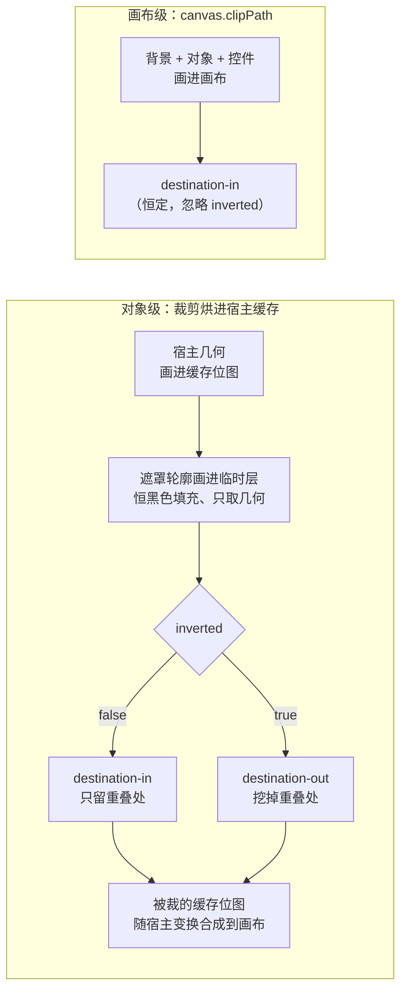

import { Canvas, Controls, Meta } from '@storybook/addon-docs/blocks';
import * as ClipPath from './clip-path.stories';

<Meta of={ClipPath} name="Docs" />

# 裁剪与遮罩

clipPath 是挂在属性上的"遮罩对象"：Rect、Circle、Path、FabricText、Group 等任何 FabricObject 都能充当，渲染时 fabric 只取它的几何轮廓——宿主对象仅保留与轮廓重叠的部分（`inverted` 时反转）。遮罩不是画布上的独立对象（不出现在对象列表、不可选中），而是像 fill 一样的属性值；对象级的裁剪发生在**宿主自己的缓存位图**上，画布级则直接合成整层。预测结果要抓住三件事：遮罩坐标系（默认锚定宿主几何中心、贴花式跟随宿主；`absolutePositioned` 改为画布场景坐标的固定窗口）、合成方向（`inverted` 决定裁内还是裁外）、缓存（裁剪烘进宿主位图，换新实例赋值才自动失效）。图片的矩形源裁剪（`cropX` / `cropY`）见[图片](?path=/docs/image--docs)；分组上的 clipPath 与 `clip-path` 布局策略见[分组与多选](?path=/docs/group-selection--docs)。



| 属性（默认值） | 挂在哪 | 回查要点 |
| --- | --- | --- |
| clipPath（undefined） | 宿主对象与 Canvas 都有 | 任意 FabricObject 作遮罩；只取几何，fill / stroke 无关 |
| absolutePositioned（false） | 遮罩对象自身 | false：宿主局部坐标，原点为宿主几何中心；true：画布场景坐标固定窗，宿主缓存每帧重画 |
| inverted（false） | 遮罩对象自身 | true 裁外（destination-out）；画布级忽略此属性 |
| clipPath ∈ 宿主 cacheProperties | 宿主缓存刷新 | `set('clipPath', 新实例)` 自动置 dirty；就地改要手动 dirty |
| excludeFromExport（false） | 遮罩对象自身 | true 时该遮罩不进 toObject / toJSON |

## 快速上手

```ts
import { Canvas, Circle, Rect } from 'fabric';

const canvas = new Canvas(el, { width: 640, height: 360 });

const host = new Rect({
  left: 320, top: 180, // originX / originY 默认 center，left / top 即中心点
  width: 280, height: 200,
  fill: '#38bdf8',
  clipPath: new Circle({ radius: 80 }), // 圆形窗口：宿主只剩圆内部分
});
canvas.add(host); // renderOnAddRemove 默认 true，自动请求重绘

// 换新遮罩：clipPath 在宿主 cacheProperties 里，set 自动置 dirty
host.set('clipPath', new Rect({ width: 120, height: 180 }));
canvas.requestRenderAll();
```

遮罩 `Circle` 没写 left / top：(0, 0) 不是画布左上角，而是**宿主几何中心**——这是理解本课坐标语义的关键。

## 对象级 clipPath

**遮罩只取几何。** 渲染时 fabric 先把宿主画进它自己的缓存位图，再把遮罩轮廓单独画到一层临时画布——填充恒为黑色、无描边、无阴影、透明度 1（`drawObject` 的 forClipping 分支与 `_setClippingProperties`，v7.4 源码），然后用 `globalCompositeOperation` 把两层合成：默认 `destination-in` 只保留重叠处，`inverted: true` 换成 `destination-out` 挖掉重叠处。所以遮罩上的 fill / stroke / shadow / opacity 一概不影响结果，能当遮罩的就是"形状"本身：Rect、Circle、Triangle、Ellipse、Polygon、Path、FabricText、FabricImage、Group 都行；带 `fillRule: 'evenodd'` 的 Path 还能做带洞窗口。

**裁剪烘进缓存、贴花式跟随。** 合成结果直接改写宿主缓存位图，宿主旋转 / 缩放时整张位图（连同窗口）一起变换——与渐变、图案的"贴花"锚定是同一逻辑（见[渐变与图案](?path=/docs/gradients-patterns--docs)）。遮罩自己的 left / top / angle / scale / originX / originY 正常生效；**宿主**的 originX / originY 不影响窗口位置——锚的是几何中心，不是 origin 点。

**两个进阶形态。** 遮罩自己还能再挂 clipPath（嵌套，可让多个窗口相交）；Group 作遮罩时成员轮廓按"或"合并（SVG 语义，不支持交集填充规则），要裁外必须把 `inverted` 设在 Group 遮罩**整体**上，成员各自的 inverted 无效。另外，带遮罩的对象**强制使用自有缓存**（`needsItsOwnCache` 对 clipPath 恒真，即使 `objectCaching: false` 或身在 Group 中）——缓存全景见[渲染模型](?path=/docs/rendering-model--docs)。

### absolutePositioned

默认 `false`：遮罩坐标 = 宿主局部空间，原点在宿主几何中心。窗口跟着宿主走——拖动、旋转、缩放宿主，窗口贴着内容一起动。

`true`：fabric 在画遮罩前先把宿主自身变换矩阵求逆（`createClipPathLayer` 里的 `invertTransform(calcTransformMatrix())`），遮罩坐标因此落在宿主的父空间——顶层对象就是画布场景坐标，与对象 left / top 同一坐标系（身在 Group 中时则是 Group 外层的空间）。宿主自由移动，窗口钉在画布上，内容在窗口下滑动。矩阵背景见[变换](?path=/docs/transform--docs)。

代价：`isCacheDirty` 对 absolutePositioned 恒返回真，宿主缓存**每次渲染都重画**——官方 old docs 也提示对象级遮罩动画每帧失效缓存，长时间、大面积场景会明显变慢。

### inverted

同一个形状、一个布尔值，合成方向在 `destination-in`（裁内：只留重叠处）与 `destination-out`（裁外：挖掉重叠处）之间切换——"圆形窗口"与"圆形挖洞（相框）"是同一遮罩的两种取值。只在对象级生效，画布级忽略（见下节）。

<Canvas of={ClipPath.ClipShapeLab} />
<Controls of={ClipPath.ClipShapeLab} />

| 读者操作 | 可核对结果 |
| --- | --- |
| 「遮罩形状」切 rect / triangle | 可见窗口轮廓换成矩形 / 三角形——遮罩只取几何，与颜色无关 |
| 开「绝对定位 absolutePositioned」 | 窗口改按画布场景坐标解释；读数「遮罩中心」从"宿主局部"换成"画布场景" |
| 拖动宿主矩形（画布上直接拖） | 默认模式窗口跟着宿主走（贴花）；绝对定位下窗口钉在画布上，条纹内容在窗口下滑动 |
| 拖「遮罩横向偏移」 | 窗口左右移动；读数按当前定位模式给出局部坐标（如 (40, 0)）或场景坐标（如 (283, 180)） |
| 开「反转裁剪 inverted」 | 可见区域内外反转，读数同步为 destination-out |
| 拖「遮罩角度」 | 窗口轮廓绕自身中心旋转（rect / triangle 最明显；circle 旋转不可见属正常） |
| 开「就地修改」后拖「遮罩横向偏移」 | 读数「遮罩中心」前进、画面停旧、「缓存位图重画」停住——宿主缓存未失效 |
| 再开「手动置 dirty」 | 「缓存位图重画」+1，画面追上实例状态 |
| 开「绝对定位」后拖动宿主并盯住「缓存位图重画」 | 计数持续增长——absolutePositioned 每帧重画缓存；默认模式下拖动计数不动 |
| 点击被裁掉的区域 | 宿主仍被选中、出现控件框——命中测试不看 clipPath |
| 打开 Show code | 看到该 Canvas 实际执行的 `example.ts` |

## 画布级 clipPath

Canvas 自己也有 `clipPath` 属性（StaticCanvas，v7.4 支持，.d.ts 与 `renderCanvas` 源码核对）。挂上后整块画布内容被同一窗口限制，但语义与对象级不同：

| | 对象级 obj.clipPath | 画布级 canvas.clipPath |
| --- | --- | --- |
| 坐标原点 | 宿主几何中心（absolutePositioned 时为画布场景） | 画布左上角（场景坐标），无开关 |
| 裁掉什么 | 仅宿主的缓存位图 | 背景色 / 背景图 + 全部对象 + 控件；overlay 层不裁 |
| inverted | 支持（destination-out） | 不支持——`drawClipPathOnCanvas` 恒 destination-in（v7.4 源码） |
| 视口 | 默认随宿主；absolutePositioned 随场景 | 恒随 viewportTransform：缩放 / 平移时窗口跟着内容走 |
| 刷新 | 烘进宿主缓存（见下节） | 每次渲染直接合成，动画高效 |

- 控件也会被裁：选中框、手柄在窗口外同样消失；`controlsAboveOverlay: true` 把控件画到遮罩之上（代价是控件盖住 overlay 层）。
- 画布级做"裁外"没有开关：用带洞形状（`Path` + `fillRule: 'evenodd'`）或退回对象级 inverted。
- 视口变换的完整机制见[视口与坐标](?path=/docs/viewport--docs)。

<Canvas of={ClipPath.CanvasClipLab} />
<Controls of={ClipPath.CanvasClipLab} />

| 读者操作 | 可核对结果 |
| --- | --- |
| 「遮罩形状」切 rect | 画布级窗口换轮廓；背景色、矩形、圆、文字同时被裁 |
| 拖「遮罩横向 / 纵向偏移」 | 窗口在场景坐标里移动（读数「遮罩中心」同步，原点是画布左上角） |
| 开「反转裁剪 inverted（画布级无效）」 | 画面无任何变化——画布级恒 destination-in，读数标注"忽略" |
| 拖「视口缩放」 | 内容与窗口一起缩放——canvas.clipPath 跟随 viewportTransform，不钉在屏幕上 |
| 选中对象拖到窗口外 | 对象连同选中框一起消失在窗口外——控件也被裁；`controlsAboveOverlay: true` 才能把控件画到遮罩上 |
| 打开 Show code | 看到该 Canvas 实际执行的 `example.ts` |

## 缓存与刷新

clipPath 在宿主的 `cacheProperties` 列表里（defaultValues 源码），这决定了三条刷新规则。

**换新实例自动失效。** `host.set('clipPath', new Circle(...))` 引用变化 → 自动置 dirty，下一帧重画缓存。

**就地修改不动。** `host.clipPath.set('angle', 30)` 只改遮罩实例，宿主的 set 缺席、缓存不重画；`requestRenderAll()` 只是把旧位图再合成一次。修法二选一：

```ts
host.clipPath.set('angle', 30);

// 方式一（推荐）：换新实例赋值，自动置 dirty
host.set('clipPath', buildMask(nextOptions));

// 方式二：手动标记缓存失效
host.set('dirty', true);
canvas.requestRenderAll();
```

**absolutePositioned 恒视为脏。** 每次渲染重画宿主缓存（上一节性能提示的来源）。

命中与裁剪是两回事：包围盒、控件、默认命中都用原始几何——点击被裁掉的部分仍会选中宿主；`perPixelTargetFind: true` 改按缓存像素命中，会尊重窗口（命中机制见[拖拽与选择](?path=/docs/drag-select--docs)）。实验台完整复现这条坑路径：开「就地修改」→ 拖「遮罩横向偏移」（读数前进、画面停旧、「缓存位图重画」不动）→ 开「手动置 dirty」（计数 +1、画面追上）。

## 序列化与导出

- 对象 `toObject()` / `toJSON()` 自动携带 clipPath，并在遮罩的序列化结果里额外附上 `inverted` 与 `absolutePositioned`（toObject 源码 `propertiesToSerialize.concat('inverted', 'absolutePositioned')`）——两个关键开关随数据往返。
- `excludeFromExport` 设在**遮罩对象**上：true 时该遮罩不进序列化。对象级与画布级同一条规则；对比：它对 fill / stroke 上的颜料不生效（差异见[渐变与图案](?path=/docs/gradients-patterns--docs)）。
- 复活是异步的：`loadFromJSON` / `FabricObject.fromObject` 走 `enlivenObjectEnlivables`，按 type 从 classRegistry 重建遮罩实例（Promise）。序列化全景见[序列化](?path=/docs/serialization--docs)。
- `canvas.toObject()` 同样输出顶层 clipPath，`loadFromJSON` 一并恢复。
- 导出：`toSVG` 为对象级 / 画布级遮罩输出 `<clipPath id="CLIPPATH_…">` 定义并给元素挂 `clip-path="url(#…)"`（见[SVG 互操作](?path=/docs/svg--docs)）；`toDataURL` 走 renderCanvas，裁剪效果包含在导出位图里。

## 最佳实践

- 静态窗口（圆形头像、图形遮罩）用对象级默认模式——烘进缓存后拖动、缩放零额外开销；要"内容在固定窗口滑动"才用 absolutePositioned，并接受每帧重画；限制整块画布用 canvas.clipPath，比给每个对象挂遮罩省。
- 动态更新遮罩固定走"换新实例赋值"，或统一 `host.set('dirty', true)`；就地改 + 忘记失效是"改了不动"的头号原因。
- 裁外只在对象级用 inverted；画布级要么用带洞形状（Path + evenodd），要么把遮罩挂回对象。
- 多窗口相交用嵌套 clipPath，或 `util.mergeClipPaths(c1, c2)` 合并成视觉等价的 Group 遮罩（不克隆参数、会改动传入实例，见官方 API）。

## 常见问题

- 改了 host.clipPath 的 left / angle / radius，画面不动
  就地修改没有失效宿主缓存：裁剪烘在宿主位图里。`host.set('dirty', true)` 后 `requestRenderAll()`，或换新实例赋值。
- 遮罩上设置的 fill / 渐变 / 描边看不到
  遮罩只取几何：渲染时恒黑色填充、无描边无阴影。想要可见的窗口边框，另加一个同形状的普通对象描边。
- 开 absolutePositioned 后拖动宿主，画面越来越卡
  isCacheDirty 对 absolutePositioned 恒真，宿主缓存每帧重画。窗口必须固定就接受这个代价（可缩小宿主降低重绘面积），否则用默认模式让窗口跟随宿主。
- 点击被裁掉的区域，宿主还是被选中了
  命中测试用原始几何的包围盒，不看 clipPath。要精确命中开 `perPixelTargetFind: true`（按缓存像素，尊重窗口）。
- canvas.clipPath 上设 inverted: true 没有任何效果
  画布级渲染恒 destination-in（drawClipPathOnCanvas 源码），inverted 只在对象级生效。裁外用带洞形状或对象级遮罩。
- 照 v5 及更早资料写 `clipTo: function (ctx) { ... }`
  clipTo 是 v5 及更早版本里的回调式裁剪（clipPath 自 2.4.0 起取代它），当前 v6 / v7 已彻底移除（7.4.0 的类型与源码均无此属性），任意形状裁剪一律改用 clipPath。

## 总结回顾

摘要：

clipPath 是挂在宿主属性上的遮罩对象，只取几何：默认 destination-in 只留重叠处，inverted 换 destination-out 裁外；遮罩还能嵌套，Group 作遮罩按"或"合并轮廓。对象级遮罩锚定宿主几何中心、随宿主贴花式变换；absolutePositioned 把坐标换到画布场景空间，窗口固定、内容滑动，代价是宿主缓存每帧重画。画布级 canvas.clipPath 锚定画布左上、跟随 viewportTransform，裁掉背景、对象与控件，不支持 inverted。裁剪烘进宿主缓存：换新实例赋值自动置 dirty，就地修改必须手动失效。序列化自动携带遮罩及 inverted / absolutePositioned，excludeFromExport 挂在遮罩上，复活异步。

一句话：

> clipPath 是只取几何的属性遮罩：坐标系（宿主中心或画布场景）、合成方向（inverted）与缓存（换新实例才自动失效）决定它的全部行为。

知识要点：

- 遮罩的 fill / stroke / shadow 为什么不影响裁剪结果？
- 遮罩默认锚定在哪里？宿主的 originX / originY 影响窗口位置吗？
- absolutePositioned 两种取值的坐标系差别与性能代价是什么？
- inverted 在对象级与画布级的差别是什么？
- 画布级 clipPath 裁掉哪些层？跟随什么变换？
- 就地修改遮罩后画面为什么不动？两种修法是什么？
- 序列化时 clipPath 额外带哪两个字段？excludeFromExport 设在哪个对象上？
- v5 时代的 clipTo 去哪了？

## 参考资料

- [官方 API：FabricObject（clipPath / inverted / absolutePositioned）](https://fabricjs.com/api/classes/fabricobject/)
- [官方 API：StaticCanvas（clipPath）](https://fabricjs.com/api/classes/staticcanvas/)
- [旧版文档：ClipPath introduction](https://fabricjs.com/docs/old-docs/clippath-part1/)
- [旧版文档：ClipPath more advanced use cases](https://fabricjs.com/docs/old-docs/clippath-part2/)
- [旧版文档：ClipPath - clipping the canvas](https://fabricjs.com/docs/old-docs/clippath-part3/)
- [旧版文档：Clipping the objects with absolute clipPaths](https://fabricjs.com/docs/old-docs/clippath-part4/)
