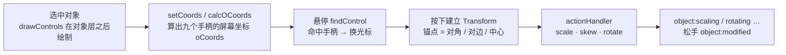

import { Canvas, Controls, Meta } from '@storybook/addon-docs/blocks';
import * as Controls_ from './controls.stories';

<Meta of={Controls_} name="Docs" />

# 变换控件

对象被选中后，包围盒四角与四边中点浮出的方块、顶边上方那根带连接线的旋转手柄，就是 Fabric 的变换控件（controls）——一个 `Record<string, Control>` 集合，每个成员描述一个手柄的位置、动作与画法。拖动手柄时 fabric 建立一次 Transform 并运行该手柄的 `actionHandler`：角落手柄缩放、中点手柄单轴缩放（按住 Shift 变倾斜）、`mtr` 旋转。v6 起每个对象在构造时拿到**自己的一份**默认控件集（`static createControls()`），不再是 v5 挂在 `fabric.Object.prototype.controls` 上的全局共享集。本课讲清内置控件的动作语义、外观与可见性配置、修饰键行为和渲染时机；增删手柄、换渲染函数、写自定义动作在[自定义控件](?path=/docs/custom-controls--docs)。



| 属性（对象级） | 默认值 | 回查要点 |
| --- | --- | --- |
| `cornerSize` | `13` | 手柄边长（px），不随对象缩放变化；同时决定鼠标命中区 |
| `touchCornerSize` | `24` | 触摸命中区边长；只影响命中，不影响绘制 |
| `cornerStyle` | `'rect'` | `'rect'` / `'circle'`；官方已标 deprecated |
| `cornerColor` | `'rgb(178,204,255)'` | 透明手柄时是描边色，实心手柄时是填充色 |
| `cornerStrokeColor` | `''` | 仅实心手柄（`transparentCorners: false`）时作描边色 |
| `cornerDashArray` | `null` | 手柄描边虚线 |
| `transparentCorners` | `true` | `true` 镂空（描边），`false` 实心（填充） |
| `padding` | `0` | 边框 / 手柄 / 命中区整体外扩的距离 |
| `borderColor` | `'rgb(178,204,255)'` | 选中边框颜色 |
| `borderDashArray` | `null` | 边框虚线 |
| `borderScaleFactor` | `1` | 边框与 mtr 连接线的线宽倍数 |
| `borderOpacityWhenMoving` | `0.4` | 拖动期间边框与手柄的整体透明度 |
| `hasControls` / `hasBorders` | `true` / `true` | 整组隐藏手柄 / 边框；隐藏后仍可拖动 |
| `centeredRotation`（对象级） | `true` | 旋转默认绕中心；画布级同名默认 `false`，两者取或 |
| `centeredScaling` | `false`（两级同名） | 缩放默认锚定对角；对象级与画布级取或 |
| `snapAngle` / `snapThreshold` | 不设 | mtr 旋转吸附步进与判定阈值（`snapThreshold` 缺省同 `snapAngle`） |
| `selectionBackgroundColor` | `''` | 选中时对象背后的填充层 |

| 选项（画布级） | 默认值 | 回查要点 |
| --- | --- | --- |
| `uniformScaling` | `true` | 角落手柄默认等比缩放 |
| `uniScaleKey` | `'shiftKey'` | 按住翻转等比；值是事件属性名，设 `null` 关闭 |
| `centeredKey` | `'altKey'` | 按住临时居中 / 取消居中 |
| `altActionKey` | `'shiftKey'` | 中点手柄在缩放与倾斜之间切换 |

## 快速上手

```ts
import { Canvas, Rect } from 'fabric';

const canvas = new Canvas(el, { width: 640, height: 360 });
const rect = new Rect({ left: 40, top: 40, width: 200, height: 140 });
rect.set({
  cornerStyle: 'circle',      // 圆形手柄
  cornerSize: 16,
  cornerColor: '#ef4444',
  transparentCorners: false,  // 实心：cornerColor 填充 + cornerStrokeColor 描边
});
rect.setControlVisible('mtr', false);                                // 隐藏旋转手柄
rect.setControlsVisibility({ ml: false, mr: false, mt: false, mb: false }); // 只留四角
canvas.add(rect);
```

选中 `rect` 即可验证：四角红色圆点、无旋转手柄、无中点手柄。改 `cornerSize` 这类参与命中区计算的属性后，已入画布的对象要补一次 `rect.setCoords()`。

## 控件集与动作语义

v6+ 的控件集在构造函数里生成：`InteractiveFabricObject` 的构造器执行 `Object.assign(this, this.constructor.createControls(), ownDefaults)`，`createControls()` 默认返回 `createObjectDefaultControls()` 的新实例。所以**改一个对象的 `controls` 不会影响其他对象**——这与 v5 相反：v5 的默认控件集挂在 `fabric.Object.prototype.controls` 上全局共享（Textbox 另有一份 `prototype.controls`，其中 7 个成员还是对 Object 集的引用），改一处全体生效。官方 v6 升级说明明确：不再有实例间共享、可变会互相误伤的默认对象（controls 是典型例子）。

默认九个手柄的动作（`x` / `y` 是相对包围盒中心的归一化坐标，±0.5 为边界）：

| 键 | 位置 | 默认动作（actionHandler） | 按住 `altActionKey`（默认 Shift） |
| --- | --- | --- | --- |
| `tl` / `tr` / `bl` / `br` | 四角 | 等比缩放（`scalingEqually`，等比与否受 `uniformScaling` / `uniScaleKey` 控制） | —（角落的修饰键是 `uniScaleKey`） |
| `ml` / `mr` | 左右中点 | 单轴缩放 `scaleX` | 切换为倾斜 `skewY` |
| `mt` / `mb` | 上下中点 | 单轴缩放 `scaleY` | 切换为倾斜 `skewX` |
| `mtr` | 顶边中点上方 40px | 旋转 `rotate`（`rotationWithSnapping`，受 `snapAngle` 吸附） | —（支点受 `centeredKey` 影响） |

几个直接推论：

- **动作名会进事件**：变换中与结束时的 `transform.action` / `object:modified` 的 `action` 取 `scale` / `scaleX` / `scaleY` / `skewX` / `skewY` / `rotate`（中点手柄按是否按住修饰键在 scale 与 skew 之间切换），拖动本体是 `drag`——事件族见[事件系统](?path=/docs/events--docs)。
- **`mtr` 是 middle-top-rotate 的缩写**。它的 `offsetY: -40` 是屏幕像素偏移，不随对象缩放变化；`withConnection: true` 让 fabric 从顶边画一根连接线到手柄（线宽随 `borderScaleFactor`）。v4 时代的 `hasRotatingPoint` / `rotatingPointOffset`（默认 `true` / `40`）在 v5 引入控件 API 时已被取代——显示与否成了 mtr 控件自身的可见性，偏移量就是 `offsetY`；7.4.0 中这两个属性不存在。
- **Textbox 覆写了控件集**：`Textbox.createControls()` 返回 `createTextboxDefaultControls()`——`ml` / `mr` 被替换为 `changeWidth` 动作（`actionName: 'resizing'`），拖的是 `width` 而不是缩放，见[交互文本](?path=/docs/itext-textbox--docs)。官方扩展里的图片裁剪控件（`createImageCroppingControls`）是同一套做法的另一个例子，见[图片](?path=/docs/image--docs)。这证明控件集可以整类替换，做法在[自定义控件](?path=/docs/custom-controls--docs)。

## 外观配置

### 角落手柄

手柄的绘制入口是 `Control.render`（默认 `renderSquareControl` / `renderCircleControl`），读取对象的一组属性：

- **`cornerStyle`**：`'rect'`（默认）或 `'circle'`。已标 deprecated——官方计划将来用可替换的标准控件渲染接管，目前两个值仍可用。
- **`transparentCorners` 决定填充语义**：`true`（默认）时手柄镂空，`cornerColor` 作为**描边**色；`false` 时手柄实心，`cornerColor` 作为**填充**色、`cornerStrokeColor` 作为描边色（默认空串即不描边）。想让手柄是"实心白块加深色描边"，就要 `transparentCorners: false` + 两个颜色都设。
- **`cornerSize`** 是绘制边长，也是鼠标命中区边长；触摸命中用 `touchCornerSize`（默认 24，只放大命中、不放大绘制）。`Control.sizeX` / `sizeY` 可逐手柄覆盖绘制尺寸，`touchSizeX` / `touchSizeY` 覆盖触摸命中——属自定义范畴，见 4.4。
- **`cornerDashArray`**：手柄描边的虚线模式（如 `[4, 4]`），不影响边框。

### 边框与内边距

- `borderColor` / `borderDashArray`：选中边框的颜色与虚线；`borderScaleFactor` 是线宽倍数，**同时作用于 mtr 连接线**。
- `borderOpacityWhenMoving`：拖动期间（`isMoving`）边框与手柄整体降到该透明度，松手恢复——让移动中的对象视觉上"退后"。
- `padding`：边框、手柄与命中区整体向外平移 `padding` 像素（尺寸计算为 `2 × padding`），对象本体不变；它同时也扩大目标命中的包围四边形（见[事件系统](?path=/docs/events--docs)的目标发现）。
- `selectionBackgroundColor`：选中时在对象背后、边框之内画一层填充。

### 改默认值

逐对象传选项太啰嗦时，改类默认值——注意两点：corner / border 家族的默认值声明在 `InteractiveFabricObject.ownDefaults`（`FabricObject` / `Rect` 等子类没有自己的同名静态，写 `FabricObject.ownDefaults.cornerSize` 经静态继承解析到同一对象）；且默认值只在构造时应用一次，**只影响之后新建的实例**：

```ts
import { InteractiveFabricObject } from 'fabric';

// 一次性主题化所有新对象的手柄样式
InteractiveFabricObject.ownDefaults.cornerSize = 16;
InteractiveFabricObject.ownDefaults.cornerColor = '#ef4444';
InteractiveFabricObject.ownDefaults.cornerStyle = 'circle';
```

要改默认控件集本身（增删、共享一份控件），覆写 `createControls` 静态：想全局共享时让它返回空对象、把控件集放进 `ownDefaults`（官方文档的做法）。这与 v5 直接改 `fabric.Object.prototype.controls` 的迁移对照：

| v5 写法 | 7.4.0 现状 |
| --- | --- |
| `fabric.Object.prototype.controls.mtr.offsetY = -30` | 全局共享集已移除——每实例一份；改默认走 `createControls` 覆写或 `ownDefaults`，改单对象直接 `obj.controls.mtr.offsetY = -30` |
| `new fabric.Object({ rotatingPointOffset: 40 })` | 属性已不存在（v5 起删）——旋转手柄偏移就是 `mtr` 控件的 `offsetY` |
| `obj.setControlVisible(...)` / `obj.isControlVisible(...)` | 仍在，签名不变 |

<Canvas of={Controls_.Interactive} />
<Controls of={Controls_.Interactive} />

实验台把上述断言变成可核对的观察：矩形应用面板配置，圆保持 fabric 默认作对照；readout 同步当前手柄、最近动作与矩形变换值。

| 读者操作 | 可核对结果 |
| --- | --- |
| 点选矩形（先选中才出手柄） | 边框 + 九个手柄出现；悬停手柄时 readout「当前手柄」在 tl/tr/br/bl/ml/mt/mr/mb/mtr 间切换，光标随象限换 resize 样式 |
| 切换「手柄形状」 | 方块 ↔ 圆点（`cornerStyle`） |
| 调「手柄尺寸」 | 手柄与命中区同步变大；连接线长度与手柄中心位置不变（mtr 的 `offsetY` 固定 40px） |
| 关「透明手柄」并设「手柄描边色」 | 手柄从镂空描边（`cornerColor`）变实心：`cornerColor` 填充 + `cornerStrokeColor` 描边 |
| 调「控件内边距」 | 边框与手柄整体外扩，对象本体大小不变（`padding`） |
| 调「边框粗细」 | 边框与 mtr 连接线一起变粗（`borderScaleFactor`） |
| 拖角（如 br） | 「最近动作」scale，「矩形变换值」scaleX 与 scaleY 同步变化（默认等比） |
| 按住 Shift 拖角 | scaleX ≠ scaleY（`uniScaleKey` 翻转等比）；动作仍是 scale |
| 按住 Alt 拖角 | 对象两翼同时伸缩（`centeredKey` 临时居中） |
| 开「居中缩放」后直接拖角 | 不按 Alt 也两翼同缩（对象级 `centeredScaling`） |
| 拖中点手柄（ml / mr） | 只 scaleX 变（mt / mb 只 scaleY）；按住 Shift 变 skewY / skewX（`altActionKey`），「最近动作」显示 skewX / skewY |
| 拖 mtr | 「当前手柄」mtr、「最近动作」rotate、角度读数变化；设「旋转吸附角」45 后按 45° 步进吸附（`snapAngle`） |
| 关「显示手柄」 | 手柄消失但对象仍可拖动；readout「可见手柄」清单不变——`isControlVisible` 与 `hasControls` 是两层独立开关 |
| 关「显示边框」 | 边框与 mtr 连接线消失，手柄仍在（`hasBorders`） |
| 拖动对象本体 | 移动期间边框与手柄变淡（`borderOpacityWhenMoving` 0.4），松手恢复；「最近动作」drag |
| 点选圆 | 圆呈现 fabric 默认样式（13px 方块、镂空、rgb(178,204,255)），交互语义与矩形一致 |
| 打开 Show code | 看到该 Canvas 实际执行的 example.ts |

## 可见性

两层开关，作用范围从大到小：

- **`hasControls: false`**：整组隐藏全部手柄——不绘制、不命中、不建变换；对象**仍可被选中与拖动**（拖动属 `drag`，不是控件动作）。想连拖动一起锁住用 `lockMovementX` / `lockMovementY` 等锁定系列（语义见[拖拽与选择](?path=/docs/drag-select--docs)）。IText 进入编辑态时 fabric 会临时收走控件与拖动，退出后恢复。
- **`hasBorders: false`**：只隐藏边框与 mtr 连接线，手柄照常。
- **逐手柄**：`setControlVisible(key, visible)` 写入 `_controlsVisibility[key]`；`isControlVisible(key)` 读取；`setControlsVisibility({ mtr: false })` 批量。优先级是 `_controlsVisibility[key] ?? control.visible`——即对象级覆盖一旦设置就压过 Control 自己的 `visible` 字段，且它**不看** `hasControls`（整组开关独立生效，实验台关掉「显示手柄」时「可见手柄」清单不变即是证据）。

一个常被忽略的事实：**这些配置默认不进序列化**。`toObject` 导出的是固定属性清单，corner / border 家族、`hasControls` 与 `_controlsVisibility` 都不在其中——`loadFromJSON` 往返后手柄回到类默认样式。要么全局默认统一主题（上文 `ownDefaults`），要么序列化时用 `propertiesToInclude` 显式带上（见[序列化](?path=/docs/serialization--docs)）。

## 交互行为：锚点、修饰键与吸附

拖手柄时 Transform 的锚点（originX / originY）决定"绕哪一点变"：

- **默认锚点**：角落缩放锚定**对角**、中点缩放锚定**对边中点**（fabric 把锚点取到反向：`ml/tl/bl` 取右边、`mr/tr/br` 取左边，上下同理）；旋转不同——对象级 `centeredRotation` 默认 `true`，`mtr` 默认绕**中心**旋转。`centeredScaling` / `centeredRotation` 在对象级与画布级同名、效果取或（`this.centeredScaling || target.centeredScaling`）。
- **`centeredKey`（默认 `'altKey'`）**：按住 Alt 临时翻转居中状态——默认居中的旋转变为绕锚点、默认不居中的缩放变为绕中心。松开即还原。
- **`uniScaleKey`（默认 `'shiftKey'`）**：配合 `uniformScaling: true`（默认），角落手柄默认等比，按住 Shift 变自由两轴缩放；把 `uniformScaling` 设 `false` 则语义整体反转。
- **`altActionKey`（默认 `'shiftKey'`）**：中点手柄在单轴缩放与倾斜之间切换（ml/mr ↔ skewY，mt/mb ↔ skewX），光标也随切换变。
- 三个键的值都是**事件属性名**（`'altKey'` / `'shiftKey'` / `'ctrlKey'` / `'metaKey'`），设为 `null` 或非修饰键名即关闭该功能（v5.3 起就是这套取值，7.4.0 一致）。
- **锁定反馈**：`lockRotation` / `lockScalingX` 等命中手柄时光标变 `not-allowed`，动作被拒绝；`lockScalingFlip` 阻止拖过零翻转向。锁定系列与拖拽约束见[拖拽与选择](?path=/docs/drag-select--docs)。
- **`snapAngle` / `snapThreshold`**（对象级，默认不设）：mtr 旋转按 `snapAngle` 步进吸附，`snapThreshold` 是吸附判定阈值、缺省同 `snapAngle`。

锚点背后的 originX / originY 属性模型在[变换](?path=/docs/transform--docs)；变换过程的事件序列在[事件系统](?path=/docs/events--docs)。

## 渲染与缓存

控件与边框**不进对象的位图缓存**。渲染周期里 `drawControls` 在全部对象画完之后单独执行（`_renderControls` 只作用于活动对象），因此改 `cornerSize` / `cornerColor` 等样式不会弄脏对象缓存，也解释了为什么导出（`toDataURL` / `toSVG`）里没有控件——它们是编辑器 UI，不是场景内容。两个相关画布级选项：`controlsAboveOverlay`（默认 `false`，控件画在 overlay 之前还是之后）、`skipControlsDrawing`（默认 `false`，跳过控件绘制）。

与缓存的真实交集是 **`noScaleCache`（默认 `true`）**：拖角缩放期间对象不重建缓存位图，直接拉伸旧位图，松手后才重算——所以缩放过程中描边宽度、阴影等不会实时保持精确，结束瞬间"变清晰"是预期行为（渲染模型见[渲染模型](?path=/docs/rendering-model--docs)，缓存策略见[性能优化](?path=/docs/performance--docs)）。至于 `needsItsOwnCache()`，它判断的是对象自身绘制是否必须建独立缓存（stroke-first 加阴影、clipPath），与控件无关。

## 最佳实践

- **主题一次配齐**：手柄 / 边框样式全局统一时改 `InteractiveFabricObject.ownDefaults`，别在每个对象上重复传；个别对象再逐个覆盖。注意只影响新建实例。
- **移动端放大命中而不是手柄**：调 `touchCornerSize`（只扩大触摸命中区），不要为好点按把 `cornerSize` 撑到遮挡对象。
- **演示态与编辑态切换**：只读展示用 `hasControls: false` + `hasBorders: false`（或 `skipControlsDrawing`）整组收起；部分隐藏（如只留旋转）用 `setControlsVisibility`。
- **样式不随 toObject 走**：控件配置默认不序列化，跨会话保持样式靠全局默认或 `propertiesToInclude`，别指望 loadFromJSON 记住手柄颜色。

## 常见问题

- 拖角缩放过程中描边变糊、松手瞬间才清晰
  预期行为：`noScaleCache: true` 让缩放期间复用旧缓存位图拉伸，变换结束才重建。要过程精确可设 `noScaleCache: false`，代价是缩放期间持续重绘缓存。
- 改了 `ownDefaults`，画布里已有对象的手柄样式没变
  预期行为：默认值只在构造时应用一次（`Object.assign`），改动只影响之后 `new` 出的实例。已有对象逐个 `set`，或重建场景。
- `transparentCorners: true` 时怎么设 `cornerStrokeColor` 都看不到
  镂空模式下描边色就是 `cornerColor`；`cornerStrokeColor` 只在 `transparentCorners: false`（实心手柄）时使用。
- `hasControls: false` 后对象还能被拖走
  正常——`hasControls` 只收起控件，拖动是 `drag` 动作不经手柄。要禁移动用 `lockMovementX` / `lockMovementY`，整套锁定见[拖拽与选择](?path=/docs/drag-select--docs)。
- 从 v5 迁移：`fabric.Object.prototype.controls` 改不动了，`rotatingPointOffset` 报不存在
  v6 起控件集每实例一份，全局共享集移除；改默认用 `createControls` 覆写或 `ownDefaults`。`rotatingPointOffset` / `hasRotatingPoint` 是 v4 属性，v5 起就由 mtr 控件的 `offsetY` 取代。
- `loadFromJSON` 后手柄样式与可见性全丢了
  控件样式与 `_controlsVisibility` 不在 `toObject` 的默认导出清单里。用 `ownDefaults` 全局配置，或序列化时 `propertiesToInclude` 显式带上样式字段并在加载后重设可见性。

## 总结回顾

摘要：

变换控件是被选中对象自带的手柄集：v6+ 每个实例在构造时由 `createControls()` 生成一份，v5 的全局 `fabric.Object.prototype.controls` 已移除。默认九键——四角等比缩放、四中点单轴缩放（Shift 切倾斜）、mtr 旋转（`offsetY: -40` 定像素偏移，替代 v4 的 `rotatingPointOffset`）；Textbox 覆写为 `changeWidth` 宽度手柄。外观由对象级属性驱动：`cornerStyle`（已 deprecated）/ `cornerSize`（含命中区）/ `touchCornerSize`（仅触摸命中）/ `transparentCorners`（镂空描边 ↔ 实心填充决定 `cornerColor` / `cornerStrokeColor` 的语义）/ `cornerDashArray`，边框侧 `borderColor` / `borderDashArray` / `borderScaleFactor`（含 mtr 连接线）/ `borderOpacityWhenMoving` / `padding`；改全局默认落在 `InteractiveFabricObject.ownDefaults`。可见性两层：`hasControls` / `hasBorders` 整组（不影响拖动），`setControlVisible` / `isControlVisible` 逐手柄（`_controlsVisibility` 优先于 `control.visible`），且都不序列化。行为侧：默认缩放锚对角、旋转绕中心（对象级 `centeredRotation: true`），`centeredKey`（Alt）临时翻转，`uniScaleKey`（Shift）翻转等比，`altActionKey`（Shift）切倾斜，`snapAngle` 吸附；锁定时光标 not-allowed。控件画在对象层之后、缓存之外，导出不含控件；缩放期间 `noScaleCache` 复用位图拉伸。

一句话：

> 控件是被选中对象自己的一份手柄集——拖哪个手柄就跑哪个 actionHandler；样子看 corner / border 属性，显隐看 `hasControls` 加逐手柄两层开关，绕哪点变看锚点与三个修饰键。

知识要点：

- v6+ 的默认控件集在哪里生成？与 v5 的全局共享集差在哪？
- 默认九个手柄各叫什么、各做什么动作？按住 Shift 各发生什么？
- `transparentCorners` 的真假分别让 `cornerColor` / `cornerStrokeColor` 扮演什么角色？
- `cornerSize` 与 `touchCornerSize` 各影响绘制还是命中？
- `padding` 改变的是对象本体还是控件包围盒？还影响什么？
- 逐对象配置太多时，全局改默认的正确落点是哪个静态对象？影响哪些实例？
- `hasControls: false` 之后对象还能做什么、不能做什么？锁移动用什么？
- `setControlVisible` 与 `Control.visible` 谁优先？这套可见性会随 toObject 保存吗？
- 默认配置下拖角与拖 mtr 各绕哪个点变？按住 Alt 会怎样？
- `uniScaleKey` / `centeredKey` / `altActionKey` 的默认值是什么类型？各在哪个手柄上生效？
- 控件参与对象位图缓存吗？导出图里为什么没有控件？缩放中变糊是谁造成的？

## 参考资料

- [Configuring controls（官方控件配置指南）](https://fabricjs.com/docs/configuring-controls/)
- [Configuring defaults properties（ownDefaults 与全局默认）](https://fabricjs.com/docs/configuring-defaults/)
- [FabricObject API（corner / border 属性、isControlVisible / setControlVisible）](https://fabricjs.com/api/classes/fabricobject/)
- [Control API（offsetY、sizeX / sizeY、withConnection）](https://fabricjs.com/api/classes/control/)
- [Upgrading to Fabric.js 6.0（共享控件集移除）](https://fabricjs.com/docs/upgrading/upgrading-to-fabric-60/)
- [v5 fabric.Object 文档（v5 默认值对照）](https://fabric5.fabricjs.com/docs/fabric.Object.html)
- [v5.3.0 default_controls.js（v5 全局控件集源码）](https://cdn.jsdelivr.net/npm/fabric@5.3.0/src/mixins/default_controls.js)
