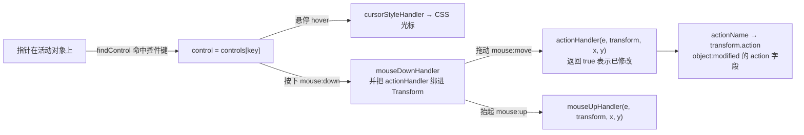

import { Canvas, Controls, Meta } from '@storybook/addon-docs/blocks';
import * as CustomControls from './custom-controls.stories';

<Meta of={CustomControls} name="Docs" />

# 自定义控件

每个对象都有一份**控件表** `controls`——普通的 JS 对象，键是控件名（默认 `ml` `mr` `mt` `mb` `tl` `tr` `bl` `br` `mtr`），值是 `Control` 实例。一个 `Control` 由四组**可替换的钩子**组成：位置（`positionHandler` + `x` / `y` / `offsetX` / `offsetY`）、光标（`cursorStyleHandler`）、渲染（`render`）、行为（`mouseDownHandler` / `actionHandler` / `mouseUpHandler`）。fabric 内置的缩放、旋转、倾斜处理器本身就是符合这些签名的普通函数，和默认控件集工厂一起放在 `controlsUtils` 命名空间里整族导出。所以自定义控件的主路径不是从零写，而是**克隆默认集 → 增删键 → 逐项换钩子**。v6 起 controls 是每对象实例，改一个对象的控件不再影响其他对象。



| Control 属性 | 默认值 | 回查要点 |
| --- | --- | --- |
| `x` / `y` | `0` | 位置：对象中心为原点的单位化坐标，`±0.5` 是包围盒边缘（度量含 stroke 与 padding，随 `scaleX` / `scaleY`） |
| `offsetX` / `offsetY` | `0` | 像素偏移：不随对象缩放，也不随画布缩放（`mtr` 靠 `offsetY: -40` 悬在盒外） |
| `sizeX` / `sizeY` | `0` | 绘制尺寸；`0` 回退对象的 `cornerSize`（默认 13） |
| `touchSizeX` / `touchSizeY` | `0` | 触摸命中尺寸；`0` 回退 `touchCornerSize`（默认 24） |
| `cursorStyle` | `'crosshair'` | 固定光标；提供了 `cursorStyleHandler` 时被忽略 |
| `actionName` | `'scale'` | 动作标识：进 `transform.action`，决定 `object:modified` 的 `action` 字段等 |
| `visible` | `true` | 控件自身可见性；对象级 `setControlVisible` 优先于它 |
| `withConnection` | `false` | 有偏移时画一条连到包围盒的线（纯视觉，`mtr` 用） |
| `angle` | `0` | 预留字段，当前不参与内部逻辑 |

## 快速上手

给矩形装一个角落外的删除按钮，点一下就删掉对象：

```ts
import { Canvas, Rect, Control } from 'fabric';

const canvas = new Canvas(el, { width: 640, height: 360 });
const rect = new Rect({ left: 80, top: 80, width: 176, height: 128 });
canvas.add(rect);

rect.controls = {
  ...rect.controls,          // 保留默认 9 控件（v6+ 每对象独立实例）
  delete: new Control({
    x: 0.5, y: -0.5,         // tr 角：对象中心为原点，±0.5 到包围盒边缘
    offsetX: 20, offsetY: -20, // 像素偏移到盒外，不与角落控件重叠
    cursorStyle: 'pointer',  // 悬停光标（未提供 cursorStyleHandler 时生效）
    actionName: 'delete',    // 动作标识：其他代码可据此识别正在做什么
    mouseUpHandler(eventData, transform) {   // 点击型动作放 mouseUp
      canvas.remove(transform.target);
      return true;
    },
    render(ctx, left, top, styleOverride, fabricObject) {
      // ctx 未平移未旋转：先平移到 (left, top)；要随对象旋转再 rotate
      ctx.save();
      ctx.translate(left, top);
      ctx.beginPath();
      ctx.arc(0, 0, 10, 0, Math.PI * 2);
      ctx.fillStyle = '#dc2626';
      ctx.fill();
      ctx.restore();
    },
  }),
};
rect.setCoords();            // 已在画布上：重算控件坐标，新键才可交互
canvas.setActiveObject(rect); // 控件只对活动对象响应（内部会再 setCoords）
canvas.requestRenderAll();
```

内置控件的样式配置（`cornerSize`、`cornerColor`、`cornerStyle`、`hasControls` 等）与默认 9 控件的用法见[变换控件](?path=/docs/controls--docs)；本课讲控件本身的构造与替换。

## controls 表与默认控件集

v6 起 `InteractiveFabricObject` 构造时执行静态 `createControls()`，为**每个实例**发放一份新控件（内部就是 `controlsUtils.createObjectDefaultControls()`）。v5 时代改 `fabric.Object.prototype.controls` 会波及所有对象——这条迁移路上的坑已随实例化消失；想全类统一，改为覆盖子类的 `static createControls()`（见[自定义对象](?path=/docs/custom-object--docs)）。

默认 9 个控件各自绑定的处理器（摘自 `commonControls.ts`，全部可从 `controlsUtils` 取到）：

| 键 | 位置 | actionHandler | 光标 / 动作名 |
| --- | --- | --- | --- |
| `tl` `tr` `bl` `br` | 四角（`x` `y` = ±0.5） | `scalingEqually` | `scaleCursorStyleHandler`，`actionName` 默认 `'scale'` |
| `ml` `mr` | 左右中点 | `scalingXOrSkewingY` | `scaleSkewCursorStyleHandler` + `getActionName: scaleOrSkewActionName` |
| `mt` `mb` | 上下中点 | `scalingYOrSkewingX` | 同上 |
| `mtr` | 上中点外（`offsetY: -40`，`withConnection: true`） | `rotationWithSnapping` | `rotationStyleHandler`，`actionName: 'rotate'` |

中点控件的组合是有讲究的：按住画布的 `altActionKey`（默认 `'shiftKey'`）时，`scalingXOrSkewingY` 从缩放切到倾斜，`scaleOrSkewActionName` 同步把动作名换成 `skewY` / `skewX`，光标也跟着换。

**克隆改造**是标准姿势——从工厂拿全新默认集，改完整表替换：

```ts
import { controlsUtils } from 'fabric';

const controls = controlsUtils.createObjectDefaultControls();
controls.mtr.offsetY = -28;   // 旋转手柄更贴近包围盒
delete controls.mt;           // 去掉上中点：直接删键
rect.controls = controls;
rect.setCoords();             // 重算 oCoords 后生效
```

特殊默认集：`createTextboxDefaultControls()` 在默认集之上叠加 `createResizeControls()`——把 `ml` / `mr` 换成 `actionHandler: changeWidth`、`actionName: 'resizing'` 的宽度调整控件，这是 Textbox 拖中点改宽度而不缩放的原因。

## 钩子与生命周期

控件交互横跨[事件系统](?path=/docs/events--docs)的 mouse 管线：先命中，再按 hover / down / move / up 四个阶段各调一组钩子：

- **命中**：`findControl` 倒序遍历 `oCoords`，用 `shouldActivate` 判定——要求**对象是当前活动对象**、`isControlVisible(key)` 为真、指针落在该控件的 corner（或触摸的 touchCorner）四边形内。所以先点选，控件才可交互。
- **hover**：`cursorStyleHandler(eventData, control, fabricObject, coord)` 返回 CSS 光标串，`canvas.setCursor` 应用到上层画布元素。默认实现直接返回 `cursorStyle` 属性；内置的 scale / skew / rotate 处理器会按控件方位与锁定状态计算（锁定时返回 `'not-allowed'`）。
- **down**：先调 `mouseDownHandler(eventData, transform, x, y)`，随后把 `getActionHandler()` 的返回值绑进当前 `Transform`。控件**没有** `actionHandler` 时拖动它不产生任何动作（不会回退成拖对象）；未选中对象或未命中控件时，canvas 绑定的是内部 `dragHandler`（拖动对象本身）。
- **move**：拖动期间每次 `mouse:move` 调 `actionHandler(eventData, transform, x, y)`，返回 `true` 表示发生了修改——canvas 随即 `target.setCoords()` 并按需重渲染；`wrapWithFireEvent` 包装过的处理器同时派发 `object:scaling` 等进行中事件（事件名在包装时固定，见「controlsUtils 工具族」）。
- **up**：抬起时仍命中控件则调 `mouseUpHandler`，**纯点击（未拖动）也照样调用**——点击型按钮控件就靠这个；若抬起时已换到别的控件或对象，canvas 还会对开始变换的那个控件补调一次 `mouseUpHandler`。

`actionName` 的两个去向：进 `transform.action`，出现在 `object:modified` 载荷的 `action` 字段里（`delete` / `clone` / `scale` / `rotate` / `modifyPoly`…），fabric 内部也用它做识别（例如缩放动作期间跳过缓存画布更新）。一个控件有多种动作时可以覆盖 `getActionName(eventData, control, fabricObject)` 动态返回。`getActionHandler` / `getMouseDownHandler` / `getMouseUpHandler` / `cursorStyleHandler` 也都有对应的方法形态，可在子类里按事件状态返回不同处理器。

## 位置与偏移

`positionHandler(dim, finalMatrix, fabricObject, currentControl)` 返回控件中心的**视口坐标** `Point`，默认实现是 `new Point(x * dim.x + offsetX, y * dim.y + offsetY).transform(finalMatrix)`。拆开看两个坐标系：

- **`x` / `y` 是单位化比例**：`0, 0` 是对象中心，`±0.5` 落在包围盒边缘。度量基于当前尺寸（宽高 × 缩放、含 stroke 与 `padding`），所以缩放对象时控件跟着走；超出 `±0.5` 也合法，只是放到盒外。
- **`offsetX` / `offsetY` 是屏幕像素**：不随对象缩放，也不随画布缩放（内部有 `1/zoom` 补偿）。旋转手柄与盒顶恒距 40px、两个按钮控件挤在同一角落互不挤开，靠的都是这一层。

绘制尺寸与命中面积分开：`sizeX` / `sizeY` 决定画多大（`0` 回退对象 `cornerSize`），`touchSizeX` / `touchSizeY` 决定触摸命中多大（`0` 回退 `touchCornerSize`）——鼠标命中的 corner 面积与触摸命中的 touchCorner 面积由 `calcCornerCoords` 分别按这两组尺寸计算。`withConnection: true` 时再画一条从包围盒到偏移控件的连线，纯视觉。

顶点控件就是靠自定义 `positionHandler` 把控件钉在任意位置（见下方「顶点控件」一节），不局限于包围盒框架。

## 自定义渲染

`render(ctx, left, top, styleOverride, fabricObject)` 负责画控件本体，两条约定：

- **ctx 已按 retina 缩放，但未平移、未旋转**——必须先 `ctx.translate(left, top)` 才画在控件位置上（`left` / `top` 就是 `positionHandler` 的结果）；要随对象旋转再 `ctx.rotate(util.degreesToRadians(fabricObject.getTotalAngle()))`。
- 尺寸遵循回退链：`styleOverride?.cornerSize ?? fabricObject.cornerSize`。`styleOverride` 来自 `drawControls`（对象样式快照 + `_renderControls` 传入的覆盖，如多选场景）。

```ts
import { controlsUtils, util } from 'fabric';

// 复用内置渲染器：透明角、描边色、尺寸回退都已处理，this 绑定在 Control 上
const circleControl = new Control({
  x: 0, y: 0.5,
  render: controlsUtils.renderCircleControl,
});

// 完全自绘：空心圆环
function renderRing(ctx, left, top, styleOverride, fabricObject) {
  const size = styleOverride?.cornerSize ?? fabricObject.cornerSize;
  ctx.save();
  ctx.translate(left, top);
  ctx.rotate(util.degreesToRadians(fabricObject.getTotalAngle()));
  ctx.strokeStyle = '#2563eb';
  ctx.lineWidth = 2;
  ctx.beginPath();
  ctx.arc(0, 0, size / 2 + 2, 0, Math.PI * 2);
  ctx.stroke();
  ctx.restore();
}
```

`renderCircleControl` / `renderSquareControl` 是内置的两个渲染器（默认 `render` 按 `cornerStyle` 二选一调用它们），拿来当起点比自己处理透明角、描边更稳。`styleOverride` 里可覆盖 `cornerColor` / `cornerStrokeColor` / `cornerDashArray` / `transparentCorners` / `cornerStyle` / `cornerSize`。

## 点击型控件：删除与复制

按钮型控件（删除、复制、翻转……）的模式是三件套：**不放 `actionHandler`**（拖动无副作用）、动作放 **`mouseUpHandler`**（纯点击也触发）、`cursorStyle: 'pointer'` 引导点击。位置用 `offsetX` / `offsetY` 挪到角落外，避免压住默认控件；触摸命中面积默认就是 24px，图标画 20px 左右即可点得舒服。

```ts
new Control({
  x: 0.5, y: 0.5, offsetX: 20, offsetY: 20,
  cursorStyle: 'pointer',
  actionName: 'clone',
  mouseUpHandler(eventData, transform) {
    const target = transform.target;
    target.clone().then((copy) => {       // v6+ clone 返回 Promise
      copy.set({ left: target.left + 24, top: target.top + 24 });
      applyControls(copy);                // clone 不携带控件，要重新安装
      canvas.add(copy);
    });
    return true;
  },
  render: renderCloneIcon,
});
```

注意 `clone()` 走 `toObject` → `fromObject`，**`controls` 不参与序列化**——克隆体拿到的是一份新默认集，自定义控件必须重装（`loadFromJSON` 同理）。

下面的试验台把这些断言全部变成可操作的对象：矩形带删除 / 复制按钮与圆环渲染的角落，多边形可切进顶点编辑模式。

<Canvas of={CustomControls.Interactive} />
<Controls of={CustomControls.Interactive} />

| 读者操作 | 可核对结果 |
| --- | --- |
| 点选矩形 | 角落变蓝色圆环（自定义 render），tr / br 角外出现红 ✕ 与绿 ＋ 圆钮；「控件集（矩形）」显示 `默认9 + delete,clone` |
| 点击红 ✕ | 对象从画布移除，「最近动作」变 `delete@delete`，「对象数」减 1 |
| 点击绿 ＋ | 右下偏移 24px 出现克隆体，「最近动作」变 `clone@clone`，「对象数」加 1；克隆体同样带按钮（已重装控件集） |
| 关闭「删除按钮控件」再点选 | ✕ 钮消失，控件集摘要变 `默认9 + clone` |
| 拖圆环角落缩放 | 「最近动作」变 `scale@tl` 等——自定义 render 不影响内置 `scalingEqually` 行为 |
| 开启「锁定旋转」后悬停 mtr | 光标变 not-allowed（`rotationStyleHandler` 内置逻辑），拖动无效 |
| 关闭「圆环角落渲染」 | 角落回到默认方块渲染（默认 render 按 `cornerStyle` 分发） |
| 开启「顶点编辑控件」 | 「控件集（多边形）」变 `默认0 + p0,p1,p2,p3,p4`，五边形每顶点出现圆点控件；拖动顶点改变形状，「最近动作」变 `modifyPoly@p2` 等 |
| 拖动多边形本体 | 「最近动作」变 `drag@—`（无控件命中时 canvas 绑定内部 dragHandler） |
| 打开 Show code | 看到该 Canvas 实际执行的 example.ts |

## controlsUtils 工具族

`import { controlsUtils } from 'fabric'` 拿到的命名空间，就是 `src/controls/` 的全部导出（7.4.0 以 `dist` 类型声明为准）：

| 分类 | 导出 | 用途 |
| --- | --- | --- |
| 默认集工厂 | `createObjectDefaultControls` / `createResizeControls` / `createTextboxDefaultControls` | 克隆改造的起点 |
| 缩放 | `scalingEqually` / `scalingX` / `scalingY` | 已包好事件与固定锚点，可直接当 `actionHandler` |
| 复合与倾斜 | `scalingXOrSkewingY` / `scalingYOrSkewingX`（按 `altActionKey` 切换）、`skewHandlerX` / `skewHandlerY` | 中点控件的双行为；单独做倾斜控件用后两个 |
| 旋转 | `rotationWithSnapping` | 尊重 `snapAngle` / `snapThreshold` 与 `lockRotation` |
| 尺寸 | `changeWidth` / `changeHeight`（改的是 Textbox 的 width / height）、`changeObjectWidth` / `changeObjectHeight`（通用对象） | 改 width / height 而非 scaleX / scaleY；默认集里只有 Textbox 的 `ml` / `mr` 用 `changeWidth` |
| 拖动 | `dragHandler` | 内部拖动处理器；自己组装"点击即拖动"类控件时可用 |
| 光标 | `scaleCursorStyleHandler` / `scaleSkewCursorStyleHandler` / `skewCursorStyleHandler` / `rotationStyleHandler` | 按方位计算 resize 光标；锁定时返回 `not-allowed` |
| 动作名 | `scaleOrSkewActionName` | 配合 `getActionName` 动态返回 `scaleX` / `skewY` 等 |
| 坐标 | `getLocalPoint(transform, originX, originY, x, y)` | 指针换算到对象局部坐标（扣除 padding 与控件 offset），自定义缩放类处理器的第一步 |
| 包装器 | `wrapWithFireEvent` / `wrapWithFixedAnchor` | 给自定义处理器补上事件派发与"对侧锚点不动" |
| 渲染 | `renderCircleControl` / `renderSquareControl` | 复用内置渲染 |
| 顶点 / 路径 | `createPolyControls` 等 | 见下节 |

组装自己的处理器时，用两个包装器保持与内置控件相同的语义：

```ts
// 自己实现缩放逻辑 myScale，再包上事件与锚点
const myScaling = controlsUtils.wrapWithFireEvent(
  'scaling',                                  // 进行中事件：object:scaling
  controlsUtils.wrapWithFixedAnchor(myScale), // 变换锚点保持不动
);
const br = new Control({
  x: 0.5, y: 0.5,
  cursorStyleHandler: controlsUtils.scaleCursorStyleHandler,
  actionHandler: myScaling,
});
```

`wrapWithFireEvent(eventName, handler)` 在返回 `true` 时派发对应的 `object:*` 进行中事件；`wrapWithFixedAnchor(handler)` 在动作前后固定 `transform.originX/Y` 锚点的绝对位置。内置 `scalingX` 等导出名就是这两层包出来的，抄同样的组合方式不会漏语义。

同一套钩子还能承载更重的交互：官方图片裁剪控件（`mouseDownHandler` 记录裁剪状态、`actionHandler` 应用裁剪窗口）就走这条路，已封装在 `fabric/extensions` 的 `enterCropMode` / `createImageCroppingControls` 里，见[图片](?path=/docs/image--docs)与[扩展包](?path=/docs/extensions--docs)。

## 顶点控件：多边形与路径

`createPolyControls(poly | 数量, options?)` 为多边形 / 折线的**每个顶点**生成一个控件（键 `p0` `p1` …），等价于官方 [Polygon Controls demo](http://fabricjs.com/demos/poly-controls) 的手写版本：

- `positionHandler` 是 `createPolyPositionHandler(i)`——把 `points[i]` 减 `pathOffset` 后乘对象变换矩阵，控件钉在顶点上；
- `actionHandler` 是 `createPolyActionHandler(i)`——拖动时把指针写回 `points[i]`、`setDimensions()` 重算宽高与 `pathOffset`，并按锚点补偿让其余顶点不跳；
- `actionName` 是 `'modifyPoly'`：拖动中派发 `object:modifyPoly`，结束时 `object:modified` 的 `action` 也是它。

```ts
// 进入 / 退出顶点编辑
poly.controls = controlsUtils.createPolyControls(poly);
poly.setCoords();                 // 换控件集后重算 oCoords
canvas.requestRenderAll();
// 退出：换回默认集
poly.controls = controlsUtils.createObjectDefaultControls();
poly.setCoords();
```

第二参数透传给每个 `Control`（如统一 `render`、`sizeX` / `sizeY`）；需要更细控制时用散件：`createPolyPositionHandler(i)`、`polyActionHandler`、`factoryPolyActionHandler(i, fn)`、`createPolyActionHandler(i)`。路径对象用 `createPathControls(path, { pointStyle, controlPointStyle })`——为每条命令的锚点与贝塞尔控制点建控件（键如 `c_0_M`、`c_2_C_CP_1`），路径命令结构见[路径](?path=/docs/path--docs)。

## 增删控件与可见性

`controls` 是普通对象，增删就是增删键：`obj.controls.delete = new Control({...})`、`delete obj.controls.mt`，或整表替换。改完对**已在画布上**的对象调 `setCoords()` 重算 `oCoords`（控件坐标缓存；渲染定位与命中都读它）——`add`、`setActiveObject`、变换过程中会自动调，唯独"对着已选中的对象换控件集"最容易漏。

`setControlVisible(key, visible)` / `setControlsVisibility({...})` 是另一条路：**不删键**，写对象级的 `_controlsVisibility` 表；`getVisibility` 读取时对象级优先于控件自身的 `visible`。适合"临时藏起来"（如编辑中隐藏 `mtr`），键和处理器都保留。序列化不包含 `controls`——`toObject` / `clone` / `loadFromJSON` 之后都是默认集，自定义控件要在对象重建后重装。

## 最佳实践

- **改默认集先克隆再改**：`createObjectDefaultControls()` 每次返回新实例，改它不影响别的对象；要全类统一就覆盖子类的 `static createControls()`（见[自定义对象](?path=/docs/custom-object--docs)），别去改共享原型。
- **按钮控件三件套**：无 `actionHandler` + 动作在 `mouseUpHandler` + `cursorStyle: 'pointer'`；位置用 `offsetX` / `offsetY` 挪出包围盒，避免压住默认控件。
- **自定义处理器要包两层**：`wrapWithFireEvent('scaling', wrapWithFixedAnchor(fn))`，事件与锚点语义和内置控件对齐；返回值务必是布尔（`true` 才算 `actionPerformed`，才会 `setCoords` 与派发 `modified`）。
- **换控件集后 `setCoords()`**：对已选中对象改 `controls` 是唯一容易漏 `setCoords` 的场景，漏了表现为新控件不渲染也点不中。

## 常见问题

- 新加的控件画不出来、也点不中
  `oCoords` 还是旧键集：渲染定位与 `findControl` 命中都读它。对已选中的对象换完 `controls` 后调 `obj.setCoords()` 并 `canvas.requestRenderAll()`。
- 设置了 `cursorStyle: 'pointer'`，悬停却显示别的光标
  提供了 `cursorStyleHandler` 时 `cursorStyle` 属性被忽略。要么删掉自定义 handler，要么在 handler 里返回 `control.cursorStyle`。克隆默认集后只改 `cursorStyle` 的控件（角落 / 中点 / mtr）都绑着内置 handler，光标由 handler 计算。
- `clone()` / `loadFromJSON` 之后自定义控件全没了
  `controls` 不参与序列化，重建的对象拿默认集。封装一个 `applyControls(obj)` 在对象重建后重装。
- 旧教程里的 `positionRectangle`、`polygonPositionHandler`、`rotationStyleCursor`、`scaleSkewStyleHandler` 找不到
  前两个是官方 demo 里自定义的本地函数，后两个是 v6 改名前的导出名（现为 `rotationStyleHandler` / `rotationWithSnapping`、`scaleSkewCursorStyleHandler`）。顶点定位不再自己写：`controlsUtils.createPolyPositionHandler(i)` 或直接 `createPolyControls`。
- 自定义 `actionHandler` 工作正常，但 `object:scaling` / `object:modified` 不派发
  裸函数不派发事件：用 `wrapWithFireEvent('scaling', wrapWithFixedAnchor(fn))` 包装；且 handler 必须在发生修改的帧返回 `true`，否则 `modified` 不会派发。

## 总结回顾

摘要：

`object.controls` 是每对象一份的键值表，值是 `Control` 实例：`x` / `y` 以对象中心为原点、`±0.5` 到包围盒边缘，`offsetX` / `offsetY` 是不随缩放的屏幕像素；`cursorStyle`（或 `cursorStyleHandler`）管悬停光标，`render(ctx, left, top, styleOverride, fabricObject)` 管绘制（ctx 未平移未旋转，先 translate），`mouseDownHandler` / `actionHandler` / `mouseUpHandler` 按生命周期接管行为，`actionName` 决定 `transform.action`。控件只对活动对象响应；换控件集后要 `setCoords()` 重算 `oCoords`。`controlsUtils` 命名空间整族导出默认集工厂（`createObjectDefaultControls` 等）、缩放 / 倾斜 / 旋转 / 尺寸处理器、光标处理器、`getLocalPoint` 与 `wrapWithFireEvent` / `wrapWithFixedAnchor` 包装器、内置渲染器和多边形 / 路径顶点控件（`createPolyControls` / `createPathControls`）。按钮型控件不放 `actionHandler`、动作放 `mouseUpHandler`；`controls` 不参与序列化，clone / loadFromJSON 后要重装。

一句话：

> 自定义控件不是重写系统，而是对一张每对象私有的键值表做"克隆默认集 → 增删键 → 换位置 / 光标 / 渲染 / 行为四类钩子"，fabric 把所有可复用的钩子实现整族放在 `controlsUtils` 里。

知识要点：

- `controls` 表存在哪？v6 起为什么改成了每对象实例？整表替换和增删键各怎么写？
- `Control` 的 `x` / `y` 与 `offsetX` / `offsetY` 度量有什么不同？哪个跟随缩放？
- 四组钩子分别在哪次鼠标阶段被调用？`actionName` 决定什么？
- 点击型按钮控件的"三件套"是什么？为什么纯点击也会触发 `mouseUpHandler`？
- `render` 收到什么坐标系？为什么必须先 `translate(left, top)`？
- 换控件集后哪个方法不调就会出现"点不中"？`setCoords` 在哪些时机自动发生？
- `controlsUtils` 里有哪些现成的 actionHandler / 光标处理器 / 包装器？自己写处理器要怎么组合？
- 多边形顶点编辑用什么工厂？控件的 `actionName` 是什么？
- `setControlVisible` 与直接操作 `controls` 键有什么区别？谁优先？
- `clone()` / `loadFromJSON` 之后自定义控件为什么消失？怎么处理？

## 参考资料

- [Custom controls api（官方旧版指南，钩子语义仍适用）](https://fabricjs.com/docs/old-docs/control-api/)
- [Control 类 API（属性默认值与方法签名）](https://fabricjs.com/api/classes/control/)
- [controlsUtils 命名空间 API（处理器族导出清单）](https://fabricjs.com/api/fabric/namespaces/controlsutils/)
- [Custom controls demo（官方删除 / 复制按钮演示）](http://fabricjs.com/demos/custom-controls)
- [Polygon Controls demo（官方多边形顶点编辑演示）](http://fabricjs.com/demos/poly-controls)
