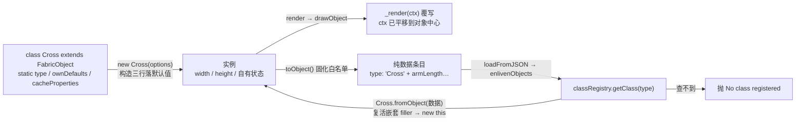

import { Canvas, Controls, Meta } from '@storybook/addon-docs/blocks';
import * as CustomObject from './custom-object.stories';

<Meta of={CustomObject} name="Docs" />

# 自定义对象

内置图形是"参数化形状"——Rect 换的是宽高圆角，不是画法。当对象的**画法本身**是新的（示波器波形、棋盘、进度环），或者它带着**自有状态与序列化形态**（业务图元要随存档往返）时，就轮到自定义对象类：继承 `FabricObject`（或某个具体图形），覆写 `_render` 自己画，用一组静态成员声明类型名、默认值、缓存清单和序列化白名单，最后在 `classRegistry` 登记。v6 起整个体系是标准 TypeScript class——没有 `createClass`，没有 `initialize` 钩子，没有原型补丁。一个先立住的判断：**渲染靠多态覆写，复活靠注册表**——不注册，`new`、渲染、`toObject` 一切照旧，只有 `loadFromJSON` 这类"从数据重建实例"的路径会查表失败。



下面这张配方表是本课的回查地图（均以 7.4.0 源码为准）：

| 配方成员 | 基类行为 | 回查要点 |
| --- | --- | --- |
| `static type` | `'FabricObject'` | 导出条目 `type` 字段与注册名的来源；实例 `type` getter 返回小写 |
| 构造三行 | — | `super()` → `Object.assign(this, X.ownDefaults)` → `this.setOptions(options)`；v6+ 无 `initialize` 钩子 |
| `static ownDefaults` | 各基类一份增量 | 本类默认值，构造时落到实例 |
| `static getDefaults()` | 逐级 `super` 合并 | `includeDefaultValues: false` 剥默认键时的对照基准 |
| `static cacheProperties` | 14 键（fill / width / strokeWidth…） | `set()` 命中即标脏；影响外观的自定义字段要追加 |
| `static customProperties` | `[]` | 类级序列化白名单（与覆写 `toObject` 二选一） |
| `_render(ctx)` | 空占位 | 唯一自绘钩子；ctx 已平移到对象中心，围绕 `(0,0)` 画 |
| `toObject(propertiesToInclude)` | 固定清单 + 白名单附加 | 子类覆写把自有键固化进清单 |
| `static fromObject` | 复活嵌套 filler → `new this(options)` | 异步资源或非 options 构造签名时才覆写 |
| `classRegistry.setClass` | — | JSON 复活通道；不带别名时登记大小写两条 |
| `classRegistry.setSVGClass` | — | SVG 导入通道；默认键 = `type` 小写 |
| `static createControls()` | 返回默认 9 控件的新实例 | 全类统一控件集时覆写 |

## 快速上手

一个能画、能选、能序列化往返的最小自定义类，完整代码就这么多：

```ts
import { Canvas, FabricObject, classRegistry, type TClassProperties } from 'fabric';

// 本类默认值增量：独立常量并标注类型（Rect 的 rectDefaultValues 同款形态）
const crossDefaults: Partial<TClassProperties<Cross>> = {
  armLength: 96,
  barWidth: 26,
};

class Cross extends FabricObject {
  static type = 'Cross';
  declare armLength: number;
  declare barWidth: number;

  static ownDefaults = crossDefaults;
  static getDefaults() {
    return { ...super.getDefaults(), ...Cross.ownDefaults };
  }
  // 影响外观的字段进缓存监听清单：set() 时自动标脏
  static cacheProperties = [...FabricObject.cacheProperties, 'armLength', 'barWidth'];

  constructor(options: Partial<{ armLength: number; barWidth: number }> = {}) {
    super();
    Object.assign(this, Cross.ownDefaults); // 本类默认值
    this.setOptions(options);               // 调用方选项最后生效
    this.width = this.armLength;            // 包围盒跟随绘制内容
    this.height = this.armLength;
  }

  _render(ctx: CanvasRenderingContext2D) {
    const { armLength, barWidth } = this;
    ctx.beginPath();
    ctx.rect(-armLength / 2, -barWidth / 2, armLength, barWidth);
    ctx.rect(-barWidth / 2, -armLength / 2, barWidth, armLength);
    this._renderPaintInOrder(ctx);          // 复用 fill/stroke 管线
  }

  toObject(propertiesToInclude: any[] = []) {
    return super.toObject([...propertiesToInclude, 'armLength', 'barWidth']);
  }
}
classRegistry.setClass(Cross); // 登记 'Cross' 与 'cross' 两条

const canvas = new Canvas(el, { width: 640, height: 360 });
canvas.add(new Cross({ left: 80, top: 80, fill: '#38bdf8' }));
// canvas.toObject() → { type: 'Cross', armLength: 96, barWidth: 26, … }
// canvas.loadFromJSON(json) → classRegistry 查 'Cross' → Cross.fromObject 复活
```

## 最小配方

自定义类 = 三行构造 + 五个静态成员。每个内置图形（Rect、FabricText…）都是按同一配方写的，照抄结构就不会漏：

- **`static type = 'Cross'`**：序列化条目里 `type` 字段的取值，也是注册表的默认登记名。v7 导出大写驼峰；实例上的 `obj.type` getter 返回**小写**（`'cross'`，`'FabricObject'` 特判为 `'object'`），setter 只打警告不改值——判断实例类型用 `instanceof Cross`，字符串比较用 `obj.isType('Cross')`（同时比对静态与实例两种拼写）。type 只服务序列化与识别，不要拿它驱动业务逻辑。
- **构造三行**：`super()` 先落父类默认值（`InteractiveFabricObject` 构造还会发放一份默认控件集）；`Object.assign(this, Cross.ownDefaults)` 落本类默认值；`this.setOptions(options)` 逐键 `set()` 调用方选项。**v6 起没有 `initialize` 钩子**——v5 的 `initialize(options)` 是工厂 `createClass` 的构造回调，v6 升级时随 `createClass` 一起移除，构造逻辑直接写进 `constructor`。需要拦截选项时覆写 `setOptions(options)`（protected，构造专用）。
- **`declare` 字段声明**：`declare armLength: number` 只进类型、不生成赋值——避免类字段初始化器把 `Object.assign` 落好的默认值覆盖回 `undefined`。

### 类默认值：ownDefaults 与 getDefaults

`static ownDefaults` 只写**本类新增字段**的默认值，父类默认由 `super()` 链各自落；`static getDefaults()` 用 `{ ...super.getDefaults(), ...X.ownDefaults }` 逐级合并出"这个类完整的默认值"。`getDefaults` 不是摆设：`toObject` 在 `includeDefaultValues: false` 时按 `this.constructor.getDefaults()` 对照剥默认键——子类加了 `ownDefaults` 却忘了合并 `getDefaults`，精简导出就剥不掉这些字段（无害但体积白占）。TypeScript 下 `ownDefaults` 要用**带类型注解的独立常量**再赋给静态（`const crossDefaults: Partial<TClassProperties<Cross>> = {…}`）——直接写对象字面量会被弱类型检查拒绝（"no properties in common"，内置类清一色用常量就是这个原因）。给**已有类**全局改默认值（如所有对象的手柄样式）是另一条路——直接改基类 `ownDefaults`，机制与陷阱（只影响新建实例）在[变换控件](?path=/docs/controls--docs)已讲清，本课不重复。

## 自定义渲染：_render

渲染链上你只需要接管一个点。`render(ctx)`（框架调用）依次做：不可见短路 → `transform(ctx)` 应用位置/旋转/缩放/倾斜 → 应用透明度与阴影 → 按缓存策略二选一 → `drawObject` 里派发 `before:render` 事件后调 **`_render(ctx)`**，随后叠加 clipPath。所以覆写 `_render` 时：

- **ctx 已平移到对象中心**——对象自身的 `left/top/angle/scaleX` 已乘进变换矩阵，你只管围绕 `(0,0)` 画逻辑坐标（Rect 的 `_render` 就是 `x = -w/2, y = -h/2` 起步）。
- **构建完路径交给 `_renderPaintInOrder(ctx)`**——它按 `paintFirst` 顺序执行填充与描边，渐变 / Pattern / `fillRule` / `strokeUniform` / 虚线全部照常生效。直接 `ctx.fillRect` 也能画（官方 demo 这么干），但会绕开整个填充体系，fill 设了渐变也不生效。
- **自绘内容落在 width × height 的框内**。`width/height` 不约束绘制（渲染不裁剪逻辑坐标），但它决定包围盒、命中检测、控件框和**缓存画布的尺寸**——`objectCaching` 开着时，缓存位图按 `width/height` 分配，溢出部分会被裁掉。像快速上手那样让 `width/height` 跟随绘制参数即可。
- **width/height 都为 0 且 strokeWidth 为 0 时整个对象不渲染**——`render()` 开头的 `isNotVisible()` 会短路返回，这是"自定义对象 add 上去什么都不显示"的头号原因（另一个是 `visible: false` / `opacity: 0`）。

### dirty、objectCaching 与 cacheProperties

`render()` 的缓存二分法（[渲染模型](?path=/docs/rendering-model--docs)讲过全景，这里只讲子类义务；画布级缓存配置与大数据量下的策略属于[性能优化](?path=/docs/performance--docs)主题）：

- **`objectCaching: true`（默认）**：`_render` 画进私有缓存画布，主画布只贴位图。位图何时重画？`renderCache` 里 `isCacheDirty()` 检查——尺寸/缩放变了会重画，否则看 **`dirty` 标志**。
- **`dirty` 怎么置位**：`set(key, value)` 内部检查键是否在 `this.constructor.cacheProperties`（基类 14 键：fill、stroke、strokeWidth、width、height、paintFirst、clipPath…），命中且值变了就 `dirty = true`。**自定义外观字段不追加进 `cacheProperties`，`set()` 就不会自动标脏**——这是子类最容易漏的静态成员。
- **每帧推进的内部状态**（相位、时间）不适合走 `set()`：要么每帧手动 `dirty = true`，要么构造时 `objectCaching = false` 让 `render` 直接调 `_render`（官方动画 demo 的选择）。两条路的取舍见[最佳实践](#最佳实践)。

本课实验台把这套机制做成了可开关的证据（见[自定义对象实验台](#自定义对象实验台)）：缓存开 + 漏标脏 + 每帧推进 = 画面冻结而状态读数继续走。

## 序列化：固化白名单与注册

导出与复活是两个方向，义务各在一处：**导出靠子类自己**（把自有字段固化进 `toObject` 的清单），**复活靠注册表**（`classRegistry` 按 `type` 字符串查类）。白名单机制的全景（三层并集、`includeDefaultValues`、`excludeFromExport`）在[序列化](?path=/docs/serialization--docs)已讲，本课只讲子类的写法。

### toObject：固化白名单

6.1 讲过调用点传 `propertiesToInclude`——但调用方不该知道 Cross 有哪些自有字段。子类覆写 `toObject`，把自有键**固化**进清单，调用方传什么都额外带上（Rect 对 `rx/ry` 就是这么写的）：

```ts
const CROSS_PROPS = ['armLength', 'barWidth'] as const;

toObject(propertiesToInclude: any[] = []) {
  return super.toObject([...CROSS_PROPS, ...propertiesToInclude]);
}
```

另一条路是静态白名单：`static customProperties = ['armLength', 'barWidth']`，`toObject` 内部会把它与调用点数组、全局 `FabricObject.customProperties` 取并集。两条路效果等价；覆写 `toObject` 的优势是**这一份清单可以同时喂给 `ownDefaults` 与 `cacheProperties`**（一份常量三处用），`customProperties` 的优势是不碰方法、可与调用点白名单叠加。反着记更牢：不进清单的自有字段导出时**静默消失**，往返后是 `undefined`。

### classRegistry：注册可复活的类

`loadFromJSON` 对每个条目执行 `classRegistry.getClass(entry.type).fromObject(entry)`——按 `type` 字符串查全局注册表，查不到直接抛 `No class registered for Cross`，整个 Promise reject（复活链路细节见[序列化](?path=/docs/serialization--docs)）。注册就一行，放在类定义后、模块顶层：

```ts
classRegistry.setClass(Cross);        // 登记 'Cross' 与小写 'cross' 两条
classRegistry.setClass(Cross, 'X');   // 带第二参：只登记别名 'X' 一条
classRegistry.getClass('cross');     // → Cross（大小写两条都能查到）
```

三点边界：注册是**模块副作用**——`import` 了定义模块才算注册（fabric 内置类同样在各自模块加载时登记），动态加载的页面要保证先 import 再 loadFromJSON；`setClass(X)` 不带别名默认登记两条拼写，v5 小写 type 的旧数据因此也能加载；**`clone()` 不查注册表**（直接走 `this.constructor.fromObject`），未注册的自定义类照样能 clone——只有"从字符串数据复活"的路径需要注册表。

### fromObject：覆写异步初始化

基类 `static fromObject(object, options?)` 的默认实现（`_fromObject`）：先 `enlivenObjectEnlivables` 复活嵌套的渐变 / clipPath / shadow，再 `new this(options)`——只要构造签名是 `(options)` 且无异步资源，**什么都不用写**。需要覆写的两种场合，内置类各占一种：

```ts
// 场景一：构造第一参不是 options——用 extraParam 把某个键提为第一参（FabricText 的做法）
static fromObject<T extends TOptions<SerializedTextProps>>(object: T) {
  return this._fromObject({ ...object, styles: stylesFromArray(/*…*/) }, {
    extraParam: 'text', // 条目里的 text 键变成 new this(text, rest) 的第一参
  });
}

// 场景二：要加载异步资源——完全重写（FabricImage 的做法：loadImage + 滤镜 enlive 并行）
static fromObject({ filters, resizeFilter, src, ...object }, options?) {
  return Promise.all([loadImage(src, options), /* 滤镜复活 */]).then(
    ([el, hydrated]) => new this(el, { ...object, ...hydrated }),
  );
}
```

这也是 `fromObject` 恒为 Promise 的原因：即便你的类同步构造，嵌套的 Pattern / 图片 filler 也可能要等网络（机制见[序列化](?path=/docs/serialization--docs)）。

## SVG 通道

JSON 之外还有一条 SVG 通道，两个方向各自独立：

- **导出**：`toSVG()` 用 `_toSVG(reviver)` 的返回值拼标记。覆写 `_toSVG` 返回字符串数组，其中 `'COMMON_PARTS'` 是占位符，基类把 transform、公共属性与 style 填进去（Rect 返回 `['<rect ', 'COMMON_PARTS', 'x="…" …/>']`）。基类默认返回 `['']`——不覆写的自定义类导出 SVG 不报错，但只剩一个空 `<g>` 包装。
- **导入**：`loadSVGFromString` 对每个元素查 `classRegistry.getSVGClass(标签名小写)`，查不到的元素**静默跳过**（不报错）。想让自定义类接管某个 SVG 标签，注册 SVG 表并实现解析：`classRegistry.setSVGClass(PathPlus, 'path')` + `static ATTRIBUTE_NAMES` 声明解析哪些属性 + `static fromElement(el, options, cssRules)` 把元素转成实例（[SVG 互操作](?path=/docs/svg--docs)）。

注意方向性：`setSVGClass` 只影响**导入**；导出只看 `_toSVG` 的多态覆写，与注册表无关。

## 控件集与每帧状态

### 覆写 createControls

自定义类默认从 `InteractiveFabricObject` 构造里领一份新的默认 9 控件集。想全类统一控件（比如 Cross 永远带一个旋转手柄），覆写 `static createControls()`；想全类**共享同一份**控件实例，让它返回空对象、把控件集放进 `ownDefaults`——官方文档的做法，机制与 v5 迁移对照在[变换控件](?path=/docs/controls--docs)已讲。控件本身的构造、钩子与 `controlsUtils` 工具族见[自定义控件](?path=/docs/custom-controls--docs)；只需记住**`controls` 不参与序列化**，`loadFromJSON` 复活的实例拿的是新默认集，靠 `createControls` 覆写才能"随类恢复"。

### 每帧推进状态：animating-crosses 模式

官方 [animating-crosses demo](http://fabricjs.com/demos/animating-crosses) 是自定义对象的教科书案例（demo 站源码仍是 v5 的 `fabric.Object` 全局写法，模式照搬到 v7）：`Cross` 构造函数设置内部状态（`w1/h2` 尺寸与 `animDirection` 方向）并 `objectCaching = false`；`_render` 读状态画两根矩形；`requestAnimationFrame` 循环里逐对象调 `animateWidthHeight()` 推进状态，然后 `canvas.requestRenderAll()`。要点有三：

- **推进逻辑是普通方法，渲染只读状态**——`_render` 保持纯函数式（状态 → 画面），动画循环负责改状态，两边不搅在一起。
- **`objectCaching = false` 或每帧 `dirty = true` 二选一**（上文的缓存二分法），demo 选了前者因为它的对象每帧都变。
- 与 `util.animate` 的分工（[动画](?path=/docs/animation--docs)）：`animate` 补间**单个属性**并带缓动/回调；每帧跑任意逻辑（方向翻转、多状态联动）用 rAF 循环 + `requestRenderAll`。

## 自定义对象实验台

同一份 Cross 配方在五个输入下的完整行为——渲染、缓存、序列化往返逐项可核对（Show code 即 `example.ts` 顶部的 Cross 类与实验台实现）：

<Canvas of={CustomObject.Interactive} />
<Controls of={CustomObject.Interactive} />

| 读者操作 | 可核对结果 |
| --- | --- |
| 保持默认 | 蓝色十字 + 黄色方块（内置 Rect 对照）；「type」显示静态 `Cross` 与实例 getter 的 `cross` 两种拼写；「classRegistry」两个名都命中；「导出条目」含 `armLength/barWidth`、不含 `phase/pulseScale` |
| 拖「臂长 armLength」 | 十字变大、包围盒跟随；「导出条目」的 armLength 同步——固化白名单后序列化不再需要传参 |
| 开「脉动动画」 | 十字呼吸缩放；「渲染状态」的 phase 与已推进帧数持续走 |
| 再关「每帧标记 dirty」（缓存默认开） | **画面冻结而 phase 读数继续走**——内部状态不在 `cacheProperties` 里、漏标脏的典型症状 |
| 关「对象缓存 objectCaching」 | 画面恢复呼吸——不缓存时 `render` 直接调 `_render`，`dirty` 不再需要 |
| 开「执行往返」 | 画布经 `toObject → JSON.stringify → loadFromJSON` 重建；「往返后」显示 `instanceof Cross ✓`、armLength 保留、pulseScale 重置 1（内部态未随行）；内置 Rect 同样复活 |
| 往返后再拖「臂长」 | 复活出的新实例照常响应——`set()` 命中 `cacheProperties` 自动标脏在它身上同样生效 |
| 拖动画布上的对象 | 读数联动（left/top 等进导出条目） |
| 打开 Show code | 看到该 Canvas 实际执行的 `example.ts` |

## 版本对照：v5 原型模式

v5 时代没有公开的 class 体系：官方 `createClass` 工厂负责跑自定义的 `initialize` 钩子，社区教程大量用 `fabric.util.object.extend(SomeClass.prototype, {...})` 直接补原型，默认值也挂在原型上（改一处全体生效）。v6 升级指南明确移除了这些：标准 `extends`、默认值构造时落到实例、不再做原型变更。读旧资料先对表：

| 写法 / 行为 | v5 | v6 / v7 |
| --- | --- | --- |
| 定义子类 | `createClass` + `initialize(options)` 钩子，或 `util.object.extend` 补原型 | `class Cross extends FabricObject` + `constructor` |
| 实例默认值 | 挂原型（`X.prototype.foo = …`，全体共享） | `static ownDefaults`，构造时落到每个实例 |
| 基类名 | `fabric.Object`（全局命名空间） | `import { FabricObject } from 'fabric'` |
| `fromObject` | 同步返回实例 | 返回 Promise（嵌套 filler / 图片异步） |
| 控件集 | `prototype.controls` 全局共享 | 每实例一份；统一走 `static createControls()` |

## 最佳实践

- **自有字段一份清单三处引用**：`CROSS_PROPS` 常量同时喂 `ownDefaults`（默认值）、`cacheProperties`（标脏）、`toObject` 覆写（序列化），Rect 的 `RECT_PROPS` 就是这个形态——三处漂移是自定义对象最常见的静默 bug（忘标脏→画面不更新；忘序列化→往返丢字段）。
- **识别实例用 `instanceof`**；`type` 字符串只留给序列化与注册表，需要字符串过滤时用 `isType`（大小写两种拼写都认）。
- **注册放模块顶层紧贴类定义**（fabric 内置类即如此）：`import` 即注册，保证任何 `loadFromJSON` 之前定义模块已被加载。
- **内部渲染态（相位、临时高亮）不进序列化**：只把"重建对象必需"的字段固化进 `toObject`；画布对象不是应用的数据仓库（官方指南同款告诫）。
- **动画对象的缓存取舍**：静态可缓存对象保持 `objectCaching: true` + 精确标脏（谁变标谁）；每帧全变的对象直接 `objectCaching = false`（官方 demo 的选择）——省掉标脏义务，代价是每帧重画。
- **TypeScript 下补类型**：子类自有字段用 `declare`；给**已有类**松散挂字段（`rect.set('taskId', …)`）用模块扩充 `declare module 'fabric'`（给 `FabricObject` 补实例字段、给 `SerializedObjectProps` 补序列化形态），写法见官方 custom properties 指南。

## 常见问题

- 自定义对象 `add` 上去什么都不显示
  `width` / `height` 没设且 `strokeWidth` 为 0：`render()` 开头的 `isNotVisible()` 直接短路返回。构造里让 `width/height` 跟随绘制尺寸；另查 `visible` 与 `opacity`。
- 状态明明在推进（读数在变），画面不动
  `objectCaching` 开着且没标脏：缓存位图被判定仍然新鲜。字段变了走 `set()` 并把字段加进 `static cacheProperties`；每帧变的内部状态在循环里手动 `dirty = true`，或干脆 `objectCaching = false`。别忘了改完状态要 `requestRenderAll()`——标脏只管缓存，不管主画布重画。
- `loadFromJSON` 报 `No class registered for Cross`
  自定义类没进 `classRegistry`：定义模块未被 import（注册是模块副作用），或登记名与条目 `type` 拼写不符。`setClass(X)` 默认登记大小写两条；用别名注册时注意只有那一条能查到。
- `instance.type` 是 `'cross'`，和 `static type = 'Cross'` 对不上
  实例 `type` 是 getter，返回静态 `constructor.type` 的小写（序列化条目里写的才是原始拼写）。比较用 `isType('Cross')`（两种拼写都认）或直接 `instanceof`。
- 照 v5 教程写的子类在 v6+ 全部报错
  `initialize` / `createClass` / `fabric.util.object.extend(…prototype…)` 都是 v5 体系，v6 起移除。改成 `class extends` + 构造三行 + `static ownDefaults`，见上文版本对照。
- `loadSVGFromString` 里的自定义元素被静默忽略
  SVG 导入按标签名查 `classRegistry.getSVGClass(小写标签名)`，查不到的元素返回 null 跳过、不报错。`setSVGClass(MyClass, 'mytag')` 注册并实现 `static fromElement`。
- SVG 导出里自定义对象只剩一对空 `<g>` 标签
  基类 `_toSVG` 返回 `['']`，导出不报错但没有图形标记。覆写 `_toSVG` 返回带 `'COMMON_PARTS'` 占位符的标记数组。

## 总结回顾

摘要：

自定义对象是"新的对象种类"而不是新参数：`class Cross extends FabricObject` + 构造三行（`super()` → `Object.assign(ownDefaults)` → `setOptions(options)`，v6 起无 `initialize` 钩子）+ 五个静态成员（`type` 定类型名、`ownDefaults` / `getDefaults()` 定默认、`cacheProperties` 定标脏清单、`customProperties` 定类级白名单）。渲染只覆写 `_render`：ctx 已平移到对象中心，构建路径交给 `_renderPaintInOrder` 复用填充管线，自绘内容落在 `width/height` 框内（否则缓存裁剪、`isNotVisible` 短路）。缓存侧，`set()` 命中 `cacheProperties` 自动标脏，每帧状态手动 `dirty = true` 或关 `objectCaching`。序列化两个方向各归其位：导出靠覆写 `toObject` 固化自有键（或 `static customProperties`），复活靠 `classRegistry.setClass` 登记（默认大小写两条，`clone()` 不查表、`loadFromJSON` 查表）；`fromObject` 默认复活嵌套 filler 后 `new this(options)`，异步资源或非 options 构造签名才覆写。SVG 导出覆写 `_toSVG`，导入注册 `setSVGClass` 并实现 `fromElement`；控件集统一覆写 `static createControls`。每帧推进状态用官方 animating-crosses 模式：方法推进状态、`_render` 只读、rAF + `requestRenderAll`。

一句话：

> 自定义对象的渲染靠多态覆写（`_render` + 静态成员），复活靠注册表（`classRegistry`）——不注册一切照常，只有从数据重建实例的路径会失败。

知识要点：

- 最小配方的构造三行是什么？v5 的 `initialize` 钩子去哪了？
- `_render` 收到的 ctx 处在什么坐标系？为什么自绘内容要落在 `width/height` 框内？
- `static type` 与实例 `type` getter 的拼写有什么不同？识别实例推荐用什么？
- `ownDefaults` 与 `getDefaults()` 各承担什么？`includeDefaultValues: false` 按哪份剥键？
- `set()` 何时自动标脏？自定义外观字段要追加进哪个静态清单？
- 每帧推进的内部状态有哪两种缓存策略？漏标脏的症状是什么？
- 子类固化序列化白名单的两种写法是什么？不进清单的字段往返后是什么？
- `classRegistry.setClass` 不带别名登记几条？哪些 API 查注册表、哪些不查？
- `fromObject` 默认实现做什么？两种覆写场合分别对应哪个内置类？
- SVG 导出与导入分别覆写 / 注册什么？未注册的标签导入时会发生什么？

## 参考资料

- [官方指南：Objects and custom properties（子类化、注册与模块扩充）](https://fabricjs.com/docs/using-custom-properties/)
- [官方 API：FabricObject（_render / toObject / fromObject / 静态成员）](https://fabricjs.com/api/classes/fabricobject/)
- [官方 API：classRegistry（setClass / getClass / setSVGClass）](https://fabricjs.com/api/variables/classregistry/)
- [官方 Demos：Animating crosses（自定义类 + 每帧推进状态）](http://fabricjs.com/demos/animating-crosses)
- [官方指南：Caching of object, properties and behavior（objectCaching 与 dirty）](https://fabricjs.com/docs/fabric-object-caching/)
- [官方升级指南：Upgrading to Fabric.js 6.0（createClass / initialize 移除与默认值迁移）](https://fabricjs.com/docs/upgrading/upgrading-to-fabric-60/)
- [Fabric 5 旧文档：fabric.Object（v5 initialize 钩子对照）](https://fabric5.fabricjs.com/docs/fabric.Object.html)
