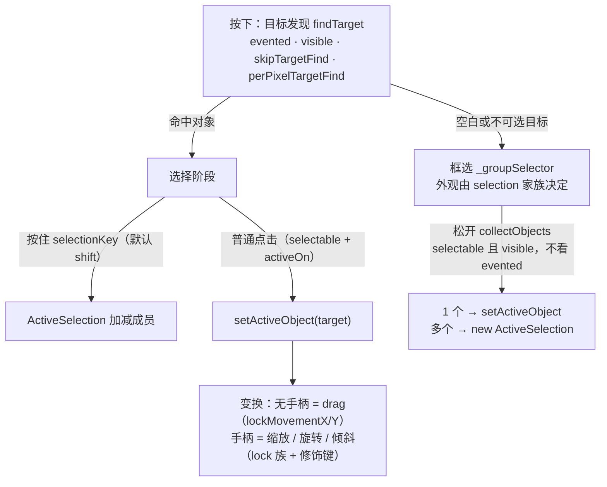

import { Canvas, Controls, Meta } from '@storybook/addon-docs/blocks';
import * as DragSelect from './drag-select.stories';

<Meta of={DragSelect} name="Docs" />

# 拖拽与选择

交互画布上"点一下会发生什么"由一条固定管线决定：先**目标发现**（谁能被点中），再**选择**（点选、多选、框选三条分支），最后**变换**（拖动与手柄动作，受锁定族与修饰键约束）。本课把这条管线上的每个开关讲清楚：对象级 `selectable` / `evented` 决定谁能进管线，`lock*` 族约束管线末端的动作，画布级 `selection` 家族决定框选与多选的规则，`skipTargetFind` / `perPixelTargetFind` 等决定命中方式，读完能预测任何一个开关拨动后画布行为怎么变。事件载荷与事件流见[事件系统](?path=/docs/events--docs)，手柄外观与自定义见[变换控件](?path=/docs/controls--docs)，Group 与 ActiveSelection 的布局细节见[分组与多选](?path=/docs/group-selection--docs)。



对象级开关与锁定族（写在对象上，构造参数或 `set()` 修改，全部为 FabricObject 公开属性）：

| 属性 | 默认值 | 管什么 | 回查要点 |
| --- | --- | --- | --- |
| selectable | true | 能否成为活动对象 | 关掉后点选、框选、拖动都失效；命中与事件不受影响 |
| evented | true | 能否被命中与派发事件 | 关掉后点击与悬停穿透到下层；框选仍能收集 |
| activeOn | 'down' | 点选生效时机 | 'up' 时按下不选、松开才选，按下拖动无效 |
| lockMovementX / lockMovementY | false / false | 拖动的单轴开关 | 锁动作不锁选中；两轴同锁 = 能选不能拖 |
| lockRotation | false | mtr 旋转手柄 | 拒绝时光标变 not-allowed |
| lockScalingX / lockScalingY | false / false | 缩放的单轴开关 | 角柄等比需两轴，任一轴锁角柄即被拒 |
| lockSkewingX / lockSkewingY | false / false | 倾斜的单轴开关 | 倾斜默认仅按 altActionKey（shift）拖侧柄可触发 |
| lockScalingFlip | false | 拖过锚点的翻转 | 缩放方向反转的瞬间直接拒绝动作 |
| minScaleLimit | 0 | 缩放下限 | `set('scaleX')` 的绝对值下限 |
| padding | 0 | 命中区域外扩 | 命中检测在角点四边形基础上外扩 padding |
| selectionBackgroundColor | '' | 选中时的对象背景 | 选中态视觉，不影响命中 |
| hasControls / hasBorders | true / true | 手柄与边框显示 | 样式与自定义见[变换控件](?path=/docs/controls--docs) |

画布级配置（写在 Canvas 上，构造参数或 `set()` 修改）：

| 属性 | 默认值 | 管什么 | 回查要点 |
| --- | --- | --- | --- |
| selection | true | 框选与多选修饰键的总开关 | 关掉后普通点选仍可用 |
| selectionKey | 'shiftKey' | 多选修饰键 | 可传数组如 ['shiftKey', 'ctrlKey']，任一按下生效 |
| selectionColor / selectionBorderColor / selectionDashArray / selectionLineWidth | 'rgba(100, 100, 255, 0.3)' / 'rgba(255, 255, 255, 0.3)' / [] / 1 | 框选矩形外观 | 画在顶层画布，松手即消 |
| selectionFullyContained | false | 框选收集口径 | false 相交即收；true 只收完全包含 |
| skipTargetFind | false | 关闭目标发现 | 点选失效、悬停无目标、点击清空当前选择；框选不受影响 |
| perPixelTargetFind | false | 像素级命中 | 对象级有同名属性可逐对象覆盖；透明处穿透 |
| targetFindTolerance | 0 | 像素命中的容差像素数 | 仅 perPixelTargetFind 生效；改值用 setTargetFindTolerance() |
| preserveObjectStacking | true（v7；v6 为 false） | 选中对象的层叠策略 | true 保持层叠、重叠点击按层叠命中；false 活动对象浮顶渲染 |
| altSelectionKey | undefined（未启用） | 重叠区保持活动对象 | 仅 preserveObjectStacking 为 true 时工作 |
| uniformScaling / uniScaleKey | true / 'shiftKey' | 角柄缩放是否等比 | 默认等比，按住键反转 |
| centeredScaling / centeredRotation | false / false | 画布级居中变换 | 与对象级同名属性取"或"；对象 centeredRotation 默认 true |
| centeredKey / altActionKey | 'altKey' / 'shiftKey' | 居中反转 / 侧柄换倾斜 | 按住临时反转对应行为 |
| hoverCursor / moveCursor / defaultCursor | 'move' / 'move' / 'default' | 悬停 / 拖动 / 空画布光标 | 对象级 hoverCursor（默认 null）可逐对象覆盖 |
| fireRightClick / fireMiddleClick / stopContextMenu | true（v7 起翻转，已废弃） | 右键 / 中键事件与菜单 | 8.0 将移除；事件侧见[事件系统](?path=/docs/events--docs) |

## 交互管线

一次左键按下在 Canvas 内部按固定顺序走（源码 `Canvas.__onMouseDown`）：先 `findTarget` 找目标；有目标时先判多选键是否按下（`handleMultiSelection`），否则按需清空当前选择；无目标、或目标 `selectable: false` 且不是活动对象、且 `canvas.selection` 为 true 时启动框选（内部记 `_groupSelector`）；目标是可选对象时 `setActiveObject`（受 `activeOn` 约束）；最后 `_setupCurrentTransform` 进入变换——按在手柄上走手柄动作，按在对象身上就是 drag。松开时若发生过移动且框选激活，`handleSelection` 收集对象落成单选或多选。

内部方法名不用背，记住"命中 → 选择 → 变换"三段，就能定位任何行为问题的作用点，也知道该改哪一层：

| 想要的行为 | 配置 |
| --- | --- |
| 点不中某对象（点击穿透到下层） | 对象 evented: false |
| 能收到事件但不能被选中 | 对象 selectable: false |
| 能选中但不能拖动 | 对象 lockMovementX + lockMovementY: true |
| 禁用框选、保留点选 | 画布 selection: false |
| 禁用一切点选、只留框选 | 画布 skipTargetFind: true |
| 框选只收完全包含的对象 | 画布 selectionFullyContained: true |
| 完全不可交互的展示画布 | 用 StaticCanvas，或 selection: false 加 skipTargetFind: true |

## 对象开关

`evented` 与 `selectable` 是两个正交开关，分别卡在管线的两段：

- **evented（默认 true）卡在目标发现**。`_checkTarget` 要求 `visible && evented` 才能成为命中目标，关掉后点击会命中下层对象或空白，悬停光标回落到 defaultCursor，对象级 mouse 事件也不再派发。但框选照收——框选的收集条件不看 evented（见"框选"一节）。
- **selectable（默认 true）卡在选择**。关掉后对象仍会被命中（悬停光标是 move、事件照发），但 mousedown 不会选中它，框选也不收集，自然拖不动。点击它的效果等同点空白：若有当前选择会被清空，从它身上按下拖动会画出框选。
- **没有 `movable` 之类的属性**。"能选中但拖不动"的官方表达是锁住两个移动轴，见下一节。
- **activeOn（默认 'down'）改选中时机**：`'up'` 时改为松开才选中，按下阶段不进入变换——按住它拖动无效。

```ts
// 需要事件但不可选中：背景板、参考线
guide.set({ selectable: false });

// 指针完全穿透：只剩渲染，点选/框选/悬停全部跳过
watermark.set({ selectable: false, evented: false });
```

<Canvas of={DragSelect.SwitchBench} />
<Controls of={DragSelect.SwitchBench} />

| 读者操作 | 可核对结果 |
| --- | --- |
| 关闭「A.selectable」后点击 A | 「最近命中 mouse:down」仍是 A（命中正常），「选中集」不再出现 A；先选中 B 再点 A，选中集被清空 |
| 关闭「A.selectable」后从 A 身上拖动 | 拖出框选矩形——按下点落在不可选对象上等同空白 |
| 关闭「A.evented」后悬停、点击 A | 悬停光标不再变 move；「最近命中 mouse:down」变成下层对象或 —（穿透） |
| 关闭「A.evented」后框选套住 A | 「选中集」仍包含 A——evented 不挡框选收集 |
| 把「A.activeOn」切到 'up' | 按下 A 不选中，松开瞬间「选中集」出现 A；按住拖动无效 |

## 锁定

锁定族全部默认 false，作用点在管线的**变换段**：对象照样可以被选中、事件照发，只是动作被拒绝，被拒的手柄光标变 not-allowed（canvas.notAllowedCursor）。

| 锁 | 拒绝的动作 | 行为细节 |
| --- | --- | --- |
| lockMovementX / lockMovementY | 对应轴的拖动 | 逐轴独立判断；两轴同锁等于"能选不能拖" |
| lockRotation | mtr 旋转手柄 | angle 不变，`object:rotating` 不触发 |
| lockScalingX / lockScalingY | 对应轴的缩放 | 角柄是等比动作需要两轴配合，任一轴锁定角柄即被拒；左/右侧柄只受 lockScalingX 约束，上/下侧柄只受 lockScalingY 约束 |
| lockSkewingX / lockSkewingY | 对应轴的倾斜 | 倾斜默认只能按住 altActionKey（shift）拖侧柄触发，锁住即拒绝 |
| lockScalingFlip | 拖过锚点的翻转 | 拖穿对角、缩放符号反转的瞬间整个动作被拒，不会翻过来 |

两个补充：`minScaleLimit`（默认 0）给 `set('scaleX' / 'scaleY')` 设绝对值下限，防止缩到 0 消失；历史上有个 `lockUniScaling`（锁等比缩放）在 v4 已删除，等比行为改由画布 `uniformScaling` 与 `uniScaleKey` 控制（见"修饰键"一节）。

<Canvas of={DragSelect.LockBench} />
<Controls of={DragSelect.LockBench} />

| 读者操作 | 可核对结果 |
| --- | --- |
| 开「D.lockMovementY」后拖 D | D 仍能被选中（边框手柄正常出现），「D left / top」只有 left 变化，top 冻结 |
| 开「D.lockScalingX」后拖 D 的角柄 | 角柄拖不动（光标 not-allowed）；拖上/下侧柄仍能改变高度——受 lockScalingY 约束的是另一条轴 |
| 同时开 lockScalingX 与 lockScalingY | 所有缩放手柄全部拒绝——完全禁缩放要两轴同锁 |
| 开「D.lockRotation」后拖 mtr | 「D angle」恒为 0°，光标 not-allowed |

## 框选

按下处没有可选目标（空白，或按在 `selectable: false` 的对象上）且 `canvas.selection` 为 true 时，内部记录 `_groupSelector`，随拖动在**顶层画布**上实时画框——`selectionColor` 填充、`selectionBorderColor` 描边、`selectionDashArray` 虚线、`selectionLineWidth` 线宽；松开时 `collectObjects` 收集，1 个落单选、多个落 ActiveSelection。纯点击空白（没有移动）不收集，只清空当前选择。

收集条件是 **`selectable` 且 `visible`，与 evented 无关**；口径由 `selectionFullyContained` 决定：false（默认）与框**相交**即收，true 只收被框**完全包含**的对象。收集按层叠自上而下遍历，多个对象反转后按画布层叠顺序（自下而上）进入 ActiveSelection。

`selection: false` 的准确含义是**关掉框选和多选修饰键点选**，普通点选不受影响——选中单个对象的路径不看这个开关。

```ts
const canvas = new Canvas(el, {
  selection: true,               // 默认；false 只关框选与 shift 多选，点选仍在
  selectionFullyContained: true, // 只收完全包含的对象
  selectionColor: 'rgba(79, 124, 255, 0.2)',
  selectionBorderColor: '#4f7cff',
  selectionDashArray: [4, 3],    // 默认 [] 为实线
  selectionLineWidth: 1,
});
```

<Canvas of={DragSelect.MarqueeBench} />
<Controls of={DragSelect.MarqueeBench} />

| 读者操作 | 可核对结果 |
| --- | --- |
| 画框套住 R 的大半但不全含 | 「selectionFullyContained」关闭时 R 被收（相交即收）；打开后同样的框收不到 R——只有被框完全包含的对象（如整个套住 C 的小框）才被收 |
| 框住黄色的 T（selectable: false） | 任何口径下 T 都进不了「选中集」 |
| 点击描边的 S（evented: false） | 点不中（穿透），但框选套住后「选中集」包含 S——收集不看 evented |
| 关闭「canvas.selection」 | 拖空白不再画框、松手无选择；点选 C 仍然有效 |
| 打开虚线并把线宽拉到 4 | 框选矩形变成粗虚线，四项外观配置实时生效 |

## 多选

`selectionKey`（默认 `'shiftKey'`）按住时点选走多选分支（还需 `canvas.selection` 为 true、目标 `selectable`），三个走向：

- 当前是单对象选中：新建一个 ActiveSelection，把旧活动对象与新目标一起装进去；
- 目标已在 ActiveSelection 里：把它**移出**；只剩 1 个时 ActiveSelection 自动解散，剩下的对象直接成为活动对象；
- 目标不在其中：把它**加入**。

`selectionKey` 可以传数组（如 `['shiftKey', 'ctrlKey']`），任一按下即生效。

**ActiveSelection 是选择的临时容器**，不是持久分组：它是 Group 的子类，但不改变对象的层叠与坐标，`discardActiveObject()` 或点空白解散后对象原样留在画布上；`multiSelectionStacking`（默认 `'canvas-stacking'`）决定新加入的成员按画布层叠还是按点选顺序排序（可改 `'selection-order'`）。它与 Group 的创建、布局与进出细节见[分组与多选](?path=/docs/group-selection--docs)。

读选中集永远用这两个 API：`getActiveObject()` 多选时返回那个 ActiveSelection、单选时返回对象本身；`getActiveObjects()` 恒返回平铺的对象数组。

<Canvas of={DragSelect.MultiSelectBench} />
<Controls of={DragSelect.MultiSelectBench} />

| 读者操作 | 可核对结果 |
| --- | --- |
| 按 shift 依次点 E、F | 「当前活动对象」从 E 变成 ActiveSelection，「选中数量」变 2 |
| 再按 shift 点 F（已在选中集内） | F 被移出；数量回到 1 时活动对象直接变回 E——ActiveSelection 缩到 1 个自动解散 |
| 把「canvas.selectionKey」切到 'ctrlKey' | shift 点选失效，ctrl 点选生效；切到数组后任一修饰键都生效 |
| 不按修饰键直接点 G | 走普通点选分支，选中集被替换成单选 G |

## 命中配置

四个画布级开关都作用在目标发现这一段：

- **skipTargetFind（默认 false）**：true 时 `findTarget` 直接返回无目标——点选失效、悬停永远无目标、已有选择在下次点击时被清空；框选不受影响。与 `selection: false` 组合恰好互补（一个关框选留点选，一个关点选留框选）。
- **perPixelTargetFind（默认 false）**：默认命中按包围四边形判断；开启后逐像素判断（把对象渲染到离屏画布再查透明度），透明区域穿透。对象上有同名属性可逐对象覆盖。**targetFindTolerance（默认 0）只在像素命中时生效**：把判定点向容差方向外移，边缘附近的透明像素也算命中；改值用 `setTargetFindTolerance()`，它会同步内部的像素命中缓冲画布尺寸。
- **preserveObjectStacking（v7 起默认 true）**：true 时选中对象保持原层叠位置，重叠区域的点击按层叠顺序命中最上层；false（v6 及更早默认）时活动对象浮到最上层渲染，重叠点击优先命中活动对象。
- **altSelectionKey（默认未配置）**：设为某个修饰键（如 `'altKey'`）后，按住它点击重叠区可以保持当前活动对象不被更上层的对象抢选；只在 `preserveObjectStacking: true` 时工作。

右键与中键：`fireRightClick` / `fireMiddleClick` / `stopContextMenu` 从 v7 起默认 true（右键、中键也派发 mouse 事件并屏蔽右键菜单），三者已标记废弃、8.0 将移除；`enablePointerEvents`（默认 false）切换 pointer 事件体系。这些属于事件侧，见[事件系统](?path=/docs/events--docs)。

<Canvas of={DragSelect.TargetBench} />
<Controls of={DragSelect.TargetBench} />

| 读者操作 | 可核对结果 |
| --- | --- |
| 点圆环 O 的空心处（与 X 重叠处） | 「perPixelTargetFind」关：命中 O（包围四边形）；开：穿透命中底层 X——「最近 mouse:down 命中」翻转 |
| 开 perPixel 后把「targetFindTolerance」拉到 8 | 靠近环边的空心像素也开始命中 O |
| 开「skipTargetFind」后点任意对象 | 「最近 mouse:down 命中」恒为 —，已有选中集被点击清空；拖空白框选仍然可用 |
| 选中 X 后点 X 与 O 的重叠区（preserve 开） | 命中更上层的 O；关掉 preserve 后 X 浮到最上层渲染，重叠区始终命中 X |
| 开「altSelectionKey」（preserve 保持开）后按住 alt 点重叠区 | 命中保持 X——修饰键穿透抢选 |

## 修饰键

四个键位属性都写在画布上，值是修饰键名（'altKey'、'shiftKey'、'ctrlKey'、'metaKey'），设为 null / undefined 即关闭该功能。按住它们**临时反转**对应行为，不改任何持久状态：

| 键位 | 默认 | 按住时反转什么 |
| --- | --- | --- |
| uniScaleKey | 'shiftKey' | uniformScaling 的等比 / 自由 |
| centeredKey | 'altKey' | 缩放与旋转是否绕中心 |
| altActionKey | 'shiftKey' | 侧柄动作：缩放换倾斜 |
| selectionKey | 'shiftKey' | 点选换多选加减 |

- **等比**：`uniformScaling: true`（默认）时角柄缩放保持比例，按住 shift 变自由缩放；设为 false 后默认自由、按 shift 才等比。
- **居中**：`centeredScaling` / `centeredRotation` 画布级与对象级同名属性取"或"。对象 `centeredRotation` 默认 **true**（拖 mtr 绕中心转），`centeredScaling` 默认 false（拖角锚定对角）；按住 alt 临时反转当前状态。
- **换动作**：按住 altActionKey（默认 shift）时左/右侧柄从 scaleX 变成 skewY，上/下侧柄从 scaleY 变成 skewX——这也是锁定 lockSkewingX / Y 唯一能拦到的入口。

<Canvas of={DragSelect.KeyBench} />
<Controls of={DragSelect.KeyBench} />

| 读者操作 | 可核对结果 |
| --- | --- |
| 拖 M 的角柄 | 「M scaleX / scaleY」两轴同步变（等比），对角保持不动 |
| 按住 shift 拖角柄 | 两轴独立变化——uniScaleKey 反转了 uniformScaling |
| 把「canvas.uniformScaling」关掉再拖角 | 默认自由，按 shift 反转为等比 |
| 按住 alt 拖角柄，或打开「canvas.centeredScaling」 | 缩放绕中心：中心红点位置不动；两者叠加（开关开 + 按 alt）又反回锚定角 |
| 拖 mtr 旋转，再按住 alt 拖 mtr | 默认绕中心转（对象 centeredRotation 默认 true，angle 读数变化）；alt 反转为绕手柄锚点转 |

## 编程式选择

选择状态可以直接驱动，四个 API 都在 Canvas 上：

```ts
canvas.setActiveObject(rect);      // 单选；已有多选时触发 selection:updated
canvas.discardActiveObject();      // 清空当前选择

// 程序化多选：把画布上已有的对象装进 ActiveSelection
const selection = new ActiveSelection([rect, circle]);
selection.set('canvas', canvas);
canvas.setActiveObject(selection);

canvas.requestRenderAll();         // 两个 API 只改状态不重绘，刷新要自己来
```

`getActiveObject()` / `getActiveObjects()` 的语义见"多选"一节。selection 事件（字段与事件流见[事件系统](?path=/docs/events--docs)）：`selection:created` 带 selected，`selection:updated` 带 selected 与 deselected，`selection:cleared` 带 deselected；`canvas.remove()` 移除活动对象时也会自动清空选择并触发这一族事件。

<Canvas of={DragSelect.ProgrammaticBench} />
<Controls of={DragSelect.ProgrammaticBench} />

| 读者操作 | 可核对结果 |
| --- | --- |
| 切到「setActiveObject(P)」 | 「最近 selection 事件」显示 selection:created（selected: P），画布上 P 出现选中框 |
| 再切到「ActiveSelection(Q, R)」 | 事件变 selection:updated（selected: Q, R，deselected: P），选中集换多选框 |
| 切到「discardActiveObject()」 | 事件变 selection:cleared，选中集清空 |
| 在画布上直接 shift 点选或框选 | 同样驱动这族事件——交互与编程走同一套 selection 事件流 |

## 最佳实践

- 禁交互按粒度选层：装饰标签 `selectable` + `evented` 双 false；要事件不要选中用 `selectable: false`；可选中只读加锁族；整画布只读换 StaticCanvas（或 `selection: false` 加 `skipTargetFind: true`）。不要用锁族模拟"不可选"——锁族拦不住对象进入选中集。
- 期望"能选不能拖"就锁两个移动轴，别关 `selectable`——后者连选中态都显示不了。
- 框选误伤先调 `selectionFullyContained`，再逐对象关 `selectable`；`evented: false` 挡不住框选收集，别拿它当选择开关。
- 程序改选择状态后统一补 `canvas.requestRenderAll()`；选中集以 `getActiveObjects()` 为真源，不要自己另维护一份数组。

## 常见问题

- 对象怎么点都选不中
  先看悬停光标：悬停时仍变 move 说明命中正常，问题在 `selectable: false` 或画布的 `selection` / `selectionKey` 配置；光标不变说明 `evented: false`、对象不可见，或它在 Group 里（Group 整体是命中目标，成员级选择见[分组与多选](?path=/docs/group-selection--docs)）。
- 程序里 setActiveObject() 调了，画布没反应、看不到选中框
  补 `canvas.requestRenderAll()`。setActiveObject / discardActiveObject 只更新状态与坐标缓存，不触发重绘。
- 锁了 lockScalingX，感觉锁不干净
  角柄是等比动作，两轴锁住任意一个角柄即被拒，但上/下侧柄只受 lockScalingY 约束、仍能拉高——这是设计而非漏洞。完全禁缩放两轴同锁；完全禁变换把锁族一起开。
- 设了 evented: false，框选还是把它选进来了
  正常：框选收集只看 selectable 与 visible，不看 evented。想连框选也挡住，把 selectable 一并关掉。
- shift 点选没反应
  依次检查：`canvas.selection` 是否被关（它同时关掉框选与多选）、`selectionKey` 是否被改过、目标是否 `selectable: false`。
- 选中对象后它跳到了最上层
  `preserveObjectStacking: false` 的行为，v6 及更早是默认值；v7 起默认 true 保持原层叠。需要"选中置顶"效果时显式设回 false。

## 总结回顾

摘要：

Fabric 的点选、框选、shift 多选与拖拽共用"命中 → 选择 → 变换"一条管线：evented 与 visible 决定谁能被命中（skipTargetFind 整体关闭、perPixelTargetFind 换像素口径、targetFindTolerance 加容差）；selectable 决定命中后能否成为活动对象（activeOn 控制时机）；无目标或目标不可选时走框选（selection 家族控制开关与外观，selectionFullyContained 控制口径，收集只看 selectable 与 visible）；多选由 selectionKey 驱动，ActiveSelection 是可加减成员的临时容器，缩到 1 个自动解散；变换段的约束分两层——lock 族按轴禁止动作，uniScaleKey / centeredKey / altActionKey 按键位临时反转等比、居中与侧柄动作。编程侧 setActiveObject / discardActiveObject 驱动同一套状态，事件流统一走 selection:created / updated / cleared。

一句话：

> 选择与拖拽是一条"命中 → 选择 → 变换"管线：evented / selectable 决定谁能进来，lock 族约束末端动作，画布配置改写每一段的规则——开关拨错了段，现象就错位。

知识要点：

- 一次左键按下内部按什么顺序走？框选在什么条件下启动？
- selectable: false 与 evented: false 分别改变什么？各自的透传效果差在哪？
- 不存在哪个"可移动"属性？"能选不能拖"怎么表达？
- lockScalingX 为什么挡不住上/下侧柄？完全禁缩放要怎么做？
- lockSkewingX / Y 唯一能拦到的交互入口是什么键加什么手柄？
- 框选的收集条件是什么？selectionFullyContained 两种口径差在哪？
- selection: false 到底关掉了什么、留下了什么？
- shift 点选的三个走向是什么？ActiveSelection 缩到 1 个时发生什么？
- skipTargetFind 与 selection: false 的互补关系是什么？
- alt 拖角、shift 拖角、shift 拖侧柄分别反转什么？居中与否由哪些属性取"或"决定？
- 程序多选怎么构造？调用后必须补哪一句？

## 参考资料

- [官方 API：Canvas（selection / 命中 / 键位配置与默认值）](https://fabricjs.com/api/classes/canvas/)
- [官方 API：FabricObject（selectable / evented / lock 族）](https://fabricjs.com/api/classes/fabricobject/)
- [官方 API：ActiveSelection（multiSelectionStacking / multiSelectAdd）](https://fabricjs.com/api/classes/activeselection/)
- [官方升级指南：Upgrading to Fabric 7.0（preserveObjectStacking 与鼠标键默认值翻转）](https://fabricjs.com/docs/upgrading/upgrading-to-fabric-70/)
- [v4 breaking changes（lockUniScaling 移除背景）](https://fabric5.fabricjs.com/v4-breaking-changes)
- [GitHub 源码：Canvas.ts（`__onMouseDown` / `handleMultiSelection` / `handleSelection` 分支）](https://github.com/fabricjs/fabric.js/blob/master/src/canvas/Canvas.ts)
