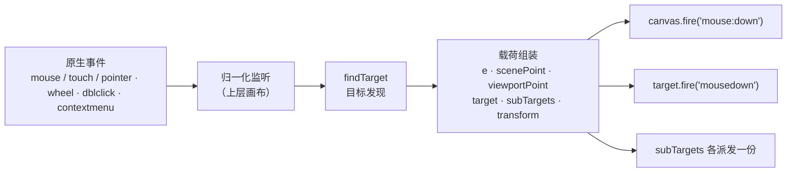

import { Canvas, Controls, Meta } from '@storybook/addon-docs/blocks';
import * as Events from './events.stories';

<Meta of={Events} name="Docs" />

# 事件系统

Fabric 的所有交互都走同一套事件机制：画布的上层元素监听原生 mouse / touch / wheel / contextmenu 事件，归一化后先做**目标发现**（findTarget——这次操作落在哪个对象上），再把同一个载荷**双路派发**——画布收到 `mouse:down`，命中的对象收到 `mousedown`（无冒号），分组内层对象也会各收到一份。订阅 API 是统一的 Observable（`on` / `off` / `once` / `fire`），画布和每个 FabricObject 都有。理解了"目标发现 + 双路派发"，任何事件行为都能推出来：事件什么时候发、载荷里有什么、为什么对象级事件没触发。



| 选项 / 属性 | 默认值 | 回查要点 |
| --- | --- | --- |
| `targetFindTolerance` | `0` | 仅逐像素命中时扩大采样半径，不影响包围盒命中 |
| `perPixelTargetFind` | `false` | `true` 按实际像素而非包围盒判定命中（画布级或对象级均可设） |
| `skipTargetFind` | `false` | 不查找目标：事件照发、`target` 恒为空，点击选择失效 |
| `subTargetCheck`（Group） | `false` | 命中分组时收集内层对象到 `subTargets` 并向其派发对象级事件 |
| `evented`（对象） | `true` | `false` 的对象不参与命中、不派发对象级事件 |
| `fireRightClick` / `fireMiddleClick` | `true` | v5 均为 `false`；v7 起默认 `true`，v8 将移除开关 |
| `stopContextMenu` | `true` | v5 为 `false`；阻止浏览器原生右键菜单（不影响 `contextmenu` 事件） |
| `enablePointerEvents` | `false` | `true` 时改用 PointerEvent 监听，派发的事件名不变 |
| `preserveObjectStacking` | `true` | v5 为 `false`；选中对象保持层级，活动对象可继续被命中 |

## 快速上手

```ts
import { Canvas, Rect } from 'fabric';

const canvas = new Canvas(el, { width: 640, height: 360 });
const rect = new Rect({ left: 40, top: 40, width: 120, height: 90 });
canvas.add(rect);

// 画布级：空白处与对象上都派发；on 返回解绑函数
const dispose = canvas.on('mouse:down', (opt) => {
  opt.scenePoint;      // 场景坐标（Point）
  opt.target?.type;    // 命中对象，空白处为 undefined
});
dispose();             // 解绑；或保存 handler 引用后 canvas.off('mouse:down', handler)

// 对象级：只有命中该对象才派发（事件名无冒号），分组内层 subTarget 同样各有一份
rect.on('mousedown', (opt) => {
  console.log(opt.scenePoint, opt.e);   // 载荷与画布级是同一个对象
});
```

## Observable：on / off / once / fire

`Canvas` 与所有 `FabricObject` 都混入同一个 Observable（经 `CommonMethods`），API 完全一致，只是事件清单的类型不同——画布是 `CanvasEvents`，对象是 `ObjectEvents`。官方不维护集中式事件名列表，IDE 里对 `on` 的自动补全就是权威清单。

| 调用 | 行为 |
| --- | --- |
| `on(name, handler)` | 订阅；**返回 disposer**，调用即解绑该 handler |
| `on({ a: h1, b: h2 })` | 对象形式批量订阅；返回的 disposer 一次解绑这组 |
| `once(name, handler)` | 触发一次后自动解绑；触发前可调用返回的 disposer 取消 |
| `off(name, handler)` | 按引用解绑（内部 `indexOf`）——匿名函数删不掉，要解绑就保存引用 |
| `off(name)` | 清空该事件的**全部**监听（已标 `@deprecated`）：会连 fabric 内部监听一起杀掉，例如 IText 编辑依赖 `mousedown` |
| `off()` | 清空实例上所有监听，同样危险 |
| `fire(name, options?)` | 按注册顺序同步调用监听；`options` 缺省为 `{}`，也可派发自定义事件 |

几个容易踩的语义：

- **没有命名空间机制。** `on('mouse:down.myApp')` 不会被识别成 `mouse:down`——事件名按键原样匹配。要批量解绑就组合 disposer，或保存 handler 引用逐个 `off`。
- **handler 的 `this` 绑定到派发实例**（画布或对象）。需要 `this` 用普通函数；用闭包捕获变量时箭头函数也可以。
- 自定义事件的 TypeScript 类型用模块扩充声明：

```ts
declare module 'fabric' {
  interface CanvasEvents {
    'my:custom': { value: number };
  }
}
canvas.on('my:custom', (opt) => opt.value);  // 有类型提示
```

## 事件族与双路派发

一次指针操作的完整链路：原生事件到达上层画布 → 归一化（`touchstart` / `touchend` 也进入同一条 mouse 管线）→ 组装载荷 → `canvas.fire('mouse:down', options)` 先派发，`target.fire('mousedown', options)` 随后，`subTargets` 里的内层对象再各派发一份。**三路拿到的是同一个 options 对象**，所以对象级事件里也能读到 `scenePoint` 和 `target`。画布级与对象级的对应关系：

| 画布级 | 对象级 | 触发时机 |
| --- | --- | --- |
| `mouse:down` / `mouse:down:before` | `mousedown` / `mousedown:before` | 按下；`:before` 在内部逻辑（选择、建立变换）之前 |
| `mouse:move` / `mouse:move:before` | `mousemove` / `mousemove:before` | 移动 |
| `mouse:up` / `mouse:up:before` | `mouseup` / `mouseup:before` | 抬起；`mouse:up` 附 `isClick` |
| `mouse:over` / `mouse:out` | `mouseover` / `mouseout` | 悬停进出（由 mousemove 对比目标合成） |
| `mouse:wheel` | `mousewheel` | 滚轮 |
| `mouse:dblclick` / `mouse:tripleclick` | `mousedblclick` / `mousetripleclick` | 双击 / 三击（读原生 `e.detail`） |
| `object:moving` `object:scaling` `object:rotating` `object:skewing` `object:resizing` `object:modifyPoly` `object:modifyPath` | 同名（无前缀） | 变换进行中，且位置 / 尺寸真实发生变化的那一帧 |
| `object:modified` | `modified` | 变换结束且实际发生改变（`actionPerformed`） |
| `selection:created` / `selection:updated` / `selection:cleared` / `before:selection:cleared` | `selected` / `deselected` | 活动对象集合变化 |
| `object:added` / `object:removed` | `added` / `removed` | 对象进出画布或分组（见 [3.2 对象管理](?path=/docs/stacking--docs)） |
| `text:changed` `text:selection:changed` `text:editing:entered` `text:editing:exited` | `changed` `editing:entered` `editing:exited` | 文本编辑，全家族见 [2.3.2 交互文本](?path=/docs/itext-textbox--docs) |
| `contextmenu` / `contextmenu:before` | 同名 | 右键（`:before` 先于画布接管） |
| `dragstart` `drag` `dragover` `drop` `drop:before` `drop:after` 等 | 同名 | HTML5 拖放与文本拖拽 |
| `before:render` / `after:render` | `before:render` | 渲染周期（见 [1.3 渲染模型](?path=/docs/rendering-model--docs)） |
| `object:layout:before` / `object:layout:after` | — | 分组布局（见 [3.3 分组与多选](?path=/docs/group-selection--docs)） |

补充事实：

- **`:before` 变体**在 fabric 内部处理之前派发——想抢先干预（改状态、取消选择）用它；此时 `target` 已经可用。
- **`mouse:over` / `mouse:out` 是合成事件**：在 mousemove 上对比上一个目标产生，指针不动就不派发；移出画布时会补发一次 `mouse:out`。载荷带 `previousTarget` / `nextTarget`（以及 shift 多选场景区分"名义目标"与"实际目标"的 `actualTarget` 系列）。
- **触摸归一化**：`touchstart` / `touchend` 走 mouse 管线派发 `mouse:down` / `mouse:up`（是否 `preventDefault` 屏蔽页面滚动由 `allowTouchScrolling` 与命中情况——自由绘制或命中活动对象——决定）；`enablePointerEvents: true` 时原生监听换成 PointerEvent，事件名不变。`pinch` / `rotate` 手势事件类型存在，但核心不派发，需手势扩展支持。
- 框选（空白处拖出的选择框）发生在 mouse 管线内，其行为配置（`selection` / `selectionKey` / `selectionFullyContained`）见 [4.2 拖拽与选择](?path=/docs/drag-select--docs)。

<Canvas of={Events.Interactive} />
<Controls of={Events.Interactive} />

事件记录器把上述断言变成可核对的观察：面板每行标注「画布 / 对象」级别，新事件在上；readout 同步最近一次指针事件的关键字段。

| 读者操作 | 可核对结果 |
| --- | --- |
| 单击矩形 | 派发顺序：`mouse:down:before` → `selected` + `selection:created`（选择在 down 的内部逻辑中完成）→ `mouse:down`（已选:否）→ `mousedown`（对象级）→ `mouse:up`（是点击:是） |
| 再次单击同一矩形 | `mouse:down` 的「已选」变为 是；不再重复 `selection:created` |
| 拖动矩形 | `mouse:up` 变为 是点击:否；期间 `object:moving`（action:drag）与对象级 `moving` 成对出现 |
| 拖角缩放后松手 | `object:scaling` 连发，结束时 `object:modified` + 对象级 `modified`（action 各自对应） |
| 悬停划过对象 | `mouse:over` / `mouse:out` 与对象级 `mouseover` / `mouseout` 成对出现，detail 显示前后目标 |
| 点击空白处 | `target` 为 —，没有任何对象级条目 |
| 点击分组内部（三角或内块） | subTargets 读数变为命中的内层对象（如「三角」），分组与该内层对象**各有一条**对象级 `mousedown` |
| 关闭「分组子目标检查」再点分组 | subTargets 变 —，只剩分组自己收到对象级事件 |
| 滚轮 | `mouse:wheel` 带 ΔY 与 scenePoint |
| 双击 / 三击 | `mouse:dblclick` / `mouse:tripleclick`（对象侧 `mousedblclick` / `mousetripleclick`） |
| 右键 | `contextmenu`（button=2）与 `mouse:down` / `mouse:up` 同时出现；关闭「触发右键事件」后 `mouse:down` / `mouse:up` 消失（`mouse:down:before` 仍会派发），`contextmenu` 仍在 |
| 打开 Show code | 看到该 Canvas 实际执行的 example.ts |

## 事件对象字段

指针族（`mouse:*` 与对象级同名事件）的载荷类型是 `TPointerEventInfo`：

| 字段 | 含义 |
| --- | --- |
| `e` | 原生事件：`MouseEvent` / `TouchEvent` / `PointerEvent`（wheel 为 `WheelEvent`） |
| `scenePoint` | **场景平面**坐标（`Point`）：对象 `left` / `top` 所在平面，等于 `canvas.getScenePoint(e)` |
| `viewportPoint` | **视口平面**坐标（`Point`）：观察者视角、随画布缩放平移不变，等于 `canvas.getViewportPoint(e)` |
| `target` | 命中的对象；空白处、`skipTargetFind` 时为 `undefined` |
| `subTargets` | 命中分组时收集的内层对象链（由 `subTargetCheck` 开启，由内向外排列） |
| `transform` | 进行中的变换（`Transform`），无变换为 `null` |
| `alreadySelected` | 仅 `mouse:down`：按下时目标是否已是活动对象 |
| `isClick` | 随 `mouse:up` 派发：本次按下到抬起之间没有移动过则为 `true` |
| `previousTarget` / `nextTarget` | 仅 `mouse:over` / `mouse:out`：悬停切换的另一端 |

两个坐标的关系：`viewportTransform` 为单位阵时两者数值相等（记录器初始就是这样）；一旦平移 / 缩放画布就分化——scenePoint 跟着场景内容走，viewportPoint 跟着屏幕走。平面语义与换算入口见 [3.4 视口与坐标](?path=/docs/viewport--docs)。非事件时刻要用坐标就调 `canvas.getScenePoint(e)` / `getViewportPoint(e)`。

**变换族的载荷不同**：`object:moving` / `object:scaling` / `object:rotating` 等派发的是 `{ e, transform, pointer }`（对象级），画布级多一个 `target`。`pointer` 是驱动变换的场景坐标点（对象在分组内时为分组平面坐标），没有 `scenePoint` / `viewportPoint`——需要时用 `e` 调 `getScenePoint`。`transform` 是变换全量状态（`target` / `action` / `corner` / `lastX` / `lastY` / `original` 快照等），控件交互的细节见 [4.3 变换控件](?path=/docs/controls--docs)。`object:modified` / `modified` 载荷 `{ e?, target, transform?, action }`，只在真正发生过改变时派发。

**选择族载荷**：`selection:created` 带 `{ selected }`，`selection:updated` 带 `{ selected, deselected }`，`selection:cleared` 带 `{ deselected }`；对象级 `selected` / `deselected` 带 `{ e?, target }`。

v5 迁移对照（载荷字段在 v6 / v7 两次变更后定型）：

| v5 写法 | 7.4.0 现状 |
| --- | --- |
| `options.pointer` / `options.absolutePointer` | 已删除——改名 `viewportPoint` / `scenePoint`（v7 起载荷里只有这两个坐标字段） |
| `options.button`（1/2/3） | 已删除——读原生 `e.button`（0 左键、1 中键、2 右键） |
| `canvas.getPointer(e, ignoreZoom)` | 已删除——用 `getScenePoint(e)` / `getViewportPoint(e)` |
| `e.offsetX` / `e.offsetY`（旧教程常用） | 原生字段仍在，但相对上层画布元素、**触摸事件上不存在**——统一改用 `scenePoint` / `viewportPoint` |

## 目标发现

`findTarget` 决定"这次操作算谁的"，链路如下：

1. **事件期内缓存**：同一次事件处理中多次调用返回同一结果（v7.0 起）。
2. `skipTargetFind: true` 直接返回空——事件照发但 `target` 恒为 `undefined`，点击选择失效，已有选择在下一次点击时被清除。
3. 用场景点**自顶向下**遍历 `_objects`（数组尾部优先）：对象需 `visible` 且 `evented`，命中判定是**旋转后的包围四边形加 `padding`**——不是实际形状。
4. `perPixelTargetFind`（画布级或对象级）开启时，包围盒命中后再做像素检测：把对象渲染到探测画布上取该点像素，透明则放行、继续找下层对象。
5. `targetFindTolerance` 只在第 4 步生效：扩大像素采样的邻域半径（`t` 像素容差采样 `(2t+1)²` 邻域），默认 `0`；**不开逐像素命中时调它没有任何效果**。
6. 命中分组且 `subTargetCheck: true`（默认 `false`）时递归收集 `subTargets`；`interactive: true`（默认 `false`）的分组进一步让内层对象直接成为 `target`（可单独选中的分组，见 [3.3 分组与多选](?path=/docs/group-selection--docs)）。
7. **活动对象优先**：指针落在活动对象的控件上时 `target` 就是它；`preserveObjectStacking: true`（v7 默认）时活动对象即使被其他对象盖住也保持可命中，`altSelectionKey`（默认未启用）可在重叠时强制选当前活动对象。

在记录器里核对：开「逐像素命中」后点圆的四个角（包围盒内、圆外）——target 变 —；再把「目标发现容差」调到 8——圆边缘外几像素又能命中（像素邻域扩大）。开「跳过目标发现」——target 恒为 —，且已选对象在首次点击时出现 `selection:cleared`。

## 右键、中键与 contextmenu

v7 的默认行为与 v5 相反：`fireRightClick` / `fireMiddleClick` / `stopContextMenu` 全部默认 `true`——右键和中键也会派发 `mouse:down` / `mouse:up`，浏览器原生右键菜单默认被阻止。注意 `mouse:down:before` 不受这两个开关控制，非左键也会派发。三个开关都已标记 deprecated（v8 删除，行为固定为开启），兼容写法是在 handler 里自己守卫：

```ts
canvas.on('mouse:down', (opt) => {
  if (opt.e.button !== 0) return;   // 0 左键；只处理左键，兼容所有版本
  // ...
});
```

`contextmenu` / `contextmenu:before` 独立于 mouse 管线派发（`target` 与 `subTargets` 也会收到对象级同名事件），不受 `fireRightClick` 影响；`stopContextMenu` 只控制是否 `preventDefault` 原生菜单，事件总是派发。

## 最佳实践

- **订阅即管理**：组件卸载时调用 disposer（或按引用 `off`）。永远不要 `off(name)` 裸清——fabric 内部逻辑也挂在这些事件上（IText 编辑、选择处理都会被破坏）。
- **高频事件保持轻**：`mouse:move` / `object:moving` 每帧可达数十次，handler 里只做状态记录；重绘交给 `requestRenderAll`（已自动合并，见 [1.3 渲染模型](?path=/docs/rendering-model--docs)）。
- **自己的代码触发的动作直接调函数**，不要监听自己 `fire` 的事件再绕回来——事件留给"你无法直接触达的代码"发出的变化（官方指南的定位建议）。
- **约束变换别靠事件**：`object:scaling` 等事件在改变发生后才派发，事后修正会闪动。等比 / 居中用 `uniformScaling` / `centeredScaling`，锁定用 `lock*` 系列，自定义约束进控件 handler（见 [4.4 自定义控件](?path=/docs/custom-controls--docs)）。
- **判定按钮用 `e.button`**，不依赖 `fireRightClick` 等开关——v8 后开关消失，守卫写法不变。

## 常见问题

- handler 里读 `e.offsetX` 坐标时对不上，触摸设备上直接是 undefined
  `offsetX` / `offsetY` 是原生字段，相对上层画布且触摸事件没有。统一改用载荷里的 `viewportPoint`（屏幕语义）或 `scenePoint`（场景语义）。
- 从 v5 迁移：`options.pointer` / `getPointer` 找不到了，右键行为也变了
  v6 把 `pointer` / `absolutePointer` 改名 `viewportPoint` / `scenePoint`（v7 删除旧名），`getPointer` 拆成 `getScenePoint` / `getViewportPoint`；`fireRightClick` / `fireMiddleClick` / `stopContextMenu` 默认值在 v7 从 `false` 翻成 `true`，右键会进 `mouse:down`。按上文字段表替换即可。
- `off('mouse:down')` 之后 IText 双击编辑失灵、选择行为异常
  裸 `off(name)` 清空了 fabric 注册在同一事件上的内部监听。改为按引用解绑，或用 `on` 返回的 disposer。
- 悬停在对象上不动，`mouse:over` 只触发一次；换对象有时不触发
  over / out 是 mousemove 上对比目标合成的"边沿事件"：不动不派发是设计行为；快速划过时中间对象可能只留下一次切换。
- 点击空白处对象级事件没触发，`target` 是 undefined
  正常——目标发现没命中任何对象时只派发画布级事件。若点击对象也无 target，依次检查：对象 `evented` 是否为 `false`、是否开了 `skipTargetFind`、是否开了 `perPixelTargetFind` 且点在透明像素上。
- `object:moving` 的载荷里读不到 `scenePoint`
  变换族载荷是 `{ e, transform, pointer }`（无坐标双字段）。要场景 / 视口坐标用 `pointer`，或用 `e` 调 `canvas.getScenePoint(e)`。

## 总结回顾

摘要：

Fabric 用同一个 Observable（`on` / `off` / `once` / `fire`）承载画布与对象的全部事件：`on` 返回 disposer，`off` 按引用解绑，没有命名空间，裸 `off(name)` 会误伤内部监听。交互事件由上层画布归一化原生输入后，经 findTarget 找到目标，再把同一载荷双路（画布 `mouse:*`、对象 `mouse*`，subTargets 各一份）派发；`:before` 变体在内部逻辑之前，over / out 由 mousemove 合成，触摸走同一管线。指针族载荷 `TPointerEventInfo`（e / scenePoint / viewportPoint / target / subTargets / transform，down 附 alreadySelected、up 附 isClick）；变换族是 `{ e, transform, pointer }`，modified 只在真实改变后派发。目标发现按"包围四边形 + padding"命中，`perPixelTargetFind` 收紧到实际像素、`targetFindTolerance` 只扩大其采样邻域，`skipTargetFind` 跳过查找，`subTargetCheck` 收集分组内层。右 / 中键事件与 contextmenu 由三个 v7 起默认全开的开关控制（v8 移除），判定按钮统一读 `e.button`。

一句话：

> 事件先"找目标"再"双路派发"——画布收 `mouse:down`、对象收 `mousedown`，两边载荷相同；坐标读 `scenePoint` / `viewportPoint`，目标有没有、是谁，全部由 findTarget 的那套开关决定。

知识要点：

- `on` 的返回值是什么？`once` 触发前能取消吗？匿名 handler 为什么 `off` 不掉？
- 为什么不能 `off('mouse:down')` 裸清？fabric 有命名空间式的批量解绑吗？
- 同一次点击，画布级与对象级事件的派发顺序是怎样的？subTargets 会不会收到对象级事件？
- `mouse:down:before` 与 `mouse:down` 的区别是什么？
- `TPointerEventInfo` 有哪些字段？`alreadySelected` 与 `isClick` 各出现在哪个事件上？
- `scenePoint` 与 `viewportPoint` 什么时候相等？画布平移缩放后各怎么变？
- `object:moving` 族载荷与指针族差在哪？需要场景坐标时怎么办？
- v5 的 `pointer` / `absolutePointer` / `getPointer` / `button` 各对应 7.4.0 的什么？
- `perPixelTargetFind` / `targetFindTolerance` / `skipTargetFind` / `subTargetCheck` 各改变命中链路的哪一步？容差在什么前提下才生效？
- 右键点击在 v7 默认配置下会派发哪些事件？`fireRightClick` 关闭后哪些仍在？
- `mouse:over` / `mouse:out` 为什么指针不动就不触发？它们是怎么合成的？

## 参考资料

- [Working with events（官方事件指南）](https://fabricjs.com/docs/events/)
- [Canvas API（事件派发、findTarget、目标发现选项）](https://fabricjs.com/api/classes/canvas/)
- [Observable API（on / off / once / fire）](https://fabricjs.com/api/classes/observable/)
- [Upgrading to Fabric.js 7.0（载荷字段与右键默认值变更）](https://fabricjs.com/docs/upgrading/upgrading-to-fabric-70/)
- [v6 破坏性变更清单（issue #8299：pointer 改名、getPointer 拆分）](https://github.com/fabricjs/fabric.js/issues/8299)
- [Events inspector（官方事件检查器演示）](https://fabricjs.com/demos/events-inspector)
