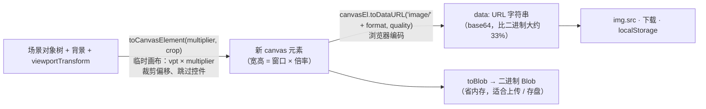

import { Canvas, Controls, Meta } from '@storybook/addon-docs/blocks';
import * as Export from './export.stories';

<Meta of={Export} name="Docs" />

# 图片导出

Fabric.js 的图片导出不是"截屏"，而是**在一块临时 canvas 上按当前视口重渲染一帧，再交给浏览器编码**：`toDataURL` 先用 `toCanvasElement` 造一块新画布——当前的 `viewportTransform`（缩放、平移）原样生效、`multiplier` 乘上去、裁剪窗口偏移过去、控件被跳过——然后对这块画布调用浏览器原生的 `canvasEl.toDataURL('image/' + format, quality)` 得到 data: URL。这个模型能预测所有导出行为：**"所见"进导出**（视口状态、滤镜后的图片、clipPath、裁剪窗口），**"编辑态"不进**（控件、选中框）；**清晰度是尺寸问题**（`multiplier` 与 retina 倍率相乘），**体积是编码问题**（`format` 与 `quality`）。两件最容易误判的事先立住：画布实例的 `enableRetinaScaling` 默认 `true`（屏幕高清）但**导出选项的同名参数默认 `false`**（不乘 dpr）——屏幕清晰不等于导出清晰；jpeg 没有透明通道，画布级导出时**透明区域被浏览器合成到纯黑**。本课只覆盖位图通道；JSON 结构数据见[序列化](?path=/docs/serialization--docs)，矢量 SVG 通道（`toSVG` / `loadSVGFromString`）由 [SVG 互操作](?path=/docs/svg--docs)展开。



| 选项（默认值） | 级别 | 回查要点 |
| --- | --- | --- |
| format（`'png'`） | 两者 | `'png'` 无损带透明；`'jpeg'` 有损无透明；`'webp'` 看浏览器，不支持时**静默回退 png** |
| quality（`1`） | 两者 | 0–1，**只对 jpeg / webp 这类有损格式有效**；png 忽略 |
| multiplier（`1`） | 两者 | 尺寸放大系数，与 retina 倍率**相乘**；内存按平方增长 |
| enableRetinaScaling（`false`） | 两者 | `true` 时额外乘 devicePixelRatio；与画布实例的同名属性（默认 `true`）是两回事 |
| left / top / width / height（不裁） | 两者 | 裁剪窗口，**视口（屏幕）像素**；输出尺寸 = 窗口 × multiplier |
| filter（—） | 画布级 | 导出时挑选**顶层对象**的函数；不管 backgroundColor / backgroundImage / overlay |
| withoutTransform / withoutShadow（`false`） | 对象级 | 导出前临时剥掉对象自身变换 / 阴影 |
| viewportTransform（`false`） | 对象级 | `true` 时对象按当前视口的位置与缩放落图 |

TS 注意：画布级 `toDataURL(options)` / `toBlob(options)` 的类型 `TDataUrlOptions` 里 `multiplier` 是**必填**（运行时默认 1）——传了 options 对象就必须带 `multiplier`，不传参数反而合法。

## 快速上手

```ts
import { Canvas, Rect } from 'fabric';

const canvas = new Canvas(el, { width: 640, height: 360 });
canvas.add(new Rect({ left: 40, top: 40, width: 200, height: 120, fill: '#38bdf8' }));

// 1) 基本导出：默认 png、1 倍（类型要求 multiplier 必填）
const png = canvas.toDataURL({ multiplier: 1 });

// 2) 高清 jpeg：倍率放大 + 有损质量
const jpeg = canvas.toDataURL({ multiplier: 2, format: 'jpeg', quality: 0.8 });

// 3) 直接触发下载
const link = document.createElement('a');
link.download = 'scene.jpeg';
link.href = jpeg;
link.click();
```

三点先记住：返回值是 `data:` 字符串，可直接赋给 `.src` 或 `a.href`；jpeg 场景注意背景（透明变黑，见[格式与质量](#格式与质量)）；屏幕高清不等于导出高清（见[倍率 multiplier 与 retina 高清导出](#倍率-multiplier-与-retina-高清导出)）。

## 三个出口：toDataURL、toBlob、toCanvasElement

三个方法共享同一条渲染路径——`toCanvasElement` 是地基，`toDataURL` / `toBlob` 都是先造出这块画布再编码。它们都会**临时把渲染搬到新画布上、完成后把对象与状态复位**，原画布不受影响（官方文档原话："Will transfer object ownership to a new canvas, paint it, and set everything back"）。

| 方法 | 返回 | 产物形态 | 适用 |
| --- | --- | --- | --- |
| `toDataURL(options)` | `string` | data: URL（base64，**比二进制大约 33%**） | 直接预览、小图下载、内嵌 JSON |
| `toBlob(options)` | `Promise<Blob \| null>` | 二进制 Blob | 上传、`URL.createObjectURL`、大图（省内存） |
| `toCanvasElement(multiplier, options)` | `HTMLCanvasElement` | 画布元素 | 继续加工：`drawImage` 到别处、读像素、当 Pattern 源 |

- 画布级签名：`toCanvasElement(multiplier = 1, { left, top, width, height, filter })`——注意 multiplier 是**第一个位置参数**，不像 `toDataURL` 那样放在 options 里。
- 对象级同名方法签名不同：`object.toCanvasElement(options)`——multiplier 在 options 内（见[对象级导出](#对象级导出)）。
- 编码一律走浏览器原生实现，fabric 不自己压缩——`quality` 语义、格式支持与回退都遵循平台规范（MDN）。
- 导出的是**调用瞬间的静态帧**：视频对象导出的是当前帧，官方明确不支持持续录制——需要视频产物时用 `canvas.getElement()` 配 `MediaRecorder` 自行采集（边界见[图片](?path=/docs/image--docs)）。

## 格式与质量

`format` 的类型是 `ImageFormat = 'jpeg' | 'png' | 'webp'`，默认 `'png'`。fabric 把它原样拼给浏览器：`canvasEl.toDataURL('image/' + format, quality)`。

- **png（默认）**：无损、保留透明，`quality` 被忽略。
- **jpeg**：有损、无透明、体积小。`quality`（0–1，默认 1）只在这类有损格式上生效；取值越界时浏览器按自己的默认质量处理。
- **webp**：有损或无损、支持透明，通常体积最小。浏览器支持不保证——**不支持时静默回退 png**（返回串前缀仍是 `data:image/png`），检测方法：

```ts
const url = canvas.toDataURL({ multiplier: 1, format: 'webp' });
const supportsWebp = url.startsWith('data:image/webp');
```

**jpeg 透明变黑的机制**：JPEG 格式没有 alpha 通道。HTML 规范要求，序列化到不支持透明的格式时，位图必须用 source-over 算子**合成到纯黑背景**上。画布级导出不会替你铺底——`backgroundColor` 未设置时的空白区、半透明对象下方的区域，在 jpeg 里全部变黑。**对象级是例外**：对象级 `toCanvasElement` 检测到 `format === 'jpeg'` 会自动给临时画布设 `backgroundColor = '#fff'`（白底，7.4.0 源码）。

| 对策 | 写法 | 适用 |
| --- | --- | --- |
| 持久背景 | `canvas.backgroundColor = '#fff'` | 本来就该有底色的场景 |
| 临时铺底 | 导出前设 `backgroundColor`，导完还原 | 画布要保持透明显示 |
| 换格式 | `format: 'png'` 或 `'webp'` | 需要透明时别用 jpeg |

## 倍率 multiplier 与 retina 高清导出

`multiplier` 是所有尺寸的统一放大系数：输出画布宽高 = 逻辑尺寸（或裁剪窗口）× multiplier，对象、文字、描边随 vpt 一起放大重渲染，**不是把 1 倍图拉伸**——放大后的文字和线条仍然锐利。

retina 的组合公式（7.4.0 源码）：

```text
finalMultiplier = multiplier × (enableRetinaScaling ? getRetinaScaling() : 1)
// getRetinaScaling() = max(devicePixelRatio, 1)
```

关键在两个同名开关的默认值不同：

- **画布实例** `enableRetinaScaling` 默认 `true`——屏幕显示时 backstore 已经是逻辑尺寸 × dpr（机制见[渲染模型](?path=/docs/rendering-model--docs)）；
- **导出选项** `enableRetinaScaling` 默认 `false`——导出默认按**逻辑像素**出图。

所以高清屏上"屏幕清楚、导出发糊"是默认行为。前两个写法等价，第三个演示叠加：

```ts
canvas.toDataURL({ multiplier: window.devicePixelRatio });      // 手动乘
canvas.toDataURL({ multiplier: 1, enableRetinaScaling: true }); // 交给 fabric 乘
canvas.toDataURL({ multiplier: 2, enableRetinaScaling: true }); // 2 × dpr，相乘叠加
```

内存按**倍率平方**增长：导出画布的 RGBA 缓冲 ≈ 宽 × 高 × 4 字节，4000 × 3000 就是约 45.8 MB，dataURL 字符串还要再膨胀约 33%。大图导出用 `toBlob` 避免巨大的中间字符串；倍率拉满前先算目标尺寸——浏览器对画布的单边与总面积有上限（Safari 尤其紧），超限的导出结果是空白或直接失败。

## 裁剪窗口

`left / top / width / height` 四个参数切一块矩形窗口，不传就是整块画布。两个坐标系事实（7.4.0 源码实证）：

- **窗口是视口（屏幕）像素**，不是场景坐标：实现上是从当前 vpt 的平移分量里减去 `left / top`——zoom 之后同一组数值裁到的场景内容会变，但始终是"屏幕上这块区域"。
- **输出尺寸 = 窗口 × multiplier**：官方 JSDoc 原话 "when multiplier is used, cropping is scaled appropriately"——裁剪和放大不需要自己换算。

```ts
// 只导出画布中心 320×180 的窗口，2 倍出图 → 640×360
canvas.toDataURL({
  multiplier: 2,
  left: 160,
  top: 90,
  width: 320,
  height: 180,
});
```

要按**场景坐标**裁剪（无视口缩放），先把窗口换算成视口像素（乘当前 zoom），或导出前临时重置视口——见下一节。

## 导出的是所见：视口、控件与内容筛选

"导出的内容到底由什么决定"可以拆成三问：观察方式（viewportTransform 怎么参与）、编辑器叠加物（控件为什么不在图里）、场景成员（哪些对象与背景进图）。三者的共同答案都是上一段的渲染模型——导出走 `renderCanvas`，所以一切"渲染时生效"的东西都进图，一切"只存在于编辑器交互层"的东西都不进。

### viewportTransform 参与导出

画布级导出把当前 vpt 的**缩放与平移原样带进去**：`newVp = [zoom × multiplier, 0, 0, zoom × multiplier, (pan.x - left) × multiplier, (pan.y - top) × multiplier]`（7.4.0 源码）。推论：

- **所见即所得**：放大 2 倍后导出，图里就是放大后的内容；平移后导出，图里就是平移后的视野。
- **输出尺寸不变**：vpt 的 zoom 不改变导出画布大小（仍按逻辑尺寸 / 裁剪窗口 × multiplier），改的是"多少场景被装进这张图"。
- **vpt 的旋转分量不进导出**：`newVp` 只保留缩放量级（`getZoom()` 取 X 基向量长度）与平移——用旋转过的 vpt 观看时，导出与屏幕所见会有差异。
- **想要"无视口的全场景"**：导出前 `setViewportTransform([1, 0, 0, 1, 0, 0])`，导完恢复；或按场景包围盒换算裁剪窗口。vpt 的操作细节见[视口与坐标](?path=/docs/viewport--docs)。

### 控件与选中态永不导出

`toCanvasElement` 渲染前把画布的 `skipControlsDrawing` 临时置 `true`、导完复位——.d.ts 里对这个内部标志的说明就是 "used to avoid toDataURL to export controls"。所以选中框、角落手柄、旋转柄、边框都不会出现在导出图里，无论对象是否处于选中态。控件本来就是画在对象层之上的编辑器 UI（见[变换控件](?path=/docs/controls--docs)）。对象级导出更简单：对象被渲染到一块没有控件层的 `StaticCanvas` 上。

### 内容筛选：filter 选项与 excludeFromExport

- **`filter`（画布级选项）**：一个 `(object) => boolean` 函数，导出时只保留返回 true 的**顶层对象**（实现是 `this._objects.filter(...)`）。它不管 backgroundColor / backgroundImage / overlayImage——想连背景一起去掉只能导出前临时清空。
- **`excludeFromExport` 不挡 toDataURL**：那是 `toObject` / `toSVG` 的导出开关，图片导出走渲染路径，被排除的对象照常出现在图里（见[序列化](?path=/docs/serialization--docs)）。
- **滤镜必然进导出**：导出即渲染，图片对象画的是滤镜后的副本（机制见[滤镜](?path=/docs/filters--docs)）。7.4.0 **没有** `withoutFilters` 之类的选项——别把"导出带滤镜"和"导出挑对象"（`filter` 函数）混为一谈。想导未滤镜的原图，用 `img.getSrc()` 拿原始地址。
- **clipPath 进导出**：图片导出走 `renderCanvas`，对象级与画布级裁剪效果都包含在位图里（见[裁剪与遮罩](?path=/docs/clip-path--docs)）。
- **跨域图片**：污染画布上 `toDataURL` / `toBlob` 直接抛 `SecurityError`——加载时带 `crossOrigin: 'anonymous'`，排查细节见[图片](?path=/docs/image--docs)。

## 对象级导出

每个对象也有 `toDataURL(options)` / `toBlob(options)` / `toCanvasElement(options)`，还有衍生方法 `cloneAsImage(options)`。机制（7.4.0 源码 + stub 实证）：

1. 算出对象**包围盒**（含描边外扩），再按阴影的偏移与模糊向外**加 padding**；
2. 造一块 `StaticCanvas`（`enableRetinaScaling: false`、`renderOnAddRemove: false`、`skipOffscreen: false`），尺寸取上一步的盒；
3. 把对象**临时挂到这块画布上**、居中放置，按 `multiplier × (enableRetinaScaling ? dpr : 1)` 调画布级导出渲染；
4. 渲染完把对象挂回原画布、还原变换与阴影，返回画布元素（或继续编码成 dataURL）。

对象级特有选项（`ObjectToCanvasElementOptions`，7.4.0 .d.ts）：

| 选项 | 作用 |
| --- | --- |
| withoutTransform | 导出前临时重置对象自身变换——不带缩放 / 角度 / 翻转 / 倾斜的"原始形状" |
| withoutShadow | 导出前临时摘掉阴影（注意：不传时阴影不仅显示，还**撑大导出尺寸**） |
| viewportTransform | `true` 时把对象按当前 vpt 映射后落图——默认忽略视口，对象永远居中完整呈现 |
| canvasProvider | 自定义承载导出的画布工厂（测试 / node 场景用） |

与画布级的核心差异：

| | 画布级 | 对象级 |
| --- | --- | --- |
| 尺寸来源 | 逻辑尺寸或裁剪窗口 × multiplier | 对象包围盒 + 阴影外扩 × multiplier |
| vpt | 默认参与（所见即所得） | 默认忽略（无视口完整呈现） |
| 裁剪坐标 | 视口像素 | 对象导出画布自身的坐标（原点在导出画布左上，含阴影外扩） |
| jpeg 底色 | 不铺——透明变黑 | **自动白底** |
| filter 选项 | 挑选顶层对象 | 无意义（画布上只有它自己） |
| 签名 | `toCanvasElement(multiplier, options)` | `toCanvasElement(options)` |

```ts
const rect = canvas.getObjects()[0];

// 单对象高清导出（TS 下对象级 multiplier 可省）
const url = rect.toDataURL({ format: 'png', multiplier: 3 });

// 快照变对象：把任意对象（组、渐变+阴影的复合体）固化成一张 FabricImage
const snapshot = rect.cloneAsImage({ multiplier: 2 });
canvas.add(snapshot); // 这之后它就是普通图片对象
```

`cloneAsImage` 内部就是 `new FabricImage(this.toCanvasElement(options))`——官方 JSDoc 提醒：只要 canvas 元素够用就优先 `toCanvasElement`（更快、无损），需要真正的 jpeg / png 文件才走 `toDataURL`。Group 与多选（ActiveSelection）走同一条路，导出的是整体的合并包围盒。图片对象的日常操作见[图片](?path=/docs/image--docs)。

## 位图还是矢量：toDataURL 与 toSVG 取舍

`toSVG()` 是另一条导出通道，产出矢量标记而不是像素（`loadSVGFromString` / `loadSVGFromURL` 负责反向导入，见 [SVG 互操作](?path=/docs/svg--docs)）：

| | `toDataURL` 位图 | `toSVG` 矢量 |
| --- | --- | --- |
| 保真 | 所见即所得：滤镜、混合模式、复杂效果全保留 | 结构保留：文字仍是文字、路径仍是路径，部分效果有损转换 |
| 缩放 | 固定分辨率，放大即糊 | 无限缩放，适合打印 |
| 再编辑 | 只能当图片处理 | 可再解析回对象树（配序列化或 SVG 导入） |
| 体积 | 取决于像素量与 quality | 取决于对象复杂度；含大量文字 / 路径时通常更小 |

经验取舍：给浏览器预览、社交分享、含滤镜的成品图用位图；给打印、二次编辑、无限缩放的场景用 SVG；两者都出自同一场景时，序列化（JSON）才是结构数据的正主（见[序列化](?path=/docs/serialization--docs)）。

## 导出实验台

同一块透明背景的场景（渐变阴影块、圆、文字、半透明块），组合全部导出参数，导出结果直接渲染在画布下方（棋盘格代表透明像素），读数给出尺寸、实际格式、dataURL 长度、耗时与内存估算：

<Canvas of={Export.ExportLab} />
<Controls of={Export.ExportLab} />

| 读者操作 | 可核对结果 |
| --- | --- |
| 切「导出格式 format」到 jpeg | 预览的空白区变黑（画布级不铺底）；切回 png 恢复棋盘格透明 |
| jpeg 档下调「质量 quality」 | 读数「dataURL 长度」明显下降；png 档下几乎不动（quality 被忽略） |
| 调「倍率 multiplier」 | 「导出尺寸」「缓冲内存」同步上涨——内存随倍率平方增长 |
| 开「retina 高清导出」 | 「倍率构成」变为 multiplier × retina dpr，导出尺寸乘上 dpr |
| 切「裁剪窗口」 | 预览内容与「导出尺寸」变化（窗口 × multiplier） |
| 拖「视口缩放 zoom」 | 画布显示与导出预览**同步**缩放，「导出尺寸」不变——vpt 参与导出 |
| 点选对象后切「导出目标」为选中对象 | 「导出尺寸」变成对象包围盒（渐变块的阴影会撑大它）；jpeg 档底色是**白色**；预览中没有控件 |
| 保持选中态导出（画布档或对象档） | 屏幕上的手柄、边框不出现在预览里——控件永不导出 |
| 切「导出格式 format」到 webp | Chrome / Edge：「实际格式」为 image/webp 且体积最小；Safari：「实际格式」回退 image/png |
| 拖动画布上的对象 | 预览联动重新导出 |
| 打开 Show code | 看到该 Canvas 实际执行的 `example.ts` |

## 最佳实践

- 高清导出封装成一个函数：按"目标物理尺寸 ÷ 当前逻辑尺寸"算 multiplier，或统一 `enableRetinaScaling: true` 跟随设备——别在调用点散落魔法数字。
- jpeg 导出前回答"背景是什么"：要底色就设 `backgroundColor`，要透明就换 png / webp，不要接受默认的黑。
- 上传与存盘走 `toBlob`：dataURL 的 base64 膨胀约 33%，大图时这层浪费最直观。
- 批量导出前固定视口状态：先 `setViewportTransform` 到已知值（或显式裁剪窗口），避免"所见即所得"把用户的临时缩放平移带进产物。
- 大倍率先算账：目标宽 × 高 × 4 就是 RGBA 缓冲下限，再乘 4/3 估 dataURL 体积；接近浏览器画布上限就分块或降倍率。
- 只要画布元素不要编码时，直接用 `toCanvasElement`——省掉整次 base64 编码。

## 常见问题

- `canvas.toDataURL({ format: 'jpeg' })` 在 TypeScript 里报 `Property 'multiplier' is missing`
  7.4.0 的 `TDataUrlOptions` 把 `multiplier` 声明为必填（运行时其实默认 1），且只影响画布级的 `toDataURL` / `toBlob`。显式写 `multiplier: 1`，或干脆不传参数（`toDataURL()` 合法）。
- 高清屏上画布很清楚，导出的图片发糊
  画布实例的 `enableRetinaScaling`（默认 true）只管屏幕显示；导出选项的同名参数默认 false，导出按逻辑像素出图。`multiplier: window.devicePixelRatio` 或 `enableRetinaScaling: true`。
- 导出的 webp 怎么确认浏览器真的支持
  看返回串前缀：`data:image/webp` 才是编码成功；`data:image/png` 说明不支持、已静默回退。不要只看体积判断。
- 缩放 / 平移之后导出的内容不对，或想要完整场景
  vpt 默认参与导出——导出的是当前视野。导出前 `setViewportTransform([1, 0, 0, 1, 0, 0])` 重置视口，导完恢复原矩阵。
- 导出时抛 `SecurityError: Tainted canvases may not be exported`
  画布上有没有带 `crossOrigin` 的跨域图片。加载时加 `crossOrigin: 'anonymous'`（服务器须返回 CORS 头），排查步骤见[图片](?path=/docs/image--docs)。
- 大倍率导出得到空白图或直接失败
  超出浏览器画布尺寸 / 面积上限，或内存不足。按 宽 × 高 × 4 估算缓冲，降 multiplier、改用 `toBlob`，或按裁剪窗口分块导出再拼。
- `filter` 传了函数，背景色 / 背景图还是被导出了
  `filter` 只作用于顶层 `_objects`，不碰 backgroundColor / backgroundImage / overlayImage。要干净的场景截图就导出前临时清空背景，导完还原。

## 总结回顾

摘要：

`toDataURL` / `toBlob` / `toCanvasElement` 共享一条渲染路径：临时画布按当前 vpt × multiplier 重渲染一帧（裁剪窗口按视口像素偏移、`skipControlsDrawing` 跳过控件），再交浏览器按 `image/格式` 编码——所以导出的是"所见"，滤镜、clipPath、裁剪窗口都在，控件与选中态永不在。尺寸与清晰度由 `multiplier`（可与 `enableRetinaScaling` 的 dpr 相乘，导出选项默认 false 与画布实例默认 true 是两回事）决定，内存随倍率平方增长；体积由 `format`（png 默认无损透明、jpeg 有损且透明被规范合成到纯黑、webp 看支持并静默回退 png）与只对有损格式生效的 `quality` 决定。对象级导出把单个对象按包围盒加阴影外扩居中渲染到一块 StaticCanvas 上，jpeg 自动铺白底，另有 withoutTransform / withoutShadow / viewportTransform 三个特有选项与 `cloneAsImage` 快照；vpt 默认参与画布级导出但被对象级忽略。位图与 `toSVG` 矢量通道按"保真缩放换结构"取舍，结构数据的正主是 JSON 序列化。

一句话：

> 导出图片 = 在临时画布上按当前视口 × multiplier 重渲染一帧再交浏览器编码——所见进图、控件不进，清晰度靠倍率，体积靠格式与质量。

知识要点：

- `toDataURL` / `toBlob` / `toCanvasElement` 三个出口各返回什么、共享哪条渲染路径？
- format / quality / multiplier / enableRetinaScaling / 裁剪窗口 / filter 六类选项的默认值与作用范围（画布级 / 对象级 / 两者）？
- 为什么屏幕高清而导出发糊？两个 `enableRetinaScaling` 的默认值分别是什么？
- 裁剪窗口用什么坐标系的像素？输出尺寸怎么算？
- vpt 的哪些分量参与画布级导出？想要"无视口全场景"怎么做？
- 控件为什么永远不会出现在导出图里？
- jpeg 透明变黑的规范机制是什么？对象级为什么是白底？三种对策？
- 对象级导出的尺寸怎么算？withoutTransform / withoutShadow / viewportTransform 各改变什么？
- `cloneAsImage` 与 `toCanvasElement` 的关系？什么时候不必走 toDataURL？
- webp 不支持时的行为是什么？怎么检测？
- `excludeFromExport` 和 `filter` 分别影响不影响 toDataURL？

## 参考资料

- [官方 API：StaticCanvas（toDataURL / toBlob / toCanvasElement / skipControlsDrawing / enableRetinaScaling）](https://fabricjs.com/api/classes/staticcanvas/)
- [官方 API：FabricObject（toDataURL / toCanvasElement / cloneAsImage / ObjectToCanvasElementOptions）](https://fabricjs.com/api/classes/fabricobject/)
- [MDN：HTMLCanvasElement.toDataURL（quality 仅对有损格式生效、不支持格式回退 png）](https://developer.mozilla.org/en-US/docs/Web/API/HTMLCanvasElement/toDataURL)
- [WHATWG HTML Standard（canvas 序列化：无 alpha 通道的格式合成到纯黑背景）](https://html.spec.whatwg.org/multipage/canvas.html)
- [官方 jsfiddle：toDataURL 裁剪与倍率 demo](https://jsfiddle.net/xsjua1rd/)
