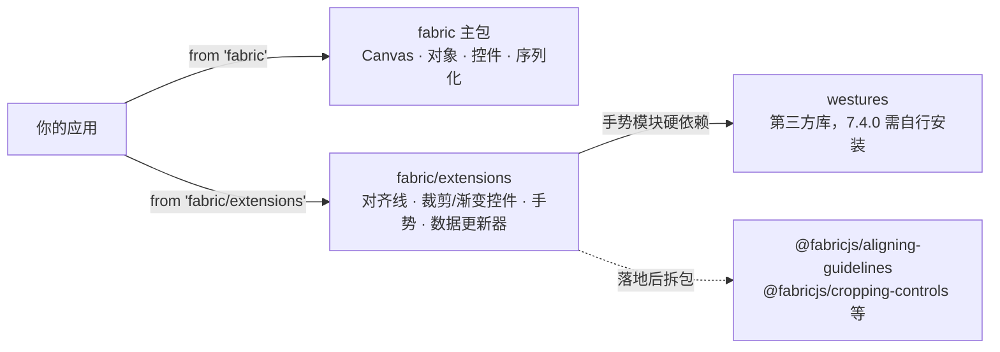

import { Canvas, Controls, Meta } from '@storybook/addon-docs/blocks';
import * as Extensions from './extensions.stories';

<Meta of={Extensions} name="Docs" />

# 扩展包

扩展包（extensions）是官方维护、但**不进 fabric 主包**的能力集合：对齐参考线、图片裁剪控件、渐变调整控件、触摸手势、跨版本数据更新器。它们的共同定位是**用你已经学过的公开 API 写好的参考实现**——事件钩子（[事件系统](?path=/docs/events--docs)）、`Control` 控件集（[自定义控件](?path=/docs/custom-controls--docs)）、静态 `fromObject`（[序列化](?path=/docs/serialization--docs)），所以每个扩展的启用方式不是"配置开关"，而是**导入模块 + 按它的形态挂接**。仓库同时已经定案把这些扩展拆成 `@fabricjs/*` 独立小包（npm 上尚未发布），本课最后一节给一页前瞻速查。



`fabric/extensions` 在 7.4.0 的导出面（下表为本工作区安装的 fabric 7.4.0 实际核对结果，共 5 组 14 个导出）：

| 导出 | 组 | 挂接方式 |
| --- | --- | --- |
| `AligningGuidelines` | 对齐参考线 | `new AligningGuidelines(canvas, config?)`，`dispose()` 卸载 |
| `createImageCroppingControls()` | 裁剪 | 整表赋给 `image.controls`（12 键） |
| `createImageResizeControlsWithScaleToCover()` | 裁剪 | `Object.assign` 并入现有控件集（4 键） |
| `enterCropMode` | 裁剪 | `image.once('mouseddblclick', enterCropMode)` |
| `changeCropX` / `changeCropY` / `changeCropWidth` / `changeCropHeight` / `changeWidthAndScaleToCover` / `changeHeightAndScaleToCover` / `withFlip` | 裁剪 | 自组控件时的 `actionHandler` 部件 |
| `createLinearGradientControls(gradient)` | 渐变 | 展开并入对象 `controls` |
| `addGestures` / `pinchEventHandler` / `rotateEventHandler` | 手势 | `addGestures(canvas)` + `canvas.on(...)` 挂 handler |
| `installOriginWrapperUpdater` / `originUpdaterWrapper` | 数据更新 | 模块加载后调用一次 |
| `installGradientUpdater` / `gradientUpdaterWrapper` | 数据更新 | 同上 |

## 快速上手

在你自己的项目里，启用对齐参考线的最小闭环（**第 1 步在 7.4.0 不可省略**，原因见下一节）：

```bash
npm install westures
```

```ts
import { Canvas, Rect } from 'fabric';
import { AligningGuidelines } from 'fabric/extensions';

const canvas = new Canvas(el);
canvas.add(new Rect({ width: 150, height: 110, fill: '#94a3b8' }));

// 挂上就有：拖动 / 缩放任何对象都会出现对齐参考线
const guidelines = new AligningGuidelines(canvas, { margin: 6 });

// 不再需要时卸载（解绑全部事件）
guidelines.dispose();
```

本工作区没有安装 westures，因此本页实例没有导入 `fabric/extensions`——导入该入口会直接失败。「对齐参考线」一节的实例按扩展源码的思路用公开 API 手写了同机制的最小实现，用于观察行为；在你的项目里两行代码就能换回官方版。

## 定位与导入

**扩展是"更多功能、更少 API"的官方答案。** 主包刻意避免继续膨胀（官方 README 原话：features that "have no place in the library itself"），对齐线、利基控件这类高级交互与 UX 相关的能力放进 `extensions/` 目录，合并门槛是单元测试 + 交互流程的 e2e 测试 + 说明用法的 README。所以扩展不是插件系统，就是普通 ES 模块——**没有全局注册、没有启用开关，导入并挂接才算生效**。

四种挂接形态，决定了你拿到手后的第一行代码：

| 形态 | 代表 | 挂接 | 卸载 |
| --- | --- | --- | --- |
| 实例类 | `AligningGuidelines` | `new` 时自己 `canvas.on(...)` 六个事件 | `dispose()` 解绑 |
| Control 集工厂 | 裁剪 / 渐变控件 | 赋给或并入 `object.controls` | 换回原控件集 |
| 全局包装器 | 数据更新器 | 调 `installXxx()` 替换静态 `fromObject` | 无（迁移完直接移除调用） |
| 识别器桥 | `addGestures` | 装手势识别 + `canvas.on` 挂 handler | 自行 `off` handler |

导入入口只有子路径 **`fabric/extensions`** 一个（package.json 的 exports 里与 `.`、`/es`、`/node` 并列，指向 `dist-extensions/index.mjs`），它把 5 组扩展统一 re-export——**没有更细的子路径，"按需引入"的单位是挂接哪个扩展，不是导入哪段代码**。代价在依赖上：westures 手势模块在入口顶层 `import wes from 'westures'`，而 fabric 7.4.0 的 package.json **没有声明任何 dependencies**。结果是你只要 `import ... from 'fabric/extensions'`，哪怕只用对齐线，解析也会失败（本工作区实测：`Cannot find package 'westures' imported from .../dist-extensions/westures_integration/index.mjs`；打包器下是 `Failed to resolve import "westures"`）。先 `npm install westures` 即可解决；仓库 master 的 `@fabricjs/westures-integration` 已把 `westures: ^1.1.1` 声明为正式依赖，拆包落地后这个前置消失。

## 对齐参考线

`AligningGuidelines` 提供编辑器级的对齐吸附：拖动或缩放对象时，自动对齐到其他对象的边与中心，并画红色参考线。它是五组扩展里唯一不需要你做任何接线决策、"挂上就完整可用"的一个。

机制上有四个要点（都来自对 `dist-extensions/aligning_guidelines` 源码的核对），理解它们才能预测行为与调优：

- **事件挂接**：`object:moving` / `object:scaling` / `object:resizing` 计算吸附，`before:render` 清空交互层 `contextTop`、`after:render` 重画参考线，`mouse:up` 清状态。参考线**只存在于交互层**——不进主画布，`toDataURL` 导出也不带它（fabric 的 `renderAll` 仅在 `contextTopDirty` 时清交互层，所以扩展必须自己在 `before:render` 清）。
- **对齐点**：每个对象 4 个角（`getCoords()`）+ 中心（`getCenterPoint()`）；拖动对象的每个点与候选点逐轴比较。
- **候选集**：画布上可见且在屏内的对象；Group 会**递归到子对象**（组容器本身不是候选）；拖动对象自己（多选时含全部成员）被排除。
- **margin**：吸附触发距离，默认 4，比较时按 `margin / zoom` 折算；吸附是把对象**平移到完全对齐**（距离归零），不是贴近。

配置项（构造第二个参数，`Partial<AligningLineConfig>`）：

| 选项 | 默认值 | 含义 |
| --- | --- | --- |
| `margin` | `4` | 距离多少像素内开始吸附 |
| `width` | `1` | 参考线线宽（绘制时按 zoom 除算保持视觉粗细） |
| `color` | `'rgba(255,0,0,0.9)'` | 参考线颜色 |
| `xSize` | `2.4` | 线端 X 标记的大小 |
| `lineDash` | `undefined` | 虚线样式，如 `[2, 2]` |
| `closeVLine` / `closeHLine` | `false` | 关闭竖线 / 横线（只吸附不画线） |

构造后可直接改实例属性，也可以传入替换函数做定制——常用的三个：`getObjectsByTarget`（收窄候选集）、`getPointMap` / `getContraryMap`（自定义控件键的对齐点，配合自定义控件集使用）、`drawLine` / `drawX`（换成自己的画法，比如贝塞尔曲线）。官方 README 的候选集收窄示例（只与兄弟对象对齐）：

```ts
new AligningGuidelines(canvas, {
  getObjectsByTarget(target) {
    const set = new Set<FabricObject>();
    const parent = target.parent ?? target.canvas;
    parent?.getObjects().forEach((o) => set.add(o));
    set.delete(target); // 记得排除自己，否则永远和自己对齐
    return set;
  },
});
```

**代价**：每次 `object:moving` 都要对候选集逐对象、逐点算距离（O(目标点 × 候选点)，另有按变换矩阵的缓存）。对象量大时这是拖动帧率的第一嫌疑人，处理方式就是上面的收窄 `getObjectsByTarget`，或在不需要时 `dispose()`。

下面实例演示这套机制。**实例没有导入 `fabric/extensions`**（工作区缺 westures，导入即失败，见「定位与导入」），而是按 `AligningGuidelines` 源码思路用公开 API 手写的最小对齐线：吸附算法、事件挂接（`object:moving` / `before:render` / `after:render` / `mouse:up`）与 `contextTop` 绘制方式与扩展一致；简化点是每轴只取最近一对点、候选集不递归 Group。拖拽本身的行为（谁可拖、多选）沿用默认拖拽，见[拖拽与选择](?path=/docs/drag-select--docs)。

<Canvas of={Extensions.Interactive} />
<Controls of={Extensions.Interactive} />

| 读者操作 | 可观察证据 |
| --- | --- |
| 拖动蓝色矩形靠近灰色对象的边或中心 | 出现红色参考线并吸附；「最近吸附」更新为轴 + 点对 + 吸附前距离，「吸附次数」在松手时 +1 |
| 把「吸附距离」调大（如 12） | 更远就开始吸附，参考线出现得更频繁 |
| 关闭「启用对齐」（对应 `dispose()`） | 拖动变为自由移动，参考线消失 |
| 打开 Show code | 看到该 Canvas 实际执行的 `example.ts`（手写最小实现） |

## 裁剪控件

`FabricImage` 的裁剪是四个数：`cropX` / `cropY` 选窗口在源图上的像素偏移，`width` / `height` 定窗口大小（语义见[图片](?path=/docs/image--docs)）。裁剪控件扩展把这四个数变成可拖的控件，两套集分工不同：

- **`createImageCroppingControls()`**：12 键，**整表替换** `image.controls`。4 个边键（`mlc` / `mrc` / `mtc` / `mbc`）各移动裁剪窗口的一条边；4 个角键（`tlc` / `trc` / `blc` / `brc`）两轴同时裁剪，用自定义 `shouldActivate` 对实际画出的 L 形支架做命中测试，不与边键抢点击；4 个角上的缩放键（`tls` / `trs` / `bls` / `brs`）不裁剪，而是在窗口内缩放源图。
- **`createImageResizeControlsWithScaleToCover()`**：只有 4 个边键（`mle` / `mre` / `mte` / `mbe`），调整可见矩形、源图耗尽后放大保持 cover，**设计为并入现有控件集**而不是替换。

```ts
import {
  createImageCroppingControls,
  createImageResizeControlsWithScaleToCover,
  enterCropMode,
} from 'fabric/extensions';

// 整表替换：进入"裁剪模式"
image.padding = 0; // 缩放键定位不认 padding，必须置 0
image.controls = createImageCroppingControls();

// 或者：保留默认控件，只把四条边换成 cover 缩放
const edge = createImageResizeControlsWithScaleToCover();
Object.assign(image.controls, { ml: edge.mle, mr: edge.mre, mt: edge.mte, mb: edge.mbe });

// 官方 demo 的打包体验：双击进入，再双击退出
image.once('mouseddblclick', enterCropMode);
```

`enterCropMode` 是一个"裁剪模式"的打包参考：换入裁剪控件集、以 50% 透明度画出完整源图的 ghost 与真实边界、把拖动变成裁剪窗口的平移（`cropPanMoveHandler`）、再次双击还原。官方明确它是 demo 级 baseline——需要持久化裁剪状态的产品要做自己的进入 / 退出逻辑。两个工厂**每次调用都返回全新的 `Control` 实例**，各对象互不影响。控件钩子（`shouldActivate` / `actionHandler` / `positionHandler`）的通用规则在[自定义控件](?path=/docs/custom-controls--docs)；可运行参考是官方 [Cropping controls demo](http://fabricjs.com/demos/cropping-controls/)。

## 渐变控件

`createLinearGradientControls(gradient)` 把一个 linear `Gradient` 实例变成对象上的可拖控件：两个端点控件（`lgp_1` / `lgp_2`）拖动改 `coords.x1y1` / `x2y2`，每个 colorStop 一个控件（`lgo_0`…）拖动改 `offset`（指针投影到渐变向量并夹在 0..1）。挂接用展开合并（官方 demo 写法）：

```ts
import { Gradient, Rect } from 'fabric';
import { createLinearGradientControls } from 'fabric/extensions';

const gradient = new Gradient({
  type: 'linear',
  coords: { x1: 40, y1: 40, x2: 360, y2: 210 },
  colorStops: [
    { offset: 0.1, color: '#7c3aed' },
    { offset: 0.9, color: '#fbbf24' },
  ],
});
const rect = new Rect({ width: 400, height: 250, fill: gradient });

// 合并进对象自己的控件：默认角落控件与渐变手柄共存
rect.controls = { ...rect.controls, ...createLinearGradientControls(gradient) };
canvas.add(rect);
canvas.setActiveObject(rect); // 控件是对象控件：先选中才可拖
```

三个边界：**只支持 linear**（radial 没有对应控件集）；控件**原地编辑传入的 Gradient 实例**——多个对象共享同一个实例时，拖任何一个的手柄，所有共享对象一起变（Gradient 的 coords 语义见[渐变与图案](?path=/docs/gradients-patterns--docs)）；端点控件自带画线渲染（从 `lgp_1` 画到 `lgp_2` 的连线 + 圆点），色标控件用默认圆点。可运行参考是官方 [Gradient controls demo](http://fabricjs.com/demos/linear-gradient-controls/)。

## 触摸手势

westures 集成把触摸手势识别桥接成 fabric 事件：`addGestures(canvas)` 在 `upperCanvasEl` 上建识别 Region，装上双指旋转、双指捏合、双击、三击；识别结果转成 `rotate`、`pinch`、`mouse:dblclick`、`mouse:tripleclick` 事件（双击 / 三击转投也照顾了 IText 的双击编辑）。装好后**行为由你挂的 handler 决定**，官方给两个开箱 handler：

```ts
import { addGestures, pinchEventHandler, rotateEventHandler } from 'fabric/extensions';

addGestures(canvas);
// 双指捏合：有选中的活动对象就缩放它，否则缩放视口（zoomToPoint）
canvas.on('pinch', pinchEventHandler);
// 双指旋转：把 radians 转角度叠加到活动对象上
canvas.on('rotate', rotateEventHandler);
```

`pinch` 事件携带的是本次**增量倍率** `scale`，`rotate` 携带弧度增量 `rotation`——都是"每次事件报告变化量"的语义。与 v5 的关系：v5 主包内置 `canvas_gestures` mixin（基于 Event.js，发 `touch:gesture` / `touch:drag` / `touch:orientation` / `touch:shake` / `touch:longpress` 五个事件，由画布内部直接驱动对象变换）；这套手势**没有进入 v6+ 的构建产物**（7.4.0 的 src 里留着同名源文件但未被打包入口引用，dist 各 bundle 中均无 `touch:gesture`），官方替代方向就是本扩展——事件名、载荷与挂接方式都换了，迁移时按新语义重写 handler。依赖仍是 westures：`addGestures` 直接 `import wes from 'westures'`。

## 数据更新器

两个更新器处理**跨版本破坏性变更的序列化数据**：包装静态 `fromObject`，让旧数据读入时自动换算到新语义。它们是迁移期的脚手架，不是长期兼容层。

- **`installOriginWrapperUpdater(originX?, originY?)`**：对应 v6 → v7。v7 把 `originX` / `originY` 默认值从 `left` / `top` 改为 `center` / `center`，旧数据按旧默认解释位置再换算到新默认，视觉位置不变。包装了 `BaseFabricObject._fromObject`、`FabricImage.fromObject`、`Group.fromObject` 三个入口；默认参数 `('left', 'top')` 对应 v6 默认。**若旧数据是 `includeDefaultValues: false` 导出的**，未导出的 origin 就是"当时的默认值"，必须显式传参，否则位置错。
- **`installGradientUpdater()`**：为 v7 → v8 预备。把旧 `colorStops` 里的 `opacity` 字段折叠进 `color`（`new Color(color).setAlpha(opacity).toRgba()`）。

```ts
import { installOriginWrapperUpdater } from 'fabric/extensions';

// 在读入旧数据的会话里调用一次；全量迁移完成后移除这行
installOriginWrapperUpdater();
```

用法边界（官方 README 用大写强调）：靠数据里的 `version` 标签判断哪些还没迁移，**全部更新完就去掉 install 调用**；不要把更新器当永久的兼容层，也不要未核对就对生产数据批量执行。`toJSON` / `loadFromJSON` 与 `version` 字段的机制见[序列化](?path=/docs/serialization--docs)；`fromObject` 复活通道本身（`classRegistry` 查表、自定义对象的覆写）见[自定义对象](?path=/docs/custom-object--docs)。

## @fabricjs/\* 前瞻

仓库 master 已完成 packages/ 重组：`browser` / `node` / `core` 三个运行时包加 `aligning-guidelines` / `cropping-controls` / `data-updaters` / `gradient-controls` / `westures-integration` 五个扩展包。**这些 `@fabricjs/*` 包晚于 7.4.0 合入，npm 上均未发布（2026-08 核实为 404）**，落地前唯一可安装的仍是 `fabric`（见[安装与第一个画布](?path=/docs/getting-started--docs)）。仓库 README 的分工表：

| 包 | 角色 |
| --- | --- |
| `fabric` | 兼容门面，re-export `@fabricjs/browser`；现有 import 继续工作 |
| `@fabricjs/browser` | 新浏览器应用的推荐入口 |
| `@fabricjs/node` | 新 Node 应用的推荐入口，持有环境专属依赖（如 node-canvas） |
| `@fabricjs/core` | browser / node 共享的环境中立运行时；无 Node 依赖但**不是** DOM-free API |
| 扩展包 | 各自独立成包、按需安装，如 `@fabricjs/aligning-guidelines` |

迁移时记住三件事：**门面继续存在**——`import { Canvas } from 'fabric'` 与 `fabric/node` 不废弃，且与 workspace 包共享类标识（跨包 `instanceof` 成立）；**版本必须对齐**——README 明确警告 `fabric` 与各 `@fabricjs/*` 混用不匹配版本可能加载出两份运行时；**扩展导入面会变**——`fabric/extensions` 单入口拆成逐包导入（`import { AligningGuidelines } from '@fabricjs/aligning-guidelines'`），westures 届时由 `@fabricjs/westures-integration` 自动带上，本课「定位与导入」里的前置坑消失。Node 端（`@fabricjs/node`）按本手册边界不展开，只在选入口时知道它的存在即可。

## 最佳实践

- **对齐线按场景收窄候选集**：默认全画布可见对象逐点比较，是拖动帧率的第一代价。编辑器场景通常用 `getObjectsByTarget` 限定同层 / 兄弟对象；不需要精确摆放的阶段直接 `dispose()`，用时再 `new`。
- **控件集替换与合并按需求选**：进入专注的裁剪模式用整表替换（12 键全键盘都是裁剪语义）；要在正常变换能力旁边加一点裁剪 / cover 缩放，用 `Object.assign` 并入。渐变手柄永远用合并——它要和默认角落控件共存。
- **数据更新器是一次性迁移工具**：按 `version` 标签圈定待迁移数据，换算后重新导出并移除 `install` 调用；`includeDefaultValues: false` 的旧数据记得显式传原默认 origin。

## 常见问题

- `import ... from 'fabric/extensions'` 直接报 `Cannot find package 'westures'`（打包器下 `Failed to resolve import "westures"`）。
  `npm install westures` 即可。7.4.0 的 fabric 没有声明这个依赖，而扩展入口在手势模块顶层硬引用它——只用对齐线、裁剪控件也必须装，因为入口是单一 barrel。master 的 `@fabricjs/westures-integration` 已把它声明为依赖（`^1.1.1`），拆包落地后无需手动安装。
- 启用对齐参考线后，导出的图片会带参考线吗？
  不会。参考线画在交互层 `contextTop` 上，`before:render` 清空、`after:render` 重画，`toDataURL` 只导出主画布。同理，裁剪 / 渐变控件的把手也只在交互层渲染。
- 换上裁剪控件后点不中把手，或把手位置不对？
  先确认对象已点选——控件只对活动对象交互（机制见[自定义控件](?path=/docs/custom-controls--docs)），整表替换后调 `setCoords()` 重算命中区；`createImageCroppingControls` 的源图缩放键不支持 `padding`，挂接前要把 `image.padding` 置 0。

## 总结回顾

摘要：

扩展包是官方维护、不进主包的参考实现集合，7.4.0 从 `fabric/extensions` 一个子路径导入，共 5 组：`AligningGuidelines` 挂上就有对齐吸附（`margin` 默认 4、参考线画在 `contextTop`、候选集可收窄），裁剪控件把 `cropX` / `cropY` / `width` / `height` 变成 12 键整表替换或 4 键合并的 Control 集（`enterCropMode` 是 demo 级 baseline），渐变控件把 linear `Gradient` 的端点与色标变成可拖手柄（原地编辑实例、仅 linear），westures 集成把手势识别桥接成 `pinch` / `rotate` 事件（v5 内置手势未进入 v6+ 产物，这是官方替代），两个数据更新器包装 `fromObject` 做跨版本迁移。入口硬依赖 westures 而 7.4.0 未声明它，是最先会撞上的坑；仓库 master 已把扩展拆成 `@fabricjs/*` 独立包（npm 未发布），`fabric` 门面承诺继续存在但版本要对齐。

一句话：

> 扩展是"导入 + 挂接"才生效的参考实现：先装 westures 解决入口依赖，再按扩展形态（实例、Control 集、包装器、事件桥）各取所需，等 `@fabricjs/*` 落地后逐包导入。

知识要点：

- `fabric/extensions` 的 5 组扩展各用什么方式挂接、怎么卸载？
- 为什么导入扩展入口必须先安装 westures？
- `AligningGuidelines` 的 `margin`、对齐点、候选集与参考线所在画布层分别是什么？代价怎么收窄？
- 两套裁剪控件集的键数与替换 / 合并分工是什么？`enterCropMode` 的定位是什么？
- 渐变控件编辑的是哪些字段？有哪些边界？
- v5 手势与 westures 集成的差别是什么？
- 两个数据更新器分别对应哪个版本迁移？使用边界是什么？
- `@fabricjs/*` 拆包后各包角色与门面承诺是什么？现在能装吗？

## 参考资料

- [Fabric.js 官方 Demos：Cropping controls](http://fabricjs.com/demos/cropping-controls/)
- [Fabric.js 官方 Demos：Gradient controls](http://fabricjs.com/demos/linear-gradient-controls/)
- [GitHub 仓库 README（@fabricjs 包结构、门面与版本对齐说明）](https://github.com/fabricjs/fabric.js)
- [GitHub 仓库 packages/ 目录（拆包后的 browser / node / core 与五个扩展包）](https://github.com/fabricjs/fabric.js/tree/master/packages)
- [GitHub 仓库 packages/aligning-guidelines/README.md（对齐线用法与定制示例）](https://github.com/fabricjs/fabric.js/blob/master/packages/aligning-guidelines/README.md)
- [GitHub 仓库 5.x 分支 canvas_gestures.mixin.js（v5 手势事件对照）](https://github.com/fabricjs/fabric.js/blob/5.x/src/mixins/canvas_gestures.mixin.js)
- 本工作区 `node_modules/fabric` 的 `extensions/README.MD`、`extensions/aligning_guidelines/README.MD`、`extensions/data_updaters/`（7.4.0 包内一手文档）与 `dist-extensions/` 类型与源码（导出面与默认值核对）
