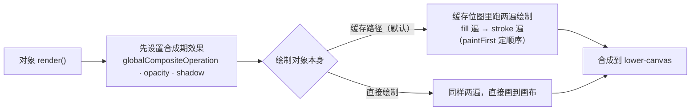

import { Canvas, Controls, Meta } from '@storybook/addon-docs/blocks';
import * as FillStrokeShadow from './fill-stroke-shadow.stories';

<Meta of={FillStrokeShadow} name="Docs" />

# 填充、描边与阴影

决定一个对象"长什么样"的纯色样式，是**两遍绘制加三个合成效果**：fill 与 stroke 各画一遍（`paintFirst` 决定先后），而 shadow、opacity 与 `globalCompositeOperation` 在对象被合成到画布的那一刻实时应用。本课讲清这些属性的取值形态、默认值、与对象缓存的关系，并核对几组高频判断：`null` 与 `'transparent'` 的差别、描边宽度与缩放、虚线与端点、阴影参数、分层透明与混合模式。渐变与图案（Gradient / Pattern）也是 fill / stroke 的合法取值，但属于 [2.2.2 渐变与图案](?path=/docs/gradients-patterns--docs)，本课只划边界。

双层画布、重绘时机与对象缓存见 [1.3 渲染模型](?path=/docs/rendering-model--docs)。本课直接引用它的结论：改"画什么"的属性要重画对象位图，改"怎么合成"的属性不用——这正是本课各属性的分界线。



下表默认值取自 fabric 7.4.0 的 `fabricObjectDefaultValues` 源码并与官方 API 核对。"画进缓存位图"指该属性属于 `cacheProperties`：用 `set()` 改到它会自动置 dirty、下一帧重画位图（`set()` 与刷新时机的机制见 1.3）。

| 属性 | 默认值 | 画进缓存位图 | 回查要点 |
| --- | --- | --- | --- |
| `fill` | `rgb(0,0,0)` | 是 | CSS 颜色 / `null` / `'transparent'` / Gradient·Pattern（下一课） |
| `stroke` | `null` | 是 | 取值形态同 fill；`null` 或 `strokeWidth` 为 0 都跳过描边遍 |
| `strokeWidth` | `1` | 是 | 沿轮廓居中，一半扩到外接框外 |
| `strokeUniform` | `false` | 是 | `true` 锁定屏幕像素宽，缩放不变形 |
| `strokeDashArray` | `null` | 是 | 画/空交替的数字数组，单位 px；奇数个按 canvas 语义复制成偶数 |
| `strokeDashOffset` | `0` | 是 | 虚线起点偏移，做流动虚线动画的输入 |
| `strokeLineCap` | `butt` | 是 | `butt` / `round` / `square`，作用于开放端点 |
| `strokeLineJoin` | `miter` | 是 | `miter` / `round` / `bevel` |
| `strokeMiterLimit` | `4` | 是 | 尖角峰长超过线宽 4 倍截为 bevel |
| `paintFirst` | `fill` | 是 | fill / stroke 谁先画 |
| `opacity` | `1` | 否 | 合成期应用，作用于整个对象（含描边与阴影） |
| `shadow` | `null` | 否 | Shadow 实例；`set()` 也接受普通对象或字符串 |
| `globalCompositeOperation` | `source-over` | 否 | 对象与画布已有内容的合成方式 |

## 填充

`fill` 决定轮廓内部画什么颜色，接受任意 CSS 颜色字符串；不传时**默认是黑色 `rgb(0,0,0)`，不是透明**：

```ts
import { Rect } from 'fabric';

new Rect({ width: 100, height: 80 });                    // 默认黑填充
new Rect({ width: 100, height: 80, fill: '#e11d48' });   // 十六进制
new Rect({ width: 100, height: 80, fill: 'rgba(225,29,72,0.5)' }); // 颜色自带 alpha
```

四种取值形态：

- **CSS 颜色字符串**：`'red'`、`'#e11d48'`、`'rgba(...)'`、`'hsl(...)'` 等。颜色里的 alpha 就是填充级的透明度——Fabric 没有 `fillOpacity`，半透明填充靠颜色本身表达。
- **`null`（或空字符串）**：跳过填充遍，完全不画填充。
- **`'transparent'`**：照常执行填充遍，但颜色解析为 alpha 0 的白，画出来不可见。
- **`TFiller`**（Gradient / Pattern 实例）：渐变与图案填充，见 [2.2.2 渐变与图案](?path=/docs/gradients-patterns--docs)。

`null` 与 `'transparent'` 在画布上看起来一样，语义不同：

| 视角 | `fill: null` | `fill: 'transparent'` |
| --- | --- | --- |
| 画布上 | 不可见 | 不可见 |
| `hasFill()` | `false` | `false`（被明确按无填充处理） |
| `toObject()` | `fill: null` | 保留字符串 `'transparent'` |
| `toSVG()` | `fill: none` | `fill: rgb(255,255,255); fill-opacity: 0` |

表达"不要填充"用 `null`：语义直接、导出干净。`'transparent'` 是一个真实的颜色值（解析为完全透明的白），只在需要保留填充遍或导出占位的场合使用。

两个容易踩的默认值：

- Rect、Circle、Triangle、Polyline、Polygon、Path 全家族默认黑填充。**只要轮廓不要内部时，必须显式 `fill: null`**——Polyline 被涂黑是最常见的新手现象。
- `fillRule`（默认 `'nonzero'`）决定自交叉路径内部的填充规则，可选 `'evenodd'`；它对普通凸图形没有影响，语义与用法在 [2.1.2 路径](?path=/docs/path--docs)展开。

## 描边

`stroke` 沿对象的轮廓线画一遍带宽度的线，取值形态与 fill 完全相同（颜色字符串 / `null` / `'transparent'` / Gradient·Pattern）。`stroke` 为 `null`（默认）或 `strokeWidth` 为 `0` 时，描边遍直接跳过。

```ts
new Rect({ width: 100, height: 80, fill: null, stroke: '#0f172a', strokeWidth: 6 });
```

**宽度居中，一半在外。** `strokeWidth` 沿轮廓居中绘制：一半画进轮廓内（会被填充盖住与否取决于 `paintFirst`），一半扩到轮廓外。因此描边参与外接框：宽度的一半向外扩，选中时的控件框也随之变大（范例读数「外接框宽」直接核对）。

**缩放会拉伸描边，`strokeUniform` 锁定。** 默认 `strokeUniform: false`：对象的 scaleX / scaleY 把描边（含虚线间距）一起拉伸。设为 `true` 后，描边遍会先把上下文反向缩放再画，屏幕上恒定像素宽；外接框计算也同步切换——非锁定时是"先加宽度再缩放"，锁定时是"先缩放再加宽度"。导出 SVG 时锁定描边会带上 `vector-effect="non-scaling-stroke"`。

**虚线：`strokeDashArray` 与 `strokeDashOffset`。**

```ts
rect.set({ strokeDashArray: [12, 8] });  // 画 12px、空 8px 交替，从路径起点开始
rect.set({ strokeDashOffset: 6 });       // 起点向前偏移 6px，逐帧递增即流动虚线
```

数组按"画、空、画、空…"读取，单位 px；奇数个元素按 canvas 语义复制拼接成偶数（`[5]` 等效 `[5, 5]`）。`null` 为实线。

**端点与拐角：`strokeLineCap` / `strokeLineJoin` / `strokeMiterLimit`。** 三个都是 canvas 2D 同名属性：

- `strokeLineCap`（`butt` / `round` / `square`）作用于**开放路径的端点**：`butt` 平头不外伸，`round` / `square` 向外延伸约半个线宽。Line 在 `butt` 下连外接框都不计端点延伸。
- `strokeLineJoin`（`miter` / `round` / `bevel`）作用于**线段拐角**；`miter` 的尖峰长度一旦超过 `strokeWidth` × `strokeMiterLimit`（默认 4）就被截成 bevel。
- 闭合形状（Rect、Circle）没有端点，`lineCap` 无从体现；这些参数真正的主场是 Line、Path、Polyline 这类线条对象。

**线条对象离开 stroke 就不可见。** Line 的渲染就是"用 stroke 画这条线"，fill 不参与：`new Line([50, 50, 350, 50])` 不给 stroke 画出来是空的。Path / Polyline 的开放轮廓同理，stroke 才是主笔画。路径命令与路径数据结构见 [2.1.2 路径](?path=/docs/path--docs)。

**绘制顺序：`paintFirst`。** 默认 `'fill'`：先填充后描边，描边被填充盖住一半。切到 `'stroke'`：描边垫底、完整宽度露出——想要"外圈 N px 的描边"，把 `strokeWidth` 设为 2N 配合 `paintFirst: 'stroke'` 即可（地图边界、贴纸白边都这么做）。

下面范例把这些属性集中在两个对象上核对：主矩形在三条色带上，承载填充形态、描边、阴影、透明度与混合模式；右下折线专门观察端点与拐角。挂载首帧与尺寸校正构成两个计数的基线，之后只随改动或交互递增。

<Canvas of={FillStrokeShadow.Interactive} />
<Controls of={FillStrokeShadow.Interactive} />

| 读者操作 | 可核对结果 |
| --- | --- |
| 「填充形态」从 颜色 切到 'transparent' 再切到 无（null） | 两种形态下矩形填充都消失；「fill 实际值」分别是 `transparent` 与 `null`，「hasFill()」都是 否 |
| 降低「填充透明度」 | 只有填充变淡，描边与阴影不动——透明度写在颜色里，只作用于填充 |
| 加大「描边宽度」 | 描边向外扩，「外接框宽」同步增大；调到 0 描边消失（视觉等效 stroke 为 null） |
| 「对象缩放」拉大，再开「描边宽度锁定」 | 锁定前描边随对象变粗；开启后恢复控件设定的宽度，「外接框宽」回到"先缩放再加宽度"的算法 |
| 切换「虚线样式」与「线端样式」 | 折线的虚线节奏与端点形状变化；「点线」要配「round 圆头」才成圆点 |
| 切换「拐角样式」 | 折线拐角在尖角、圆角、斜切间变化（矩形拐角同样受影响） |
| 「绘制顺序」切到 stroke 先画 | 描边完整宽度露出，不再被填充盖住一半 |
| 只改「阴影」「整体透明度」「混合模式」类控件 | 画面立即变化，但「缓存位图重画」不动——这些属性在合成期应用 |
| 改「填充形态」「描边宽度」类控件 | 「缓存位图重画」每次加 1——它们属于 cacheProperties |
| 拖动矩形或折线 | 「整帧渲染次数」递增，「缓存位图重画」不动——位移不重画位图 |
| 打开 Show code | 看到该 Canvas 实际执行的 example.ts |

## 阴影

`shadow` 是一个 `Shadow` 实例，由四个视觉参数加两个行为参数组成：

| 参数 | 默认值 | 说明 |
| --- | --- | --- |
| `color` | `rgb(0,0,0)` | 任意 CSS 颜色；带 alpha（如 `rgba(0,0,0,0.45)`）投影更柔和 |
| `blur` | `0` | 模糊半径（canvas `shadowBlur`，无单位；`config.browserShadowBlurConstant` 默认 1，可按浏览器微调） |
| `offsetX` / `offsetY` | `0` / `0` | 投影偏移 |
| `affectStroke` | `false` | 描边遍是否投影（见下） |
| `nonScaling` | `false` | `true` 时偏移与模糊不随对象缩放 |
| `includeDefaultValues` | `true` | `toObject()` 是否携带默认值 |

三种赋值写法，`set()` 都会接住（普通对象与字符串自动包装成 Shadow）：

```ts
import { Rect, Shadow } from 'fabric';

rect.set('shadow', new Shadow({ color: 'rgba(0,0,0,0.4)', blur: 20, offsetX: 10, offsetY: 12 }));
rect.set('shadow', { color: 'rgba(0,0,0,0.4)', blur: 20, offsetX: 10, offsetY: 12 });
rect.set('shadow', 'rgba(0,0,0,0.4) 10px 12px 20px'); // 颜色 + offsetX offsetY blur
rect.set('shadow', null);                             // 移除阴影
```

注意 `set('shadow', {...})` 是**整体替换**：普通对象会与 Shadow 默认值合并，缺省字段回到默认，改单个参数也要把关心的字段传全。也可以直接改 `rect.shadow.blur = 20` 再 `requestRenderAll()`——阴影在合成期应用，这样同样生效。

**阴影不进对象缓存位图。** 渲染分两步：缓存位图里只有对象本身（不含阴影），贴图到画布（或直接绘制）的那一刻才用 `ctx.shadowColor` 等实时投影。原因在 canvas 阴影的特性：`shadowOffsetX/Y` 不受当前变换的旋转影响，旋转对象的阴影必须保持屏幕方向，就不能烘进一张会跟着旋转的位图（官方 caching 教程对此有专门说明）。两个直接推论：

- 改阴影的任何参数都不重画位图，只影响下一次合成——范例里「缓存位图重画」读数在只改阴影时纹丝不动。
- 阴影伸出对象之外的部分不占位图尺寸，也不会撑爆缓存上限。

**阴影随对象缩放。** 默认偏移乘以对象缩放、模糊乘以缩放（视口缩放同样参与）；`nonScaling: true` 把两者锁定。范例读数「阴影有效偏移 X」= offsetX ×（nonScaling ? 1 : scaleX），缩放对象或切换开关即可核对。

**`affectStroke` 的边界。** 默认 `false`：直接绘制路径下，描边遍会先关掉阴影再画——只有填充在投影；`true` 时描边也投影。但对象走缓存（默认）时，阴影是对整张位图的轮廓投影（描边轮廓天然包含在内），这个参数主要影响 `objectCaching` 关闭或非缓存的绘制路径。

**Group 的连带规则。** 组内子对象有带偏移（offsetX 或 offsetY 不为 0）的阴影时，整组放弃缓存、每帧重画全部子对象（`Group.shouldCache` 会递归检查子对象）；纯模糊、无偏移的阴影不阻止缓存。大规模分组场景的权衡见 [7.2 性能优化](?path=/docs/performance--docs)。

## 透明度与混合

**`opacity` 是对象级的，没有 `fillOpacity` / `strokeOpacity`。** v7.4 的类型与默认值里不存在这两个属性（它们是 Konva 的 API）。分层透明的做法：

- 只淡填充：fill 用带 alpha 的颜色（范例「填充透明度」控件即合成 rgba）。
- 只淡描边：stroke 用带 alpha 的颜色。
- 整体淡出：`opacity`——它在合成期作用于**整个对象**，填充、描边、阴影一起变淡，且不重画位图。

`opacity` 的三个边界：

- 嵌套相乘：对象画到画布时与当前 `globalAlpha` 相乘，Group 的 opacity 会连乘到子对象。
- `opacity: 0` 时对象直接跳过渲染（`isNotVisible` 判定），但**默认按外接框命中，仍能被点选**；要"彻底隐藏且不参与命中"用 `visible: false`。
- 与 `globalCompositeOperation` 可以叠加：一个管淡出，一个管像素怎么运算。

**`globalCompositeOperation` 决定对象怎么混入画布。** TS 类型就是 canvas 同名联合类型（`GlobalCompositeOperation`），默认 `'source-over'` 常规覆盖。作用点在对象整幅（缓存位图或直接绘制结果）画上 lower-canvas 的那一刻——它和层叠顺序强绑定：混合的对象是**它下面已经画上去的内容**，后画者混合先画者，调换层级结果就不同（层级操作见 [3.2 对象管理](?path=/docs/stacking--docs)）。常用取值：

| 取值 | 效果 |
| --- | --- |
| `source-over` | 默认：直接覆盖 |
| `multiply` / `screen` / `overlay` / `difference` | 与底下内容逐像素混色（正片叠底 / 滤色 / 叠加 / 差值） |
| `lighter` | 颜色相加提亮 |
| `destination-out` | 用对象 alpha 擦掉底下已画内容（挖洞） |
| `destination-in` | 只保留对象与底下内容的交集 |

三个边界：

- Group 内子对象的混合目标是组自身的绘制上下文：组被缓存时是组的缓存位图（和组内先前画的内容混合），组不缓存时才是画布。
- `toSVG()` 不导出 `globalCompositeOperation`（导出代码里没有 mix-blend-mode 映射），混合效果只存在于画布与位图导出。
- `destination-out` 是擦除像素、不可逆；要可序列化、可逆的裁剪用 clipPath（[2.3.4 裁剪与遮罩](?path=/docs/clip-path--docs)）。

范例核对：把「混合模式」切到 `multiply`，主矩形与三色条纹叠出混色；切到 `destination-out`，矩形所到之处把条纹擦掉；拉低「整体透明度」，填充、描边、阴影一起变淡，而「填充透明度」只淡填充。

## 最佳实践

- 表达"无填充"一律 `fill: null`；Polyline / Path / Polygon 只要轮廓时必须显式设置——全家族默认黑填充。
- 高频动画优先动 shadow 与 opacity：它们合成期应用、不重画位图；fill / stroke / 虚线的逐帧改动每帧重画位图，代价高一档。
- 外圈定宽描边：`paintFirst: 'stroke'` + `strokeWidth` = 2 × 目标宽度，比算偏移或叠两层对象干净。
- 阴影颜色尽量带 alpha：不透明色投影边缘生硬，大面积使用还容易盖住相邻内容。
- 混合模式依赖层叠顺序：先用层级 API 确认对象在目标内容之上，再选模式。

## 常见问题

- Line 或开放路径画出来什么都看不见
  检查 stroke：线条类对象靠 stroke 画线，fill 不参与渲染；stroke 为 `null`（默认）时整条线不可见。给 stroke 一个颜色即可。
- Polyline / Polygon 内部莫名其妙被涂黑
  `fill` 默认 `rgb(0,0,0)`，不是透明。只要轮廓时显式 `fill: null`。
- 对象一放大，描边和虚线间距就跟着变形
  描边默认随 scaleX / scaleY 缩放（虚线间距同理）。要定宽描边设 `strokeUniform: true`，SVG 导出会带 `vector-effect="non-scaling-stroke"`。
- 给 Group 里的对象加了阴影，整组交互明显变卡
  组内带偏移的阴影会让整组放弃缓存、每帧重画所有子对象。把阴影挪到组本身、改用无偏移的纯模糊阴影，或按 [7.2 性能优化](?path=/docs/performance--docs)权衡缓存策略。
- fill 设成 'transparent' 后，导出的 SVG 和 null 不一样
  `null` 导出 `fill: none`；`'transparent'` 导出 `fill: rgb(255,255,255); fill-opacity: 0`。想要"没有填充"的干净语义用 `null`。

## 总结回顾

摘要：

对象外观由两遍绘制加三个合成效果组成。fill 与 stroke 取值形态相同（CSS 颜色、`null`、`'transparent'`、Gradient·Pattern），默认黑填充、无描边；`null` 跳过绘制遍而 `'transparent'` 只是画了个看不见的颜色，两者在 `hasFill()`、toObject 与 SVG 导出上语义不同。描边居中一半在外、参与外接框，`strokeUniform` 锁定缩放下的宽度，虚线、端点、拐角沿用 canvas 2D 语义，线条对象（Line / Path / Polyline）离开 stroke 不可见，`paintFirst` 决定两遍的先后。Shadow 由 color / blur / offsetX / offsetY / affectStroke / nonScaling 构成，`set()` 接受实例、普通对象或字符串且整体替换；阴影与 opacity、混合模式一样在合成期实时应用，不进缓存位图，改它们不触发位图重画。Fabric 没有 fillOpacity / strokeOpacity，分层透明靠颜色 alpha；`globalCompositeOperation` 决定对象与画布已有内容怎么运算，依赖层叠顺序，且不导出到 SVG。

一句话：

> fill 与 stroke 是画进对象位图的两遍绘制，shadow、opacity 与混合模式是合成期实时应用的效果——改前者重画位图，改后者只影响下一次贴图。

知识要点：

- fill 的四类取值形态是什么？`null` 与 `'transparent'` 差在哪四处？
- strokeWidth 如何影响外接框？strokeUniform 改变了绘制与外接框的什么？
- strokeLineCap / strokeLineJoin 作用于什么？为什么 Line 离开 stroke 就不可见？
- Shadow 有哪些参数与默认值？set('shadow', ...) 的三种写法和整体替换语义是什么？
- 为什么阴影和 opacity 不进对象缓存位图？Group 里带偏移阴影有什么连带后果？
- 没有 fillOpacity 时怎么做"只淡填充"？opacity 与 visible: false 的差别是什么？
- globalCompositeOperation 在渲染的哪一步生效？它和层叠顺序、Group、SVG 导出分别是什么关系？

## 参考资料

- [FabricObject API（fill / stroke / 描边参数 / opacity / globalCompositeOperation）](https://fabricjs.com/api/classes/fabricobject/)
- [Shadow API（构造参数与默认值）](https://fabricjs.com/api/classes/shadow/)
- [Object caching（官方教程：cacheProperties、阴影与透明度在合成期应用、Group 阴影规则）](https://fabricjs.com/docs/fabric-object-caching/)
- [MDN：globalCompositeOperation（合成取值语义）](https://developer.mozilla.org/en-US/docs/Web/API/CanvasRenderingContext2D/globalCompositeOperation)
- [官方文档站（指南入口）](https://fabricjs.com/docs/)
