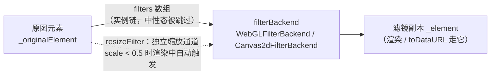

import { Canvas, Controls, Meta } from '@storybook/addon-docs/blocks';
import * as FiltersStories from './filters.stories';

<Meta of={FiltersStories} name="Docs" />

# 滤镜

滤镜是 **FabricImage 独有的像素后处理管线**：Rect / Text 等对象没有 `filters`，想改它们的颜色用填充属性。图片的 `filters` 数组装**滤镜实例**（`new filters.Blur({ blur: 0.4 })`），改动后必须**显式调用 `image.applyFilters()`** 才会重算——重算结果写进滤镜副本 `_element`，原图元素 `_originalElement` 永远不动，因此可以反复换参数重跑。管线由滤镜后端执行：WebGL 可用且开启时走 `WebGLFilterBackend`（GPU），否则自动落到 `Canvas2dFilterBackend`（CPU，逐像素的 `applyTo2d`）——每个内置滤镜因此都有 shader 与 2D 两套实现，写自定义滤镜也要两套都写。



| 对象 / 入口 | 默认值 / 形态 | 回查要点 |
| --- | --- | --- |
| `image.filters` | `[]` | 只装滤镜实例；数组顺序即管线顺序 |
| `image.applyFilters(filters?)` | 显式调用，返回 `void` | 改数组或改实例参数后必须重调，再 `requestRenderAll()` |
| `image.resizeFilter` | 无 | 独立缩放通道，**不进** `filters` 数组 |
| `image.minimumScaleTrigger` | `0.5` | scale 低于它才触发 resizeFilter；`0` 关闭自动触发 |
| `config.enableGLFiltering` | `true` | 决定是否尝试 WebGL；须在**首次滤镜调用前**设置 |
| `config.textureSize` | `4096`（v5 是 2048） | WebGL 纹理画布边长；大图被裁的根源 |
| `getFilterBackend()` / `setFilterBackend(backend)` | 惰性单例 | `getFilterBackend() instanceof WebGLFilterBackend` 检测当前后端 |
| `initFilterBackend()` | → 上述二选一 | 首次 `getFilterBackend()` 时自动执行 |
| `image.cacheKey` | `texture{uid}` | WebGL 纹理缓存键；多图共用同一源可手动设同值共享纹理 |

默认值与 fabric 7.4.0 源码核对（`imageDefaultValues`、`config`、`FilterBackend.ts`）。

## 快速上手

```ts
import { Canvas, FabricImage, filters } from 'fabric';

const canvas = new Canvas(el, { width: 640, height: 360 });

const img = await FabricImage.fromURL('https://cdn.example.com/photo.jpg', {
  crossOrigin: 'anonymous', // 要加滤镜的跨域图必传，见「常见问题」
});
img.filters = [new filters.Grayscale()]; // 数组装实例
img.applyFilters();                       // 显式重算——没有这步画面不变
canvas.add(img);                          // add 自动请求重绘
```

改参数的固定三步：改实例属性 → `applyFilters()` → `requestRenderAll()`。

## 应用与生效时机

`applyFilters` 的源码逻辑值得整段理解，三个行为都从它来：

```ts
// fabric 7.4.0 src/shapes/Image.ts（节选）
applyFilters(filters = this.filters || []) {
  filters = filters.filter((filter) => filter && !filter.isNeutralState());
  this.set('dirty', true);
  this.removeTexture(`${this.cacheKey}_filtered`);
  if (filters.length === 0) {
    this._element = this._originalElement; // 链空 / 全中性：回到原图
    ...
    return;
  }
  // 结果写进滤镜副本 canvas（_filteredEl，重算时 clearRect 复用），原图不动
  getFilterBackend().applyFilters(
    filters, this._originalElement, sourceWidth, sourceHeight,
    this._element, this.cacheKey,
  );
}
```

- **显式触发**：`image.filters = [...]`、`filter.blur = 0.6` 都只是改内存，不触发任何重算——从 v5 到 v7 的实现签名都是 `applyFilters(filters?)`，无回调参数（JSDoc 里 `applyFilters(canvas.renderAll.bind(canvas))` 这类带回调的示例是过时注释，以代码为准）。官方 demo 的调参套路就是三步：改 `subFilters[i].xxx` → `image.applyFilters()` → `canvas.requestRenderAll()`。
- **中性态跳过**：`isNeutralState()` 返回 true 的滤镜被剔除——单参数滤镜在参数等于默认值时中性（Brightness 的 `brightness === 0`、Blur 的 `blur === 0`、Pixelate 的 `blocksize === 1`、Invert 的 `invert === false`），Grayscale 永不中性，Composed 在全部子滤镜中性时中性。链被剔空则 `_element` 直接回到原图。
- **副本机制**：滤镜结果画在独立的 canvas（`_filteredEl`）上并复用，`getSrc(true)` / `toDataURL` 拿到的是滤镜后的图；`setElement()` 换元素时若 `filters.length !== 0` 会自动重跑一次。
- **缓存关系**：`applyFilters` 内部已 `set('dirty', true)`，独立图片默认不建自身位图缓存（v6+ 特化，见[图片](?path=/docs/image--docs)），通常补一句 `requestRenderAll()` 就够；在**有缓存的 Group** 内改滤镜，组位图靠这个 dirty 失效。`dirty` 与缓存通用机制在[渲染模型](?path=/docs/rendering-model--docs)。
- **序列化**：`toObject()` 输出 `filters` 数组（每项 `{ type, ...参数 }`），`fromObject` 经 `enlivenObjects` 按 `type` 从 classRegistry 复活实例；自定义滤镜要先 `classRegistry.setClass(MyFilter)` 才能往返，细节在[序列化](?path=/docs/serialization--docs)。
- **数组里只能放实例**：源码的 `filter &&` 会静默剔除 `false` / `null`（旧代码当"占位关闭"用），但布尔 `true` 从来不是合法滤镜——运行时会在 `isNeutralState()` 处抛 `TypeError`（v5 与 v7 源码一致），TypeScript 类型 `BaseFilter<string>[]` 也只接受实例。想"关掉"某个滤镜就把它从数组里删掉，或把参数调回默认值让中性跳过。

<Canvas of={FiltersStories.FilterBench} />
<Controls of={FiltersStories.FilterBench} />

| 读者操作 | 可核对结果 |
| --- | --- |
| 切换「滤镜选择」 | 画面变化，「生效滤镜链」同步给出实例类型与参数快照；「滤镜后端」显示当前 WebGL / 2D |
| 色调类滤镜把「强度」滑到 50 | 参数归 0，「被跳过（中性）」变 1 个，「渲染元素」回到原图元素——中性态被 applyFilters 剔除 |
| 选 Blur / Pixelate 并调强度 | 网格细节随之模糊 / 结块——「强度」按各滤镜真实量纲换算，读数可查实际值 |
| 选 RemoveColor 调强度 | 白色块被抠成透明、露出灰色背板——distance 控制容差 |
| 勾选「追加 Grayscale」 | 链变成两项，读数以 `+` 连接——数组就是管线，实例链式生效 |
| 选「Composed 双色调」「SwapColor 换色」 | 分别看到 Composed 组合子滤镜与自定义滤镜——形态与内置滤镜完全一致 |

## 内置滤镜

`import { filters } from 'fabric'`，全部成员如下（参数与默认值逐项对 7.4.0 源码核对）：

| 滤镜 | 关键参数（默认值） | 用途 |
| --- | --- | --- |
| `Brightness` | `brightness: 0`（-1..1） | 亮度增减，2D 路径换算为 ±255 |
| `Contrast` | `contrast: 0`（-1..1） | 对比度 |
| `Saturation` | `saturation: 0`（-1..1） | 饱和度，0 无效果 |
| `Vibrance` | `vibrance: 0`（-1..1） | 自然饱和度：低饱和色提升更明显 |
| `HueRotation` | `rotation: 0`（-1..1，对应 ±π 弧度） | 色相旋转（ColorMatrix 子类） |
| `Gamma` | `gamma: [1, 1, 1]`（R/G/B 各 0.01..2.2） | 三通道伽马 |
| `Grayscale` | `mode: 'average'`（`average` / `lightness` / `luminosity`） | 去色 |
| `Invert` | `invert: true`、`alpha: false` | 反色；`alpha: true` 连透明度一起反 |
| `Noise` | `noise: 0`（0..1000） | 随机噪点 |
| `Blur` | `blur: 0`（0..1） | 模糊，值是**图尺寸的百分比**（跨分辨率观感一致） |
| `Pixelate` | `blocksize: 4` | 像素化块边长（源像素） |
| `RemoveColor` | `color: '#FFFFFF'`、`distance: 0.02`、`useAlpha: false` | 按色抠透明；distance 是 RGB 容差（0..1） |
| `BlendColor` | `color: '#F95C63'`、`mode: 'multiply'`、`alpha: 1` | 与纯色混合 |
| `BlendImage` | `mode: 'multiply'`、`alpha: 1`（必传 `image: FabricImage`） | 与另一张图混合 / 蒙版 |
| `Convolute` | `matrix: [0,0,0,0,1,0,0,0,0]`、`opaque: false` | 卷积核（锐化 / 浮雕 / 盒式模糊） |
| `ColorMatrix` | `matrix`（5×4 恒等）、`colorsOnly: true` | 自定义 20 元颜色矩阵 |
| `Composed` | `subFilters: []` | 组合容器，见下文 |
| `Resize` | `resizeType: 'hermite'`、`scaleX/scaleY: 1`、`lanczosLobes: 3` | 高质量缩放，见下文 |
| `Sepia` / `Vintage` / `Brownie` / `Kodachrome` / `Technicolor` / `Polaroid` / `BlackWhite` | 无参 | 固定颜色矩阵的胶片预设（变量，不是 class） |

### 色调与颜色

Brightness / Contrast / Saturation / Vibrance / HueRotation / Gamma 共用**归一化量纲**：v2.0 起参数统一到 -1..1（v1.x 是 0-255 / 0-100 的绝对值，官方 old-docs 给过换算表；外部资料若是 `new Brightness({ brightness: 100 })` 这类写法，那是 v1.x 的量纲）。0 或 `[1,1,1]` 即中性。HueRotation 本质是 ColorMatrix 子类：`rotation` 乘 π 得弧度后现算色相矩阵。Gamma 按通道各给一个指数（0.01..2.2），`[1, 0.5, 2.1]` 表示提亮红、压暗蓝。

### 颜色矩阵与胶片预设

`ColorMatrix` 是"一个滤镜表达全部线性颜色运算"的底座：20 个数组成 5×4 矩阵，第 5 列是常量偏移，同样按 -1..1 书写（内部在 2D 路径换算为 ±255；JSDoc 提醒常量列超出 -1..1 会失去意义）。七个胶片预设——`Sepia`、`Vintage`、`Brownie`、`Kodachrome`、`Technicolor`、`Polaroid`、`BlackWhite`——是 `createColorMatrixFilter(key, matrix)` 工厂产出的**固定矩阵变量**，无参实例化 `new filters.Sepia()` 直接可用，源码在 `ColorMatrixFilters.ts`。想要自己的"品牌色"预设，抄一个矩阵数组交给 `ColorMatrix` 即可，不必子类化。

### 模糊、像素化与卷积

`Blur` 的 `blur` 是**相对图尺寸的百分比**而非像素——同一模糊值在缩略图和大图上观感一致，调参时按这个语义理解。`Pixelate.blocksize` 是源像素的块边长，`1` 即中性。`Convolute` 吃任意方形矩阵（3×3 最常用），`.d.ts` 自带的三个配方：

```ts
// 锐化
new filters.Convolute({ matrix: [0, -1, 0, -1, 5, -1, 0, -1, 0] })
// 盒式模糊
new filters.Convolute({ matrix: Array(9).fill(1 / 9) })
// 浮雕（opaque: true 保持不透明）
new filters.Convolute({ opaque: true, matrix: [1, 1, 1, 1, 0.7, -1, -1, -1, -1] })
```

### 混合

`BlendColor` 把整张图与一个纯色混合，`mode` 十种：`multiply` / `add` / `difference` / `screen` / `subtract` / `darken` / `lighten` / `overlay` / `exclusion` / `tint`；`alpha` 控制强度。`BlendImage` 把另一张 `FabricImage` 叠上来，`mode` 只有 `multiply` 与 `mask`（后者按贴图 alpha 蒙版原图），它有序列化支持（`fromObject` 会重新加载贴图）。旧的 `Tint` / `Multiply` 滤镜在 v2 已并入这两个。

### Composed 组合

`Composed` 把一串子滤镜包成**一个可命名、可复用的单元**，`subFilters` 数组顺序即应用顺序——效果上与往 `filters` 里平铺多个实例一致，价值在于把"三步套路"当一个概念传递与调参。官方 duotone demo 的完整套路：

```ts
import { FabricImage, filters } from 'fabric';

const duotone = new filters.Composed({
  subFilters: [
    new filters.Grayscale({ mode: 'luminosity' }),        // 1. 压成黑白
    new filters.BlendColor({ color: '#00ff36' }),         // 2. 亮色 multiply（默认 mode）
    new filters.BlendColor({ color: '#23278a', mode: 'lighten' }), // 3. 暗色提亮阴影
  ],
});

const img = await FabricImage.fromURL(url, { crossOrigin: 'anonymous' });
img.filters = [duotone];
img.scaleToWidth(480);
img.applyFilters();

// 运行中调色：改 subFilters 的实例属性后仍走标准三步
duotone.subFilters[1].color = '#ffd166';
img.applyFilters();
canvas.requestRenderAll();
```

## Resize 与高质量缩放

`filters.Resize` 不走 `filters` 数组——它挂在 **`image.resizeFilter`** 这个独立通道上，由**渲染过程自动触发**：每次 `_render` 检查 `!isMoving && resizeFilter && _needsResize()`，且对象总缩放低于 `minimumScaleTrigger`（默认 `0.5`，设 `0` 关闭自动触发）时，才把元素按当前 scale 用指定算法真正缩一遍（`_filterScalingX/Y` 记录这层缩放）。也就是说：平时直接 `drawImage` 缩放显示，缩小很多倍时才付出一次高质量重采样换清晰度。

- `resizeType` 四种：`bilinear` / `hermite`（默认）/ `sliceHack` / `lanczos`——**仅 Canvas 2D 后端区分**；WebGL 后端一律走 lanczos 着色器，`resizeType` 不影响。
- `lanczosLobes`（默认 3）是 lanczos 核的瓣数，越大越锐也越慢；官方 realtime-lanczos demo 就用它做交互式缩放。
- 自动触发只看 **scale 变化**：换 `resizeFilter` 实例而倍率不动时，渲染不会重跑（`_needsResize` 比较 `_lastScaleX/Y`）。要在固定倍率下切算法，显式调 `image.applyResizeFilters()`（公开方法）再重绘。
- 与 `imageSmoothing`（绘制时的双线性开关）互补：`imageSmoothing` 管每次绘制的采样质量，`resizeFilter` 管源元素的重采样。

<Canvas of={FiltersStories.ResizeQuality} />
<Controls of={FiltersStories.ResizeQuality} />

| 读者操作 | 可核对结果 |
| --- | --- |
| 倍率 0.3，切换「resizeFilter」off / lanczos | 细网格与斜线在 off 下闪烁摩尔纹、lanczos 下干净——重采样质量差异；「元素缩放比」off 回 1、lanczos 为 0.3 |
| 倍率拖过 0.5 | 「resizeFilter」变「未触发」、元素缩放比回 1——低于 `minimumScaleTrigger` 才介入 |
| 倍率 0.5 以下再微调 | 「元素缩放比」跟随倍率——resizeFilter 把缩放落到了元素上，显示尺寸不变 |
| 倍率 1.0 | 任何模式下元素缩放比都是 1——放大方向不触发 |

## WebGL 后端与兜底

后端选择只发生在**第一次用到滤镜时**（`getFilterBackend()` 惰性初始化）：

```ts
// fabric 7.4.0 src/filters/FilterBackend.ts（节选）
if (config.enableGLFiltering && WebGLProbe.isSupported(config.textureSize)) {
  return new WebGLFilterBackend({ tileSize: config.textureSize });
}
return new Canvas2dFilterBackend();
```

- **探测**：`WebGLProbe.queryWebGL()` 建一个临时 webgl 上下文查 `MAX_TEXTURE_SIZE` 与精度，随即用 `WEBGL_lose_context` 释放；`isSupported(textureSize)` 要求硬件上限 ≥ `config.textureSize`（默认 4096，v5 是 2048）。任一条件不满足——WebGL 被禁、硬件上限不够、`enableGLFiltering` 设 false——就落到 `Canvas2dFilterBackend`，滤镜改走 `applyTo2d` 逐像素路径，结果一致、速度更慢。**这是静默兜底**：代码不需要为后端写分支。
- **配置时机**：`config.enableGLFiltering = false` 或调 `config.textureSize` 必须在首次滤镜调用**之前**，惰性单例已建就不再看 config；要中途换后端用 `setFilterBackend(new Canvas2dFilterBackend())`。
- **检测当前后端**：`getFilterBackend() instanceof WebGLFilterBackend`。v7 **没有** `isWebGLBacked` 或 `texturePersistence` 这类 API（那是 v5 时代 `fabric.isWebglSupported` 的记忆残留），以 `getFilterBackend` / `setFilterBackend` / `initFilterBackend` 三个顶层导出为准。
- **纹理缓存**：WebGL 后端按 `image.cacheKey` 缓存原图纹理（`textureCache`），反复 `applyFilters` 不重复上传；`applyFilters` 每次只清 `_filtered` 纹理。多张图共用同一源时，手动把 `cacheKey` 设成同一个值即可共享纹理。
- **大图被裁**：滤波画布边长受 `tileSize`（= `config.textureSize`）限制，超限的图被裁掉——现象是"滤镜后图片缺一块"。处理：调大 `config.textureSize`（官方经验：多数硬件至少支持 4096，再往上视硬件上限而定）或预先把图缩小。
- **GPU 内存**：每张首次滤镜的图占一份纹理，不用了调 `image.dispose()`（内部 `evictCachesForKey` 清两个缓存键）；`canvas.dispose()` 会对画布上每张图执行 dispose。

## 自定义滤镜

自定义滤镜 = 继承 `filters.BaseFilter`，把**同一效果写两遍**（WebGL 的 fragment shader + Canvas 2D 的 `applyTo2d`），基类负责编译着色器、解析 uniform 位置、组织管线。官方仓库的 `Boilerplate.ts` 是空模板，custom-filter demo 的 SwapColor（换色）是完整示例，v7 形态如下：

```ts
import { Color, filters, type T2DPipelineState } from 'fabric';

type SwapColorOwnProps = {
  colorSource: string;
  colorDestination: string;
};

const fragmentSource = `
  precision highp float;
  uniform sampler2D uTexture;        // 基类注入的源纹理
  uniform vec4 uColorSource;
  uniform vec4 uColorDestination;
  varying vec2 vTexCoord;
  void main() {
    vec4 color = texture2D(uTexture, vTexCoord);
    vec3 delta = abs(uColorSource.rgb - color.rgb);
    gl_FragColor = length(delta) < 0.1 ? uColorDestination : color;
  }
`;

export class SwapColor extends filters.BaseFilter<'SwapColor', SwapColorOwnProps> {
  static type = 'SwapColor';
  static defaults = { colorSource: '#ef4444', colorDestination: '#22d3ee' };
  declare colorSource: string;      // 值由构造器从 static defaults 合并而来
  declare colorDestination: string;

  // 基类按这份名单到着色器程序查 uniform 位置（uStepW / uStepH 由基类额外提供）
  static uniformLocations = ['uColorSource', 'uColorDestination'];

  protected getFragmentSource() {
    return fragmentSource;          // WebGL 路径
  }

  applyTo2d({ imageData: { data } }: T2DPipelineState) {
    // Canvas 2D 兜底路径：色彩分量是 0-255
    const source = new Color(this.colorSource).getSource();
    const destination = new Color(this.colorDestination).getSource();
    for (let i = 0; i < data.length; i += 4) {
      if (data[i] === source[0] && data[i + 1] === source[1]
          && data[i + 2] === source[2]) {
        data[i] = destination[0];
        data[i + 1] = destination[1];
        data[i + 2] = destination[2];
      }
    }
  }

  sendUniformData(gl: WebGLRenderingContext, uniformLocations: Record<string, WebGLUniformLocation | null>) {
    // WebGL 路径：每次滤波把数据送进 uniform，色彩分量除以 255 归一到 0-1
    const source = new Color(this.colorSource).getSource();
    const destination = new Color(this.colorDestination).getSource();
    [source, destination].forEach((c) => { c[0] /= 255; c[1] /= 255; c[2] /= 255; });
    gl.uniform4fv(uniformLocations.uColorSource, source);
    gl.uniform4fv(uniformLocations.uColorDestination, destination);
  }

  isNeutralState(): boolean {
    return this.colorSource === this.colorDestination; // 源色=目标色时不产生效果
  }
}
```

结构要点：

- **自有属性三件套**：`OwnProps` 类型 + `declare` 字段 + `static defaults`——构造器执行 `Object.assign(this, 静态 defaults, options)`，默认值与构造覆盖都由此而来；`static type` 是序列化里的 `type` 字符串。
- **uniform 接线**：`static uniformLocations = ['uXxx']` 声明名单（名字与 shader 里的 uniform 一致），基类据此查位置；`sendUniformData` 每次滤波时送值。基类还自动提供 `uStepW` / `uStepH`（1/源宽、1/源高），写像素化类 shader 直接用。
- **两套量纲**：shader 里色彩是 0-1，`applyTo2d` 的 `imageData.data` 是 0-255——同一个效果必须换算两次，这是自定义滤镜最主要的出错点。
- **只写 2D 可以吗**：可以（不写 `getFragmentSource` 时 WebGL 路径用基类的恒等 shader，等于没效果），但后端是 WebGL 就拿不到效果；要么两边都写，要么 `setFilterBackend(new Canvas2dFilterBackend())` 强制 2D。
- **序列化恢复**：`classRegistry.setClass(SwapColor)` 之后 `toObject` / `fromObject` 才能往返（内置滤镜在模块加载时已自行注册）。
- 上面实验台的「SwapColor 换色」就是这份模板的实装，与本节代码同源。

## 最佳实践

- 调参闭环固定三步：改实例属性 / 换数组 → `applyFilters()` → `requestRenderAll()`；把它包成一个函数，漏掉 `applyFilters` 是滤镜问题的第一大来源。
- 滑条实时预览大量重算时，优先改已有实例的属性再 `applyFilters`（WebGL 纹理缓存让重复滤波不重传原图），不要每次 new 一串滤镜；把一组固定效果打包成 `Composed` 复用。
- 要滤镜 / 要导出的跨域图，加载时就带 `crossOrigin: 'anonymous'`——滤镜读像素，污染画布在 `applyFilters` 那一刻才抛错，细节在[图片](?path=/docs/image--docs)。
- 大图先确认 `config.textureSize` 覆盖得到，或预先缩小源图；多图共用同一源时统一 `cacheKey` 省一份 GPU 纹理。
- 图片不再使用就 `image.dispose()`，整画布销毁用 `canvas.dispose()`；WebGL 纹理不会自动回收。
- 缩小显示低于 0.5 倍且在意清晰度时配 `resizeFilter: new filters.Resize({ resizeType: 'lanczos' })`；只在意速度就不配（默认无）。
- 用动画驱动滤镜参数（如呼吸亮度）沿[动画](?path=/docs/animation--docs)的 `util.animate`，onChange 里走三步闭环。

## 常见问题

- 改了 `filter.blur`（或 push 了新滤镜），画面没有任何变化
  `filters` 数组和实例属性只是数据，改动不触发重算。补 `image.applyFilters()` 再 `canvas.requestRenderAll()`。
- 参数明明是默认值（如 `brightness: 0`），链里也有滤镜但读数 / 效果显示"没有滤镜"
  这是中性态跳过：`applyFilters` 会剔除 `isNeutralState()` 为 true 的滤镜，链被剔空时 `_element` 直接回到原图。把参数调离默认值即恢复效果。
- 照旧资料写 `image.filters = [true]` 或 `filters.push(true)` 想"启用无参滤镜"，报 `filter.isNeutralState is not a function`
  布尔 `true` 从来不是合法滤镜（v5 / v7 源码都会在这抛 TypeError；`false` / `null` 则被静默剔除）。数组只放实例："启用"就是放实例，"关闭"就是删掉或调回中性参数。
- 滤镜后图片缺了一块 / 被裁到 4096 边长
  图超过了 WebGL 滤波画布的 `config.textureSize`（默认 4096）。首次滤镜前调大 `config.textureSize`，或把源图预先缩小。
- `applyFilters()` 或导出时抛 `SecurityError`（tainted canvases）
  跨域图没带 `crossOrigin: 'anonymous'` 加载，滤镜读像素撞上画布污染。污染无法事后洗白，带 `crossOrigin` 重新加载并要求服务器配 CORS，判断方法见[图片](?path=/docs/image--docs)。
- 长时间运行 GPU / 内存持续增长
  每张首次滤波的图都占一份 WebGL 纹理。不再使用的图调 `image.dispose()`；共用同一源的多张图把 `cacheKey` 设成同值共享纹理。
- 同一份代码在浏览器里有效果、在 Node 或禁 WebGL 环境里变慢（或自定义滤镜没效果）
  后端静默兜底到了 `Canvas2dFilterBackend`：内置滤镜走 `applyTo2d` 结果一致；自定义滤镜若只写了 shader 没写 `applyTo2d`，2D 路径等于恒等。用 `getFilterBackend() instanceof WebGLFilterBackend` 区分现象。
- `config.enableGLFiltering = false` 设置了但还在走 WebGL
  配置只在**首次** `getFilterBackend()` 时读取，后端单例已建。要么在任何滤镜调用前设置，要么直接 `setFilterBackend(new Canvas2dFilterBackend())`。
- 自定义滤镜 `loadFromJSON` 恢复时报找不到类
  `fromObject` 按 `type` 从 classRegistry 查类；自定义滤镜要 `classRegistry.setClass(SwapColor)` 注册后才能序列化往返。

## 总结回顾

摘要：

滤镜是 FabricImage 专属的像素后处理：`filters` 数组装实例、顺序即管线，`applyFilters()` 显式重算并把结果写进与原图分离的滤镜副本，中性态滤镜被剔除、链空时回到原图。内置滤镜按家族覆盖色调（-1..1 归一化量纲）、颜色矩阵与胶片预设、模糊 / 像素化 / 卷积、颜色与图片混合、抠色，`Composed` 把子滤镜打包成可复用单元（duotone 三步套路），`Resize` 走 `resizeFilter` 独立通道、在 scale 低于 `minimumScaleTrigger` 时由渲染自动触发高质量重采样。后端首次使用时定型：`config.enableGLFiltering` + `textureSize` 探测通过走 WebGL，否则静默兜底 Canvas 2D 的 `applyTo2d`；检测用 `getFilterBackend() instanceof WebGLFilterBackend`，纹理按 `cacheKey` 缓存、`dispose` 释放。自定义滤镜继承 `filters.BaseFilter`，shader 与 `applyTo2d` 两套实现（注意 0-1 与 0-255 量纲），`static defaults` + `uniformLocations` + `isNeutralState` 是模板的关键件，序列化往返需注册 classRegistry。

一句话：

> filters 数组装实例、applyFilters 显式重算落副本——后端在 WebGL 与 Canvas 2D 间静默选择，所以每个滤镜（包括你自己写的）都要有两套实现。

知识要点：

- 滤镜改动生效的完整闭环是什么？哪一步遗漏是"没反应"的第一原因？
- `isNeutralState` 在 `applyFilters` 里起什么作用？链空时 `_element` 会怎样？
- 内置滤镜分哪几族？各族的参数量纲与默认值是什么？
- `Composed` 与往 `filters` 平铺多个实例有什么异同？duotone 的三步是什么？
- `resizeFilter` 为什么不进 `filters` 数组？什么条件下自动触发？WebGL 后端下 `resizeType` 有区别吗？
- 后端何时选择、如何检测当前后端、`config` 两个开关为什么必须在首次滤镜前设置？
- 大图被裁、GPU 内存增长、污染报错分别怎么处理？
- 自定义滤镜要实现哪些成员？两套实现的量纲差异在哪里？

## 参考资料

- [官方 API：filters 命名空间](https://fabricjs.com/api/namespaces/filters/)
- [官方 Old docs：Fabric filters（后端机制与自定义滤镜指南）](https://fabricjs.com/docs/old-docs/fabric-filters/)
- [官方 Demo：Custom filter（SwapColor 模板）](https://fabricjs.com/demos/custom-filter-swap-color)
- [官方 Demo 源码：colorSwapFilter.ts（GitHub）](https://github.com/fabricjs/fabricjs.github.io/blob/main/src/content/demo/custom-filter-swap-color/colorSwapFilter.ts)
- [官方 Demo：Duotone filter（Composed 用法）](https://fabricjs.com/demos/duotone-filter)
- [官方 Demo 源码：DuotoneFilter.jsx（GitHub）](https://github.com/fabricjs/fabricjs.github.io/blob/main/src/content/demo/duotone-filter/DuotoneFilter.jsx)
- [官方源码：src/filters/Boilerplate.ts（自定义滤镜空模板）](https://github.com/fabricjs/fabric.js/blob/main/src/filters/Boilerplate.ts)
- [GitHub 源码：src/shapes/Image.ts（applyFilters / applyResizeFilters）](https://github.com/fabricjs/fabric.js/blob/main/src/shapes/Image.ts)
