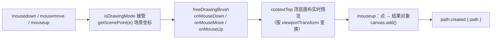

import { Canvas, Controls, Meta } from '@storybook/addon-docs/blocks';
import * as FreeDrawing from './free-drawing.stories';

<Meta of={FreeDrawing} name="Docs" />

# 自由绘制

自由绘制是 Fabric.js 内置的"画板模式"：把 `canvas.isDrawingMode` 打开，鼠标的按下 / 移动 / 抬起就不再走点选与变换管线，而是把**场景坐标点流**交给挂在 `canvas.freeDrawingBrush` 上的笔刷；笔刷在顶层画布上实时预览，松手时把攒下的点转换成**一个普通对象**加入画布，并触发 `path:created` 把结果交回给你。产出什么对象由笔刷决定——`PencilBrush` / `PatternBrush` 产出 `Path`，`CircleBrush` / `SprayBrush` 产出 `Group`——之后的选择、编辑、序列化与手写的对象完全一致。坐标与视口的关系见[视口与坐标](?path=/docs/viewport--docs)，鼠标事件族的完整说明见[事件系统](?path=/docs/events--docs)。



画布侧入口（交互 `Canvas` 才有，`StaticCanvas` 上不存在）：

| 属性 | 默认值 | 管什么 | 回查要点 |
| --- | --- | --- | --- |
| isDrawingMode | false | 把鼠标 down/move/up 转交笔刷 | 开启时按下会先丢弃当前选中；不挂笔刷则无任何效果 |
| freeDrawingBrush | undefined | 真正干活的笔刷实例 | 需要自建并挂载；换笔刷 = 换挂载实例 |
| freeDrawingCursor | 'crosshair' | 绘制模式下的悬停光标 | mousemove 期间持续设置 |

BaseBrush 公共配置（四种笔刷通用，直接写在笔刷实例上）：

| 属性 | 默认值 | 管什么 | 回查要点 |
| --- | --- | --- | --- |
| color | 'rgb(0, 0, 0)' | 笔刷颜色 | Pencil 系成为生成 Path 的 stroke；圆点 / 喷雾成为子对象 fill；带透明度时预览整帧重画 |
| width | 1（CircleBrush / SprayBrush 覆盖为 10） | 笔刷粗细 | Pencil 系成为 strokeWidth；圆点决定半径区间、喷雾决定散布半径 |
| shadow | null | Shadow 实例 | 克隆进结果对象且 affectStroke = true；预览按 zoom × retina 缩放 |
| strokeLineCap | 'round' | 线帽（butt / round / square） | 传给生成 Path |
| strokeLineJoin | 'round' | 转角（bevel / round / miter） | 传给生成 Path |
| strokeMiterLimit | 10 | miter 转角上限 | 传给生成 Path |
| strokeDashArray | null | 虚线数组 | 传给生成 Path |
| limitedToCanvasSize | false | 越界点丢弃 | true 时 onMouseMove 忽略画布外的指针 |

各笔刷专属配置（写在对应实例上）：

| 属性 | 默认值 | 管什么 |
| --- | --- | --- |
| PencilBrush.decimate | 0.4 | 松手前抽稀：丢弃距离小于该值（按 zoom 折算）的中间点，0 关闭 |
| PencilBrush.straightLineKey | 'shiftKey' | 按住该修饰键拖出直线；设为 null / 非法键名关闭 |
| PencilBrush.drawStraightLine | false | 直线模式的内部状态，由上面的键驱动，不手动设置 |
| CircleBrush.width | 10 | 圆点半径在 [max(0, w−20), w+20] / 2 内随机 |
| SprayBrush.width | 10 | 喷雾散布半径（w / 2） |
| SprayBrush.density | 20 | 每次事件喷多少个点 |
| SprayBrush.dotWidth | 1 | 点（小方块）边长 |
| SprayBrush.dotWidthVariance | 1 | 点边长随机浮动，0 为等大 |
| SprayBrush.randomOpacity | false | 点透明度随机 |
| SprayBrush.optimizeOverlapping | true | 按 (left, top) 去掉同位置的点 |
| PatternBrush.source | undefined | 图案源，任意 CanvasImageSource；缺省用内置圆点图案 |

## 快速上手

```ts
import { Canvas, PencilBrush } from 'fabric';

const canvas = new Canvas(el);
canvas.freeDrawingBrush = new PencilBrush(canvas); // 真正干活的笔刷要自己挂
canvas.isDrawingMode = true;                      // 鼠标事件从此转交笔刷

canvas.freeDrawingBrush.color = '#2563eb';        // 参数直接写在实例上
canvas.freeDrawingBrush.width = 8;

canvas.on('path:created', (e) => {
  console.log(e.path.constructor.type, canvas.size()); // 'Path' 1
});
```

开关（`isDrawingMode`）与执行者（`freeDrawingBrush`）缺一不可：只开开关不挂笔刷，画布看似进入绘制模式（光标变 crosshair），但什么也画不出来。关掉开关后已画对象原样留在画布上，可点选、拖动、缩放。

## 开关与挂载

`isDrawingMode` 为 true 时，`Canvas.__onMouseDown` 不再走目标发现与变换，而是进入绘制分支：先丢弃当前活动对象（绘制态与编辑态互斥），用 `getScenePoint(e)` 算出**场景坐标**，调用 `freeDrawingBrush.onMouseDown(pointer, { e, pointer })`；move 期间调用 `onMouseMove` 并把光标设为 `freeDrawingCursor`；up 时以 `onMouseUp({ e, pointer })` 的返回值更新内部"仍在绘制"标记——返回 true 表示继续阻塞交互（非主事件时），false 结束本轮。mouse:down / move / up 事件族在绘制模式下照常派发（见[事件系统](?path=/docs/events--docs)）。

三个要点：

- **笔刷必须自己挂**。`freeDrawingBrush` 默认是 `undefined`，`new PencilBrush(canvas)` 时把画布传进构造器，之后由画布在事件里回调它。
- **切效果改属性，切笔刷换实例**。同一实例上改 `color` / `width` 立即生效（下一次落笔）；换成另一种笔刷就 `canvas.freeDrawingBrush = new CircleBrush(canvas)`。
- **开关不清理画布**。`isDrawingMode = false` 只是把鼠标还给编辑管线，已生成的对象纹丝不动。

<Canvas of={FreeDrawing.Interactive} />
<Controls of={FreeDrawing.Interactive} />

| 读者操作 | 可核对结果 |
| --- | --- |
| 用 PencilBrush 画一笔松手 | 「最近事件」变 path:created，「对象类型」Path，「path 命令数」≥ 2（典型曲线为几十），「对象总数」+1 |
| 按下后不动直接松手（单击） | readout 无变化——空路径保护，不产出对象、不触发事件 |
| 按住 shift 拖动 | 直线，「path 命令数」缩到 2（M + Q 各一条） |
| 把「抽稀距离」拉到 5 再慢慢画同一条线 | 命令数明显变少——decimate 把过近的中间点丢了 |
| 关掉「绘制模式」后点选笔迹 | 出现选中框，可拖动 / 缩放——产出的是普通对象 |
| 重新打开「绘制模式」后按下 | 上次选中被丢弃——绘制分支先 discardActiveObject |

## 四种内置笔刷

四个类都继承 `BaseBrush`，共享上表的公共配置与 `onMouseDown` / `onMouseMove` / `onMouseUp` 生命周期；差异集中在两点：**过程渲染怎么画**（顶层画布上的预览方式）与**松手产出什么对象**。

| 笔刷 | 过程渲染 | 松手产出 | event.path 是 |
| --- | --- | --- | --- |
| PencilBrush | 增量画平滑段（quadraticCurveTo 中点法） | Path：fill: null、stroke = color、strokeWidth = width | Path |
| CircleBrush | 每次事件叠一个随机半透明圆点 | 一群 Circle 组成的 Group | Group |
| SprayBrush | 每次事件喷一簇随机小方块 | 一群 Rect 组成的 Group（默认去重） | Group |
| PatternBrush | 同 PencilBrush，strokeStyle 换成图案 | stroke 为 Pattern 实例的 Path | Path |

### PencilBrush

最常用的"铅笔"。生命周期：`onMouseDown` 清空点集并把 BaseBrush 配置（颜色、宽度、线帽、虚线、阴影）应用到顶层画布上下文；`onMouseMove` 每来一个点就用二次曲线画**最新一段**（上一段终点作控制点、中点作终点）——增量渲染让绘制耗时与已画长度无关；带透明度的颜色、shadow 或直线模式会触发整帧重画（`needsFullRender`）。`onMouseUp` 收尾：

1. **抽稀**：`decimate`（默认 0.4）丢弃与上一点距离小于该值的中间点（首尾点保留），距离阈值按 `canvas.getZoom()` 折算——放大视口时，屏幕上更近的点也计入"够远"；
2. **转路径**：点集经 `getSmoothPathFromPoints(points, width / 1000)` 变成 `M` 起、`Q` 串、`L` 收的平滑路径（修正量 `width / 1000` 保证极短笔迹也有可渲染长度）；路径命令的意义见[路径](?path=/docs/path--docs)；
3. **空路径保护**：按下后没动就松手，路径是 `M 0 0 Q 0 0 0 0 L 0 0`，直接放弃——单击不产出对象；
4. **生成 Path**：`new Path(pathData, { fill: null, stroke: color, strokeWidth: width, strokeLineCap, strokeLineJoin, strokeMiterLimit, strokeDashArray })`，有 shadow 时用 `new Shadow(this.shadow)` 克隆并置 `affectStroke = true`（阴影挂在描边上，Shadow 构造见[填充、描边与阴影](?path=/docs/fill-stroke-shadow--docs)）。

生成的 Path 与手写的完全同构：路径数据保持绘制时的**场景坐标**，`pathOffset` 是包围盒中心，`left` / `top` 定位到包围盒中心（readout 的「pathOffset」可直接核对）——机制细节见[路径](?path=/docs/path--docs)。

直线模式：按住 `straightLineKey`（默认 `'shiftKey'`）期间，每次 move 都**替换**最后一个点而非追加，于是只剩起终点两个点；设为 `null` 或任意非修饰键名即关闭。`drawStraightLine` 是这一过程的内部状态，不要手动设置。

| 读者操作（上方实验台） | 可核对结果 |
| --- | --- |
| 慢速画一条长曲线 | 「path 命令数」为几十——每个保留下来的点一条 Q 命令 |
| 同样的线把「抽稀距离」调到 0 | 命令数变多（所有 move 点都保留）；调到 5 变少 |
| 按住 shift 拖动 | 命令数 2；「stroke / strokeWidth / pathOffset」仍正常记录 |

### CircleBrush

"圆珠笔"质感：`onMouseMove` 每次事件 `addPoint` 一个圆点——半径在 `[max(0, width - 20), width + 20] / 2` 内随机，填充色是 `color` 加随机透明度（0–1），所以快速拖动点稀疏、慢速拖动点密集成链。`onMouseUp` 把每个点变成一个 `Circle`（`originX` / `originY` 为 center，`left` / `top` 即点坐标），组成一个 `Group` 一次性加入画布（期间临时关闭 `renderOnAddRemove` 避免逐个重绘）。

`event.path` 拿到的是 **Group**，不是 Path：后续按[分组与多选](?path=/docs/group-selection--docs)的方式处理子对象。

| 读者操作（上方实验台） | 可核对结果 |
| --- | --- |
| 切到 CircleBrush 慢速短拖 | 「对象类型」Group，「Group 子对象数」约等于移动事件数，「path 命令数」为 — |
| 加大「笔刷宽度」再画 | 圆点明显变大——半径区间随 width 抬升 |

### SprayBrush

喷枪：每次事件（down 与 move）在以指针为中心、`width / 2` 为半径的方形区域内随机撒 `density`（默认 20）个小方块，边长 `dotWidth ± dotWidthVariance`，`randomOpacity`（默认 false）控制透明度是否随机。`onMouseUp` 每个方块一个 `Rect`（`fill` = `color`），`optimizeOverlapping`（默认 true）按 `(left, top)` 去掉同位置的重复点后组成 `Group`（`objectCaching: true`、`subTargetCheck: false`、`interactive: false`——成组只为整体编辑，不提供子级交互）。

| 读者操作（上方实验台） | 可核对结果 |
| --- | --- |
| 切到 SprayBrush 画一笔 | 「对象类型」Group；在原地来回重复喷涂，「Group 子对象数」增长越来越慢——同位置的重复点被 optimizeOverlapping 去掉 |
| 加大「笔刷宽度」再喷 | 喷雾散布范围变大 |

### PatternBrush

`PatternBrush extends PencilBrush`：整条流水线（抽稀、平滑、空路径保护、产出 Path）原样继承，只覆写两处：

- 预览时 `_setBrushStyles` 把 `strokeStyle` 换成 `ctx.createPattern(source || getPatternSrc(), 'repeat')`；
- 生成的 Path 的 `stroke` 是 `new Pattern({ source, offsetX, offsetY })`，偏移按路径左上角 + 半个 strokeWidth 对齐，让图案从笔迹起点铺起。

`source` 可以是任意 `CanvasImageSource`（图片、视频帧、离屏画布）；缺省时 `getPatternSrc()` 现画一个 20px 圆点 + 5px 间距的图案，**颜色取 `brush.color`**。官方 demo 里的 hline / vline / square / diamond 纹理是 demo 侧手绘 source 的示例代码，不在库里。Pattern 填充的完整机制见[渐变与图案](?path=/docs/gradients-patterns--docs)。

| 读者操作（上方实验台） | 可核对结果 |
| --- | --- |
| 切到 PatternBrush 画一笔 | 「对象类型」Path，「stroke」显示 Pattern（图案），「strokeWidth」仍是笔刷宽度 |
| 换「笔刷颜色」再画 | 圆点图案的颜色跟着变——内置图案每次落笔用 color 重画 |

## path:created 与结果处理

三个统一约定（四种笔刷一致，个别差异随条目标注）：

- 触发顺序（Pencil 系源码）：`before:path:created` `{ path }` → `canvas.add(path)` → `requestRenderAll()` → `path.setCoords()`（仅 Pencil 系；Circle / Spray 的 Group 不调）→ `path:created` `{ path }`；
- 事件载荷类型是 `{ path: FabricObject }`——Pencil 系里它是 Path，圆点 / 喷雾里它是 Group，取属性前先判断；
- 结果对象已 `setCoords`，可直接参与命中与变换。

常见处理模式：

```ts
canvas.on('path:created', (e) => {
  const drawn = e.path;
  drawn.set({ selectable: false });   // 画完即锁：不许再点选编辑
  canvas.requestRenderAll();          // set 后自己刷新
});

canvas.on('before:path:created', (e) => {
  e.path.set({ strokeUniform: true }); // 入画布前统一改属性也可以
});
```

想"绘制阶段自由、编辑阶段锁定"就用开关切换：绘制时 `isDrawingMode = true`，编辑窗口期关掉让用户调整，业务上再决定是否回锁。序列化时这些对象与手写对象走同一套 `toJSON`（见[序列化](?path=/docs/serialization--docs)）。

## 坐标与视口

笔刷拿到的 `pointer` 一律是**场景坐标**（v7 `canvas.getScenePoint(e)`；v5 / v6 的 `getPointer(e, true)` 等价，v7 中 `getPointer` 已标记废弃），不是屏幕像素。预览绘制在顶层画布 `contextTop` 上，笔刷渲染前把 `viewportTransform` 应用到上下文——缩放 / 平移画布时笔迹跟着视口走、视觉粗细同步缩放。两个细节：

- `shadow` 的 blur / offset 在预览里按 `getZoom() × getRetinaScaling()` 缩放，保证预览与最终对象视觉一致；
- `decimate` 的抽稀距离阈值除以 zoom 折算。

产出的对象用场景坐标记录：放大视口下画的一笔，与 100% 下画的处在同一坐标系，导出（multiplier）与命中都不受视口状态影响。`viewportTransform` 的完整机制见[视口与坐标](?path=/docs/viewport--docs)。

## 橡皮擦

如实说明 7.4.0 的状态：**`fabric` 主包不含 EraserBrush**。包入口只导出 `BaseBrush` / `PencilBrush` / `CircleBrush` / `SprayBrush` / `PatternBrush` 五个笔刷类；`CanvasEvents` 类型里保留着 `erasing:start` / `erasing:end`（含 `path` / `targets` 等字段），那是给外部实现预留的事件挂点，主包内没有触发者。

沿革与现状：

- v4 / v5：EraserBrush 是**可选 erasing 模块**，自定义构建勾选后才有全局的 `fabric.EraserBrush`；
- v6 重写时移出核心（维护者确认：作为核心功能需要 SVG 导出等全链路支持，成本过高）；7.4.0 包的官方扩展子路径 `fabric/extensions`（对齐参考线、裁剪控件、渐变控件、手势集成、数据更新器）里同样没有 eraser，按需引入清单见[扩展包](?path=/docs/extensions--docs)；
- 社区接续项目是 **Erase2d**（`@erase2d/fabric` 绑定，自述基于 PencilBrush 做绘制交互，另有旧版 JSON 的迁移注意点）。

需要"擦除"效果时的两条自制路线：合成层面的 `globalCompositeOperation: 'destination-out'` 笔刷，或对象层面的 clipPath 反遮罩（见[裁剪与遮罩](?path=/docs/clip-path--docs)）；引入社区包前按[扩展包](?path=/docs/extensions--docs)的评估口径检查维护状态。

## 最佳实践

- 笔刷实例复用：一次 `new` 之后改 `color` / `width` / `decimate` 即可切换效果，换笔刷类型才换挂载引用；不要每次落笔前重建实例。
- 高频手写优先 PencilBrush：它是增量渲染（只画最新一段），长笔迹不变慢；带透明度的颜色、shadow、直线模式会退化为整帧重画，大批量绘制尽量避开这个组合。
- 路径体积控制：`decimate` 适当调大（注意按 zoom 折算）；CircleBrush / SprayBrush 产出多子对象 Group，长笔迹子对象数可观，重交互场景优先 PencilBrush。
- 绘制态与编辑态互斥切换：绘制期间用户不能选对象（按下即丢弃选中），编辑前先关 `isDrawingMode`；"画完即锁"的需求放 `path:created` 里 `selectable: false`。
- 白板类应用开 `limitedToCanvasSize: true`，防止笔迹跑出画布边界。

## 常见问题

- 开了 isDrawingMode 却画不出任何东西
  `freeDrawingBrush` 默认 undefined，先挂实例：`canvas.freeDrawingBrush = new PencilBrush(canvas)`。光标变 crosshair 只说明开关生效，不代表有笔刷。
- 单击画布没有对象产生、path:created 也不触发
  正常：按下后没有移动，PencilBrush 判定空路径（`M 0 0 Q 0 0 0 0 L 0 0`）直接放弃。需要"点一下出个点"要自己在 `mouse:up` 里补对象。
- path:created 里拿到的不是 Path，序列化 / 属性对不上
  CircleBrush / SprayBrush 的 `event.path` 是 Group（子对象是 Circle / Rect），只有 PencilBrush / PatternBrush 产出 Path；先判断类型再取属性。
- 画出的笔迹总被误拖动
  编辑态下笔迹就是普通对象。画完即锁：`path:created` 里 `set({ selectable: false })`，或整个画布用 `isDrawingMode` 管好两种状态的切换。
- 路径数据很大、绘制卡顿
  调大 `decimate`（0 关闭抽稀会保留全部 move 点）；半透明色 + shadow 会触发整帧重画，去掉组合；喷雾 / 圆点改用 PencilBrush。
- 从 v5 迁移，笔刷代码全部报 undefined
  全局 `fabric.PencilBrush` 写法换成命名导入 `import { PencilBrush } from 'fabric'`；`canvas.getPointer(e, true)` 换 `getScenePoint(e)`；v5 自定义构建里的 EraserBrush 在 v6+ 不再提供（见上文"橡皮擦"）。

## 总结回顾

摘要：

自由绘制由"开关 + 笔刷 + 结果对象"三层组成：`isDrawingMode` 把鼠标事件变成 `getScenePoint` 的场景坐标点流并转交 `freeDrawingBrush`（不挂笔刷则无效果，按下会丢弃当前选中）；四种内置笔刷共享 BaseBrush 的 color / width / shadow / 线帽线角 / 虚线 / limitedToCanvasSize 配置，差异在过程渲染与产出——PencilBrush 增量画平滑段、松手经 decimate 抽稀转成 `M/Q/L` 的 Path（fill: null、stroke = color，shift 可画直线，空路径不产出），CircleBrush / SprayBrush 分别把随机圆点与小方块攒成 Group，PatternBrush 继承 Pencil 全流程只是把 stroke 换成 Pattern；`path:created`（前有 `before:path:created`）统一交出结果对象，之后的编辑、锁定、序列化与手写对象一致；坐标全程走场景系，预览按 viewportTransform 变换、抽稀与阴影按 zoom 折算；EraserBrush 不在 7.4.0 主包与官方 extensions 中，v6 起由社区 Erase2d 接续。

一句话：

> 自由绘制的产物不是特殊笔迹，而是普通对象——isDrawingMode 决定鼠标何时变成点流，freeDrawingBrush 决定这些点松手后变成 Path 还是 Group，path:created 把它交回给你的对象模型。

知识要点：

- isDrawingMode 与 freeDrawingBrush 各自管什么？只开开关不挂笔刷会怎样？
- 绘制模式下按下鼠标时对当前选中对象做了什么？
- 四种内置笔刷各自产出什么对象？event.path 分别是什么类型？
- BaseBrush 有哪些公共配置、默认值分别是多少？哪些会传给生成的 Path？
- PencilBrush 生成的 Path 为什么 fill 是 null？路径数据与 left / top 的关系是什么？
- decimate 什么时候生效？距离怎样按 zoom 折算？0 意味着什么？
- 怎么用修饰键画直线？怎么关闭这个功能？
- 按下后不动就松手，为什么没有对象也没有事件？
- before:path:created 与 path:created 的触发顺序和典型用法差异？
- 笔刷收到的坐标是什么系？预览渲染与 viewportTransform 的关系？shadow 预览按什么缩放？
- EraserBrush 在 7.4.0 的真实状态是什么？社区接续方案叫什么？

## 参考资料

- [官方 API：BaseBrush（公共配置与默认值）](https://fabricjs.com/api/classes/basebrush/)
- [官方 API：PencilBrush（decimate / straightLineKey 与生命周期）](https://fabricjs.com/api/classes/pencilbrush/)
- [官方 API：CircleBrush](https://fabricjs.com/api/classes/circlebrush/)
- [官方 API：SprayBrush（density / dotWidth 族）](https://fabricjs.com/api/classes/spraybrush/)
- [官方 API：PatternBrush（source 与图案生成）](https://fabricjs.com/api/classes/patternbrush/)
- [官方 demo：Free drawing（四种笔刷与图案变体）](http://fabricjs.com/demos/freedrawing/)
- [old-docs：fabric-intro-part-4（自由绘制章节，v5 写法对照）](https://fabricjs.com/docs/old-docs/fabric-intro-part-4/)
- [GitHub 源码：v7.4.0 brushes/（Canvas 事件分支、笔刷生命周期与默认值核对）](https://github.com/fabricjs/fabric.js/tree/v740/src/brushes)
- [GitHub Discussion #11071：Erasing 移出核心与 Erase2d（维护者确认）](https://github.com/fabricjs/fabric.js/discussions/11071)
- [CHANGELOG（decimate v3.1.0 / limitedToCanvasSize v4.4.0 / straightLineKey v5.0.0 的引入版本）](https://github.com/fabricjs/fabric.js/blob/master/CHANGELOG.md)
