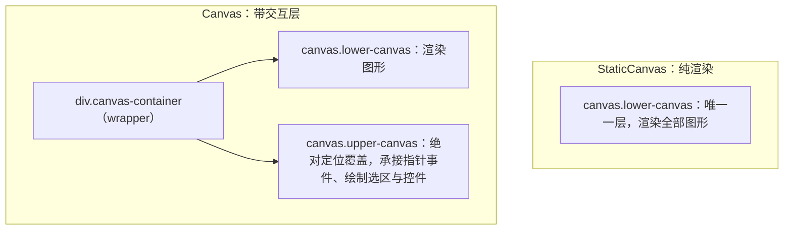

import { Canvas, Controls, Meta } from '@storybook/addon-docs/blocks';
import * as GettingStarted from './getting-started.stories';

<Meta of={GettingStarted} name="Docs" />

# 安装与第一个画布

本课把 Fabric.js 第一次落进项目：安装、创建画布、渲染第一个图形。读完你应能判断三件事——安装入口为什么是 `fabric` 一个包、`Canvas` 与 `StaticCanvas` 各建出什么样的画布、`canvas.add()` 之后画面为什么会自己更新。正文实例提供画布类型、尺寸、背景色、第一个图形与框选开关五类输入，调整任意一项都能直接观察构造选项的真实影响。

画布构造选项默认值回查表（fabric 7.4.0 实测）：

| 选项 | 默认值 | 说明 |
| --- | --- | --- |
| `width` / `height` | 未传时取 `` <canvas> `` 元素的同名属性（新元素为 300 × 150） | 逻辑像素；开启 retina 缩放时背板尺寸再乘 `devicePixelRatio` |
| `backgroundColor` | `''`（透明） | 颜色字符串，也接受 Gradient / Pattern |
| `renderOnAddRemove` | `true` | `add` / `remove` 等改动后自动请求渲染 |
| `enableRetinaScaling` | `true` | 高分屏上放大画布背板，渲染保持清晰 |
| `selection` | `true`（仅 `Canvas`） | 空白处拖拽框选的开关 |
| `selectionColor` | `'rgba(100, 100, 255, 0.3)'`（仅 `Canvas`） | 框选矩形的填充色 |
| `preserveObjectStacking` | `true`（仅 `Canvas`） | 选中对象时不临时置顶 |
| `defaultCursor` | `'default'`（仅 `Canvas`） | 画布默认光标 |
| `viewportTransform` | `[1, 0, 0, 1, 0, 0]` | 恒等视口矩阵，缩放平移见[视口与坐标](?path=/docs/viewport--docs) |

## 快速上手

安装并把一个可拖动的矩形画出来，三步：

```bash
npm install fabric
```

页面里放一个带尺寸的 canvas 元素（尺寸也可以改由构造选项传入）：

```html
<canvas id="stage" width="480" height="280"></canvas>
```

创建交互画布并加入第一个图形：

```ts
import { Canvas, Rect } from 'fabric';

const canvas = new Canvas('stage', { backgroundColor: '#f8fafc' });
canvas.add(new Rect({ left: 240, top: 140, width: 140, height: 90, fill: '#4f7cff' }));
```

`add()` 默认会自动请求下一帧渲染，不需要手动调用渲染方法。页面上出现蓝色矩形，点击可选中、拖动可移动——这就是交互画布。

## 安装与包结构

### npm 与 CDN

npm 安装（yarn / pnpm 同理）：

```bash
npm install fabric
```

v6 起的正式写法是 ESM 命名导入，本手册统一采用：

```ts
import { Canvas, StaticCanvas, Rect, Circle } from 'fabric';
```

不用构建工具时，用 CDN 的 UMD 构建，所有导出挂在全局 `fabric` 对象上：

```html
<canvas id="stage" width="480" height="280"></canvas>
<script src="https://cdn.jsdelivr.net/npm/fabric@latest/dist/index.min.js"></script>
<script>
  const canvas = new fabric.Canvas('stage');
  canvas.add(new fabric.Rect({ left: 240, top: 140, width: 140, height: 90, fill: '#4f7cff' }));
</script>
```

两种引入的差异：`fabric.Canvas` 这类命名空间写法只在 UMD 全局下成立；ESM 下必须逐个命名导入，`import { fabric } from 'fabric'` 并不存在（见常见问题）。Node 端入口是 `fabric/node`，依赖 node-canvas 与 jsdom 提供 canvas / window 实现，用于服务端渲染与离屏导出——本手册聚焦浏览器端，不展开。官方支持的浏览器为 Chrome 64+、Firefox 58+、Safari 11+（Chromium 版 Edge 与 Opera 同级）。

### 包结构：fabric 与 @fabricjs/\*

`fabric` 包内有四个安装入口：

| 入口 | 内容 | 何时使用 |
| --- | --- | --- |
| `fabric` | 打包好的浏览器构建（ESM / CJS / UMD） | 浏览器项目默认入口 |
| `fabric/es` | 未打包 ESM，利于 tree-shaking | 深度裁剪体积时；官方提示该入口下 `loadFromJSON` 与 SVG 加载不保证可用 |
| `fabric/node` | Node 构建，持有 node-canvas / jsdom 依赖 | 服务端渲染、离屏导出 |
| `fabric/extensions` | 官方扩展（对齐参考线、裁剪控件等） | 需要官方扩展能力时 |

仓库层面，fabric.js 已把运行时拆成三个 workspace 包：`@fabricjs/browser`（新浏览器应用的推荐入口）、`@fabricjs/node`（Node 端入口，持有环境专属依赖）、`@fabricjs/core`（浏览器与 Node 共享的环境中立运行时），`fabric` 定位为兼容门面包。但截至 7.4.0（当前最新），这些 `@fabricjs/*` 包尚未发布到 npm——README 的推荐写法是已定案、待落地的方向。现阶段安装与使用入口只有 `fabric`。

## 两种画布

`Canvas` 与 `StaticCanvas` 共享同一构造签名 `(el?, options?)`，`el` 有三种取法：

- 裸 id 字符串，如 `'stage'`——注意不是 CSS 选择器，`'#stage'` 会找不到元素（见常见问题）；
- `` HTMLCanvasElement `` 元素引用；
- 省略——自动创建一块未挂载到页面的 canvas，适合离屏渲染或 Node 场景。

两类画布都会接管传入的元素：标记 `data-fabric` 属性，并把尺寸同时写入元素属性与内联样式（构造时显式传入的 `width` / `height` 优先生效）。区别在接管后建出的 DOM 结构：



### Canvas：带交互层的画布

`new Canvas(el, options)` 在图形层之上多建一块上层 canvas：指针事件、拖拽、框选、变换控件都发生在这一层。因此它多出一组交互选项（`selection`、`selectionKey`、`selectionColor`、`defaultCursor`、`preserveObjectStacking` 等，默认值见开场参考表），以及 `getActiveObject()` 这类选中态 API。把下方实例的画布类型切到「交互 Canvas」并点击图形：出现边框与角点控件，读数「选中对象」变为 `Rect`；在空白处拖拽出现蓝色框选矩形（正是 `selectionColor` 的默认值）。

### StaticCanvas：纯渲染的画布

`new StaticCanvas(el, options)` 没有上层 canvas 与事件层，只保留对象管理与渲染管线：`add` / `remove` / `requestRenderAll`、序列化与导出全部可用，指针操作无任何响应。适合只读展示、离屏合成与服务端渲染（Node 入口以它为主）。把实例的画布类型切到「静态 StaticCanvas」再点击图形——没有任何反应，读数「选中对象」显示「—（无交互层）」。

同一元素同一时刻只能被一个画布实例管理（`data-fabric` 标记互斥），切换类型必须先销毁再重建，下方实例演示的正是这件事。

## 第一个图形

图形对象先用选项创建，再交给画布：

```ts
import { Canvas, Rect } from 'fabric';

const canvas = new Canvas('stage'); // 元素已带 width=480 height=280
// originX / originY 默认 'center'：left / top 指图形中心的位置
const rect = new Rect({ left: 240, top: 140, width: 140, height: 90, fill: '#4f7cff' });
canvas.add(rect);
```

三个默认值决定这段代码的结果：

- `originX` / `originY` 默认 `'center'`，所以 `left: 240, top: 140` 把 140 × 90 矩形的中心放到 480 × 280 画布的正中。v5 默认是 `left` / `top`，照搬旧教程位置会对不上；另外 7.4.0 的 API 类型注释仍写着 `@default 'left'`，与运行时不一致，以实测为准。
- `fill` 默认 `'rgb(0,0,0)'`，省略时是黑色填充。
- `renderOnAddRemove` 默认 `true`：`add()` / `remove()` 等改动自动调用 `requestRenderAll()`，把渲染排到下一帧；需要同步立即重绘时才手动调用 `renderAll()`。刷新时机与双层渲染的细节见[渲染模型](?path=/docs/rendering-model--docs)。

不想手算坐标时，先把图形加进画布，再交给画布居中：

```ts
canvas.add(new Circle({ radius: 48, fill: '#4f7cff' }));
canvas.centerObject(canvas.item(0)); // 水平 + 垂直居中
```

`Circle`、`Triangle` 等图形的完整属性与用法见[基础图形](?path=/docs/basic-shapes--docs)；本课实例只需在三者间切换观察。

下方实例把本课全流程接在一起：按构造选项建画布（类型 / 尺寸 / 背景色 / 框选），加入第一个图形，读数给出可核对的运行状态。切换画布类型会先 `dispose()` 旧实例再重建——这是「同一元素不能同时挂两个画布」的可见后果。

<Canvas of={GettingStarted.Interactive} />
<Controls of={GettingStarted.Interactive} />

| 读者操作 | 可观察证据 |
| --- | --- |
| 切换「画布类型」 | 交互画布上点击图形出现控件、读数「选中对象」变化；静态画布点击无任何响应 |
| 拖动「画布宽度 / 画布高度」 | 画布与读数「画布尺寸」同步变化，图形自动保持居中 |
| 切换「背景色」 | 背景立即变化；选「默认 ''（透明）」时透出页面底色（默认值就是空字符串） |
| 切换「第一个图形」 | 图形在 `Rect` / `Circle` / `Triangle` 间替换，读数「选中对象」回到未选中 |
| 关闭「启用框选」（仅交互画布生效） | 空白处拖拽不再出现蓝色选区矩形 |
| 打开 Show code | 看到该 Canvas 实际执行的 `example.ts` |

## 最佳实践

- 画布类型按交互需求定：需要选择、拖拽、变换控件就用 `Canvas`；只渲染、只导出、或跑在 Node 上就用 `StaticCanvas`（无事件层，负担更小）。两者共享对象与渲染选项，切换的成本是销毁重建实例。
- 尺寸来源保持唯一：要么构造时显式传 `width` / `height`，要么保证元素的 width / height 属性正确；只靠 CSS 拉伸会让背板与显示尺寸不一致，画面模糊或错位，机制见[渲染模型](?path=/docs/rendering-model--docs)。
- 引入写法保持统一：`@fabricjs/*` 落地前一律从 `fabric` 命名导入；升级时留意官方包结构迁移说明，避免新旧入口混用加载出两份运行时。

## 常见问题

- 照 v5 教程写 `import { fabric } from 'fabric'`，运行时报 `undefined`。
  v6 起 ESM 只有命名导出，改写为 `import { Canvas } from 'fabric'`；`fabric.Object` / `fabric.Text` / `fabric.Image` 对应 `FabricObject` / `FabricText` / `FabricImage`（旧名仅作废弃别名保留）。script 标签的全局对象仍叫 `fabric`，`new fabric.Canvas(...)` 只在 UMD 下成立。
- `new Canvas('#stage')` 创建后页面上没有画布。
  第一参数是裸 id，不是 CSS 选择器；传 `'#stage'` 找不到元素时会静默创建一块未挂载的 canvas。改传 `'stage'` 或元素引用。
- 控制台报错 `Trying to initialize a canvas that has already been initialized. Did you forget to dispose the canvas?`
  同一元素被第二次初始化，常见于热更新或 StrictMode 双执行。先 `await canvas.dispose()` 再重建；本课实例切换画布类型时就是这么做的。
- `npm install @fabricjs/browser` 提示找不到包。
  `@fabricjs/*` 分包在仓库已定案但尚未发布到 npm（晚于 7.4.0）。当前一律安装 `fabric`；查阅社区资料时，把「推荐 `@fabricjs/*` 入口」的写法当作待落地的前瞻方向核对版本。

## 总结回顾

摘要：

fabric 7.4.0 的安装入口只有 `fabric` 一个包：默认入口、`fabric/es`、`fabric/node`、`fabric/extensions` 四个 subpath 覆盖不同场景，`@fabricjs/*` 分包是仓库已定案但未发布的方向。画布分两类：`Canvas` 建出 wrapper 加双层 canvas 的交互画布，`StaticCanvas` 是无事件层的纯渲染画布，二者共享 `(el?, options?)` 构造签名与对象管理 API。图形以选项创建、`canvas.add()` 加入画布；`originX` / `originY` 默认 `center`、`fill` 默认黑色、`renderOnAddRemove` 默认自动渲染，这三件事决定了第一段画布代码的样子。

一句话：

> `new Canvas(el, options)` 给你带交互层的画布，`new StaticCanvas` 只管渲染，`canvas.add(图形)` 默认自动把结果画出来。

知识要点：

- npm 与 CDN 两种安装方式分别怎么写？ESM 与 UMD 的导入差异是什么？
- `fabric` 的四个入口（默认 / `es` / `node` / `extensions`）各用于什么？`@fabricjs/*` 现在能装吗？
- `Canvas` 与 `StaticCanvas` 的 DOM 结构、能力与选择依据有什么不同？
- 构造时未传 `width` / `height` 会发生什么？
- `add()` 之后为什么不需要手动渲染？想让图形居中有哪两种做法？
- 图形的 `left` / `top` 默认相对什么位置？和 v5 有什么不同？

## 参考资料

- [Fabric.js 官方文档：Installing](https://fabricjs.com/docs/getting-started/installing/)
- [Fabric.js 官方文档：Your first app](https://fabricjs.com/docs/getting-started/helloworld/)
- [Fabric.js API 参考：Canvas](https://fabricjs.com/api/classes/canvas/)
- [Fabric.js API 参考：StaticCanvas](https://fabricjs.com/api/classes/staticcanvas/)
- [Fabric.js v6 升级指南（命名导入与 fabric/es 说明）](https://fabricjs.com/docs/upgrading/upgrading-to-fabric-60/)
- [GitHub 仓库 README（@fabricjs 包结构规划）](https://github.com/fabricjs/fabric.js)
- [Fabric.js v5 文档：fabric.Object（originX / originY 旧默认值对照）](https://fabric5.fabricjs.com/docs/fabric.Object.html)
