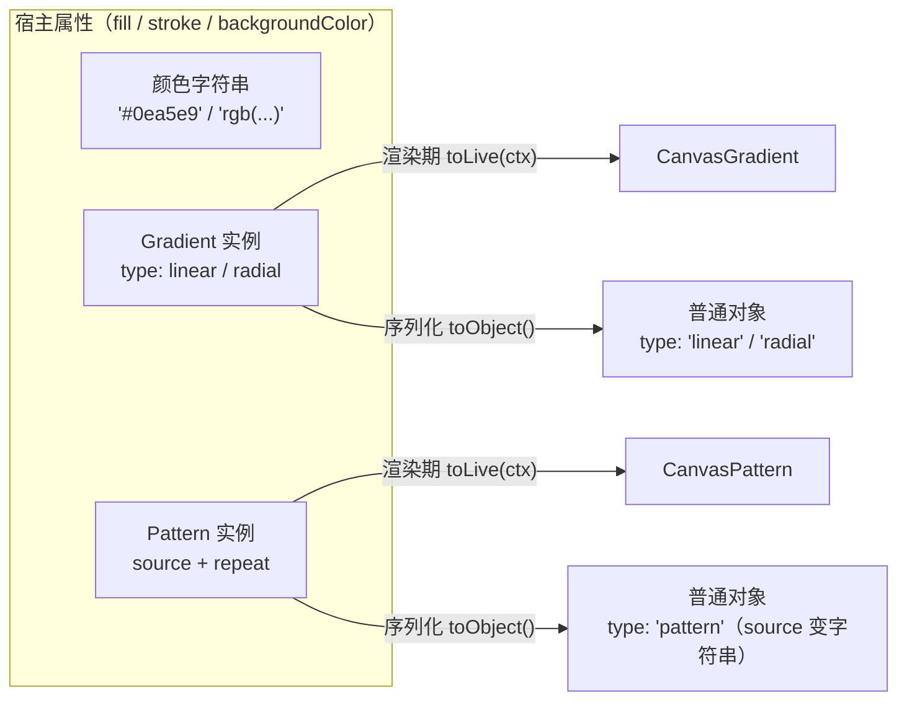

import { Canvas, Controls, Meta } from '@storybook/addon-docs/blocks';
import * as GradientsPatterns from './gradients-patterns.stories';

<Meta of={GradientsPatterns} name="Docs" />

# 渐变与图案

fill 与 stroke 的取值除了颜色字符串，还可以是两种"颜料"对象：Gradient（线性 / 径向渐变）与 Pattern（平铺图案）。它们不是画布上的对象——不出现在对象列表、不可选中、没有 left/top——而是挂在 `fill` / `stroke` / 画布 `backgroundColor` 上的属性值。本课讲清两类颜料的构造参数、坐标锚定规则（这是预测效果的关键）、复用与缓存更新的差别、以及序列化时的形态变化。纯色、描边参数与阴影见[填充、描边与阴影](?path=/docs/fill-stroke-shadow--docs)；作为图片源加载网络图、跨域的完整规则见[图片](?path=/docs/image--docs)。



| 颜料 | 构造关键输入（默认值） | 坐标 / 锚定 | 回查要点 |
| --- | --- | --- | --- |
| Gradient | type（'linear'）、gradientUnits（'pixels'）、coords（**默认全 0**）、colorStops（[]）、offsetX / offsetY（0 / 0）、gradientTransform（undefined） | 对象自身左上角的未缩放局部像素；percentage 模式改 0..1（X 按宽、Y 按高） | coords 默认全 0 画不出内容；v5 的 `setGradient` 与对象式 colorStops 均已失效 |
| Pattern | source（必填：canvas / img）、repeat（'repeat'）、offsetX / offsetY（0 / 0）、crossOrigin（''）、patternTransform（undefined） | 平铺锚点在对象自身左上角，随对象一起变换 | img 源须加载完，否则 `toLive` 返回 null；序列化时 source 变 src / dataURL 字符串 |

## 快速上手

```ts
import { Canvas, Gradient, Rect } from 'fabric';

const canvas = new Canvas(el, { width: 640, height: 360 });

const gradient = new Gradient({
  type: 'linear',
  coords: { x1: 0, y1: 0, x2: 280, y2: 0 }, // 对象左边 → 右边
  colorStops: [
    { offset: 0, color: '#0ea5e9' },
    { offset: 1, color: '#fde047' },
  ],
});

const rect = new Rect({ width: 280, height: 160, fill: gradient });
canvas.add(rect); // renderOnAddRemove 默认 true，自动请求重绘

rect.set('fill', gradient); // 事后赋值与写在构造 options 里等价
canvas.requestRenderAll(); // set() 只改属性，刷新时机见「渲染模型」
```

这是 v6+ 的唯一入口：v5 教程里的 `rect.setGradient('fill', {...})` 已随 v6 移除，`fabric` 包里没有这个方法（7.4.0 源码核对），只能 `new Gradient(...)` 后直接赋值。

## 渐变 Gradient

Gradient 可以填进对象的 `fill`、`stroke`，也可以作为画布的 `backgroundColor` / `overlayColor`（类型是 `TFiller | string`，画布上坐标锚定画布左上角）。理解它要抓住两点：

**coords 锚定在对象自己的坐标系。** 默认 `gradientUnits: 'pixels'` 时，coords 是对象**未缩放局部空间的像素**，原点在对象左上角：280×160 的矩形 x 取值 0..280、y 取值 0..160。对象之后缩放、旋转，渐变都像贴花一样随形走——旋转对象，渐变跟着转；放大对象，渐变跟着拉伸。渲染期对象内部调 `fill.toLive(ctx)` 换成 `ctx.createLinearGradient` / `ctx.createRadialGradient` 画进缓存位图（v7.4 没有 `toColor` 方法，.d.ts 与实现核对均无此名；社区旧文若提到，一律以 `toLive` 为准）。`gradientUnits: 'percentage'` 把 coords 换成 0..1 的比例值：X 乘对象宽、Y 乘对象高，允许超过 1 和负数。

**colorStops 是数组，不是对象。** 正确写法 `[{ offset: 0, color: '#0ea5e9' }, ...]`，offset 0..1；v5 的对象写法 `{ 0: 'red' }` 在 v6+ 构造时不会被识别（通常表现为画不出）。`addColorStop` 的签名也很怪：参数是 `Record<位置字符串, 颜色>`，如 `gradient.addColorStop({ 0.5: '#f43f5e' })`——新代码建议直接在构造 options 里写全数组。

同一个 Gradient 实例可以赋给多个对象（合法且常见）。但 pixels 单位下每个对象按**各自的宽高**解释 coords：`x2: 280` 在 280 宽的矩形上正好到右缘，在 88 宽的圆上早已越界——要跨对象视觉一致，用 percentage。

<Canvas of={GradientsPatterns.GradientLab} />
<Controls of={GradientsPatterns.GradientLab} />

| 读者操作 | 可核对结果 |
| --- | --- |
| 「渐变类型」切到 radial | 主矩形变径向；「coords」读数换成 内圆 / 外圆 形态 |
| 拖「线性轴角度」 | 颜色轴方向跟随；「coords」两端点绕对象中心 (140, 80) 对称变化 |
| 拖「中间色标 offset」 | 中间玫瑰色带移动；「色标 offset」读数同步 0 / x / 1 |
| 拖「对象旋转」 | 矩形带着渐变一起转——渐变贴在对象坐标系，不锚定画布 |
| 看右侧小圆 | 「矩形 / 圆共用」读数"同一实例"：同一个渐变在 88 宽的圆上只显示开头一小段颜色 |
| 开「就地修改」后拖「中间色标 offset」 | 读数前进、「缓存位图重画」停住、画面停在旧渐变 |
| 再开「手动置 dirty」 | 「缓存位图重画」+1，画面追上实例状态 |
| 打开 Show code | 看到该 Canvas 实际执行的 `example.ts` |

### 线性 linear

颜色沿一条轴从 `(x1, y1)` 渐变到 `(x2, y2)`；轴外的点按垂线投影取色，所以"角度"就是两端点的方向。端点习惯写成横贯对象的线段：

```ts
new Gradient({
  type: 'linear',
  coords: { x1: 0, y1: 0, x2: rect.width, y2: 0 }, // 左 → 右
  colorStops: [
    { offset: 0, color: '#0ea5e9' },
    { offset: 1, color: '#fde047' },
  ],
});
```

**默认 coords 全是 0**（源码 `linearDefaultCoords`），零长度轴在 Canvas 里画不出任何内容——构造时必须显式给端点，这是"新建渐变一片空白"的第一嫌疑。实验台的「线性轴角度」控件按"过对象中心、指定角度的整条直径"计算两端点，任意角度都能横贯整个矩形。

### 径向 radial

径向渐变在**两圆之间**插值：内圆 `(x1, y1, r1)` 上是 offset 0 的颜色，外圆 `(x2, y2, r2)` 上是 offset 1：

- 两圆同心、`r1: 0` → 中心一个纯色点光源，向四周淡出；
- 内圆心偏移 → 偏心的"侧光"效果（实验台「径向焦点偏移」）；
- `r1 > r2` 不报错，色标方向视觉反转（导出 SVG 时 fabric 会自动交换两圆再反转 offset）。

同样受"coords 默认全 0"影响：`r1 = r2 = 0` 的同心零半径画不出内容。

### gradientTransform 与 offsetX / offsetY

`gradientTransform` 是 6 元矩阵 `[a, b, c, d, e, f]`（TMat2D），在绘制前应用到渐变，原点是"对象左上角 + offsetX / offsetY"。它主要服务 SVG 渐变导入（`gradientTransform` 属性），手写场景也能用它做旋转、缩放。注意落点差别：

- **fill 上直接生效**：渲染时随 `_applyPatternGradientTransform` 一起变换；
- **stroke 上走兜底**：只要渐变带 `gradientTransform` 或 `percentage` 单位（或 Pattern 带 `patternTransform`），fabric 会走 `_applyPatternForTransformedGradient`——把渐变先画进一块临时 canvas 再当 pattern 贴，速度慢、分辨率受对象缓存尺寸限制。带变换的渐变优先放 fill。

`offsetX` / offsetY（默认 0）是 SVG 导入时的对齐补偿，平移直接写进 coords 端点或矩阵更直观，手写少用。

想在画布上直接拖拽调渐变，官方在 `fabric/extensions` 包提供 `createLinearGradientControls` 等控件工厂（目前仅线性、不支持 gradientTransform），见[扩展包](?path=/docs/extensions--docs)；SVG 渐变的导入 / 导出细节见[SVG 互操作](?path=/docs/svg--docs)。

## 图案 Pattern

Pattern 把一块位图源沿两个方向平铺。四个参数各有分工：

- **source（必填）**：`HTMLCanvasElement` 或 `HTMLImageElement`。canvas 源**同步可用**——程序化生成 tile 的首选，序列化也闭环；img 源必须**已加载完成**，`toLive` 会检查 `complete` 与 `naturalWidth / naturalHeight`，未加载完返回 null，填充直接空白。`crossOrigin`（默认 ''）只在序列化还原重新加载图片时生效。
- **repeat**：`'repeat'`（默认，双向平铺）、`'repeat-x'`（只横向一行）、`'repeat-y'`（只纵向一列）、`'no-repeat'`（只画一块，从锚点向右下）——语义与 CSS `background-repeat` 一致。
- **offsetX / offsetY**：平铺锚点相对**对象自身左上角**的偏移，不是相对画布，也不是对象中心。
- **patternTransform**：同格式 6 元矩阵，原点同锚点；SVG 导入常用，手写可旋转 / 缩放 tile。

和渐变同一坐标模型：贴花式锚定在对象坐标系，对象旋转缩放时图案跟着走。把 Pattern 当笔刷涂鸦（PatternBrush）是另一套用法，见[自由绘制](?path=/docs/free-drawing--docs)。

<Canvas of={GradientsPatterns.PatternLab} />
<Controls of={GradientsPatterns.PatternLab} />

| 读者操作 | 可核对结果 |
| --- | --- |
| 「平铺模式」切 repeat-x / repeat-y / no-repeat | 只剩横向一行 / 纵向一列 / 单块 tile——右下角黄块让 tile 不对称，方向差异可见 |
| 拖 offsetX / offsetY | tile 网格相对矩形左上角平移；小圆的网格同样随**它自己的**左上角平移 |
| 「tile 尺寸」切 24px | 平铺变密；「tile 尺寸」读数 24×24，「source 形态」仍是 canvas 元素 |
| 「patternTransform 旋转」拖到 45 | tile 网格绕矩形左上角锚点整体旋转 |
| 拖「对象旋转」 | 图案随矩形一起转（与渐变同一贴花机制） |
| 看「序列化 source」读数 | `data:image/png;…` 前缀与长度——canvas 源经 `toDataURL` 序列化成字符串 |

## 复用与缓存

fill / stroke 属于 `cacheProperties`：`set('fill', 新实例)` 时**引用变化**会自动置 `dirty`，下一帧重画对象缓存位图。反过来，**就地修改**（`gradient.colorStops[1].offset = 0.8`）不改变 fill 引用——set 缺席、不置 dirty，`requestRenderAll()` 只会把旧缓存位图再合成一次，画面停在旧渐变。修法二选一：

```ts
gradient.colorStops[1].offset = 0.8;

// 方式一（推荐）：换新实例赋值，自动置 dirty
rect.set('fill', buildGradient(nextOptions));

// 方式二：手动标记缓存失效
rect.set('dirty', true);
canvas.requestRenderAll();
```

实验台完整复现这条坑路径：开「就地修改」→ 拖色标（读数前进、画面停旧、「缓存位图重画」不动）→ 开「手动置 dirty」（计数 +1，画面追上）。共享实例给多个对象时更要注意：读的是同一份实例状态，想让每个对象都刷新，就对每个对象赋新实例或置 dirty。缓存机制全景见[渲染模型](?path=/docs/rendering-model--docs)。

## 序列化

对象 `toJSON()` / `toObject()` 时，fill 上的颜料自动降级成普通对象（`isSerializableFiller` 探测到 `toObject` 方法即调用）：

- Gradient → `{ type: 'linear' | 'radial', coords, colorStops, offsetX, offsetY, gradientUnits, gradientTransform }`，纯数据往返无损；
- Pattern → `{ type: 'pattern', source: 字符串, repeat, crossOrigin, offsetX, offsetY, patternTransform: null | 数组 }`。source 的来源决定字符串：img 用 `src`，canvas 经 `toDataURL()` 变 `data:image/png;base64,...`（实验台读数可见前缀与长度）。

`loadFromJSON` 复活是**异步**的：`Gradient.fromObject` 返回 Promise，`Pattern.fromObject` 还要 `loadImage` 重新取图——dataURL 不依赖网络，URL 源会再次请求（跨域需 crossOrigin）。手动从普通对象重建同样走 `await Gradient.fromObject(plain)`。

**出入点（v7.4 源码核实）**：`excludeFromExport` 只对画布 `backgroundColor` / `overlayColor` 与 clipPath 的序列化生效；挂在 fill / stroke 上的 Gradient / Pattern **不检查**这个标志，`toObject` 恒输出。想从导出里去掉填充，在序列化结果上后处理或临时换 fill。序列化全景见[序列化](?path=/docs/serialization--docs)。

## 最佳实践

- 跨对象统一视觉（同一颜料填多处、对象大小不一）用 `gradientUnits: 'percentage'`（0..1 按比例解释）；单对象按像素精确布局用默认 `pixels`，记住 X 上限是对象宽、Y 上限是对象高。
- 动态更新已渲染的渐变 / 图案，固定走"换新实例赋给 fill"路径——一行、自动 dirty；就地改 + 手动 dirty 容易漏一处停在旧画面。
- Pattern 源优先离屏 canvas：同步可用、可程序化生成、序列化成 dataURL 闭环；用网络图片必须等 `onload` 后再赋值并重渲染，跨域图配 `crossOrigin: 'anonymous'`（加载与跨域细节见[图片](?path=/docs/image--docs)）。
- 带 `gradientTransform` / percentage 的渐变放 fill 不放 stroke——stroke 会触发低分辨率兜底路径，又慢又糊。

## 常见问题

- 照 v5 教程写 `rect.setGradient('fill', {...})` 或 `colorStops: { 0: 'red' }` 不生效
  v6 起两处都变了：`setGradient` 方法已移除，colorStops 只认 `[{ offset, color }]` 数组。改写成 `rect.set('fill', new Gradient({ type, coords, colorStops }))`。
- 新建的渐变对象一片空白
  首查 coords：linear / radial 的默认坐标全是 0，零长度轴或同心零半径画不出任何内容；构造时必须显式给端点或圆参数。再查 colorStops 是否为空数组。
- 改了 `gradient.colorStops` / `coords`，画面不动
  就地修改不改变 fill 引用，缓存位图不会重画。换新实例赋值，或 `rect.set('dirty', true)` 后 `requestRenderAll()`。
- fill 直接塞普通对象（`{ type: 'linear', ... }`）既不报错也没效果
  v7 不会把普通对象包装成 Gradient（`shadow` 属性才会包装成 Shadow）；普通对象没有 `toLive`，渲染期被当成无效 fillStyle 忽略。用 `new Gradient(...)`，或 `await Gradient.fromObject(obj)` 异步重建。
- Pattern 用 `` 源有时空白
  图片未加载完时 `toLive` 返回 null。等 `img.onload` / `decode()` 后再赋值并重渲染，或改用离屏 canvas 源。
- 同一个渐变赋给多个对象，小对象上"只剩一种颜色"
  pixels 坐标按各自对象的宽高解释：`x2: 280` 在 88 宽的圆上远超圆的右缘，圆只覆盖轴的开头一小段，看起来接近起点色。跨对象一致改用 percentage。

## 总结回顾

摘要：

Gradient 与 Pattern 是填进 fill / stroke / backgroundColor 的"颜料对象"。渐变按 `type: 'linear' | 'radial'` 区分：线性沿 `(x1, y1) → (x2, y2)` 轴取色，径向在内圆 / 外圆两圆之间插值；coords 默认全 0，必须显式给出。坐标锚定在对象自身未缩放空间的左上角，percentage 模式换成按宽高的 0..1 比例；两种颜料都像贴花随对象变换。pattern 由 source（canvas 同步、img 须加载完）、repeat 四值、锚点偏移与 patternTransform 组成。更新走"换新实例赋值"才能自动置 dirty 重画缓存，就地修改要手动 `set('dirty', true)`。序列化时两者降级为带 type 字段的普通对象，Pattern 的 source 变字符串；`excludeFromExport` 对 fill / stroke 上的颜料不生效。

一句话：

> Gradient 与 Pattern 是锚定在对象自身左上角坐标系的"颜料"：换新实例赋给 fill 才会自动触发缓存重画，序列化时降级为带 type 字段的普通对象。

知识要点：

- v6+ 给对象填渐变 / 图案的唯一入口是什么？v5 的 `setGradient` 去哪了？
- coords 锚定在哪个坐标系？pixels 与 percentage 分别怎么换算？
- 线性 / 径向各自的 coords 字段是什么？默认值有什么陷阱？
- colorStops 的正确写法是什么？v5 的对象写法现在会怎样？
- `gradientTransform` 放 fill 与放 stroke 的路径差别是什么？
- Pattern 的 source 两种形态各要注意什么？repeat 四值分别铺成什么样？
- 就地修改渐变后画面为什么不动？两种修法是什么？
- 序列化时 fill 里的 Gradient / Pattern 变成什么形态？`excludeFromExport` 在 fill 上生效吗？

## 参考资料

- [官方指南：Using gradients](https://fabricjs.com/docs/using-gradients/)
- [官方 API：Gradient](https://fabricjs.com/api/classes/gradient/)
- [官方 API：Pattern](https://fabricjs.com/api/classes/pattern/)
- [旧版文档：Gradients（v5 对照）](https://fabricjs.com/docs/old-docs/gradients/)
- [官方演示：Patterns（图片源与 repeat 四值）](https://fabric5.fabricjs.com/patterns)
