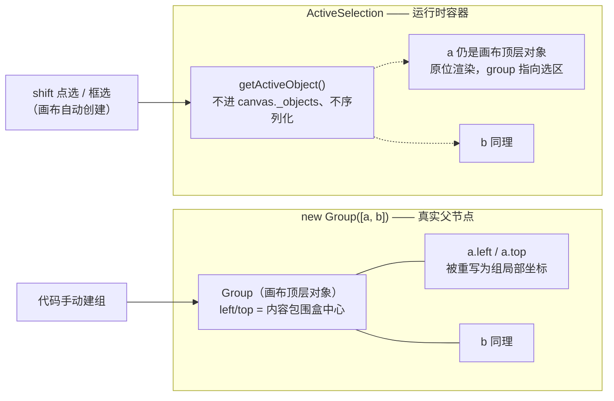

import { Canvas, Controls, Meta } from '@storybook/addon-docs/blocks';
import * as GroupSelection from './group-selection.stories';

<Meta of={GroupSelection} name="Docs" />

# 分组与多选

Group 和 ActiveSelection 是 Fabric.js 的两种"容器即对象"：都继承同一个 Group 基座（Collection 混入 + LayoutManager 布局系统），都持有 `_objects` 子对象列表、都能整体拖拽缩放旋转。差别在**归属**——`new Group([...])` 把子对象吸收成对象树的真实成员：子对象的 left/top 被重写进组局部坐标，画布顶层只剩组一个对象；ActiveSelection 则是画布的**运行时多选容器**：子对象仍留在画布对象列表上原位渲染，容器本身不进对象树、不序列化、取消选择即自动清空。预测任何建组 / 解组 / 多选操作的结果，抓住三件事：**坐标吸收**（进组时子对象坐标被重写）、**变换叠加**（组的 scaleX / angle 只进渲染矩阵，不改子对象自身属性）、**退出烘焙**（离开容器时累积的容器变换被折算进对象自身，视觉位置不变）。v6 起布局由 LayoutManager 统一驱动，v5 时代的 `toGroup` / `toActiveSelection` / `addWithUpdate` 已移除，配方见[建组与解组的完整配方](#建组与解组的完整配方)。



| 属性 / 成员（默认值） | 挂在哪 | 回查要点 |
| --- | --- | --- |
| subTargetCheck（false） | Group | true 才在组内命中子对象、`setCoords` 级联子对象 |
| interactive（false，deprecated） | Group | 点选组内对象需与 subTargetCheck 同开；官方计划用 setInteractive 取代 |
| layoutManager（`new LayoutManager()`，策略 fit-content） | Group / ActiveSelection | 组尺寸与中心的重算规则；ActiveSelection 固定用 ActiveSelectionLayoutManager |
| multiSelectionStacking（'canvas-stacking'） | ActiveSelection | 多选成员排序：画布层级顺序 / 点选先后顺序 |
| strokeWidth（0） | Group 自身默认值 | 组自身描边默认无（子对象描边不受影响） |
| getActiveObject() / getActiveObjects() | Canvas | 单选直接返回对象；多选返回 ActiveSelection 容器 / 摊平成数组 |

## 快速上手

```ts
import { Canvas, Circle, Group, Rect } from 'fabric';

const canvas = new Canvas(el, { width: 640, height: 360 });
const rect = new Rect({ left: 160, top: 180, width: 120, height: 80 });
const circle = new Circle({ left: 340, top: 180, radius: 50 });

const group = new Group([rect, circle]); // 对象不必先加入画布
canvas.add(group); // 画布顶层只有 group 一个对象

group.getObjects().length; // 2
rect.group === group; // true
group.left; // 245 —— 内容包围盒中心（v7 originX/originY 默认 center，left/top 即中心）
rect.left; // -85 —— 已被重写为组局部坐标（组中心为原点）
```

建组那一刻同时发生了三件事：子对象坐标吸收进组空间（`rect.left` 从 160 变 −85）、组的 left/top / width / height 由内容包围盒算出（291 × 101，含描边）、对象获得 `group` 与 `parent` 引用。若对象**已经在画布上**（例如从多选转建组），还需要同步画布列表——直接 `canvas.add(group)` 会残留复制品，见[建组与解组的完整配方](#建组与解组的完整配方)。

## Group 的创建与坐标吸收

**构造即吸收。** `new Group(objects?, options?)` 对每个对象执行 `enterGroup`（7.4.0 源码）：先从旧组移除（`object.group.remove(object)`）、写入 `parent` 引用，随后 LayoutManager 执行一次 `initialization` 布局——策略计算内容包围盒，`commitLayout` 把组 width / height 设为包围盒尺寸，再给每个子对象 left / top 加上同一个偏移，使子对象坐标落进"以内容中心为原点"的组局部空间；最后组的 left / top 取 `options.left / top`，未传则取包围盒中心（v7 originX / originY 默认 center，left / top 就是中心点；v5 默认 left / top 为左上角，对照见[序列化与版本对照](#序列化与版本对照)）。整组视觉位置不变——变的是坐标系。

- 显式传 `left / top`：组锚点钉在你给的位置，内容随之平移（子对象仍以内容中心对齐组原点）。
- 吸收只重写 left / top 与归属引用；子对象自身的 scaleX / angle / fill 等一律不动。
- `canEnterGroup` 拒绝两类非法输入并打 console 错误：把组加进自己 / 后代（循环树）、重复添加同一对象。
- 组是 Collection：`getObjects(...types)`、`item(i)`、`size()`、`isEmpty()`、`contains(obj, deep)` 与画布同构，层级调整（`bringObjectToFront` 等）也是同一套——遍历与层级见[对象管理](?path=/docs/stacking--docs)。

## 组变换与子对象

**组的变换活在矩阵里，不写进子对象属性。** `group.set({ scaleX: 2 })` 后：子对象自身 `scaleX` 仍是 1，`left / top` 也不变——渲染时子对象矩阵先与组矩阵相乘再上屏。要读"实际生效"的缩放用 `child.getTotalObjectScaling()`（自身 × 所有祖先容器）；要读画布上的真实位置用 `child.getCenterPoint()`（场景坐标）。矩阵与 originX / originY 的机制见[变换](?path=/docs/transform--docs)。

**组缩放绕组中心。** 内容中心即组的 origin 点：正好压在组中心的对象原地缩放，偏离中心的对象会被"推向远处"——这是理解组缩放后子对象场景坐标变化的关键。

**setCoords 只在 subTargetCheck 开启时级联。** `Group#setCoords` 重算自身角点后，仅当 `subTargetCheck: true` 才对每个子对象调用 `setCoords`（源码 `_shouldSetNestedCoords`）。关着它，组拖拽 / 缩放后子对象的 `oCoords`（命中测试与控件用的角点缓存）是陈旧的——这正是"组内命中需要 subTargetCheck"的机制根源；ActiveSelection 恒级联（它必须保证成员可命中）。要用 subTargetCheck 的读数证据，见下方实验台。

<Canvas of={GroupSelection.GroupSelectionLab} />
<Controls of={GroupSelection.GroupSelectionLab} />

| 读者操作 | 可核对结果 |
| --- | --- |
| 「场景状态」切到 成组 Group | 「画布顶层」只剩 `group`；「红块坐标」变为负的组局部值；「红块中心」与散件时相同——吸收不改视觉位置 |
| 切到 多选 ActiveSelection | 「画布顶层」仍是三个对象；「活动对象」变为 `activeselection`；`getActiveObjects` 为 3——多选容器不占有对象 |
| 拖「容器 scaleX」 | 「红块缩放」自身恒 1、总缩放随容器走——组变换不写子对象属性；红块偏离组中心，「红块中心」同步移动 |
| 在画布上拖动 / 缩放手柄 | 读数实时联动（object:moving / scaling / modified 驱动） |
| 画布上 shift 点选多个对象 | 画布自行创建 ActiveSelection，读数同步——与代码建容器的结果一致 |
| 多选状态下拖「容器 scaleX」后点空白处 | 取消选择时容器变换**烘焙**进对象：「红块缩放」自身变为 1.5——多选缩放不会随取消而丢失 |
| 开「省略 canvas.remove」再切到 成组 Group | 「画布顶层」变成 `rect · circle · triangle · group`，「序列化顶层」出现 `group(3)` 双写；拖动组，原位置残留复制品 |
| 成组后开「组内命中 subTargetCheck」并拖「容器 scaleX」 | 「子对象 oCoords」从"陈旧"变"已随组更新"——setCoords 级联的证据 |
| 打开 Show code | 看到该 Canvas 实际执行的 `example.ts` |

## 子对象的增删与布局重算

**增删自动触发对应布局。** `group.add(...)` / `insertAt` / `remove(...)` / `removeAll()` 走 Collection 的增删，随后 Group 触发 `added` / `removed` 布局（`_onAfterObjectsChange`）：默认 fit-content 策略下组重新按内容收缩 / 扩张，组中心也随内容重新居中——空口说不如数字：组 `100×50 + 80×60` 两块、加进 `left: 500` 的远块后，组宽从约 101 变约 581，中心右移。

**退出即烘焙。** 对象离开组（`remove` / `removeAll` / 转去别的容器）时，fabric 把组当前变换矩阵与对象矩阵相乘后**折算进对象自身**（源码 `exitGroup` → `applyTransformToObject`）：组放大 2 倍后 `group.remove(a)`，`a.scaleX` 从 1 变 2、left / top 换算回画布坐标，视觉大小与位置分毫不动。解组不"还原"，而是"结清"——想还原要自己记录初始值。剩余对象会立即按策略重排。

- 加入新组自动退出旧组（`enterGroup` 先 `object.group.remove(object)`），无需手动搬移；跨画布移动则要先从原画布 remove。
- 组上的层级调整（`bringObjectForward` 等）只重排组内顺序并置 dirty，不触发布局。
- 子对象的 `canvas` 引用随组联动：`canvas.add(group)` 时组把 canvas 引用下发给每个子对象。

## 布局策略

### LayoutManager 与触发时机

每个 Group 挂一个 `layoutManager`（属性，默认 `new LayoutManager()`，即 fit-content 策略）；`LayoutManager#performLayout` 在六类时机被触发（7.4.0 源码 `LayoutTrigger` 类型）：`initialization`（构造）、`added` / `removed`（组内增删）、`object_modifying` / `object_modified`（**子对象**自身变换——LayoutManager 会订阅子对象的 moving / scaling / rotating 等事件，因此只有能单独变换子对象的交互组实际用到）、`imperative`（手动 `group.triggerLayout(options?)`，可带 `strategy` / `overrides` / `bubbles` / `deep`）。布局前后组触发 `layout:before` / `layout:after`，画布触发 `object:layout:before` / `object:layout:after`（事件全景见[事件系统](?path=/docs/events--docs)）。策略可热切换：`group.layoutManager.strategy = new FixedLayout(); group.triggerLayout();`。三种内置策略决定同一件事——**这次布局后组的尺寸与中心怎么定**：

| 策略（constructor.type） | 何时重排 | 组尺寸 | 典型用途 |
| --- | --- | --- | --- |
| FitContentLayout（fit-content，默认） | 所有触发 | 内容包围盒 | 普通组合图形 |
| FixedLayout（fixed） | 仅 initialization / imperative / 策略切换 | 初始化时取传入的 width / height（缺省用内容包围盒），之后不随增删变化 | 固定画布式窗口、内容可超出 |
| ClipPathLayout（clip-path） | 同 fixed，且必须有 clipPath | 恒等于 clipPath 包围盒 | 裁剪窗口组（配合组 clipPath） |

### fit-content（默认）

`shouldPerformLayout` 恒真：增删、子对象变换、手动触发全部重排。上面"远块使组变宽"的数字就是它。

### fixed

初始化时尊重你传入的 `width / height`（`getInitialSize`：`target.width || 内容宽`），此后 add / remove **不**重排——新对象可能落在组的 width / height 之外（仍在组内、正常渲染，只是不撑大组）。注意"冻结"只针对自动触发：手动 `triggerLayout()` 会按当时内容包围盒重排。

### clip-path（组上的 clipPath）

ClipPathLayout 让组尺寸恒等于组 `clipPath` 的包围盒（`strokeWidth: 0` 的遮罩可得整数尺寸），内容超出窗口的部分被裁掉；`absolutePositioned` 遮罩时窗口钉在画布 / 父空间。组的 clipPath 语义（遮罩只取几何、锚定组几何中心、贴花式跟随）与对象级相同，见[裁剪与遮罩](?path=/docs/clip-path--docs)——本课只补"组 + 布局策略"这一层：建组时同时给 `layoutManager: new LayoutManager(new ClipPathLayout())` 与 `clipPath`，组的 bounds 与可见窗口从此由裁剪框决定。

<Canvas of={GroupSelection.LayoutStrategyLab} />
<Controls of={GroupSelection.LayoutStrategyLab} />

| 读者操作 | 可核对结果 |
| --- | --- |
| 「布局策略」保持 fit-content，开「远处加一块」 | 「组尺寸」从 278 × 105 变 483 × 187，「组 left/top」随内容重定位——所有触发都重排 |
| 切到 fixed（冻结）再开「远处加一块」 | 「组尺寸」保持建组时传入的 320 × 240 不变；远处块正常渲染但撑不大组 |
| 切到 clip-path（裁剪框） | 「组尺寸」= 200 × 140 恒等于「裁剪窗口」读数；再开「远处加一块」，尺寸不变且紫块被裁掉 |
| 切换策略 | 「序列化 layoutManager」随策略变为 `{"type":"layoutManager","strategy":"fixed"}` 等——策略随组往返 |
| 打开 Show code | 看到该 Canvas 实际执行的 `example.ts` |

## ActiveSelection 与选择管理

**运行时容器，不是对象树成员。** ActiveSelection 继承 Group，但：子对象**仍留在 `canvas.getObjects()` 里**原位渲染（v7 默认 `preserveObjectStacking: true`，成员按原层级绘制，选区只负责边框与控件）；容器本身不进对象列表、**不参与序列化**（`canvas.toObject()` 只输出画布顶层对象）；`shouldCache()` 恒 false（不缓存）；布局管理器固定为 ActiveSelectionLayoutManager——成员变换时通知成员**原来的组**而非选区自身。取消选择（`discardActiveObject` 或点空白）触发 `onDeselect` → `removeAll()`：容器清空，累积的选区变换烘焙进对象（多选缩放 1.5 倍后取消，成员自身 scaleX 就是 1.5）。

**画布会替你创建它。** shift 点选第二个对象时，`handleMultiSelection` 新建 `new ActiveSelection([], { canvas })` 并 `multiSelectAdd` 两个对象；再 shift 点选成员则从选区移除，减到 1 个时自动塌缩为单对象；框选松手时 `handleSelection` 用 `collectObjects` 收集包围盒命中的对象并 `setActiveObject(new ActiveSelection(objects, { canvas }))`（相交还是全含由 `selectionFullyContained` 决定）。这些交互行为的配置与约束见[拖拽与选择](?path=/docs/drag-select--docs)；本课聚焦数据结构与管理 API：

| API | 行为 |
| --- | --- |
| `canvas.setActiveObject(obj, e?)` | 设为唯一活动对象；传 ActiveSelection 即多选。返回是否生效 |
| `canvas.getActiveObject()` | 单选返回对象本身；多选返回 ActiveSelection 容器；无选择返回 undefined（7.4.0 .d.ts） |
| `canvas.getActiveObjects()` | 摊平：多选返回成员数组，单选返回 `[obj]`，无选择返回 `[]`——遍历选区一律用它 |
| `canvas.discardActiveObject(e?)` | 取消选择；选区是 ActiveSelection 时先 `removeAll()`（烘焙），再清空引用 |
| `new ActiveSelection(objects, { canvas })` | 代码建容器：吸收视图但不占有对象，配合 setActiveObject 生效 |
| `multiSelectionStacking` | `'canvas-stacking'`（默认）：shift 增选按**画布层级**插入；`'selection-order'`：按**点选先后**追加——影响 getActiveObjects() 顺序与框线圈选顺序 |
| `active instanceof ActiveSelection` | 判断当前是否多选（`instanceof Group` 对两者都为真，先判 ActiveSelection） |

多选拖拽 / 缩放与 Group 完全同构：变换进容器矩阵、成员属性不动，退出（取消选择、shift 减选、转入组）时烘焙。

### 建组与解组的完整配方

v6 起没有一键 API（`toGroup` / `toActiveSelection` 是 v5 及更早的方法，v6 重写中随 `addWithUpdate` / `removeWithUpdate` 一并移除，见 [Group Rewrite #7670](https://github.com/fabricjs/fabric.js/issues/7670)），用"清容器 → 清画布 → 建容器 → 挂画布"四步拼出：

```ts
import { ActiveSelection, Group } from 'fabric';

// 建组：把当前多选（或若干画布对象）变成 Group
const active = canvas.getActiveObject();
if (active instanceof ActiveSelection) {
  const items = active.removeAll();     // 1. 退出选区（烘焙），拿到成员
  canvas.discardActiveObject();          // 2. 清掉空选区
  canvas.remove(...items);               // 3. 从画布列表移除独立对象 —— 关键一步
  const group = new Group(items);        // 4. 吸收入组
  canvas.add(group);
  canvas.setActiveObject(group);         // 保持选中，可继续整体操作
}

// 解组：Group 还原成散件，再包一个多选保持选中
const target = canvas.getActiveObject();
if (target instanceof Group && !(target instanceof ActiveSelection)) {
  canvas.discardActiveObject();
  canvas.remove(target);                 // 组先下画布
  const items = target.removeAll();      // 烘焙：成员带着组变换回到画布坐标，视觉不变
  canvas.add(...items);                  // 成员回到画布顶层
  canvas.setActiveObject(new ActiveSelection(items, { canvas }));
}
canvas.requestRenderAll();
```

第 3 步 `canvas.remove(...items)` 是 v7 的必做步骤。官方 managing-selection demo 的最简写法省掉了它：子对象残留在画布列表上，v6 默认 `preserveObjectStacking: false` 时残留对象恰好在"有活动对象"的渲染过滤中被跳过（`!object.group`），问题被默认值掩盖；**v7 默认改为 true 后不再过滤**——拖动组原位置会留下复制品，`toObject()` 也会顶层 + 组内双写（实验台开「省略 canvas.remove」即可复现全部读数）。操作后核对 `canvas.getObjects()` 只剩 `group`，是判断建组干净的直接证据。

## 序列化与版本对照

- `group.toObject()` 自动携带：`objects`（子对象数组）、`subTargetCheck`、`interactive`，以及 `layoutManager: { type: 'layoutManager', strategy: '...' }`——策略为默认 fit-content 且 `includeDefaultValues: false` 时省略。非默认策略随数据往返。
- `loadFromJSON` 走 `Group.fromObject`：布局管理器换成内部 NoopLayoutManager，**保持导出时的布局**，不会重新吸收坐标。
- ActiveSelection 不进序列化：多选状态不落盘，恢复数据后需要重新选择。
- 组内对象的序列化坐标是组局部的；画布导出 / 导入按层级还原，无需手工换算。

版本对照（读旧资料时先对表）：

| 写法 | v5 | v6 / v7 |
| --- | --- | --- |
| `activeSelection.toGroup()` / `group.toActiveSelection()` | 有 | 移除，改用上方四步配方 |
| `group.addWithUpdate()` / `removeWithUpdate()` / `setObjectCoords()` | 有 | 移除：增删自动触发布局 |
| LayoutManager / LayoutStrategy / FixedLayout / ClipPathLayout | 无此体系 | v6 引入 |
| originX / originY 默认 | left / top（组 left/top 是左上角） | center（left/top 是中心） |
| `preserveObjectStacking` 默认 | false | v7 起为 true（残留对象不再被渲染过滤） |
| `new fabric.Group(...)` 全局命名空间 | 有 | 命名导出 `import { Group } from 'fabric'` |

## 最佳实践

- 建组 / 解组统一走四步配方，操作后核对 `canvas.getObjects()`；"省略 canvas.remove"只用于理解残留机制，别进生产代码。
- 只需要"临时整体操作"（批量移动缩放）时用 `setActiveObject(new ActiveSelection(...))`，不要建组——选区不改对象树、不落盘；需要持久成形单元（序列化、整体裁剪、嵌套）才建 Group。
- 固定窗口 / 画布式组用 `FixedLayout` + 显式 width / height；裁剪窗口组用 `ClipPathLayout` + 组 clipPath，遮罩 `strokeWidth: 0` 可得整数组尺寸；其余保持默认 fit-content。
- 需要点选组内成员再开 `subTargetCheck`（配合 deprecated 的 `interactive`），静态组合保持默认——级联 setCoords 与组内命中都有遍历开销。
- 读子对象"真实"缩放 / 位置一律用 `getTotalObjectScaling()` / `getCenterPoint()`；记录初始态要在进组前做，退出烘焙不会替你还原。

## 常见问题

- 照官方 managing-selection demo 建组，拖动组后原位置残留一份对象
  子对象没从画布列表移除：demo 最简写法省了 `canvas.remove(...items)`，v7 默认 `preserveObjectStacking: true` 不再过滤有 `group` 引用的顶层对象。补上四步配方的第 3 步，用 `canvas.getObjects()` 核对只剩 `group`。
- 序列化或 loadFromJSON 后对象数量翻倍
  同一残留的另一个症状：`toObject()` 顶层与组内各序列化一份。修法同上；已污染的 JSON 需清理重复条目。
- 组放大 2 倍后 `group.remove(child)`，取出的对象 scaleX 变成 2，"意外变大"
  退出烘焙是设计行为：组变换折算进对象自身以保持视觉不变。要还原初始尺寸，在进组前记录属性。
- 组缩放后读子对象 scaleX 还是 1，以为缩放没生效
  组变换只进渲染矩阵。用 `child.getTotalObjectScaling()` 或场景坐标核对；解组后烘焙进自身属性。
- 多选整体缩放，点空白取消选择后缩放"留在了"每个对象上
  `discardActiveObject` → `removeAll()` 时选区变换烘焙进成员。这是与 Group 一致的结清语义；需要可逆就先记初始值。
- 照 v5 / 旧博客写 `getActiveObject().toGroup()` 报 not a function
  v6 起移除（同批还有 addWithUpdate / removeWithUpdate / setObjectCoords）。用本课四步配方。
- shift 点选组内对象没反应，选中的总是整组
  组默认不可穿透：`subTargetCheck: true` 让画布在组内做命中，`interactive: true`（7.4 仍需要，已标 deprecated）让命中的子对象成为目标。
- 组里加了个对象，组没有变大
  组用的是 FixedLayout 或 ClipPathLayout：fixed 冻结初始尺寸、clip-path 尺寸等于裁剪框，二者对 add / remove 都不重排。要跟随内容用默认 fit-content 或手动 `triggerLayout()`。

## 总结回顾

摘要：

Group 与 ActiveSelection 共用"容器即对象"基座：Group 是对象树真实父节点，建组时子对象坐标被吸收进组局部空间、组的位置与尺寸由内容包围盒（或布局策略）决定；组的变换只进矩阵不写子对象属性，退出容器时累积变换烘焙进对象自身。增删自动触发 added / removed 布局，LayoutManager 的三种策略决定组尺寸怎么定：fit-content 全触发跟随内容、fixed 冻结初始尺寸、clip-path 恒等于裁剪框。ActiveSelection 是画布的运行时多选容器：成员仍留在画布列表原位渲染，容器不序列化、取消即清空并烘焙变换；shift 点选与框选由画布自动创建，管理靠 setActiveObject / getActiveObject(s) / discardActiveObject。v6 起没有 toGroup / toActiveSelection，建组解组用"清容器 → 清画布 → 建容器 → 挂画布"四步，`canvas.remove(...items)` 在 v7 默认下不可省。

一句话：

> Group 吸收子对象进组坐标、ActiveSelection 只借视图不占有对象，两者切换的正确性全看坐标吸收、矩阵叠加与退出烘焙这三件事是否与画布列表同步做完。

知识要点：

- `new Group([a, b])` 后子对象 left/top 变成什么？组的 left/top 与 width/height 从哪来？
- 组 `scaleX: 2` 后子对象自身 scaleX 是多少？用什么 API 读真实缩放与场景位置？
- 从被放大 2 倍的组里 remove 一个对象，它的 scaleX 和视觉位置会怎样？
- add / remove 各触发哪类布局？fixed 与 clip-path 对增删为何"无动于衷"？
- ActiveSelection 的成员还在 canvas.getObjects() 里吗？容器会被序列化吗？
- discardActiveObject 后多选时施加的缩放去哪了？
- v7 下建组配方哪一步不可省？省掉后两个可观察症状是什么？
- shift 点选组内对象需要开哪两个属性？
- v5 的 toGroup / addWithUpdate 在 v6+ 用什么替代？

## 参考资料

- [官方 API：Group](https://fabricjs.com/api/classes/group/)
- [官方 API：ActiveSelection](https://fabricjs.com/api/classes/activeselection/)
- [官方 API：LayoutManager](https://fabricjs.com/api/classes/layoutmanager/)
- [官方 demo：Manage selection（建组 / 解组 / 多选 / 取消选择）](https://fabricjs.com/demos/managing-selection/)
- [GitHub Issue #7670：V6 Group Rewrite（toGroup / toActiveSelection / addWithUpdate 移除记录）](https://github.com/fabricjs/fabric.js/issues/7670)
- [官方升级指南：Upgrading to Fabric.js 7.0（preserveObjectStacking 默认值变更）](https://fabricjs.com/docs/upgrading/upgrading-to-fabric-70/)
