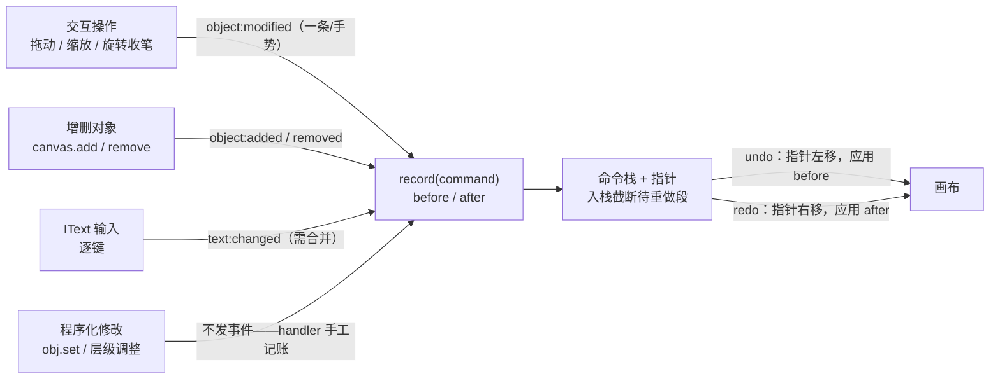

import { Canvas, Controls, Meta } from '@storybook/addon-docs/blocks';
import * as History from './history.stories';

<Meta of={History} name="Docs" />

# 历史栈

Fabric.js **没有内置的 undo / redo**。7.4.0 的 `fabric` 主入口没有 History 类，`fabric/extensions` 扩展面里也没有历史扩展；v6 起连 v5 那套对象状态追踪（`stateful` / `saveState` / `hasStateChanged`）都被移除了。官方维护者的一贯答复是：历史是应用层职责——用 `object:modified` 这类事件做触发点，自己维护一个**指针式命令栈**（或整画布快照栈）。本课就把这套自建方案讲透：栈的指针不变式、事件桥接的覆盖面与盲区、命令与快照的粒度取舍、文本输入的合并策略、快照体积与栈上限的内存账。序列化的字段语义（白名单、`loadFromJSON` 复活链路）与事件载荷细节见各自课程，本课只引用结论。



| 触发点 / API | 形态 | 回查要点 |
| --- | --- | --- |
| `object:modified` | 事件 | 一整个手势一条；只在真实改变后发；程序化 `set` 不发 |
| `object:added` / `object:removed` | 事件 | 增删自动触发；应用历史时会**再发**，需重入守卫 |
| `text:changed` | 事件 | IText 每个按键发一次，需要合并策略 |
| `path:created` | 事件 | 自由绘制一笔一条（笔刷见[自由绘制](?path=/docs/free-drawing--docs)） |
| `canvas.toObject()` / `loadFromJSON()` | API | 快照模式的通道；v6+ 返回 Promise；加载前 `clear()`、不自动渲染 |
| `FabricObject.stateProperties` | v5 遗留静态清单 | 7.4.0 仅内部标脏用；可作自定义记录集的现成参考 |
| `'fabric'` / `'fabric/extensions'` | 导入面 | 7.4.0 无 History 类、无历史扩展（见下文核实） |

## 快速上手

一个能跑的最小闭环：命令栈 + 指针 + 三个事件桥接。**初始化顺序**：先搭好初始场景、再创建历史（挂监听），否则初始的 `add` 也会进栈。

```ts
import { Canvas, type FabricObject } from 'fabric';

type Command = {
  label: string;          // 面板 / 日志展示用
  undo: () => void;
  redo: () => void;
};

export function createHistory(canvas: Canvas, limit = 50) {
  const stack: Command[] = [];
  let pointer = 0;        // 左侧 = 已应用；stack[pointer] 起为待重做段
  let applying = false;   // 应用历史时的免战牌

  const record = (cmd: Command) => {
    stack.length = pointer;   // 新命令丢弃待重做段
    stack.push(cmd);
    if (stack.length > limit) stack.shift();
    pointer = stack.length;
  };
  const undo = () => {
    if (pointer === 0) return;
    applying = true;
    stack[--pointer].undo();
    applying = false;
    canvas.requestRenderAll();
  };
  const redo = () => {
    if (pointer === stack.length) return;
    applying = true;
    stack[pointer++].redo();
    applying = false;
    canvas.requestRenderAll();
  };

  // 属性命令的记录集：几何 + 外观（v5 的 stateProperties 是现成参考，按需增删）
  const TRACKED = ['left', 'top', 'scaleX', 'scaleY', 'angle', 'fill'] as const;
  const baseline = new WeakMap<FabricObject, Record<string, unknown>>();
  const pick = (obj: FabricObject) =>
    Object.fromEntries(TRACKED.map((key) => [key, obj[key]]));

  canvas.on('object:added', ({ target }) => {
    if (applying) return;
    baseline.set(target, pick(target));
    record({
      label: `添加 ${target.type}`,
      undo: () => canvas.remove(target),
      redo: () => canvas.add(target),
    });
  });
  canvas.on('object:removed', ({ target }) => {
    if (applying) return;
    record({
      label: `删除 ${target.type}`,
      undo: () => canvas.add(target),   // 简化：不还原层级位置
      redo: () => canvas.remove(target),
    });
  });
  canvas.on('object:modified', ({ target }) => {
    if (applying) return;
    const before = baseline.get(target) ?? pick(target);
    const after = pick(target);
    const changed = TRACKED.filter((key) => before[key] !== after[key]);
    if (changed.length === 0) return;  // 无差异不记账
    record({
      label: `修改 ${target.type}：${changed.join('/')}`,
      undo: () => target.set(before),
      redo: () => target.set(after),
    });
    baseline.set(target, after);
  });

  return { undo, redo, record };
}
```

用法就是把它接到按钮或快捷键上：`undoBtn.onclick = () => history.undo()`。两个刻意的简化留给下文：`object:removed` 里没存层级索引（撤销删除后对象回到栈顶而不是原位置），IText 输入的 `text:changed` 没有合并（每个按键一条命令）——实验台里都补齐了。

## 官方没有 History

按"先查本地包、再对官方源"的顺序核实 7.4.0：

- **`'fabric'` 主入口**：TypeDoc 类清单（Canvas、FabricObject、Group、Textbox……）里没有 History / HistoricalStackUpdater 之类的类；`dist/index.d.ts` 全文检索不到 `histor`（大小写均无）。[官方 API 索引](https://fabricjs.com/api/)同样没有。
- **`'fabric/extensions'` 子路径**：实际导出面只有对齐参考线（`AligningGuidelines`）、数据更新器（origin / gradient updater）、westures 手势（`addGestures`）、图片裁剪控件与线性渐变控件——没有历史扩展。
- **CHANGELOG**：从 1.0.0 到 7.4.0 的 152 个版本条目里没有 History 相关的发版记录；仓库 PR 检索也没有添加过 History 类（仅有的两条 "History" 标题 PR 指被污染的 git 历史）。社区追问官方计划的 discussion 至今无维护者回应。

**v5 那套也不能用了。** v5 的对象上有 `saveState(options?)` / `hasStateChanged()` / `setupState()`，配合 `stateful` 在状态变化时触发 `object:modified`，官方文档当时把 `stateProperties` 描述为"检查状态变化与 history（undo/redo）用途"的清单。v6 重写时这套被整体移除——[v6 破坏性变更清单](https://github.com/fabricjs/fabric.js/issues/8299)的原话是 "stateful and statefulCache are removed"，理由是"为了检测变化而比较一大组属性，对性能和边界情况都不友好"；`saveState` / `hasStateChanged` 同批消失（7.4.0 全包无此标识符）。`stateProperties` 静态清单还在（15 个键：`top` `left` `scaleX` `scaleY` `flipX` `flipY` `originX` `originY` `angle` `opacity` `globalCompositeOperation` `shadow` `visible` `skewX` `skewY`），但 7.4.0 里它唯一的消费点是 `_set` 时把变化标脏给父组缓存——不再服务任何历史机制，只适合当作"记录哪些属性"的现成参考。

**社区包要核版本。** npm 上 `fabric-history`（alimozdemir）最流行，但停留在 v5 时代的 API（v6 下直接 `ReferenceError`，[issue #10011](https://github.com/fabricjs/fabric.js/issues/10011) 与该包 issue #48 记录了现状）；`@anth0nycodes/fabric-history`、`fabricjs-history`、`fabric-history-v7` 等是各自行进中的 fork。要么选明确支持 v7 的分支，要么自建——下面的内容就是自建的全部要点。

**维护者推荐的方向**（[discussion #9702](https://github.com/fabricjs/fabric.js/discussions/9702)）：ShaMan123 明确说"每步保存整个画布数据非常浪费"，建议以 `object:modified` 等事件为触发、"保存每一步的最小 diff 并能正反向应用"（git 模型）；asturur 给的另一条路是命令 / 动作模式——"每个变更配一个可逆的 undo 变更，存起来待重放"。两者都强调：方案取决于应用结构，fabric 不替你决定。

## 命令栈的骨架

不管记什么粒度，栈的机制是同一套，四条不变式：

- **指针语义**：`stack[0..pointer)` 是已应用命令，`stack[pointer..]` 是待重做段。`undo` 把指针左移一步并应用那条命令的逆；`redo` 右移一步应用正命令。
- **入栈截断**：`record` 先 `stack.length = pointer` 再 push——新操作会**丢弃全部待重做段**。撤销后再操作，redo 没了是设计行为，不是 bug。
- **重入守卫**：`canvas.add` / `remove` 会发 `object:added` / `object:removed`，撤销"添加"时执行的正是 `remove`——没有 `applying` 免战牌，撤销动作自己会变成新命令，栈立刻爆炸。`set` 不发事件，但守卫统一挂着最省心。
- **上限淘汰**：`stack.length > limit` 时 `shift()` 丢最旧——丢掉的是**最深的可撤销步**，指针同步收敛到栈长。上限既是内存约束也是体验约束（撤销不了太远的过去）。

边界情况按需处理：撤销"删除"想回到原层级，就要在删除入口先记下 `getObjects().indexOf(obj)`（`object:removed` 到达时对象已离开数组）；多选删除是 N 个事件，要么在入口合并成一条命令，要么接受 N 步撤销。

## 事件桥接

历史栈的输入从哪来？fabric 只在**交互路径**上发事件，这决定了"自动记账"的覆盖面：

| 操作路径 | 事件 | 记账建议 |
| --- | --- | --- |
| 拖动 / 缩放 / 旋转收笔 | `object:modified`（一整个手势一条，载荷带 `action`） | before 取手势前基线，after 取当前值 |
| 对象进出画布（代码 `add` / `remove`，含应用自己绑定的删除键） | `object:added` / `object:removed` | remove 的层级索引在删除入口先捕获 |
| IText 每个按键 | `text:changed`（载荷 `{ target }`） | 合并窗口，见下文 |
| 自由绘制收笔 | `path:created`（载荷 `{ path }`） | 一笔一条，天然合并 |
| 程序化 `obj.set` / 层级调整（`bringToFront` 等）/ 组内布局 | **无事件** | 在操作处手工 `record` |

三条经验：

- **基线（baseline）模式**：`object:modified` 只给你"改完了"这一刻，"改之前"要自己留——`WeakMap<FabricObject, props>` 在 add / 上次记账 / 应用历史时更新，modified 时 diff 出 changed 键。无差异就跳过（`object:modified` 本身只在真实改变后发，但你的 TRACKED 集合可能不含这次变的键）。
- **自己的代码自己记账**：`set` / 层级调整 / 动画都不发事件（v6 移除 `stateful` 的理由正是"状态变化只能来自开发者代码"）。给应用自己的 mutation 开一个 `record()` 入口，按钮、快捷键、脚本统一走它——事件监听留给"你无法直接触达的交互"。另一个方向是手动 `canvas.fire('object:modified', { target })` 把程序化变更伪装成事件，能复用监听器但语义混乱，不推荐当默认。
- **多选与分组**：一次框选拖动 3 个对象只发**一条** `object:modified`（target 是 ActiveSelection）——想逐对象记录要展开 `getActiveObjects()`；组内子对象的编辑看 `subTargetCheck` 配置（事件机制的完整说明见[事件系统](?path=/docs/events--docs)）。

## 粒度：命令、对象快照、整画布快照

记多细决定内存、undo 代价和实现复杂度：

| 方案 | 每步记什么 | undo 代价 | 内存 | 适用 |
| --- | --- | --- | --- | --- |
| 可逆命令 | 受影响属性的 `before` / `after` pick | O(1) `set` | 最小（几百字节） | 属性级编辑，默认首选 |
| 对象快照 | `obj.toObject()`（或多对象的合并） | 替换该对象（`fromObject`，可能异步） | 中 | 滤镜、富文本样式分片等多维变更 |
| 整画布快照 | `canvas.toObject()` 的 JSON 字符串 | O(n) `loadFromJSON`（异步，先 `clear()`） | 随对象数线性涨 | 兜底与低频大变更（模板切换、橡皮擦整轮） |
| 最小 diff | 命令的推广：`[id, { changed }]` 列表 | apply diff | 小 | 大型应用的正式方案（#9702 的建议方向） |

整画布快照栈的写法（指针语义与命令栈完全一致，只是存的换成了状态字符串）：

```ts
const states: string[] = [JSON.stringify(canvas.toObject())]; // [0] 是初始状态
let pointer = 0;

function snapshot() {
  states.length = pointer + 1;         // 截断待重做段
  states.push(JSON.stringify(canvas.toObject()));
  pointer = states.length - 1;
}
async function undo() {
  if (pointer === 0) return;
  applying = true;
  await canvas.loadFromJSON(states[--pointer]);  // v6+ Promise；先 clear() 再灌入
  canvas.requestRenderAll();                     // 不自动渲染，手动刷一帧
  applying = false;
}
```

快照模式的三个固有代价：`loadFromJSON` 是**异步**的（图片、Pattern 要重新加载 src），连续撤销要串行；**实例全部换新**——你持有的对象引用、事件订阅、基线 WeakMap 全部失效，恢复后要重建；序列化的白名单规则原样生效（自定义属性不进 `propertiesToInclude` 就静默消失，渐变 / Pattern 降级为纯数据），字段语义见[序列化](?path=/docs/serialization--docs)。混合方案常见形态：低频大变更处压一个快照做边界，边界内用命令增量——栈里两种条目共存，指针逻辑不变。

## 合并策略

连续的微小变更要不要合成一条 undo，是体验问题不是对错问题：

- **手势天然合并**：`object:scaling` / `object:moving` 每帧连发，但 `object:modified` 收笔才发一条——变换类操作不用你做任何合并。`path:created` 同理，一笔一条。
- **文本必须合并**：`text:changed` 每个按键发一次。常用闸门是 `text:editing:exited`：编辑会话内的连续输入并入栈顶文本命令（`before` 是进编辑前的全文），退出编辑后标记 closed、再输入另起一条。实验台的「合并文本输入」开关就是这个策略——关掉后逐键一条，`Ctrl+Z` 变成逐字回退（有人就想要这个粒度）。
- **滑杆与动画**：连续 `set`（颜色滑杆）或 `util.animate` 驱动的属性变化都不发事件，且中间态没有撤销价值——按"提交语义"记：滑杆 `change` / `pointerup` 时记一条，动画在完成回调里记终态（动画机制见[动画](?path=/docs/animation--docs)）。

## 实验台

同一套指针栈，两种记录模式、文本合并、栈上限同台对照。画布是真实可交互的：拖动、缩放、双击编辑文本；舞台按钮执行撤销 / 重做与场景操作；右侧日志列出栈内容（新 → 旧，灰色为待重做段），readout 给出指针读数。

<Canvas of={History.HistoryLab} />
<Controls of={History.HistoryLab} />

| 读者操作 | 可核对结果 |
| --- | --- |
| 拖动矩形后松手 | 「最近命令」变为 `矩形·移动`（一整个手势一条）；「指针位置」+1 |
| 点「撤销 Ctrl+Z」 | 矩形回到松手前位置；「指针位置」-1、「可重做」+1；日志顶部条目转灰 |
| 撤销后再拖动圆 | 日志里灰色条目消失（新命令截断待重做段），「可重做」归零 |
| 双击文本连续输入 | 「合并文本输入」开：栈深度只 +1；退出编辑再输入另起一条 |
| 关「合并文本输入」再输入 | 每个按键 +1 条命令，「栈深度」随键数增长 |
| 点「随机改色」 | 新命令来源标「手工」——`obj.set` 不发 `object:modified`，事件通道不会自动记账 |
| 点「加矩形」/「删除选中」 | 命令来源标「事件」——`object:added` / `object:removed` 自动记账；撤销删除回到原层级 |
| 切「记录模式」为快照，做同样操作 | 「记录体积」放大一个数量级；「撤销」走 `loadFromJSON` 全场景替换（异步完成后刷帧） |
| 「栈上限」调到 3，连加 4 个矩形 | 「栈深度」封顶 3，最早的添加被淘汰——初始场景回不去了 |
| 打开 Show code | 看到该 Canvas 实际执行的 `example.ts` |

## 性能与内存

历史栈的成本几乎全在"记什么"上：

- **快照体积的构成**：对象数 × 每对象全量键，再乘步数。#9702 里的真实案例：5 块画布、每快照约 10 MB，几十步历史就是上百 MB 的常驻内存——这就是维护者建议放弃全量快照的原因。Pattern 源为 canvas 时导出内嵌完整 data URL，是快照膨胀的常见放大器（见[序列化](?path=/docs/serialization--docs)的降级规则）。
- **给快照减肥**：画布级 `includeDefaultValues = false` 剥掉与默认值相同的键（单对象实测可缩到六分之一），代价是精简产物绑定当前版本默认值，跨版本升级有偏移风险；`config.NUM_FRACTION_DIGITS`（默认 4 位）控制数值精度。
- **命令化的收益**：一条属性命令只有几百字节，undo 是 O(1) 的 `set` 而不是 O(n) 的重建，且同步、可连发。规模上去后的正式形态是最小 diff（只存变化量，正反向应用）。
- **上限是硬约束**：栈深 × 单条体积 = 常驻内存。按目标设备定上限（几十步是常见量级），淘汰最旧而不是拒绝入栈。
- 渲染帧率、对象缓存、大数据量渲染策略不属历史栈的范围，由[性能优化](?path=/docs/performance--docs)一课（路线 7.2）承载。

## 最佳实践

- 触发点收敛成两层：fabric 事件监听管交互路径，自家 `record()` 入口管程序化路径；两者写同一种命令结构，栈不区分来源。
- 命令优先、快照兜底：属性级操作用 before / after 命令；滤镜、橡皮擦、整轮重排这类难以拆命令的变更压一条快照。混合栈共享同一套指针逻辑。
- 文本以 `text:editing:exited` 为冲账点；合并粒度当产品决策做（整段回退 vs 逐字回退），别默认替用户选。
- 上限与体积双约束：限制栈深的同时监控累计字节数，快照模式尤其要。
- 快照与存档共用同一份 `propertiesToInclude` 白名单常量，避免"能存盘的历史却回放不出来"。
- 键盘绑定（Ctrl+Z / Ctrl+Shift+Z）挂在编辑器容器上并守卫焦点：焦点在输入框时把快捷键还给文本；实验台用舞台按钮正是为了绕开 Storybook iframe 的焦点问题。

## 常见问题

- 撤销后画布没反应或对象"看不见"，点一下才出现
  `loadFromJSON` 不自动渲染，且它是异步的——在 `.then()` / `await` 之后 `requestRenderAll()`；连续撤销要 await 串行，别并发触发。issue #10011 里的幽灵渲染就是快照恢复没刷帧的典型。
- 撤销一次，栈里反而多了新命令，redo 也没了
  重入：撤销"添加"执行的 `remove` 会再发 `object:removed`，被自己的监听记成了新命令。加 `applying` 守卫，事件 handler 首行检查。
- 代码里 `set` 改了属性，Ctrl+Z 没反应
  程序化修改不发 `object:modified`（v6 起 `stateful` 也没了，没有任何自动检测）。在改动处手工 `record`，或统一走自家的 mutation 入口。
- v5 项目升级：`saveState` / `hasStateChanged` / `stateful` 找不到了
  v6 整体移除（#8299）。按本课方案自建命令栈；v5 时代依赖 `stateful` 自动触发 `object:modified` 的代码要改成显式记账。
- 装了 `fabric-history` 在 v6 / v7 下报 `ReferenceError`
  该包停留在 v5 全局命名空间写法。换明确支持 v7 的 fork，或把本课的桥接方案搬进去（量级不过百行）。
- 撤销删除后对象跑到了最上面
  `object:removed` 到达时对象已离开 `_objects`，恢复时没索引只能 append。删除入口先记 `getObjects().indexOf(obj)`，撤销时 `insertAt(index, obj)`。
- 快照栈内存暴涨
  全量 JSON × 步数的乘积效应，叠加 Pattern 的 data URL 内嵌。开 `includeDefaultValues = false`、降栈上限、把可拆的操作命令化；量级敏感时直接上最小 diff。
- 想逐步撤销刚才输入的每个字
  把合并闸门从 `text:editing:exited` 改成时间窗口（如 800ms 内合并），或干脆不合并——实验台关「合并文本输入」就是这个形态。

## 总结回顾

摘要：

Fabric 7.4.0 没有内置历史：主入口与 `fabric/extensions` 都无 History，v6 起移除了 v5 的 `stateful` / `saveState` / `hasStateChanged`（`stateProperties` 清单尚存但只服务内部标脏），官方维护者建议用事件触发加最小 diff 或可逆命令自建。自建的核心是指针式命令栈：入栈截断待重做段、undo / redo 移动指针应用逆 / 正命令、应用时挂重入守卫、超上限丢最旧。事件桥接覆盖交互路径——`object:modified` 一手势一条、`object:added` / `object:removed` 管增删（层级索引要预先捕获）、`text:changed` 逐键需合并、`path:created` 一笔一条；程序化 `set` 与层级调整不发事件，必须走自己的 `record()` 入口。粒度从命令（O(1)、最小内存）、对象快照到整画布快照（`loadFromJSON` 异步替换、体积随对象数线性涨、实例全换）逐级取舍，可混合；内存账 = 单条体积 × 栈深，快照用 `includeDefaultValues` 与上限约束，规模场景升级为最小 diff。

一句话：

> Fabric 把 undo / redo 留给了应用层：事件（`object:modified` / added / removed / `text:changed`）只负责告诉你"交互发生了变化"，指针式命令栈负责可逆地回放它们——记多细（命令 / 快照）是内存与体验的取舍，但截断、守卫、指针这三条栈语义不变。

知识要点：

- 7.4.0 的 `'fabric'` 和 `'fabric/extensions'` 里有没有 History？v5 的 `saveState` / `stateful` 去了哪？
- 指针式命令栈的四条不变式是什么？新命令入栈后待重做段会怎样？
- 为什么撤销"添加"会往栈里塞新命令？守卫挂在哪？
- 五条交互路径各自对应哪个事件？哪些操作**没有**事件、必须手工记账？
- `object:modified` 的 before 值从哪来？基线在哪些时机更新？
- 命令、对象快照、整画布快照三种粒度的 undo 代价与内存各是什么量级？
- 快照模式用 `loadFromJSON` 恢复的三个固有代价是什么？
- `text:changed` 为什么必须合并？常用冲账点是哪个事件？
- 栈上限淘汰的是哪一端？淘汰后指针怎么收敛？
- 给整画布快照减肥有哪些手段？各自的代价是什么？

## 参考资料

- [官方 API 索引（核实 v7 类清单中无 History）](https://fabricjs.com/api/)
- [v6 破坏性变更清单 issue #8299（stateful / statefulCache 移除的原话与理由）](https://github.com/fabricjs/fabric.js/issues/8299)
- [discussion #9702：Fabric JS + Redux (Undo/Redo)——维护者 ShaMan123 与 asturur 的方案建议](https://github.com/fabricjs/fabric.js/discussions/9702)
- [issue #10011：v6 undo/redo 现状与 fabric-history 兼容问题](https://github.com/fabricjs/fabric.js/issues/10011)
- [discussion #10756：官方暂无内置 undo/redo 计划（2025-09 提问，无维护者回应）](https://github.com/fabricjs/fabric.js/discussions/10756)
- [Fabric 5 旧文档：fabric.Object（saveState / hasStateChanged / stateProperties 的 v5 形态）](https://fabric5.fabricjs.com/docs/fabric.Object.html)
- [npm：fabric-history（社区包，v5 时代 API）](https://npmjs.com/package/fabric-history)
