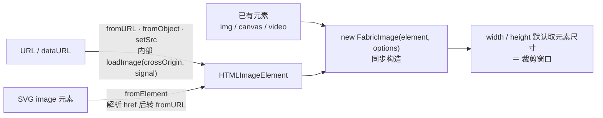

import { Canvas, Controls, Meta } from '@storybook/addon-docs/blocks';
import * as ImageStories from './image.stories';

<Meta of={ImageStories} name="Docs" />

# 图片

FabricImage 把一张**已经存在的位图元素**（`HTMLImageElement` / `HTMLCanvasElement` / `HTMLVideoElement`）包装成可变换对象：元素先于对象存在——异步入口（`fromURL` / `fromObject` / `fromElement` / `setSrc`）只负责把 URL 变成元素，构造函数本身是同步的。`width` / `height` 默认取元素尺寸，同时就是**裁剪窗口**：想改显示大小用 `scaleX` / `scaleY`，想裁剪改 `cropX` / `cropY` + `width` / `height` 四个数。`crossOrigin` 是加载时的一次性决定，决定画布会不会被污染——报错要等到导出或加滤镜那一刻。视频只是换一种“活的”元素，帧更新不会触发 Fabric 重绘，要自己驱动渲染循环。图片滤镜在[滤镜](?path=/docs/filters--docs)独立成课。



| 入口 / 属性 | 默认值 / 形态 | 回查要点 |
| --- | --- | --- |
| `new FabricImage(source, options?)` | source = 元素或 **DOM id 字符串** | 同步；URL 不能直接传，字符串按 `getElementById` 查找 |
| `FabricImage.fromURL(url, loadOptions?, imageOptions?)` | `Promise<FabricImage>` | `crossOrigin` / `signal` 在第二个参数；对象选项在第三个 |
| `FabricImage.fromObject(obj, { signal }?)` | `Promise<FabricImage>` | 序列化恢复；`loadFromJSON` 内部走的就是它 |
| `FabricImage.fromElement(svgImage, { signal }?)` | `Promise<FabricImage \| null>` | 解析 SVG `<image>`；失败记 log 并返回 `null` |
| `setSrc(url, { crossOrigin, signal })` | `Promise<void>` | 运行中换源；完成后宽高重置为新元素尺寸 |
| `width` / `height` | 元素原始尺寸 | **是裁剪窗口**：小于源即裁剪，不是拉伸显示 |
| `scaleX` / `scaleY` | 1 / 1 | 显示尺寸 = 窗口 × scale；`scaleToWidth` / `scaleToHeight` 按目标反推 |
| `cropX` / `cropY` | 0 / 0 | 窗口在源图上的像素偏移 |
| `crossOrigin`（加载选项） | `null` | `'anonymous'` / `'use-credentials'`；要导出/加滤镜时必须显式传 |
| `imageSmoothing` | `true` | 绘制与贴缓存时的平滑开关 |
| `strokeWidth` | 0（覆盖基类默认 1） | 图片默认无描边 |
| `objectCaching` | `true` | 独立图片实际不建位图缓存（`shouldCache` 特化，见下文“缓存与失效”） |
| `filters` / `resizeFilter` | `[]` / 无 | [滤镜](?path=/docs/filters--docs)独立成课 |

默认值与 fabric 7.4.0 源码 `imageDefaultValues` 及 `loadImage` 核对（`crossOrigin` 运行时默认 `null`，仅当传了真值才写到元素的 `crossOrigin` 属性上）。

## 快速上手

```ts
import { Canvas, FabricImage } from 'fabric';

const canvas = new Canvas(el, { width: 640, height: 360 });

// fromURL 返回 Promise：crossOrigin 放在第二个参数（加载选项）里
const img = await FabricImage.fromURL('https://cdn.example.com/photo.jpg', {
  crossOrigin: 'anonymous', // 需要导出或加滤镜的图必传，见下文“跨域与画布污染”
});
img.scaleToWidth(320); // 改显示大小走缩放，不要改 width（那是裁剪窗口）
canvas.add(img);       // add 自动请求重绘
```

同源图片、dataURL、blob URL 不需要 `crossOrigin`。

## 加载

共同模型：**FabricImage 不自己下载图片**。它永远包装一个已存在的元素——异步入口负责“URL → 元素”这一步（内部统一走 `loadImage`：创建 `HTMLImageElement`、按需设置 `crossOrigin`、等 `onload`），拿到元素后构造与同步路径完全相同。所以两类入口的差异只在“什么时候拿到实例”，不在实例本身。

### 异步：fromURL / fromObject / fromElement

```ts
import { Canvas, FabricImage } from 'fabric';

const canvas = new Canvas(el, { width: 640, height: 360 });

// 1. URL → Promise<FabricImage>：crossOrigin / signal 在第二个参数
const img = await FabricImage.fromURL('https://cdn.example.com/photo.jpg', {
  crossOrigin: 'anonymous',
  signal: controller.signal, // 可选：AbortController，取消加载、防止竞态
});
canvas.add(img);

// 2. 序列化对象 → Promise<FabricImage>：loadFromJSON 内部走的就是它
const restored = await FabricImage.fromObject({
  type: 'Image',
  src: img.getSrc(),
  cropX: 0, cropY: 0,       // toObject() 的输出原样回灌即可
  width: 320, height: 240,
});

// 3. SVG <image> 元素 → Promise<FabricImage | null>
//    解析 href/xlink:href、preserveAspectRatio 等属性后转 fromURL；
//    加载失败会 log 并返回 null，调用方要过滤
const fromSvg = await FabricImage.fromElement(svgImageEl, { signal });
```

- **`fromObject` 是序列化恢复的正门**：`toObject()` 输出 `src`（`getSrc()` 的结果）、`crossOrigin`（元素上实际的值）、`filters`、`cropX` / `cropY` 与通用属性；`fromObject` 重新加载图片并复活滤镜。日常不必手调，[序列化](?path=/docs/serialization--docs)课展开。
- **`fromElement` 服务 SVG 导入**：解析 `<image>` 标签属性（`x` / `y` / `width` / `height` / `preserveAspectRatio` / `href` 等），通常由 `loadSVGFromString` / `loadSVGFromURL` 内部调用，细节在 [SVG 互操作](?path=/docs/svg--docs)。
- **`signal` 防竞态**：快速连续加载（列表切换、滚动加载）时，用 `AbortController` 取消上一轮。`setSrc` 的源码注释明确建议调用前先中止进行中的加载任务，避免旧图晚到覆盖新图。
- **v5 对照**：v5 三个入口都是回调式——`fabric.Image.fromURL(url, callback, imgOptions)`；v6 起统一为 Promise。照旧资料写回调，回调永远不会执行。

### 同步：元素与 DOM id

```ts
// 已有元素（img / canvas / video）直接构造，width/height 立即可读
const fromCanvas = new FabricImage(offscreenCanvas, { left: 40, top: 40 });

// 构造函数的字符串参数是 DOM id（源码按 getElementById 查找），不是 URL
const byId = new FabricImage('my-image');

// 运行中换源：异步，完成后 setElement 用新元素尺寸重置 width/height
await image.setSrc('https://cdn.example.com/other.jpg', { crossOrigin: 'anonymous' });
image.setCoords();          // 官方建议：换元素后更新控件区域
canvas.requestRenderAll();  // setSrc 不触发重绘，需要手动补
```

- 传 URL 字符串给构造函数是最常见的误用：源码把字符串当 DOM id 查找，查不到得到坏实例；JSDoc 里“字符串是 URL”的描述是过时注释，以代码为准。按 URL 建对象用 `fromURL`。
- 配套读写：`getElement()` 返回当前元素；`setElement(el, size?)` 换元素（可选传宽高，不传则重置为元素尺寸）；`getSrc()` 对 img 返回 `element.src`，对 canvas 源**现算 `toDataURL()`**（大图开销大，序列化时同样走这里）；`srcFromAttribute: true`（默认 false）改用 `getAttribute('src')`，保留相对地址。
- `getOriginalSize()` 返回 `{ width, height }` = `naturalWidth || width`——img 用自然尺寸，canvas / video 元素没有 `naturalWidth`，回退到元素的 `width` 属性（这正是视频必须设 width / height 属性的原因，见下文“视频元素”）。

<Canvas of={ImageStories.LoadingPaths} />
<Controls of={ImageStories.LoadingPaths} />

| 读者操作 | 可核对结果 |
| --- | --- |
| 保持初始「fromURL」 | 先看到虚线占位与“Promise 进行中”，几毫秒后图片出现——异步管线存在间隙；「异步耗时」记录兑现用时 |
| 切到「new FabricImage(元素)」 | 图片立即可见、无占位阶段；「加载状态」为同步构造，宽高立即可读 |
| 切到「setSrc 换源」 | 先是 80×60 红色小图，Promise 完成后换成 320×240 主图；「width×height（窗口）」从 80×60 重置为 320×240——setElement 重置尺寸 |

## 跨域与画布污染

画布污染是**浏览器平台规则**，不是 Fabric 的逻辑：不带 `crossOrigin` 属性加载的跨域图片，像素画进 canvas 的那一刻画布就被标记污染；污染画布上调用 `toDataURL()` / `toBlob()` / `getImageData()` 一律抛 `SecurityError`（`Tainted canvases may not be exported`）。Fabric 的导出（`toDataURL` / `toCanvasElement`）和滤镜（WebGL / 2D 都要读像素）都建立在这些 API 上——所以症状总是延迟到导出或 `applyFilters` 时才爆发。

| 加载时 | 服务器响应 | 图片显示 | toDataURL / 滤镜 |
| --- | --- | --- | --- |
| 不传 `crossOrigin`（默认 `null`） | 任意 | 正常显示 | 抛 `SecurityError`：画布已污染 |
| `crossOrigin: 'anonymous'` | 带 `Access-Control-Allow-Origin` | 正常显示 | 正常 |
| `crossOrigin: 'anonymous'` | 不带 | **加载失败**：`fromURL` / `setSrc` 的 Promise reject | —（图都不存在） |

两种失败方向相反，排查时先分清是哪一种：

- **能显示、不能导出**：加载时没传 `crossOrigin`。污染无法事后洗白，唯一处理是带 `crossOrigin: 'anonymous'` 重新加载，并让图片服务器返回 CORS 头（可用 `curl -I` 检查响应）。
- **直接加载不出来**：传了 `'anonymous'` 但服务器没有配 CORS。请求已变成 CORS 请求，被浏览器拦下；换同源代理或让服务器补头。
- 位置要对：`crossOrigin` 是 `fromURL` / `setSrc` 的**第二个参数**（加载选项）；写进第三个参数 `imageOptions` 只会变成对象属性，不影响元素的加载方式。`fromObject` 从序列化对象读取（`toObject` 记录的是元素上实际的值，往返自洽）。
- `TCrossOrigin` 的合法值：`''` / `'anonymous'` / `'use-credentials'` / `null`。同源文件、dataURL、blob URL 全程不受影响。

导出参数（格式、质量、multiplier）在[图片导出](?path=/docs/export--docs)；滤镜细节在[滤镜](?path=/docs/filters--docs)。Storybook 内嵌范例不访问外网，跨域的两种失败无法在这里稳定复现，按上表对号入座即可。

## 宽高与缩放

`width` / `height` 的语义是**源上的窗口**，不是显示拉伸：

- 构造时默认取元素尺寸（`naturalWidth || width`）；options 里显式传 `width` / `height` 则窗口立即生效（等价于构造即裁剪）。
- 把 `width` 改得比源小：`hasCrop()` 判定为裁剪，画面只剩窗口内的源像素——不是把整图压扁。改得比源大：源按原尺寸绘制，多出区域空白。
- 显示尺寸 = 窗口 × `scaleX` / `scaleY`。改显示大小的入口：`set({ scaleX, scaleY })`、`scale(f)` 等比、`scaleToWidth(v)` / `scaleToHeight(v)` 按目标显示宽 / 高等比反推（按当前包围盒换算，含描边）。
- 读数入口分三层：`getOriginalSize()`（元素尺寸）→ `width` / `height`（窗口）→ `getScaledWidth()` / `getScaledHeight()`（显示）。
- `imageSmoothing`（默认 `true`）控制绘制与贴缓存时的双线性平滑：放大时关闭出现硬像素块，缩小时关闭出现锯齿；只影响画质，不影响任何尺寸读数。

<Canvas of={ImageStories.ScalingSize} />
<Controls of={ImageStories.ScalingSize} />

| 读者操作 | 可核对结果 |
| --- | --- |
| 两种「缩放入口」分别拖数值 | 图片变大变小，但「width×height（源窗口）」恒为 96×72——缩放不碰窗口 |
| 「scaleToWidth 目标宽」拖到 192 | 「scaleX / scaleY」自动反推为 2——目标宽是显示宽，不是窗口宽 |
| 「scaleX/scaleY 倍率」拖到 3 以上再关「imageSmoothing 平滑」 | 网格边缘立刻出现硬像素块——平滑只改画质，四项读数不动 |

## 裁剪

官方指南的口径：裁剪不是一个模式、也不是特殊对象，**就是那四个数字**——`cropX` / `cropY` 定窗口左上角在源图上的偏移（源像素），`width` / `height` 定窗口大小：

```ts
image.set({ cropX: 120, cropY: 80, width: 160, height: 120 });
canvas.requestRenderAll();
```

- **越界被渲染钳制，不会回移窗口**：源码 `_renderFill` 里 `cropX` 取 `Math.max(cropX, 0)`，可见宽 = `Math.min(width, 源宽 − cropX)`。窗口探出源边界时，出界部分没有像素（对象边界与 `getScaledWidth()` 仍按 set 的四数算）。
- **状态与序列化**：`hasCrop()` 在 `cropX` / `cropY` 非零或窗口小于源时为 `true`；`toObject()` 输出 `cropX` / `cropY`（`width` / `height` 本来就在通用属性里），`fromObject` 原样恢复窗口。
- **版本对照**：`cropX` / `cropY` 自 v2.0.0 引入，v5 与 v6 / v7 字段形态一致，没有过单独的 `crop` 属性。也没有 `cropWidth` / `cropHeight` 属性——那是 Konva 的字段形态；`changeCropWidth` / `changeCropHeight` 是 `fabric/extensions` 里裁剪控件处理器的名字，不是对象属性。从 Konva 或旧资料迁移时，窗口大小对应 fabric 的 `width` / `height`。
- **交互裁剪入口**：`import { enterCropMode, createImageCroppingControls } from 'fabric/extensions'`——双击进出裁剪模式，拖动对象即平移窗口、手柄调整窗口与源缩放，官方 [Cropping images](https://fabricjs.com/docs/cropping-images/) 指南与 [cropping-controls demo](https://fabricjs.com/demos/cropping-controls) 有完整示例；扩展包细节在[扩展包](?path=/docs/extensions--docs)。
- **与 clipPath 的分工**：窗口裁剪只作用于图片源、且只能是矩形；用任意形状遮罩任意对象是 `clipPath` 的职责，见[裁剪与遮罩](?path=/docs/clip-path--docs)。

<Canvas of={ImageStories.CropWindow} />
<Controls of={ImageStories.CropWindow} />

| 读者操作 | 可核对结果 |
| --- | --- |
| 拖「cropX / cropY」 | 虚线窗口在源图上移动，右侧结果同步换区域；「hasCrop()」为 true |
| 拖「width / height 窗口宽高」 | 窗口大小与结果内容同步变化——窗口宽就是对象 width |
| 把「cropX」拖到接近 320 | 「渲染可见窗口」宽趋近 0、右侧逐渐空白——出界被钳制，窗口不会回移 |
| 偏移归零、宽高拉满（320 / 240） | 「hasCrop()」翻回 false——四数等于整图时无裁剪 |

## 视频元素

`ImageSource` 包含 `HTMLVideoElement`：没有 `FabricVideo` 类，视频就是“元素还活着”的图片。用法与 img 一致，差异全在元素侧与刷新侧：

```ts
import { Canvas, FabricImage, util } from 'fabric';

const canvas = new Canvas(el, { width: 640, height: 360 });

const videoEl = document.createElement('video');
// 官方 demo 注释原话：FabricImage 要求 video 元素设置 width / height 属性
// （getOriginalSize 回退 element.width，video 元素没有 naturalWidth）
videoEl.width = 480;
videoEl.height = 360;
videoEl.muted = true;          // 静音是浏览器自动播放政策的前提
videoEl.src = '/media/clip.mp4'; // 运行条件：可访问的视频地址（本地或同源）
await videoEl.play();

const video = new FabricImage(videoEl, {
  left: 320, top: 180,
  originX: 'center', originY: 'center',
  objectCaching: false,        // 官方 demo 同款配置：每帧都在变，不进缓存
});
canvas.add(video);

// 视频帧更新不会触发 Fabric 重绘：自己跑循环逐帧请求重绘。
// requestRenderAll 按帧合并，循环里重复调用是安全且标准的
util.requestAnimFrame(function render() {
  canvas.requestRenderAll();
  util.requestAnimFrame(render);
});
```

- **元素属性三件套**：`width` / `height` 属性必设（决定对象初始窗口）；`muted` + `play()` 过自动播放政策（无手势时带声视频会被拒）；循环播放用 `videoEl.loop = true`（官方 demo 用 `onended` 里重调 `play()`）。摄像头走 `getUserMedia` 赋给 `srcObject`，需要 https 运行条件。
- **重绘是自己的责任**：Fabric 不知道视频在第几帧，渲染循环（`requestAnimFrame` 或等价机制）里逐帧 `requestRenderAll()` 是唯一让画面动起来的方式；刷新机制背景见[渲染模型](?path=/docs/rendering-model--docs)。官方 [Video element demo](https://fabricjs.com/demos/video-element) 是同款结构。
- **缓存与分组**：v6+ 独立图片本就不建位图缓存（见下节），`objectCaching: false` 是显式防御；真正会冻结画面的是把视频图放进**有缓存的 Group**——组位图不重画就停在旧帧，需要每帧 `video.set('dirty', true)`。
- **导出边界**：`toDataURL` 拿到的是调用瞬间的静态帧；官方明确不支持视频导出，持续录制要走 `MediaRecorder` / 流 API，参数细节在[图片导出](?path=/docs/export--docs)。

Storybook 内嵌画布不访问外网、也不申请摄像头权限，视频范例按上述运行条件在本地页面验证。

## 缓存与失效

v6 起 `FabricImage` 特化了 `shouldCache()`：只在 `needsItsOwnCache()`（有 `clipPath`，或描边优先 + 填充 + 描边 + 阴影组合）为真时才建自身位图缓存，普通独立图片每次 `renderAll` 直接 `drawImage` 元素——源码注释写明 “Essentially images do not benefit from caching”（图片本身就是位图，再缓存一遍通常只有损耗）。由此：

| 场景 | 缓存行为 | 要做的事 |
| --- | --- | --- |
| 独立图片（无 clipPath / 滤镜） | 不建自身缓存，直接绘制元素 | 改裁剪 / 缩放后 `requestRenderAll()` 即可 |
| 带 clipPath 等 | `needsItsOwnCache` 为真，建自身缓存 | `cropX` / `cropY` 在图片的 `cacheProperties` 里（`IMAGE_PROPS`），`set()` 改到自动置 dirty |
| 在 Group 内 | 组缓存整组位图 | 改图片内容 / 换元素后 `image.set('dirty', true)`，组的 `isCacheDirty` 检查到才重画 |
| `applyFilters()` / `applyResizeFilters()` | — | 内部自动 `set('dirty', true)` |

`dirty` 与 `cacheProperties` 的通用机制（`set()` 自动置脏、直接赋值绕过）在[渲染模型](?path=/docs/rendering-model--docs)已讲，本课只补图片的差异面。

## 最佳实践

- 要导出或加滤镜的跨域图，`fromURL` / `setSrc` 第二个参数一次带 `crossOrigin: 'anonymous'`，并确认服务器 CORS；污染无法事后补救。
- 显示大小只走 `scaleX` / `scaleY` / `scaleToWidth` / `scaleToHeight`；`width` / `height` 留给裁剪窗口，不要用它们“压图”。
- 裁剪四数一次 `set({ cropX, cropY, width, height })`，窗口保持在源图内；依赖渲染钳制不如自己算清。
- 快速连续换源用 `AbortController` 的 `signal` 取消上一轮，避免旧图晚到覆盖新图（`setSrc` 源码注释明确建议）。
- 视频固定三件套：元素上设 `width` / `height` 与 `muted`，渲染循环里 `requestRenderAll()`，进组就逐帧置 `dirty`。

## 常见问题

- 跨域图片显示正常，`canvas.toDataURL()` 却抛 `SecurityError`（`Tainted canvases may not be exported`）
  画布被污染：图是不带 `crossOrigin` 加载的。带 `crossOrigin: 'anonymous'` 重新加载，并让图片服务器返回 `Access-Control-Allow-Origin`；污染只能预防，不能洗白。
- 加了 `crossOrigin: 'anonymous'` 后图反而加载不出来（`fromURL` reject）
  请求变成了 CORS 请求，服务器没返回允许跨域的响应头。两种失败方向相反：不传是“能显示不能导出”，传了但服务器没配是“直接加载失败”；用 `curl -I` 看响应头定方向。
- `crossOrigin` 写在 `fromURL` 第三个参数（imageOptions）里，导出照样报错
  加载选项在第二个参数：`fromURL(url, { crossOrigin, signal }, imageOptions)`。写在 imageOptions 里只会变成对象属性，元素的加载方式没变。
- `new FabricImage('https://…/a.png')` 得到空白或坏实例
  构造函数的字符串参数是 DOM id（源码按 `getElementById` 查找），不是 URL；JSDoc 的“URL”描述是过时注释。URL 用 `FabricImage.fromURL`，已有元素直接传入构造函数。
- 想把图缩小，`set('width', 100)` 结果图被裁掉一截
  `width` / `height` 是源像素空间里的裁剪窗口，改小等于裁剪。显示缩小用 `set({ scaleX, scaleY })` 或 `scaleToWidth`。
- `setSrc` 换图后，原来的宽高 / 裁剪设置丢了
  `setSrc` → `setElement` 用新元素尺寸重置了 `width` / `height`（`cropX` / `cropY` 属性还在，但窗口基准变了）。换源后重设四数与 scale，再 `setCoords()` + `requestRenderAll()`。
- 视频对象只显示第一帧，或者完全不动
  两个独立原因：没调 `videoEl.play()`（`muted` 才能自动播放）；没有渲染循环——视频帧变化不触发 Fabric 重绘，要 `requestAnimFrame` 循环 `requestRenderAll()`。若视频图在 Group 里，还要每帧 `set('dirty', true)`。
- 照 v5 资料写 `fromURL(url, (img) => {...})` 回调不执行；照 Konva 写 `cropWidth` 报属性不存在
  v6 起加载入口统一 Promise（v5 是回调式）；fabric 没有 `cropWidth` / `cropHeight` 属性——窗口大小就是 `width` / `height`（`cropX` / `cropY` + `width` / `height` 的形态从 v2.0.0 延续至今），`changeCropWidth` 只是 `fabric/extensions` 里的处理器名。

## 总结回顾

摘要：

FabricImage 永远包装一个已存在的元素：异步入口（`fromURL` / `fromObject` / `fromElement` / `setSrc`）内部统一走 `loadImage` 把 URL 变成元素再同步构造，`crossOrigin` / `signal` 在加载选项里一次性决定 CORS 行为。`width` / `height` 默认取元素尺寸，语义是源上的裁剪窗口：改小即裁剪（`hasCrop()`），改显示大小走 scaleX / scaleY 家族，`imageSmoothing` 只管画质。裁剪就是 `cropX` / `cropY` + `width` / `height` 四个数，越界被渲染钳制；这一形态从 v2.0.0 延续至今，交互手柄在 `fabric/extensions`。跨域不传 `crossOrigin` 会污染画布、到导出 / 滤镜时才抛 `SecurityError`，传了但服务器没配 CORS 则直接加载失败。视频是“活元素”的图片：元素设 `width` / `height` 与 `muted`，渲染循环逐帧 `requestRenderAll`，进组要置 `dirty`。v6+ 独立图片默认不建位图缓存，dirty 只在组内、clipPath 或滤镜路径上起作用。

一句话：

> FabricImage 包装的是元素不是 URL：异步入口只负责把 URL 变成元素，width/height 是源上的裁剪窗口（改显示用缩放），crossOrigin 在加载时一次性决定画布能否导出，视频帧要靠自己的渲染循环刷新。

知识要点：

- `fromURL` / `fromObject` / `fromElement` / `setSrc` 各自的输入、返回形态与参数位置是什么？构造函数的字符串参数是什么？
- `crossOrigin` 的两种失败模式分别是什么现象？为什么污染要到导出 / 滤镜时才报错？
- `width` / `height` 的窗口语义是什么？改显示大小的正确入口有哪些？三层尺寸读数怎么分？
- 裁剪四数怎么组合？越界时渲染如何钳制？v5 / Konva / extensions 里相近写法对应 fabric 的什么？
- 视频元素的必设属性、自动播放前提与渲染循环结构是什么？进 Group 后要补什么？
- 独立图片默认建不建缓存？哪些场景下必须手动置 `dirty`？

## 参考资料

- [官方 API：FabricImage](https://fabricjs.com/api/classes/fabricimage/)
- [官方指南：Cropping images](https://fabricjs.com/docs/cropping-images/)
- [官方 Demo：Video element](https://fabricjs.com/demos/video-element)
- [官方 Demo 源码：video-element/code.js（GitHub）](https://github.com/fabricjs/fabricjs.github.io/blob/main/src/content/demo/video-element/code.js)
- [Introduction to Fabric.js. Part 1（旧版入门，Images 章节）](https://fabricjs.com/docs/old-docs/fabric-intro-part-1/)
- [v5 旧版 API：fabric.Image（版本对照）](http://fabric5.fabricjs.com/docs/fabric.Image.html)
- [MDN：crossorigin 属性（CORS 图片语义）](https://developer.mozilla.org/en-US/docs/Web/HTML/Attributes/crossorigin)
- [GitHub 源码：src/shapes/Image.ts](https://github.com/fabricjs/fabric.js/blob/main/src/shapes/Image.ts)
