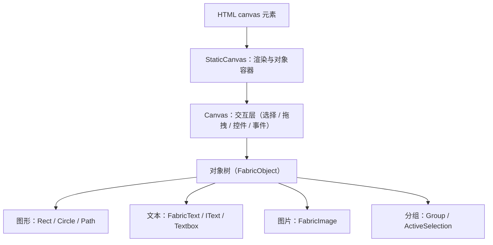

import { Meta } from '@storybook/addon-docs/blocks';

<Meta id="intro" title="起步/认识 Fabric.js" name="Docs" />

# 认识 Fabric.js

Fabric.js 是运行在 HTML canvas 上的交互式对象模型库——npm 包的自我描述就是 "Object model for HTML5 canvas, and SVG-to-canvas parser"。它把原生 Canvas 的"向像素发绘制命令"变成"创建对象、管理对象树"：对象能被选中、拖拽、缩放、存成 JSON、与 SVG 互转，所以它常被当作图形编辑器的底座，而不只是画图工具。本课是整套手册的第一课：先建立这个定位的心智模型，再给一张能力地图（每项能力都能跳到对应课程），最后讲清 v5 → v6 → v7 的版本演进——Fabric 三个时代的 API 形态差异极大，查任何外部资料前先判断版本，是使用这套手册的第一个习惯。



上图是 Fabric 的分层：`StaticCanvas` 持有对象树并负责渲染，`Canvas` 在其上加交互层，每个对象保存自己的几何、样式与变换。渲染细节（双层画布、`requestRenderAll`、对象缓存）由[渲染模型](?path=/docs/rendering-model--docs)一课展开。

| 版本 | 形态与时间 | 导入写法 | 识别特征 |
| --- | --- | --- | --- |
| v5 | UMD 全局命名空间；大量社区资料停留于此 | `import { fabric } from 'fabric'` 或 `script` 标签引入全局 `fabric` | `new fabric.Xxx`、`@types/fabric`、回调式 API |
| v6 | 2024-06 起；TypeScript 重写、命名导出 | `import { Canvas, Rect } from 'fabric'` | `FabricText` 等改名类、Promise API |
| v7 | 2025-12 起，当前最新 7.4.0；API 近乎延续 v6 | 同 v6 | `originX` / `originY` 默认 `center` 等默认值差异 |
| `@fabricjs/*` | 已合入仓库 master，npm 尚未发布 | `@fabricjs/browser` 等（暂时装不上） | GitHub README 推荐、npm 404 |

## 解决什么问题

原生 Canvas 2D 是命令式的：调用 `fillRect`、`fillText` 这类绘制命令，画布上留下的只有像素。画布不记得"这里有一个矩形"，于是编辑器式的能力全要自己造——移动图形要清屏重画，"点中了谁"要自己写命中检测，场景存盘要自己设计数据结构。

Fabric 把问题倒过来：先创建对象、加进画布，渲染由库完成。

```js
// 原生 Canvas 2D：画完即忘，画布上只剩像素
const ctx = canvas.getContext('2d');
ctx.fillStyle = 'red';
ctx.fillRect(10, 10, 100, 80);
// 想移动这个"矩形"？没有这个矩形，只有像素——只能清屏重画
```

```ts
// Fabric（v7 写法）：对象是活的数据
import { Canvas, Rect } from 'fabric';

const canvas = new Canvas('c', { width: 300, height: 200 });
const rect = new Rect({ left: 10, top: 10, width: 100, height: 80, fill: 'red' });
canvas.add(rect);

// 对象可查询、可修改、默认可被鼠标选中拖拽
rect.set({ angle: 15 });
canvas.requestRenderAll();
```

判断条件：一段图形代码是"像素流"还是"对象树"，决定了它能不能回答这些问题——这个图形在哪（可查询）、鼠标点中了谁（可交互）、改属性后如何更新（`set` 加一次重渲染）、场景怎么存盘恢复（序列化）。官网对这套能力的称呼就是 "interactive object model"。

两个边界：`rect.set()` 之后需要 `canvas.requestRenderAll()` 才刷新——对象变更是数据变更，渲染是另一件事，这是[渲染模型](?path=/docs/rendering-model--docs)的主题；创建画布前的安装与包结构，见[安装与第一个画布](?path=/docs/getting-started--docs)。

## 能力地图

官网与 README 列出的能力，落到本手册就是下面这张表。它同时是手册目录的镜像：提到 Fabric 的常见能力点时，应能在表中找到入口；具体做法在对应课程。

| 阶段 | 能力 | 一句话说明 |
| --- | --- | --- |
| 起步 | [安装与第一个画布](?path=/docs/getting-started--docs) | npm 包结构，创建画布并渲染第一个图形 |
| 起步 | [渲染模型](?path=/docs/rendering-model--docs) | 双层画布结构、`requestRenderAll` 刷新时机与对象缓存 |
| 图形与样式 | [基础图形](?path=/docs/basic-shapes--docs) | Rect、Circle、Ellipse、Triangle、Line、Polyline、Polygon 的创建与通用属性 |
| 图形与样式 | [路径](?path=/docs/path--docs) | Path 与 SVG path 命令，绘制任意轮廓 |
| 图形与样式 | [填充、描边与阴影](?path=/docs/fill-stroke-shadow--docs) | fill 与 stroke 的颜色、宽度、虚线，Shadow、透明度与混合模式 |
| 图形与样式 | [渐变与图案](?path=/docs/gradients-patterns--docs) | Gradient 线性 / 径向渐变与 Pattern 图案填充 |
| 图形与样式 | [文本](?path=/docs/text--docs) | FabricText 的字体、换行、富文本样式分片与文字测量 |
| 图形与样式 | [交互文本](?path=/docs/itext-textbox--docs) | IText / Textbox 的双击编辑、上标下标与路径文字 |
| 图形与样式 | [图片](?path=/docs/image--docs) | FabricImage 的加载、跨域、裁剪与视频元素 |
| 图形与样式 | [裁剪与遮罩](?path=/docs/clip-path--docs) | clipPath 在对象与画布上限定可见区域 |
| 变换与组织 | [变换](?path=/docs/transform--docs) | 位置、缩放、旋转、倾斜、翻转与变换矩阵，以及 originX / originY 的作用 |
| 变换与组织 | [对象管理](?path=/docs/stacking--docs) | 增删插入、层级调整与对象树遍历 |
| 变换与组织 | [分组与多选](?path=/docs/group-selection--docs) | Group 的创建与子对象、ActiveSelection 多选和分组布局策略 |
| 变换与组织 | [视口与坐标](?path=/docs/viewport--docs) | viewportTransform、缩放平移与场景 / 视口坐标转换 |
| 交互与编辑 | [事件系统](?path=/docs/events--docs) | 画布级与对象级事件、目标发现与事件对象字段 |
| 交互与编辑 | [拖拽与选择](?path=/docs/drag-select--docs) | 默认拖拽、框选与多选行为的配置和约束 |
| 交互与编辑 | [变换控件](?path=/docs/controls--docs) | 内置控件的角落 / 旋转手柄、样式与可见性配置 |
| 交互与编辑 | [自定义控件](?path=/docs/custom-controls--docs) | Control 与 controlsUtils：自定义控件的渲染与行为 |
| 交互与编辑 | [自由绘制](?path=/docs/free-drawing--docs) | isDrawingMode 与 PencilBrush 等笔刷的自由绘制 |
| 滤镜与动画 | [滤镜](?path=/docs/filters--docs) | 内置图片滤镜、WebGL 后端与自定义滤镜 |
| 滤镜与动画 | [动画](?path=/docs/animation--docs) | util.animate / animateColor 的属性动画与缓动函数 |
| 数据与导出 | [序列化](?path=/docs/serialization--docs) | toJSON / loadFromJSON 的场景往返与自定义属性 |
| 数据与导出 | [SVG 互操作](?path=/docs/svg--docs) | loadSVGFromString / loadSVGFromURL 导入与 toSVG 导出 |
| 数据与导出 | [图片导出](?path=/docs/export--docs) | toDataURL 的格式、质量与 multiplier 高清导出 |
| 进阶与工程 | [历史栈](?path=/docs/history--docs) | History 命令栈的 undo / redo 集成 |
| 进阶与工程 | [性能优化](?path=/docs/performance--docs) | 对象缓存、渲染控制与大数据量策略 |
| 进阶与工程 | [自定义对象](?path=/docs/custom-object--docs) | FabricObject 子类、classRegistry 注册与自定义序列化 |
| 进阶与工程 | [扩展包](?path=/docs/extensions--docs) | `@fabricjs/*` 官方扩展与按需引入 |

Fabric 不做的事：它不是数据可视化图表库（柱状图、折线图这类交给 ECharts 等领域工具，用 Fabric 画等于手搓），也不是游戏引擎（无游戏循环、物理、音频）；Node 端渲染（node-canvas）可以工作但不在本手册主线内，仅在相关课程必要时提及。

## 版本演进

为什么第一课就讲版本：官方文档站、GitHub README 和社区教程分别默认三个时代的写法，同名 API 形态不同，混用会直接报错。本手册基线是 v7（工作区安装 `fabric` 7.4.0，统一 `import { ... } from 'fabric'`），下文三个小节按代际对照。

### v5：全局命名空间

- 发布形态是 UMD 单文件：`script` 标签引入后得到全局 `fabric` 对象；npm 项目里写 `import { fabric } from 'fabric'`。
- 所有类挂在命名空间下：`new fabric.Canvas('c')`、`new fabric.Rect(...)`、`new fabric.Text(...)`。
- TypeScript 用户需要额外安装社区类型包 `@types/fabric`。
- v5 旧文档站仍在（GitHub README 标注为 "Old V5 documentation"）。大量教程、Stack Overflow 回答与中文社区文章都以这套写法为准——这是查资料时最主要的陷阱来源。

### v6：TypeScript 重写与命名导出

6.0.0 发布于 2024-06，升级指南第一句就是 "Fabric.js is now written in Typescript"。相对 v5 的关键变化：

- **命名导出**：`import { Canvas, Rect } from 'fabric'`；Node 环境用 `fabric/node`。过渡期可以用 `import * as fabric from 'fabric'` 整体导入来保留 `fabric.Xxx` 写法，但新代码应具名导入。
- **类改名**（原名与 JS 全局名冲突）：`fabric.Object` → `FabricObject`、`fabric.Text` → `FabricText`、`fabric.Image` → `FabricImage`；图形类保持短名（`Rect`、`Circle`、`Path`、`Group` 等）。
- **类型内置**：类型随主包发布，需要卸载 `@types/fabric`。
- **标准 ES class**：继承用 `extends`（v5 时代是 `fabric.util.createClass` 工具函数加 `initialize` 方法）。
- **回调改为 Promise**：`loadSVGFromString`、`loadFromJSON` 这类原本传回调的 API 都返回 Promise。
- **方法链废弃**：官方明确残留可用也不要再用。

### v7：环境基线与默认值变化

7.0.0 发布于 2025-12，当前最新 7.4.0（2026-05 发布）。升级指南明确说 "Fabric 7.0 is basically Fabric 6.0 there is no large major change"——主版本号主要来自依赖基线抬升：Node 最低 20（node-canvas v3、jsdom 26），浏览器基线刷新到 2021 年初水平（Chrome 88+ / Edge 88+ / Firefox 85+ / Safari 13+）。真正会改变代码行为的：

- **`originX` / `originY` 默认值改为 `'center'`**：对象改按中心定位，升级指南称之为 "the only real annoying breaking change"——v6 里放在 (0, 0) 的对象，v7 下会有四分之三跑出可视区；官方预告 8.0 将移除这两个属性。迁移用 `positionByLeftTop(point)` 或 `getPositionByOrigin(originX, originY)`。
- **Canvas 三个布尔默认 `true`**：`fireRightClick`、`fireMiddleClick`、`stopContextMenu`——右键 / 中键现在也触发鼠标事件，处理时要看事件的 `button` 字段。
- **渐变 colorStop 移除 `opacity` 字段**：透明度写进 `color` 字符串；旧数据可用 `fabric/extensions` 的 `installGradientUpdater()` 兼容。
- **弃用 API 移除**：`getCenter()` → `getCenterPoint()`，`getPointer()` → `getScenePoint()` / `getViewportPoint()`，`setWidth()` / `setHeight()` → `setDimensions()`；事件对象上只保留 `viewportPoint` 与 `scenePoint`。
- **Blur 滤镜删除 CPU 实现**：drawImage 版本被移除，统一走 WebGL。

### @fabricjs/* 包结构

GitHub README（master 分支）已经把推荐安装方式改为环境专属包，`fabric` 退为兼容门面：

| 包 | 职责 |
| --- | --- |
| `fabric` | 兼容门面，re-export `@fabricjs/browser` |
| `@fabricjs/browser` | 新浏览器应用首选入口 |
| `@fabricjs/node` | 新 Node.js 应用首选入口，持有 Node 专属依赖 |
| `@fabricjs/core` | 环境中立共享运行时，面向进阶与共享依赖场景 |
| 扩展包 | 按需引入的可选功能，如 `@fabricjs/aligning-guidelines` |

README 同时承诺既有导入继续工作，门面包与 workspace 包 "share the same class identities"；但版本必须匹配，混用不匹配版本会加载出两套运行时。

注意这套结构截至 2026-08 还没有发布到 npm：`@fabricjs/browser` 等包在 npm 上不存在（404），npm 上的最新版本仍是 `fabric` 7.4.0；仓库的 `packages/` 重组在 2026 年 7 月底才合入 master。所以现在安装仍是 `npm install fabric`，本手册基线即 7.4.0；把 `@fabricjs/*` 理解为已定案但未落地的方向即可。入口拆分与扩展包的细节见[安装与第一个画布](?path=/docs/getting-started--docs)与[扩展包](?path=/docs/extensions--docs)。

## 常见问题

- 照博客或 Stack Overflow 抄的代码报错：`fabric is not defined`，或 `new fabric.Text(...)` 报类不存在。
  先判版本：`new fabric.Xxx` 是 v5 命名空间写法。改成具名导入并对照改名表——`fabric.Object` → `FabricObject`、`fabric.Text` → `FabricText`、`fabric.Image` → `FabricImage`，其余类名基本不变；顺手卸载 `@types/fabric`（v6 起类型内置）。
- 按 GitHub README 执行 `npm install @fabricjs/browser` 返回 404。
  这是尚未发布的包：`@fabricjs/*` 已合入仓库 master 但不在 npm 上（截至 2026-08）。安装稳定版用 `npm install fabric`，具名导入写法与 README 示例完全相同。
- 项目从 v6 升到 v7 后，原本贴着左上角摆的图形跑出了可视区，位置整体对不上。
  v7 把 `originX` / `originY` 默认值改为 `'center'`，对象改按中心定位。显式设置这两个属性，或用 `positionByLeftTop(point)` 按左上角摆位迁移旧逻辑。

## 总结回顾

摘要：

Fabric.js 在 canvas 之上提供交互式对象模型：`StaticCanvas` 与 `Canvas` 分别负责渲染和交互，场景内容是可查询、可变换、可序列化的 `FabricObject` 树，这是它被当作图形编辑器底座的原因。能力地图覆盖图形、路径、样式、文本、图片、裁剪、变换、分组、视口、事件、控件、自由绘制、滤镜、动画、序列化、SVG 与图片导出、历史栈、性能、自定义对象和扩展包，每项在手册中有对应课程。版本上，v5 是全局命名空间时代，v6 以 TypeScript 重写并改为命名导出、改名类与 Promise API，v7 延续 v6 的 API、只抬升环境基线并调整少量默认值，`@fabricjs/*` 包结构已合入仓库但尚未发布，`fabric` 仍是唯一的安装入口。

一句话：

> Fabric.js 把"向像素发命令"的 Canvas 变成"管理对象树"的 Canvas；查任何资料之前，先判断它写的是 v5、v6 还是 v7。

知识要点：

- 原生 Canvas 2D 与 Fabric 的本质区别是什么？
- `StaticCanvas` 与 `Canvas` 分别承担什么？
- 一段社区代码是 v5 还是 v6+ 写法，怎样一眼判别？
- v6 相对 v5 改了哪些导入方式与类名？
- v7 为什么升主版本号？真正影响代码的变更有哪些？
- `@fabricjs/*` 现在能安装吗？`fabric` 包还能用吗？
- 某项具体能力（如滤镜、序列化）对应手册的哪一课？

## 参考资料

- [Fabric.js 官网](http://fabricjs.com/) — 定位表述、特性清单与最新版本号 7.4.0
- [官方文档（指南）](https://fabricjs.com/docs/) — 文档站结构与升级指南入口
- [Upgrading to Fabric.js 6.0](https://fabricjs.com/docs/upgrading/upgrading-to-fabric-60/) — v5 → v6 破坏性变更原文
- [Upgrading to Fabric.js 7.0](https://fabricjs.com/docs/upgrading/upgrading-to-fabric-70/) — v6 → v7 变更原文
- [GitHub 仓库 fabricjs/fabric.js README](https://github.com/fabricjs/fabric.js) — `@fabricjs/*` 包结构、导入写法对照与环境支持基线
- [npm：fabric](https://www.npmjs.com/package/fabric) — 版本发布时间线与 `@fabricjs/*` 未发布状态核对
- [Fabric.js v5 旧版文档站](https://fabric5.fabricjs.com) — 阅读 v5 时代社区资料时的对照入口
