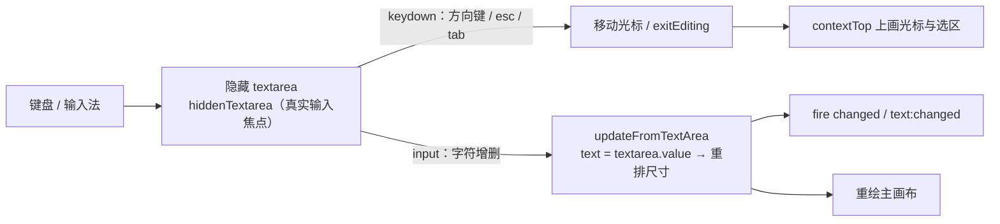

import { Canvas, Controls, Meta } from '@storybook/addon-docs/blocks';
import * as ITextTextbox from './itext-textbox.stories';

<Meta of={ITextTextbox} name="Docs" />

# 交互文本

FabricText 只负责"渲染一段文字"，IText 在它之上加一层**编辑态**：双击进入编辑、出现闪烁光标与选区、用键盘改字；Textbox 再继承 IText 的全部编辑能力，并把 `width` 变成布局杠杆——宽度改了就重新换行，高度随行数自适应。编辑并不是在画布里画出一个输入框：Fabric 在画布外挂一个隐藏的 `<textarea>` 接管真实的键盘输入与输入法，画布上只画光标和选区底色。理解了这条输入通路，编辑态的行为与故障就都能推出来。

文字的基础属性（fontFamily、fontSize、styles 分片、`\n` 手动换行与测量）见 [2.3.1 文本](?path=/docs/text--docs)；本课只讲"交互"这一层。画布与对象的事件机制全景见 [4.1 事件系统](?path=/docs/events--docs)。



| 属性 | 默认值 | 回查要点 |
| --- | --- | --- |
| `editable` | `true` | `false` 时双击与 `enterEditing()` 都进不了编辑 |
| `isEditing` | `false` | 编辑态标志；用 `enterEditing()` / `exitEditing()` 切换，不要直接赋值 |
| `selectionStart` / `selectionEnd` | `0` / `0` | 光标与选区边界，按字素（grapheme）索引 |
| `selectionColor` | `rgba(17,119,255,0.3)` | 编辑态选区底色 |
| `cursorColor` | `''`（空串） | 空串 = 跟随光标前一个字符的 `fill` |
| `cursorWidth` | `2` | 光标宽度（px），渲染时按对象缩放与画布 zoom 反向折算 |
| `cursorDelay` | `1000` | 闪烁启动延迟（ms） |
| `cursorDuration` | `600` | 一次渐显时长（ms）；渐隐取其一半 |
| `editingBorderColor` | `rgba(102,153,255,0.25)` | 编辑期间对象边框色（临时替换 `borderColor`） |
| `minWidth` | `20` | Textbox 允许的最小宽度 |
| `dynamicMinWidth` | `2` | 由最长不可断词实时算出的宽度下限 |
| `splitByGrapheme` | `false` | `true` 按字素逐字断行，适合中日文；`set()` 后需手动重排 |

## 快速上手

```ts
import { Canvas, IText } from 'fabric';

const canvas = new Canvas(el, { width: 640, height: 360 });
const title = new IText('双击编辑我', { left: 320, top: 90, fontSize: 40 });
canvas.add(title);

// 画布上：单击选中，再单击（即双击）进入编辑并自动选词，esc 退出
title.enterEditing();  // 程序化进入（editable 为 true 时生效）
title.selectAll();     // 全选：selectionStart = 0，selectionEnd = 末尾
title.exitEditing();   // 退出并触发 editing:exited；文本若变过再触发 modified
```

## 进入与退出编辑

用户手势的完整规则：**第一次单击只是选中**；对象已选中时再次单击（快速连击即"双击"）在 mouseup 时调用 `enterEditing()`，随后的 dblclick 事件自动选词，三击选整行。退出有三条路：键盘 `esc` 或 `tab`（键位表映射到 `exitEditing`）、点击画布其他位置（对象失活触发 `onDeselect` → `exitEditing()`）、程序调用 `exitEditing()`（关闭 `editable` 后想立刻收场也是调它）。

`enterEditing()` 有两个前置：`!isEditing && editable`，不满足时静默返回。进入时要先让出编辑权——画布的 `textEditingManager` 保证**同一画布同一时刻只有一个文本在编辑**，新的 `enterEditing` 会先对旧实例执行退出。退出时 `exitEditing()` 会移除隐藏输入框、恢复被收走的属性，并触发事件：

- 对象级：`editing:entered`（指针触发时带 `{ e }`）、`editing:exited`；退出时若文本与进入前不同，再触发 `modified`。
- 画布级：`text:editing:entered`、`text:editing:exited`（都带 `{ target }`）、`object:modified`。

<Canvas of={ITextTextbox.Editing} />
<Controls of={ITextTextbox.Editing} />

下方实例可以真实双击。对照读数核对正文结论：

| 读者操作 | 可核对结果 |
| --- | --- |
| 双击 `mc2` 一词 | 「编辑中」变为 是；「选区」变为该词的字素范围，「选中文本」显示选中的词 |
| 按 `esc` | 「编辑中」变回 否；光标消失 |
| 从 标准 切到 上标 | 「选区 fontSize」40 → 24、「选区 deltaY」0 → -14（换算规则见「上标与下标」） |
| 上标之后再切 下标 | 复合叠加：fontSize 24 × 0.6 = 14.4、deltaY = -14 + 24 × 0.11 ≈ -11.36 |
| 切回 标准 | 写回对象级默认：fontSize 40、deltaY 0 |
| 改「选区填充色」 | 当前选区文字变色；无选区时先全选再应用 |
| 关闭「允许编辑」后双击 | 「编辑中」保持 否——`editable: false` 挡住进入路径 |
| 打开 Show code | 看到该 Canvas 实际执行的 example.ts |

## 隐藏输入框

进入编辑时 `enterEditingImpl()` 会在**文档**里创建一个 `<textarea data-fabric="textarea">`：`position: absolute`、`opacity: 0`、1px 见方，定位跟随画布光标。它才是真实的输入焦点，这就是移动端能唤起键盘、桌面端能正常用输入法的原因。挂载点由 `hiddenTextareaContainer` 控制（默认 `null` 即 `document.body`），适合 iframe / shadow DOM 场景自定义。

输入的流转路径：

- **keydown**：方向键、home/end、pgUp/pgDown 走实例的 `keysMap`（rtl 文本用 `keysMapRtl`），映射为 `moveCursor*` 或 `exitEditing`；`ctrl/cmd + a` 全选。命中的按键被 `preventDefault`，不会到达页面。
- **input**：textarea 的值同步回对象——`updateFromTextArea()` 把 `hiddenTextarea.value` 写入 `text`，重排尺寸，并按 `textAlign` 对应的锚点恢复位置；随后触发对象级 `changed` 与画布级 `text:changed`（后者带 `{ target }`）。**编辑期间 textarea 是文本的真源**，直接 `set('text', …)` 会在下一次 input 同步时被覆盖。
- **输入法（IME）**：组合输入期间进入 `inCompositionMode`，光标渲染切换到组合态，选区读 textarea 的原生 selection；组合文本用 `compositionColor`（默认未设，回退黑色）。
- **copy / cut / paste**：copy 会把选中文本与样式分片存进内部的 `copyPasteData`；随后的 paste 若插入的正是这段文本，就连带样式一起插入（同一页面内的 fabric 实例之间有效），`config.disableStyleCopyPaste` 可关闭样式搬运。

编辑态还内置了**选区拖拽**：编辑中按住已选中的文本拖动，会触发 `dragstart` / `drag` / `dragend` 并支持把文字（含样式）拖进另一个可编辑文本，内部由 `DraggableTextDelegate` 实现，无需配置即生效。

## 编辑态配置

外观与节律集中在几个属性上（默认值见开场参考表）：`selectionColor` 画选区底色；`cursorColor` 为空串时取光标前一个字符的 `fill`，让光标"跟随"文字颜色；光标闪烁的时序是——静止 `cursorDelay`（1000ms）后先花 `cursorDuration / 2`（300ms）渐隐、再花 `cursorDuration`（600ms）渐显，循环往复；`cursorWidth` 按对象缩放与画布 zoom 反向折算，缩放画布时光标视觉宽度不变。选区与光标都画在上层 contextTop 上，`toDataURL` / `toCanvasElement` 导出时会被主动阻断，不会把光标截进图片。

进入编辑还会**临时收走对象的变换能力**（`_setEditingProps`）：

- `hasControls = false`、`selectable = false`：控件手柄消失；
- `lockMovementX / lockMovementY = true`：编辑中不可拖动；
- 悬停与画布光标变成 `text`，对象边框换成 `editingBorderColor`。

这些改动连同 `hoverCursor`、`borderColor` 等被记进内部 `_savedProps`，退出时恢复。由此有个不直观的行为：**编辑期间对这几个属性 `set()` 不会立刻生效**——值被暂存到 `_savedProps`，退出编辑时才应用（编辑中改 `hasControls` 就是这样"丢失"的）。

编辑态的键盘操作表（keydown / keyup 路径）：

| 按键 | 行为 |
| --- | --- |
| `←` `→` `↑` `↓` | 移动光标（rtl 文本自动反向） |
| `shift + 方向键` | 扩展选区 |
| `alt/option + ←` `→` | 按词移动 |
| `cmd/ctrl + ←` `→` 或 `home` `end` | 跳到行首 / 行尾 |
| `cmd/ctrl + ↑` `↓` | 跳到文首 / 文末 |
| `backspace` / `delete` | 删字符；`alt + backspace` 删词、`cmd/ctrl + backspace` 删行 |
| `cmd/ctrl + c / v / x / a` | 复制 / 粘贴 / 剪切 / 全选 |
| `esc` / `tab` | 退出编辑 |

## 选区样式

编辑态的一切读写都围绕 `selectionStart` / `selectionEnd` 这对字素索引：相等时是光标位置，不等时是选区。`setSelectionStart()` / `setSelectionEnd()` 会触发 `selection:changed`；直接赋值属性则不触发（更新读数自己负责）。常用读数与操作：

```ts
itext.selectionStart;      // 光标或选区左端（字素索引）
itext.getSelectedText();   // 选区文本
itext.selectAll();         // 全选
itext.selectWord();        // 选当前词（双击的内部实现）
itext.selectLine();        // 选当前行（三击的内部实现）
itext.get2DCursorLocation(); // { lineIndex, charIndex }：索引落到哪一行哪一列
```

样式操作用 `IText` 的编辑态重载——不传索引时默认作用于当前选区：

```ts
// 编辑态：无参版本直接作用于 selectionStart–selectionEnd
itext.getSelectionStyles();                    // 读选区样式分片数组
itext.setSelectionStyles({ fill: '#e11d48' }); // 无选区时范围为空，不生效

// 任意时刻：显式索引范围 [start, end)
itext.setSelectionStyles({ fontWeight: 'bold' }, 2, 6);
itext.getSelectionStyles(2, 6, true);          // complete=true 补全整份样式声明
```

写入的就是 2.3.1 讲过的 styles 分片结构（`styles[line][char]`），`get2DCursorLocation` 的 `skipWrapping: true` 可把视觉行索引换回真实行索引——Textbox 的自动换行会拆出"视觉行"，样式仍记在真实行上（内部由 `_styleMap` 做映射）。

## 上标与下标

`setSuperscript(start, end)` 与 `setSubscript(start, end)`（继承自 `FabricText`）把 `[start, end)` 的字符变成上下标。它们没有独立的渲染模式，只是按一套换算规则写进样式分片：

```text
新 fontSize = 原 fontSize × size
新 deltaY  = 原 deltaY + 原 fontSize × baseline

superscript = { size: 0.6, baseline: -0.35 }   // 缩小到 60%，基线上移 35%
subscript   = { size: 0.6, baseline:  0.11 }   // 缩小到 60%，基线下移 11%
```

`deltaY` 是字符级样式属性，正值下移、负值上移，单位跟随 `fontSize`。以默认 `fontSize: 40` 为例：上标后 `fontSize = 24`、`deltaY = -14`；下标后 `fontSize = 24`、`deltaY = 4.4`——上方实例的读数核对的就是这两个数。由此推论：

- **叠加会复合**：对已上标的字符再 `setSuperscript` 会在 24 的基础上再乘 0.6；恢复要么记下原值，要么显式写回（实例的「标准」档就是写回对象级默认）。
- **比例可自定义**：`superscript` / `subscript` 是实例属性，可整体替换为 `{ size, baseline }` 调整观感，之后重新调用 `setSuperscript` 生效。
- **换算规则没有独立 API**：7.4.0 不存在 `getFontSizeDelta` 之类的公开方法，换算只发生在内部的 `_setScript` 里；要自己算就按上面的公式。
- `setSuperscript` 只写样式分片并标记尺寸缓存失效，**不会自动重排**对象宽度——随后调用 `initDimensions()` + `setCoords()` 让包围盒跟上（上方实例的脚本切换就是这么做的）。

## Textbox 自动换行

Textbox = IText 的编辑能力 + "宽度决定排版"。差异全部围绕 `width`：

- `width` 在 `Textbox.textLayoutProperties` 里，`set('width', v)` 会自动重排换行并重算高度；高度永远由行数算出，不可手动指定。
- 选中 Textbox 后左右两个宽度手柄（`mr` / `ml`）的拖拽动作被替换为 `changeWidth`：直接改 `width` 并重排，而不是等比缩放，因此拖宽时字号不变、只重新断行。
- 编辑中每次 input 都按当前宽度重排，并按 `textAlign` 对应的锚点保持位置稳定。

换行算法默认**按空格分词**（`wordSplit` 以 `_wordJoiners`（`/[ \t\r]/`）切词），每行放满就断到下一个词。这带来一个对中文致命的细节：一长串没有空格的中文会被当作**一个不可拆分的词**，而单行宽度的上限取 `max(width, 最长词宽, dynamicMinWidth)`——放不下时不是硬切，而是**把整行撑到词宽**。`dynamicMinWidth` 随之抬高，并且重排时会反过来把 `width` 顶到这个下限（`initDimensions` 内 `dynamicMinWidth > width` 时直接改写 `width`），最终表现是：宽度滑杆调不下去、对象比设定值宽。

`splitByGrapheme: true` 把分词单位换成单个字素（grapheme），中日文逐字断行，行宽严格受控。代价是英文单词也会被逐字母拆断。切换它要注意：该属性不在 `textLayoutProperties` 里，`set('splitByGrapheme', …)` **不会自动重排**，要手动补 `initDimensions()` + `setCoords()`。

<Canvas of={ITextTextbox.Wrapping} />
<Controls of={ITextTextbox.Wrapping} />

实例可以真实双击编辑，输入或删改文字观察换行重排；对照读数：

| 读者操作 | 可核对结果 |
| --- | --- |
| 「文本框宽度」从 620 拖到 200 | 英文 `Textbox` 有空格正常断行；中文长句不断行，「width×height」的 width 被顶在中文词宽，「最小宽下限」读数抬高 |
| 开启「按字素换行」后再拖宽度 | 「行数」随宽度增加；width 跟随滑杆值，「最小宽下限」从整句词宽回落到单字宽 |
| 双击文本进入编辑，随意输入汉字 | 每次输入立即重排，「行数」与「width×height」实时变化；对象锚点位置稳定 |
| 拖动对象左右宽度手柄 | 与拖滑杆同效：`changeWidth` 直接改 `width` 并重排，字号不变 |
| 按 `esc` 退出编辑 | 「编辑中」变 否；文本变化已通过 `text:changed` 记录在案 |
| 打开 Show code | 看到该 Canvas 实际执行的 example.ts |

## 最佳实践

- **IText 还是 Textbox**：文字内容固定、换行自己用 `\n` 控制、想要"一段文字一个对象"的紧凑包围盒，用 IText；需要用户或程序调整显示宽度、内容随宽度自动断行（标注、便签、表单默认值），用 Textbox。
- **程序化改文本先退出编辑**：编辑中 `hiddenTextarea` 是文本真源，`set('text', …)` 会被下一次 input 同步覆盖。稳妥顺序是 `exitEditing()` → `set('text', …)` → 重绘。
- **批量样式用显式范围**：编辑中的单次操作用无参 `setSelectionStyles`；初始化 / 批处理用显式 `[start, end)`，并记住上下标与选区样式都不触发自动重排，改完补 `initDimensions()` + `setCoords()` + `requestRenderAll()`。

## 常见问题

- 双击文本没有任何反应，选中和拖动都正常
  依次检查三处：对象 `editable` 是否为 `false`（关闭时双击与 `enterEditing()` 都被挡住，实例里「允许编辑」开关就是这条路径）；文本是否在 `Group` 内且分组不是 `interactive`（分组默认拦截子对象交互）；画布是否是 `StaticCanvas`（无事件层，交互能力需要 `Canvas`）。
- 编辑期间 `set('hasControls', true)` / 改边框色不生效
  编辑态把 `hasControls`、`borderColor`、`lockMovementX/Y`、`selectable`、`hoverCursor` 收进内部 `_savedProps`，编辑中对这些 key 的 `set()` 只被暂存，退出编辑才应用。要么退出后再设置，要么接受"退出时生效"的语义。
- Textbox 宽度调不下去 / 中文怎么拖都是一整行
  默认换行按空格分词，无空格的长中文是一整个"词"，`dynamicMinWidth` 被抬高并反向顶住 `width`。开 `splitByGrapheme: true` 改为按字素断行，再 `set('width', …)`；读数可看 `dynamicMinWidth` 是否回落。
- `set('splitByGrapheme', true)` 之后画面没变化
  它不在 `textLayoutProperties` 里，`set()` 不会触发重排。手动补 `textbox.initDimensions(); textbox.setCoords(); canvas.requestRenderAll();`。
- 从 v5 迁移：`fabric.TextPath` 找不到了，IText 的 `selectionBorderColor` 也不见了
  路径文字（Text on a path）在 v6 重写后尚未回归：7.4.0 的 `fabric` 主包与 `fabric/extensions` 都没有 `TextPath` 导出（extensions 目前只有对齐辅助线、数据更新器、手势、裁剪控件、渐变控件），官网 demos 里的路径文字演示对应的是 v5。需要路径文字只能继续用 v5（对照 fabric5 文档站），或关注官方回归进展。`selectionBorderColor` 同名属性如今是**画布级**框选虚线的描边色，IText 编辑选区只有 `selectionColor` 填充、没有边框可配。

相邻能力的入口：文本的基础属性、styles 分片结构与文字测量在 [2.3.1 文本](?path=/docs/text--docs)；对象级与画布级事件的全景、事件对象字段在 [4.1 事件系统](?path=/docs/events--docs)；Textbox 宽度手柄背后的控件体系（内置控件配置与自定义控件）在 [4.3 变换控件](?path=/docs/controls--docs)与 [4.4 自定义控件](?path=/docs/custom-controls--docs)。

## 总结回顾

摘要：

IText 给 FabricText 加上编辑态：第一次单击选中、再单击进入编辑并选词（三击选行），`esc` / `tab` / 点击别处 / `exitEditing()` 退出；画布的 textEditingManager 保证同时只有一个文本在编辑。编辑的输入发生在画布外一个隐藏 textarea 上——keydown 走键位表，input 把值同步回 `text` 并触发 `changed` / `text:changed`，输入法与复制粘贴也都挂在这条通路上。编辑期间对象被临时收走控件与拖动（存进 `_savedProps`，期间的 set 被暂存到退出），光标与选区画在 contextTop、不进导出图。选区读写围绕 `selectionStart` / `selectionEnd`，`get/setSelectionStyles` 有作用于当前选区的无参重载；上下标 `setSuperscript` / `setSubscript` 按 `fontSize × 0.6`、`deltaY ± fontSize × 0.35 / 0.11` 写进样式分片，不自动重排。Textbox 在此之上让 `width` 驱动排版：set 宽度即重排、高度自适应、宽度手柄改宽不缩放；默认按空格分词，无空格长中文会撑宽到词宽并顶住 `width`，`splitByGrapheme` 换成逐字断行但 set 后需手动 `initDimensions()`。

一句话：

> IText/Textbox 的编辑是"画布外隐藏 textarea 接管键盘、画布上只画光标与选区"——进入编辑的对象被临时收走变换能力；Textbox 的全部差异都来自"宽度即布局"。

知识要点：

- 进入编辑的用户手势与程序入口各是什么？`enterEditing` 的两个前置条件？
- 同一画布同时能编辑几个文本？由谁保证？
- 键盘输入从哪个元素进来？`input` 事件后发生了什么？编辑期间谁是文本真源？
- 进入编辑后对象的哪些能力被临时收走？编辑中对这些属性 set 为什么不生效？
- `cursorColor` 为空时光标用什么颜色？闪烁的时序由哪两个数值控制？
- 编辑态无参的 `get/setSelectionStyles` 作用于什么范围？无选区时结果如何？
- 上标 / 下标的换算规则是什么？默认 `fontSize: 40` 会得到什么读数？操作后为什么要补 `initDimensions()`？
- Textbox 的 `set('width')` 与普通对象改宽有何不同？宽度手柄拖的是什么？
- 无空格的中文长句在默认换行模式下会发生什么？`splitByGrapheme` 解决什么、又引入什么？
- v5 的 `TextPath` 与 IText 的 `selectionBorderColor` 在 7.4.0 的现状？

## 参考资料

- [IText API（enterEditing / exitEditing、编辑态属性与事件）](https://fabricjs.com/api/classes/itext/)
- [Textbox API（宽度换行、minWidth、splitByGrapheme）](https://fabricjs.com/api/classes/textbox/)
- [fabricjs/fabric.js GitHub 仓库（v7 运行时默认值与 TextPath 现状核对）](https://github.com/fabricjs/fabric.js)
