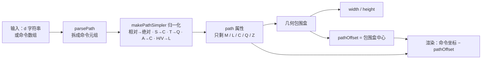

import { Canvas, Controls, Meta } from '@storybook/addon-docs/blocks';
import * as PathLesson from './path.stories';

<Meta of={PathLesson} name="Docs" />

# 路径

Rect、Circle 等基础图形各表达一种固定轮廓，Path 表达任意轮廓：一段 SVG path 数据（`M 40 210 C …` 这样的命令序列）在构造时被拆成命令元组、归一化成 M / L / C / Q / Z 五种绝对命令存进 `path` 属性，包围盒与 `pathOffset` 一次算好，渲染时把命令逐条翻译成 Canvas 的 `moveTo` / `lineTo` / `bezierCurveTo`。学完本课，你能读写 path 数据、预判一段 d 字符串会得到什么轮廓与读数，也能解释路径对象的边界与位置从哪来。

基础图形的创建与通用属性见 [2.1.1 基础图形](?path=/docs/basic-shapes--docs)；本课从"任意轮廓"切入。



| 概念 / 属性 | 值 / 默认 | 回查要点 |
| --- | --- | --- |
| 构造输入 | d 字符串或命令数组 | 构造时一次完成解析、简化与边界计算 |
| `path` | 简化后的命令数组 | 只含绝对 M / L / C / Q / Z；随 `toObject` 序列化 |
| `pathOffset` | Point，构造时算出 | 路径坐标系里的包围盒中心；渲染按 −pathOffset 平移 |
| `width` / `height` | 由命令几何算出 | 不含描边；Q / T 段按控制点直接求界，可能偏大 |
| `left` / `top` | 构造默认 = pathOffset | v7 默认 originX / originY 为 center，left / top 即对象中心 |
| `sourcePath` | 默认无 | 原始 d 字符串，供 `toDatalessObject` 瘦身序列化 |
| `Path.cacheProperties` | 含 path、fillRule | `set()` 改 path 会让对象缓存失效，但不会重算边界 |
| `config.NUM_FRACTION_DIGITS` | 4 | toSVG / 序列化输出的数值小数位 |

## 快速上手

```ts
import { Canvas, Path } from 'fabric';

const canvas = new Canvas(el, { width: 640, height: 360 });

// SVG path 字符串：波浪形轮廓（S 是 C 的控制点反射简写）
const wave = new Path('M 40 210 C 40 90 220 90 220 210 S 400 330 460 120', {
  fill: '#4f7cff',
  opacity: 0.3,
  stroke: '#1e40af',
  strokeWidth: 2,
});
canvas.add(wave);

wave.path;        // 简化后的命令数组：[["M",40,210],["C",…],["C",…]]——S 已转成完整 C
wave.width;       // 由命令几何算出的包围盒宽
wave.pathOffset;  // 路径坐标系里的包围盒中心
```

改动 d 里的任何一个数字，都会同时改变轮廓、width / height 与 pathOffset——完整联动见「解析与存储」的范例。

## 命令速查

Path 的输入就是一段 SVG path 数据。命令由一个字母与若干参数组成：字母大写为绝对坐标（目标点在路径坐标系中的位置），小写为相对坐标（相对当前点的位移）；当前点从 (0, 0) 出发，随每条命令移动。

| 命令 | 参数 | 语义 |
| --- | --- | --- |
| `M` / `m` | x y | 移动到（新子路径的起点） |
| `L` / `l` | x y | 直线到 |
| `H` / `h` | x | 水平直线到（只改 x，y 保持当前值） |
| `V` / `v` | y | 垂直直线到（只改 y） |
| `C` / `c` | x1 y1 x2 y2 x y | 三次贝塞尔曲线（两个控制点 + 终点） |
| `S` / `s` | x2 y2 x y | 三次贝塞尔简写：第一控制点取上一条 C / S 第二控制点的反射 |
| `Q` / `q` | x1 y1 x y | 二次贝塞尔曲线（一个控制点 + 终点） |
| `T` / `t` | x y | 二次贝塞尔简写：控制点取上一条 Q / T 控制点的反射 |
| `A` / `a` | rx ry 旋转 大弧旗 方向旗 x y | 椭圆弧：两轴半径、旋转角（度）、两个 0/1 旗标、终点 |
| `Z` / `z` | — | 关闭子路径：直线回到最近的 M 点 |

三种书写约定先记住：

- **隐式重复**：`M 10 10 L 20 20 30 30` 中 L 的第二对坐标按新的 L 解析；m 之后的坐标对按 l 解析。
- **S / T 的反射**：反射的是"上一条曲线"的对应控制点；前一条不是 C / Q 时，反射退化成当前点（控制点与起点重合）。
- **Z 与填充**：Z 会画一条回到子路径起点的线；没写 Z 时描边保持开口，但填充仍按闭合处理（Canvas 的 `fill()` 隐式闭合子路径）。填充与描边配置见 [2.2.1 填充、描边与阴影](?path=/docs/fill-stroke-shadow--docs)。

弧命令 A 的两个旗标在四段可能的弧里选定一段：大弧旗选大弧还是小弧，方向旗选顺时针还是逆时针。整圆无法用一条 A 画出（起点终点重合时弧不存在），需要两段拼接。

## 解析与存储

构造函数接受两种输入，内部归一成同一种存储：

```ts
import { Path, util } from 'fabric';

new Path('M 40 210 S 400 330 460 120');       // 字符串：完整 SVG 命令集
new Path([['M', 40, 210], ['L', 460, 120]]);  // 数组：直接给命令元组

util.parsePath('M 10 10 h 20 z');
// 拆成命令元组，保留原字母：[["M",10,10],["h",20],["z"]]
```

不管哪种输入，内部都过一遍 `makePathSimpler` 再存进 `path` 属性：相对命令转绝对、S→C、T→Q、A→C、H / V→L，最终只剩 M、L、C、Q、Z 五种绝对命令。由此：

- `path` 属性是**简化后**的数据：`S 400 330 460 120` 存进去变成一条带完整控制点的 C；A 弧被拆成若干条 C 逼近（每段圆心角不超过 90°）；小写命令与 h / v 全部转成绝对的 M / L。
- 读回字符串用 `util.joinPath(path.path)`；`toSVG` 的 d 属性与 `toObject` 的 path 字段都从这份简化数据生成，数值按 `config.NUM_FRACTION_DIGITS`（默认 4 位）截断——含 A 的数据往返 SVG 后是逼近值而非原命令。序列化细节见 [6.1 序列化](?path=/docs/serialization--docs)。
- 传命令数组时同样会被简化：数组里也可以写相对或简写命令，读回 `path` 即得到归一结果。
- `sourcePath` 选项保存原始 d 字符串，`toDatalessObject()` 序列化时用它替代命令数组，是 SVG 导入（[6.2 SVG 互操作](?path=/docs/svg--docs)）给输出瘦身的机制。
- 命令数组里的 M / L 命令在计算包围盒时只贡献线段端点；曲线段的界由控制点参与求出（见「边界与位置」）。

<Canvas of={PathLesson.Interactive} />
<Controls of={PathLesson.Interactive} />

「路径数据」留空时使用「预设路径」的 d 字符串，填写则优先生效。切换预设或直接编辑命令，对照轮廓与读数：

| 读者操作 | 可核对结果 |
| --- | --- |
| 「预设路径」切到 圆弧 A | 轮廓是弧；「存储命令」里没有 A——弧已转成 C，「命令数」比输入的命令多 |
| 「预设路径」切到 相对命令 | 输入全小写还带 h，但「存储命令」全是绝对的 M / L |
| 在「路径数据」里粘贴 `M 40 210 C 40 90 220 90 220 210 S 400 330 460 120` 后改 S 段终点的 y（120 → 320） | 轮廓下探，「width×height」与「pathOffset」同步变化 |
| 拖动轮廓 | 「left, top」变化，「pathOffset」不变——位置归对象，几何归数据 |
| 拖动后开启「重算包围盒并重新对齐」 | 对象跳回构造位置，「left, top」重新等于「pathOffset」 |
| 关闭「锚点/控制点标记」 | 红点（锚点）与橙圈（控制点）消失，只剩轮廓 |
| 打开 Show code | 看到该 Canvas 实际执行的 example.ts |

## 边界与位置

**width / height 是命令几何的包围盒**：由所有子路径的端点与曲线控制点求出，不含描边。带描边时对象的可见外框与选中框会比 width / height 大一圈（描边宽度参与外框计算）。一个可观察的偏差：Q / T 段求界时把控制点直接当三次控制点用，包围盒可能明显大于可见曲线——把预设切到 Q 与 T 即可在读数里看到 height 大于曲线的实际起伏。

**pathOffset 把几何中心搬进对象**：渲染时每条命令的坐标先减去 pathOffset 再画，效果是路径包围盒的中心恰好落在对象局部原点（对象中心）。所以旋转、缩放与控件手柄都围绕轮廓的包围盒中心，而不是画布原点。Polyline / Polygon 用 points 数组驱动轮廓，但共享同一套 pathOffset 机制（见 [2.1.1 基础图形](?path=/docs/basic-shapes--docs)）。

**构造默认把几何放在路径坐标所示的位置**：构造时执行 `setPositionByOrigin(pathOffset, 'center', 'center')`，而 v7 默认 originX / originY 为 center，于是 left / top 恰好等于 pathOffset——d 里写 `M 40 210`，起点就出现在画布坐标 (40, 210) 上（origin 细节见 [3.1 变换](?path=/docs/transform--docs)）。在构造选项里传 left / top 可以覆盖这个默认对齐（选项在边界计算之后应用）。

**修改 path 数据的三个入口**：

| 入口 | 边界重算 | 位置 |
| --- | --- | --- |
| `new Path(d)` 重建后替换 | 构造时完成 | 默认重新对齐路径坐标 |
| `set('path', arr)` + `setDimensions()` | 重算 width / height / pathOffset | 不动（对象中心不变，几何随新 pathOffset 偏移） |
| `set('path', arr)` + `setBoundingBox(true)` | 重算 | 重新对齐：对象中心放回 pathOffset |

注意 `set('path', arr)` 本身只换数据并标记缓存失效（path 在 `Path.cacheProperties` 里），不会重算边界——宽高、pathOffset 停在旧值，渲染还按旧 pathOffset 平移，画面与选中框都会错位，必须再补上表中的重算调用。`setDimensions()` 只是 `setBoundingBox()` 不带参数的别名形态。

## 最佳实践

- **选输入形态**：手写或参数化生成用 d 字符串——支持全部命令、可读、可配 `sourcePath`；程序化逐步构造或改写用命令数组——但读写都以简化形态（M / L / C / Q / Z）为准，别在数组里长期维护 S / T / A 形态。
- **改路径数据的标准句式**：保对象引用与事件用 `set('path', arr)` + `setBoundingBox(true)`；整体换新直接 `new Path(d)` 重建替换，样式与位置需重新应用。范例的「重算包围盒并重新对齐」演示的就是前者。
- **绝对还是相对**：绝对命令便于按读数定位和修改单个锚点；相对命令把整段轮廓的平移集中到首个 M——改一个数即可整体挪动，代价是读存储命令时要在脑内累加坐标。

## 常见问题

- 用 `set('path', …)` 换了数据后，尺寸没变、图形位置也不对
  `set()` 只换数据并让缓存失效，width / height / pathOffset 都是构造时算好的旧值。补 `setDimensions()`（只重算、位置不动）或 `setBoundingBox(true)`（重算并把对象中心放回 pathOffset），再 `requestRenderAll()`。
- Q / T 曲线的 width / height 比看到的曲线大不少
  求界时 Q 的控制点被直接当作三次控制点，包围盒向控制点方向扩张。这只影响尺寸读数与选中框，曲线本身渲染正确；需要紧凑边界时改写成等价的 C 命令。
- 没写 Z，形状却被"闭合"填充了
  Canvas 的 `fill()` 会隐式闭合所有子路径；Z 只影响是否真的画出回起点的那条线。想要开口轮廓，把 fill 设为 `null` 或透明，只用描边（见 [2.2.1 填充、描边与阴影](?path=/docs/fill-stroke-shadow--docs)）。

相邻能力的入口：SVG 文件的导入导出（`loadSVGFromString` / `loadSVGFromURL` / `toSVG`、`Path.fromElement`）在 [6.2 SVG 互操作](?path=/docs/svg--docs)；让文字沿路径排布的路径文字在 [2.3.2 交互文本](?path=/docs/itext-textbox--docs)；自由绘制笔刷松手生成的就是 Path 对象，见 [4.5 自由绘制](?path=/docs/free-drawing--docs)。

## 总结回顾

摘要：

Path 用一段 SVG path 数据表达任意轮廓。命令字母大写绝对、小写相对，M / L / H / V 画直线，C / S / Q / T 画贝塞尔（S / T 反射上一控制点），A 画椭圆弧，Z 关闭子路径；隐式重复省略命令字母。构造时字符串先经 `parsePath` 拆成元组、数组直接使用，再经 `makePathSimpler` 归一成只含绝对 M / L / C / Q / Z 的 `path` 属性，A 被多条 C 逼近。width / height 由命令几何求出（不含描边，Q 段按控制点求界偏大）；pathOffset 是路径坐标系里的包围盒中心，渲染按 −pathOffset 平移使几何中心落在对象中心；构造默认让 left / top 等于 pathOffset，几何正好出现在路径坐标所示的位置。改数据要记得重算边界：`setDimensions()` 不动位置，`setBoundingBox(true)` 重新对齐，`new Path` 重建最省心。

一句话：

> d 字符串只是输入，Path 对象真正的数据是简化后的 M/L/C/Q/Z 命令数组；几何归 path 与 pathOffset，位置归 left / top，改了前者必须重算边界。

知识要点：

- Path 构造接受哪两种输入？构造时一次完成了哪几件事？
- 每个命令字母（M/L/H/V/C/S/Q/T/A/Z）的语义与参数是什么？大小写的区别？
- 隐式重复、S/T 的控制点反射、Z 与隐式闭合分别怎么生效？
- 存进 `path` 属性的数据长什么样？哪五类命令能存活，其余去哪了？
- width / height 怎么算、含不含描边？Q 段的界为什么会偏大？
- pathOffset 的几何含义是什么？它如何让旋转缩放围绕轮廓中心？
- 构造后 left / top 默认是多少？为什么？
- 修改 path 数据后为什么必须重算边界？三个入口各差在哪？

## 参考资料

- [Path API（构造、path、pathOffset、setBoundingBox）](https://fabricjs.com/api/classes/path/)
- [util 命名空间（parsePath / makePathSimpler / joinPath）](https://fabricjs.com/api/fabric/namespaces/util/)
- [Introduction to Fabric.js. Part 1（old docs，Paths 节）](https://fabricjs.com/docs/old-docs/fabric-intro-part-1)
- [MDN SVG Tutorial: Paths（命令语义）](https://developer.mozilla.org/en-US/docs/Web/SVG/Tutorial/Paths)
