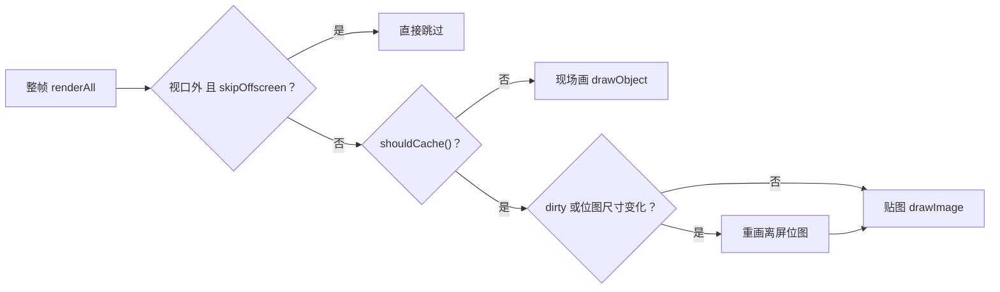

import { Canvas, Controls, Meta } from '@storybook/addon-docs/blocks';
import * as Performance from './performance.stories';

<Meta of={Performance} name="Docs" />

# 性能优化

Fabric 的渲染是**单画布整帧重绘**：一次 `renderAll` 把画布上所有对象从头画一遍，没有分层合成，也没有脏矩形。性能因此是三个乘数的乘积——每帧成本 × 每秒帧数 × 对象数量，本课的四个杠杆各自压低其中一个：对象缓存让"画"变"贴"，渲染控制让重绘只在必要时发生，大数据量策略让每帧参与的对象变少，内存上限回答缓存自己的代价。双层画布、dirty 失效链这些机制在 [1.3 渲染模型](?path=/docs/rendering-model--docs)已经建立，本课直接进入调优决策，最后给一套可复现的测量方法。

一次 `renderAll` 里，每个对象经过的判断链：



| 属性 / 配置 | 默认值 | 回查要点 |
| --- | --- | --- |
| `objectCaching` | `true` | 对象画进离屏位图，重绘时贴图；频繁失效或频繁缩放的对象适合关 |
| `noScaleCache` | `true` | 鼠标缩放手势期间位图只拉伸不重建，松手再重建；Textbox 为 `false` |
| `skipOffscreen` | `true` | 整帧重绘跳过完全在视口外的对象；组内子对象不单独剔除 |
| `renderOnAddRemove` | `true` | add / remove / 层级调整自动 `requestRenderAll`；关掉没有性能收益，只是把刷新职责收归自己 |
| `cacheProperties` | 静态清单 | `set()` 改到清单内属性自动置 dirty（清单见 1.3；Text 类追加了全部排版属性） |
| `stateProperties` | 静态清单 | 组内子对象 `set()` 改到时把父组置 dirty；也是 `saveState` 的状态清单（[历史栈](?path=/docs/history--docs)的主题） |
| `config.perfLimitSizeTotal` | `2097152` | 单个位图总像素上限（约 2Mpx），超出按比例压缩降质 |
| `config.maxCacheSideLimit` | `4096` | 位图单边上限 |
| `config.minCacheSideLimit` | `256` | 位图单边下限，过小的位图会被抬到该值 |

## 渲染成本模型

`renderAll` 做的事：清空 lower-canvas → 按视口变换依次渲染每个对象 → 画 overlay 与激活控件。每个对象的成本走两条路之一：**贴图**（一次 `drawImage`）或**现场画**（完整执行该对象的绘制命令）。与保留场景图、按层合成的引擎不同——那些引擎只重画变化的部分——Fabric 每次都是全量，"只动了一个对象"并不省钱。

交互期间的内部行为（源码核对，v7.4）：

| 交互 | 每个指针事件帧发生什么 |
| --- | --- |
| 拖拽 / 缩放 / 旋转对象 | `_transformObject` 内部 `requestRenderAll` → 整帧重绘，全部对象重画 |
| 空白处框选、自由绘制进行中 | 只 `renderTop()` 刷 upper-canvas，下层不动 |
| 松开鼠标 | 有实际变换则 `requestRenderAll`，否则只 `renderTop` |
| 纯悬停 | 只改光标，不重绘 |

于是得到本课最重要的事实：**动一个对象，成本约等于整帧**。800 个对象里拖动 1 个，另外 799 个每帧都在重新参与渲染——缓存让它们从"重画"降为"贴图"，这正是 objectCaching 存在的理由。

用实验台核对（默认 200 个同构复杂路径对象、约一半在视口外、红色星形为"动画对象"——读数的「对象数」会比控件值多 1，多出的就是它）：

<Canvas of={Performance.Interactive} />
<Controls of={Performance.Interactive} />

| 读者操作 | 可核对结果 |
| --- | --- |
| 「运动方式」保持「拖动」，开「对象缓存」 | 「动画对象位图重画」稳定不增长——拖动只做合成；帧耗时处于低位 |
| 拖动下关闭「对象缓存」 | 每个对象每帧现场画，「帧耗时 均值 / 最大」显著上升；「对象数量」调到 800 时最明显 |
| 切到「缩放」，保持缓存开启 | 「动画对象位图重画」每帧 +1——位图尺寸随缩放每帧重建，缓存不再省 |
| 缩放下关闭「对象缓存」 | 「动画对象走缓存」变为 否，位图重画归零，帧耗时回到与拖动接近的水平 |
| 切到「静止」 | 「实际帧率」降为 0、「整帧重绘次数」不再增长——没有请求就没有渲染 |
| 拖动下关闭「跳过视口外对象」 | 帧耗时上升——视口外的另一半对象重新参与每帧重绘 |
| 「对象数量」调到 50 再对比缓存开关 | 差异几乎不可见——小场景别急着优化 |
| 打开 Show code | 看到该 Canvas 实际执行的 example.ts |

帧耗时的含义：`before:render` 到 `after:render` 之间（已过滤上层 `renderTop` 派发的同名事件）的 `performance.now` 差值，统计近 60 帧的均值与最大值。不同机器、不同 devicePixelRatio 下数字不同，**看相对变化，不背绝对值**。

## 缓存收益与代价

### 何时省

- **复杂对象收益大**：多图元 Group、多顶点 Path、长文本 / 富文本——现场画要遍历全部绘制命令，贴图只是一次 `drawImage`。官方教程的演示（一组重路径对象）给出约 0.8ms（缓存）对 25ms（不缓存）的单帧量级；这只说明收益量级，具体倍数取决于对象复杂度，以自己的实测为准。
- **简单对象收益趋近于零**：`fillRect` 和 `drawImage` 成本相当，缓存还要倒贴一块离屏位图的内存和每次渲染的簿记。满屏 Rect / Circle 时，关不关缓存体感差别不大。
- **FabricImage 是特化路径**：独立图片的 `shouldCache()` 直接返回 `needsItsOwnCache()`——画图片本来就是一次 `drawImage`，再缓存一遍通常是纯开销（见 [2.3.3 图片](?path=/docs/image--docs)）。

### 何时反而贵

位图重建有三条触发线：`dirty` 被置（`set()` 改到 cacheProperties）、**位图尺寸变化**（对象自身 scale、视口 zoom、retina 倍率任一变化）、位图不存在。1.3 讲过第一条，性能视角下更关键的是第二条：

- **频繁缩放的对象**：位图尺寸 ≈ 对象外接框 × 对象缩放 × 视口缩放，`scaleX` 每帧变就意味着位图每帧重建——重画 + 位图重分配，比不缓存还多了缓存簿记。持续做"呼吸"效果的 `pulse` 对象直接关：

  ```ts
  // 需要每帧缩放（或每帧改 fill 等外观）的对象：缓存是净负担
  pulse.set('objectCaching', false);
  // 淡入淡出改用 opacity：它是合成期属性，贴图时实时应用，不触发重建
  ```

- **`noScaleCache` 只救鼠标手势**：它让对象在鼠标缩放手势（`_currentTransform` 进行中、action 以 scale 开头）期间跳过位图重建，松手恢复清晰；Textbox 因为宽度变化要重新折行，默认 `false`。程序每帧 `set('scaleX', ...)` 不享受这层保护——实验台「缩放」模式就是证据。
- **视口 zoom 是集体重建**：所有对象的位图尺寸都跟着 viewportTransform 变。官方教程直言"viewport zooming is a performance killer with many objects and cache"——缩放密集的应用要么接受重建成本，要么对视口缩放做节流（视口操作见 [3.4 视口与坐标](?path=/docs/viewport--docs)）。
- **组内子对象高频变化**：`set()` 改到 stateProperties（left / top / scaleX / angle / opacity 等）时，Fabric 会把父组置 dirty——整组位图重画。高频动画的子对象别放在有缓存的 Group 里；要么把动的对象拿到组外，要么对该组 `objectCaching: false`。
- **动画 fill / 描边颜色**：颜色属于 cacheProperties，每帧改就是每帧重画位图。补间时的 `onChange` 处理方案在 [5.2 动画](?path=/docs/animation--docs)的「渲染与缓存」一节。

### 谁会被缓存

渲染时每个对象用 `shouldCache()` 现场判定，决策式（源码）：

```text
objectCaching && (无父组 || 父组自身不在缓存上) || needsItsOwnCache()
```

- `needsItsOwnCache()` 为 `true` 的两种情况：带 `clipPath`；或 `paintFirst: 'stroke'` 且同时有填充、描边、阴影（先描边后填充加阴影的画法必须走缓存步骤才能正确）。注意它**优先于** `objectCaching: false`——clipPath 对象即使关了开关也会有自己的一层缓存。
- Group 默认整组一张位图，子对象不单独缓存（省内存也省合成）；但只要任一子对象（递归检查）带**有偏移的阴影**，整组放弃缓存——位图化的阴影方向不会跟着组旋转，必须现场画。
- 独立 FabricImage 默认不缓存（上文特化）。

## 渲染控制

### 合帧与手动控制

`requestRenderAll` 用句柄去重，同一帧调用多少次只渲染一次（机制见 1.3）。围绕它的使用纪律：

- 高频回调（指针移动、动画 onChange、resize）里**只调 `requestRenderAll`**，绝不在回调里 `renderAll`——后者同步执行，一帧多次就是多次全量重绘。
- `renderOnAddRemove: false` 的真实用途是**批量构建期**：一次性 add 数百个对象时不产生中间渲染，构建完手动 `renderAll` 一次。官方注明常态下关它没有性能收益（渲染已按帧合并），只在加载 / 生成场景的瞬间有价值。实验台构建对象时用的就是这招。
- 反过来记住：**静止的内容零成本**。没有重绘请求就没有渲染——实验台「静止」模式下帧率归零。持续跑 rAF 循环但只在有变化时 `requestRenderAll`，是最便宜的省电模式（帧循环模式见 [5.2 动画](?path=/docs/animation--docs)）。

### 视口剔除 skipOffscreen

`skipOffscreen`（默认 `true`）让整帧重绘时跳过完全在视口外的对象——不是"画了但看不见"，是连 `drawImage` 都不执行。三个边界：

- 只对**顶层对象**生效：组内的子对象不单独剔除，整组作为一个单元判定。
- 判定用的是 `oCoords`（`isOnScreen` 与视口四角求交）。程序改 `left` / `top` / 视口变换后必须 `setCoords()`，否则坐标过期、剔除判断错位——官方 GOTCHAS 收录的经典坑。
- 导出不受影响：`toCanvasElement` 内部临时把 `skipOffscreen` 关掉再渲染（见 [6.3 图片导出](?path=/docs/export--docs)）。

适用条件：场景远大于视口——大画布平移缩放、长数据可视化、地图式内容。实验台里一半对象在视口外，开关对比的就是这部分差价。

## 大数据量策略

数量级分界没有万能数字，以实验台的同构复杂路径对象为参照：50 个时缓存开关几乎无感；200 个时差异可测；800 个时帧耗时与帧率明显随开关变化。你的分界取决于对象复杂度与交互密度，用「测量方法」的钩子实测，不要背别人的数字。

### 静态层预渲染成 FabricImage

官方教程给的第一建议：不动的复杂内容（大 SVG、静态组合、背景装饰）先一次画好，之后每帧只贴一张图：

```ts
import { FabricImage, StaticCanvas } from 'fabric';

// 静态背景：构建期关掉自动重绘，完成后手动渲染一次
const bg = new StaticCanvas(undefined, {
  width: 1280,
  height: 720,
  renderOnAddRemove: false,
  backgroundColor: '#f8fafc',
});
bg.add(...hundredsOfStaticObjects);
bg.renderAll();

// 主画布每帧只多贴一张图；FabricImage 本身不建缓存，绘制就是一次 drawImage
const bgImage = new FabricImage(bg.lowerCanvasEl, {
  left: 0,
  top: 0,
  selectable: false,
  evented: false,
});
mainCanvas.add(bgImage);
```

代价是失去这批内容的对象级交互与单独序列化。常见折中：数据层保留原对象树（不 add 进主画布），显示层用预渲染图；编辑时再按需换回真对象。

### 动画对象与文本

- **持续变化的少数对象关缓存**，静止的多数保持缓存——一屏里通常只有几个对象在动。[2.3.3 图片](?path=/docs/image--docs)的视频对象用的就是 `objectCaching: false` 加官方 demo 同款配置。
- **文本缓存收益大、重建也贵**：Text 类的 cacheProperties 在通用清单外追加了全部排版属性（fontSize、fontFamily、text、charSpacing、textAlign、styles、下划线等）——长文本一次折行测量很贵，贴图很划算；但每帧改文字就是每帧重排加重画位图。编辑期正常（用户输入频率低），动画期避免。文本测量与字体加载的坑见 [2.3.1 文本](?path=/docs/text--docs)。
- **优先选合成期属性做动画**：left / top / angle / opacity 只影响贴图变换，不触发任何重建；scale 和外观属性（fill、stroke）才碰位图。

### 更大数量级：剔除、分页与对象池

数千对象以上，进入架构手段的 territory：

- **自管可见窗口**：比 skipOffscreen 更进一步——只把视口附近的子集 `add` 进画布，滚动 / 平移时换入换出。剔除判定自己算（空间网格或简单分桶）。
- **分页 / 瓦片**：把大场景按区域预渲染成多张 FabricImage 瓦片，按视口按需挂载，思路同上节但粒度更大。
- **对象池**：高频创建销毁（打字机效果、粒子）时复用对象实例，省掉路径解析、文本测量等构造成本。
- 到这个量级，先测量再动手——瓶颈可能在事件命中测试（`findTarget` 遍历）而不在渲染，优化方向完全不同。

## 内存与缓存上限

缓存不是免费的：每个走缓存的对象常驻一块离屏位图，粗算字节数 ≈ (外接宽 + 描边) × (外接高 + 描边) × 对象缩放 × 视口缩放 × retina 倍率² × 4。一个 200px 方块在 2x 高清屏上约 640KB；实验台的「缓存内存 估算」读数就是这个公式的实时结果——2x 屏上 200 个对象约 8 MB、800 个约 30 MB，切换缓存开关会直接归零再回升。retina 倍率对内存的放大在 [1.3 渲染模型](?path=/docs/rendering-model--docs)埋过伏笔，这里是它的账单。

位图有硬上限，超出会被**压缩降质**而不是报错：

- 单边超过 `maxCacheSideLimit`（4096）或总像素超过 `perfLimitSizeTotal`（2097152，约 2Mpx）时，按长宽比压出新的宽高、等比调低位图内部的 zoom——对象照常显示，但放大看细节变糊。
- 单边低于 `minCacheSideLimit`（256）时反而抬到 256——过小的位图贴图时损失精度。

三个值都在 `config` 上，从 `fabric` 包直接导入修改：

```ts
import { config } from 'fabric';

config.perfLimitSizeTotal = 4194304; // 单个位图上限提到 4Mpx
config.maxCacheSideLimit = 8192;     // 单边上限，注意与内存的权衡
```

大屏高分屏、需要放很大的对象（海报、图表局部）可以上调；内存受限环境（多画布、移动端）下调。另有一个导出侧的注意：官方教程不建议带着被压缩过的缓存位图做 PNG / JPEG 导出——细节已经丢了，导出前对相关对象关缓存再导（导出流程见 [6.3 图片导出](?path=/docs/export--docs)）。

## 测量方法

优化的前提是测量。三层工具从粗到细：

**1. after:render 计时（本课实验台的实现）**——在代码里挂钩子，得到每一帧的真实耗时：

```ts
let frameStart = 0;
const mainCtx = canvas.getContext();

canvas.on('before:render', ({ ctx }) => {
  if (ctx === mainCtx) frameStart = performance.now();
});
canvas.on('after:render', ({ ctx }) => {
  if (ctx !== mainCtx) return; // renderTop() 只刷上层，也派发 after:render，必须过滤
  const cost = performance.now() - frameStart;
  // 汇总近 N 帧的均值、最大值与每秒帧数
});
```

看三个数：均值（稳态成本）、最大值（尖刺——往往来自位图重建、GC）、帧率。改一个参数测一组，别一次改多个。

**2. 重绘与缓存状态读数**——整帧重绘次数（过滤上层事件后计数 `after:render`）、`obj.dirty`、位图是否重建，用来回答"成本花在了渲染还是重建"。实验台对动画对象包一层 `drawObject` 计数就是这个用途。

**3. Chrome DevTools**——Performance 面板录制交互过程，看每帧的时间花在脚本（紫色）、渲染还是绘制，rAF 回调是否超帧；Rendering 面板的 FPS meter 可以直接盯帧率。经典的 Canvas inspection 实验（逐帧回放 canvas 调用）已从新版 Chrome 移除，不要按旧教程找它。

数字要标注条件：机器、浏览器、devicePixelRatio、对象构成与数量。脱离条件的"快了 N 倍"没有意义。

## 最佳实践

- 先测量再优化：挂 `after:render` 计时，确认瓶颈在渲染（而不是事件命中、序列化）再动手；一次只改一个变量。
- 高频回调纪律：动画 / 指针回调里只改合成期属性（left / top / angle / opacity）+ `requestRenderAll`；每帧改 scale 或外观属性前，先想清楚位图重建的代价。
- 缓存的开关按对象分级：静态复杂对象保持缓存，持续变化或频繁缩放的对象 `objectCaching: false`，成片的静态内容预渲染成一张 FabricImage。
- 批量构建 / 加载场景时 `renderOnAddRemove: false` + 完成后一次 `renderAll`；常态渲染交给 `requestRenderAll` 合帧。
- 场景远大于视口时保持 `skipOffscreen`，程序移动对象后补 `setCoords()`。
- 视口缩放密集的应用警惕集体重建；内存敏感场景核对 `config` 三个上限与 retina 放大。

## 常见问题

- 拖动一个对象，整个画布就掉帧
  这就是整帧重绘成本模型：动一个等于重画全部。按顺序尝试：确认对象走了缓存（读数或 `shouldCache()`）；把静态内容预渲染成 FabricImage；场景大于视口时确认 `skipOffscreen` 生效；最后才是减少对象数。
- 缩放动画又卡又发虚，开缓存也没用
  每帧改 scaleX / scaleY 让位图尺寸每帧变化，缓存开着反而每帧重建（发虚是压缩或拉伸中的位图）。对该对象 `objectCaching: false`；淡入淡出类效果改用 opacity——合成期属性，不碰位图。
- 关掉 objectCaching 之后反而变快了
  正常，两种情况会这样：对象本身简单（画和贴图成本相当），或对象每帧都失效（缓存变成"每次重画 + 簿记"）。缓存是给"画得贵、变得少"的对象准备的。
- 放大后的大对象边缘发糊
  位图尺寸超过了 `config` 上限被压缩降质。上调 `maxCacheSideLimit` / `perfLimitSizeTotal`（注意内存），或拆小对象，或导出前关缓存重画。
- 程序移动对象之后，视口剔除行为不对（该消失的还在画 / 该显示的被跳过）
  `isOnScreen` 用的是 `oCoords`，程序改完 left / top / 视口后要 `setCoords()` 同步，否则判定基于过期坐标——官方 GOTCHAS 收录的坑。
- 内存占用远超预期
  按公式粗算每个缓存对象的位图字节（别忘了 retina 倍率的平方），用实验台的「缓存内存 估算」核对量级；给不必要缓存的对象关掉，`_removeCacheCanvas` 会在下次渲染时释放位图。

## 总结回顾

摘要：

Fabric 单画布整帧重绘，性能是"每帧成本 × 帧率 × 对象数"的乘积。缓存把重画变贴图，收益集中在复杂对象，代价是内存与失效重建——位图尺寸随对象缩放、视口 zoom、retina 倍率变化而重建，频繁缩放的对象关缓存更划算；noScaleCache 只保护鼠标手势。shouldCache 由 objectCaching、父组状态与 needsItsOwnCache（clipPath、先描边加阴影）共同决定，组内子对象变化会把整组置 dirty。渲染控制靠 requestRenderAll 合帧、构建期关 renderOnAddRemove、skipOffscreen 剔除视口外对象（需 setCoords 保判定新鲜）。大数据量先预渲染静态层成 FabricImage、动画对象单独关缓存，更大规模用自管可见窗口、瓦片与对象池。缓存内存按外接框 × 缩放 × retina² × 4 估算，config 三个上限决定超限位图被压缩降质。一切决策以 after:render 计时与重绘读数的实测为准。

一句话：

> 动一个对象就是重画整帧：缓存决定每个对象是"画"还是"贴"，渲染控制决定这一帧要不要发生，测量决定你优化的是不是真瓶颈。

知识要点：

- 一次 renderAll 的成本由哪几部分构成？动一个对象为什么等于重画全部？
- objectCaching 何时省、何时反而贵？位图重建的三条触发线是什么？
- noScaleCache 保护的是什么操作、不保护什么？
- shouldCache 的判定式是什么？needsItsOwnCache 在哪两种情况下为真？
- 组内子对象改 stateProperties 会发生什么？
- requestRenderAll 的合帧语义与 renderOnAddRemove 的真实用途？
- skipOffscreen 的生效边界（组、setCoords、导出）？
- 静态内容预渲染成 FabricImage 的做法与代价？
- 缓存位图内存怎么粗算？config 三个上限超限后发生什么？
- after:render 计时要过滤什么？均值、最大值、帧率各回答什么问题？

## 参考资料

- [Object caching（官方教程，本课主参考）](https://fabricjs.com/docs/fabric-object-caching/)
- [官方 GOTCHAS 常见坑（setCoords、直接赋值不失效）](https://fabricjs.com/docs/old-docs/gotchas/)
- [StaticCanvas API（renderAll / requestRenderAll / renderOnAddRemove / skipOffscreen / getContext）](https://fabricjs.com/api/classes/staticcanvas/)
- [FabricObject API（objectCaching / noScaleCache / shouldCache / needsItsOwnCache / isOnScreen / drawObject）](https://fabricjs.com/api/classes/fabricobject/)
- [config（perfLimitSizeTotal / maxCacheSideLimit / minCacheSideLimit）](https://fabricjs.com/api/variables/config/)
- [Canvas inspection using Chrome DevTools（web.dev，经典 Canvas 面板流程，注意该实验已被新版 Chrome 移除）](https://web.dev/articles/canvas-inspection)
- [Chrome DevTools Performance 面板参考](https://developer.chrome.com/docs/devtools/performance/reference)
