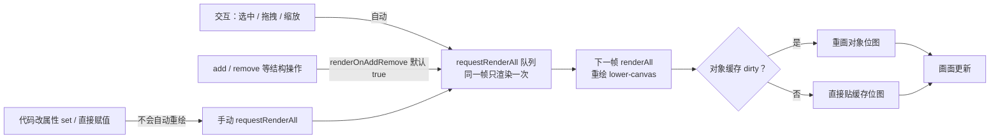

import { Canvas, Controls, Meta } from '@storybook/addon-docs/blocks';
import * as RenderingModel from './rendering-model.stories';

<Meta of={RenderingModel} name="Docs" />

# 渲染模型

Fabric 把画布渲染拆成两层 DOM、一套按帧合并的重绘队列和一层对象位图缓存。本课讲清画布在页面里长什么样、什么时候会真的重绘、重绘时对象是怎么被画上去的，并补充高清屏上的物理像素放大。学完后，"改了属性画面没反应"这类问题可以直接定位到具体环节。

画布的创建与安装见 [1.2 安装与第一个画布](?path=/docs/getting-started--docs)；本课直接从渲染行为切入。



| 概念 / 属性 | 默认值 | 回查要点 |
| --- | --- | --- |
| Canvas DOM 结构 | wrapper + 双层 canvas | lower 渲染场景，upper 承接交互；指针事件绑在 upper |
| `renderAll()` | — | 同步立即重绘，并取消已排队的请求 |
| `requestRenderAll()` | — | 排队到下一动画帧；同帧多次调用只渲染一次 |
| `renderOnAddRemove` | `true` | add / insertAt / remove / 层级调整 / clear 等自动请求重绘 |
| `objectCaching` | `true` | 对象先画进自己的离屏位图，渲染时贴图 |
| `dirty` | 初始 `true` | 缓存失效标记：`set()` 改到 cacheProperties 自动置 true，重画后清回 false |
| `noScaleCache` | `true` | 鼠标缩放手势期间不重建缓存，松手再重建；Textbox 为 `false` |
| `enableRetinaScaling` | `true` | 物理像素 = CSS 尺寸 × devicePixelRatio |
| `skipOffscreen` | `true` | 重绘时跳过视口外的对象 |

## 双层画布

传入的 canvas 元素会被 Fabric 接管。`StaticCanvas` 只把它标记为 lower-canvas（`data-fabric="main"`）；交互版 `Canvas` 在外面包一层 wrapper div（`data-fabric="wrapper"`），再叠一个 upper-canvas（`data-fabric="top"`）盖在上面：

```ts
import { Canvas } from 'fabric';

const canvas = new Canvas(el, { width: 640, height: 360 });
canvas.lowerCanvasEl; // 下层：渲染场景
canvas.upperCanvasEl; // 上层：交互瞬态层
canvas.wrapperEl;     // 包住两层的 div
canvas.contextTop;    // 上层的 2D 上下文
```

两层分工：

| 层 | 画什么 | 谁来画 |
| --- | --- | --- |
| lower-canvas | 背景、全部对象、overlay、激活对象的边框与控件 | `renderAll` 整帧重绘 |
| upper-canvas | 框选矩形、自由绘制中的笔迹、文本编辑光标与选区、拖拽效果 | `renderTop` 只刷这一层 |

- 指针事件全部绑定在 upper-canvas 上，光标样式也改在这一层；下层因此可以安心整帧重绘，交互反馈不会被覆盖。
- 瞬态内容用 `renderTop()` 单独刷新，代价远小于整帧重绘；`Canvas` 上的 `renderAll()` 重绘下层时会顺带清掉上层的脏内容。
- 自由绘制进行中的笔迹在上层，松手生成 Path 对象、加入画布后才落到下层（add 自动请求重绘）。
- 激活对象的边框与控件画在 lower-canvas 的整帧流程里，样式与可见性配置在 [4.3 变换控件](?path=/docs/controls--docs)展开。

可核对：在下方范例的空白处拖动会出现框选矩形，它画在 upper-canvas 上、松手消失；用 devtools 检查 `document.querySelector('[data-fabric="top"]')` 能直接看到两层结构。

## 刷新时机

核心判断：Fabric 不监听对象属性。改属性只是改了内存值，画面要等下一次 `renderAll`，而这次重绘不会自己来——除非你显式发起，或恰好落在结构操作、交互事件的自动路径上。

最小表达：

```ts
rect.set('fill', '#e11d48'); // 只改值，顺带标记缓存失效
canvas.requestRenderAll();   // 排队到下一帧整帧重绘
```

对象的通用属性（fill、宽高、位置等）细节在 [2.1.1 基础图形](?path=/docs/basic-shapes--docs)；这里只关心它们何时反映到画面。

三个刷新入口的取舍：

- `renderAll()`：立即同步执行整帧重绘，执行前取消已排队的请求。适合单次低频调用，或导出前确保画面最新。
- `requestRenderAll()`：把重绘排到下一个动画帧；内部用句柄去重，同一帧里调用多少次都只渲染一次。动画逐帧回调、resize、批量修改后的标准选择。
- `renderOnAddRemove`（默认 `true`）：`add` / `insertAt` / `remove` / `moveTo` 与层级调整（`bringObjectToFront` 等）、`clear`、`centerObjectH` 等结构操作自动 `requestRenderAll`。官方注明关闭它并没有性能收益（渲染已按帧合并），关掉只是把刷新责任完全收归自己。

此外这些 API 会自动请求重绘：`setDimensions`、`setViewportTransform` / `zoomToPoint` / `setZoom` / `absolutePan` 等。程序改对象属性（`set` 或直接赋值）则永远不会自动重绘。

交互路径由 Fabric 内部触发：点选、拖拽、缩放、旋转对象时，每个事件帧自动 `requestRenderAll`；拖动框选时只 `renderTop()` 刷上层；纯悬停只改光标，不触发重绘。这也是"忘了手动刷新"的典型症状：代码改完没反应，鼠标一动画面就更新了。

<Canvas of={RenderingModel.Interactive} />
<Controls of={RenderingModel.Interactive} />

范例初始 fill 与「填充色」一致；挂载后的头几次渲染（首帧与舞台尺寸校正）构成「下层重绘次数」的基线，之后只随交互或 requestRenderAll 递增。按下表逐项核对：

| 读者操作 | 可核对结果 |
| --- | --- |
| 「改后刷新」保持不刷新，改「填充色」 | 画面不动；「对象 fill」已是新值，「缓存待重绘」变为 是 |
| 把「改后刷新」切到 requestRenderAll() | 下一帧矩形变色，「缓存待重绘」翻回 否，「下层重绘次数」加 1 |
| 「改属性方式」切到直接赋值，改色并保持 requestRenderAll() | 「对象 fill」和「下层重绘次数」更新了，但画面仍是旧颜色——缓存没失效 |
| 在画布上点选或拖动矩形 | 「下层重绘次数」随交互递增——交互自动请求重绘 |
| 在空白处拖出框选矩形 | 框选画在 upper-canvas 上，松手消失——瞬态内容走上层 |
| 关闭「retina 高清缩放」 | 「画布像素 物理」变回与 CSS 相同，「retina 缩放」变为 1 |
| 打开 Show code | 看到该 Canvas 实际执行的 example.ts |

## 对象缓存

整帧重绘时，对象默认不是现场画出来的：`objectCaching`（默认 `true`）让对象先把自己画进一块离屏 canvas 位图（`_cacheCanvas`，尺寸约等于对象外接框乘上总缩放），重绘时用 `drawImage` 把位图贴到 lower-canvas；位移、旋转、透明度、阴影在贴图时实时应用，所以拖动、旋转、改 opacity 都不需要重画位图。

缓存什么时候重建：

| 改动 | dirty | 位图 |
| --- | --- | --- |
| fill、stroke、strokeWidth、宽高、clipPath、paintFirst 等（cacheProperties） | `set()` 改到值时自动置 `true` | 下一帧重画 |
| left、top、angle、scaleX、opacity | 不置 | 复用，合成时实时应用 |
| 位图不存在、尺寸变化（视口缩放、retina 倍率变化） | — | 自动重建 |

- 一律用 `set()` 改属性：它内部比对值并检查 `cacheProperties`，需要时自动置 dirty。直接赋值 `rect.fill = 'red'` 绕过这层，位图保持旧内容，即使 `renderAll` 画面也不变；补救是 `rect.set('dirty', true)` 再刷新，或改用 `set()` 再改一次值。
- 缓存位图有上限，超出会被压缩：`config.perfLimitSizeTotal`（2097152，约 2Mpx 总量）、`config.maxCacheSideLimit`（4096）、`config.minCacheSideLimit`（256）。
- `noScaleCache`（默认 `true`）：鼠标缩放手势期间位图只被拉伸、不重建，拖大过程会暂时发虚，松手恢复清晰；Textbox 因宽度变化要重新折行，默认 `false`。
- 对象在 Group 内默认不单独缓存（整组一张位图）；clipPath 等场景会强制对象拥有自己的缓存（`needsItsOwnCache`）。
- 简单图形（矩形、圆）缓存收益很小，复杂路径、组合图形、长文本收益大。何时关缓存、导出前怎么处理、大数据量策略，见 [7.2 性能优化](?path=/docs/performance--docs)。

## 高清渲染

`enableRetinaScaling`（默认 `true`）让画布在高清屏上按 devicePixelRatio 放大物理像素：CSS 尺寸仍是逻辑尺寸，canvas 元素的 width / height 属性变为逻辑值 × `getRetinaScaling()`，上下文预先 scale，线条与文字边缘保持锐利。

```ts
canvas.getRetinaScaling(); // 当前倍率：devicePixelRatio，最低 1
canvas.width;              // 逻辑宽（CSS 尺寸）
canvas.lowerCanvasEl.width; // 物理像素宽（已乘倍率）
new Canvas(el, { enableRetinaScaling: false }); // 关闭后物理像素 = 逻辑像素
```

- 倍率取 `Math.max(config.devicePixelRatio ?? window.devicePixelRatio, 1)`；浏览器里 config 在模块加载时快照 `window.devicePixelRatio`，Node / 测试环境可通过 `config.devicePixelRatio` 显式指定。
- 对象缓存位图的尺寸同样乘了 retina 倍率：高清屏上更清晰，也更吃内存，这是 7.2 性能话题的伏笔。
- 范例读数核对：「画布像素 物理」等于「画布像素 CSS」乘「retina 缩放」；关闭「retina 高清缩放」后两组数字相等（倍率变化靠 setDimensions 生效，会顺带自动重绘一次）。

## 最佳实践

- 属性修改的标准句式是 `set()` + `requestRenderAll()` 成对出现；高频回调（动画 onChange、指针移动、resize）里只用 `requestRenderAll()`，让一帧内的多次修改合并成一次渲染。
- 批量 add / remove 不必关 `renderOnAddRemove`：排队机制已保证一帧只渲一次；只有想把刷新时机完全显式化时再关。
- 影响"画什么"的属性（fill、stroke、宽高、clipPath 等）必须走 `set()`；自定义对象新增影响外观的属性时，同步扩展该类的 `cacheProperties`（[7.3 自定义对象](?path=/docs/custom-object--docs)）。
- 视口缩放密集的场景留意缓存尺寸跟随 zoom 重建的开销；策略层面的优化留给 [7.2 性能优化](?path=/docs/performance--docs)。

## 常见问题

- 改了属性，画面没有任何反应
  先补 `canvas.requestRenderAll()`。典型旁证：鼠标在画布上点一下或拖一下，画面突然更新了——交互自动触发渲染，恰好暴露你漏掉的手动刷新。
- 已经调了 renderAll，颜色还是旧的
  大概率是直接赋值改的属性：`rect.fill = 'red'` 不经过内部 `_set`，dirty 没置，缓存位图未失效。执行 `rect.set('dirty', true)` 再 `requestRenderAll()`，或改用 `rect.set('fill', ...)` 换一个值。
- 高清屏上画面发虚
  确认 `enableRetinaScaling` 没被关闭；自定义的带子对象的对象还要保证子对象拿到 canvas 引用，否则取不到 retina 倍率（官方 GOTCHAS 有收录），自定义细节见 [7.3 自定义对象](?path=/docs/custom-object--docs)。

## 总结回顾

摘要：

Fabric 用 wrapper 内两层 canvas 分工：lower-canvas 由 `renderAll` 整帧重绘场景与激活控件，upper-canvas 承接指针事件与框选、笔迹、文本选区等瞬态内容（`renderTop` 单独刷新）。重绘只有三类来源：显式 `renderAll` / `requestRenderAll`、结构操作经 `renderOnAddRemove` 自动请求、交互事件自动请求；程序改属性永远不自动重绘。重绘时对象默认走位图缓存：`set()` 改到 cacheProperties 才置 dirty 重建位图，直接赋值会让画面停在旧位图。高清屏上 `enableRetinaScaling` 把物理像素放大 devicePixelRatio 倍，缓存位图也随之放大。

一句话：

> 属性只改内存值，画面由 renderAll 决定：set() 负责让缓存失效，requestRenderAll() 负责让画面更新，两者缺一不可。

知识要点：

- lower-canvas 与 upper-canvas 各画什么、指针事件绑在哪一层？
- renderAll 与 requestRenderAll 的执行时机差异是什么？
- renderOnAddRemove 默认值是什么、覆盖哪些操作？
- 哪些改动会自动请求重绘，哪些必须手动发起？
- set() 与直接赋值对 dirty 和缓存位图的影响差在哪？
- enableRetinaScaling 如何改变画布物理像素与缓存位图尺寸？

## 参考资料

- [Object caching（官方教程）](https://fabricjs.com/docs/fabric-object-caching/)
- [StaticCanvas API（renderAll / requestRenderAll / renderOnAddRemove / enableRetinaScaling）](https://fabricjs.com/api/classes/staticcanvas/)
- [官方文档站（指南入口）](https://fabricjs.com/docs/)
- [官方 GOTCHAS 常见坑](https://fabricjs.com/docs/old-docs/gotchas/)
