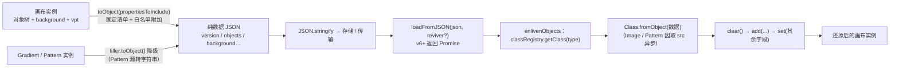

import { Canvas, Controls, Meta } from '@storybook/addon-docs/blocks';
import * as Serialization from './serialization.stories';

<Meta of={Serialization} name="Docs" />

# 序列化

Fabric.js 的 JSON 序列化是一个"固定字段清单 + 白名单附加"的导出器，配一个"按 type 查注册表"的复活器。`canvas.toObject()` 把画布与对象树压成纯数据（渐变、Pattern 这类实例被降级成普通对象），`loadFromJSON()` 再凭每个条目的 `type` 从 classRegistry 查回类、调 `fromObject` 造出新实例。预测任何往返会不会丢东西，看三件事：**字段进没进白名单**（自定义属性不进白名单就静默消失）、**类型注册没注册**（查不到直接报错）、**开关裁没裁**（`includeDefaultValues` 砍体积、`excludeFromExport` 砍成员）。两个最容易踩的默认行为先立住：`viewportTransform` 默认**不**导出（要显式加白名单），v7 的 `canvas.toJSON()` **不**接受参数（v5 会转发白名单，v7 静默忽略）。本课只覆盖 JSON 通道——SVG 互操作与 `toDataURL` 图片导出是另外两条独立通道，各有专课。



| 输入 / 字段（默认值） | 挂在哪 | 回查要点 |
| --- | --- | --- |
| `toObject(propertiesToInclude = [])` | Canvas / 对象 | 唯一吃白名单的入口；同一份数组还负责 pick 画布自身字段 |
| `toJSON()`（无参数） | Canvas | 恒等于 `toObject()`；为 `JSON.stringify(canvas)` 服务 |
| `FabricObject.customProperties`（`[]`） | 静态 | 全局自动白名单，免每次传数组 |
| version（= fabric 版本，如 `7.4.0`） | 顶层 + 每个对象条目 | 只作标记，加载端不校验 |
| background / overlay / backgroundImage / overlayImage / clipPath | 顶层条件键 | 只有设置时才出现 |
| viewportTransform | —（默认不导出） | 必须显式加进 `propertiesToInclude` |
| includeDefaultValues（true） | Canvas 与对象 | 画布级 false 级联覆盖每个对象 |
| excludeFromExport（false） | 对象 / Gradient / Pattern | 只挡导出类方法，不挡渲染 |
| `config.NUM_FRACTION_DIGITS`（4） | 全局配置 | left / top / scaleX 等数值的输出精度 |

## 快速上手

```ts
import { Canvas, Rect } from 'fabric';

const canvas = new Canvas(el, { width: 640, height: 360 });
const rect = new Rect({ left: 100, top: 100, width: 140, height: 90, fill: '#f43f5e' });
rect.set('taskId', 'a-001'); // 任意自定义字段
canvas.add(rect);

// 导出：白名单决定自定义字段与 viewportTransform 是否落盘
const data = canvas.toObject(['taskId']);
localStorage.setItem('scene', JSON.stringify(data));

// 恢复：v6+ 返回 Promise，完成后手动刷一帧
canvas.loadFromJSON(localStorage.getItem('scene'))
  .then((c) => c.requestRenderAll());
```

三点先记住：`data` 是普通对象，可直接 `JSON.stringify`、存储、传输；`loadFromJSON` 接受字符串或对象，**加载前会 `clear()` 清空整块画布**（替换语义，不是追加）；`taskId` 能回来的唯一原因是进了白名单——用 `get('taskId')` 核对。

## 导出的 JSON 形态

### 画布级字段

`canvas.toObject()` 恒有 `version` 与 `objects` 两个键，其余按需出现。一块设了 `backgroundColor: '#eef2ff'` 的画布（7.4.0 实测）：

```jsonc
{
  "version": "7.4.0",
  "objects": [ /* 对象条目 */ ],
  "background": "#eef2ff"
}
```

- `background` / `overlay`（颜色）、`backgroundImage` / `overlayImage`（图片）、`clipPath` 都是**条件键**：设置了才出现；backgroundColor 为渐变 / Pattern 时，`background` 变成对应的数据对象而非字符串。
- **`viewportTransform` 默认不在导出里**——缩放平移状态要落盘，必须 `canvas.toObject(['viewportTransform'])`。视口变换的操作细节见[视口与坐标](?path=/docs/viewport--docs)。
- **白名单的双重作用**：`propertiesToInclude` 同时决定 (a) 画布自身哪些字段被 pick 进顶层（如 viewportTransform），(b) 每个对象额外序列化哪些自定义键。一份数组管两层，加载端 `set(serialized)` 把顶层字段原样写回画布。

### 对象条目与固定键

每个条目 = **固定清单 + 白名单附加 + 类特有键**。Rect 的全量键（7.4.0 实测 33 个，含圆角 rx / ry）：

```text
type, version, originX, originY, left, top, width, height, fill, stroke,
strokeWidth, strokeDashArray, strokeLineCap, strokeDashOffset, strokeLineJoin,
strokeUniform, strokeMiterLimit, scaleX, scaleY, angle, flipX, flipY, opacity,
shadow, visible, backgroundColor, fillRule, paintFirst, globalCompositeOperation,
skewX, skewY （+ clipPath 设置时；Rect 另有 rx / ry）
```

- `type` 取静态 `constructor.type`，v7 是大写驼峰（`'Rect'`、`'IText'`、`'Textbox'`）；实例上的 `obj.type` getter 返回小写——两种拼写都在 classRegistry 里登记过，加载都认。
- 数值统一按 `config.NUM_FRACTION_DIGITS`（默认 4）位输出：`left: 10.123456789` 导出为 `10.1235`。
- 类特有附加键：Rect 加 `rx` / `ry`；Text 加 `text` / `fontSize` / `styles` / `path` 等；Group 加 `objects` / `subTargetCheck` / `interactive` / `layoutManager`（组序列化的布局语义见[分组与多选](?path=/docs/group-selection--docs)）；Image 加 `src` / `crossOrigin` / `filters` / `cropX` / `cropY` / `resizeFilter`。
- **`stateProperties` / `cacheProperties` 与序列化无关**：前者是 `saveState` / `hasStateChanged`（历史栈，见[历史栈](?path=/docs/history--docs)）的"状态"清单，后者是缓存失效的监听清单；序列化字段清单是 `toObject` 里硬编码的另一份。交互与缓存字段（`selectable`、`hasControls`、`objectCaching`、`dirty`、`oCoords`…）一律不落盘。

### 渐变与 Pattern 的降级

导出产物里没有 Gradient / Pattern 实例——fill / stroke 上的 Filler 被 `toObject()` 成纯数据：

```jsonc
// 渐变：type + coords + colorStops + 偏移与单位
{ "type": "linear", "coords": { "x1": 0, "y1": 0, "x2": 0, "y2": 1 },
  "colorStops": [{ "offset": 0, "color": "#f43f5e" }, { "offset": 1, "color": "#7dd3fc" }],
  "offsetX": 0, "offsetY": 0, "gradientUnits": "percentage" }
// Pattern：source 一律是字符串——字符串 / 图片源保留地址，canvas 源转 data URL
{ "type": "pattern", "source": "data:image/png;base64,…", "repeat": "repeat",
  "crossOrigin": null, "offsetX": 0, "offsetY": 0, "patternTransform": null }
```

加载端凭 `type`（`'linear'` / `'radial'` / `'pattern'`）从 classRegistry 查到 Gradient / Pattern 复活，Pattern 因要重新加载 source 而异步。渐变的构建与语义见[渐变与图案](?path=/docs/gradients-patterns--docs)；本课只关心形态与体积——canvas 源的 Pattern 导出内嵌完整 data URL，**源图越大 JSON 越肥**，用 URL 字符串或图片元素做源可保留原地址。

## 自定义属性白名单

**只序列化白名单内的自定义字段。** `object.set('taskId', ...)` 挂上去的任意字段默认**不**进导出；`toObject(propertiesToInclude)` 把列到的键附加进条目：

```ts
rect.set('taskId', 'a-001');
rect.set('remark', '业务标注');

rect.toObject().taskId;                 // undefined —— 默认不在
rect.toObject(['taskId']).taskId;        // 'a-001'
rect.toObject(['taskId']).remark;        // undefined —— 只列了 taskId
canvas.toObject(['taskId']).objects[0].taskId; // 'a-001' —— 画布级白名单传给每个对象
```

三种声明方式，按维护成本从低到高：

| 方式 | 写法 | 适用 |
| --- | --- | --- |
| 调用点传数组 | `canvas.toObject(['taskId', 'remark'])` | 一次性、字段少 |
| 全局静态白名单 | `FabricObject.customProperties = ['taskId', 'remark']` | 所有对象自动附加，免每次传 |
| 子类静态白名单 | `static customProperties = [...]`（自定义子类上） | 只对某类对象生效 |

7.4.0 源码里三处拼接：`propertiesToInclude.concat(FabricObject.customProperties, this.constructor.customProperties)`——调用点、全局静态、类静态取并集。TypeScript 下要配模块扩充（`declare module 'fabric'` 里给 `FabricObject` 补字段、给 `SerializedObjectProps` 补序列化形态），否则类型报错，官方写法见[自定义属性指南](https://fabricjs.com/docs/using-custom-properties/)。

**v7 的 `toJSON()` 不吃参数**：签名就是 `toJSON()`，内部恒调 `toObject()`——`canvas.toJSON(['taskId'])` 里的数组被**静默忽略**（v5 的 `toJSON(propertiesToInclude)` 会转发，官方旧教程大量使用该写法）。要带白名单落盘，用 `toObject(list)` 再自己 `JSON.stringify`；`JSON.stringify(canvas)` 本身没问题（它调 `toJSON()`，走默认白名单）。

## loadFromJSON 的复活过程

**v6+ 是 Promise 形态**：`canvas.loadFromJSON(json, reviver?, { signal }?)` 返回 `Promise<StaticCanvas>`（resolve 值就是画布自身）；v5 是回调风格 `loadFromJSON(json, callback, reviver)`，v6 起回调 API 全部 Promise 化（官方升级指南）。内部步骤（7.4.0 源码）：

1. 字符串先 `JSON.parse`，解构出 `objects` 与 background / overlay / backgroundImage / overlayImage / clipPath。
2. `enlivenObjects(objects)`：对每个条目执行 `classRegistry.getClass(obj.type).fromObject(obj)`——**按 type 查类是复活的唯一入口**，查不到抛 `No class registered for xxx`，整个 Promise reject。
3. 画布级 Filler（背景、遮罩）并行走 `enlivenObjectEnlivables` 复活。
4. 完成后 `clear()` 清空画布 → `add(...enlived)` → `set(serialized)` 写回其余顶层字段（含白名单导出的 viewportTransform 与画布自定义字段）。
5. resolve 前恢复 `renderOnAddRemove`，**不自动渲染**——照官方示例在 `.then((c) => c.requestRenderAll())`。

三个不直观的行为：

- **替换不是合并**：加载前先 `clear()`，原画布上的对象全部移除；要叠加内容就先导出旧数据、合并数组再加载。画布尺寸不受影响（width / height 不在数据里）。
- **单个对象失败会被吞掉**：`enlivenObjects` 用 `Promise.allSettled`——一张图片 `src` 失效只会让**那一个对象**被丢弃，`loadFromJSON` 照常 resolve（实测 2 个对象进 1 个出，无报错）。
- **reviver 是逐条钩子也是兜底口**：`loadFromJSON(json, (serialized, instance, error) => …)` 对每个对象调用；`instance` 为 `undefined` 时是失败条目，返回一个替身对象就能顶上（比如占位 Rect），返回假值则丢弃。

`canvas.clone(properties?)` 走的是同一条路：`toObject(properties)` → `cloneWithoutData().loadFromJSON(data)`，因此自定义属性白名单与 `excludeFromExport` 对 clone 同样生效。

## fromObject 静态方法族

单对象反序列化不必整块画布，每类对象都有静态 `fromObject`：

```ts
import { FabricImage, Rect } from 'fabric';

Rect.fromObject({ type: 'Rect', left: 10, top: 20, width: 100, height: 80, fill: '#f00' })
  .then((rect) => canvas.add(rect));

FabricImage.fromObject({ type: 'Image', src: 'https://…/a.png', left: 0, top: 0 })
  .then((img) => canvas.add(img)); // 必然异步：要等图片加载
```

- **为什么全是 Promise**：基类 `FabricObject.fromObject` 先 `enlivenObjectEnlivables` 复活嵌套的渐变 / clipPath / path，再 `new this(options)`——嵌套 Filler 里只要有 Pattern 或图片就得等网络。
- **FabricImage.fromObject 异步的根因是 `loadImage(src)`**：图片的像素不在 JSON 里，只有 `src` 地址，还原必须重新加载；`filters` / `resizeFilter` 数组也逐个 enlive。跨域图片记得 `crossOrigin` 一并序列化（Image 默认就带）。
- **Group.fromObject 递归 enlive 子对象**，且布局管理器换成内部 NoopLayoutManager——**保持导出时的布局**，不重新吸收坐标；序列化里带了 `layoutManager` 再按注册表还原策略（见[分组与多选](?path=/docs/group-selection--docs)）。

## 注册可反序列化的类

复活按 `type` 查表，所以**自定义类要进 classRegistry 才能被 loadFromJSON 认出**：

```ts
import { classRegistry, Path } from 'fabric';

class PathPlus extends Path<...> {
  static type = 'path';
  declare id?: string;
  toObject(propertiesToInclude = []) {
    return super.toObject([...propertiesToInclude, 'id']);
  }
}
classRegistry.setClass(PathPlus, 'path');   // JSON 往返用 'path' 查它
classRegistry.setSVGClass(PathPlus, 'path'); // SVG 导入也认它
```

`setClass(Class)` 不带第二参时按 `Class.type` 与其小写各登记一条；带字符串则登记别名。内置类的登记覆盖大写（`'Rect'`）与小写（`'rect'`）两套拼写，因此 v5 小写 type 的旧数据能直接加载。子类化的完整套路（类型参数、模块扩充、控件）见[自定义对象](?path=/docs/custom-object--docs)。

## 导出内容的开关

两个布尔开关都**只影响导出**、不碰渲染与交互，且都是导出时逐点检查、不改动对象本身。

### includeDefaultValues

**砍体积**。默认 true 时每个条目带全量键；设为 false 后与类默认值相同的键被剥掉，只留 `type` / `version` / `left` / `top` 与非默认值（单个 Rect 实测 528 字符 → 87 字符）：

```ts
rect.includeDefaultValues = false;            // 对象级：只影响它自己
canvas.includeDefaultValues = false;          // 画布级：级联覆盖每个对象（含组内子对象）
```

画布级 false 在序列化时**临时改写**每个对象的标志位、导完还原——因此一处开关全场景生效，但对象级 true 救不回来。两个边界：

- **clipPath 的开关独立**：主对象剥离默认键时，其 clipPath 仍按**它自己的** `includeDefaultValues` 全量导出（实测主对象剩 8 键、clipPath 仍 37 键）；要一起瘦身需单独设 `rect.clipPath.includeDefaultValues = false`。
- **精简产物绑定默认值快照**：省略的键在加载端按**当时版本的默认值**补——同一版本内往返无损，跨版本则可能踩默认值变更（见[版本字段与跨版本加载](#版本字段与跨版本加载)）。

### excludeFromExport

**砍成员**。挂在对象、Gradient、Pattern 上（默认 false），导出时整个跳过。7.4.0 的检查点是枚举出来的这些：

| 检查点 | 行为 |
| --- | --- |
| 画布顶层对象 | 从 `objects` 数组滤掉 |
| Group 内子对象 | 同样滤掉（组的 `__serializeObjects` 有同一道过滤） |
| 对象的 clipPath、画布的 clipPath | 整个 `clipPath` 键省略 |
| 画布 background / overlay 颜色 | 仅当为渐变 / Pattern 实例时可设，设了则整个键省略（字符串颜色无处设此标志） |
| backgroundImage / overlayImage | 同样省略 |

`toObject` / `toJSON` / `toSVG` / `clone`（经由 toObject）都遵守它；**渲染不遵守**——对象照常显示，`toDataURL` 截图里也在（图片导出见[图片导出](?path=/docs/export--docs)）。另有一个盲区：作为对象 fill / stroke 的 Gradient / Pattern **没有**这道检查，无法用该标志从导出里剔除。它是"导出时过滤"不是删除——关掉标志下次导出就回来了。

## 往返实验台

同一场景（渐变红块 + Pattern 方格块 + 圆 + 文本 + 嵌套 Group）在四个开关下的导出与往返：

<Canvas of={Serialization.RoundtripLab} />
<Controls of={Serialization.RoundtripLab} />

| 读者操作 | 可核对结果 |
| --- | --- |
| 保持默认看读数 | 「顶层键」= version · objects · background；「红块自定义键」已落盘（白名单默认开）；「fill（导出）」是纯数据、「fill（场景）」是实例——降级的直接证据 |
| 关「自定义属性白名单」 | 「红块自定义键」变（未进白名单）；导出体积微降 |
| 开「导出 viewportTransform」 | 「顶层键」新增 `viewportTransform`——默认不在、白名单加上才在 |
| 关「包含默认值 includeDefaultValues」 | 「JSON 体积」骤降（画布级级联到所有对象，Pattern 的 data URL 等非默认内容保留） |
| 开「红块排除导出 excludeFromExport」 | 「导出对象」从 5 变 4，红块在画布上照常显示——只挡导出不挡渲染 |
| 开「执行往返」 | 画布视觉不变；「fill（场景）」仍是 Gradient / Pattern 实例（已复活）；「往返后红块」给出 left / angle / taskId / fill 对照 |
| 白名单关 + 「执行往返」 | 「往返后红块」taskId 显示（丢失：未进白名单）——不进白名单就静默消失 |
| 红块排除 + 「执行往返」 | 画布上红块消失（被排除的内容不还原）；关掉「执行往返」重建场景恢复 |
| 拖动画布上的对象 | 读数联动（left / top 进导出） |
| 打开 Show code | 看到该 Canvas 实际执行的 `example.ts` |

## 版本字段与跨版本加载

`version` 在顶层与每个对象条目里各带一份，值是构建时的 fabric 版本号（7.4.0 导出就是 `'7.4.0'`）。**加载端不校验它**——不设版本门禁、不做迁移，新旧数据能不能加载完全取决于条目里的 `type` 查不查得到类、字段能不能被当前默认值解释。因此：

- **全量导出的旧数据基本能加载**：字段显式写着，类型走大小写别名（v5 的 `'rect'` / `'i-text'` 都登记在案）。
- **精简导出（includeDefaultValues: false）的旧数据有陷阱**：被省略的键按加载端版本的默认值补——v5 默认 `originX / originY` 为 `left / top` 且精简时省略，加载进 v6+ 按 `center` 解释，实测对象中心从 100 偏到 50，整体偏移约半个宽高。跨版本迁移旧存档时，先把精简数据在全量模式下重导一遍再升级。
- 真正的硬失败只有一种：type 查不到类（自定义类没注册、或拼写不符）。

版本对照（读旧资料先对表）：

| 写法 / 行为 | v5 | v6 / v7 |
| --- | --- | --- |
| `canvas.toJSON(['myProp'])` | 转发给 toObject，白名单生效 | 无参数，数组被静默忽略 |
| `loadFromJSON(json, callback, reviver)` | 回调风格 | `(json, reviver, { signal })`，返回 Promise |
| 导出 `type` 字段 | 小写（`'rect'`） | 大写驼峰（`'Rect'`）；注册表两种拼写都收 |
| originX / originY 默认 | left / top | center（精简 JSON 省略该键时跨版本偏移） |
| `FabricObject.customProperties` 静态白名单 | 无 | v6+ 提供 |
| `fabric.Canvas(...)` 全局命名空间 | 有 | 命名导出 `import { Canvas } from 'fabric'` |

## 最佳实践

- 白名单集中成一份常量数组（或 `FabricObject.customProperties` 一处赋值），导出、加载、类型扩充共用，避免散落各处的清单漂移。
- 存档体积敏感就开画布级 `includeDefaultValues = false`，但把它当**版本内**优化：升级 fabric 前先把存量数据全量重导，避开默认值变更陷阱。
- `viewportTransform` 是否落盘按场景显式决定：编辑器要恢复视口就进白名单；纯图形素材通常不要（加载端按单位视口解释）。
- 往返验收对四项：对象数（excludeFromExport 与坏图丢对象）、自定义键、filler 类型（Gradient / Pattern 是否复活）、version。一项不对就能定位到白名单、注册表或开关。
- `excludeFromExport` 只用于导出裁剪，别当可见性用——`visible: false` 才是渲染语义（且会序列化，往返保真）。
- 图片对象存档前确认 `src` 可长期访问（或接受 data URL 体积）；失效图片在加载端**静默消失**，用 reviver 兜底占位对象并打日志。

## 常见问题

- `canvas.toJSON(['myProp'])` 导出的 JSON 里没有自定义属性
  v7 的 `toJSON()` 不接受参数，数组被静默忽略（v5 会转发，旧教程都是这么写的）。改用 `canvas.toObject(['myProp'])` 再 `JSON.stringify`，或设 `FabricObject.customProperties`。
- 往返后自定义属性变成 undefined
  没进白名单：`toObject` 只序列化固定清单 + `propertiesToInclude` + 静态 `customProperties` 里的键。导出和核对用同一份清单常量。
- `loadFromJSON` 完成后画布空白
  它不自动渲染，且旧内容已被 `clear()` 清掉。按官方示例 `.then((c) => c.requestRenderAll())`；确认加载的是字符串或对象、且 `objects` 数组非空。
- 加载后对象数量比存档少，Promise 却正常 resolve
  失败条目（典型是图片 `src` 失效）被 `Promise.allSettled` 吞掉、静默丢弃。用 reviver 检查 `instance === undefined` 的条目，返回占位对象或至少打日志。
- 报错 `No class registered for xxx`
  条目 `type` 在 classRegistry 查不到：自定义类没 `classRegistry.setClass` 注册、拼写与登记名不符、或该类型在当前版本不存在。注册时同时登记大写与小写别名更稳。
- `includeDefaultValues = false` 后 JSON 里 clipPath 还是又长又大
  clipPath 的剥离由**它自己的** `includeDefaultValues` 控制，主对象的开关不级联进去。单独设 `rect.clipPath.includeDefaultValues = false`。
- v5 的精简 JSON 加载进 v6+ 后所有对象位置偏了约半个宽高
  省略的 `originX / originY` 按新默认 `center` 解释（v5 默认 left / top）。升级前用 v5 全量重导一次，或加载后统一 `set({ originX: 'left', originY: 'top' })` 修正。
- 想在加载时替换或修正某些对象
  用 reviver：每个对象实例化后调用，可直接改 `instance` 的属性后返回；失败条目（`instance` 为 undefined）返回替身对象。

## 总结回顾

摘要：

`canvas.toObject(propertiesToInclude)` 产出纯数据：顶层恒有 version 与 objects，background / overlay / clipPath 等条件出现，viewportTransform 必须显式进白名单；对象条目由固定清单 + 白名单附加 + 类特有键组成，数值按 4 位精度输出，渐变与 Pattern 降级为普通对象（Pattern 源转字符串），交互与缓存字段以及 stateProperties / cacheProperties 都不在其中。`loadFromJSON` 是 Promise 形态的复活器：按 type 从 classRegistry 查类、`fromObject` 重建实例（Image / Pattern 因加载 src 异步），先 `clear()` 再灌入，不自动渲染；单个失败条目被静默丢弃，reviver 可逐条修正与兜底。导出内容由两个开关裁剪：`includeDefaultValues` 剥默认键砍体积（clipPath 独立、画布级级联），`excludeFromExport` 在顶层对象、组内子对象、各级 clipPath 与画布背景上跳过导出、不影响渲染。version 只是标记，跨版本加载的真正风险在精简数据省略的键被新默认值重新解释。

一句话：

> 序列化往返丢不丢东西，只看自定义字段进没进白名单、类型进没进 classRegistry、以及 includeDefaultValues 与 excludeFromExport 两个开关裁掉了什么。

知识要点：

- `canvas.toObject()` 的顶层恒有哪两个键？viewportTransform 默认导出吗？
- 自定义属性进导出有哪三种声明方式？v7 的 `toJSON(['x'])` 结果是什么？
- 渐变和 Pattern 在导出产物里长什么样？加载端靠什么复活它们？
- `loadFromJSON` 的五个内部步骤是什么？它是替换还是合并？要不要手动渲染？
- 一张坏图会让整个 loadFromJSON 失败吗？reviver 怎么兜底？
- `FabricImage.fromObject` 为什么必然异步？
- 自定义类要做什么才能被 loadFromJSON 认出？
- `includeDefaultValues` 画布级和对象级谁说了算？clipPath 为什么不受主对象开关影响？
- `excludeFromExport` 的检查点有哪些？渲染和 toDataURL 受它影响吗？
- v5 精简 JSON 加载进 v7 为什么会偏移？version 字段在加载时起什么作用？

## 参考资料

- [官方 API：StaticCanvas（toObject / toJSON / loadFromJSON / clone）](https://fabricjs.com/api/classes/staticcanvas/)
- [官方 API：FabricObject（toObject / fromObject / stateProperties）](https://fabricjs.com/api/classes/fabricobject/)
- [官方指南：Objects and custom properties（自定义属性白名单与注册）](https://fabricjs.com/docs/using-custom-properties/)
- [官方 API：classRegistry（setClass / getClass）](https://fabricjs.com/api/variables/classregistry/)
- [官方旧版教程：fabric-intro-part-3（序列化章节）](https://fabricjs.com/docs/old-docs/fabric-intro-part-3/)
- [官方升级指南：Upgrading to Fabric.js 6.0（回调 API 全部 Promise 化）](https://fabricjs.com/docs/upgrading/upgrading-to-fabric-60/)
- [Fabric 5 旧文档：fabric.StaticCanvas（v5 toJSON 签名对照）](https://fabric5.fabricjs.com/docs/fabric.StaticCanvas.html)
