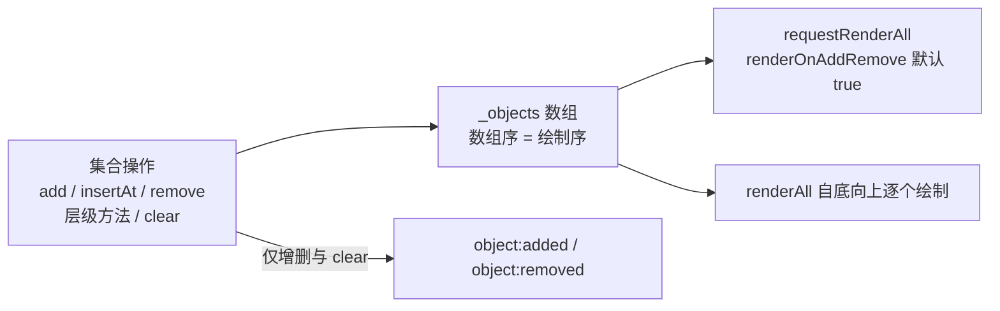

import { Canvas, Controls, Meta } from '@storybook/addon-docs/blocks';
import * as Stacking from './stacking.stories';

<Meta of={Stacking} name="Docs" />

# 对象管理

画布上的全部对象都放在同一个数组 `_objects` 里，**数组顺序就是绘制顺序**：索引 0 最先画、垫在最底，末尾的对象最后画、盖在最上。增删插入、层级调整和清空全都是对这个数组的封装——改动生效后按 `renderOnAddRemove` 自动请求重绘（默认开启，机制见 [1.3 渲染模型](?path=/docs/rendering-model--docs)），增删类操作还会派发 `object:added` / `object:removed`。这套集合方法来自 Collection mixin，`Canvas` 与 `Group` 共用同一套签名；组内子对象与多选的管理边界在 [3.3 分组与多选](?path=/docs/group-selection--docs)。

v6 起层级方法从对象侧搬到画布侧并改名（`rect.bringToFront()` 变为 `canvas.bringObjectToFront(rect)`），`insertAt` 的参数顺序也对调了。社区大量资料停留在 v5 写法，迁移对照见下文「层级调整」。



| 方法 / 属性 | 返回 | 回查要点 |
| --- | --- | --- |
| `add(...objects)` | 新长度 | 追加到末尾 = 最高层；逐对象派发 `object:added` |
| `insertAt(index, ...objects)` | 新长度 | v6 起索引在前；对象恰好落在 `index` 起；越界按 splice 收敛 |
| `remove(...objects)` | 实际移除的对象数组 | 不在列表中的静默跳过；不释放对象资源 |
| `getObjects(...types)` | 副本 | 传类型串可过滤；改副本不影响画布 |
| `item(index)` / `size()` / `isEmpty()` | 对象 / 数 / 布尔 | `item` 直读 `_objects[index]`；首尾用 `item(0)`、`item(size() - 1)` |
| `contains(obj, deep?)` | 布尔 | 深层检查建议改用 `obj.isDescendantOf(collection)` |
| `bringObjectToFront(obj)` / `sendObjectToBack(obj)` | 布尔 | 已在端点时返回 `false`，不触发重绘请求 |
| `bringObjectForward(obj, intersecting?)` / `sendObjectBackwards(obj, intersecting?)` | 布尔 | 逐级移动一步；`intersecting` 按包围盒跳到相交对象 |
| `moveObjectTo(obj, index)` | 布尔 | 调用后 `_objects[index] === obj` |
| `clear()` | — | 移除全部对象并重置背景 / overlay；不 dispose |
| `obj.dispose()` / `canvas.dispose()` | — / Promise | 释放对象资源 / 销毁画布时统一释放全部对象 |
| `renderOnAddRemove` | 默认 `true` | 上述结构操作自动 `requestRenderAll` |
| `_objects` | `FabricObject[]` | 层级唯一真源；下划线是内部约定，勿直接改 |

画布与对象的创建见 [1.2 安装与第一个画布](?path=/docs/getting-started--docs)，对象的几何属性见 [3.1 变换](?path=/docs/transform--docs)；本课只关心"对象列表里有什么、顺序如何"。

## 对象列表

理解 Fabric 层级的第一步是接受一个朴素事实：没有独立的"图层"数据结构，`_objects` 这个数组本身就是层级。`renderAll` 自底向上按数组序逐个绘制，所以索引就是层号——想控制谁盖住谁，就控制数组顺序。

日常读取不要直接摸 `_objects`，走两个入口：

```ts
canvas.getObjects();            // 副本：对它 push / splice 不影响画布
canvas.getObjects('Rect');      // 按类型过滤，同样返回新数组
canvas.item(0);                 // 最底层对象（直读 _objects[0]）
canvas.item(canvas.size() - 1); // 最顶层；没有 firstObject / lastObject 这类方法
canvas.isEmpty();               // size() === 0
canvas.contains(rect);          // 浅层：只查本级列表
```

- `getObjects()` 无参时返回浅拷贝（源码就是展开 `_objects`），这是"改了没效果"类问题最常见的原因；带类型参数时返回过滤后的新数组。
- `_objects` 在类型声明上公开可读，回查时直接观察它最诚实；但直接改它（push、splice、排序）会绕过 `object:added` 维护、`canvas` 引用设置与自动重绘，画面与状态就此脱节。
- `contains(obj, true)` 的深层检查会递归 Group；源码注明性能上更推荐 `obj.isDescendantOf(collection)`。组内层级见 [3.3 分组与多选](?path=/docs/group-selection--docs)。

## 增删与插入

### add

```ts
canvas.add(rect, circle, text); // 变参一次多个，返回新的数组长度
```

- 追加到 `_objects` 末尾，因此新对象直接位于**最高层**。
- 每个对象入列时会：记下 `obj.canvas` 引用、`setCoords()` 重算角点，派发画布 `object:added` 与对象自身的 `added` 事件。
- 一次变参无论几个对象只排一次重绘请求（`renderOnAddRemove` 的队列按帧合并），事件仍逐对象派发。
- 加入一个已属于其他画布的对象时：控制台给出警告，并自动把它从旧画布移除再入列——两块画布不会共享同一对象实例。

### remove

```ts
const removed = canvas.remove(rect, circle); // 返回实际被移除的对象
```

- 变参移除；不在列表中的对象静默跳过，不报错。
- 移除时清空 `obj.canvas` 引用，派发画布 `object:removed` 与对象自身的 `removed` 事件。
- 交互画布上移除当前选中的对象会自动取消选中（`selection:cleared` 加对象 `deselected`）；事件全景见 [4.1 事件系统](?path=/docs/events--docs)。
- `remove` 只动数组，**不释放对象资源**：实例完好无损，随时可以再 `add` 回任意画布。释放资源是 `dispose()` 的职责，见「清空与释放」。
- 画布没有 `removeAll`（那是 `Group` 的方法）：等价写法是 `canvas.remove(...canvas.getObjects())`，或直接 `clear()`。

### insertAt

```ts
canvas.insertAt(2, rect, circle); // v6 起索引在前、对象在后
```

- 语义就是 `splice(index, 0, ...objects)`：传入的对象序列**恰好从 `index` 开始**，原先位于 `index` 起的对象顺次后移。
- `insertAt(0, x)` 垫到最底；`insertAt(canvas.size(), x)` 等价于 `add(x)`。
- 索引越界不抛错：超过长度时按 splice 规则收敛为追加，负数从数组尾部数起。
- 事件与自动重绘行为与 `add` 完全一致。

<Canvas of={Stacking.Interactive} />
<Controls of={Stacking.Interactive} />

范例初始为基准场景甲乙丙丁（底 → 顶），布局刻意设计成：甲与乙互不相交、丙与甲乙都相交、丁只与丙相交。每次调整控件，范例先复位到基准场景再执行所选操作，读数因此是确定性的。按下表逐项核对：

| 读者操作 | 可核对结果 |
| --- | --- |
| 「层级操作」选 bringObjectToFront，目标 甲 | 「对象序」变为 乙 → 丙 → 丁 → 甲，红矩形盖住与之相交的绿三角；「操作生效」= 是 |
| 「层级操作」选 bringObjectForward，目标 甲 | 不开「相交才逐级移动」：甲与相邻的乙交换（乙 → 甲 → 丙 → 丁）；打开后：甲跳过不相交的乙、落到相交的丙之上（乙 → 丙 → 甲 → 丁） |
| 「层级操作」选 sendObjectBackwards，目标 乙 | 不开相交：乙与甲交换（乙 → 甲 → 丙 → 丁）；打开相交：乙下方没有相交对象，乙原地放回、顺序不变，但「操作生效」仍为 是 |
| 「层级操作」选 moveObjectTo，调「moveObjectTo 索引」 | 目标在「对象序」中恰好落在所选位置：「目标索引」与索引一致 |
| 「增删操作」选 add(新) / insertAt(0, 新) / insertAt(2, 新) | 紫色圆「新」分别出现在序尾（最高层）、序首（最底层）、索引 2；「本轮事件」= object:added ×1 |
| 「增删操作」选 remove(目标) | 目标从画面与「对象序」消失，「目标索引」变 —，「本轮事件」= object:removed ×1 |
| 「增删操作」选 remove(目标) 且选了层级操作 | 「操作生效」= —：目标不在列表，范例跳过层级方法（对非成员调用的后果见常见问题） |
| 只切换「层级操作」，不碰「增删操作」 | 「本轮事件」始终为 无——层级调整只请求重绘，不派发增删事件 |
| 打开 Show code | 看到该 Canvas 实际执行的 example.ts |

## 层级调整

五个层级方法都在**画布侧**调用，返回布尔值表示层级是否真的变化：

| 方法 | 效果 | 返回 `false` 的情形 |
| --- | --- | --- |
| `bringObjectToFront(obj)` | 移到最顶（索引 `size() - 1`） | 已在最顶 |
| `sendObjectToBack(obj)` | 移到最底（索引 0） | 已在最底 |
| `bringObjectForward(obj, intersecting?)` | 上移一级 | 已在最顶 |
| `sendObjectBackwards(obj, intersecting?)` | 下移一级 | 已在最底 |
| `moveObjectTo(obj, index)` | 移到指定索引，调用后 `_objects[index] === obj` | 已在该索引 |

- `intersecting` 改变逐级移动的目标：按包围盒判定相交（重叠或互相包含），在移动方向上逐个检查、**跳过不相交的对象**，落在最近一个相交对象的外侧；找不到相交对象时原位放回并返回 `true`——层级没变，只多了一次重绘请求。范例中"目标 乙 + sendObjectBackwards"一行的两种读数就是这条语义的直接证据。
- 层级调整只请求重绘，**不派发 `object:added` / `object:removed`**：依赖这两个事件做外部同步（比如历史栈）的代码不会收到层级变化的通知。
- 多选（ActiveSelection）不支持这套方法——v6 起已移除多选层级操作，多对象的层级管理见 [3.3 分组与多选](?path=/docs/group-selection--docs)。

v5 代码迁移对照（旧社区资料高频踩点）：

| v5（对象侧，已删除） | v6+（画布侧） |
| --- | --- |
| `rect.bringToFront()` | `canvas.bringObjectToFront(rect)` |
| `rect.sendToBack()` | `canvas.sendObjectToBack(rect)` |
| `rect.bringForward()` | `canvas.bringObjectForward(rect)` |
| `rect.sendBackwards()` | `canvas.sendObjectBackwards(rect)` |
| `rect.moveTo(index)` | `canvas.moveObjectTo(rect, index)` |
| `canvas.insertAt(rect, 2)` | `canvas.insertAt(2, rect)` |

## 遍历与查找

```ts
canvas.forEachObject((obj, index, all) => {
  // obj 当前对象，index 索引，all 全部对象
});

canvas.getObjects('Rect', 'Circle');          // 多类型并集
canvas.getObjects().find((o) => o.name === 'logo'); // 没有内置按 id / name 查找
```

- `forEachObject` 就是 `getObjects().forEach` 的快捷方式：遍历的是副本，回调里 `remove` / `add` 都安全，不会跳号。
- 类型过滤两套写法都认：类名（`'Rect'`、`'Textbox'`）或 legacy 小写（`'rect'`）。`type` 实例属性已标记废弃、计划在后续大版本移除，新代码不要依赖它。
- 识别具体对象没有内置 id 查找：惯用做法是创建时挂自定义属性，再 `getObjects().find(...)` 按属性取回。
- 深入 Group 内部：Group 用同一个 mixin，也有 `getObjects` / `forEachObject` / 层级方法；跨层判断用 `isDescendantOf` / `getAncestors`。组内管理细节见 [3.3 分组与多选](?path=/docs/group-selection--docs)。

## 清空与释放

四个生命周期入口各管一段，混用是对象"消失又出现 / 还在却不可用"类问题的根源：

| 入口 | 对 `_objects` | 对象资源 | 事件 |
| --- | --- | --- | --- |
| `canvas.remove(obj)` | 移除指定对象 | 不释放 | `object:removed` |
| `canvas.clear()` | 移除全部对象 | 不释放 | 逐对象 `object:removed` + `canvas:cleared` |
| `obj.dispose()` | 不动数组（对象可能仍在列表里） | 取消动画、解绑事件、释放缓存位图 | — |
| `canvas.dispose()` | 清空并逐个 `dispose` | 全部释放 | — |

- `clear()` 除了移除全部对象，还会把 `backgroundImage` / `overlayImage` 置空、背景与 overlay 颜色复位，并派发 `canvas:cleared`。它适合"重置画布再重建场景"——`loadFromJSON` 内部正是先 `clear()` 再批量 `add`（见 [6.1 序列化](?path=/docs/serialization--docs)）。
- `canvas.dispose()` 返回 Promise：等已排队的渲染结束后才真正销毁（内部同步方法 `destroy()` 会逐个 `object.dispose()`），所以别在渲染进行中手动调 `destroy()`。
- 单个对象确定不再复用时的正确顺序是**先 `remove` 再 `dispose`**：只 `dispose` 不 `remove` 的话，一个释放了缓存与事件的"空壳"仍留在 `_objects` 里照常参与绘制。

## 最佳实践

- 批量增删用一次变参：`add(...next)` / `remove(...gone)` 只排一次重绘请求，事件仍逐对象保留。`renderOnAddRemove` 保持默认开启——官方注明关闭并没有性能收益（渲染已按帧合并），只会把刷新责任全部收归自己（[1.3 渲染模型](?path=/docs/rendering-model--docs)）。
- 语义是"挪一层"时用 `bringObjectForward` / `sendObjectBackwards`，需要在遮挡中跳过不相交对象才加 `intersecting`；语义是"放到第 N 层"时直接 `insertAt` / `moveObjectTo` 显式索引，不要循环调逐级方法。
- 场景切换、撤销重做要复用对象实例时只 `remove` 不 `dispose`；确定废弃才单独 `dispose`；整画布销毁交给 `canvas.dispose()` 统一释放。
- 把 `_objects` 当只读真源对待：读快照用 `getObjects()`，一切变更走 `add` / `insertAt` / `remove` / 层级方法，事件与自动重绘才跟得上。

## 常见问题

- `canvas.getObjects().push(rect)` 之后画布上没有出现
  `getObjects()` 返回的是 `_objects` 的副本，改副本不影响画布。改用 `canvas.add(rect)`。
- `rect.bringToFront is not a function` / `rect.moveTo is not a function`
  v5 的对象侧层级方法在 v6 已删除并改名到画布侧，改用 `canvas.bringObjectToFront(rect)` 等，完整对照见上文迁移表。
- 对象 add 到第二块画布后，第一块画布上它消失了
  这是既定行为：加入属于其他画布的对象时会自动从旧画布移除，并给出控制台警告。两块画布要显示同一内容时应克隆对象（`obj.clone()`），不要共享实例。
- 对已经 remove 的对象调用层级方法，它又出现在画布上
  层级方法假定对象在列表中：非成员会被重新塞进 `_objects`（落点由各方法内部逻辑决定），且不经过 `add`——没有事件，也不补 `canvas` 引用。调用前用 `canvas.contains(obj)` 兜底。
- 调用了 `obj.dispose()` 但对象还显示在画布上
  `dispose()` 只释放动画、事件与缓存位图，不会把对象从 `_objects` 移除。先 `canvas.remove(obj)` 再 `dispose()`；整画布销毁直接 `canvas.dispose()`。

## 总结回顾

摘要：

画布对象全部住在 `_objects` 数组里，数组序即绘制序，索引就是层号。`add` 追加末尾成最高层，`insertAt`（v6 起索引在前）让对象恰好落在指定索引，`remove` 变参移除并返回实际移除的对象、但不释放资源；三者与 `clear()` 都会派发增删事件并按 `renderOnAddRemove` 自动请求重绘。层级调整走画布侧五方法（v5 对象侧旧名已删除）：逐级移动可用 `intersecting` 按包围盒跳过不相交邻居，精确层数用 `moveObjectTo`；层级调整只重绘、不派发增删事件。读取用 `getObjects()`（副本，支持类型过滤）、`item` 与 `forEachObject`；`clear()` 重置画布不清资源，释放是 `dispose()` 的职责，画布销毁时统一逐个释放。

一句话：

> 索引即层号：`_objects[0]` 垫底、末尾盖顶，一切增删与层级方法都只是受控地重排这个数组。

知识要点：

- `getObjects()` 与 `_objects` 的关系是什么？为什么改 `getObjects()` 的返回值没有效果？
- `add` / `insertAt` / `remove` 各自的返回值、事件与 v6 签名变化是什么？
- 五个层级方法各自的语义与返回值？`intersecting` 在什么条件下改变结果？
- 层级调整为什么不派发 `object:added` / `object:removed`？
- `clear()`、`obj.dispose()`、`canvas.dispose()` 三者怎么分工？
- v5 的 `bringToFront` / `moveTo` / `insertAt(obj, index)` 写法怎么迁移？

## 参考资料

- [StaticCanvas API（add / insertAt / remove / getObjects / 层级方法 / clear / dispose）](https://fabricjs.com/api/classes/staticcanvas/)
- [Upgrading to Fabric.js 6.0（官方升级指南）](https://fabricjs.com/docs/upgrading/upgrading-to-fabric-60/)
- [v6 破坏性变更清单（GitHub issue #8299）](https://github.com/fabricjs/fabric.js/issues/8299)
- [官方文档站（指南入口）](https://fabricjs.com/docs/)
