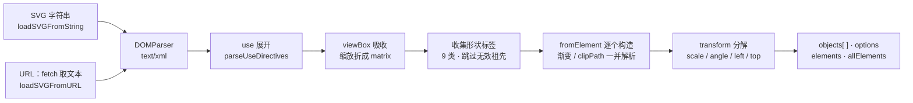

import { Canvas, Controls, Meta } from '@storybook/addon-docs/blocks';
import * as SvgLesson from './svg.stories';

<Meta of={SvgLesson} name="Docs" />

# SVG 互操作

Fabric.js 与 SVG 打交道是两个方向的**翻译**，不是拷贝。导入用 `loadSVGFromString` / `loadSVGFromURL` 把一段 SVG 文档翻成 Fabric 对象数组：解析器只认 9 类形状标签，`` <g> `` 的变换与样式被吸收进子对象，根元素的 viewBox / 宽高被吸收进 `options`。导出用 `toSVG` 把对象树翻回带 XML 序言与 `` <defs> `` 的完整 SVG 文档，图片被内联成 data URI。两边都不无损：哪些元素能往返、往返后丢什么，由映射表与未支持元素的行为决定。学完本课，你能预判一段 SVG 会解析出哪些对象、坐标落在哪，也能为导出选择正确的 `toSVG` 形态。

场景级（整个画布）的 JSON 往返见 [6.1 序列化](?path=/docs/serialization--docs)；位图导出见 [6.3 图片导出](?path=/docs/export--docs)——本课只讲 SVG 这条通道。



| 概念 / 参数 | 值 / 默认 | 回查要点 |
| --- | --- | --- |
| `loadSVGFromString` 输入 | SVG 文档字符串 | 先 `trim()` 再交给 `DOMParser` 按 `text/xml` 解析 |
| `loadSVGFromURL` 获取 | `fetch` | 受同源策略约束；任何失败返回空结果，**不 reject** |
| 返回 `objects` | `(FabricObject \| null)[]` | 图片加载失败的位置是 `null`，入画布前要过滤 |
| 返回 `options` | 根的 viewBox / 宽高吸收值 | `viewBoxWidth` / `viewBoxHeight` / `width` / `height` / `minX` / `minY` |
| 返回 `elements` / `allElements` | `Element[]` | `elements` 是被转换节点；`allElements` 是全部节点，两者相减即被跳过的部分 |
| `reviver`（导入） | `(element, obj) => void` | 每个对象构造完成后调用；读自定义属性、逐元素改写 |
| `reviver`（导出） | `(markup) => string` | 对每段对象 SVG 字符串做后处理 |
| `toSVG` 选项 `suppressPreamble` | `false` | `true` 时省略 `<?xml` 与 DOCTYPE |
| `toSVG` 选项 `viewBox` | 按 `viewportTransform` 生成 | `svgViewportTransformation` 默认 `true`：画布缩放平移折进 viewBox |
| `toSVG` 选项 `width` / `height` | 画布宽高（字符串，可带单位） | 如 `'10cm'`；数字会被字符串化 |
| `toSVG` 选项 `encoding` | `'UTF-8'` | v7 类型只剩 `'UTF-8'`；v5 可选 `'ISO-8859-1'` |
| `config.NUM_FRACTION_DIGITS` | 4 | 导出数值的小数位数 |

## 快速上手

```ts
import { Canvas, loadSVGFromString, util } from 'fabric';

const canvas = new Canvas(el, { width: 640, height: 360 });

// v6+ 返回 Promise；objects 是解析出的对象数组，options 带 viewBox 吸收结果
const { objects, options } = await loadSVGFromString(
  '<svg xmlns="http://www.w3.org/2000/svg" viewBox="0 0 120 60" width="240" height="120">' +
    '<rect width="80" height="40" fill="#4f7cff"/>' +
    '</svg>',
);

// 官方惯例：把对象与 options 一起交给 groupSVGElements，得到单个可整体操作的对象
canvas.add(util.groupSVGElements(objects, options));
```

`groupSVGElements` 对单元素输入直接返回原对象，多元素才构造 `Group`。上面的导入不含图片；含 `` <image> `` 的 SVG 可能产生 `null` 洞，先过滤再交给它（见「最佳实践」）。

## 导入 SVG

两个入口共享同一套解析，签名都以 v6+ 的 Promise 形态为准（以 7.4.0 的 `.d.ts` 核对）：

```ts
loadSVGFromString(string, reviver?, options?): Promise<SVGParsingOutput>
loadSVGFromURL(url, reviver?, options?): Promise<SVGParsingOutput>

// SVGParsingOutput = {
//   objects: (FabricObject | null)[];  // 与 elements 一一对应
//   options: Record<string, any>;      // viewBox / 宽高吸收值 + crossOrigin / signal
//   elements: Element[];               // 被转换的形状元素
//   allElements: Element[];            // 根下的全部节点
// }
```

`options` 参数只有两个字段：`crossOrigin`（传给内部图片加载，见 [2.3.3 图片](?path=/docs/image--docs)）和 `signal`（`AbortSignal`，中止后返回空结果）。**别把它与返回值里的 `options` 混淆**——后者是 SVG 根元素几何信息的吸收结果，见「viewBox 与坐标」。

`loadSVGFromURL` 就是 `fetch` 取文本后转交 `loadSVGFromString`。注意失败行为：HTTP 非 2xx、网络断开、跨域被拦，都会被 `catch` 住并返回空的 `{ objects: [], elements: [], options: {}, allElements: [] }`——**Promise 正常 resolve，不抛错**。需要区分"空 SVG"与"取不到"时，自己先 `fetch` 校验 `response.ok`，再拿文本调 `loadSVGFromString`。

**v5 对照**：v5 是回调形态，挂在全局命名空间下——`fabric.loadSVGFromString(svg, (objects, options) => {})`、`fabric.loadSVGFromURL(url, cb, reviver)`；v6 起改为 Promise 并新增 `elements` / `allElements`。社区资料大量停留在 v5 写法，搬运时注意改造。

**reviver：逐元素拦截改写**。每个对象构造完成（渐变、clipPath 已解析，transform 已分解）后，reviver 以 `(element, fabricObject)` 被调用，`element` 是原始 SVG 元素：

```ts
await loadSVGFromString(svg, (element, obj) => {
  const kind = element.getAttribute('data-kind');    // 读 fabric 不解析的属性
  if (kind) obj.set('kind', kind);                   // 挂到对象上，配合 toObject(propertiesToInclude) 序列化
  if (element.tagName === 'rect') obj.set({ opacity: 0.5 }); // 逐元素改写
});
```

与序列化的 reviver（[6.1 序列化](?path=/docs/serialization--docs)）相比，这里的钩子拿到的是"原生元素 + 新对象"对，适合搬运 SVG 侧的自定义信息；序列化的 reviver 拿到的则是 JSON 与复活对象。

## 元素映射

解析器先展开 `` <use> `` 引用，再从文档树里收集**合法形状标签**，逐个调用对应类的静态 `fromElement(element, options, cssRules)` 构造对象。映射表（7.4.0 实测 `classRegistry.getSVGClass`）：

| SVG 标签 | Fabric 类 | 要点 |
| --- | --- | --- |
| `path` | `Path` | `d` 命令被简化成 M / L / C / Q / Z（[2.1.2 路径](?path=/docs/path--docs)） |
| `rect` | `Rect` | `rx` / `ry` 圆角；宽高为 0 时 `visible` 为 `false` |
| `circle` | `Circle` | `r` 映射 `radius`；`left` / `top` 归到包围盒左上角 |
| `ellipse` | `Ellipse` | `rx` / `ry` 映射进宽高 |
| `line` | `Line` | `x1 y1 x2 y2` 四点 |
| `polyline` / `polygon` | `Polyline` / `Polygon` | `points` 属性解析 |
| `image` | `FabricImage` | `href` / `xlink:href` 异步加载；失败处为 `null` |
| `text` | `FabricText` | `font-*` / `text-anchor` / `letter-spacing` 一并翻译（[2.3.1 文本](?path=/docs/text--docs)） |

**未支持元素的行为**：

- `` <g> `` **不产生对象**。`g` / `a` / `svg` / `symbol` / `defs` 等被视为合法父级：`parseAttributes` 沿父链递归，把 `transform` 与 `fill` / `stroke` 等可继承属性吸收进每个子对象。SVG 里的分组层级在导入结果里是平的。
- 位于 `pattern` / `defs` / `symbol` / `metadata` / `clipPath` / `mask` / `desc` 内的形状直接跳过——但 `` <defs> `` 里的 `` <linearGradient> `` / `` <radialGradient> `` 定义与 `` <clipPath> `` 内容会被引用解析（见「保真边界」）。
- `` <mask> `` 与 `filter`（属性或 CSS）不解析：`mask="url(#…)"` 引用被忽略。
- 引用 `` <pattern> `` 的填充不会翻译成 `Pattern` 对象，导入后该填充无效。
- 其余未知标签静默跳过。`elements`（被转换）与 `allElements`（全部）相减，就是被跳过的节点清单。
- SVG 内嵌 `` <style> `` 的简单 CSS 规则与 `style` 属性会被应用（`getCSSRules` + 选择器匹配）。

导入结果的两种入画布方式：需要把整个 SVG 当一个单位（整体变换、整体导出）时用 `util.groupSVGElements(objects, options)`——多元素构造 `Group`、单元素返回原对象；需要逐对象编辑时直接平铺 `add`。要按 SVG 原始分组重组，得借助 `allElements` 的层级信息自己遍历。自定义对象想参与导入映射，用 `classRegistry.setSVGClass(MyClass, 'rect')` 覆盖或注册新标签，并实现静态 `fromElement`（见 [7.3 自定义对象](?path=/docs/custom-object--docs)）。

<Canvas of={SvgLesson.Interactive} />
<Controls of={SvgLesson.Interactive} />

「自定义 SVG 源码」留空时使用「SVG 预设」，填写则优先生效。切换预设或直接编辑源码，对照画布与读数：

| 读者操作 | 可核对结果 |
| --- | --- |
| 「SVG 预设」切到 视图框缩放 | 「viewBox 吸收」显示 `320×180 → 640×360（对象 scale≈2）`；内容占满整个画布——SVG 只有 320×180 用户坐标 |
| 切到 分组与变换吸收 | 「类型清单」是 `rect·circle·text·path` 四个平铺对象——`` <g> `` 没有变成 Group；矩形带着 −8° 旋转、蓝色填充来自 `` <g> `` 的继承 |
| 切到 未支持元素 | 「跳过标签」列出 `defs·linearGradient·stop·mask·rect·foo`（`rect` 是 mask 内部那个）；渐变矩形正常显示渐变；绿色圆形没有挖孔——`mask` 引用被忽略 |
| 切到 文字 | 三个 `` <text> `` 变成 `text` 类型对象，`text-anchor` / `letter-spacing` 生效 |
| 切到 空文档 | 「对象数」为 0 但解析正常完成；「toSVG 标记」仍有 xml·desc·viewBox——空画布也导出完整文档骨架 |
| 在「自定义 SVG 源码」里只留一个 `` <rect> `` 再开启「导入后合并成组」 | 「顶层结构」显示"单对象（合并退化为原对象）"——`groupSVGElements` 的单元素短路 |
| 开启「导入后合并成组」后拖动画布内容 | 整体移动——多元素被合并成了一个 `Group` |
| 开启「省略 XML 序言」 | 「toSVG 标记」里 `xml` / `doctype` 消失，「toSVG 长度」变短 |
| 打开 Show code | 看到该 Canvas 实际执行的 `example.ts` |

## viewBox 与坐标

SVG 根元素的几何信息被 `applyViewboxTransform` 折进解析结果，规则是：

- **有 `viewBox` 也有 `width` / `height`**：缩放比 `scaleX = width / viewBoxWidth` 被折成一个 `matrix()` 变换包住全部内容，最终落到每个对象的 `scaleX` / `scaleY` 上；`options` 携带 `viewBoxWidth` / `viewBoxHeight` / `width` / `height` 与 `minX` / `minY`（viewBox 前两个分量取负）。`preserveAspectRatio` 的 `meet` / `slice` 与对齐也在这步处理。
- **只有 `width` / `height`、没有 `viewBox`**：不缩放，`options` 只带解析后的 `width` / `height`（支持 `pt` / `em` 等单位换算）。
- **两者都没有**：`options` 是 `{ width: 0, height: 0 }`。

多元素导入的坐标系由此确定：每个对象吸收自身 `transform`、祖先 `` <g> `` 的变换与 viewBox 缩放的复合矩阵，再被分解成 `scaleX` / `scaleY` / `angle` / `skewX`，`left` / `top` 是**最终坐标系里的对象中心**（v7 默认 originX / originY 为 center，见 [3.1 变换](?path=/docs/transform--docs)）。也就是说 SVG 里写在 `` <g transform="translate(320,180) rotate(-8)"> `` 里的定位与旋转，导入后已经变成子对象各自的 `angle` = −8 和平移后的中心坐标——不需要再手动应用任何父级变换。想把内容挪到画布的理想位置，直接改对象 `left` / `top` 或调 `viewportTransform`（[3.4 视口与坐标](?path=/docs/viewport--docs)）。

## toSVG 导出

两级 API，输入都是对象树、输出都是字符串：

```ts
canvas.toSVG();                                        // 画布级：完整独立文档
canvas.toSVG({ suppressPreamble: true });              // 省略 <?xml 与 DOCTYPE，便于内嵌 HTML
canvas.toSVG({ viewBox: { x: 0, y: 0, width: 320, height: 180 } }); // 覆盖默认视图框
canvas.toSVG({}, (markup) => markup.replaceAll('fill: none; ', '')); // TSVGReviver：逐段后处理

rect.toSVG();   // 对象级：无 xmlns 的 <g transform="matrix(…)">…</g> 片段
```

**画布级**输出一个可直接保存为 `.svg` 文件的文档，骨架是：

```xml
<?xml version="1.0" encoding="UTF-8" standalone="no" ?>
<!DOCTYPE svg PUBLIC "-//W3C//DTD SVG 1.1//EN" "http://www.w3.org/Graphics/SVG/1.1/DTD/svg11.dtd">
<svg xmlns="http://www.w3.org/2000/svg" xmlns:xlink="http://www.w3.org/1999/xlink"
     version="1.1" width="640" height="360" viewBox="0 0 640 360" xml:space="preserve">
<desc>Created with Fabric.js 7.4.0</desc>
<defs><!-- 背景/覆盖层的渐变与图案、画布 clipPath、注册过的字体 face --></defs>
<!-- 每个对象一段 <g transform="matrix(…)">…</g>，画布 clipPath 再包一层 <g clip-path="url(#…)"> -->
</svg>
```

`viewBox` 默认由 `svgViewportTransformation`（默认 `true`）从 `viewportTransform` 推导：画布的缩放与平移被折进 viewBox，"缩放过的画布导出缩放过的 SVG"；置 `false` 或传 `options.viewBox` 可覆盖（视口机制见 [3.4 视口与坐标](?path=/docs/viewport--docs)）。`width` / `height` 默认取画布尺寸，可传带单位的字符串覆盖。

**对象级**返回不带 `xmlns` 的片段：外层 `` <g> `` 带变换矩阵，内联该对象的渐变 / 图案 / 阴影 filter / clipPath 定义。它不是合法的独立文档，用途是拼进别的 SVG 或注入现有 DOM。

导出的 `reviver`（`TSVGReviver`）与导入的同名但形态不同：输入是每段对象的 SVG 字符串，返回替换后的字符串——做全局清理（删多余 style、改 id 前缀）比后处理整个文档更精准。

**图片与外部资源**：`FabricImage` 导出时把元素 `toDataURL` 的结果写进 `xlink:href`——位图被内联成 data URI，产物自包含但体积随之增长；跨域污染的图片会让 `toDataURL` 抛错（导入时配好 `crossOrigin`，见 [2.3.3 图片](?path=/docs/image--docs)）。字体文件不嵌入，见「常见问题」。与 `toDataURL`（位图、格式 / 质量 / multiplier）的选型见 [6.3 图片导出](?path=/docs/export--docs)。

## 保真边界

导入和导出各认识对方的一部分特性，往返大致守恒的是几何、填充渐变、裁剪与阴影；不守恒的部分如下。

| 特性 | 导入方向（SVG → Fabric） | 导出方向（Fabric → SVG） |
| --- | --- | --- |
| 渐变 | `fill` / `stroke` 的 `url(#…)` 引用解析成 `Gradient`（[2.2.2 渐变与图案](?path=/docs/gradients-patterns--docs)） | `fill.toSVG` 生成 `` <linearGradient> `` / `` <radialGradient> `` 内联定义 |
| 裁剪 | `clip-path` 引用解析成 `clipPath`，多形状折叠成 `Group`，变换被吸收（[2.3.4 裁剪与遮罩](?path=/docs/clip-path--docs)） | 生成 `` <clipPath id="CLIPPATH_…"> ``，`absolutePositioned` 时外层多包一个 `` <g> `` |
| 阴影 | SVG `filter` 阴影**不解析** | `Shadow.toSVG` 生成 `feGaussianBlur` + `feOffset` + `feFlood` + `feComposite` + `feMerge` 的 filter |
| 图片滤镜 | SVG filter 不解析 | 像素级结果被烘焙进 data URI，不是 SVG filter（[5.1 滤镜](?path=/docs/filters--docs)） |
| 文字 | `font-*` / `text-anchor` 翻译进 `FabricText` 属性 | `` <text> `` + `` <tspan> ``，`fontFamily` 保留，字体文件不嵌入 |
| path 数据 | A 弧等命令被简化成 C（[2.1.2 路径](?path=/docs/path--docs)） | 从简化数据生成 `d`，数值按 `NUM_FRACTION_DIGITS`（4 位）截断 |
| 非均匀描边 | `vector-effect` 翻译成 `strokeUniform` | `strokeUniform` 导出 `vector-effect="non-scaling-stroke"` |
| mask / pattern | 不解析（见「元素映射」） | 无对应输出 |

两个直接推论：**SVG → Fabric → SVG 的往返不会还原原文档**——path 命令形态、数字精度、defs 组织方式都会变，几何与观感基本保持；**Fabric → SVG → Fabric 的往返**则相对接近序列化语义（[6.1 序列化](?path=/docs/serialization--docs)），但滤镜、自定义属性仍需自己搬运（导入侧靠 reviver）。

## 最佳实践

- **入画布前先过滤 `null`**：`objects.filter((o) => o !== null)`。图片加载失败不留异常、只留洞，直接 `add(...objects)` 会抛错或漏对象。
- **按用途决定重组**：整个 SVG 作为单一素材（图标、插画）用 `groupSVGElements` 合并，后续整体缩放平移一步到位；素材内部还要逐对象编辑（改色、删形状）就平铺 `add`，Group 的子对象编辑有额外布局语义（[3.3 分组与多选](?path=/docs/group-selection--docs)）。
- **导出格式选型**：交给设计工具继续编辑、需要无限缩放的矢量内容用 `toSVG`；给 ``  `` 显示、上传、需要像素一致或多格式压缩用 `toDataURL`（[6.3 图片导出](?path=/docs/export--docs)）。内嵌 HTML 时记得 `suppressPreamble: true`。
- **复杂 SVG 的性能**：导入含上千 path 的 SVG 后，对象缓存（把整组渲染结果缓存成一张图，用 `drawImage` 回放）比逐命令重放快得多，代价是内存——官方 [svg caching demo](http://fabricjs.com/demos/svg-caching) 演示了开关对比，机制详见 [7.2 性能优化](?path=/docs/performance--docs)。

## 常见问题

- `loadSVGFromURL` 404 或断网后没有任何报错，`objects` 是空数组
  源码里 `catch` 住一切失败并返回空响应，Promise 正常 resolve。需要错误信息时自己 `fetch` 校验 `response.ok` 后再调 `loadSVGFromString`；只用空数组判断"没有内容"足够。
- SVG 里明明有 `` <image> ``，导入后那个位置是 `null`，画布上少一块
  图片异步加载失败（路径 404、跨域无 CORS）时 `fromElement` 捕获后返回 `null`（控制台有 `Unable to parse Image` 日志）。修资源本身，或解析时传 `options.crossOrigin`；业务代码始终过滤 `null`。
- 写了 `` <g> `` 分组，导入后却是一堆平铺对象，整体拖不动
  v6 起导入结果天然打平，`` <g> `` 的 transform 与样式被吸收进子对象。要整体操作就用 `util.groupSVGElements(objects, options)`；要还原多层分组结构，需按 `allElements` 的层级自己重建。
- `toSVG` 导出的文件换台机器，文字字体变了
  SVG 只写 `font-family`，不嵌入字体文件。用 `config.fontPaths` 注册字体路径（导出会生成对应 `` @font-face ``），或把文字转成 Path / 位图。

## 总结回顾

摘要：

`loadSVGFromString` / `loadSVGFromURL` 以 Promise 返回 `{ objects, options, elements, allElements }`：`objects` 与被转换的形状元素一一对应（图片失败处为 `null`），`options` 是根元素 viewBox / 宽高的吸收结果。解析只认 9 类形状标签：`` <g> `` 不产生对象、其变换与样式被继承进子对象，`defs` 等容器内的形状、`mask`、`filter`、`pattern` 引用被跳过或忽略；reviver 在每个对象构造后拿到元素与对象对，用于搬运自定义信息。viewBox 的缩放被折进对象 scale，多元素坐标落在最终坐标系。`toSVG` 分两级：画布级输出带序言、desc 与 defs 的完整文档（viewBox 默认反映 viewportTransform，图片内联成 data URI）；对象级输出可拼装的 `` <g> `` 片段。往返不无损：渐变、clipPath、阴影近似守恒，滤镜烘焙成位图，path 命令被简化、数字被截断。

一句话：

> SVG 导入导出是按映射表的翻译，不是文档拷贝——先查标签在不在 9 类映射里，再查 viewBox 与 `` <g> `` 的吸收去向，保真边界由「保真边界」的表决定。

知识要点：

- `loadSVGFromString` / `loadSVGFromURL` 的 v6+ 签名与返回的四个字段各是什么？v5 是什么形态？
- `loadSVGFromURL` 失败时抛错吗？怎么区分"空 SVG"与"取不到"？
- 导入 reviver 的参数是什么？适合做什么？
- 哪 9 类标签会被映射成对象？`` <g> ``、`` <use> ``、`` <mask> ``、`` <defs> `` 各是什么行为？
- `util.groupSVGElements` 对多元素与单元素输入分别返回什么？
- viewBox 与 width / height 同时存在时，缩放去了哪？`options` 里能读到什么？
- 多元素导入后，对象的 `left` / `top` / `angle` / `scaleX` 处在什么坐标系？
- 画布级与对象级 `toSVG` 的输出各是什么形态？`suppressPreamble` / `viewBox` / `width` / `height` 默认值是什么？
- 图片在导出的 SVG 里以什么形式存在？跨域会有什么后果？
- 哪些特性能往返、哪些不能？path 命令与数字精度往返后如何变化？

## 参考资料

- [loadSVGFromString API（签名与返回形态）](https://fabricjs.com/api/functions/loadsvgfromstring/)
- [loadSVGFromURL API（fetch 行为与同源约束）](https://fabricjs.com/api/functions/loadsvgfromurl/)
- [StaticCanvas 类（toSVG 选项与 svgViewportTransformation）](https://fabricjs.com/api/classes/staticcanvas/)
- [util 命名空间（groupSVGElements）](https://fabricjs.com/api/fabric/namespaces/util/)
- [官方 demo：svg caching（复杂 SVG 的对象缓存对比）](http://fabricjs.com/demos/svg-caching)
- [Introduction to Fabric.js. Part 3（old docs，serialization 章节）](https://fabricjs.com/docs/old-docs/fabric-intro-part-3)
