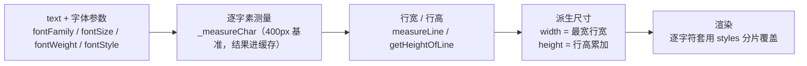

import { Canvas, Controls, Meta } from '@storybook/addon-docs/blocks';
import * as TextStories from './text.stories';

<Meta of={TextStories} name="Docs" />

# 文本

FabricText 把一段字符串变成一个可变换的 Canvas 对象：文字内容 + 一份字体描述进构造函数，`width` / `height` 不是输入而是逐字符测量的输出。本课讲清字体参数与默认值、对齐/行距/字距、换行的两种方式（手动 `\n` 与 Textbox 按 width 自动换行的分工）、`styles` 富文本分片的结构与读写、测量入口，以及自定义字体未就绪时尺寸偏差的原因与补救。文本也是 IText / Textbox 的基座——双击编辑、选区、上下标等交互能力见[交互文本](?path=/docs/itext-textbox--docs)；fill / stroke 的颜色规则与图形一致，见[填充、描边与阴影](?path=/docs/fill-stroke-shadow--docs)。



| 属性 | 默认值 | 说明与回查要点 |
| --- | --- | --- |
| fontFamily | `'Times New Roman'` | 字体族；名称不含引号/逗号且非通用族名时自动加双引号 |
| fontSize | 40 | 字号（px），默认值偏大，按需显式传 |
| fontWeight | `'normal'` | `'normal'` / `'bold'` / 数值（如 `'600'`），取决于字体包含的字重 |
| fontStyle | `'normal'` | `''` / `'normal'` / `'italic'` / `'oblique'` |
| textAlign | `'left'` | left / center / right / justify / justify-left / justify-center / justify-right |
| lineHeight | 1.16 | 行高倍率；height 公式见下文“测量”一节 |
| charSpacing | 0 | 字距，单位 1/1000 em，可为负 |
| styles | `{}` | 富文本分片：`{ 行索引: { 字素索引: 覆盖项 } }` |
| underline / overline / linethrough | false / false / false | 三条装饰线，也都能被分片覆盖 |
| textBackgroundColor | `''` | 文字背景色，只覆盖字符块高度，不是整个包围盒 |
| deltaY | 0 | 基线偏移（px），主要配合 styles 做上下标效果 |
| direction | `'ltr'` | `'ltr'` / `'rtl'`，官方标注实验性 |

默认值与 fabric 7.4.0 源码 `textDefaultValues` 核对（API 文档部分属性未标默认值，以运行时为准）。

## 创建文本

构造签名与图形类不同：**文字内容是第一个参数**，options 排第二，且构造完成时尺寸就已测量好：

```ts
import { Canvas, FabricText } from 'fabric';

const canvas = new Canvas(el, { width: 640, height: 360 });

const text = new FabricText('你好，Fabric', {
  left: 320, top: 180,   // originX/originY 默认 center，同图形类
  fontFamily: 'Arial',   // 默认 'Times New Roman'
  fontSize: 40,          // 默认就是 40
});
canvas.add(text);        // text.width / text.height 此时已可读
```

三个要点：

- **width / height 是派生值。** 构造函数内部先 `initDimensions()` 再 `setCoords()`：width = 最宽行的测量宽度，height = 行高累加（公式见下文“测量”一节）。这与[基础图形](?path=/docs/basic-shapes--docs)“width / height 是输入”正相反——想改文本大小用 `fontSize`（重新测量）或 `scaleX` / `scaleY`（缩放变换），想定宽换行用 Textbox（见下文“换行”一节）。
- **布局属性 `set()` 自动重排。** `text`、字体四件套（fontFamily / fontSize / fontWeight / fontStyle）、lineHeight、charSpacing、textAlign、styles、path 系属性任一经 `set()` 修改，内部自动重新测量并 `setCoords()`，读数立即可用；但画面刷新仍需 `canvas.requestRenderAll()`（见[渲染模型](?path=/docs/rendering-model--docs)）。直接赋值（`text.text = '...'`）不触发任何重排。
- **options 里的 `text` 会被忽略。** 构造函数在应用 options 之后统一执行 `this.text = 第一个参数`，内容永远以第一参数为准。

通用属性（left / top、originX / originY、fill、stroke、opacity、visible 等）全部沿用对象基类：文本默认 `fill: 'rgb(0,0,0)'`，`stroke` + `strokeWidth` 可做描边字。

<Canvas of={TextStories.TextBasics} />
<Controls of={TextStories.TextBasics} />

| 读者操作 | 可核对结果 |
| --- | --- |
| 换「fontFamily 字体」 | 同一文字在不同字体下 width 明显不同——尺寸来自测量，不是字符数 |
| 拖「fontSize 字号」 | 「width×height」与「行高基准 = fontSize×1.13」两组读数同步重算 |
| 切「fontWeight / fontStyle」 | 加粗、斜体后 width 变化（字重字形宽度不同） |
| 切「文本预设」到手动换行 | 行数变 2，「textLines 行数」读数确认 `\n` 已拆行 |

## 对齐与间距

三个属性管“多行文本内部怎么摆”，都只作用于行内，不改变外层定位（那是 left / top 的事）：

- **textAlign（默认 'left'）：** 行在包围盒内的水平位置。单行文本的包围盒就是行本身，`center` / `right` 看不出任何效果；至少两行、行长不同时才可见。`justify` 把行内空格拉伸铺满宽度（对无空格的纯中文行无效；与 CSS 不同，它连末行也拉伸）；`justify-left` / `justify-center` / `justify-right` 同样拉伸，但**末行**不拉伸、改按对应方式对齐。
- **lineHeight（默认 1.16）：** 行高倍率，进入 height——非末行行高 = 行内最大字号 × 1.13 × lineHeight，**末行不乘 lineHeight**（公式见下文“测量”一节）。
- **charSpacing（默认 0）：** 字距，单位是千分之一 em（字号）：`1000` 等于一个字号宽，负值收紧。行宽增量 ≈ (字符数 − 1) × fontSize × charSpacing / 1000，末尾不留多余间距。

<Canvas of={TextStories.AlignSpacing} />
<Controls of={TextStories.AlignSpacing} />

| 读者操作 | 可核对结果 |
| --- | --- |
| 切「textAlign 对齐」 | 短的第二行在虚线包围盒内换位；切到 `justify` 时空格被拉宽、视觉铺满虚线框，而「首行宽 / 末行宽」读数不变——拉伸只加宽空格盒，不进宽度缓存 |
| 拖「lineHeight 行高」 | 虚线框变高，「height 公式」读数中 lineHeight 系数同步变化 |
| 拖「charSpacing 字距」 | 文字散开/收紧，「首行宽 / 末行宽」读数跟随、width 变化 |

## 换行

FabricText 只认**手动换行**：`\n`（或 `\r\n`）拆行，`textLines` 就是拆行结果；`width` 不参与换行——把长文本传给 FabricText，它会一行拉通直到超出画布。给 FabricText `set('width', 300)` 也不会换行：width 不在它的布局属性表里，且下次任一布局属性变化时就会被测量值覆盖回去。

**按宽度自动换行是 Textbox 的职责。** Textbox 是 IText 的子类（IText 又继承 FabricText），它把 `width` 加进了自己的布局属性表：`set('width', v)` 触发按词重排，height 随行数派生，Y 方向缩放锁定。它默认按空格分词断行——连续中文段落在词间没有空格时会整段不断，需要 `splitByGrapheme: true` 按字素断行（细节见[交互文本](?path=/docs/itext-textbox--docs)）。两类分工：

| 场景 | 选择 |
| --- | --- |
| 固定文案、手动分行、大字标语、艺术字 | FabricText + `\n` |
| 定宽排版、随宽度自动换行、可编辑段落 | Textbox（[交互文本](?path=/docs/itext-textbox--docs)详讲） |

一个边界值：空字符串文本的 width 是 `MIN_TEXT_WIDTH = 2`，避免零尺寸对象无法点选。

<Canvas of={TextStories.WrapContrast} />
<Controls of={TextStories.WrapContrast} />

| 读者操作 | 可核对结果 |
| --- | --- |
| 初始状态（长句） | 上方 FabricText 一行拉通、超出画布右缘，「FabricText width」远大于「换行宽度」 |
| 拖小「换行宽度」 | 只有下方 Textbox 重排：「Textbox 行数」增加、height 增长；FabricText 两组读数不动 |
| 切「文本预设」到短句 | 两边都回到 1 行——短文本下两类无差异，差异只在宽度约束 |

## styles 分片

一段文本里给不同字符不同样式，靠 `styles` 对象按**行 / 字素**双索引覆盖：

```ts
const text = new FabricText('把分片两字做大变红\n第二行保持普通', {
  fontSize: 36,
  styles: {
    0: {                       // 行索引
      1: { fill: '#e11d48', fontWeight: 'bold' },  // 该行第 1 个字素：“分”
      2: { fill: '#e11d48', fontWeight: 'bold' },  // “片”
    },
  },
});
```

结构规则：

- **运行时是逐字素对象**：`styles[行][字素] = 覆盖项`。索引按字素（用户感知字符，底层用 `Intl.Segmenter`）计——中文一字一素、emoji 一素，与 JS 字符串的 UTF-16 下标不一定相同。
- **可覆盖属性有限**（`styleProperties` 清单）：字体四件套（fontSize / fontWeight / fontFamily / fontStyle）、fill / stroke / strokeWidth、三条装饰线（underline / overline / linethrough）、deltaY、textBackgroundColor、textDecorationThickness / textDecorationColor。shadow、charSpacing、lineHeight、textAlign 不可分片，只留对象级。
- **生效值 = 分片覆盖 ?? 对象级。** 读取入口：`getValueOfPropertyAt(行, 字素, 属性)`（单个生效值）、`getCompleteStyleDeclaration(行, 字素)`（完整声明）、`getStyleAtPosition(位序)` / `getSelectionStyles(start, end)`（按**全文本绝对位序**，每个 `\n` 占 1 位）。
- **分片参与测量。** 分片里的 fontSize / fontFamily 会进逐字符测量——放大两个字，width 跟着变。因此写入要走能触发重排的路径：`set('styles', {...})`，或 `setSelectionStyles(声明, start, end)`（按绝对位序批量写，标记延迟重算，下一次渲染时重排）。直接改 `styles` 对象内部不触发任何更新，是反模式。

序列化注意：`toObject()` / `toJSON()` 输出的 `styles` 不是逐字素对象，而是压缩后的区间数组 `[{ start, end, style }]`（start / end 是绝对位序）；`loadFromJSON` 会自动还原成运行时对象，两端格式不用手动对齐。

<Canvas of={TextStories.StyleSpans} />
<Controls of={TextStories.StyleSpans} />

| 读者操作 | 可核对结果 |
| --- | --- |
| 切「分片预设」 | 只有“分”“片”两字变色/变粗；「分片区间」读数显示序列化后的 `[start,end)` 区间 |
| 切到「分片放大」 | 两字变大，同时「width×height」读数变化——分片字号参与测量 |
| 看两行 fill 读数 | 「对象级 fill」恒为 rgb(0,0,0)；「分片处生效 fill」在预设间切换——getValueOfPropertyAt 的覆盖语义 |
| 切到「组合」 | 下划线与黄色文字背景逐字符生效——装饰线与 textBackgroundColor 都可分片 |

## 测量

所有尺寸读数同源于逐字符测量：fabric 用一个离屏 2d context，统一按 400px 基准字号（`CACHE_FONT_SIZE`）测量再按 `fontSize / 400` 换算（避免小字号的舍入误差），结果按 fontFamily + fontStyle + fontWeight 缓存（`cache.charWidthsCache`）。常用入口：

| 入口 | 返回 | 说明 |
| --- | --- | --- |
| `obj.width` / `obj.height` | number | 布局缓存的派生尺寸；`getScaledWidth()` / `getScaledHeight()`（v5 的 getWidth/getHeight）再乘 scaleX / scaleY |
| `calcTextWidth()` | number | 最宽行宽，现算 |
| `measureLine(i)` | `{ width, numOfSpaces }` | 现算第 i 行宽（已扣除末尾多余字距） |
| `getLineWidth(i)` | number | 第 i 行宽，读 `__lineWidths` 缓存 |
| `getHeightOfLine(i)` | number | 行高 = 行内最大字号 × 1.13 × lineHeight |
| `calcTextHeight()` | number | 总高，现算 |
| `getValueOfPropertyAt(行, 字素, 属性)` | 属性值 | 含分片覆盖的生效值 |
| `obj.textLines` | string[] | 当前分行结果 |

height 的公式值得记住（1.13 是内部 `_fontSizeMult`，为字形上下伸展留的余量）：

```text
height = Σ(非末行: 行内最大字号 × 1.13 × lineHeight) + 末行: 行内最大字号 × 1.13
统一字号 F、n 行时 = F × 1.13 × (lineHeight × (n − 1) + 1)
```

<Canvas of={TextStories.MeasureReadout} />
<Controls of={TextStories.MeasureReadout} />

| 读者操作 | 可核对结果 |
| --- | --- |
| 换「fontFamily 字体」 | 四个宽度读数同步变化且始终相等——同一套测量、不同缓存层级 |
| 拖「fontSize 字号」 | 「obj.height」恒等于 fontSize×1.13、「getHeightOfLine(0)」大于它（含 lineHeight 1.16） |

### 自定义字体与测量

web 字体加载是异步的。字体文件未就绪时创建文本，浏览器会**用后备字体完成测量**，错误宽度同时进入两层缓存：对象的布局结果和 `cache.charWidthsCache` 的字符宽度。表现就是包围盒偏大/偏小、对齐错位，IText 还会光标定位错。两条路径：

```ts
// 预防：先等字体就绪，再创建或再赋 fontFamily（官方 demos 的推荐做法）
import { Canvas, FabricText } from 'fabric';

await document.fonts.load('40px "My Custom Font"', '预加载的文字');
const text = new FabricText('标题', { fontFamily: 'My Custom Font' });

// 补救：文本已用错误测量创建时，清缓存并触发重算
import { cache } from 'fabric';

cache.clearFontCache('My Custom Font'); // 不传参清全部字体缓存
text.set('text', text.text);            // 任一布局属性 set() 即触发重排（或 text.initDimensions()）
canvas.requestRenderAll();
```

多字重字体每个变体是独立文件：`fontFamily + fontWeight` 是缓存键，给每个变体单独命名家族（如 `'Lato Bold'`）最稳。完整官方示例见 [Loading custom fonts](https://fabricjs.com/demos/loading-custom-fonts/)。

## 最佳实践

- 布局类属性（text、字体四件套、lineHeight、charSpacing、textAlign、styles）永远走 `set()` 拿自动重排；渲染刷新统一补 `requestRenderAll()`。
- 改文本“大小”先分清目的：换字号重新测量（layout 变）、scaleX/scaleY 纯变换（layout 不变）、定宽换行换 Textbox；不要对 FabricText 手调 width / height。
- 分片样式用 `set('styles', ...)` 整体替换或 `setSelectionStyles` 按位序写入；不要直接修改 styles 对象内部。
- 自定义字体先 `document.fonts.load` 再建文本；错过时点用 `cache.clearFontCache` + 重排补救，别带着错误包围盒继续布局。

## 常见问题

- 给 FabricText `set('width', 300)`，想让它变窄换行，结果不换行、读数还被“弹回”
  width 是派生值：FabricText 不按 width 换行，且下一次布局属性变化会被测量值覆盖。按宽度自动换行换 `Textbox`；只想视觉缩小用 `fontSize` 或 `scaleX` / `scaleY`。
- 换成自定义 web 字体后，width / 包围盒 / 对齐（IText 还有光标位置）不对
  字体未就绪时测量用了后备字体，错误宽度进了对象布局和 `cache.charWidthsCache` 两层缓存。补救：`cache.clearFontCache('字体名')` → `set('text', text.text)`（或 `initDimensions()`）→ `requestRenderAll()`。预防：先 `await document.fonts.load(...)` 再创建/赋 fontFamily。
- styles 里按 JS 字符串下标写的索引对不上目标字符
  分片索引按字素计（中文一字一素、emoji 一素），不是 UTF-16 下标；`getSelectionStyles` / `setSelectionStyles` 用全文本绝对位序，每个 `\n` 占 1 位。
- 单行文本的 height 既不等于 fontSize 也不等于 fontSize × lineHeight
  行高含内部系数 1.13（`_fontSizeMult`），且末行不乘 lineHeight：单行 height = fontSize × 1.13，与 lineHeight 无关；多行用公式 `F × 1.13 × (lineHeight × (n−1) + 1)` 对账。
- textAlign 设成 'center' 看不出任何变化
  单行文本包围盒宽 = 行宽，行内偏移恒为 0；需要至少两行、且行长不同（或用 justify）才能观察。
- 老资料里写 `textLineHeight` / `textFontSize`，TypeScript 报“对象上不存在”
  fabric 7.4.0 的类型定义与运行时都没有这两个属性：行高就是 `lineHeight`、字号就是 `fontSize`，照抄带 text 前缀的写法会报错。

## 总结回顾

摘要：

FabricText 以“字符串 + 字体描述”构造，width / height 完全由逐字符测量派生：布局属性（text、字体四件套、lineHeight、charSpacing、textAlign、styles）经 `set()` 修改会自动重排。对齐、行距、字距只影响行内布局，height 遵循 `F × 1.13 × (lineHeight × (n−1) + 1)` 的公式；换行只认 `\n`，按宽度自动换行是 Textbox 的分工。styles 按“行 / 字素”双索引逐字符覆盖受限的样式清单（字体四件套、颜色、装饰线、deltaY 等），分片字号参与测量，序列化时折叠为 `[start, end)` 区间数组。测量的正确性依赖字体就绪：web 字体先 `document.fonts.load`，错过时点用 `cache.clearFontCache` 加重排补救。

一句话：

> FabricText 的 width / height 是测量出来的派生值——内容、字体、分片决定尺寸，布局属性 set() 自动重排，想要按宽度换行就换 Textbox。

知识要点：

- `new FabricText` 的两个参数怎么传？为什么 width / height 在这里不是输入？
- 字体四件套与 textAlign / lineHeight / charSpacing 的默认值和单位是什么？哪些属性 set 后自动重排？
- 手动换行与自动换行分别属于哪个类？给 FabricText set width 为什么无效？
- styles 分片对象的结构、索引计数方式、可覆盖属性清单是什么？怎样读写生效值？
- 单行与多行文本的 height 分别怎么计算？1.13 和“末行不乘 lineHeight”指什么？
- 自定义字体未就绪时尺寸为什么错？正确的预防与补救流程是什么？

## 参考资料

- [官方 API：FabricText](https://fabricjs.com/api/classes/fabrictext/)
- [官方 API：cache（clearFontCache 与字体宽度缓存）](https://fabricjs.com/api/variables/cache/)
- [Introduction to Fabric.js. Part 2（旧版入门教程，Text 章节）](https://fabricjs.com/docs/old-docs/fabric-intro-part-2/)
- [官方 Demo：Loading custom fonts](https://fabricjs.com/demos/loading-custom-fonts/)
- [GitHub 源码：src/shapes/Text（textDefaultValues、measureLine、calcTextHeight 实现）](https://github.com/fabricjs/fabric.js/blob/main/src/shapes/Text/Text.ts)
