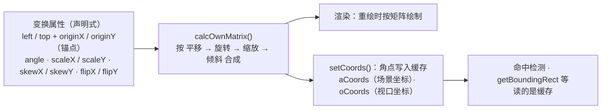

import { Canvas, Controls, Meta } from '@storybook/addon-docs/blocks';
import * as Transform from './transform.stories';

<Meta of={Transform} name="Docs" />

# 变换

Fabric 不让你直接改矩阵：对象把"摆成什么样"记在一组变换属性里——left / top 指到锚点，originX / originY 解释锚点，angle、scaleX / scaleY、skewX / skewY、flipX / flipY 描述旋转、缩放、倾斜、翻转——渲染与命中时再按固定顺序把它们合成一个矩阵。本课讲清这套属性模型：改哪个属性对象绕哪个点动、角度与倾斜的单位是什么、翻转和负缩放什么关系、变换矩阵怎么算，以及改完属性为什么必须补 `setCoords()`。这是[基础图形](?path=/docs/basic-shapes--docs)通用属性表里"变换类属性"一行的展开；用鼠标拖手柄做变换见[变换控件](?path=/docs/controls--docs)，视口缩放平移见[视口与坐标](?path=/docs/viewport--docs)。



| 属性 / 方法 | 默认值 | 单位 / 取值 | 回查要点 |
| --- | --- | --- | --- |
| left / top | 0 / 0 | 场景坐标 | 锚点坐标，含义由 originX / originY 解释 |
| originX / originY | 'center' / 'center'（v7；v5 / v6 为 'left' / 'top'） | left / center / right，top / center / bottom | 不只解释定位，也是旋转与缩放的支点；已标 deprecated，新项目保持 center |
| angle | 0 | 度（TDegree） | `set('angle')` 绕锚点转；`rotate()` 绕中心转 |
| scaleX / scaleY | 1 / 1 | 倍率，可负 | 乘在 width / height 上的变换系数，width / height 本身不变 |
| skewX / skewY | 0 / 0 | 度 | 沿轴剪切，只扩大包围盒，不改 width / height |
| flipX / flipY | false / false | 布尔 | 渲染矩阵上等价于 scale 取负 |
| calcTransformMatrix() / calcOwnMatrix() | — | 6 元数组 `[a, b, c, d, e, f]` | 按"平移 → 旋转 → 缩放 → 倾斜"合成；前者含父 Group 矩阵 |
| setCoords() | — | — | 程序改位置 / 尺寸 / 角度后刷新 aCoords、oCoords 缓存 |

## 锚点与 origin

[基础图形](?path=/docs/basic-shapes--docs)一课已经确立定位语义：left / top 不是天然的左上角坐标，而是**锚点坐标**，锚点落在对象哪里由 originX / originY 决定。v7.0 起两者默认 `'center'`（CHANGELOG PR #10715），v5 / v6 默认 `'left' / 'top'`——.d.ts 里 originX 的 `@default 'left'` 注释滞后于运行时，以实际默认为准。本课往前再走一步：**锚点不只解释 left / top，它也是一切变换的支点**。旋转绕锚点进行，缩放沿锚点展开；换 origin 不换数值，对象就绕锚点重摆。

机制上，Fabric 永远先由锚点推中心：中心 = 锚点 + 按 angle 旋转后的半尺寸偏移（`translateToCenterPoint` 先按未旋转尺寸平移，再把这个偏移绕锚点转 angle）。所以 `set('angle')` 时锚点不动、对象绕它旋转；`set('scaleX')` 时锚点不动、对象沿它单向或对称扩张。

```ts
const rect = new Rect({ left: 320, top: 180, width: 150, height: 100 });
// v7 默认 originX/originY 均为 'center'：left/top 指对象中心
rect.set({ originX: 'left', originY: 'top' }); // 换解释：同数值下对象绕锚点重摆
rect.set('angle', 45); // 绕锚点（此刻是左上角）旋转，left/top 数值不动
rect.rotate(45);       // 绕对象中心旋转，并改写 left/top 保持中心不动
```

<Canvas of={Transform.AnchorPivot} />
<Controls of={Transform.AnchorPivot} />

| 读者操作 | 可核对结果 |
| --- | --- |
| 「originX / originY」切到 left / top，保持「设置方式」为 set('angle')，拖「angle 角度」 | 「锚点画布坐标」恒为 320, 180，红点套在灰圈里不动——旋转绕锚点；「left / top」读数也不动 |
| 「设置方式」切到 rotate()，再拖「angle 角度」 | 「中心点」读数恒定，「left / top」被 rotate() 改写——rotate 绕中心，锚点数值让位 |
| 把「originX / originY」切回 center | 同一角度下两种设置方式的「锚点画布坐标」「中心点」完全一致——origin 为 center 时二者等价 |

## 旋转

angle 的单位是**度**。类型层面的 TDegree / TRadian 都是 number 的名义标记：对象上的公开属性（angle、skewX、skewY）与 `rotate()` 全部收度数；弧度只出现在底层工具——`Point.rotate(theta)` 收弧度，`util.cos` / `util.sin` 收弧度，两者互转用 `util.degreesToRadians` / `util.radiansToDegrees`。拿到 `Point.rotate` 要的参数时别忘换算。

`set('angle')` 与 `rotate()` 的差别只在 origin 不是 center 时显现（证据见上一节的范例）：

- `set('angle', v)` 只改角度，绕当前锚点旋转；
- `rotate(v)` 绕对象中心旋转：内部临时把 origin 切到 center、设置角度、再按原 origin 改写 left / top（`centeredRotation` 默认 true；设为 false 后 rotate 退化为 set('angle')，这是 v5 时代的兼容开关）。

绕任意点旋转没有内置方法，标准配方是"旋转中心向量 + 放回中心"两步：

```ts
import { Point, util } from 'fabric';
import type { FabricObject } from 'fabric';

function rotateAround(obj: FabricObject, degrees: number, pivot: Point) {
  const center = obj.getCenterPoint();
  // 中心绕 pivot 转 degrees：Point.rotate 收弧度，先换算
  const next = center
    .subtract(pivot)
    .rotate(util.degreesToRadians(degrees))
    .add(pivot);
  obj.set('angle', obj.angle + degrees);             // 设定目标角度
  obj.setPositionByOrigin(next, 'center', 'center'); // 把中心放回旋转后的位置
  obj.setCoords();
}
```

两个回查点：对象在 Group 里时，自身 angle 不含父级旋转，总角度用 `getTotalAngle()` 读；改 angle 属于位置类修改，之后要补 `setCoords()`（机制见「setCoords 与坐标缓存」一节）。

## 缩放与倾斜

### 缩放 scaleX / scaleY

scaleX / scaleY 是**变换系数**，乘在渲染尺寸上；width / height 保持"原始尺寸"不动。这正是[基础图形](?path=/docs/basic-shapes--docs)里"改大小改源头字段"的另一面：radius 改的是图形本体（width 跟着派生），scale 改的是"怎么摆"。实际占位用 `getScaledWidth()` / `getScaledHeight()` 读——它等于 `_getTransformedDimensions`：strokeUniform 为 false（默认）时为 `(width + strokeWidth) × scale`，即描边计入；skew 也计入（见下）。包围盒尺寸则用 `getBoundingRect().width / height`（旋转后还会更大，见常见问题）。

```ts
rect.set('scaleX', 2);   // width 读数不变，渲染宽度 = (width + strokeWidth) × 2
rect.getScaledWidth();   // 实际占位宽（含描边）
rect.scale(1.5);         // 等比设置 scaleX = scaleY = 1.5，内部已调 setCoords()
rect.scaleToWidth(300);  // 等比缩放至包围盒宽约 300，内部已调 setCoords()
rect.scaleToHeight(200); // 同上，按高度
```

三个便捷方法 `scale()` / `scaleToWidth()` / `scaleToHeight()` 内部都会 `setCoords()`——用它们改缩放不需要再手动刷新。scaleToWidth 是**等比**缩放（scaleX 与 scaleY 一起变），换算因子按当前包围盒与 getScaledWidth 之比计算，因此旋转、skew 都已计入；注意它读的包围盒来自缓存，混用前先刷新（范例源码里有一处注释说明这个顺序）。缩放的支点同样是锚点：origin 为 left / top 时沿锚点单向扩张，为 center 时对称扩张。

### 倾斜 skewX / skewY

skewX / skewY 是剪切角，单位也是**度**，内部换算成 `tan(angle)` 乘进矩阵。效果是沿轴剪切：skewX 让顶边相对底边平移，矩形变平行四边形。它不改 width / height，也不改 getScaledHeight——只把 getScaledWidth 与包围盒按 `tan(skewX)` 扩张。一个细节：aCoords 角点在 skew 下取的是放大后包围框的四个角（近似外接），命中区域比实际平行四边形略大。

<Canvas of={Transform.ScaleSkew} />
<Controls of={Transform.ScaleSkew} />

| 读者操作 | 可核对结果 |
| --- | --- |
| 拖「scaleX」 | 「width×height」恒为 100×60；「scaleX / scaleY」与「getScaledWidth×Height」同步变化 |
| 拖「skewX 倾斜角」 | 高度类读数全部不动，矩形变平行四边形，「包围盒」宽度按 tan(skewX) 扩张——倾斜只扩占位 |
| 调「scaleToWidth 目标宽」 | 「scaleX / scaleY」一起变（等比缩放的直接证据），包围盒宽度按目标重算；此后再拖「scaleX」会回到单轴缩放 |

## 翻转与镜像

flipX / flipY 是布尔镜像开关。在渲染矩阵上，`flipX: true` 与 `scaleX: -1` **逐元相同**——`calcDimensionsMatrix` 对 flip 的实现就是给 scale 取负号。矩阵层面的三种事实：

- 两种写法的 `calcOwnMatrix()` 完全一致，视觉也完全一致；
- `util.qrDecompose` 从矩阵分解不出 flip：镜像矩阵被规范成 `angle: 180 + scaleY: -1`（scaleX 恒为非负）；
- 官方工具 `applyTransformToObject`（Group 进出、序列化还原等场景）先把 flipX / flipY 清零、再把分解结果直接赋给 scale——flip 标记在矩阵往返中不保留。

差异在属性层面：flip 是语义明确的布尔，`toObject` 独立序列化、往返稳定；负 scale 会混进尺寸类读数，也更容易被别的换算误用。程序化镜像建议用 flipX / flipY。顺带一提：v7 里拖角手柄把对象"翻过来"时，交互代码写进对象的是负 scale 而不是 flip（两者本就等价），细节见[变换控件](?path=/docs/controls--docs)。

```ts
rect.set('flipX', true); // 渲染矩阵 [a] 分量取负：与 scaleX: -1 完全等价
util.qrDecompose(rect.calcOwnMatrix());
// → { angle: 180, scaleX: 1, scaleY: -1, ... }：分解表达不出 flip
```

<Canvas of={Transform.FlipMatrix} />
<Controls of={Transform.FlipMatrix} />

| 读者操作 | 可核对结果 |
| --- | --- |
| 「镜像方式」在 flipX: true 与 scaleX: -1 之间切换 | 箭头视觉完全相同，「calcOwnMatrix()」读数逐元相同——渲染完全等价 |
| 观察「qrDecompose 分解」读数 | 两种镜像态分解结果一致：angle 180°、scaleX 1.00、scaleY -1.00——矩阵分解表达不了 flip |
| 切回「无镜像」 | 矩阵回到 [1, 0, 0, 1, …]，平移分量（末两位）始终是中心坐标 |

## 变换矩阵

上面所有属性最终由 `calcOwnMatrix()` 合成为一个 2×3 仿射矩阵 `[a, b, c, d, e, f]`，合成顺序固定：**平移 → 旋转 → 缩放（含 flip）→ 倾斜**（`composeMatrix` = translate × rotate × dimensions）。平移分量是中心点坐标，不是 left / top。

```ts
rect.calcOwnMatrix();        // 仅自身变换：[a, b, c, d, 中心x, 中心y]
rect.calcTransformMatrix();  // 在 Group 内时 = 父矩阵 × 自身矩阵；传 true 跳过父级
rect.transformMatrixKey();   // 缓存 key：14 项变换相关属性的快照数组
```

三层关系一次讲清：

- **calcOwnMatrix()** 只含对象自己的变换；**calcTransformMatrix()** 在对象处于 Group 中时左乘父矩阵（`skipGroup` 参数可跳过）。Group 与父子坐标属于[分组与多选](?path=/docs/group-selection--docs)。
- 两个矩阵都按 `transformMatrixKey()` 缓存：key 是 top、left、width、height、scaleX、scaleY、angle、strokeWidth、skewX、skewY、flipX、flipY、originX、originY 的值数组，变了才重算——所以直接读矩阵不会踩到"属性已改、矩阵还是旧的"。
- 对象矩阵是**场景坐标**，不含 viewportTransform；屏幕位置还要再乘画布的视口矩阵。改视口缩放平移不影响 aCoords（场景角点），但 oCoords 会随视口变——完整的视口模型见[视口与坐标](?path=/docs/viewport--docs)。

配套工具都在 `util` 里：`util.qrDecompose`（矩阵 → angle / scale / skew / translate，skewY 恒为 0）、`util.composeMatrix`（反向合成）、`util.transformPoint`（点过矩阵，推荐改用 `Point#transform`）。官方 Transformations 指南把这套矩阵记作 `calcOwnTransform()`，实际方法名是 `calcOwnMatrix()`——文档页笔误，以 API 与源码为准。

## setCoords 与坐标缓存

变换属性是声明式的，但命中检测与包围盒不每次现算：对象把四角坐标存在 **aCoords** 缓存里（场景坐标，不随视口变），`setCoords()` 负责重算。`getCoords()` 第一次访问会惰性初始化 aCoords，之后**永远读缓存**。走缓存的公开 API：`getBoundingRect()`、`containsPoint()`（命中检测）、`intersectsWithObject / intersectsWithRect`、`isContainedWithinObject`、`isOnScreen()`。只想算不落缓存用 `calcACoords()`。

官方在 `set()` 的文档里写明了规则：**改位置、尺寸相关属性（left、top、scale、angle 等）不会更新边框与控件位置，需要自己调 `setCoords()`**。交互变换（鼠标拖拽）内部会自动刷新，程序 `set()` 不会——官方 GOTCHAS 把"对象选不中了"列为典型症状。[基础图形](?path=/docs/basic-shapes--docs)一课踩过的坑（画面更新了但点不中）就是这条机制。

```ts
rect.set({ left: 330, angle: 45 });
canvas.requestRenderAll();  // 画面更新了……
rect.getBoundingRect();     // ……但包围盒还在旧位置：读的是 aCoords 缓存
rect.containsPoint(probe);  // 命中判断同样用旧缓存 → 点不中
rect.setCoords();           // 刷新 aCoords（在交互画布上还会重算 oCoords）
```

**oCoords** 是第二套缓存：控件与交互命中的**视口坐标**，由 `InteractiveObject.setCoords()` 额外计算（乘上 viewportTransform）。对象不在画布上时 setCoords 后 oCoords 仍为 undefined。改视口（缩放、平移）后同样要调 setCoords 刷 oCoords——细节归[视口与坐标](?path=/docs/viewport--docs)。

<Canvas of={Transform.CoordsCache} />
<Controls of={Transform.CoordsCache} />

| 读者操作 | 可核对结果 |
| --- | --- |
| 拖「left」到 330，保持「改后调 setCoords()」打开 | 「getBoundingRect().left」同步移动；对象中心压住红圈，「containsPoint(330, 180)」为 true |
| 关闭「改后调 setCoords()」，再拖「left」 | 画面上对象移动了，但「getBoundingRect().left」「aCoords.tl.x」冻结在最后一次刷新的值——缓存陈旧 |
| 拖到 330 且不刷新 | 「containsPoint(330, 180)」为 false——画面里对象明明压着探测点却命中不了，这就是"点不中"的机制 |

## 最佳实践

- 程序改完 left / top / angle / scale / skew / flip 后补一句 `setCoords()`；批量操作时逐个对象刷。改缩放优先用 `scale()` / `scaleToWidth()` / `scaleToHeight()`，它们内部已刷新。
- 需要等比缩放就用上面三个方法，别手写 `scaleX = scaleY = v`——既少一次缓存刷新，也不会出现两轴不同步。
- 镜像用 flipX / flipY，不用负 scale：矩阵等价，但布尔语义、序列化与工具分解都更干净。
- 以左上角为基准布局时，用 `setXY(p, 'left', 'top')` 或 `positionByLeftTop(p)` 显式声明锚点语义，别在 center 默认下心算偏移；持续旋转的动画场景保持 center 锚点更自然（动画见[动画](?path=/docs/animation--docs)）。

## 常见问题

- 程序里 set() 改了 left / angle / scale，画面更新了，但鼠标点不中对象、包围盒或选中框停在旧位置
  补 `obj.setCoords()`。机制：getBoundingRect、containsPoint 等读的是 aCoords 缓存，set() 只改属性不刷缓存；官方 set() 文档与 GOTCHAS 都明确了这条规则。交互画布上还会同步刷新控件用的 oCoords。
- 对象旋转 45° 后 getBoundingRect() 变大了，是不是对象尺寸变了
  不是。getBoundingRect 是轴对齐外接框：旋转后的斜置盒子取水平外接必然变大。对象自身尺寸看 width / height × scale（getScaledWidth / getScaledHeight 不含 angle）。skew 同理会扩外接框。
- 拖角手柄把对象翻过来后，读到的是负 scaleX 而不是 flipX = true
  正常：v7 交互缩放直接把符号写进 scale，flip 与负 scale 在矩阵上完全等价（qrDecompose 也区分不了）。自己的代码里镜像仍建议显式用 flipX / flipY。

## 总结回顾

摘要：

left / top 是锚点坐标，originX / originY（v7 默认 center）不只解释定位，也是旋转与缩放的支点：中心 = 锚点 + 旋转后的半尺寸偏移，因此 set('angle') 绕锚点转、rotate() 绕中心转并改写 left / top，绕任意点用"旋转中心向量再放回"配方。scaleX / scaleY 是乘在 width / height 上的变换系数（width / height 与 getScaledWidth 含描边口径不同），scale / scaleToWidth / scaleToHeight 等比缩放且内部已刷新缓存；skewX / skewY 以度为单位沿轴剪切、只扩占位。flip 与负 scale 矩阵逐元等价，qrDecompose 分解不出 flip；所有属性按"平移 → 旋转 → 缩放 → 倾斜"由 calcOwnMatrix 合成，Group 内再左乘父矩阵得 calcTransformMatrix。命中检测与 getBoundingRect 读 aCoords 缓存，程序 set() 后必须 setCoords()，交互画布上另有视口坐标的 oCoords。

一句话：

> 变换属性声明"摆成什么样"，setCoords() 决定"按什么命中"——改了属性不刷缓存，画面对了命中也是错的。

知识要点：

- left / top 的含义由什么解释？v7 与 v5 / v6 的 origin 默认值差在哪？
- 锚点除了定位还决定什么？set('angle') 与 rotate() 分别绕哪个点转，何时等价？
- 角度的单位是什么？弧度（TRadian）出现在哪些 API 边界上？
- scaleX / scaleY 与 width / height 各管什么？getScaledWidth 与 getBoundingRect 的口径差异是什么？
- skewX / skewY 改 width / height 吗？它改哪些读数？
- flipX 与 scaleX: -1 在矩阵层面什么关系？程序化镜像选哪个？
- calcOwnMatrix 与 calcTransformMatrix 差在哪？矩阵缓存 key 是什么？
- 哪些 API 读 aCoords 缓存？程序改完变换属性后要补什么？

## 参考资料

- [官方指南：Transformations（合成顺序与平面模型）](https://fabricjs.com/docs/transformations/)
- [官方 API：FabricObject（变换属性、calcTransformMatrix、setCoords）](https://fabricjs.com/api/classes/fabricobject/)
- [官方 GOTCHAS：setCoords 与"对象选不中"（Objects are no more selectable）](https://fabricjs.com/docs/old-docs/gotchas/)
- [PR #10715：originX / originY 默认值改为 center/center（v7.0.0）](https://github.com/fabricjs/fabric.js/pull/10715)
