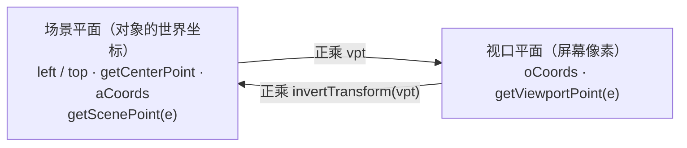

import { Canvas, Controls, Meta } from '@storybook/addon-docs/blocks';
import * as Viewport from './viewport.stories';

<Meta of={Viewport} name="Docs" />

# 视口与坐标

[变换](?path=/docs/transform--docs)一课讲的是对象自己的矩阵——"对象摆成什么样"。本课讲画布上的第二个矩阵 `viewportTransform`（下称 **vpt**）——"你怎么看这个场景"。对象的位置、角度、aCoords 全部活在**场景平面**里，缩放平移改的只是 vpt 这 6 个数字，画布上没有任何对象因此移动；反过来，同一个场景点在屏幕上的落点（**视口坐标**）完全由 vpt 决定。本课讲清 vpt 的矩阵结构与渲染链路、场景 / 视口两套坐标的换算、`setZoom` / `zoomToPoint` / `absolutePan` 的真实差异（按 v7.4 源码核实——`setZoom` 并不会重置平移），以及缩放平移之后命中、控件与 retina 为什么仍然各就各位。



渲染一帧时，lower-canvas 的上下文先带上 retina 基础 scale（机制见[渲染模型](?path=/docs/rendering-model--docs)），再 `ctx.transform(vpt)`，最后逐个乘对象自身矩阵——三层各管一件事，retina 倍率从不进 vpt。

| 属性 / 方法 | 默认 / 结果 | 语义 | 回查要点 |
| --- | --- | --- | --- |
| viewportTransform | `[1, 0, 0, 1, 0, 0]` | Canvas 2D 变换矩阵 | 前 4 位是线性部分（缩放 / 旋转），e / f 是平移；对象坐标活在场景平面，vpt 只改观察 |
| setViewportTransform(vpt) | 整体替换 | 重算 `vptCoords` 并按 `renderOnAddRemove`（默认 true）请求重绘；交互画布上自动刷新**活动对象**的 oCoords | 直接赋值 `canvas.viewportTransform = [...]` 没有这些副作用 |
| getZoom() | 1 | `sqrt(a² + b²)` | 旋转视口下也反映缩放幅度 |
| setZoom(z) | — | **= `zoomToPoint(new Point(0, 0), z)`** | 以视口左上角为不动点；e / f 被等比改写，**不清零** |
| zoomToPoint(point, z) | — | 围绕不动点缩放 | `point` 是**视口坐标**；只写 vpt[0] / vpt[3]，假定视口无旋转 |
| absolutePan(p) / relativePan(Δ) | — | e = -p.x、f = -p.y / e += Δ.x、f += Δ.y | `p` 是**场景坐标**（送到视口左上角）；`Δ` 是视口像素 |
| getScenePoint(e) / getViewportPoint(e) | 返回 Point | 事件点换算到场景 / 视口平面 | 仅交互画布（Canvas）上有；v5 的 `getPointer(e, ignoreZoom)` 已废弃，`restorePointerVpt` 已删除 |
| backgroundVpt / overlayVpt | true / true | 背景色 / 背景图、覆盖是否随 vpt | false 时钉在画布元素上，不随缩放平移 |
| enableRetinaScaling | true | devicePixelRatio 倍率 | 以 backstore 尺寸 + ctx 基础 scale 生效，与 vpt 相乘（见正文） |

## 视口矩阵 viewportTransform

vpt 是一个 2×3 仿射矩阵 `[a, b, c, d, e, f]`，语义与 Canvas 2D 的 `ctx.transform(a, b, c, d, e, f)` 完全一致：`[a, b, c, d]` 是线性部分（对角线承担缩放，非对角线承担旋转 / 倾斜），`e / f` 是平移（视口像素）。默认恒等矩阵，构造时也可以直接传入：

```ts
import { Canvas } from 'fabric';

const canvas = new Canvas(el, {
  viewportTransform: [1, 0, 0, 1, 0, 0], // 默认值；例如 [0.7, 0, 0, 0.7, 50, 50]
});
```

它在渲染管线的位置是"对象矩阵之外的一层"：`renderCanvas` 先 `ctx.save()`、`ctx.transform(...vpt)`，在这个变换后的空间里逐个绘制对象，`ctx.restore()` 之后才画活动对象的控件（控件用的是已经换算好的视口坐标 oCoords，见「缩放平移后的命中与控件」）；背景与覆盖在另一处绘制，是否乘 vpt 由 `backgroundVpt / overlayVpt`（默认 true）单独决定。

改 vpt 有两条路，副作用不同：

- `canvas.setViewportTransform(vpt)` 是正门：替换矩阵、重算 `vptCoords`（视口四角对应的场景坐标，`calcViewportBoundaries()` 随时可手动重算）、按 `renderOnAddRemove` 请求重绘；交互画布上还会对活动对象调 `setCoords()` 刷新 oCoords。
- 直接赋值 `canvas.viewportTransform = [...]` 只是换引用：不重绘、不刷缓存。旧代码里 `setViewportTransform` 返回画布实例的链式写法（`canvas.setZoom(2).absolutePan(p)`）在 v6 起已随链式调用一并移除，这些方法现在都返回 void。

两个回查点：`getVpCenter()` 给出**视口中心对着哪个场景点**（逆乘 vpt 的场景坐标，配 `viewportCenterObject()` 使用；而 `getCenterPoint()` 给的是视口平面的 `(width/2, height/2)`，两者别混）；vpt 默认**不进序列化**——`toJSON()` 不含它，要保存视图就 `canvas.toObject(['viewportTransform'])`，`loadFromJSON` 遇到 JSON 里的 `viewportTransform` 字段会恢复。

## 场景与视口坐标

同一个点有两套读数：**场景坐标**是对象世界的坐标——left / top、`getCenterPoint()`、aCoords 都在这个平面，改 vpt 不改它们；**视口坐标**是这个点落在屏幕（画布元素）上的像素位置，等于场景坐标正乘 vpt。双向换算只需要矩阵乘法：

```ts
import { Point, util } from 'fabric';

const vpt = canvas.viewportTransform;
const viewportPoint = scenePoint.transform(vpt);                        // 场景 → 视口：正乘
const scenePoint2 = viewportPoint.transform(util.invertTransform(vpt)); // 视口 → 场景：逆乘
// 等价工具：util.sendPointToPlane(p, undefined, vpt) —— Group 等其他平面互转也走它
```

指针事件是最常见的换算入口。交互画布上 `canvas.getViewportPoint(e)` 给出事件点相对画布元素的 CSS 像素坐标（不受 vpt 影响），`canvas.getScenePoint(e)` 在它基础上逆乘 vpt 给出场景坐标；事件回调里更直接——指针类事件（含 `mouse:wheel`）的 payload 自带 `scenePoint` / `viewportPoint` 字段（事件系统的完整梳理见[事件系统](?path=/docs/events--docs)）。

版本对照要留意：v5 的 `canvas.getPointer(e, ignoreZoom)` 一个方法两套语义（`ignoreZoom: false` 给场景坐标、`true` 给视口坐标），v6 起拆成 `getScenePoint` / `getViewportPoint` 两个名字，`getPointer` 与 `restorePointerVpt`（v5 公开的"指针坐标逆乘 vpt"辅助方法）都已删除（v6 破坏性变更 issue #8299）。读 v5 时代的社区资料时按这个对照翻译。

retina 在这层的结论一句话：**换算发生在视口的 CSS 像素平面上，retina 倍率从不进 vpt**。`enableRetinaScaling`（默认 true，详见[渲染模型](?path=/docs/rendering-model--docs)）把 backstore 尺寸乘上 devicePixelRatio 并给上下文预先 `ctx.scale(retina, retina)`，渲染时的完整链路是 **retina 基础 scale × vpt × 对象矩阵**——所以 vpt 里写 `[2, 0, 0, 2, 0, 0]` 与打开 retina 在物理像素上是两回事，指针换算也不需要你操心倍率。

## 缩放：setZoom 与 zoomToPoint

`zoomToPoint(point, value)` 是缩放的正主：`point` 是**视口坐标**（屏幕上的不动点），缩放后这个位置对着的内容不变——源码里就是"先把 point 逆乘回场景、把 vpt[0] / vpt[3] 设为 value、再平移 e / f 把该场景点送回 point"。`setZoom(value)` 没有自己的逻辑，就是 `zoomToPoint(new Point(0, 0), value)`——**以视口左上角为不动点**。所以"setZoom 会重置平移"是误解：它保留左上角对着的场景点，只把 e / f 等比缩放（先 `absolutePan(new Point(80, 40))` 再 `setZoom(2)`，左上角仍对着场景 (80, 40)，vpt 变为 `[2, 0, 0, 2, -160, -80]`）。

```ts
canvas.setZoom(2);                            // = zoomToPoint(new Point(0, 0), 2)：左上角不动
canvas.zoomToPoint(canvas.getCenterPoint(), 2); // 围绕视口中心缩放（getCenterPoint 给视口坐标）
canvas.zoomToPoint(opt.viewportPoint, 2);       // 围绕事件发生的位置缩放
canvas.getZoom();                               // sqrt(a² + b²)：旋转视口下也成立
```

边界：`zoomToPoint` / `setZoom` 只写 vpt 的两个对角线分量，假定视口无旋转（b / c 为 0）。带旋转的观察矩阵自己用 `util.composeMatrix` 组装后交给 `setViewportTransform`。

<Canvas of={Viewport.ZoomPivot} />
<Controls of={Viewport.ZoomPivot} />

| 读者操作 | 可核对结果 |
| --- | --- |
| 保持「缩放方式」为 zoomToPoint(标记点)，拖「zoom 倍率」 | 蓝色矩形钉在屏幕上不动，网格以它为中心伸缩；「标记 场景坐标」恒为 320, 180，「标记 视口坐标」也保持不变——不动点语义的直接证据 |
| 切到 setZoom，拖「zoom 倍率」 | 同一倍率下标记朝左上角方向移动——不动点换成了 (0, 0)；「左上角对应场景点」恒为 80, 40（setZoom 保留它），vpt 的 e / f 读数变为 -80×z、-40×z |
| 切到 zoomToPoint(视口中心) | 标记绕画布中心伸缩，「标记 视口坐标」大致朝中心收敛 |
| 把「zoom 倍率」拨回 1 | 三种方式的 vpt 读数完全一致——倍率 1 时殊途同归 |
| 观察矩形的活动边框与手柄 | 矩形随缩放放大缩小，但边框线宽与手柄大小保持屏幕尺寸（机制见下节） |

## 平移：absolutePan 与 relativePan

平移改的就是 e / f，两个便捷方法给出两种语义：

```ts
canvas.absolutePan(new Point(100, 60)); // 场景点 (100, 60) 送到视口左上角 → e = -100, f = -60
canvas.relativePan(new Point(20, 0));   // 在当前 vpt 上累加：e += 20, f += 0（画面内容向右移）
canvas.setViewportTransform([1, 0, 0, 1, 0, 0]); // 重置视图：没有专门的 reset API，恒等矩阵就是复位
```

`absolutePan(point)` 的 `point` 是**场景坐标**（"把镜头对准哪里"），`relativePan(Δ)` 的 `Δ` 是视口像素：画面内容沿 `Δ` 方向移动（拖拽平移时让 `Δ` 取鼠标位移即可，镜头朝反方向挪）。配套的居中家族也按这两个平面分工：`centerObject(obj)` 把对象中心放到**画布元素中心**（无视 vpt），`viewportCenterObject(obj)` 放到**当前视口中心**（`getVpCenter()`，随缩放平移走）。

<Canvas of={Viewport.PanConvert} />
<Controls of={Viewport.PanConvert} />

| 读者操作 | 可核对结果 |
| --- | --- |
| 拖「absolutePan 场景 X / Y」 | 「viewportTransform」读数恒为 `[1, 0, 0, 1, -X, -Y]`——平移只碰 e / f；「左上角对应场景点」逐项等于控件值 |
| 观察「标记 场景坐标」 | 恒为 320, 180——vpt 平移不改任何对象 |
| 观察「标记 视口坐标」与「逆算回场景」 | 视口读数 = 320 - X、180 - Y 随动；逆算读数精确回到 320, 180——正乘 / 逆乘闭环 |
| 把 X 拖到 320、Y 拖到 180 | 标记矩形正好探到屏幕左上角：场景点 (320, 180) 被送到了 (0, 0) |

## 缩放平移后的命中与控件

改 vpt 之后"鼠标还点得准吗"分三层，各走各的坐标：

- **对象命中天然正确**：命中检测在**场景平面**进行——事件到来时 `getScenePoint(e)` 现场逆乘 vpt，再与对象的 aCoords（场景坐标缓存，见[变换](?path=/docs/transform--docs)）比较。vpt 怎么变，两边同步，不需要任何刷新。
- **控件命中读 oCoords（视口坐标缓存）**：角点手柄的命中（`findControl`）与渲染用的是乘过 vpt 的 oCoords。`setViewportTransform` 只自动刷新**活动对象**的 oCoords——好在控件也只为活动对象绘制；直接赋值 vpt、或要让新对象立刻可交互时，给相关对象补 `setCoords()`（`setActiveObject` 内部也会刷新被激活对象）。
- **控件尺寸恒定**：`calcOCoords` 在合成矩阵末尾乘上 `1 / vpt 缩放`——对象放大 2.5 倍，边框线宽与手柄大小不变，保证任何倍率下手柄都好点。框选矩形同样不受 vpt 滞留影响：拖拽时记录场景点、绘制时现场正乘 vpt。

选区、拖拽阈值等交互配置本身不属于本课，见[拖拽与选择](?path=/docs/drag-select--docs)与[变换控件](?path=/docs/controls--docs)。

## 最佳实践

滚轮缩放的标准配方是用事件自带的视口点做不动点，倍率乘在当前 `getZoom()` 上：

```ts
canvas.on('mouse:wheel', (opt) => {
  const factor = 0.999 ** opt.e.deltaY;
  canvas.zoomToPoint(opt.viewportPoint, canvas.getZoom() * factor);
  opt.e.preventDefault();
  opt.e.stopPropagation();
});
```

其余取舍：

- "缩放后内容跑偏了"先检查不动点：想绕屏幕中心用 `zoomToPoint(canvas.getCenterPoint(), z)`，想钉住某对象用它的视口坐标，只有"以左上角为锚"才用 `setZoom`。
- 改 vpt 一律走 `setViewportTransform` / 便捷方法，不直接赋值；需要重置视图时 `setViewportTransform([1, 0, 0, 1, 0, 0])` 一步到位。
- 保存 / 恢复视图要显式带上 vpt：`canvas.toObject(['viewportTransform'])` 与 `loadFromJSON` 配对；只 `toJSON()` 会丢视图。

## 常见问题

- 直接赋值 `canvas.viewportTransform = [...]` 后画面没变、控件停在旧位置
  改用 `canvas.setViewportTransform(vpt)`。直接赋值只换引用：不请求重绘、不重算 vptCoords、不刷新活动对象的 oCoords；`setViewportTransform` 三件事都做。
- `setZoom(2)` 之后内容"漂"了，平移像是丢了
  正常：`setZoom` 以视口左上角为不动点，e / f 被等比改写而不是清零。要围绕指定位置缩放用 `zoomToPoint(point, 2)`，`point` 传视口坐标。
- 旧代码 `canvas.setZoom(2).absolutePan(...)` 报 undefined
  v6 起链式调用整体移除，视口方法都返回 void，拆成多条语句。
- 保存的 JSON 重新加载后缩放平移没了
  `toJSON()` 默认不序列化 vpt。保存时 `canvas.toObject(['viewportTransform'])`（或把 `viewportTransform` 字段并入 JSON），`loadFromJSON` 会恢复它。

## 总结回顾

摘要：

viewportTransform 是画布的观察矩阵 `[a, b, c, d, e, f]`：前 4 位线性部分、e / f 平移，渲染时以 `ctx.transform(vpt)` 介于 retina 基础 scale 与对象矩阵之间——对象活在场景平面，vpt 只决定怎么看。场景 / 视口坐标互转就是正乘 vpt 与逆乘 `util.invertTransform(vpt)`，指针用 `getScenePoint(e)` / `getViewportPoint(e)`（v5 的 getPointer / restorePointerVpt 已删除），事件 payload 自带两个字段。缩放方面 `setZoom` 就是 `zoomToPoint(new Point(0, 0), z)`——左上角不动、不清零平移；平移 `absolutePan`（场景点送到左上角）与 `relativePan`（e / f 累加）；改 vpt 走 `setViewportTransform`。命中层面：对象命中在场景平面现场逆乘所以天然正确，控件命中与渲染读 oCoords（活动对象自动刷新，其余补 setCoords），控件尺寸除以 vpt 缩放保持屏幕恒定；retina 倍率从不进 vpt。

一句话：

> 对象矩阵决定"对象摆成什么样"，viewportTransform 决定"你看场景的方式"——缩放平移改的是观察，不是场景；坐标换算永远是 vpt 的正乘与逆乘。

知识要点：

- viewportTransform 的 6 个分量各承担什么？默认值是什么？
- 场景坐标与视口坐标分别住在哪里？双向换算的公式是什么？
- setZoom 与 zoomToPoint 的不动点各是哪里？setZoom 会重置平移吗？
- absolutePan 与 relativePan 的参数各是什么坐标？对 e / f 各做什么？
- 直接赋值 vpt 与 setViewportTransform 的副作用差在哪？
- 缩放平移后，对象命中与控件命中分别靠什么保持正确？什么时候要补 setCoords？
- 缩放后边框手柄为什么不变大？retina 倍率为什么不出现在 vpt 里？
- v5 的 getPointer / restorePointerVpt 对应现在的什么 API？
- 保存 / 恢复视口状态要怎么做？

## 参考资料

- [官方 API：StaticCanvas（viewportTransform、setViewportTransform、zoomToPoint、setZoom、absolutePan、relativePan、getVpCenter）](https://fabricjs.com/api/classes/staticcanvas/)
- [官方 API：Canvas（getScenePoint / getViewportPoint 与事件指针）](https://fabricjs.com/api/classes/canvas/)
- [官方指南：Working with events（事件字段 scenePoint / viewportPoint）](https://fabricjs.com/docs/events/)
- [v6 破坏性变更清单 issue #8299（getPointer 废弃、restorePointerVpt 删除）](https://github.com/fabricjs/fabric.js/issues/8299)
- [官方 v5 文档：Canvas（getPointer(e, ignoreZoom) / restorePointerVpt 旧语义对照）](https://fabric5.fabricjs.com/docs/fabric.Canvas.html)
- [官方升级指南：Upgrading to Fabric.js 6.0（链式调用移除）](https://fabricjs.com/docs/upgrading/upgrading-to-fabric-60/)
