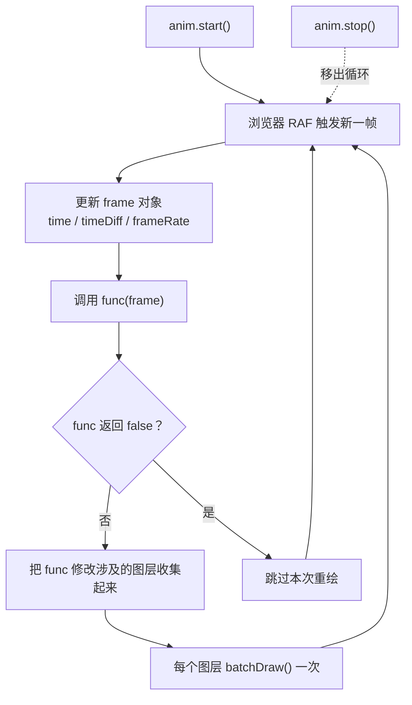

import { Canvas, Controls, Meta } from '@storybook/addon-docs/blocks';
import * as Animation from './animation.stories';

<Meta of={Animation} name="Docs" />

# 帧动画

`Konva.Animation` 是一个挂在图层上的逐帧循环：你写一个更新函数，它借助浏览器的 `requestAnimationFrame` 每帧调用一次，并在每帧末尾自动重绘传入的图层。它没有时长、没有结束回调——只要不 `stop()`，它就永远跑下去，因此适合连续的、由你自己控制轨迹的运动（旋转、漂浮、粒子、物理模拟）。需要「从 A 平滑过渡到 B、到点即停」的效果时，用下一课的 Tween，而不是 Animation。

理解 Animation 的关键是看清一帧里发生了什么：浏览器触发新一帧 → 引擎更新帧对象 → 调用你的 `func(frame)` → 收集所有需要重绘的图层 → 每个图层只 `batchDraw()` 一次。因此你在 `func` 里**只改节点属性**（位置、旋转、缩放、颜色），**绝不调用** `layer.draw()`——重绘由引擎接管。



| 名称 | 默认值 | 说明 |
| --- | --- | --- |
| `new Konva.Animation(func, layers)` | — | `func` 每帧执行；`layers` 可为单个 `Layer`、数组或省略，决定自动重绘范围 |
| `func(frame)` | — | 每帧回调，`this` 是动画实例；只更新属性，**不要**调用 `layer.draw()`；返回 `false` 跳过本次重绘 |
| `frame.time` | `0` | 自动画首次启动以来累计的毫秒数；`stop()` / `start()` **不清零**，跨暂停继续累加 |
| `frame.timeDiff` | `0` | 距上一帧的毫秒数；`start()` 时重置为 `0`，用于帧率无关的运动计算 |
| `frame.frameRate` | `0` | 当前每秒帧数，由 `1000 / timeDiff` 动态测得 |
| `frame.lastTime` | 构造时 `now()` | 上一帧的 `time` 值 |
| `start()` / `stop()` | — | 启动 / 停止循环；都返回 `this`，可链式调用；`start()` 内部先 `stop()` 再启动 |
| `isRunning()` | — | 返回当前是否在运行 |
| `setLayers` / `addLayer` / `getLayers` | — | 事后更换、追加、读取自动重绘的图层集合 |

## 创建动画

构造一个 Animation 只需要两样东西：一个每帧执行的函数 `func`，和它要驱动重绘的 `layers`。`func` 接收帧对象 `frame`，`this` 指向动画实例；`layers` 可以是单个 `Layer`、一个数组，或省略（省略则引擎不会自动重绘任何图层，你需要自己手动 `batchDraw`）。

```ts
import Konva from 'konva';

const layer = new Konva.Layer();
stage.add(layer);

const rect = new Konva.Rect({ x: 50, y: 50, width: 50, height: 50, fill: '#4f7cff' });
layer.add(rect);

const anim = new Konva.Animation((frame) => {
  // 只改属性，不调用 layer.draw()
  const r = 50;
  rect.position({
    x: r * Math.cos((frame.time * 2 * Math.PI) / 2000) + 100,
    y: r * Math.sin((frame.time * 2 * Math.PI) / 2000) + 100,
  });
}, layer);

anim.start();
```

最容易被忽略、也最容易写错的规则是：**`func` 内绝不调用 `layer.draw()` 或 `stage.draw()`**。引擎在每帧末尾会把所有运行中的 Animation 改动过的图层各 `batchDraw()` 一次（内部按 `_id` 去重，多个动画共享同一图层也只重绘一次）。自己再调一次 `draw` 不仅浪费，还会破坏 `batchDraw` 的合并优化、导致同一帧重绘两次。

下面是一个可交互的运行实例：蓝色节点沿轨道做匀速圆周运动。用下方控件切换「播放」与「角速度」，就能观察本课全部机制——逐帧回调、帧对象、循环控制。

<Canvas of={Animation.Interactive} />
<Controls of={Animation.Interactive} />

| 读者操作 | 可观察证据 |
| --- | --- |
| 保持「播放」打开 | 节点持续旋转；读数「时间」累加，「帧间隔」约 16ms，「帧率」约 60fps |
| 调节「角速度」 | 旋转快慢同步变化；「角度」读数增速随之改变 |
| 关闭「播放」 | 节点停在原地，读数冻结在最后一帧，「状态」变成已停止 |
| 把「角速度」拖到 0 | 节点不动，但「时间」仍在累加——帧回调仍在触发，只是位置增量为 0 |
| 打开 Show code | 看到该 Canvas 实际执行的 `example.ts` |

`func` 返回 `false` 可以告诉引擎「这一帧我没有改动，不用重绘」。这是一个纯优化开关：当你只想每隔几帧才更新一次视觉，或当前帧没有可见变化时返回 `false`，引擎就跳过对相关图层的 `batchDraw`。

### 图层管理

`layers` 参数在构造时给定，但事后可以随时更换：

```ts
// 把自动重绘范围换成另一个图层（替换）
anim.setLayers([layerA, layerB]);

// 追加一个图层（已有则返回 false，不重复添加）
anim.addLayer(layerC);

// 读取当前自动重绘的图层集合
const list = anim.getLayers(); // Konva.Layer[]
```

一个 Animation 可以驱动多个图层，引擎会在每帧末尾把所有这些图层各 `batchDraw()` 一次。典型的分层策略是：把持续运动的节点放在独立图层（每帧重绘），把静态背景放在另一个图层（不传给 Animation，从而不被反复重绘），以此控制重绘开销。图层分层的完整取舍见 [缓存与性能](?path=/docs/cache-performance--docs)。

## 帧对象与时间

`func` 收到的 `frame` 是一个被引擎原地更新的对象，四个属性描述了这一帧的时间信息：

| 属性 | 含义 | 典型用途 |
| --- | --- | --- |
| `time` | 自首次 `start()` 以来累计的毫秒数 | 用周期函数（`sin` / `cos`）生成循环轨迹 |
| `timeDiff` | 距上一帧的毫秒数 | 用速度 × 时间算位移，使运动与帧率无关 |
| `frameRate` | 当前每秒帧数（`1000 / timeDiff`） | 监控性能、显示 FPS |
| `lastTime` | 上一帧的 `time` 值 | 较少直接使用，等价于 `time - timeDiff` |

写运动时几乎总是用 `timeDiff`，而不是「每帧加一个固定值」。因为显示器的帧率不一定是 60fps——高刷屏 144fps、低端设备掉到 30fps 都很常见。如果每帧固定加 `2` 像素，在 144fps 屏上物体就会比 60fps 快两倍多。用 `timeDiff` 把「每秒位移」换算成「每帧位移」，速度就和帧率无关了：

```ts
// 角速度 120 度/秒 → 每帧增量 = 120 × timeDiff / 1000
const anglePerFrame = (degreesPerSecond * frame.timeDiff) / 1000;
```

上方实例的「角速度」控件就是用这个公式驱动的。调节它时，无论你的屏幕是 60fps 还是 120fps，节点每秒旋转的角度都等于控件值——把「帧间隔」读数和「角度」读数对着看，就能验证：`timeDiff` 越大（帧越慢），单帧角度增量越大，但每秒累计角度不变。

`frame.time` 更适合驱动**纯周期性**的运动（`Math.sin(time / 500)` 这类），因为它天然单调递增。但要留意：`time` 在 `stop()` / `start()` 之间**不清零**（引擎只重置 `timeDiff` 和 `lastTime`）。所以用 `time` 直接换算位置时，暂停后再启动，位置会从「按 `time` 当前值算出的点」继续，而不是从暂停点继续。需要「暂停→原位继续」时，用 `timeDiff` 累加法（见上方实例的 `angle`），把位置状态自己管起来。

## 循环控制

`start()` 和 `stop()` 控制循环的起停，`isRunning()` 查询当前状态。三者都挂在实例上：

```ts
anim.start();        // 进入循环，开始每帧调用 func；返回 this
anim.stop();         // 移出循环，func 不再被调用；返回 this
anim.isRunning();    // true / false
```

`start()` 内部会先 `stop()` 再启动，所以重复调用 `start()` 是安全的——它不会跑出两个循环。但更清晰的做法是按状态变化触发：实例里记录 `currentPlaying`，只在它真正切换时才 `start` / `stop`（上方实例就是这么做的）。

关闭上方实例的「播放」，节点会停在原地，读数冻结——这直观地说明了 `stop()` 之后帧回调不再触发，引擎也不再重绘对应图层。重新打开「播放」，节点从当前角度继续旋转，而不会跳回起点：因为位置由 `timeDiff` 累加的角度决定，`angle` 变量在停止期间被保留。

注意区分两种「不动」：**`stop()`** 是彻底停掉循环，帧回调不再触发、`time` 不再累加；**`speed = 0`** 是循环照常运行、`time` 照常累加，只是位置增量为 0。需要完全静止就 `stop()`（省 CPU）；需要「暂停在某一刻、稍后从同一时刻继续」也可以 `stop()`，因为 `timeDiff` 累加法天然支持原位续接。

## 最佳实践

- **用 `timeDiff` 驱动位移，不用固定步长。** 任何与「速度」相关的运动都写成 `位移 = 速度 × timeDiff / 1000`，保证在 30fps、60fps、144fps 屏上观感一致。`time` 适合周期函数，但要记住它跨 `stop/start` 不清零。
- **`func` 只改属性，不碰 `draw`。** 重绘由引擎在每帧末尾统一 `batchDraw`，按图层 `_id` 去重。自己调 `draw` 会重复重绘、破坏合并优化。
- **离开页面时 `stop()`。** Animation 内部基于 `requestAnimationFrame`，浏览器只在当前页可见时调度。但 Storybook Docs 切换页面时旧页 DOM 被移除，范例在 `dispose()` 里 `stop()` 并 `stage.destroy()`，避免泄漏；你自己写 Animation 时同样要在组件卸载 / 页面离开时 `stop()`。
- **分层隔离动态与静态。** 把持续运动的节点放在传给 Animation 的图层，静态背景放在另一图层且不传入，让引擎每帧只重绘真正变化的部分。

## 常见问题

- **在 `func` 里调了 `layer.draw()`，画面闪烁或卡顿。** 这违反了引擎约定。`draw()` 是同步全量重绘，而引擎已经在每帧末尾 `batchDraw()` 一次。删掉你的 `draw()` 调用，只保留属性更新即可。
- **同样的代码在 120Hz 手机上动得更快。** 用了「每帧加固定值」的写法。改成 `增量 = 每秒量 × frame.timeDiff / 1000`，速度就和帧率解耦。
- **`stop()` 再 `start()` 后，用 `frame.time` 换算的位置跳了一下。** `time` 跨 `stop/start` 不清零，而你的位置是 `f(time)` 的纯函数，所以会跳到「当前 `time` 对应的位置」。需要原位续接时，改用 `timeDiff` 累加法自己维护位置状态。
- **多个 Animation 同时跑，性能差。** 引擎对同一图层会去重 `batchDraw`，但每个 Animation 的 `func` 仍每帧执行一次。检查是否有可以合并的动画、是否有 `func` 做了重计算（每帧重建节点、每帧反序列化数据等），把可缓存的计算移到循环外。
- **希望动画「到点即停」或「A → B 过渡」。** Animation 没有时长和 `onFinish`，它是一个常驻循环。你需要的是下一课的 [Tween（补间与缓动）](?path=/docs/tween--docs)。

## 总结回顾

摘要：

`Konva.Animation` 把一个更新函数挂到图层的逐帧循环上：浏览器每触发一帧，引擎就更新帧对象、调用 `func(frame)`，并在帧末把改动涉及的图层各 `batchDraw()` 一次。帧对象的 `time`、`timeDiff`、`frameRate`、`lastTime` 描述了这一帧的时间信息，其中 `timeDiff` 是写帧率无关运动的关键——用「每秒量 × timeDiff / 1000」算位移，速度就和显示器刷新率解耦。循环由 `start()` / `stop()` 控制，`start()` 内部先 `stop()` 故可安全重复调用；`time` 跨暂停不清零，所以「暂停后原位续接」要用 `timeDiff` 累加法自己维护位置。Animation 没有时长和 `onFinish`，需要定点过渡用 Tween。

一句话：

> `func` 只改属性、重绘交给引擎，用 `timeDiff` 算位移让运动与帧率无关。

知识要点：

- `new Konva.Animation(func, layers)` 的两个参数各自决定什么？
- 为什么 `func` 内不能调用 `layer.draw()`？引擎如何避免重复重绘？
- `frame` 对象有哪四个属性？`time` 和 `timeDiff` 分别适合驱动什么运动？
- 为什么用「每秒量 × timeDiff / 1000」而不是「每帧加固定值」？
- `stop()` / `start()` 如何影响 `frame.time`？为什么暂停后原位续接要用累加法？
- Animation 和 Tween 的适用场景有何区别？

## 参考资料

- [Create an Animation（创建动画教程）](https://konvajs.org/docs/animations/Create_an_Animation.html)
- [Konva.Animation API（构造、frame、start / stop / setLayers）](https://konvajs.org/api/Konva.Animation.html)
