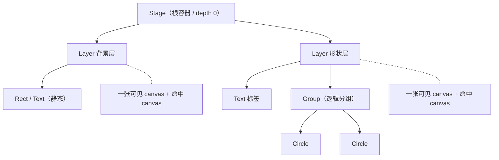

import { Canvas, Controls, Meta } from '@storybook/addon-docs/blocks';
import * as Architecture from './architecture.stories';

<Meta of={Architecture} name="Docs" />

# 核心架构

Konva 把命令式 Canvas 组织成一棵**虚拟节点树**：`Stage` 是根，`Layer` 是真实 canvas，`Group` 是逻辑分组，`Shape` 是叶子绘制单元。这棵树决定了绘制顺序、变换继承和事件路径，让你像操作 DOM 一样管理画布，而不是手写绘制循环。

每个 `Layer` 对应一张独立 canvas，因此「分层」就是「分 canvas」：静态背景和动态形状分到不同图层后，改一个形状只需要重绘它所在的那张 canvas。改变任何属性时，Konva 默认会自动把脏图层排进下一帧重绘，无需手动调用绘制方法。



| 概念 / 默认 | 回查要点 |
| --- | --- |
| `autoDrawEnabled = true` | 改属性自动触发所在 Layer 重绘，经 `requestAnimationFrame` 合并到一帧 |
| `Stage`（depth 0） | 根容器，只能 `add(Layer)`；`container` 指向 DOM 元素 |
| `Layer` = 一张 canvas | 每层有可见的场景 canvas + 隐藏的命中 canvas（事件检测） |
| `Group` | 逻辑分组，**不是** canvas；子节点继承它的变换 |
| `clearBeforeDraw = true` | 每次绘制前清空图层 canvas |
| 坐标原点 | 各 Layer canvas 左上角 `(0, 0)`，y 轴向下 |
| `x` / `y` | 相对**父容器**，不是相对 Stage |
| `pixelRatio` | 自动跟随 `devicePixelRatio`，可手动覆盖 |

## 节点树

所有节点都继承自 `Konva.Node`，可被变换、设置层级和绑定事件。`Konva.Container`（继承自 `Node`）提供子节点管理能力，`Stage`、`Layer`、`Group` 都是 `Container` 的子类。这层继承关系决定了谁可以拥有子节点、谁是真实 canvas、谁是逻辑分组。

节点的添加顺序就是同一父容器内的绘制顺序（z-index 相对兄弟节点）：先添加的画在后面，后添加的画在前面。用 `moveToTop()` / `moveToBottom()` / `moveUp()` / `moveDown()` 或 `zIndex(n)` 调整；`moveTo(newContainer)` 把节点搬到另一个容器。

```ts
import Konva from 'konva';

const stage = new Konva.Stage({ container, width, height });
const layer = new Konva.Layer();
stage.add(layer);                         // Stage 只能装 Layer

const rect = new Konva.Rect({
  x: 20, y: 20, width: 100, height: 60,
  fill: '#4f7cff',
});
layer.add(rect);                          // Layer / Group 装 Shape 或 Group
```

查询子树用 `find(selector)` / `findOne(selector)`，支持 `'#id'`、`'.name'` 和类型名（如 `'Circle'`），搜索**整棵子树**；`getChildren()` 只返回**直接**子节点。

```ts
layer.findOne('#myId');   // 按 id（全局唯一）
layer.find('.tag');       // 按 name（可空格分隔多个）
group.findOne('Circle');  // 按类型
layer.getChildren();      // 仅直接子节点，不递归
```

### Stage

`Stage` 是树的根节点，`depth` 恒为 0。它通过 `container` 配置（CSS 选择器字符串或 DOM 元素）挂接到页面，在容器内创建一个 `.konvajs-content` 包裹层并放入各图层的 canvas。`Stage` 只接受 `Layer` / `FastLayer` 子节点——直接 `add(Shape)` 会抛错。

`stage.width()` / `stage.height()` 既是画布逻辑尺寸，也决定底层 canvas 的像素尺寸（乘以 `pixelRatio`）。改变宽高会触发内部 `_resizeDOM`，重新设置每张图层 canvas 的大小并重绘。`stage.getPointerPosition()` 返回相对 Stage 的指针坐标（不含变换），是事件处理的位置基准。

### Layer

`Layer` 是唯一对应真实 canvas 的容器：每层维护一张**场景 canvas**（可见画面）和一张**命中 canvas**（隐藏，用颜色键做高命中检测）。多个图层叠加时，后添加的图层 DOM 上也更靠上，视觉上盖住前一层。

`layer.draw()` 立即同步重绘场景图与命中图；`layer.batchDraw()` 用 `requestAnimationFrame` 把重绘排到下一帧，并通过 `_waitingForDraw` 标志把同帧内的多次请求合并成一次——这是 Konva 自动重绘走的标准路径。`clearBeforeDraw`（默认 `true`）控制每次绘制前是否清空 canvas。

### Group 与 Shape

`Group` 是 `Layer`（或另一个 `Group`）内的逻辑分组容器，本身**不**产生 canvas：它的子节点仍画在所属 `Layer` 的 canvas 上。Group 的价值是让一组形状共享变换与组织结构——移动、缩放或旋转 Group，所有子节点跟随。

`Shape`（`Rect`、`Circle`、`Text` 等）是叶子绘制单元，继承自 `Node` 而非 `Container`，不能拥有子节点。形状的几何与样式（`fill`、`stroke`、`radius` 等）由各自的配置决定，详见形状与样式课程。

下面的实例用两层叠加展示整棵树。调整「形状层圆数」时，只有上层 Group 的子节点数变化；读数汇报图层数量、节点总数、Group 子节点数和首个圆相对 Group 的坐标。

<Canvas of={Architecture.Interactive} />
<Controls of={Architecture.Interactive} />

| 读者操作 | 可观察证据 |
| --- | --- |
| 调整「形状层圆数」 | 圆数量变化；读数「Group 子节点」与「节点总数」同步增减 |
| 把圆数设为 0 | 圆全部消失，「首个圆坐标」变为 `—`；背景层瓦片纹丝不动 |
| 缩放浏览器窗口 | 舞台尺寸跟随更新，背景瓦片与 Group 中心重新排布 |
| 打开 Show code | 看到该 Canvas 实际执行的 `example.ts` |

## 坐标系

每个节点的 `x` / `y`（即 `position()`）**相对其父容器**，不是相对 Stage。原点在每个 Layer canvas 的左上角 `(0, 0)`，y 轴向下。因为 `Layer` 通常位于 `(0, 0)`，Shape 的坐标一般等同于「相对 Stage」；但放进 `Group` 后，Shape 坐标相对 Group，Group 自身的 `x/y` 再相对 Layer——变换从父到子逐层叠加。

```ts
const group = new Konva.Group({ x: 200, y: 120 });
layer.add(group);

// 这个圆的绝对位置是 (200 + 40, 120 + 0) = (240, 120)
const circle = new Konva.Circle({ x: 40, y: 0, radius: 30, fill: '#22c55e' });
group.add(circle);

circle.position();        // { x: 40, y: 0 } —— 相对 Group
circle.absolutePosition(); // { x: 240, y: 120 } —— 相对 Stage
```

需要绝对位置时用 `absolutePosition()`；事件回调里 `stage.getPointerPosition()` 返回相对 Stage 的坐标。上面实例读数中的「首个圆坐标」显示的是相对 Group 的 `(x, y)`——把圆数调成 1，你会看到它落在 `(0, 0)`（Group 中心），这正是相对坐标系的证据。

## 绘制与刷新

Konva 默认开启 `Konva.autoDrawEnabled`（`true`）：通过 `setAttrs` / `x(n)` / `fill(c)` 等方式改属性时，节点会调用 `_requestDraw()`，再由所在 Layer 的 `batchDraw()` 把重绘排进下一帧。一帧内改多个属性，`batchDraw` 通过 `_waitingForDraw` 标志合并成一次重绘，避免重复绘制。

```ts
rect.fill('#22c55e');   // autoDrawEnabled 默认开：自动 batchDraw 所在 Layer
rect.x(80);             // 同一帧内的第二次改动仍合并成一次重绘
```

三种重绘入口的区别：

| 调用 | 时机 | 范围 |
| --- | --- | --- |
| `layer.batchDraw()` | 下一帧（rAF 合并） | 单个图层 |
| `stage.batchDraw()` | 下一帧（对所有 Layer 调 `batchDraw`） | 全部图层 |
| `layer.draw()` | 立即同步 | 单个图层的场景图 + 命中图 |

把 `Konva.autoDrawEnabled` 设为 `false` 后自动重绘关闭，所有刷新都需要手动调用上面的方法——这在你想完全掌控重绘时机（例如大量批量更新）时有用。每个 Layer 的命中 canvas 用于事件命中检测：即便形状透明或 `listening(true)`，命中检测都走这张隐藏画布的颜色键，与可见绘制解耦。

分层带来的刷新收益在实例里可以直接观察：改「形状层圆数」只重建并重绘形状层的 Group 子节点，背景层的瓦片从未参与重绘。

## 最佳实践

- **静态与动态分图层。** 把不动的背景放进一个图层、频繁变化的形状放进另一个图层，刷新时只重绘脏图层，背景层不必每帧重画。
- **一帧多次改动交给 batchDraw 合并。** 连续修改多个属性时依赖默认的自动重绘，或显式 `layer.batchDraw()`，不要每次改动都 `draw()` 触发同步重绘。
- **需要完全掌控时再关 autoDrawEnabled。** 关闭后记得在批量更新结尾手动 `stage.batchDraw()`，否则画面不会刷新。
- **用 Group 复用变换，用 Layer 分离刷新。** Group 解决「一组形状一起移动」，Layer 解决「一部分不随另一部分重绘」——不要用 Group 替代分层。

## 常见问题

- 添加了形状却什么都看不到
  多半是忘记把形状挂到图层、或图层没挂到舞台。确认链路完整：`layer.add(shape)` 且 `stage.add(layer)`；Konva 没有「默认图层」，未挂接的形状不会绘制。
- 改了属性画面没更新
  先检查是否把 `Konva.autoDrawEnabled` 设成了 `false`。关闭后必须手动 `layer.batchDraw()`（或 `stage.batchDraw()`）才会刷新；默认开启时无需手动重绘。
- `findOne` 找到的节点和预期不符
  `find` / `findOne` 递归搜索整棵子树，`getChildren` 只看直接子节点。在 Group 上 `findOne('Circle')` 能找到深层圆，但 `getChildren()` 只返回 Group 的直接子节点——查询范围要对齐。
- 形状坐标和鼠标位置对不上
  Shape 的 `x/y` 相对父容器。Group 内的形状坐标相对 Group，再叠加 Group 的位置；用 `absolutePosition()` 取相对 Stage 的绝对位置，和 `stage.getPointerPosition()` 对齐。

## 总结回顾

摘要：

Konva 用 `Stage > Layer > Group > Shape` 的虚拟节点树管理画布：`Stage` 是承接 DOM 的根，`Layer` 是唯一对应真实 canvas 的容器（每层一张可见场景图加一张隐藏命中图），`Group` 做逻辑分组与变换继承，`Shape` 是叶子绘制单元。坐标相对父容器、原点在 Layer 左上角，变换从父到子叠加。`autoDrawEnabled` 默认开启，改属性自动经 `batchDraw` 把脏图层排进下一帧并合并，分层让静态背景不必随动态形状重绘。

一句话：

> 每个 Layer 就是一张 canvas，节点树决定绘制顺序、坐标相对父、改属性默认自动重绘。

知识要点：

- Stage / Layer / Group / Shape 各自的职责与能否拥有子节点？
- 为什么说「分层就是分 canvas」？
- 一个节点的 `x/y` 相对什么？怎么取绝对位置？
- 改属性后画面是怎样刷新的？`batchDraw` 与 `draw` 有什么区别？
- 怎样让静态背景不随动态形状重绘？

## 参考资料

- [Konva Overview：Stage / Layer / Group / Shape 架构](https://konvajs.org/docs/overview.html)
- [Konva.Stage API](https://konvajs.org/api/Konva.Stage.html)
- [Konva.Layer API](https://konvajs.org/api/Konva.Layer.html)
- [Konva.Node API](https://konvajs.org/api/Konva.Node.html)
- [Konva.Container API](https://konvajs.org/api/Konva.Container.html)
