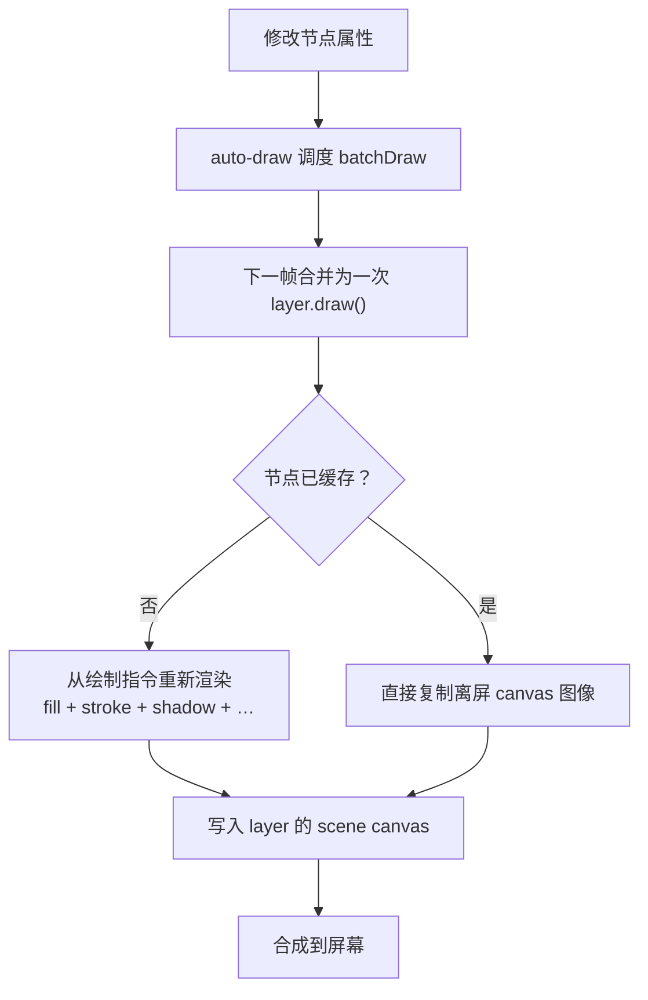

import { Canvas, Controls, Meta } from '@storybook/addon-docs/blocks';
import * as CachePerformance from './cache-performance.stories';

<Meta of={CachePerformance} name="Docs" />

# 缓存与性能

Konva 的所有性能优化都建立在两条原则上：**尽量少算**（每条绘制指令都有计算成本，成千上万条累加起来就会卡）和**尽量少画**（每次重绘既有计算成本，又有从内存到屏幕的数据搬运成本）。场景变慢时，问题几乎总是「画了不该画的东西」或「每个东西画得太贵」。

Konva 给你四个杠杆来对付这两类成本：**缓存**把复杂节点预渲染成一张离屏图像，后续绘制只复制图像；**分层**把频繁变化的内容和静态背景隔离到不同的 canvas；**批量绘制**把多次属性更新合并成一帧；**重绘控制开关**关闭不必要的工作（命中图、完美合成、高清缩放）。理解它们各自省的是什么成本，才知道该拉哪个杠杆。



| 名称 | 默认值 | 回查要点 |
| --- | --- | --- |
| `node.cache(config)` | — | 预渲染到离屏 canvas，后续绘制直接复制 |
| `node.clearCache()` | — | 清缓存；外观属性变更后需重新 `cache()` |
| `node.isCached()` | — | 返回当前是否已缓存 |
| `layer.batchDraw()` | — | 合并到下一帧；auto-draw 默认走此路径 |
| `layer.draw()` | — | 立即同步重绘；动画和频繁更新时勿用 |
| `listening` | `true` | `false` 跳过命中图，减少每帧绘制量 |
| `perfectDrawEnabled` | `true` | `false` 跳过 fill + stroke + opacity 的额外合成 |
| `Konva.pixelRatio` | 自动（Retina 约 2） | 设 `1` 牺牲清晰度换性能 |

## 绘制管线与两条原则

Konva 默认开启 auto-draw（`Konva.autoDrawEnabled = true`）：每次修改节点属性，引擎自动调度一次 `layer.batchDraw()`。`batchDraw()` 不立即绘制，而是把请求攒到下一个 `requestAnimationFrame`——同一帧内改了 100 个属性，它们合并成一次重绘。这就是「尽量少画」的第一道防线。

一个 Layer 在 DOM 里对应一个 `<canvas>` 元素（scene canvas），外加一个隐藏的等大 canvas 用于命中检测（hit canvas）。`layer.draw()` 同步重绘这两张 canvas；`layer.batchDraw()` 延迟到下一帧执行同样的工作，但合并同一帧内的多次请求。Stage 则把这些 layer 的 canvas 堆叠合成到屏幕上。

```ts
// auto-draw 默认开启：这三行在下一帧合并成一次重绘
rect.fill('red');
rect.x(100);
circle.scale({ x: 2, y: 2 });
// 不需要手动调用 batchDraw()

// 需要立即同步重绘时（调试、一次性更新）
layer.draw();

// 批量创建 / 修改大量节点时，可暂时关闭 auto-draw 避免无意义的调度
Konva.autoDrawEnabled = false;
// … 大批量属性更新 …
Konva.autoDrawEnabled = true;
layer.batchDraw();
```

两条优化原则贯穿后续所有技术：

- **尽量少算**——每个形状的每条绘制指令（fill、stroke、shadow、path）都有计算成本。复杂形状或大量形状每帧重复执行这些指令是性能下降的首要原因。缓存的核心价值就是「算一次，复用多次」。
- **尽量少画**——每次 `layer.draw()` 都会清空并重绘整张 canvas，再把数据从内存搬运到屏幕。即使内容没变，这个成本也存在。分层的核心价值就是「只重绘真正变化的那张 canvas」。

`draw()` 与 `batchDraw()` 的选择很简单：动画和频繁更新用 `batchDraw()`（合并到下一帧），需要立即看到结果时（调试、一次性渲染、离开页面前截屏）才用 `draw()`。在 `Konva.Animation` 的回调里**绝不调用** `draw()` 或 `batchDraw()`——引擎已经在每帧末尾自动 `batchDraw` 传入的图层，详见 [帧动画](?path=/docs/animation--docs)。

## 缓存

`cache()` 把一个节点（及其所有子节点）渲染到一张离屏 canvas 上。此后每次重绘该节点时，引擎不再逐条执行 fill、stroke、shadow 等绘制指令，而是直接把这张离屏图像复制到 layer 的 scene canvas——从「重新画」变成「贴图」。对于带阴影、描边或包含多个子节点的复杂形状，这一步通常能带来数倍的速度提升。

```ts
const star = new Konva.Star({
  numPoints: 5,
  innerRadius: 20,
  outerRadius: 40,
  fill: '#4f7cff',
  stroke: '#1e293b',
  strokeWidth: 2,
  shadowBlur: 10,
  shadowColor: 'rgba(15, 23, 42, 0.3)',
});
layer.add(star);

// 预渲染到离屏 canvas——此后绘制只复制图像
star.cache();

// 外观属性变了？先改再重新缓存，否则画面还是旧的
star.fill('#22c55e');
star.cache(); // 重新生成离屏图像

// 不再需要缓存时
star.clearCache();
```

缓存对绘制性能的影响可以用同步 `layer.draw()` 的耗时直接测量。下面的实例把 N 个带填充、描边和阴影的星形铺满舞台，切换「缓存」就能看到单帧绘制耗时的变化；调节「形状数量」可以看到缓存收益如何随复杂度增长。

<Canvas of={CachePerformance.Interactive} />
<Controls of={CachePerformance.Interactive} />

| 读者操作 | 可观察证据 |
| --- | --- |
| 开启「缓存」 | 绘制耗时显著下降（通常数倍） |
| 调大「形状数量」 | 未缓存时耗时线性增长；缓存后增长平缓 |
| 缓存 + 2000 个形状 | 耗时仍远低于未缓存 + 500 个形状 |
| 打开 Show code | 看到该 Canvas 实际执行的 `example.ts` |

**配置参数。** `cache()` 接受一个可选配置对象。对于基本形状（Rect、Circle、Star 等），缓存区域会自动检测；对于 Group 或自定义节点，你可能需要手动指定边界框。

| 参数 | 默认值 | 说明 |
| --- | --- | --- |
| `x` / `y` / `width` / `height` | 自动 | 手动指定缓存边界框；基本形状可省略 |
| `offset` | `0` | 向四周扩大缓存 canvas 的像素数，防止阴影 / 描边被裁切 |
| `pixelRatio` | `1` | 缓存图像清晰度；`2` 生成 2 倍尺寸的缓存（更清晰但更慢） |
| `drawBorder` | `false` | 设为 `true` 在缓存区域画红色边框，用于调试 |
| `hitCanvasPixelRatio` | `1` | 命中缓存 canvas 的清晰度 |

`offset` 是最常被忽略的参数。如果一个形状有 `shadowBlur: 10`，阴影会向外延伸约 10 像素；如果缓存区域不够大，阴影边缘会被裁掉。基本形状的缓存区域会自动检测，但发现裁切时用 `offset` 扩大即可：`node.cache({ offset: 20 })`。

**缓存的边界。** 缓存不是免费的午餐，它有自己的适用条件：

- **外观属性变了必须重新缓存。** 缓存是一张静态图像。修改 `fill`、`stroke`、`shadowBlur` 等影响外观的属性后，必须重新调用 `cache()` 生成新图像，否则画面不更新。位置类属性（`x`、`y`、`rotation`、`scale`）不需要重新缓存——它们变换的是整张缓存图像，就像移动、旋转、缩放一张图片。
- **缓存本身占内存。** 每个缓存节点都有一张离屏 canvas。缓存大量大尺寸节点会增加内存占用；不需要时用 `clearCache()` 释放。
- **滤镜依赖缓存。** Konva 的滤镜（模糊、颜色调整等）只作用于已缓存的节点——滤镜在缓存图像的像素上操作。使用滤镜前必须先 `cache()`，这是缓存与滤镜的交集，详见下一课 [滤镜](?path=/docs/filters--docs)。
- **外观每帧都在变的节点不适合缓存。** 缓存适合「画一次、复用多次」的场景（静态复杂形状、不常变化的大组）。如果节点的外观每帧都在变（颜色动画、形变），重新缓存的开销可能抵消收益——这时考虑减少形状复杂度或分层。

## 分层策略

每个 Konva Layer 都是一个独立的 `<canvas>` 元素。把场景按变化频率分成多个图层，就可以只重绘真正变化的那一层——静态背景画一次就不再动，动态前景每帧重绘。这就是「尽量少画」在架构层面的体现。

```ts
// 背景层：只画一次，之后不再重绘
const bgLayer = new Konva.Layer();
stage.add(bgLayer);
// … 添加背景形状、图片 …
bgLayer.draw(); // 手动渲染一次

// 动态层：每帧重绘
const dynamicLayer = new Konva.Layer();
stage.add(dynamicLayer);
// … 添加动画节点 …

// 动画里只 batchDraw 动态层——背景层不受影响
const anim = new Konva.Animation(() => {
  // 只更新动态层节点属性
}, dynamicLayer);
anim.start();
```

层数不是越多越好——每个 Layer 都有固定开销（额外的 canvas 元素、内存、合成成本）。保持「刚好把变化频率不同的内容分开」即可，通常 2–3 层足够。

**拖拽专用层。** 拖拽时所在图层每次 `dragmove` 都要重绘。把被拖形状临时 `moveTo` 到一个专用拖拽层，拖完再移回去，可以避免拖拽期间反复重绘整个主图层：

```ts
shape.on('dragstart', () => shape.moveTo(dragLayer));
shape.on('dragend', () => shape.moveTo(mainLayer));
```

**FastLayer。** `Konva.FastLayer` 是一个完全不维护命中图的图层——它的子节点无法响应事件，但绘制更快（彻底跳过 hit canvas）。适合纯视觉的静态背景。它的效果等价于 `new Konva.Layer({ listening: false })`，但语义更明确地宣告「这层不需要交互」。

## 重绘控制开关

除了缓存和分层，还有几个开关可以减少每次绘制的工作量。它们都是节点或全局属性，默认值偏向「视觉正确」而非「最快」，需要你按场景手动关闭。

**`listening: false`** — 跳过命中图。每个 Layer 都维护一张 hit canvas 用于事件检测。设置 `listening: false` 的节点不参与命中检测，也就不会被画进 hit canvas。对不需要事件的形状（背景、装饰、粒子）设为 `false`，可减少每帧的 hit canvas 绘制。整个图层都不需要事件时，直接在构造器里关闭：

```ts
const bg = new Konva.Rect({ /* … */, listening: false });
// 或在整个图层上关闭
const bgLayer = new Konva.Layer({ listening: false });
```

**`perfectDrawEnabled: false`** — 跳过完美合成。当一个形状同时有 fill、stroke 且 opacity 小于 1 时，Konva 默认做一次额外的离屏合成来保证描边不被半透明填充覆盖。这个合成是正确但有成本的。对视觉效果要求不严格的场景（粒子、密集图形），设为 `false` 可以省掉这次合成：

```ts
const star = new Konva.Star({
  fill: '#4f7cff',
  stroke: '#1e293b',
  opacity: 0.8,
  perfectDrawEnabled: false, // 跳过额外合成通道
});
```

**`Konva.pixelRatio = 1`** — 降低渲染分辨率。Konva 自动按设备像素比渲染（Retina 屏约为 2，即绘制 2×2 = 4 倍像素量）。这是保证清晰度的正确行为，但在性能敏感且可接受略低清晰度的场景（如大量粒子），全局设为 `1` 可将像素处理量降回 1 倍。必须在任何节点创建之前设置。

**`transformsEnabled: 'position'`** — 跳过变换计算。默认 `'all'` 会计算全部变换（位置 + 旋转 + 缩放）。如果你确定一个节点只移动、不旋转不缩放，设为 `'position'` 可让引擎跳过 `scale` 和 `rotation` 的矩阵计算：

```ts
// 只会移动、不会旋转或缩放的节点
const dot = new Konva.Circle({
  transformsEnabled: 'position',
  /* … */
});
```

## 最佳实践

- **先测量，再优化。** 性能优化的第一步是找到瓶颈：用开发者工具的 Performance 面板录制一段卡顿，看重绘耗时集中在哪些节点和图层。盲目加缓存或分层可能适得其反。
- **缓存复杂静态形状，不缓存简单动态形状。** 缓存的价值在于跳过复杂的绘制指令——一个纯色矩形缓存后几乎没有收益（它本来就不贵），一个带阴影、描边、多个子节点的 Group 缓存后收益显著。每帧都在变化外观的节点不适合缓存。
- **分层按变化频率，不按逻辑分组。** 把「每帧变」「偶尔变」「从不变」的内容分到不同图层。不要为了「逻辑上相关」把一个静态形状和一个动画形状放在同一层——这会让静态形状被迫每帧重绘。
- **批量操作时关闭 auto-draw。** 一次性创建或修改大量节点时，全局设 `Konva.autoDrawEnabled = false`，操作完再设回 `true` 并手动 `batchDraw()`，避免每次属性变化都触发无意义的重绘调度。
- **不用就销毁。** 移出场景的节点及时 `destroy()`，不再需要的缓存用 `clearCache()`。Konva 默认 `Konva.releaseCanvasOnDestroy = true`，会在 `stage.destroy()` 时释放 canvas 元素，避免 Safari 上的 canvas 内存泄漏。

## 常见问题

- **缓存后改了属性，画面没变。**
  缓存是一张静态图像。修改 `fill`、`stroke`、`shadowBlur` 等外观属性后必须重新 `cache()`。只有位置类属性（`x`、`y`、`rotation`、`scale`）能直接变换缓存图像，不需要重新缓存。
- **缓存的形状阴影或描边被裁切。**
  缓存区域不够大。基本形状会自动检测区域，但 Group 或手动指定边界框时需要用 `offset` 扩大：`node.cache({ offset: 20 })`。
- **场景里只有几十个简单形状，还是卡。**
  检查是否每个形状都开了 `shadowBlur` 或 `opacity < 1` 且 `perfectDrawEnabled` 为默认的 `true`——这些会触发额外的合成通道。对不需要事件的形状关掉 `listening` 和 `perfectDrawEnabled`。
- **拖拽大量形状时明显掉帧。**
  拖拽期间整个图层每次 `dragmove` 都重绘。把被拖形状 `moveTo` 到一个专用的拖拽图层，只重绘那一层；拖完再移回去。
- **Retina 屏上性能只有一半。**
  Retina 的 `pixelRatio` 约为 2，像素处理量是 4 倍。如果可以接受略低的清晰度，在创建任何节点之前设 `Konva.pixelRatio = 1`。

## 总结回顾

摘要：

Konva 的性能优化围绕「尽量少算、尽量少画」两条原则展开。绘制管线上，每次属性变化触发 auto-draw 调度的 `batchDraw()`，它把同一帧内的多次更新合并到下一个 `requestAnimationFrame` 执行一次同步 `draw()`——重绘 scene canvas 和 hit canvas。缓存（`cache()`）把复杂节点预渲染成离屏图像，让重绘从「逐条执行绘制指令」变成「复制图像」，对外观复杂的静态形状收益最大；外观属性变更后需重新缓存，位置类属性不需要，滤镜也依赖缓存先建立。分层把不同变化频率的内容隔离到各自的 canvas，只重绘真正变化的那一层；`listening:false`、`perfectDrawEnabled:false`、`pixelRatio=1` 等开关则分别关闭命中图、完美合成和高清缩放。先测量找到瓶颈，再针对性地拉杠杆，比盲目优化更有效。

一句话：

> 缓存把「画」变成「贴图」，分层让不变的图层不重绘，两者都在减少每帧的实际绘制量。

知识要点：

- auto-draw 如何把多次属性变化合并成一次重绘？`batchDraw()` 和 `draw()` 有何区别？
- `cache()` 省的是哪种成本？哪些属性变更后需要重新缓存，哪些不需要？
- `cache()` 的 `offset` 和 `pixelRatio` 参数各解决什么问题？
- 为什么分层要按变化频率而不是逻辑关系？FastLayer 与 `listening:false` 有何关系？
- `listening`、`perfectDrawEnabled`、`pixelRatio` 各自关闭的是什么工作？

## 参考资料

- [All Performance Tips（全部性能技巧）](https://konvajs.org/docs/performance/All_Performance_Tips.html)
- [Konva.Node API — cache / clearCache / isCached](https://konvajs.org/api/Konva.Node.html)
- [Konva.Layer API — batchDraw / listening / clearBeforeDraw](https://konvajs.org/api/Konva.Layer.html)
- [Konva 全局配置 — pixelRatio / autoDrawEnabled / releaseCanvasOnDestroy](https://konvajs.org/api/Konva.html)
