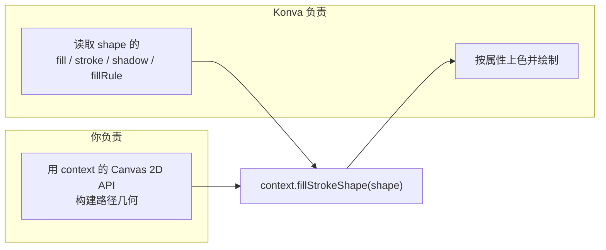

import { Canvas, Controls, Meta } from '@storybook/addon-docs/blocks';
import * as CustomShape from './custom-shape.stories';

<Meta of={CustomShape} name="Docs" />

# 自定义形状

Konva 的内置形状（矩形、圆、线、星、路径……）覆盖了常见几何，但当你需要它们都画不出的图形——齿轮、心形、自定义图标、数据可视化里的特殊标记——就用 `Konva.Shape` 配一个 `sceneFunc`。你在 `sceneFunc` 里用原生 Canvas 2D API 构建路径，再调一句 `context.fillStrokeShape(shape)`，Konva 就接管填充、描边、阴影、命中检测和变换。一句话：几何归你画，样式和系统集成归 Konva 管。

事实上所有内置形状（`Rect`、`Circle`、`Line`…）本身就是 `Konva.Shape` 的子类——自定义形状就是「自己写一个内置形状那样的 `sceneFunc`」。`sceneFunc` 的几何与 `fillStrokeShape` 的样式是两个独立职责，下图把这条分工线一次画清：



自定义形状的关键要素（共享默认值：`x`/`y` 为 `0`、`fill` 与 `stroke` 不设）：

| 要素 | 含义 | 默认 / 说明 |
| --- | --- | --- |
| `Konva.Shape` | 通用形状，所有内置形状的父类 | 提供 `sceneFunc` 后即接管绘制 |
| `sceneFunc(context, shape)` | 你提供的绘制函数 | 必填；不提供则什么都不画 |
| `context` | `Konva.Context` | 包装原生 `CanvasRenderingContext2D`，多了 `fillStrokeShape` 等 |
| `context.fillStrokeShape(shape)` | 按 shape 属性上色 | 必调；漏了 `fill`/`stroke` 都不生效 |
| `hitFunc(context, shape)` | 自定义命中区域 | 可选；省略时复用 `sceneFunc` 的几何 |
| `fillRule` | 填充规则 | 默认 `'nonzero'`；多子路径镂空用 `'evenodd'` |

## sceneFunc 的契约

`Konva.Shape` 的 `config` 接收一个 `sceneFunc(context, shape)`，它决定这个形状长什么样。两个参数：

- `context` 是 `Konva.Context`——它包装原生 2D context，所以 `beginPath()`、`moveTo()`、`lineTo()`、`arc()`、`closePath()`、`bezierCurveTo()` 等全部能用，行为与原生一致；额外还有 Konva 专用的 `fillStrokeShape(shape)`、`fillShape(shape)`、`strokeShape(shape)`。
- `shape` 是这个形状实例本身，用来读取几何参数（`shape.width()`、`shape.getAttr('teeth')` 等）。

契约只有三步，缺一不可：

1. 用 `context` 的 Canvas 2D API 构建路径；
2. 画在 `(0, 0)`——不要手动加 x/y，平移、旋转、缩放由 Konva 按 shape 的 `x`/`y`/`rotation`/`scale` 属性应用；
3. 最后调 `context.fillStrokeShape(shape)`，让 Konva 读取 shape 的 `fill`/`stroke`/`strokeWidth`/`shadow*`/`fillRule` 并上色。

最小范例——一个三角形（注意 `sceneFunc` 里没有任何颜色，颜色全在 shape 配置上）：

```ts
const triangle = new Konva.Shape({
  sceneFunc(context, shape) {
    context.beginPath();
    context.moveTo(20, 50);
    context.lineTo(220, 80);
    context.lineTo(100, 150);
    context.closePath();
    context.fillStrokeShape(shape); // 关键：让 Konva 应用 fill / stroke
  },
  fill: '#00D2FF',
  stroke: 'black',
  strokeWidth: 4,
});
layer.add(triangle);
```

为什么不直接在 `sceneFunc` 里写 `context.fillStyle = '...'` 然后 `context.fill()`？因为那样会绕过 shape 的 `fill`/`stroke`/`fillEnabled`/渐变/图案等属性，失去 Konva 的样式系统，而且命中检测也依赖 `fillStrokeShape` 写入的命中图。把颜色留在 shape 属性上，`fillStrokeShape` 一句把它们全部桥接过来——这就是「几何归你管，样式归 Konva 管」。

## 用 Canvas 2D API 构建几何

下面这个实例画一个 Konva 没有内置的齿轮。齿轮的几何由 `sceneFunc` 里的循环生成：每齿四个顶点（谷入 → 齿顶起 → 齿顶止 → 谷出），绕中心一圈。中心孔是第二个子路径，配合 shape 的 `fillRule: 'evenodd'` 镂空。

<Canvas of={CustomShape.Interactive} />
<Controls of={CustomShape.Interactive} />

观察要点：

- `sceneFunc` 里只有路径几何（`moveTo`/`lineTo`/`arc`/`closePath`），没有一处颜色；
- 齿数和孔径写入 shape 的自定义属性，`sceneFunc` 用 `shape.getAttr()` 读回——展示第二个参数 `shape` 的用途；
- `fill`/`stroke`/`fillRule` 设在 shape 配置上，由 `fillStrokeShape` 桥接。

| 读者操作 | 可观察证据 |
| --- | --- |
| 调「齿数」 | `sceneFunc` 的循环次数改变，齿轮边数随之增减；读数「路径顶点 = 齿数 × 4」同步 |
| 调「中心孔占比」到 0 | 第二个子路径消失，读数「子路径」从 2 变 1，齿轮变实心 |
| 调「中心孔占比」大于 0 | 中心出现镂空孔；外轮廓与孔之间的区域被填充，孔内透明 |
| 打开 Show code | 看到该 Canvas 实际执行的 `example.ts` |

齿轮 `sceneFunc` 的核心（每齿四点绕中心，画在 `(0, 0)`）：

```ts
sceneFunc(context, shape) {
  const teeth = shape.getAttr('teeth');
  const outerR = shape.getAttr('outerRadius');
  const valleyR = shape.getAttr('valleyRadius');
  const slice = (Math.PI * 2) / teeth;

  context.beginPath();
  for (let i = 0; i < teeth; i += 1) {
    const a = i * slice;
    // 每齿四点的角度分数与半径：谷→顶→顶→谷
    const fr = [0, 0.25, 0.5, 0.75];
    const radii = [valleyR, outerR, outerR, valleyR];
    for (let j = 0; j < 4; j += 1) {
      const angle = a + slice * fr[j];
      const x = Math.cos(angle) * radii[j];
      const y = Math.sin(angle) * radii[j];
      if (i === 0 && j === 0) context.moveTo(x, y);
      else context.lineTo(x, y);
    }
  }
  context.closePath();
  context.fillStrokeShape(shape); // 上色交给 Konva
}
```

中心孔的镂空靠两件事配合：`context.arc(0, 0, holeR, ...)` 追加了第二个子路径，shape 的 `fillRule: 'evenodd'` 让「外轮廓与孔之间」填色、「孔内」透明。把「孔占比」调到 0，第二个子路径就不追加，齿轮变回实心单路径——这正说明 `sceneFunc` 可以按参数动态决定路径结构。

## 命中区域

`sceneFunc` 除了画可见图形，还同时定义了命中区域：如果不单独设 `hitFunc`，Konva 用 `sceneFunc` 的几何做点击 / 触摸命中检测（`fillStrokeShape` 会把同样的路径写入隐藏的命中 canvas）。所以上面的齿轮天然可点。

当你需要与可见图形不同的命中区——比如让一个透明小图标有更大的点击热区，或命中只看一个矩形外框——就提供 `hitFunc(context, shape)`。它的签名和 `sceneFunc` 一样，但只画命中几何，同样要调 `context.fillStrokeShape(shape)`。`hitFunc` 的完整用法（自定义命中、`drawHitFromCache`、命中性能）在「[命中检测](?path=/docs/hit-detection--docs)」课展开。

## 最佳实践

- **`sceneFunc` 要纯**：只读参数、只画路径，不要在里面移动节点、绑定事件或改全局状态——它每秒可能跑很多次。
- **不要在 `sceneFunc` 里创建对象**：图片、渐变、大数组都提到外面缓存，函数内只引用；否则频繁分配会拖慢重绘。
- **让 Konva 管变换**：画在 `(0, 0)`，用 shape 的 `x`/`y`/`rotation`/`scale` 定位和变形，不要在 `context` 里手动 `translate`/`rotate`——否则会与 Konva 自己的变换叠加。
- **用 `fillStrokeShape` 而非手动 `fill()`/`stroke()`**：前者保留 `fillEnabled`/`strokeEnabled` 开关、渐变、图案、阴影和命中图。
- **复杂样式或画图片时自定义 `hitFunc`**：让命中区简单可控，避免命中图与可见图不一致。

## 常见问题

- 形状完全不显示，或只看到路径不上色
  先检查 `sceneFunc` 最后有没有调 `context.fillStrokeShape(shape)`。漏了它，`fill`/`stroke` 都不会生效——这是自定义形状最高频的坑。三角形最小范例里的那一句就是它。
- 在 `sceneFunc` 里手写 `context.fillStyle = ...; context.fill()` 后，shape 的 `fill` 属性好像不生效
  这是预期：手动 fill 绕过了 Konva 的样式系统。要让 shape 的 `fill`/`stroke`/渐变/图案生效，删掉手写填色，改用 `context.fillStrokeShape(shape)`。
- 自定义形状 `cache()` 后命中区域偏移或不准
  `cache()` 依据包围盒裁剪缓存画布，自定义形状若没有可靠的尺寸属性（`width`/`height`），缓存盒可能对不齐几何。提供自定义 `hitFunc` 让命中独立于缓存盒，或确保 shape 的 `width`/`height` 包住你的几何。

## 总结回顾

摘要：

用 `Konva.Shape` + `sceneFunc` 绘制任意图形，契约是三步：在 `sceneFunc(context, shape)` 里用 `context`（包装原生 2D context 的 `Konva.Context`）构建路径、画在 `(0, 0)`、最后调 `context.fillStrokeShape(shape)` 让 Konva 按 shape 的 `fill`/`stroke`/`fillRule` 上色。颜色留在 shape 属性上，`sceneFunc` 不碰颜色——`fillStrokeShape` 是几何与样式之间的桥。齿轮实例展示了用循环生成 Konva 没有内置的几何（每齿四点绕中心），并用第二个子路径 + `fillRule:'evenodd'` 镂空中心孔。命中检测默认复用 `sceneFunc`，需要不同热区时提供 `hitFunc`。

一句话：

> `sceneFunc` 用 Canvas 2D API 画路径，`context.fillStrokeShape(shape)` 用 shape 属性上色——几何归你管，样式归 Konva 管。

知识要点：

- `sceneFunc(context, shape)` 的两个参数分别是什么？`context` 与原生 2D context 是什么关系？
- 为什么必须调 `context.fillStrokeShape(shape)`？漏了会怎样？
- 为什么自定义形状要画在 `(0, 0)`，而不是直接写绝对坐标？
- 齿轮的中心孔是怎么用第二个子路径 + `fillRule` 实现的？
- 不设 `hitFunc` 时，命中区域由什么决定？

## 参考资料

- [Konva API — Konva.Shape](https://konvajs.org/api/Konva.Shape.html)
- [Konva API — Konva.Context](https://konvajs.org/api/Konva.Context.html)
- [Konva 教程 — Custom Shape（自定义形状）](https://konvajs.org/docs/shapes/Custom.html)
