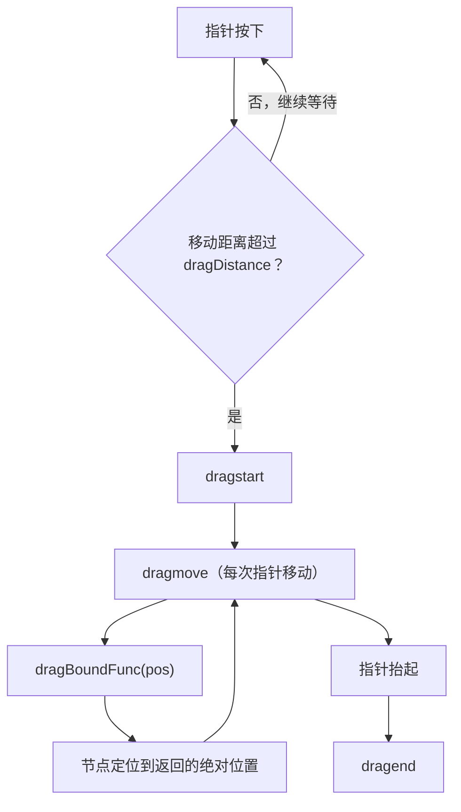

import { Canvas, Controls, Meta } from '@storybook/addon-docs/blocks';
import * as DragAndDrop from './drag-and-drop.stories';

<Meta of={DragAndDrop} name="Docs" />

# 拖拽

Konva 的拖拽是一个内置开关：给任意 Node 设置 `draggable: true`，它就会自动跟随鼠标和触摸指针移动，无需自己监听 `mousemove` 或改坐标。围绕这个开关，Konva 提供了三个拖拽事件（`dragstart` / `dragmove` / `dragend`）标记拖拽的生命周期，以及一个位置拦截函数 `dragBoundFunc`，在节点定位之前改写指针给出的位置，用来实现锁轴、限定区域和网格吸附。

理解拖拽的关键是看清「位置在哪里被拦截」：指针移动给出一个目标位置，`dragBoundFunc` 先于节点定位拦截它并返回允许的位置，随后 `dragmove` 才触发。把拦截点放在节点定位之前，意味着约束不会产生可见的跳动。



| 名称 | 默认值 | 说明 |
| --- | --- | --- |
| `draggable` | `false` | 节点是否可拖拽；`Stage` 也可设为 `draggable`，拖动整个坐标系 |
| `Konva.dragDistance` | `3` | 指针移动超过此像素数才进入拖拽；可在节点上用 `dragDistance` 单独覆盖 |
| 拖拽事件 | — | `dragstart`（开始）、`dragmove`（移动中）、`dragend`（结束） |
| `dragBoundFunc(pos)` | — | `pos` 与返回值都是**绝对位置** `{ x, y }`；返回值即节点最终位置 |
| 控制方法 | — | `startDrag()`、`stopDrag()`、`isDragging()` 编程式操控拖拽 |

## 启用拖拽

开启拖拽有两种等价写法：在构造配置里写 `draggable: true`，或创建后调用 `.draggable(true)`。两者都会自动支持桌面鼠标与移动端触摸。

```ts
import Konva from 'konva';

// 配置写法
const circle = new Konva.Circle({
  x: 80,
  y: 80,
  radius: 30,
  fill: '#4f7cff',
  draggable: true,
});

// 方法写法（等价）
circle.draggable(true);

// 取消拖拽
circle.draggable(false);
```

下面是一个可交互的运行实例：圆形默认可自由拖动。用下方控件切换「约束模式」与「网格步长」，再拖动圆形，就能观察本课全部机制——拖拽事件、锁轴、限定区域、网格吸附。

<Canvas of={DragAndDrop.Interactive} />
<Controls of={DragAndDrop.Interactive} />

| 读者操作 | 可观察证据 |
| --- | --- |
| 保持「自由」并拖动圆形 | 圆形跟随指针，读数「位置」实时变化，「状态」从空闲变为拖拽中 |
| 切到「仅水平」/「仅竖直」 | 圆形只能沿单一方向移动，橙色虚线标出锁定轴 |
| 切到「限定区域」 | 圆形无法拖出绿色虚线矩形 |
| 切到「网格吸附」 | 圆形吸附到网格交点；调节「网格步长」改变吸附密度 |
| 打开 Show code | 看到该 Canvas 实际执行的 `example.ts` |

把 `draggable` 设到 `Stage` 上，整个坐标系（连同所有图层和节点）会跟随指针一起平移，适合做可平移的画布。注意此时所有子节点的绝对位置都在变化，但相对 `Stage` 的本地坐标不变——区分这两种坐标在写 `dragBoundFunc` 时尤其重要。

## 拖拽事件

拖拽有三个事件，用 `on()` 绑定，触发顺序固定为 `dragstart` → `dragmove`（多次）→ `dragend`。回调里 `e.target` 和 `this` 都指向被拖拽的节点，可随时读 `x()` / `y()`。

```ts
circle.on('dragstart', (e) => {
  // e.target === circle，这里可以做高亮、记录起始位置等
});

circle.on('dragmove', (e) => {
  console.log('当前位置', e.target.x(), e.target.y());
});

circle.on('dragend', (e) => {
  console.log('拖拽结束', e.target.position());
});

// 一次绑定多个事件
circle.on('dragstart dragend', () => { /* ... */ });
```

`dragDistance` 决定何时才算「开始拖拽」。指针按下后，只有移动距离超过 `Konva.dragDistance`（默认 `3` 像素）才会触发 `dragstart`。这个阈值把点击和拖拽区分开：小于阈值的移动不会进入拖拽，仍会触发正常的 `click` 事件。需要更灵敏或更迟钝的拖拽时，设全局 `Konva.dragDistance = 6`，或在单个节点上 `circle.dragDistance(8)`。

上方实例的读数「状态」字段就由 `dragstart` / `dragend` 驱动：拖动圆形时它变成「拖拽中」，松手后回到「空闲」，可以直观看到事件触发的时机。

## 约束与对齐

约束的本质是拦截拖拽位置。Konva 提供两个拦截点：`dragBoundFunc` 在节点定位**之前**改写位置（声明式），`dragmove` 回调在定位**之后**修正（命令式）。两者可以独立使用，也可以配合。

约束的常见类型都可归结为「给定目标位置 `pos`，返回允许的位置」：

| 约束类型 | 做法 |
| --- | --- |
| 锁定单轴 | 固定另一轴为当前值 |
| 限定区域 | 用上下限夹取 `pos` |
| 网格吸附 | 把 `pos` 舍入到步长倍数 |

### dragBoundFunc：位置拦截

`dragBoundFunc` 接收一个参数 `pos`，它是节点**将被移动到的绝对位置** `{ x, y }`；返回值同样是绝对位置，节点最终就被定位到这里。在节点定位之前调用，因此约束不会让节点先跳再修正。回调内的 `this` 指向被拖节点；下面用闭包里的 `circle` 代替，效果相同但类型更清晰。

```ts
// 仅水平：x 跟随指针，y 锁定在当前位置
circle.dragBoundFunc((pos) => ({
  x: pos.x,
  y: circle.absolutePosition().y, // absolutePosition() 返回当前绝对位置
}));

// 限定在矩形区域内
circle.dragBoundFunc((pos) => ({
  x: clamp(pos.x, left, right),
  y: clamp(pos.y, top, bottom),
}));
```

把上方实例切到「仅水平」「仅竖直」或「限定区域」模式，拖动圆形即可看到 `dragBoundFunc` 的效果：橙色虚线标出锁定轴，绿色虚线矩形标出区域边界，圆形始终无法越界。`absolutePosition()` 返回的是**当前**绝对位置（移动前的值），所以锁定轴时取的就是被锁定的那个坐标。

### 网格吸附

吸附即对齐：把 `pos` 舍入到网格步长的整数倍，节点就会落在网格交点上。

```ts
const step = 40;
circle.dragBoundFunc((pos) => ({
  x: Math.round(pos.x / step) * step,
  y: Math.round(pos.y / step) * step,
}));
```

把上方实例切到「网格吸附」并调节「网格步长」，圆形会在拖动中吸附到网格交点。吸附可以和限定区域叠加——先用区域夹取，再对夹取后的值做舍入，就得到「区域内、对齐网格」的位置。

### dragmove 回调修正

`dragBoundFunc` 之外，也可以在 `dragmove` 里直接调用 `x()` / `y()` 强制改位置。这种做法在节点定位**之后**执行，适合需要读取其他节点状态、做碰撞检测等复杂逻辑的场景。

```ts
// 限定在区域内（dragmove 版本）
circle.on('dragmove', () => {
  if (circle.x() < left) circle.x(left);
  if (circle.x() > right) circle.x(right);
  if (circle.y() < top) circle.y(top);
  if (circle.y() > bottom) circle.y(bottom);
});
```

两种拦截点的取舍：优先用 `dragBoundFunc`，因为它在节点定位前拦截，读者看到的始终是约束后的位置，不会出现先跳到目标再被拉回的闪烁；只有当约束逻辑依赖多个节点的实时状态、或需要更灵活的控制流时，才改用 `dragmove` 修正。

## 最佳实践

- **优先 `dragBoundFunc`，次选 `dragmove`。** 前者在定位前拦截、不闪烁，适合锁轴、区域、吸附这类纯位置约束；后者适合需要碰撞检测或读取其他节点状态的复杂逻辑。
- **分清绝对位置与相对位置。** `dragBoundFunc` 的 `pos` 与返回值都是绝对位置。当被拖节点位于有旋转或缩放的 `Group` 内时，绝对位置和它相对父级的 `x()` / `y()` 不一致，按相对坐标返回会导致节点跳变或飞走。
- **`dragmove` 是高频回调，保持轻量。** 它每次指针移动都触发，避免在其中做重计算或重建节点；读位置、改样式之外的工作尽量延后到 `dragend`。
- **桌面与触摸一致。** `draggable` 自动支持鼠标和触摸事件，无需为触屏单独写 `touchmove` 逻辑。

## 常见问题

- **节点在 `Group` 内拖拽时一拖就飞走。** `dragBoundFunc` 返回了相对父级的坐标。它必须返回**绝对位置**；需要相对坐标时，用 `node.getRelativePointerPosition()` 或在回调里自行换算，但返回值仍是绝对位置。
- **按住节点点了半天没进入拖拽。** 指针移动距离未超过 `dragDistance`（默认 `3` 像素）。需要更灵敏的拖拽就调小 `Konva.dragDistance` 或节点级 `dragDistance`；阈值之内的操作仍会触发 `click`。
- **拖拽结束后节点的 `click` 不触发。** 一旦 `dragstart` 触发，本次按压就被视为拖拽，结束时只触发 `dragend`，不再触发 `click`。需要「点击」语义时，把逻辑放到 `dragend` 里，或用移动距离判断是否真的发生了拖拽。

## 总结回顾

摘要：

Konva 拖拽由 `draggable` 开关、三个拖拽事件和 `dragBoundFunc` 拦截函数组成。`draggable: true` 让节点自动跟随指针，`dragstart` / `dragmove` / `dragend` 标记拖拽的生命周期，`dragDistance` 用一个像素阈值区分点击和拖拽。约束与对齐通过拦截位置实现：`dragBoundFunc` 在节点定位前改写绝对位置，是锁轴、限定区域和网格吸附的首选；`dragmove` 回调在定位后修正，适合更复杂的逻辑。两者都建立在「位置可被拦截」这一共同模型上。

一句话：

> `dragBoundFunc` 在节点定位之前拦截绝对位置并返回允许值，所以约束不会闪烁。

知识要点：

- 怎样开启和关闭一个节点的拖拽？
- `dragstart` / `dragmove` / `dragend` 的触发顺序和 `dragDistance` 的作用是什么？
- `dragBoundFunc` 的 `pos` 参数和返回值分别是什么坐标类型？
- 如何用 `dragBoundFunc` 实现锁轴、限定区域和网格吸附？
- `dragBoundFunc` 与 `dragmove` 回调修正的区别与取舍？

## 参考资料

- [Drag and Drop（基础教程）](https://konvajs.org/docs/drag_and_drop/Drag_and_Drop.html)
- [Drag Events（拖拽事件）](https://konvajs.org/docs/drag_and_drop/Drag_Events.html)
- [Simple Drag Bounds（拖拽约束）](https://konvajs.org/docs/drag_and_drop/Simple_Drag_Bounds.html)
- [Drag a Stage（拖拽整个舞台）](https://konvajs.org/docs/drag_and_drop/Drag_a_Stage.html)
- [Konva.Node API（draggable / dragBoundFunc / dragDistance）](https://konvajs.org/api/Konva.Node.html)
