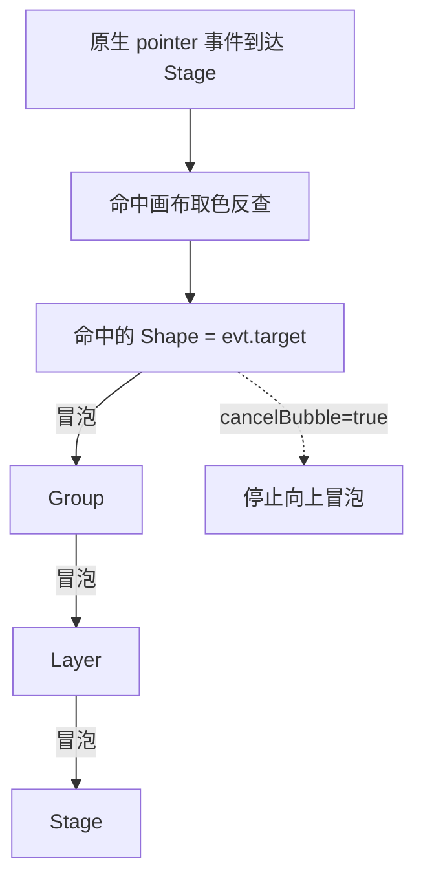

import { Canvas, Controls, Meta } from '@storybook/addon-docs/blocks';
import * as Events from './events.stories';

<Meta of={Events} name="Docs" />

# 事件系统

Konva 把所有图形画在 `<canvas>` 上，而 `<canvas>` 是一张「画完即忘」的位图——里面的圆和矩形并不是 DOM 节点，浏览器原生的事件系统没法直接把 `click` 分发给某个图形。Konva 的做法是：为每个 Layer 额外维护一张按颜色编码的「命中画布（hit canvas）」；当原生指针事件到达 Stage 时，Konva 取指针位置的颜色反查出被命中的图形，再沿节点树（Shape → Group → Layer → Stage）把事件一层层冒泡上去。这套机制让 Canvas 图形可以像 DOM 元素一样用 `.on('click', ...)` 绑定、冒泡和委托。

理解这一点就能预测本课所有结论：事件不是浏览器给的，是 Konva 在命中画布上「认出」目标后合成出来的；传播路径严格跟随节点树，与绘制顺序、`zIndex` 无关；凡是会破坏「命中画布能认出这个图形」的设置（`listening: false`、不可见、透明区域），都会让事件无法触发。



核心 API 与默认值：

| 能力 | 入口 | 默认值 / 关键约定 |
| --- | --- | --- |
| 绑定 | `node.on(eventStr, handler)` | `eventStr` 支持空格分隔多个事件名，支持命名空间 `click.foo` |
| 解绑 | `node.off(eventStr)` | 传命名空间 `.foo` 可批量解绑 |
| 主动触发 | `node.fire(eventType, evt, bubble)` | 第三参 `bubble` 为 `true` 才会冒泡，默认不冒泡 |
| 命中开关 | `node.listening(boolean)` | 默认 `true`；`false` 时节点连同子节点移出命中图 |
| 取消冒泡 | `evt.cancelBubble = true` | 在处理器内设置，阻止继续向父节点传播 |
| 默认行为 | `node.preventDefault(boolean)` | 默认 `true`，会阻止浏览器对指针移动 / 轻触的默认行为 |

## 绑定与事件对象

用 `on()` 绑定事件，第一个参数是事件名字符串（空格分隔可同时绑多个），第二个参数是处理器。处理器拿到的不是原生事件，而是一个 Konva 事件对象 `KonvaEventObject`，原生事件挂在它的 `.evt` 上：

```ts
circle.on('click', (e) => {
  e.target;        // 实际命中的节点（Shape 或 Stage），冒泡全程不变
  e.currentTarget; // 当前正在执行处理器的节点，随冒泡逐层变化
  e.evt;           // 原生浏览器事件（MouseEvent / TouchEvent / PointerEvent）
  e.type;          // 事件名字符串，如 'click'
  e.cancelBubble;  // 设为 true 阻止继续冒泡
});
```

`target` 与 `currentTarget` 的区别是本课最关键的一组概念：`target` 是「被命中的那个图形」，在一次点击的整条冒泡链里始终是同一个；`currentTarget` 是「当前这个处理器挂在哪个节点上」，随事件一层层向上时不断变化。理解了这一点，下面的冒泡、委托和 `cancelBubble` 都能提前预测结果。

同一个处理器可以同时绑多个事件名，常用来兼容鼠标与触摸：

```ts
// 鼠标点触发 click，手指点触发 tap，两种输入都走同一处理器
shape.on('click tap', handler);

// 命名空间：可按名字批量解绑，不影响其它处理器
shape.on('click.menu', a);
shape.on('click.nav', b);
shape.off('.menu');   // 只移除 menu 命名空间下的绑定
```

## 事件冒泡与 cancelBubble

Konva 的事件从最深的命中的 Shape 开始触发，然后沿父链一路冒泡到 Stage，与 DOM 事件传播方向一致。下面这个实例把一个 Circle 嵌套在 Group 里、再把一个 Rect 直接挂在 Layer 上，并在 Circle、Group、Layer、Stage、Rect 上各挂一个 `click` 处理器。点击不同位置，观察「目标」与「冒泡路径」如何变化。

<Canvas of={Events.Interactive} />
<Controls of={Events.Interactive} />

| 读者操作 | 可观察证据 |
| --- | --- |
| 点击蓝色圆 | 冒泡路径 `Circle → Group → Layer → Stage`，触发数 4 |
| 点击右侧矩形 | 冒泡路径 `Rect → Layer → Stage`，触发数 3（少一级 Group） |
| 点击空白区域 | 目标为 `Stage`，触发数 1（没有命中的 Shape，直接落在 Stage 上） |
| 打开「取消冒泡」后再点圆 | 冒泡路径只剩 `Circle`，触发数 1——目标处理器设置了 `evt.cancelBubble = true`，向上的 Group / Layer / Stage 处理器都不再执行 |
| 关闭「Circle 监听」后再点圆 | 圆被移出命中图，点击位置穿透到 `Stage`，目标变成 `Stage`，触发数 1 |
| 打开 Show code | 看到该 Canvas 实际执行的 `example.ts` |

读数最能说明问题：同一个点击，「目标 target」一行在整条冒泡链里始终不变，「冒泡路径」一行则把 `currentTarget` 的逐层变化完整列了出来。`cancelBubble` 和 `listening` 两个开关，一个裁掉向上的传播、一个让节点根本不进入命中图——效果都直接反映在触发数上。

在目标处理器里设置 `evt.cancelBubble = true` 即可阻止继续冒泡，这是 Konva 里等价于 DOM `stopPropagation()` 的做法：

```ts
circle.on('click', (e) => {
  e.cancelBubble = true;   // Group / Layer / Stage 的 click 处理器都不会再触发
});
```

注意一组**不冒泡**的事件：`mouseenter`、`mouseleave`、`pointerenter`、`pointerleave`（以及 `touchenter`、`touchleave`）。它们只在指针真正进入 / 离开某个图形自身时触发，不会向父节点传播。这与 DOM 里 `mouseenter`/`mouseleave` 的语义一致，适合做「悬停高亮单个图形」而不想惊动父容器的场景；要做「跨子元素切换都响应」的悬停效果，用会冒泡的 `mouseover`/`mouseout` 更合适。

## 监听开关 listening

`listening` 控制节点是否参与命中检测，默认 `true`。把它设为 `false`，节点连同其所有子节点都会被移出命中图，指针事件直接「穿透」到背后的其它图形或 Stage：

```ts
overlay.listening(false);   // 覆盖层不再拦截点击，事件透到下面的图形
// 等价的 setter
overlay.setListening(false);
```

`listening` 还会受祖先影响：一个 `listening: true` 的节点，只要任一祖先 `listening: false`，它实际上也收不到事件。用 `isListening()`（注意不是 `listening()`）判断这个「考虑祖先之后的真实状态」：

```ts
node.listening();    // 读 / 写本节点自身的 listening 配置
node.isListening();  // 综合祖先之后的实际命中能力
```

实例里关掉「Circle 监听」后点击圆的区域，目标直接变成 `Stage`——这就是 `listening: false` 让节点「事件穿透」的可观察证据。更多关于命中画布如何取舍性能与精度的内容在「[命中检测](?path=/docs/hit-detection--docs)」一课展开。

## 事件名清单

Konva 支持的事件名按输入来源分成三组（鼠标 / 触摸 / 指针），外加拖拽、变换和属性变化。所有事件都用同一个 `on()` 绑定，处理器都拿到 `KonvaEventObject`。

| 类别 | 事件名 | 触发时机 |
| --- | --- | --- |
| 鼠标 | `mouseover` `mouseout` `mousemove` `mousedown` `mouseup` `wheel` `click` `dblclick` `contextmenu` | 鼠标输入；`click` 只在用鼠标时触发 |
| 鼠标（不冒泡） | `mouseenter` `mouseleave` | 指针进入 / 离开图形自身，不向父节点传播 |
| 触摸 | `touchstart` `touchmove` `touchend` `touchcancel` `tap` `dbltap` | 触摸输入；`tap` 只在用手指时触发 |
| 触摸（不冒泡） | `touchenter` `touchleave` | 触摸点进入 / 离开图形自身 |
| 指针（统一） | `pointerdown` `pointermove` `pointerup` `pointercancel` `pointerover` `pointerout` `pointerclick` `pointerdblclick` | 鼠标、触摸、手写笔统一触发 |
| 指针（不冒泡） | `pointerenter` `pointerleave` | 指针进入 / 离开图形自身 |
| 拖拽 | `dragstart` `dragmove` `dragend` | 节点被拖拽时，详见「[拖拽](?path=/docs/drag-and-drop--docs)」 |
| 变换 | `transformstart` `transform` `transformend` | Transformer 交互，详见「[变换器](?path=/docs/transformer--docs)」 |
| 属性变化 | `xChange` `yChange` `widthChange` … | 任意属性 `<名>Change`，`setAttrs` 改值时触发 |
| 自定义 | 任意字符串 | 用 `fire()` 主动触发，名称自定 |

要同时兼容鼠标和触摸的「点击」，要么绑两个事件名 `on('click tap', handler)`，要么用统一的指针事件 `on('pointerclick', handler)`。`click` 不会响应手指、`tap` 不会响应鼠标，两者并不互通。

## 主动触发与自定义事件

`fire()` 让你用代码主动触发一个事件，既可以触发内置事件（如 `click`），也可以触发任意命名的自定义事件。第三个参数控制是否冒泡，默认 `false`：

```ts
circle.fire('click');           // 只触发 circle 自身的 click 处理器，不冒泡
circle.fire('click', {}, true); // 触发后继续冒泡到 Group / Layer / Stage
circle.fire('save');            // 自定义事件：需要先用 circle.on('save', ...) 绑定
```

属性变化事件也走同一套机制。任何通过 `setAttrs` / `x()` / `width()` 等方式改变属性，都会触发对应名称的 `'<属性>Change'` 事件，常用来在属性变化时联动其它逻辑：

```ts
circle.on('radiusChange', (e) => {
  console.log(e.oldVal, '→', e.newVal);   // 旧值与新值（属性变化事件特有）
});
circle.radius(50);   // 触发 radiusChange
```

## 键盘焦点

Konva 不内置键盘事件。Stage 在 DOM 里是一个普通 `<div>`，它默认拿不到键盘焦点，也没有 `keydown` / `keyup` 之类的 Konva 事件名。需要键盘交互时，给 Stage 的容器（或页面上某个可聚焦元素）设置 `tabindex`，再用原生 DOM 监听器自行处理：

```ts
const container = stage.container();
container.tabIndex = 1;          // 让容器可聚焦
container.addEventListener('keydown', (e) => {
  if (e.key === 'ArrowLeft') {
    shape.x(shape.x() - 4);
    layer.batchDraw();
  }
});
```

要由某个图形「持有」焦点，需要自己在应用层维护一个「当前聚焦图形」的状态，并把键盘事件转发给它；Konva 不会替你把键盘事件分发到具体图形。

## 最佳实践

- **同类图形多、且动态增减时，用事件委托。** 把处理器挂在父容器（通常是 Layer 或 Group）上，用 `evt.target` 取实际命中的子图形，而不是给每个图形各挂一个处理器。新增子图形无需再次绑定。
- **只关心一种输入就绑对应事件，跨输入才用指针事件。** 指针事件（`pointer*`）写法统一但要同时考虑鼠标 / 触摸 / 手写笔的差异；只在需要统一处理多种输入时才选它。
- **`cancelBubble` 在目标处理器里设，而不是祖先。** 冒泡方向是从目标向上，所以「阻止冒泡」对目标处理器最有意义；在 Group / Layer 处理器里设 `cancelBubble` 只会挡住再往上的层级，不影响已经执行过的下级。
- **`listening(false)` 优先于「透明覆盖层」。** 想让一个装饰图形不拦截点击，设 `listening: false` 比把它移到背后或改成透明更直接，命中图也会更小、更快。

## 常见问题

- **悬停事件不停地触发，父容器处理器反复跑。**
  多半是把会冒泡的 `mouseover` / `mouseout` 用在了带子元素的容器上：指针在父子图形间移动时都会触发。只想响应「进入 / 离开整体」就换成不冒泡的 `mouseenter` / `mouseleave`。

- **绑了 `click`，手指点没反应。**
  `click` 只响应鼠标，触摸要用 `tap`。兼容两者写 `on('click tap', handler)`，或改用 `pointerclick`。

- **点击图形什么都没触发。**
  按顺序排查：节点是否 `listening: false`（含祖先）、是否 `visible: false`、填充是否透明（透明区域默认不参与命中，除非用自定义 `hitFunc`）、处理器是否绑在了还没 `add` 到树上的孤立节点。

- **`fire('click')` 触发了处理器但冒泡没到父节点。**
  `fire()` 的第三个参数默认 `false`，即不冒泡。要冒泡显式传 `node.fire('click', {}, true)`。

## 总结回顾

摘要：

Konva 的图形画在 `<canvas>` 上、不是 DOM 节点，事件由内部的命中画布合成并沿节点树冒泡，所以绑定方式（`on` / `off` / `fire`）、事件对象（`target` 不变、`currentTarget` 随冒泡变化）和传播控制（`cancelBubble`）都与 DOM 对应概念高度一致。事件名按鼠标、触摸、指针三类划分，`click` / `tap` / `pointerclick` 分别对应三种输入的「点击」；`mouseenter` 等一组事件不冒泡。`listening: false` 把节点连同子节点移出命中图，是事件穿透和性能优化的共同入口。键盘交互不在事件系统内，需自行给 Stage 容器加 `tabindex` 并监听原生键盘事件。

一句话：

> Konva 事件是命中画布合成出来的：从命中的 Shape 起沿节点树冒泡到 Stage，`evt.target` 全程不变、`evt.currentTarget` 逐层变化。

知识要点：

- Konva 事件为什么会沿节点树冒泡？命中画布在其中扮演什么角色？
- `evt.target` 和 `evt.currentTarget` 在一次冒泡过程中分别如何变化？
- 怎样阻止事件继续向父节点传播？
- 哪些事件不冒泡？想做「整体悬停高亮」该选哪一组？
- `click`、`tap`、`pointerclick` 各对应哪种输入？怎么写才能兼容鼠标和触摸？
- `listening: false` 对节点自身和它的子节点分别有什么影响？
- 为什么 Stage 默认收不到键盘事件？需要怎么处理？

## 参考资料

- [Konva 教程 — Binding Events](https://konvajs.org/docs/events/Binding_Events.html)
- [Konva 教程 — Cancel Propagation](https://konvajs.org/docs/events/Cancel_Propagation.html)
- [Konva 教程 — Event Delegation](https://konvajs.org/docs/events/Event_Delegation.html)
- [Konva 教程 — Fire Events](https://konvajs.org/docs/events/Fire_Events.html)
- [Konva 教程 — Mouse Cursor](https://konvajs.org/docs/styling/Mouse_Cursor.html)
- [Konva API — Konva.Node（on / off / fire / listening）](https://konvajs.org/api/Konva.Node.html)
- [Konva API — Konva.Stage（getPointerPosition / 容器）](https://konvajs.org/api/Konva.Stage.html)
