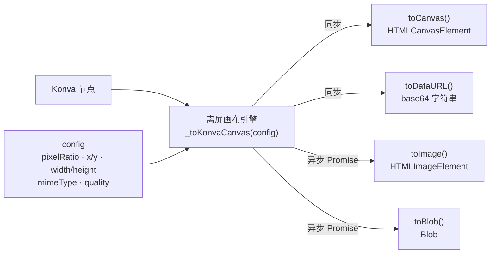

import { Canvas, Controls, Meta } from '@storybook/addon-docs/blocks';
import * as Export from './export.stories';

<Meta of={Export} name="Docs" />

# 导出

Konva 的导出把任意节点（`Stage`、`Layer`、`Group` 到单个 `Shape`）当前的画面渲染成一个可独立使用的图像产物——`HTMLCanvasElement`、base64 字符串、`HTMLImageElement` 或 `Blob`。四个方法共享同一个引擎：先把节点画进一张离屏画布（像素尺寸由 `pixelRatio` 决定），再转换成你要的格式。理解了这层共享，就掌握了全部四个方法的行为——同一份配置对象（`pixelRatio` / `x` / `y` / `width` / `height` / `mimeType` / `quality`）对它们完全等价。



| 方法 / 默认 | 产物 | 调用 | 回查要点 |
| --- | --- | --- | --- |
| `node.toCanvas(config)` | `HTMLCanvasElement` | 同步 | 画布的 `width`/`height` = 节点尺寸 × `pixelRatio` |
| `node.toDataURL(config)` | base64 字符串 | 同步 | `mimeType` 默认 `image/png`；`quality` 仅 jpeg 有效 |
| `node.toImage(config)` | `HTMLImageElement` | 异步 Promise | 需 `.then(img => …)` 或 `await` |
| `node.toBlob(config)` | `Blob` | 异步 Promise | 适合 `URL.createObjectURL` / 下载 / 上传 |
| `pixelRatio` | — | — | 默认 `1`；`2` 让导出像素尺寸翻倍 |
| `x` / `y` / `width` / `height` | — | — | 不传则取节点 `getClientRect()` |
| `imageSmoothingEnabled` | — | — | 默认 `true`；`false` 关闭缩放插值 |

## 导出方法

四个方法接受同一个 config 对象，区别只在返回的产物类型和调用方式：

```ts
import Konva from 'konva';

// 同一份配置对四个方法完全等价
const cfg = { pixelRatio: 2 };

stage.toCanvas(cfg);               // HTMLCanvasElement，同步
stage.toDataURL(cfg);              // 'data:image/png;base64,…'，同步
stage.toImage(cfg).then(setImg);   // Promise<HTMLImageElement>，异步
stage.toBlob(cfg).then(save);      // Promise<Blob>，异步
```

`toCanvas()` 直接返回引擎画好的原生 `HTMLCanvasElement`，可以立刻拿到 `.width` / `.height`、`getContext('2d')` 继续处理，或插回 DOM。`toDataURL()` 在它外面套一层 `canvas.toDataURL(mimeType, quality)`，给你一段可直接放进 ``、CSS 或 `<a download>` 的 base64 字符串。`toImage()` 把这段 data URL 包成一个加载完成的 `Image`（异步，因为图片解码要时间）；`toBlob()` 走 `canvas.toBlob()` 给你一个二进制 `Blob`。

按用途选择：

- 要继续用 Canvas API 处理 / 贴到别处画 → `toCanvas`
- 要内联进 HTML / CSS、或放进 `` 立即可用 → `toDataURL`
- 要异步拿到 `Image`（例如贴回另一个 `Konva.Image`）→ `toImage`
- 要下载或上传 → `toBlob`（配合 `URL.createObjectURL` 或 `FormData`）

下面的实例把同一个源舞台的四种产物并排呈现。左侧是源场景，右侧是导出产物预览；调整「导出方法」「pixelRatio」「图片格式」「JPEG 质量」，观察产物类型、导出尺寸与数据大小的变化。所有方法共用同一份 config，引擎完全等价。

<Canvas of={Export.Interactive} />
<Controls of={Export.Interactive} />

| 读者操作 | 可观察证据 |
| --- | --- |
| 切换「导出方法」 | 「产物类型」「调用方式」同步变化；右侧预览实时刷新 |
| 调高「pixelRatio」 | 「导出尺寸」按倍数放大（如 2× → 宽高翻倍），「数据大小」快速增加 |
| 把「图片格式」切到 image/jpeg | 「数据大小」显著下降；quality 越小文件越小 |
| 打开 Show code | 看到该 Canvas 实际执行的 `example.ts` |

## 高清导出：pixelRatio

默认 `pixelRatio: 1` 在 Retina 这类 `devicePixelRatio = 2` 的屏幕上导出来会糊：它只画了 CSS 像素数那么大的位图，放大到物理像素就模糊。Konva 的形状（`Rect`、`Circle`、`Text`、`Path` 等）存的是矢量数据，导出时引擎按 `pixelRatio` 重绘，线条和文字依然锐利，所以 `pixelRatio` 是高清导出的核心开关。

`pixelRatio: 2` 让一个 500×500 的舞台导出成 1000×1000：

```ts
const dataURL = stage.toDataURL({
  pixelRatio: window.devicePixelRatio || 1,
});
```

代价是数据大小约按**平方**增长（面积放大 4 倍，文件也接近 4 倍）。匹配屏幕用 `window.devicePixelRatio`，要打印或二次裁剪则按需取更大的值。

一个例外：`Konva.Image`（位图）和 `cache()` 之后的节点本身是位图，提高 `pixelRatio` 只是放大同样的像素，不会凭空增加细节，只能依赖插值。要真正更清晰，得用更高分辨率的源图。

## 区域导出

`x` / `y` / `width` / `height` 决定导出区域的左上角和尺寸（节点坐标系）。不传时，引擎用节点的 `getClientRect()`：

- `Stage` / `Layer` / `Group`（`Stage` 继承自 `Container`）取**所有可见子节点的包围盒并集**；
- 单个 `Shape` 取它自身的包围盒（默认含描边）。

```ts
// 只导出舞台左上角 200×100 的区域
stage.toDataURL({ x: 0, y: 0, width: 200, height: 100, pixelRatio: 2 });

// 导出单个形状：默认就是它的包围盒
shape.toDataURL({ pixelRatio: 2 });

// 想把形状按它在舞台里的实际位置导出，要显式给整块区域
stage.toDataURL({ x: 0, y: 0, width: stage.width(), height: stage.height(), pixelRatio: 2 });
```

所以当一个舞台没有铺满的背景、内容又偏在一角时，`stage.toDataURL()` 默认产物可能比舞台小。要稳定地导出整个舞台，显式传 `width` / `height` = `stage.width()` / `stage.height()`（本课实例就是这么做的）。`getClientRect()` 只看可见绘制范围、不受 `clip` 影响。

## 格式与压缩：mimeType 与 quality

- `image/png`（默认）：无损、支持 alpha 透明。文件偏大。
- `image/jpeg`：有损、**无 alpha**。`quality`（0–1）控制压缩率，越小文件越小、画质越低；只有 jpeg 有效，png 会忽略。

```ts
stage.toDataURL({ mimeType: 'image/jpeg', quality: 0.8 });
```

透明陷阱：舞台默认背景透明。导出 jpeg 时，原本透明的像素会被填成**黑色**（Canvas 规范行为，不是 Konva 的选择）。如果目标是 jpeg，先在场景里铺一个填满舞台的背景 `Rect`；要保留透明就只能用 png。

## 最佳实践

- **下载优先用 `toBlob` + object URL，不用 `toDataURL`。** data URL 是 base64，体积约比二进制大 33%，大字符串还会拖慢 DOM 和内存。`Blob` 配合 `URL.createObjectURL` 更省：
  ```ts
  stage.toBlob({ pixelRatio: 2 }).then((blob) => {
    const url = URL.createObjectURL(blob);
    const link = document.createElement('a');
    link.download = 'scene.png';
    link.href = url;
    link.click();
    URL.revokeObjectURL(url);
  });
  ```
- **带滤镜的节点必须先 `cache()`。** Konva 的滤镜在 `node.cache()` 时才烘焙进离屏画布，导出走的是 `drawScene`，会绘制缓存结果。没 cache 的滤镜节点导出后看不到滤镜效果；改了影响滤镜的属性后要重新 `cache()`。
- **跨域图片要标 `crossOrigin`。** 画布只要画了无 CORS 头的跨域图片就被「污染」，之后任何 `toDataURL` / `toBlob` 都会抛 `SecurityError`。给 `HTMLImageElement` 设 `crossOrigin = 'anonymous'`，且服务器要返回相应的 CORS 头。

## 常见问题

- 导出时报 `SecurityError` / `Tainted canvas`
  画布被跨域图片污染了。给所有贴进 `Konva.Image` 的 `HTMLImageElement` 设 `crossOrigin = 'anonymous'`，并确保图片服务器返回 `Access-Control-Allow-Origin`。已经被污染的画布无法「解毒」，只能换源重画。
- 导出的图片模糊
  `pixelRatio` 用了默认 `1`。按目标显示设备的 `devicePixelRatio` 调高，或直接设 `2` / `3`；矢量节点放大仍清晰，位图（`Konva.Image`、`cache()` 后的节点）不会凭空变清晰。
- 导出 jpeg 后背景变黑
  jpeg 不支持透明，舞台默认透明背景被填成黑色。在场景最底层加一个填满舞台的背景 `Rect`，或改用 png。
- `toImage()` / `toBlob()` 拿不到结果，却当同步用了
  它们返回 `Promise`，必须 `.then()` 或 `await`。直接同步赋值拿到的是一个 Promise 对象，而不是图像。
- `stage.toDataURL()` 导出的图比舞台小
  默认导出区域是 `getClientRect()`（可见子节点的包围盒并集），没有铺满背景时它可能只覆盖内容那一块。显式传 `x: 0, y: 0, width: stage.width(), height: stage.height()` 固定为整个舞台。

## 总结回顾

摘要：

Konva 的四种导出方法（`toCanvas` / `toDataURL` / `toImage` / `toBlob`）共享同一个离屏画布引擎，配置对象完全一致：`pixelRatio` 决定像素尺寸，`x` / `y` / `width` / `height` 决定裁剪区域（不传则取节点 `getClientRect()`），`mimeType` 与 `quality` 决定压缩。`toCanvas` 和 `toDataURL` 同步返回，`toImage` 和 `toBlob` 返回 `Promise`。高清导出靠调高 `pixelRatio`——矢量节点保持清晰，位图节点不能凭空增细节。jpeg 无 alpha，透明背景会变黑；跨域图片会污染画布导致导出抛 `SecurityError`。下载场景优先用 `toBlob` + object URL。

一句话：

> 四种导出方法共享同一引擎与配置，区别只在产物格式与同步异步；清晰度看 pixelRatio，体积看 mimeType 与 quality。

知识要点：

- 四种导出方法各自返回什么？哪些同步、哪些异步？
- `pixelRatio` 如何影响导出的像素尺寸与数据大小？
- `x` / `y` / `width` / `height` 不传时，导出区域默认取什么？
- 为什么 jpeg 导出后透明区域变黑？怎样避免？
- 跨域图片为什么会让导出抛 `SecurityError`？

## 参考资料

- [Konva 高清导出（pixelRatio）](https://konvajs.org/docs/data_and_serialization/High-Quality-Export.html)
- [Konva 画布截图（stage.toDataURL）](https://konvajs.org/docs/data_and_serialization/Stage_Data_URL.html)
- [Konva.Node API（toCanvas / toDataURL / toImage / toBlob）](https://konvajs.org/api/Konva.Node.html)
- [Konva 数据与序列化最佳实践](https://konvajs.org/docs/data_and_serialization/Best_Practices.html)
