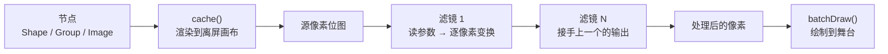

import { Canvas, Controls, Meta } from '@storybook/addon-docs/blocks';
import * as Filters from './filters.stories';

<Meta of={Filters} name="Docs" />

# 滤镜

滤镜（Filter）是对节点像素的逐点变换——模糊、调色、反色、像素化等效果都由此实现。它操作的不是节点本身，而是节点 `cache()` 生成的离屏位图：`cache()` 把节点渲染成一张像素快照，滤镜再对这张快照做逐像素处理。因此 **`cache()` 是前提**——没有缓存就没有像素可供处理。套用滤镜固定三步：`cache()` → `filters([Fn])` → 设参数。Konva 在 `Konva.Filters` 下内置 20 个函数型滤镜，参数（如 `blurRadius`、`brightness`）都是节点上的 GetSet 属性，与缓存机制配合实现「改参数即重跑管线，改内容才需重缓存」的刷新策略。滤镜与缓存的性能侧详见「[缓存与性能](?path=/docs/cache-performance--docs)」。



常用滤镜的参数与默认值（默认值取自 Konva 源码 `Factory.addGetterSetter`）：

| 滤镜 | 参数属性 | 默认值 | 范围 | 说明 |
| --- | --- | --- | --- | --- |
| `Blur` | `blurRadius` | `0` | 整数 ≥ 0 | 高斯式模糊，值越大越模糊 |
| `Pixelate` | `pixelSize` | `8` | 整数 > 0 | 把相邻像素平均成色块 |
| `Noise` | `noise` | `0.2` | 0–1 | 随机加减各颜色通道 |
| `Brighten` | `brightness` | `0` | -1–1 | 加法亮度，正值增亮、负值变暗 |
| `Contrast` | `contrast` | `0` | -100–100 | 拉大或缩小明暗差距 |
| `RGB` | `red` / `green` / `blue` | `0` / `0` / `0` | 0–255 | 按亮度对各通道着色 |
| `RGBA` | 同 RGB + `alpha` | + `1` | alpha 0–1 | 在 RGB 基础上增加透明度 |
| `HSL` | `hue` / `saturation` / `luminance` | `0` / `0` / `0` | hue 0–359，其余 -1–1 | 色相 / 饱和度 / 亮度 |
| `HSV` | `hue` / `saturation` / `value` | `0` / `0` / `0` | 同上 | 色相 / 饱和度 / 明度 |
| `Threshold` | `threshold` | `0.5` | 0–1 | 亮度高于阈值变白、低于变黑 |
| `Grayscale` / `Invert` / `Sepia` | — | — | — | 无参数，直接灰度 / 反色 / 棕褐 |

## 套用滤镜

套用滤镜固定三步：先 `cache()` 让节点生成离屏位图，再 `filters()` 传入滤镜函数数组，最后设参数值。少了 `cache()`，滤镜函数没有像素可处理，画面不会有任何变化。

```ts
const group = new Konva.Group();
layer.add(group);
// … 往 group 里添加子节点 …

group.cache();                              // 1. 缓存：生成离屏像素位图
group.filters([Konva.Filters.Blur]);         // 2. 指定滤镜（数组，可放多个）
group.blurRadius(10);                        // 3. 设参数（blurRadius 默认 0 = 不模糊）
layer.batchDraw();                           // 触发重绘
```

下面的实例把这套流程接上控件。场景是一组多彩图形（渐变背景 + 圆 + 星 + 环 + 文字），套用滤镜后效果一目了然。选择「滤镜」切换效果，拖「强度」调节参数——注意读数「缓存次数」始终为 1，印证改参数不会重新缓存。

<Canvas of={Filters.FilterDemo} />
<Controls of={Filters.FilterDemo} />

| 读者操作 | 可观察证据 |
| --- | --- |
| 切换「滤镜」 | 场景呈现对应效果（Blur 变糊、Pixelate 出马赛克、Grayscale 变灰…） |
| 拖「强度」 | 滤镜参数与画面同步变化（读数显示映射后的实际值，如 `blurRadius = 20`） |
| 看读数「缓存次数」 | 始终为 1——无论怎么切滤镜、调强度，`cache()` 没有被重复调用 |
| 切到 Grayscale / Invert / Sepia | 无参数效果直接生效，「参数」读数显示「无参数」，强度滑块不生效 |

`filters()` 接收的是**函数引用数组**，不是字符串。每个滤镜都是 `Konva.Filters` 上的命名导出，如 `Konva.Filters.Blur`、`Konva.Filters.Pixelate`。滤镜函数本身不存储状态——它从节点上读取参数（`node.blurRadius()`），因此设置参数和指定滤镜可以按任意顺序，只要在 `batchDraw()` 前都设好即可。清空滤镜时传空数组：`node.filters([])`。

## 常用滤镜

Konva 内置 20 个函数型滤镜，按处理目标分成三类：

| 类别 | 滤镜 | 做什么 |
| --- | --- | --- |
| 结构 | `Blur`、`Pixelate`、`Emboss`、`Kaleidoscope` | 改变像素的空间分布（模糊、块化、浮雕、万花筒） |
| 颜色 | `Brighten`、`Contrast`、`RGB`、`RGBA`、`HSL`、`HSV`、`Enhance`、`Posterize` | 调整颜色通道或映射 |
| 风格化 | `Grayscale`、`Invert`、`Sepia`、`Threshold`、`Mask`、`Noise`、`Solarize` | 整体色调或二值化变换 |

用上方实例的「滤镜」选择器切换到对应效果，配合「强度」滑块，即可直观感受各类滤镜的区别。下面按类别说明参数含义。

### 模糊与像素化

`Blur` 和 `Pixelate` 都改变像素的空间分布，但方式不同：

- **`Blur`**（`blurRadius`，默认 0）—— 对每个像素做盒式模糊（box blur），`blurRadius` 是迭代半径，值越大越模糊。它是边缘扩散型滤镜：模糊会向节点边界外延伸，如果缓存区域没有留余量，边缘会被硬切。给 `cache()` 传 `offset` 可以给模糊留出像素空间。

- **`Pixelate`**（`pixelSize`，默认 8）—— 把画面划分成 `pixelSize × pixelSize` 的格子，每格取平均色重绘，形成马赛克效果。`pixelSize` 必须 > 0。

同类的 `Emboss`（浮雕，参数 `embossStrength` / `embossWhiteLevel` / `embossDirection` / `embossBlend`）和 `Kaleidoscope`（万花筒，参数 `kaleidoscopePower` / `kaleidoscopeAngle`）用于更特殊的结构效果。

### 颜色调整

颜色滤镜各有独立参数，控制不同的颜色维度：

- **`Brighten`**（`brightness`，默认 0，范围 -1–1）—— 加法亮度。对每个像素的 RGB 值加上 `brightness × 255`，正值增亮、负值变暗。
- **`Contrast`**（`contrast`，默认 0，范围 -100–100）—— 对比度。以中灰为支点拉大或缩小明暗差距。
- **`RGB`**（`red` / `green` / `blue`，默认 0，范围 0–255）—— 按各像素亮度的比例对三个通道着色。设 `red=255, green=0, blue=0` 会得到红色调的单色效果。`RGBA` 在此基础上增加 `alpha`（默认 1，范围 0–1）。
- **`HSL`**（`hue` / `saturation` / `luminance`，默认 0）—— 色相（0–359）、饱和度与亮度（-1–1）。`HSV` 参数名相同，只是色彩模型从 HSL 换成 HSV。

### 风格化与二值化

这类滤镜做整体色调变换，多数无参数，套上即生效：

- **`Grayscale`** —— 按亮度公式把彩色转为灰度，无参数。
- **`Invert`** —— 反转所有颜色通道（255 − 原值），无参数。
- **`Sepia`** —— 棕褐色调，无参数。
- **`Threshold`**（`threshold`，默认 0.5，范围 0–1）—— 按亮度二值化：高于阈值变白、低于变黑。
- **`Noise`**（`noise`，默认 0.2，范围 0–1）—— 给各通道叠加随机偏移，值越大噪点越密。

此外还有 `Mask`（蒙版，`threshold` 默认 0）、`Solarize`（中途曝光）和 `Posterize`（色调分离，`levels` 默认 0.5）等，用途较窄。

## 组合滤镜

`filters()` 接收数组，放入多个滤镜函数即可让它们**按数组顺序链式处理**——每个滤镜接手的是上一个滤镜的输出像素，最终结果是整条管线的累积效应。

```ts
group.filters([
  Konva.Filters.Blur,       // 先模糊
  Konva.Filters.Brighten,   // 再提亮（作用于模糊后的像素）
  Konva.Filters.Contrast,   // 最后调对比度（作用于模糊+提亮后的像素）
]);
group.blurRadius(6);
group.brightness(0.15);
group.contrast(25);
```

下面的实例固定叠加 Blur + Brighten + Contrast 三个滤镜，分别拖动三个参数即可观察它们在管线中的叠加效果。

<Canvas of={Filters.CombineDemo} />
<Controls of={Filters.CombineDemo} />

| 读者操作 | 可观察证据 |
| --- | --- |
| 调 `blurRadius` | 模糊程度变化；它最先处理，影响后续提亮和对比度的输入 |
| 调 `brightness` | 亮度变化；作用于已经模糊的像素 |
| 调 `contrast` | 对比度变化；作用于模糊 + 提亮后的结果 |

滤镜顺序会影响最终效果。同样是 Blur + Contrast，先模糊再调对比度与先调对比度再模糊，结果不同——后者保留更多边缘细节。组合时先做结构变换（Blur / Pixelate），再做颜色调整（Brighten / Contrast / RGB），最后做风格化（Grayscale / Invert / Threshold），是常见的稳妥顺序。

## 缓存与刷新

滤镜与缓存的刷新关系是本课最容易踩坑的地方，记住一条判断线：**改参数不重缓存，改内容才重缓存。**

- **改滤镜参数**（`blurRadius`、`brightness` 等）—— **不需要重新 `cache()`**。Konva 会标记缓存为「滤镜过期」，下次绘制时自动从原始缓存源重新跑滤镜管线。上方实例的读数「缓存次数」始终为 1 就是证据。
- **改 `filters()` 数组**（增删滤镜）—— 也不需要重新缓存，同上。
- **改节点内容**（修改子节点、`fill`、`x` / `y`、尺寸、缩放等）—— **需要重新 `cache()`**。缓存位图记录的是 `cache()` 那一刻的画面，内容变了但没重缓存，滤镜处理的仍是旧画面。

```ts
// 改参数：不需要重缓存
node.blurRadius(20);
layer.batchDraw();

// 改内容：必须重缓存
node.fill('#ff0000');
node.cache();               // 重新生成离屏位图
layer.batchDraw();
```

不再需要滤镜时，用 `node.filters([])` 清空滤镜数组即可。要彻底移除缓存（同时移除滤镜），调用 `node.clearCache()`——节点回到每帧重新绘制的正常渲染模式，释放缓存占用的内存。

`cache()` 接收可选配置对象，常用的有 `x` / `y` / `width` / `height`（指定缓存区域的边界框）和 `offset`（四周扩大缓存画布 N 像素，给 Blur 等边缘扩散型滤镜留出空间）。

## 常见问题

- **套用了滤镜但画面毫无变化。**
  忘了 `cache()`。函数型滤镜操作的是 `cache()` 生成的离屏位图，没有缓存就没有像素可处理。确认在 `filters()` 之前调用了 `node.cache()`。
- **改了节点的 `fill` / 位置 / 子节点，滤镜效果还停留在旧画面。**
  缓存位图只记录 `cache()` 那一刻的画面，内容变了没重缓存，滤镜处理的仍是旧位图。在修改内容之后重新 `node.cache()`，再 `batchDraw()`。
- **`Blur` 在节点边缘出现硬切。**
  模糊会向边界外延伸，如果缓存区域没有余量就会被截断。给 `cache()` 传 `offset`（如 `node.cache({ offset: 10 })`），四周扩大缓存画布给模糊留出像素空间。
- **动画（Tween / Animation）驱动一个带滤镜的节点，画面不动或效果异常。**
  `cache()` 把节点冻结成位图，动画改的是属性、画面却仍用旧位图。先 `node.clearCache()`（或在动画开始前不缓存），让动画作用于真实绘制；动画结束后如果仍需滤镜，再重新 `cache()` + `filters()`。

## 总结回顾

摘要：

滤镜是对节点 `cache()` 生成的离屏位图做逐像素变换，因此 `cache()` 是套用滤镜的前提。套用三步固定不变：`cache()` → `filters([Fn])` → 设参数。Konva 在 `Konva.Filters` 下内置 20 个函数型滤镜，按结构（Blur / Pixelate / Emboss / Kaleidoscope）、颜色（Brighten / Contrast / RGB / RGBA / HSL / HSV / Enhance / Posterize）和风格化（Grayscale / Invert / Sepia / Threshold / Mask / Noise / Solarize）三类划分，各滤镜参数都是节点上的 GetSet 属性，默认值取自 `Factory.addGetterSetter`。多个滤镜按 `filters()` 数组顺序链式处理，顺序会影响最终结果。刷新策略的判断线是「改参数不重缓存，改内容才重缓存」——改 `blurRadius` 等参数只触发从原始缓存源重新跑管线，改 `fill` 或子节点等内容才需重新 `cache()`；不再需要滤镜时用 `filters([])` 清空或 `clearCache()` 彻底移除缓存。

一句话：

> 滤镜操作的是 cache() 的像素快照：先缓存、再指定滤镜数组、最后设参数，改参数不重缓存、改内容才重缓存。

知识要点：

- 套用滤镜的固定三步是什么？少了哪一步滤镜就不会生效？
- `Blur`、`Pixelate`、`Brighten`、`Contrast`、`Threshold` 各自的参数属性和默认值是什么？
- 改 `blurRadius` 是否需要重新 `cache()`？改节点的 `fill` 呢？
- 多个滤镜放入 `filters()` 数组时，处理顺序是怎样的？
- `Blur` 在节点边缘出现硬切时该怎么解决？

## 参考资料

- [Konva API — Konva.Filters（全部 20 个滤镜函数）](https://konvajs.org/api/Konva.Filters.html)
- [Konva API — Konva.Node（cache / clearCache / filters 方法与滤镜参数属性）](https://konvajs.org/api/Konva.Node.html)
- [Konva 文档 — Filters 教程目录（Blur / Pixelate / Multiple Filters 等）](https://konvajs.org/docs/filters/Blur.html)
