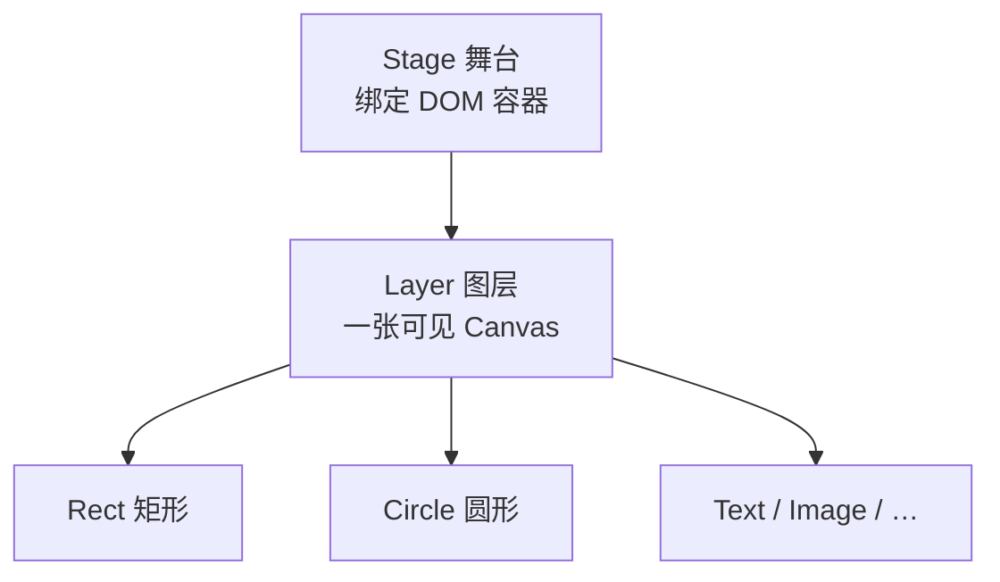

import { Canvas, Controls, Meta } from '@storybook/addon-docs/blocks';
import * as FirstScene from './first-scene.stories';

<Meta of={FirstScene} name="Docs" />

# 安装与第一个场景

Konva 把原生 Canvas 封装成一棵对象树：**Stage**（舞台）绑定页面上的一个 DOM 容器，Stage 里放 **Layer**（图层），Layer 里放 **Shape**（矩形、圆等具体形状）。你只需创建对象、设置属性，Konva 负责把整棵树渲染成 Canvas 像素，并在你改动后自动刷新——不必手写 `ctx.fillRect` 那样的绘制循环。

本课把 Konva 装进项目，搭出最小可见场景，并验证改属性能实时反映到画面。



核心对象的职责与最小数量：

| 对象 | 职责 | 最小场景 | 必填配置 |
| --- | --- | --- | --- |
| Stage | 绑定 DOM 容器的舞台根节点 | 1 | `container` |
| Layer | 图层，每个 Layer 对应一张可见 Canvas | 1 | — |
| Shape | 矩形、圆等具体可见形状 | 1+ | 因形状而异 |

刷新关键事实：

- `Konva.autoDrawEnabled` 默认 `true`：添加节点或改属性后，Konva 自动调度一次 `batchDraw()`。
- `batchDraw()` 把绘制推迟到下一帧（`requestAnimationFrame`），多次快速改动会合并成一次重绘。

## 安装 Konva

npm（推荐）：

```bash
npm install konva
```

CDN——直接引入全局变量 `Konva`，无需打包：

```html
<script src="https://unpkg.com/konva@10/konva.min.js"></script>
```

ES 模块项目中导入：

```ts
import Konva from 'konva';
```

## 搭建最小场景

三步画出画面：建 Stage → 建 Layer 并加入 Stage → 建 Shape 并加入 Layer。

```ts
import Konva from 'konva';

// 1. 舞台：绑定 DOM 容器，给定宽高
const stage = new Konva.Stage({
  container: 'app', // DOM 元素或选择器，Stage 会把自己的 canvas 放进去
  width: 480,
  height: 320,
});

// 2. 图层：每个 Layer 对应一张可见 Canvas
const layer = new Konva.Layer();
stage.add(layer);

// 3. 形状：具体可见内容
const rect = new Konva.Rect({
  x: 60,
  y: 90,
  width: 180,
  height: 110,
  fill: '#4f7cff',
  cornerRadius: 10,
});
layer.add(rect);

const circle = new Konva.Circle({
  x: 360,
  y: 160,
  radius: 56,
  fill: '#22c55e',
});
layer.add(circle);
```

`container` 是 Stage 唯一必填的配置项，传 DOM 元素或选择器字符串均可；Stage 会在该容器内创建自己的 canvas。下面的实例就是这段代码的可交互版本——矩形和圆都在同一个 Layer 上。

<Canvas of={FirstScene.Interactive} />
<Controls of={FirstScene.Interactive} />

| 读者操作 | 可观察证据 |
| --- | --- |
| 打开页面 | 看到一个蓝色圆角矩形和一个绿色圆——最小场景已渲染 |
| 调整「圆形半径」 | 圆的大小实时变化，左下角「圆形半径」读数同步更新 |
| 调整「矩形圆角」 | 矩形四个角的弧度实时变化 |
| 缩放浏览器窗口 | 「Stage 尺寸」读数跟随容器变化，两个形状自动重新居中 |

读数里的 **图层数 = 1**、**图层子节点 = 2** 直接反映了这棵树：一个 Layer，里面挂着 Rect 和 Circle 两个 Shape。

## 改属性就刷新

场景搭好后，改任何属性都会自动反映到画面，无需手动调用 `draw()`：

```ts
circle.radius(80);    // 圆变大——画面自动更新
rect.fill('#ef4444'); // 矩形变红——画面自动更新
```

原理：每个属性 setter 内部都会调用 `_requestDraw()`。当 `Konva.autoDrawEnabled` 为 `true`（默认）时，它找到所属的 Layer 并调用 `batchDraw()`，把绘制排到下一帧。上面的「圆形半径」滑块就是在调 `circle.radius(value)`——你拖动时看到的就是 auto-draw 在工作。

少数情况需要手动触发重绘：

- `stage.batchDraw()` / `layer.batchDraw()`——主动安排一次重绘（例如批量改了大量属性后想确保下一帧绘制）。
- `stage.draw()` / `layer.draw()`——立即同步绘制，跳过 rAF 合并，较少使用。
- 设 `Konva.autoDrawEnabled = false` 可全局关闭自动刷新，只在需要完全掌控重绘时机时使用。

完整的坐标系、分层策略和重绘性能细节见 [1.2 核心架构](?path=/docs/architecture--docs)。

## 总结回顾

摘要：

Konva 用 Stage / Layer / Shape 三层把 Canvas 封装成对象树。安装后只需三步——建 Stage（绑 DOM 容器）、建 Layer 加入 Stage、建 Shape 加入 Layer——就能得到可见画面。Stage 的 `container` 是唯一必填配置。改任何属性都会自动触发 `batchDraw()`，画面在下一帧刷新，不必手写绘制循环。

一句话：

> 最小场景 = 一个 Stage + 一个 Layer + 至少一个 Shape；改属性即刷新。

知识要点：

- 怎样安装 Konva？
- Stage / Layer / Shape 三者各自的职责是什么？
- 最小场景至少需要几个对象？
- Stage 的哪个配置项是必填的？
- 改了属性后画面为什么能自动更新？

## 参考资料

- [安装与概述（官方文档）](https://konvajs.org/docs/index.html)
- [Konva.Stage API](https://konvajs.org/api/Konva.Stage.html)
- [Konva.Layer API](https://konvajs.org/api/Konva.Layer.html)
- [Konva.Rect API](https://konvajs.org/api/Konva.Rect.html)
- [Konva.Circle API](https://konvajs.org/api/Konva.Circle.html)
