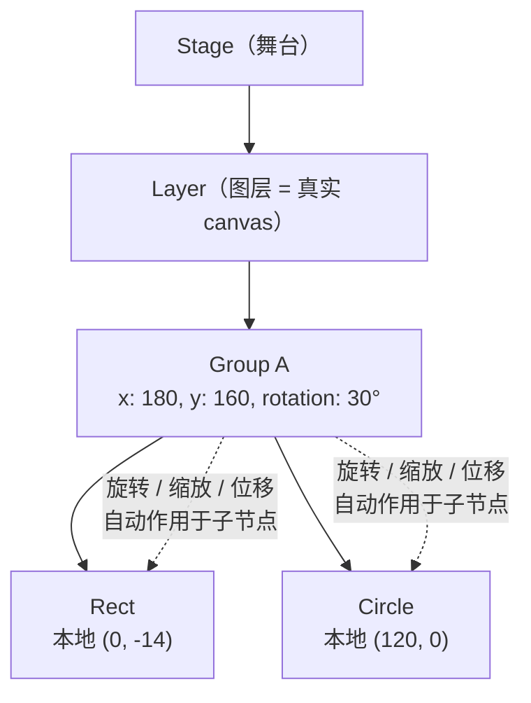

import { Canvas, Controls, Meta } from '@storybook/addon-docs/blocks';
import * as Group from './group.stories';

<Meta of={Group} name="Docs" />

# 分组

Group 是 Konva 里把多个节点打包成一个整体的容器节点。它继承自 `Konva.Container`（进而继承 `Konva.Node`），本身不绘制任何图形，但可以容纳 Shape、其他 Group，或两者混合。Stage 与 Layer 的层级结构在「[核心架构](?path=/docs/architecture--docs)」一课展开；本课聚焦 Group 特有的三件事：**变换继承**——子节点活在 Group 的本地坐标系里，Group 的位移、旋转、缩放会作用到所有子节点上；**子节点管理**——如何向 Group 添加、查找和销毁子节点；以及**裁剪区域**——如何用 Group 限制子节点的可见范围。

理解 Group 最重要的一点：**子节点的 `x`/`y` 不是舞台坐标，而是相对于 Group 的本地坐标**。当你旋转 Group 时，所有子节点绕 Group 的原点（本地 `(0, 0)`）整体旋转，但每个子节点的 `x()`/`y()` 读数不会变——变的只是它在舞台上的绝对位置。这正是 Group 区别于「逐个移动形状」的关键：你可以像操作一个整体一样操作一组节点。



Group 继承自 Container / Node，自身没有独有属性。下表列出与 Group 用法最相关的继承属性（变换属性的完整语义见「[变换](?path=/docs/transform--docs)」一课）：

| 属性 | 默认值 | 对子节点的影响 |
| --- | --- | --- |
| `x` / `y` | `0` / `0` | Group 在父坐标系中的位置，决定子节点本地原点落在舞台的哪里 |
| `rotation` | `0` | 旋转角度（度），子节点绕 Group 原点整体旋转 |
| `scaleX` / `scaleY` | `1` / `1` | 缩放比例，子节点按比例整体缩放 |
| `offsetX` / `offsetY` | `0` / `0` | 变换中心偏移，改变旋转与缩放的支点 |
| `opacity` | `1` | 不透明度，与子节点自身 `opacity` 叠乘 |
| `clipX/Y/Width/Height` | `undefined` | 矩形裁剪区域（本地坐标），超出区域的子节点被隐藏 |
| `visible` | `true` | 设为 `false` 时 Group 及全部子节点不可见 |

## 变换继承

Group 的变换会**自动叠加**到每个子节点上。子节点不需要知道自己被旋转了——它只管自己的本地坐标，Konva 在绘制时把 Group 的变换矩阵和子节点自身的变换矩阵相乘，得到最终在舞台上的位置。

这意味着两件事：

- **本地坐标不变**：无论你怎么旋转、平移、缩放 Group，子节点的 `x()`/`y()`/`rotation()` 读数始终是它自己的本地值。
- **绝对位置变化**：子节点在舞台上的实际位置 = Group 变换 ∘ 子节点本地变换。用 `getAbsolutePosition()` 可以拿到这个叠加结果。

```ts
const group = new Konva.Group({
  x: 180,
  y: 160,
  rotation: 30,
});
layer.add(group);

// 子节点坐标相对 Group：这里是本地 (120, 0)，不是舞台坐标。
const circle = new Konva.Circle({
  x: 120,
  y: 0,
  radius: 16,
  fill: '#f59e0b',
});
group.add(circle);

circle.x();                       // 120 —— 本地坐标，永远不变
circle.y();                       // 0
circle.getAbsolutePosition();     // { x, y } —— 绝对坐标，随 Group 变换而变化
```

下面这个实例把一条「臂」（骨架线 + 中段矩形 + 末端圆）放进 Group，末端圆的本地坐标固定为 `(120, 0)`。拖动「组 x」「组 y」让整条臂平移，拖动「组 rotation」让整条臂绕原点（红色十字）旋转。读数会同时显示末端圆的本地坐标和绝对坐标——前者纹丝不动，后者随变换滑动。

<Canvas of={Group.Interactive} />
<Controls of={Group.Interactive} />

| 读者操作 | 可观察证据 |
| --- | --- |
| 拖「组 x」「组 y」 | 整条臂连同原点标记、本地坐标标签一起平移；虚线引导弧随之移动 |
| 拖「组 rotation」 | 整条臂绕红色十字旋转；末端圆沿虚线弧滑动；本地坐标标签跟着翻转 |
| 对比读数第二、三行 | 「圆 本地坐标」始终是 `(120, 0)`；「圆 绝对坐标」随 Group 变换而变化 |
| 打开 Show code | 看到该 Canvas 实际执行的 `example.ts`，其中 `getAbsolutePosition()` 取绝对坐标 |

末端圆的绝对坐标由 `getAbsolutePosition()` 计算得出。这个方法汇总从 Stage 到该节点的全部祖先变换，返回节点在舞台坐标系中的位置。当 `rotation = 0` 时，绝对坐标 = Group 位置 + 本地坐标；旋转后，本地坐标 `(120, 0)` 被旋转矩阵变换，绝对坐标落在虚线弧上。

`scaleX`/`scaleY`、`skewX`/`skewY` 和 `offsetX`/`offsetY` 的继承方式完全相同——都通过变换矩阵叠加。`opacity` 则是简单乘法：Group 的 `opacity` 与子节点自身的 `opacity` 相乘，得到最终渲染不透明度。

## 子节点管理

Group 作为容器，提供了一套与 DOM 类似的子节点 API。所有方法继承自 `Konva.Container` 或 `Konva.Node`。

| 方法 | 来源 | 作用 |
| --- | --- | --- |
| `add(child1, child2, ...)` | Container | 添加一个或多个子节点，返回 Container 自身 |
| `getChildren(filterFn?)` | Container | 返回直接子节点数组；可传过滤函数 |
| `find(selector)` | Container | 按选择器搜索后代，返回数组 |
| `findOne(selector)` | Container | 同 `find`，返回第一个匹配或 `undefined` |
| `destroyChildren()` | Container | 销毁所有子节点（释放内存） |
| `removeChildren()` | Container | 移除所有子节点（保留在内存中） |
| `remove()` | Node | 从父节点分离自身（保留在内存中，可重新挂载） |
| `destroy()` | Node | 分离并彻底销毁自身及全部子节点 |
| `moveTo(container)` | Node | 把节点移到另一个容器 |
| `moveToTop()` / `moveUp()` / `moveDown()` / `moveToBottom()` | Node | 调整在兄弟节点中的渲染顺序 |
| `zIndex(n)` | Node | 读取或设置在兄弟中的序号（仅对同级有效） |

### 添加与查找

```ts
const group = new Konva.Group();
layer.add(group);

// add 支持一次添加多个子节点。
group.add(rect, circle, text);

// getChildren 返回直接子节点。
group.getChildren();              // [Rect, Circle, Text]
group.getChildren('Circle');      // 只留 Circle（按类名过滤）

// find / findOne 支持多种选择器。
group.findOne('#myId');           // 按 id
group.find('.red');               // 按 name（空格分隔，可多个）
group.find('Circle');             // 按类型名
group.find('Circle, Rect');       // 逗号分隔的多选择器
```

`find` 会递归搜索所有后代（包括嵌套 Group 的子节点），`getChildren` 只返回直接子节点。

### 销毁与移除

```ts
// remove：从父节点分离，但节点仍在内存中，可以重新 add 到别处。
circle.remove();
group.add(circle);               // 重新挂载，本地坐标不变

// destroy：彻底销毁，释放事件监听和引用，之后不可再用。
circle.destroy();

// destroyChildren：一次性销毁 Group 的所有子节点。
group.destroyChildren();
```

清理场景时优先用 `destroy()` 而非 `remove()`——前者会释放内存和事件绑定，避免泄漏。`removeChildren()` 只把子节点从父节点分离，它们和它们的事件监听仍然存在于内存中。

### 移动到其他容器

```ts
// 把 circle 从当前 Group 移到另一个 Group。
circle.moveTo(otherGroup);

// 等价于：
circle.remove();
otherGroup.add(circle);
```

`moveTo` 保留节点的本地坐标。如果新父容器的变换不同，节点在舞台上的绝对位置会随之改变——这与「本地坐标不变、绝对位置取决于祖先变换」的规则一致。

## 裁剪区域

Group（和 Layer）可以设置裁剪区域，超出区域的子节点会被隐藏。裁剪坐标在 **Group 的本地坐标系**中，随 Group 的变换一起旋转和缩放。

### 矩形裁剪

用 `clipX`、`clipY`、`clipWidth`、`clipHeight` 定义一个矩形窗口：

```ts
const group = new Konva.Group({
  x: 50,
  y: 50,
  clipX: 0,
  clipY: 0,
  clipWidth: 200,
  clipHeight: 150,
});
layer.add(group);

// 这个圆的圆心在本地 (250, 75)，超出 clipWidth=200，右半部分被裁掉。
group.add(new Konva.Circle({ x: 250, y: 75, radius: 60, fill: '#4f7cff' }));
```

也可以用复合写法 `clip: { x, y, width, height }` 一次性设置四个值。

### 自定义路径裁剪

用 `clipFunc` 可以画任意形状的裁剪区域。它接收一个 Canvas 2D context，你在里面用标准路径 API 描边：

```ts
const group = new Konva.Group({
  clipFunc(ctx) {
    ctx.beginPath();
    ctx.arc(100, 100, 80, 0, Math.PI * 2);
  },
});
```

`clipFunc` 适合圆形、多边形、不规则形状等矩形无法表达的裁剪。两个 `arc` 调用可以叠加出复合区域（如两个相交的圆），这是矩形属性做不到的。

裁剪区域和子节点一起随 Group 变换——旋转 Group 时，裁剪窗口和子节点同步旋转，被裁掉的部分保持被裁掉。

## 总结回顾

摘要：

Group 继承自 `Konva.Container`，本身不绘制，用来把子节点组织成一个整体。它的核心机制是变换继承：子节点的坐标始终是相对 Group 的本地坐标，Group 的位移、旋转、缩放、偏斜和透明度会通过变换矩阵自动叠加到所有子节点上，但子节点自身的 `x()`/`y()` 读数永远不变——只有 `getAbsolutePosition()` 返回的绝对位置才会随 Group 变换而变化。子节点管理提供了 `add`、`find`/`findOne`、`destroyChildren`、`moveTo` 等 DOM 风格 API；`remove` 只分离不释放，`destroy` 彻底回收。裁剪区域用 `clipX/Y/Width/Height` 做矩形窗口，或用 `clipFunc` 画任意路径，坐标都在 Group 的本地空间。

一句话：

> Group 是变换的容器——子节点的坐标永远相对 Group，移动 Group 就是在移动它携带的全部节点。

知识要点：

- 子节点的 `x`/`y` 是相对 Group 的本地坐标，还是舞台坐标？
- 改变 Group 的 `rotation` 后，子节点的 `x()`/`y()` 读数会变吗？绝对位置会变吗？
- 用哪个方法可以拿到子节点在舞台上的实际位置？
- `remove()` 和 `destroy()` 的区别是什么？清理场景时该用哪个？
- `clip` 的坐标系是什么？`clipFunc` 和矩形裁剪各适合什么场景？

## 参考资料

- [Konva API — Konva.Group](https://konvajs.org/api/Konva.Group.html)
- [Konva API — Konva.Container](https://konvajs.org/api/Konva.Container.html)
- [Konva API — Konva.Node（getAbsolutePosition / remove / destroy / moveTo）](https://konvajs.org/api/Konva.Node.html)
- [Konva 教程 — Overview（Stage / Layer / Group 层级）](https://konvajs.org/docs/overview.html)
- [Konva 教程 — Clipping Function（clipFunc 自定义裁剪）](https://konvajs.org/docs/clipping/Clipping_Function.html)
